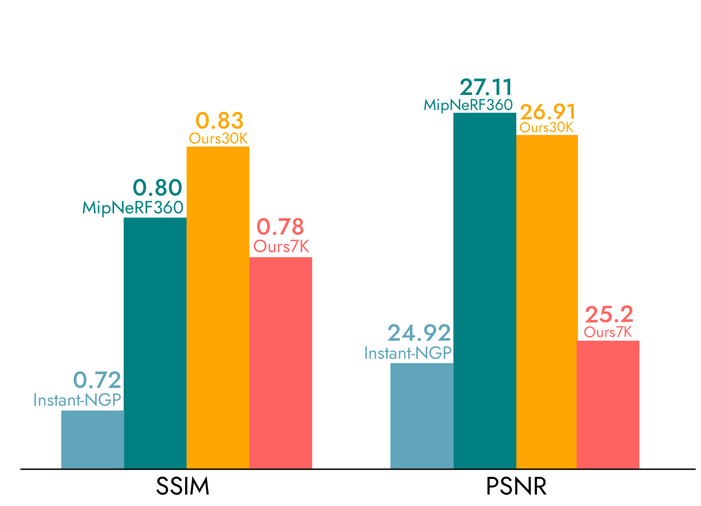
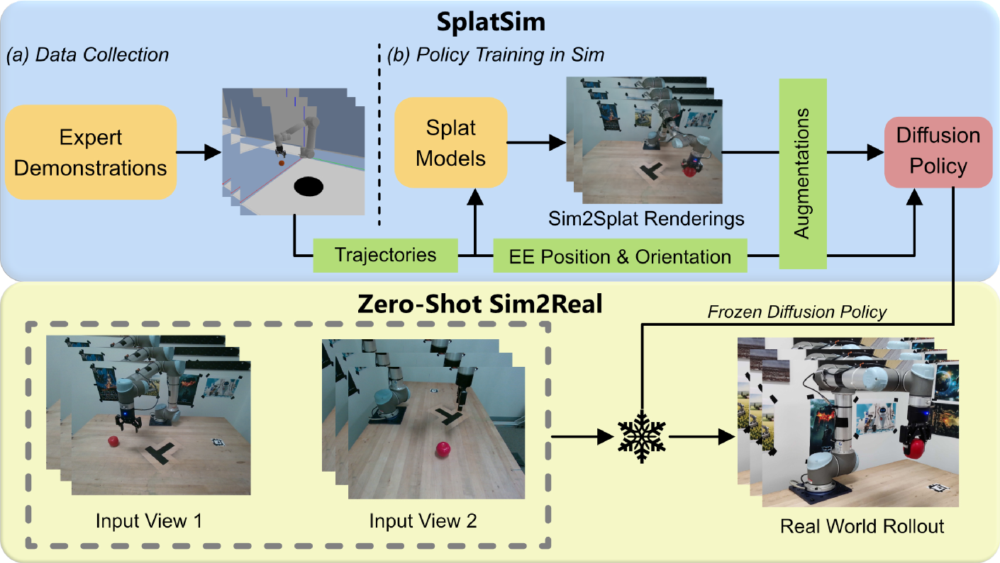
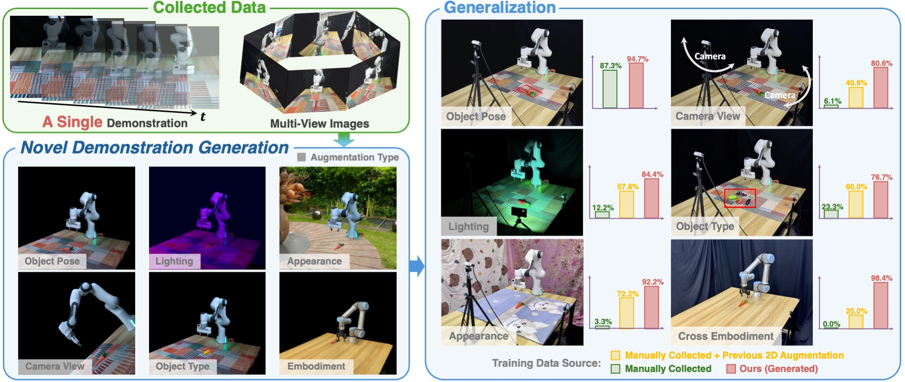
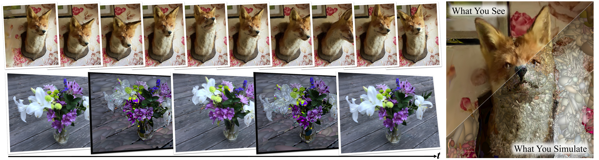
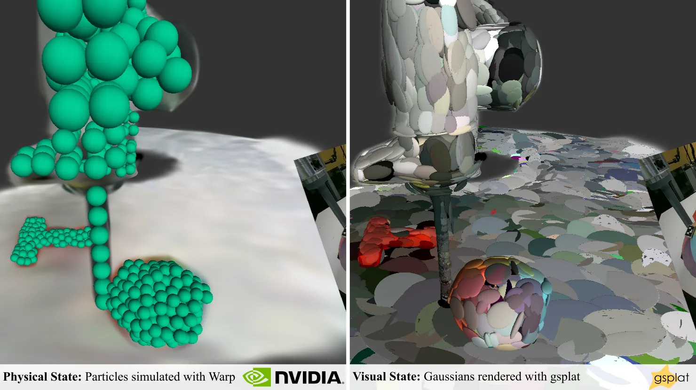

# 로봇에게 눈을 주다

_3D Gaussian Splatting이 바꾸는 합성데이터의 미래_

## Executive Summary

> [!callout]
> Physical AI의 핵심 과제는 모델이 아니라 데이터다. VLA(Vision-Language-Action) 모델 학습에는 수십만 건의 조작 궤적이 필요하지만, 실제 로봇으로 데이터를 수집하는 비용과 시간은 감당하기 어렵다. NVIDIA GR00T N1의 학습 데이터 구성이 이를 극명히 보여준다. 88시간의 실제 데이터에 780K 합성 궤적(6,500시간)을 더했으며, 합성데이터 비중이 약 **98%**에 달한다. 그런데 기존 시뮬레이터의 메시 기반 렌더링은 시각적 충실도에서 실세계와 큰 격차를 보여, 이 sim-to-real gap이 VLA 모델의 제로샷 전이를 가로막는 핵심 병목이었다.

> 3D Gaussian Splatting(3DGS)이 이 병목을 해소하고 있다. **100-200+ FPS**의 실시간 포토리얼리스틱 렌더링은 NeRF(1-5 FPS) 대비 수십 배 빠르면서도 동등한 시각 품질을 달성한다. SplatSim은 기존 물리 시뮬레이터의 메시를 3DGS로 교체하여 zero-shot sim-to-real **86.25%** 성공률을 기록했고, RoboSplat은 단 1개 실제 데모에서 3DGS 기반 6차원 증강만으로 **87.8%** 성공률을 달성해 수백 건의 실제 데모 + 2D 증강(57.2%)을 압도했다.

> NVIDIA 생태계는 이 결합을 산업 수준으로 끌어올리고 있다. NuRec(재구성) + Warp(물리) + Cosmos(생성 보강) + Marble(환경 생성)의 4중 스택이 엔터프라이즈급 파이프라인을 구성한다. Khronos glTF 3DGS 표준(2026 Q2 비준 예정)과 OpenUSD 3DGS 지원(2026년 4월 비준)은 3DGS를 "3D의 JPEG"로 공식화했다. 합성데이터 시장이 2024년 $310-576M에서 2030년 $1.79-3.7B로 성장(CAGR 35-42%)하는 가운데, 3DGS 기반 합성데이터의 품질 검증 인프라는 이 시장의 신뢰 계층이 된다.

> 페블러스에게 이 전환은 직접적이다. 페블로심(PebbloSim)은 Isaac Sim(물리 시뮬레이터) + 3DGS(실감 렌더링)를 동시 제어하는 시스템이며, 데이터그린하우스가 생성하는 합성데이터의 "zero-physical hallucination" 품질 보증이 핵심 가치다. 이 글은 [피지컬 AI](/project/PhysicalAI/ko/) 시리즈의 합성데이터 편으로, 로봇이 학습할 세계를 어떻게 그릴 것인가를 다룬다.

<!-- stat-card -->
**200+ FPS** — 3DGS 실시간 렌더링 속도 — NeRF(1-5 FPS) 대비 40-200배

<!-- stat-card -->
**780K** — 합성 궤적을 11시간 만에 생성 — GR00T N1, 실제 대비 591배 효율

<!-- stat-card -->
**+40%** — 합성+실제 혼합 학습 성능 — 실제 데이터만 사용 대비 향상폭

<!-- stat-card -->
**87.8%** — 1개 데모 sim-to-real 성공률 — RoboSplat, 수백 데모+2D(57%) 압도

<!-- stat-card -->
**$23B** — 체화 AI 시장 규모 (2030) — CAGR 39%, MarketsandMarkets

## Physical AI의 데이터 병목

Physical AI가 확장되지 못하는 이유는 모델의 한계가 아니다. 데이터의 한계다. 자율주행차가 수억 킬로미터의 주행 로그로 학습하듯, 로봇 팔도 수십만 건의 조작 궤적이 있어야 컵을 잡고, 서랍을 열고, 물건을 옮길 수 있다. 문제는 이 데이터를 실제 로봇으로 모으려면 물리적 시간과 비용이 기하급수적으로 늘어난다는 점이다.

### 1.1. GR00T N1이 보여주는 데이터의 현실

NVIDIA가 2025년 3월 GTC에서 공개한 GR00T N1의 학습 데이터 구성은 합성데이터의 필요성을 숫자로 증명한다. 실제 로봇 데이터는 88시간에 불과했지만, Isaac Sim으로 생성한 합성 궤적은 **780K건, 6,500시간**에 달했다. 합성데이터 비중이 약 98%. 그리고 이 780K 궤적을 생성하는 데 걸린 시간은 단 **11시간**이었다. 실제 데이터 대비 591배의 효율이다.

합성데이터를 섞어 학습한 모델은 실제 데이터만 사용한 모델 대비 **40% 높은 성능**을 기록했다. 합성데이터가 실제 데이터를 "보조"하는 수준을 넘어, 학습의 주축이 된 것이다.

### 1.2. VLA 모델들의 데이터 수요

GR00T N1만의 이야기가 아니다. Google DeepMind의 RT-2 후속 모델인 pi0는 **10,000시간+**의 데이터로 학습했고, OpenVLA는 Open X-Embodiment 데이터셋의 **970K 에피소드**를 활용했다. Open X-Embodiment 자체가 34개 연구소, 22종 로봇에서 수집한 **100만+ 궤적, 527개 스킬**의 집합체다. 이 규모의 실제 데이터를 단일 조직이 수집하는 것은 불가능에 가깝다.

### 1.3. 합성데이터 시장의 폭발

시장이 이 흐름을 확인해준다. Gartner는 2024년 기준 AI 프로젝트의 약 60%가 이미 합성데이터를 사용하고 있다고 추정했다. 합성데이터 시장 규모는 2024년 $310-576M에서 2030년 $1.79-3.7B로 성장할 전망이다(CAGR 35-42%). 체화 AI(Embodied AI) 시장은 더 가파르다. 2024년 $4.44B에서 2030년 **$23.06B**로, 연평균 39%씩 성장한다(MarketsandMarkets).

> [!callout]
> **핵심 시사점:** Physical AI의 확장을 가로막는 것은 모델의 크기나 아키텍처가 아니라 학습 데이터의 양과 질이다. 합성데이터는 선택이 아닌 필수이며, 문제는 "얼마나 사실적인 합성데이터를 만들 수 있는가"로 좁혀진다.

## 3DGS가 바꾸는 시뮬레이션

시뮬레이터로 합성데이터를 만드는 것 자체는 새로운 일이 아니다. MuJoCo, Isaac Sim, CoppeliaSim 같은 물리 시뮬레이터는 이미 로봇 연구의 표준 도구다. 문제는 렌더링이었다. 메시(mesh) 기반 래스터 렌더링은 속도는 빠르지만 실세계와 시각적 격차가 크고, 이 격차가 sim-to-real 전이를 가로막았다. NeRF는 시각 품질을 높였지만, 1-5 FPS의 렌더링 속도는 대규모 데이터 생성에 치명적이었다.

3D Gaussian Splatting(3DGS)은 이 딜레마를 동시에 해결한다.

*▲ 3DGS vs MipNeRF360 vs Instant-NGP 렌더링 품질 비교 (SSIM/PSNR) | Source: [Kerbl et al., SIGGRAPH 2023](https://repo-sam.inria.fr/fungraph/3d-gaussian-splatting/)*

### 2.1. 3DGS vs NeRF vs 래스터 비교

아래 표는 세 가지 렌더링 방식의 핵심 지표를 비교한 것이다. 3DGS는 NeRF의 시각 품질과 래스터의 속도 사이에서 최적의 균형점을 찾았다.

| 항목 | 3D Gaussian Splatting | NeRF | 래스터(Mesh) |
| --- | --- | --- | --- |
| 렌더링 FPS | 100-200+ | 1-5 | 1,000+ |
| 시각 품질 (PSNR) | 27.43 | 27.68 | 물리 사실성 제한 |
| 학습 시간 | 23분 (FastGS: 100초) | 30시간 | 해당 없음 |
| 표현 방식 | 명시적 (Gaussian 포인트) | 암묵적 (MLP) | 명시적 (메시/폴리곤) |
| Sim-to-Real 전이 | 86-88% zero/one-shot | 미검증 (속도 제약) | 낮음 (시각 갭) |
| 편집 용이성 | 직관적 (GS 교체/변형) | 어려움 (재학습 필요) | 높음 (전통 파이프라인) |
| 표준화 | glTF RC (2026 Q2), OpenUSD (2026.04) | 없음 | 성숙 (glTF, USD) |

********

NeRF의 PSNR(27.68)이 3DGS(27.43)보다 소폭 높은 것은 사실이다. 그러나 실시간 시뮬레이션에서는 속도가 결정적이다. 수십만 건의 궤적을 생성해야 하는 VLA 학습에서 1-5 FPS와 200+ FPS의 차이는 "연구실 프로토타입"과 "프로덕션 파이프라인"의 차이다.

### 2.2. SplatSim과 RoboSplat의 돌파

*▲ SplatSim 파이프라인: 시뮬레이터 메시를 Gaussian Splat으로 교체하여 zero-shot sim-to-real 전이 | Source: [Qureshi et al., 2024](https://arxiv.org/html/2409.10161v3)*

두 연구가 3DGS의 실용적 가치를 입증했다. CMU의 **SplatSim**(CoRL Workshop 2024)은 기존 물리 시뮬레이터(MuJoCo) 내 메시를 Gaussian Splat으로 교체하는 접근을 택했다. 물리 엔진은 건드리지 않고 렌더링만 바꿨을 뿐인데, zero-shot sim-to-real 성공률이 **86.25%**를 기록했다. 실제 데이터로 학습한 모델의 97.5% 대비 격차가 크게 줄어든 것이다.

*▲ RoboSplat: 1개 시연에서 6차원 증강(객체, 포즈, 외형, 조명, 시점, 로봇 체형) 생성 | Source: [Yang et al., RSS 2025](https://yangsizhe.github.io/robosplat/)*

InternRobotics의 **RoboSplat**(RSS 2025)은 한 발 더 나아갔다. 단 **1개의 실제 데모**에서 3DGS의 명시적 표현을 활용해 6차원 증강(객체 종류, 포즈, 외형, 조명, 시점, 로봇 체형)을 수행했다. 결과는 **87.8%** one-shot 성공률. 수백 건의 실제 데모 + 2D 증강(57.2%)을 압도했다. 3DGS의 명시적 포인트 표현이 직관적인 편집을 가능하게 한 덕분이다.

**RoboGSim**(arXiv 2024)은 더 근본적인 질문에 답했다. 3DGS 합성데이터만으로 학습한 모델이 실제 데이터로 학습한 모델과 동등하거나 우월한 성능을 보일 수 있는가? 답은 "그렇다"였다. 특히 새로운 시점이나 새로운 장면에서 합성데이터 학습 모델이 더 강한 일반화 성능을 보였다.

### 2.3. 표준화: "3D의 JPEG"를 향해

2026년은 3DGS 표준화의 원년이다. Khronos Group은 2026년 2월 **glTF KHR_gaussian_splatting** 릴리스 후보(RC)를 공개했으며, 2026 Q2 비준을 예상한다. Google, NVIDIA, Apple, Bentley Systems, Niantic, Cesium, Esri가 지지하고 있다. 같은 시기 **OpenUSD 3DGS 지원**이 2026년 4월 비준되어, NVIDIA Omniverse, Pixar, Apple Vision Pro 간 상호운용이 가능해졌다.

다만 한계도 분명하다. Waymo는 2026년 2월 블로그에서 3DGS 재구성의 "경로 이탈 시 시각 품질 저하" 문제를 공식 인정하고 생성 모델(Genie 3 기반 World Model)로 전환했다. 이는 자율주행처럼 광범위한 novel view가 필요한 경우의 한계이지, 작업 공간이 제한적인 로봇 매니퓰레이션에서는 3DGS 재구성이 여전히 효과적이다. NVIDIA의 NuRec(재구성) + Cosmos(생성 보강) 하이브리드가 양쪽 모두의 해법을 제시한다.

## 정적 장면을 넘어 — Dynamic GS의 물리 통합

3DGS의 가장 큰 약점은 원래 정적 장면을 전제로 설계되었다는 점이다. 로봇이 물건을 집고, 밀고, 쌓으려면 장면이 변해야 한다. 이 약점이 2024년부터 빠르게 해소되고 있다.

### 3.1. 물리를 부여하는 세 가지 접근

*▲ PhysGaussian: MPM 물리 엔진으로 3D Gaussian의 탄성체 변형, 시간에 따른 형태 변화를 시뮬레이션 | Source: [Xie et al., CVPR 2024](https://xpandora.github.io/PhysGaussian/)*

**PhysGaussian**(CVPR 2024 Highlight, Stanford/UIUC)은 Material Point Method(MPM)을 3DGS에 통합해 탄성체, 소성 금속, 비뉴턴 유체, 입상체까지 시뮬레이션할 수 있게 했다. 동일한 Gaussian 커널이 렌더링과 물리 시뮬레이션 모두에 사용되는 것이 핵심이다. 279회 이상 인용되며 물리 통합 3DGS의 이론적 기반을 세웠다.

**Physically Embodied Gaussians**(CoRL 2024, Boston Dynamics AI Institute)는 "Gaussian-Particle" 이중 표현을 제안했다. Particle이 물리 시뮬레이션과 연동하여 미래 상태를 예측하고, Gaussian이 그 위에 부착되어 렌더링한다. 예측 이미지와 관측 이미지의 차이가 "visual force"를 생성해 물리 상태를 보정하는 폐루프 아키텍처다. 카메라 3대로 **30Hz 실시간** 동작한다.

**GaussTwin**(ICRA 2026)은 Position-Based Dynamics(PBD) + Cosserat rod 모델을 3DGS와 통합해 강체와 변형체를 동시에 다루는 디지털 트윈을 구현했다. Franka Research 3 로봇에서 실제 푸시 태스크로 검증했다.

### 3.2. Dynamic GS 연구 비교

아래 표는 물리 통합 3DGS의 주요 연구 9건을 비교한 것이다. 2024년의 이론적 기반(PhysGaussian, 4D GS)에서 2025-2026년의 로봇 실증(GaussTwin, GWM)으로 빠르게 성숙하고 있음을 알 수 있다.

| 연구 | Venue | 물리 방식 | 로봇 실증 | 핵심 차별점 |
| --- | --- | --- | --- | --- |
| PhysGaussian | CVPR 2024 | MPM 솔버 | 없음 | 최초 물리 통합, 4종 물성 |
| 4D GS | CVPR 2024 | Deformation field | 간접 | 82 FPS, 후속 1000+ FPS |
| Embodied Gaussians | CoRL 2024 | Particle physics | 실시간 world model | 예측-보정 폐루프, 30Hz |
| Deformable GS | CVPR 2024 | Monocular 변형 | 간접 | 50% 저장 감소, 200% FPS 향상 |
| RoboGSim | arXiv 2024 | Real2Sim2Real 4단계 | zero-shot 전이 | 합성데이터만으로 실데이터 대체 |
| GaussTwin | ICRA 2026 | PBD + Cosserat rod | Franka 실증 | 강체+변형체 물리 디지털 트윈 |
| GWM | ICCV 2025 | Gaussian Diffusion Transformer | IL/MBRL | 3D world model, 스케일링 |
| GS-LTS | arXiv 2025 | Gaussian editing | 장기 서비스 로봇 | 능동적 장면 업데이트 |
| i-PhysGaussian | arXiv 2026 | Implicit 물리 | 없음 | PhysGaussian 후속, 확장 물성 |

현시점에서 범용 물리 엔진(Isaac Sim) 수준의 완전한 물리 시뮬레이션은 아직 3DGS 자체만으로 달성되지 않았다. 현실적 해법은 **"Isaac Sim 물리 + 3DGS 렌더링"의 하이브리드**이며, 물리 통합 3DGS는 이 하이브리드의 미래 수렴점이다.

> [!callout]
> **Newton 물리 엔진**의 등장도 주목할 만하다. 2025년 3월 GTC에서 NVIDIA, Google DeepMind, Disney Research가 공동 발표한 이 오픈소스 엔진은 Warp 기반 미분 가능 물리를 제공하며, 3DGS 렌더링과의 폐루프 연결(Warp + gsplat)을 실현한다.

## NVIDIA 기술 스택

개별 논문의 돌파가 산업 수준의 파이프라인으로 전환되려면 통합 생태계가 필요하다. NVIDIA는 NuRec(재구성) + Warp(물리) + Cosmos(생성 보강) + Marble(환경 생성)의 4중 스택으로 이 통합을 선제적으로 구현했다.

### 4.1. NuRec — 3DGS 재구성의 프로덕션화

2026년 3월 GTC에서 GA(General Availability)로 출시된 **Omniverse NuRec**은 NVIDIA 자체 개발 3DGS 변종인 3DGUT(3D Gaussian Unscented Transform)를 기반으로 한다. 핵심 차별점은 비선형 카메라 투영(fisheye, rolling shutter) 네이티브 지원이다. 실제 로봇이나 차량에 탑재된 센서 데이터를 직접 처리할 수 있다는 뜻이다.

*▲ NVIDIA Warp + gsplat: 물리 파티클 상태(좌)와 Gaussian 렌더링(우)의 이중 표현 폐루프 | Source: [NVIDIA Developer Blog, 2025](https://developer.nvidia.com/blog/building-robotic-mental-models-with-nvidia-warp-and-gaussian-splatting/)*

NuRec 재구성 결과는 USD 파일로 익스포트되어 Isaac Sim에 직접 통합된다. 150,000+ 개발자가 사용하는 자율주행 시뮬레이터 CARLA와도 통합이 완료되었다. 스마트폰 촬영만으로 Isaac Sim 시뮬레이션 환경을 재구성하는 데모도 공개되었다.

### 4.2. Warp + gsplat — 물리와 렌더링의 폐루프

NVIDIA는 2025년 7월 블로그에서 Warp + gsplat 폐루프 아키텍처를 공개했다. 물리 엔진(Warp)이 파티클 상태를 업데이트하면, 미분 가능 렌더러(gsplat)가 Gaussian을 렌더링하고, 렌더링 결과와 실제 관측의 시각 오차가 보정 힘(corrective force)을 생성하여 다시 물리 엔진에 반영된다. 소수의 이미지와 기본 물리 사전지식만으로 디지털 트윈을 생성하는 "로봇의 멘탈 모델"이다.

### 4.3. Cosmos — 재구성의 빈틈을 생성으로 채우다

**Cosmos Predict 2.5**(2025년 12월)는 3DGS 렌더링과 상호보완적 관계다. 3DGS가 기하학적 백본(장면 재구성)을 제공하면, Cosmos의 Fixer 모델이 디퓨전 기반으로 3DGS 렌더링의 아티팩트를 제거하고 미관측 영역을 복원한다. Waymo가 지적한 "재구성만으로는 부족한" 영역을 생성 모델이 보완하는 하이브리드 아키텍처다.

### 4.4. World Labs Marble — 텍스트에서 시뮬레이션까지

2025년 12월 발표된 NVIDIA-World Labs 파트너십은 시뮬레이션 환경 구축의 패러다임을 바꿨다. 텍스트 또는 이미지 프롬프트를 입력하면 Marble이 3D 장면을 Gaussian Splatting으로 생성하고, PLY 익스포트 후 NuRec을 거쳐 USDZ로 변환, Isaac Sim에 임포트된다. 환경 구축에 수 주가 걸리던 작업이 **수 시간**으로 단축되었다.

다만 PLY에서 USDZ로의 변환은 아직 베타이며, 4D GS 시퀀스는 USDZ에서 지원되지 않는다. 현시점에서는 **정적 3DGS 배경 + Isaac Sim 동적 물체**의 하이브리드가 실용적 해법이다.

### 4.5. Isaac Sim 버전 타임라인

Isaac Sim의 3DGS 통합은 단계적으로 진행되고 있다.

| 버전 | 시점 | 3DGS 관련 변화 |
| --- | --- | --- |
| Isaac Sim 5.0 | 2025 상반기 | NuRec 뉴럴 재구성 최초 통합 |
| Isaac Sim 5.1.0 | 2025년 10월 | Kit 107.3.3, 시맨틱 세그멘테이션 개선 |
| Isaac Sim 6.0 | 2026 (프리릴리즈) | 멀티백엔드 물리, 플러거블 렌더러 |

## VLA 학습 데이터 파이프라인 6단계

3DGS + Isaac Sim 결합의 VLA 학습 데이터 파이프라인은 6단계로 구성된다. 각 단계에서 데이터 품질 검증이 필수적이며, 어느 한 단계에서 생긴 결함은 최종 VLA 모델의 성능에 직접 영향을 미친다.

| 단계 | 이름 | 핵심 기술 | 대표 도구 | 품질 체크포인트 |
| --- | --- | --- | --- | --- |
| 1 | 실세계 캡처 | RGB-D, LiDAR, 스마트폰 | NuRec, Scaniverse | 센서 노이즈, 카메라 포즈 정확도 |
| 2 | 디지털 트윈 구축 | 3DGS 재구성 + 물리 속성 | PhysGaussian, GaussTwin, Warp | PSNR, 기하학적 정합도 |
| 3 | 장면 합성/증강 | GS 편집, Domain Randomization | RoboSplat, World Labs Marble | 분포 다양성, 물리적 타당성 |
| 4 | 상호작용 시뮬레이션 | 물리 엔진 + GS 렌더링 | Isaac Sim + SplatSim | 충돌/접촉 정확도 |
| 5 | 데이터 품질 검증 | 통계적 정합성, 편향 탐지 | PebbloSim, DataClinic | 물리적 환각 탐지, 분포 검증 |
| 6 | VLA 학습/평가 | 궤적+이미지+언어 통합 | GR00T N1, GeoPredict | Sim-to-Real 전이율 |

### 5.1. 캡처에서 트윈까지 (1-2단계)

첫 단계는 실세계를 3DGS로 재구성하는 것이다. NuRec은 스마트폰 촬영이나 RGB-D 센서 데이터로부터 3DGUT 기반 재구성을 수행한다. SplaTAM(CVPR 2024, CMU)은 로봇이 환경을 탐색하면서 실시간으로 3DGS 맵을 구축하는 SLAM 기술로, 기존 대비 **2배의 성능**을 보여준다. 두 번째 단계에서는 재구성된 장면에 물리 속성을 부여한다. PhysGaussian이나 Warp를 통해 각 Gaussian에 질량, 탄성, 마찰 등의 물성을 할당한다.

### 5.2. 증강에서 시뮬레이션까지 (3-4단계)

세 번째 단계에서는 장면을 다양화한다. RoboSplat의 6차원 증강(객체 교체, 포즈 변형, 외형/조명/시점 변환, 로봇 체형 변경)이 대표적이다. 3DGS의 명시적 표현이 이 편집을 직관적으로 만든다. World Labs Marble은 텍스트 프롬프트만으로 새로운 시뮬레이션 환경 자체를 생성할 수 있다.

네 번째 단계에서 Isaac Sim의 물리 엔진이 로봇과 환경의 상호작용을 시뮬레이션하고, 3DGS가 각 프레임을 포토리얼리스틱으로 렌더링한다. SplatSim 방식(물리는 기존 엔진, 렌더링만 GS 교체)이 현재 가장 실용적인 접근이다.

### 5.3. 검증에서 학습까지 (5-6단계)

다섯 번째 단계는 생성된 합성데이터의 품질을 검증하는 것이다. 물리적 일관성(중력 방향은 맞는가, 충돌 반응이 자연스러운가), 시각적 충실도(아티팩트는 없는가, 미관측 영역은 어떻게 처리했는가), 분포의 편향(특정 시점이나 조명에 치우치지 않았는가) 등을 체계적으로 점검해야 한다. 이 단계의 부재는 "물리적 환각(Physical Hallucination)"이 학습 데이터에 섞이는 결과를 초래한다.

여섯 번째 단계에서 검증된 합성데이터가 VLA 모델의 학습에 투입된다. **GeoPredict**(arXiv 2024)는 VLA 모델에 3D 기하학적 예측을 직접 결합하여, 학습 시에만 3DGS geometry를 사용하고 추론 시에는 overhead가 제로인 구조를 제안했다. **GaussianVLM**(2025)은 40K Gaussian을 132 토큰으로 압축하여 VLM에 직접 입력하는 최초의 Gaussian 기반 3D VLM이다.

## 페블러스가 이 연구에 주목하는 이유

3DGS 기반 합성데이터의 폭발은 새로운 질문을 만들어낸다. "많이 만들 수 있다"는 것이 곧 "좋은 데이터"를 의미하지는 않기 때문이다. 오히려 합성데이터의 규모가 커질수록, 그 안에 숨은 결함을 찾아내는 일은 더 어려워진다.

### 6.1. PebbloSim과 3DGS 파이프라인의 접점

페블로심(PebbloSim)은 Isaac Sim(물리 시뮬레이터)과 3DGS(실감 렌더링)를 동시에 제어하는 시스템이다. 이 보고서에서 다룬 6단계 파이프라인에서 페블로심은 특히 5단계(데이터 품질 검증)에 위치한다. 3DGS 재구성의 아티팩트 탐지, 미관측 영역의 분류, 물리 시뮬레이션과 렌더링 간 불일치 검출이 핵심 기능이다.

### 6.2. 데이터 품질이 sim-to-real을 결정한다

SplatSim이 86.25%, RoboSplat이 87.8%의 성공률을 달성했다는 것은 고무적이지만, 반대로 말하면 12-14%는 실패한다는 뜻이다. 실패의 상당 부분은 학습 데이터에 포함된 물리적 환각(Physical Hallucination)에서 기인한다. 중력을 무시하는 물체, 벽을 관통하는 로봇 팔, 불가능한 조명 조건 등이 데이터에 섞이면 모델은 현실에서 작동하지 않는 정책을 학습한다.

DataClinic의 데이터 품질 진단은 이 문제에 직접 대응한다. 재구성 품질(PSNR, 기하학적 정합도), 물리적 타당성(충돌/접촉 정확도), 분포의 균형(도메인 랜덤화의 편향 여부)을 체계적으로 진단하고, "zero-physical hallucination"을 보증하는 것이 DataClinic과 PebbloSim의 핵심 가치다.

### 6.3. 한국 생태계에서의 기회

한국에서 Isaac Sim + 3DGS 합성데이터 파이프라인을 실전 운영하는 곳은 아직 슈퍼브에이아이가 유일하다. 독파모 사업을 통해 한국형 로봇 데이터 108만 프레임을 구축하고 있으며, KAIST 윤성의 교수팀의 SHARE 기술은 정밀 카메라 위치 없이 일반 영상으로 3D 장면을 복원하는 저비용 접근을 보여줬다(ICIP 2025 최고 학생논문상). 학술 연구에서도 성과가 나오고 있다. 성균관대 이성길 교수팀의 DC4GS(NeurIPS 2025)는 그래디언트의 방향 일관성(Directional Consistency)을 활용해 3DGS 프리미티브 수를 최대 30% 줄이면서도 재구성 품질을 높이는 기법을 제안했다. 프리미티브 효율화는 대규모 합성데이터 생성 시 렌더링 속도와 메모리에 직접 영향을 주는 만큼, 시뮬레이션 파이프라인의 실용성을 높이는 기반 기술이다. KISTI 인프라와 SW스타랩 사업도 생태계 확장의 기반이 되고 있다.

그러나 합성데이터의 **품질 검증 인프라**를 제공하는 곳은 아직 없다. 합성데이터 시장이 $1.79-3.7B(2030)로 성장하고 휴머노이드 TAM이 $38B(2035, Goldman Sachs)까지 확대되는 가운데, 이 시장의 "신뢰 계층(trust layer)"을 선점하는 것이 페블러스의 포지셔닝이다.

### 6.4. 앞으로 탐구할 질문들

이 보고서를 마치며, 앞으로 페블러스가 탐구해야 할 질문들을 정리한다.

- •3DGS 재구성 품질의 하한선은 어디인가? PSNR 몇 dB 이하에서 VLA 학습 성능이 급격히 떨어지는가?
- •도메인 랜덤화의 최적 분포는 무엇인가? 균등 분포가 아닌 실세계 분포를 반영하는 것이 더 효과적인가?
- •물리적 환각의 자동 탐지는 어디까지 가능한가? 단일 프레임 검사와 시퀀스 기반 검사의 성능 차이는?
- •합성데이터와 실제 데이터의 최적 혼합 비율은 태스크마다 다른가? GR00T N1의 98%가 범용적 기준이 될 수 있는가?

> [!callout]
> 3DGS는 로봇에게 "눈"을 주었다. 그러나 눈에 보이는 것이 모두 진실은 아니다. 시뮬레이션이 만들어내는 데이터가 현실의 물리법칙과 정확히 일치하는지 검증하는 것, 이것이 데이터 그린하우스와 페블로심이 풀어야 할 다음 문제다.

## 참고문헌

1. Kerbl, B. et al. "3D Gaussian Splatting for Real-Time Radiance Field Rendering." ACM TOG (SIGGRAPH 2023). [arXiv: 2308.04079](https://arxiv.org/abs/2308.04079)
2. Xie, T. et al. "PhysGaussian: Physics-Integrated 3D Gaussians for Generative Dynamics." CVPR 2024 Highlight. [arXiv: 2311.12198](https://arxiv.org/abs/2311.12198)
3. Li, S. et al. "RoboGSim: A Real2Sim2Real Robotic Gaussian Splatting Simulator." [arXiv: 2411.11839](https://arxiv.org/abs/2411.11839) (2024).
4. Wu, G. et al. "4D Gaussian Splatting for Real-Time Dynamic Scene Rendering." CVPR 2024. [arXiv: 2310.08528](https://arxiv.org/abs/2310.08528)
5. Abou-Chakra, J. et al. "Physically Embodied Gaussian Splatting." CoRL 2024. [arXiv: 2406.10788](https://arxiv.org/abs/2406.10788)
6. Keetha, N. et al. "SplaTAM: Splat Track & Map 3D Gaussians for Dense RGB-D SLAM." CVPR 2024. [arXiv: 2312.12235](https://arxiv.org/abs/2312.12235)
7. Qureshi, A. et al. "SplatSim: Zero-Shot Sim2Real Transfer of RGB Manipulation Policies Using Gaussian Splatting." CoRL Workshop 2024. [arXiv: 2409.10161](https://arxiv.org/abs/2409.10161)
8. Yang, Z. et al. "RoboSplat: Scaling Up Robot Data by One-Shot Gaussian-Splatting Data Augmentation." RSS 2025. [arXiv: 2504.13175](https://arxiv.org/abs/2504.13175)
9. GeoPredict. "Geometry-Aware VLA." [arXiv: 2512.16811](https://arxiv.org/abs/2512.16811) (2024).
10. GaussianVLM. "Language-Aligned Gaussian Splats for 3D VLM." [arXiv: 2507.00886](https://arxiv.org/abs/2507.00886) (2025).
11. GaussTwin. "Physics-Integrated Gaussian Digital Twin." ICRA 2026. [arXiv: 2603.05108](https://arxiv.org/abs/2603.05108)
12. Lu, S. et al. "GWM: Gaussian World Model for Robotic Manipulation." ICCV 2025. [arXiv: 2508.17600](https://arxiv.org/abs/2508.17600)
13. NavGSim. "Large-Scale Navigation Simulator with Gaussian Splatting." [arXiv: 2603.15186](https://arxiv.org/abs/2603.15186) (2026).
14. Wu, J. et al. "RL-GSBridge: 3D Gaussian Splatting Based Real2Sim2Real Method for Robotic Manipulation Learning." [arXiv: 2409.20291](https://arxiv.org/abs/2409.20291) (2024).
15. NVIDIA. "Omniverse NuRec Documentation." [docs.nvidia.com/nurec](https://docs.nvidia.com/nurec/) (2026).
16. NVIDIA. "Building Robotic Mental Models with NVIDIA Warp and Gaussian Splatting." [NVIDIA Developer Blog](https://developer.nvidia.com/blog/building-robotic-mental-models-with-nvidia-warp-and-gaussian-splatting/) (2025-07).
17. NVIDIA. "Cosmos World Foundation Models." [nvidianews.nvidia.com](https://nvidianews.nvidia.com/news/nvidia-announces-major-release-of-cosmos-world-foundation-models-and-physical-ai-data-tools) (2025-12).
18. NVIDIA. "Simulate Robotic Environments Faster with Isaac Sim and World Labs Marble." [NVIDIA Developer Blog](https://developer.nvidia.com/blog/simulate-robotic-environments-faster-with-isaac-sim-and-world-labs-marble/) (2025-12).
19. Khronos Group. "glTF Gaussian Splatting Extension Release Candidate." [khronos.org](https://www.khronos.org/news/press/gltf-gaussian-splatting-press-release) (2026-02).
20. Waymo. "The Waymo World Model: A New Frontier for Autonomous Driving Simulation." [Waymo Blog](https://waymo.com/blog/the-waymo-world-model/) (2026-02).
21. Zhu, Z. et al. "3D Gaussian Splatting in Robotics: A Survey." [arXiv: 2410.12262](https://arxiv.org/abs/2410.12262) (2024).
22. NVIDIA. "GR00T N1: Open Foundation Model for Humanoid Robots." GTC 2025. [arXiv: 2503.14734](https://arxiv.org/abs/2503.14734)
23. Open X-Embodiment Collaboration. "Open X-Embodiment: Robotic Learning Datasets and RT-X Models." ICRA 2024. [robotics-transformer-x.github.io](https://robotics-transformer-x.github.io/)
24. MarketsandMarkets. "Embodied AI Market." (2024). [marketsandmarkets.com](https://www.marketsandmarkets.com/Market-Reports/embodied-ai-market-106706369.html)
25. Superb AI. "NVIDIA Isaac Sim 기반 합성 데이터 파이프라인 구축." [blog-ko.superb-ai.com](https://blog-ko.superb-ai.com/nvidia-isaac-sim-synthetic-data-pipeline/)
26. Jeong, M. et al. "DC4GS: Directional Consistency-Driven Adaptive Density Control for 3D Gaussian Splatting." NeurIPS 2025. [arXiv: 2510.26921](https://arxiv.org/abs/2510.26921)

<!-- stat-card -->
**📚 피지컬 AI 시리즈** — 이 글은 [피지컬 AI](/project/PhysicalAI/ko/)에서 큐레이션하는 시리즈의 일부입니다. 로봇이 환경을 보고, 이해하고, 행동하기까지 — 데이터·시뮬레이션·모델·산업 지형을 한자리에서 묶어 읽는 자리. — 그리고 [Physical AI를 위한 그래픽스](/project/GraphicsForPhysicalAI/ko/) 허브에도 함께 묶입니다 — 3DGS·미분 가능 렌더링이 로봇의 눈이 되는 흐름을 모은 자리입니다.
