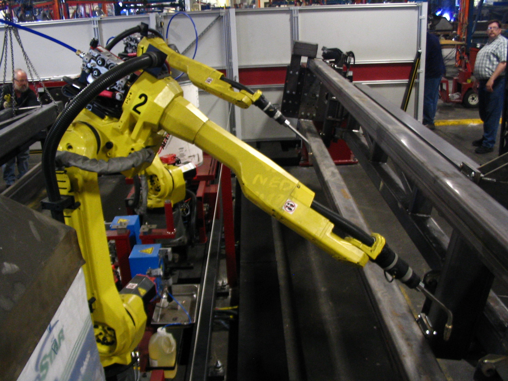

# 사올 수 없는 데이터에 일본이 1조 엔을 걸었다

_소니·소프트뱅크·NEC·혼다가 세운 노에트라 — 소버린 AI의 전선이 언어에서 물리 세계로 옮겨간 순간_

## Executive Summary

> [!callout]
> 2026년 7월 16일, 소니·소프트뱅크·NEC·혼다가 세운 컨소시엄 노에트라(Noetra)에 일본 정부가 5년간 최대 1조 엔을 걸었다. 44개 투자기관이 함께 선 이 판의 목표는 또 하나의 거대 언어 모델이 아니다. 공장·의료·매장의 센서 기록으로 움직이는 로봇의 두뇌, 로드맵상 2030년의 "Real-world Native AI"다. 이 글은 그 돈이 정확히 무엇을 사려는지, 그리고 왜 그것이 돈만으로는 사지지 않는지를 따라간다.

> 핵심은 데이터의 성격이다. 웹에서 긁어 오는 언어 코퍼스와 달리, 물리 세계의 경험 데이터, 곧 접촉·모션·실패의 기록은 스크래핑할 수도 데이터 브로커에게서 살 수도 없다. 전 세계 로봇 조작 데이터를 다 합쳐도 인터넷 텍스트와 자릿수가 여러 단계 벌어지는데, 그 격차는 점진적이 아니라 구조적이다. 그래서 일본은 규모가 아니라 자국에만 쌓이는 물리 데이터로 승부를 건다. 다만 1조 엔을 부어도 품질과 큐레이션 없이는 그 데이터가 로봇의 두뇌를 세우지 못한다는 반전이 이 베팅의 진짜 조건이다.

> 페블러스 독자에게 이 발표는 한 문장으로 요약된다. 소버린 AI의 전선이 언어에서 물리로 옮겨갔고, 사올 수 없는 물리 데이터가 국부(國富)가 되었다. 국가가 현장 센서 로그를 전략 자산으로 규정하는 순간, 흩어진 데이터를 학습 가능한 형태로 만드는 일이 국가 인프라 사업이 된다. 데이터의 소유가 다음 10년의 산업 주도권을 다시 그린다.

<!-- stat-card -->
**1조 엔** — 5년 정부 지원 총액 — 약 61.6억 달러($6.16B). 미국 스타게이트의 약 1/80 규모

<!-- stat-card -->
**27,500개** — AI 팩토리 Rubin GPU — 140MW 규모, 2028년 6월 가동 목표(소프트뱅크 측 발표)

<!-- stat-card -->
**약 30만 시간** — 전 세계 로봇 조작 데이터 — 텍스트 약 300조 토큰과 자릿수 격차(업계 추정)

<!-- stat-card -->
**1,000만 대** — 2040년 로봇 배치 목표 — 18개 산업으로 확장. IFR 세계 가동 재고 약 466만 대와 대비

## 1조 엔은 무엇을 사려 하는가 — 노에트라의 해부

먼저 숫자 하나를 바로잡고 시작한다. 노에트라에 걸린 1조 엔은 **이 컨소시엄 전용** 정부 지원이며, 5년에 걸쳐 최대치로 집행된다. 종종 인용되는 "10조 엔"은 클라우드까지 포함한 일본 AI 전반의 2030년 누적 투자 목표로, 노에트라와는 별개 항목이다. 달러 환산도 주의가 필요하다. 1조 엔은 약 61.6억 달러(약 $6.16B)로, 일부 매체가 표기한 "$61.6B"는 자릿수를 한 단계 잘못 옮긴 오류다. 이 글은 이후 전량 1조 엔(약 61.6억 달러)으로 표기한다.

노에트라는 소니·소프트뱅크·NEC·혼다를 앵커사로 두고, 여기에 44개 투자기관이 합류한 구조다. 각 대기업은 자본만 대는 것이 아니라 자신이 가장 잘 아는 현장, 곧 전자·통신·제조에서 나오는 데이터와 노하우를 함께 기여한다. 컨소시엄이 만들려는 것은 텍스트를 이어 붙이는 모델이 아니라, 여러 센서 입력(영상·음성·촉각·모션)을 하나로 묶어 물리 세계에서 직접 행동하는 멀티모달 물리 AI다. 발표 자료에서 소프트뱅크 측은 "일본 산업이 쥔 데이터가 경쟁력의 원천"이라는 취지를 반복해 강조했다.

돈의 성격도 특이하다. 1조 엔은 통장에 한 번에 꽂히는 보조금이 아니라 조건부·매칭형 자금이다. 우선 GX(그린 트랜스포메이션) 경제이행채에서 3,873억 엔을 1~2년차에 선확보하고, 3년차부터는 로드맵 마일스톤 달성 여부를 심사하는 stage-gate 방식으로 이후 지급분을 결정한다. 기후 대응 명목의 채권이 AI·로봇 인프라로 흘러가는 구조라, 재원의 성격을 둘러싼 그린워싱 논란도 함께 따라붙는다. 국가가 돈을 대되, 성과가 나오는 만큼만 문을 열어 주는 설계다.

그 돈이 향하는 물리적 실체 중 하나가 컴퓨트다. 소프트뱅크 측은 엔비디아 차세대 Vera Rubin 계열 GPU 27,500개를 담은 140MW급 AI 팩토리를 2028년 6월 가동을 목표로 세운다고 밝혔다. 다만 여기서 오해를 피해야 한다. 이만한 GPU를 갖춰도, 그 위에 먹일 물리 데이터가 없으면 팩토리는 반쯤 빈 그릇이다. 노에트라 로드맵이 컴퓨트 착공·가동 일정과 데이터·모델 단계를 나란히 놓는 이유가 여기에 있다. 아래 타임라인은 그 3단계 로드맵을 컴퓨트 일정과 겹쳐 놓은 것이다.

노에트라 로드맵 — 추론모델에서 Real-world Native AI까지

출처: Honda 뉴스룸(2026-07-16), AI Weekly. NEC 원문 프레스룸은 접근이 제한되어(HTTP 403) Honda·AI Weekly 교차검증분만 반영했다.

> [!callout]
> 이 섹션의 요지는 하나다. 1조 엔은 모델을 사려는 돈이 아니라, "로봇이 세상에서 겪는 경험"을 사려는 돈이다. 컴퓨트도, 앵커사도, 조건부 자금 구조도 모두 그 경험 데이터를 확보·정제하는 한 방향을 가리킨다. 그리고 바로 그 경험이야말로 돈을 아무리 부어도 시장에서 사올 수 없는 자산이다.

## 왜 언어 모델이 아니라 로봇의 두뇌인가

가장 먼저 떠오르는 질문은 이것이다. 세계가 거대 언어 모델에 수십조 원을 쏟는 지금, 왜 일본은 그 경주에 뛰어들지 않고 로봇의 두뇌를 택했을까. 답은 냉정한 전략적 계산에 있다. 언어 모델 경쟁은 이미 미국 빅테크가 압도적 데이터·자본·인재로 선두를 굳혔고, 후발 주자가 같은 방식으로 따라잡기에는 판이 기울었다. 일본은 이길 수 없는 경주 대신, 자신이 유리한 경주로 판을 옮겼다.

그 유리함의 실체는 제조업이다. 일본은 산업용 로봇의 생산과 핵심 부품·정밀 제어 기술에서 세계적 강국이다. 팹이 아니라 공장 바닥, 정밀 기기, 숙련된 제조 공정 그 자체가 일본이 수십 년간 쌓아 온 자산이다. 로봇을 움직이는 물리 AI는 바로 이 자산 위에서 데이터를 길어 올린다. 언어 모델의 원료가 웹 텍스트라면, 물리 AI의 원료는 실제로 무언가를 만들고 조작하는 현장이며, 일본은 그 현장을 세계에서 가장 촘촘하게 가진 나라 중 하나다.

*▲ FANUC 6축 용접 로봇 — 일본이 수십 년간 쌓은 정밀 제어·제조 기술이 물리 AI의 데이터 원천이 된다 | Source: [Wikimedia Commons (Phasmatisnox, CC BY 3.0)](https://commons.wikimedia.org/wiki/File:FANUC_6-axis_welding_robots.jpg)*

두 번째 계산은 주권이다. 일본은 AI 컴퓨트의 상당 부분을 해외 클라우드에 의존한다. 업계 추정으로 자국 내 첨단 GPU 자급률은 30% 안팎에 그치고, 디지털 서비스 수지 적자는 연 5조 엔대로 확대돼 왔다. 언어 모델을 남의 클라우드 위에서 돌리는 한, 데이터도 모델도 주권 바깥에 놓인다. 반면 공장·의료·매장에서 나오는 물리 데이터는 애초에 자국 영토 안에서만 발생하고 축적된다. 물리 AI로 전선을 옮기는 것은, 남에게 의존하는 층이 아니라 자국이 원천을 쥔 층에서 싸우겠다는 선언이기도 하다.

노에트라가 로드맵의 종착점으로 내건 "Real-world Native AI"라는 표현은 이 계산을 압축한다. 웹에서 태어나 웹을 이해하는 AI가 아니라, 실세계에서 태어나 실세계를 이해하고 행동하는 AI다. 언어를 매끄럽게 잇는 능력이 아니라, 컵을 집고 부품을 끼우고 실패에서 배우는 능력이 목표다. 이 목표를 향할 때 비로소 일본의 제조 유산과 국지적 물리 데이터가 약점이 아니라 결정적 무기가 된다.

> [!callout]
> 정리하면, 일본은 이미 진 언어 경주를 우회해 자신이 유리한 물리 경주로 판을 옮겼다. 제조업 강국이라는 유산과 자국에만 쌓이는 물리 데이터, 그리고 컴퓨트 주권에 대한 갈증이 한 방향으로 모인 결정이다. 문제는 그 물리 데이터가 언어 데이터와 근본적으로 다른 방식으로 희소하다는 것, 그것이 다음 섹션의 주제다.

## 사올 수 없는 데이터가 왜 국부가 되는가

이 글의 지적 심장은 여기다. 왜 물리 데이터는 "사올 수 없다"고 말하는가. 세 가지 성질 때문이다. 첫째는 비대체성이다. 접촉·모션·실패의 기록은 실제로 로봇이 세상과 부딪혀야만 생긴다. 둘째는 국지성이다. 특정 공장·기기·작업 환경에서만 발생하고 그 현장에만 축적된다. 셋째는 도메인 종속성이다. 한 라인에서 모은 데이터가 다른 라인에 그대로 쓰이지 않는다. 웹 텍스트가 복제·스크래핑·재판매되는 자산이라면, 물리 데이터는 그 반대편 끝에 있는 자산이다.

문제의 크기를 정량으로 보면 더 또렷하다. 언어 모델은 웹에서 수조에서 수백조 토큰을 긁어 온다. 반면 전 세계 로봇 조작 데이터를 다 합쳐도 약 30만 시간 수준이라는 것이 업계의 대체적 추정이다. 그 사이에 인터넷 비디오(약 10억 시간)가 있지만, 로봇이 직접 겪은 조작 데이터와는 성격이 또 다르다. 아래는 이 세 원천을 로그 축 위에 겹쳐 놓은 것이다. 단위가 서로 다르므로 절대 비교가 아니라 "자릿수의 계단"을 보기 위한 그림이다.

데이터 원천의 자릿수 격차 (로그 스케일, 단위 상이)

출처: 업계·VC 추정치(State of Robotics 2026, SCSP/ISF Voices 등). 시간과 토큰은 단위가 달라 절대 비교가 아니라 자릿수 차이를 보이기 위한 개념도다.

그렇다면 부족한 만큼 사 오면 되지 않을까. 여기서 물리 데이터가 반도체나 클라우드와 결정적으로 갈린다. 실세계 로봇 데이터는 사람이 로봇을 원격 조종하거나 손으로 시연하며 하나씩 쌓는 노동집약 자산이다. 수집 단가는 빠르게 내려왔다. 텔레오퍼레이션 기준 시간당 약 340달러(2024)에서 130달러대(2025), 그리고 118달러(2026 초)까지 2년 만에 60% 넘게 떨어졌다. 그런데도 데이터가 부족한 이유는, 단가 아래에 사라지지 않는 물리적 병목이 있기 때문이다. 조작 리그 한 대에 5만~15만 달러, 작업자 한 명이 하루에 만들 수 있는 시연은 수백 개 미만이다. Bessemer 같은 VC는 향후 2년 산업 전체의 로봇 데이터 수집 비용을 30억 달러 이상으로 추정한다(VC 추정).

텔레오퍼레이션 데이터 수집 단가 — 2년간 60%+ 하락

출처: State of Robotics 2026, Bessemer Venture Partners(VC 추정). 텔레오퍼레이션 기준 시간당 단가로, 조작 리그·인건비 등 총원가와는 별개다.

규모를 확보한다 해도 끝이 아니다. 최대 오픈 로봇 데이터셋인 Open X-Embodiment는 22개 이상의 플랫폼에서 모은 100만 개가 넘는 궤적과 500여 개 스킬을 담았지만, 실제로는 특정 로봇 몇 종에 데이터가 심하게 쏠려 있다. 총량이 크다고 골고루 쓸 수 있는 것은 아니라는 뜻이다([Open X-Embodiment, arXiv:2310.08864](https://arxiv.org/abs/2310.08864)). 그래서 2026년 로보틱스 파운데이션 모델 진영의 경험적 합의는 스케일이 아니라 큐레이션을 가리킨다. 대략 7B 파라미터 이상에서는 크기를 키우는 것보다 데이터를 고르는 것이 성능을 더 크게 가른다. 잘 큐레이션된 500개 시연으로 파인튜닝한 7B 모델이, 부실하게 큐레이션된 70B 모델을 대부분의 조작 벤치마크에서 앞선다는 결과가 이를 압축한다.

> [!callout]
> 물리 데이터는 비싸고, 절대량이 부족하며, 품질 없이는 자산이 되지 않는다. 세 가지가 동시에 성립하기 때문에 시장이 아니라 국가가 직접 나선다. "사올 수 없다"는 말은 은유가 아니라 자릿수와 가격표가 뒷받침하는 사실이다. 그리고 사올 수 없는 것을 대신 만들어 내는 능력, 곧 수집과 큐레이션과 품질 검증이 이 시대의 국부다.

## 한국은 하드웨어에, 일본은 데이터에 걸었다

같은 물리 AI를 두고도 나라마다 돈을 거는 지점이 전혀 다르다. 네 나라를 겹쳐 보면 노에트라의 위치가 선명해진다. 일본은 정부가 물리 데이터 확보에 직접 매칭펀드를 붓는 **공급 측** 전략을 택했다. 국가가 원료 자체의 생산에 개입한다는 점에서 가장 이례적이다.

한국은 정반대의 그림에 가깝다. 향후 10년 약 1,350조 원(반도체 800조+AI 데이터센터 550조)을 걸었지만, 로봇 경험 데이터와 품질 표준에 배정된 예산은 사실상 소수점 이하다. 로봇훈련소·데이터 팩토리 명목의 약 1.4조 원을 총액으로 나누면 약 964 대 1에 불과하다. 자본은 넘치는데 데이터라는 항목이 예산표에서 거의 지워져 있는 구조로, 페블러스가 [한국 1,350조 피지컬 AI 투자의 데이터 공백](/report/korea-880-trillion-physical-ai-data-gap/ko/)에서 이미 짚은 지점이다. 로봇이 몸으로 쌓아야 할 [행동 데이터](/report/korea-physical-ai-behavior-data/ko/)의 표준이 왜 하드웨어만큼 중요한지도 같은 맥락에서 다뤘다. 일본과 한국의 차이는 결국 "데이터 확보에 국가가 직접 나서느냐"와 "자본은 있으나 데이터 항목이 없느냐"의 차이다.

미국과 싱가포르는 또 다른 축이다. 미국은 정부가 아니라 민간 자본이 알아서 물리 데이터로 흐른다. 거대 기술 자본이 로봇 파운데이션 모델과 데이터 파이프라인에 직접 베팅하며, 국가 계획 없이도 시장이 원료를 끌어모은다. 싱가포르는 돈의 규모가 아니라 실증 환경과 거버넌스를 판다. 신뢰할 수 있는 데이터·AI 인프라 자체를 국가 상품으로 내세우는 전략으로, [싱가포르의 AI 신뢰 인프라](/report/singapore-ai-trust-infrastructure-2026/ko/) 편에서 살펴본 접근이다. 아래 표는 네 나라가 각각 어디에 돈을 걸었는지를 한눈에 정리한 것이다.

| 국가 | 자금 규모·주체 | 전략의 성격 | 데이터에 대한 태도 |
| --- | --- | --- | --- |
| 일본 | 1조 엔 / 정부 매칭 + 대기업 컨소시엄 | 공급 측 — 국가가 데이터 생산에 직접 개입 | 물리 데이터 확보를 국가 목표로 명시 |
| 한국 | 약 1,350조 원 / 민관 (하드웨어 중심) | 인프라 측 — 팹·데이터센터·양산에 집중 | 데이터 항목 약 0.1%, '수집' 언어에 머묾 |
| 미국 | 민간 대규모 자본 (국가 계획 아님) | 시장 측 — 자본이 스스로 데이터로 이동 | 데이터 파이프라인을 사업 모델로 내재화 |
| 싱가포르 | 상대적 소액 / 정부 주도 | 거버넌스 측 — 신뢰·실증 환경을 판매 | 데이터 신뢰성·표준을 국가 상품화 |

단위·집계 기준이 나라마다 달라(엔·원·달러·정부/민간) 절대 규모의 직접 비교는 부적절하다. 표는 "어디에 돈을 거는가"의 방향성을 정리한 것이다.

이 지도를 관통하는 프레임이 소버린 AI의 2막이다. 1막은 "우리 언어로 학습한 우리 모델"이었다. 자국어 코퍼스로 국가 대표 언어 모델을 세우려는 시도가 대표적이다. 페블러스가 [국민성장펀드와 국가 대표 AI](/report/upstage-national-fund-2026-05/ko/) 편에서 다룬 흐름이다. 노에트라는 그 판을 물리 세계로 옮긴다. 이제 주권의 대상은 언어가 아니라, 자국에만 쌓이고 사올 수 없는 물리 데이터다.

> [!callout]
> 네 나라는 같은 물리 AI를 두고 전혀 다른 지점에 돈을 걸었다. 그 차이가 곧 각국이 확보할 데이터 격차를 만든다. 일본은 원료의 생산 자체에, 한국은 하드웨어에, 미국은 시장에, 싱가포르는 신뢰에 베팅했다. 어느 쪽이 옳은지는 아직 열려 있지만, 데이터를 전략의 부산물이 아니라 전략의 본체로 다룬 나라가 다음 라운드에서 유리하다는 것만은 분명해지고 있다.

## 로봇 경험 데이터는 누구의 것인가

1조 엔의 판이 벌어지자마자 가장 답하기 어려운 질문이 따라온다. 컨소시엄이 모은 로봇 데이터는 대체 누구의 것인가. 대기업들이 각자 자기 현장, 곧 제조·통신·전자에서 데이터를 기여하는 구조인데, 그 데이터의 국적·소유권·재사용 거버넌스는 아직 명확히 공개되지 않았다. 한 기업이 기여한 공장 로그를 다른 기업이 학습에 쓸 수 있는가. 컨소시엄이 해체되면 데이터는 어디로 가는가. 이 질문들은 사소한 법률 문제가 아니라, "데이터 소유가 산업 주도권"이라는 명제의 바로 그 핵심 쟁점이다.

노에트라 데이터 풀 — 기여는 넷, 소유권은 물음표

출처: Honda 뉴스룸, AI Weekly 교차검증. 각사 기여 구조는 확인되나 데이터 소유권·재사용 거버넌스는 공개 자료에 명시되지 않았다(페블러스 정리).

데이터가 주도권으로 전환되는 메커니즘은 단순하다. 물리 데이터는 국지적이고 비대체적이기 때문에, 한번 특정 진영에 축적되기 시작하면 후발 주자가 같은 데이터를 따로 만들어 내기가 극도로 어렵다. 언어 모델은 누구나 같은 웹을 긁을 수 있어 데이터 자체로는 격차가 크게 벌어지지 않지만, 물리 데이터는 먼저 현장을 확보하고 먼저 축적한 쪽이 구조적으로 앞선다. 그래서 노에트라의 진짜 성패는 GPU 대수가 아니라, 앞으로 5년간 얼마나 넓은 현장에서 얼마나 신뢰할 수 있는 경험 데이터를 자기 진영으로 끌어모으느냐에 달려 있다.

여기서 실무의 층위가 드러난다. 국가가 물리 데이터를 전략 자산으로 규정했다는 것은, 제조·의료·리테일 현장의 데이터 거버넌스·표준화·품질관리 수요가 구조적으로 커진다는 신호다. 텔레오퍼레이션 단가가 시간당 118달러까지 떨어져도 데이터가 여전히 부족한 이유는, 수집이 어려워서만이 아니라 모은 것을 쓸 만하게 만드는 일이 어려워서다. 센서 동기화 오차, 결측, 라벨 부재, 실패 로그의 맥락 소실까지 이 모든 것을 정리해야 비로소 학습 자산이 된다. 잘 큐레이션된 500개 시연이 부실한 대형 모델을 이긴다는 합의가 뜻하는 바가 바로 이것이다.

그래서 이 시대의 메시지는 데이터를 가진 모든 조직에게로 확장된다. 당신 공장의 로그, 당신 매장의 센서 기록, 당신 병원의 기기 데이터가 곧 전략 자산이며, 그 자산의 가치는 양이 아니라 품질에 비례한다. 국가가 1조 엔을 부어 증명하려는 명제는 역설적이게도 대단히 실무적이다. 흩어진 현장 데이터를 AI가 쓸 수 있는 형태로 만드는 일, 그것이 물리 AI 시대의 병목이자 기회다.

> [!callout]
> 로봇을 움직이는 경험 데이터는 어느 나라, 어느 기업의 것인가. 노에트라는 그 질문에 국가 차원의 답을 시도하는 첫 대규모 실험이다. 데이터의 소유가 산업 주도권으로 전환되는 시대에, 승부는 데이터를 얼마나 많이 모으느냐가 아니라 얼마나 신뢰할 수 있게 만드느냐에서 갈린다. 그 능력을 먼저 갖춘 쪽이 다음 10년의 지도를 다시 그린다.

## 페블러스 관심의 이유

### 비즈니스·기술 연결

노에트라의 본질은 "공장·의료·매장의 센서 데이터로 로봇을 움직인다"는 것이다. 이는 산업 현장의 센서·로그 데이터를 진단·정제하는 DataClinic, 그리고 흩어진 데이터를 학습 가능한 상태로 만드는 AI-Ready Data라는 페블러스의 문제 영역과 정확히 겹친다. 일본이 국가 예산으로 하려는 일의 상당 부분, 곧 흩어진 현장 데이터를 모델이 쓸 수 있는 형태로 만드는 것이 이 회사가 매일 다루는 질문이다. 1조 엔 중 컴퓨트와 별개로, 진짜 병목은 "그 GPU에 먹일 물리 데이터를 어떻게 확보하고 정제하는가"에 있다.

### 데이터 품질 관점

물리 AI 모델의 성능은 센서·모션·접촉·실패 로그의 품질에 종속된다. 웹 코퍼스와 달리 물리 데이터는 노이즈·결측·라벨 부재가 심해, 품질 검증과 큐레이션 없이는 학습 자산이 되지 못한다. 2026년 로보틱스 파운데이션 모델 진영의 합의, 곧 "잘 큐레이션된 500개 시연이 부실한 대형 모델을 이긴다"는 명제는 규모보다 큐레이션이 성능을 가른다는 사실의 직접 실증이다. "1조 엔을 부어도 데이터 품질 인프라 없이는 로봇의 두뇌가 서지 않는다"는 문장은, 이 리포트가 국가 사례로 확인한 결론이다.

### 고객·파트너 실무 함의

국가가 물리 데이터를 전략 자산으로 규정했다는 것은, 제조·의료·리테일 현장의 데이터 거버넌스·표준화·품질관리 수요가 구조적으로 커진다는 신호다. 산업 현장 데이터를 보유한 기업에게 이 리포트가 던지는 실무 메시지는 분명하다. 당신 공장의 로그가 곧 전략 자산이며, 그 가치는 양이 아니라 품질에 비례한다. 텔레오퍼레이션 단가가 내려가도 데이터가 부족한 이유가 "쓸 만하게 만드는 게 어려워서"라면, 바로 그 지점이 실무의 승부처다.

> [!callout]
> **Editor's Note.** 페블러스는 소버린 AI와 물리 데이터를 다룬 일련의 리포트를 통해, "규모보다 품질"이라는 관점을 가장 일관되게 제기해 온 당사자다. 이 글은 특정 제품을 팔기 위한 것이 아니라, 국가가 1조 엔을 건 물리 AI 프로젝트를 데이터 품질의 눈으로 읽은 기록이다. 로봇을 움직이는 경험 데이터가 어느 나라, 어느 기업의 것이며 그 소유가 무엇을 바꾸는지, 그 판단은 독자의 몫으로 남긴다.

## 참고문헌

### 1차 출처 · 정책·산업 발표

- 1.Honda (2026). [노에트라 설립 및 Vera Rubin AI Factory 계획](https://global.honda/en/newsroom/news/2026/c260716eng.html). Honda 뉴스룸, 2026-07-16. (앵커사 구성·로드맵·GPU 27,500개 교차검증 출처)
- 2.AI Weekly (2026). [Japan pledges up to $6.16B to SoftBank-led AI consortium](https://aiweekly.co/alerts/japan-pledges-up-to-616b-to-softbank-led-ai-consortium). (1조 엔·GX채 3,873억 엔·stage-gate)
- 3.NEC (2026). Press Release, 2026-07-16. https://www.nec.com/en/press/202607/global_20260716_01.html — ⚠️ 원문 접근 제한(HTTP 403). 본 리포트는 Honda·AI Weekly 교차검증분만 사용했다.
- 4.Green Central Banking (2026). GX 경제이행채의 AI·로봇 인프라 전용 관련 보도, 2026-03. (기후 명목 채권의 용도 논란)

### 학술 · 기술

- 5.Open X-Embodiment Collaboration (2023). [Open X-Embodiment: Robotic Learning Datasets and RT-X Models](https://arxiv.org/abs/2310.08864). arXiv:2310.08864. (100만+ 궤적·500여 스킬·플랫폼 편중)
- 6.Kim, M. et al. (2024). OpenVLA: An Open-Source Vision-Language-Action Model. (약 97만 궤적 서브셋 학습, VLA 스케일링 근거)

### 산업 데이터 · 통계

- 7.International Federation of Robotics (2025). World Robotics 2025. (산업용 로봇 연간 설치 약 54만 대·가동 재고 약 466만 대)
- 8.State of Robotics 2026. (텔레오퍼레이션 단가 하락·큐레이션 > 스케일 합의) — ⚠️ 업계 리포트, 피어리뷰 아님
- 9.Bessemer Venture Partners (2026). State of Robotics / Atlas. (향후 2년 로봇 데이터 수집 비용 30억 달러+ 추정) — ⚠️ VC 추정
- 10.SCSP · ISF Voices (2026). 로봇 조작 데이터 약 30만 시간 vs 텍스트 약 300조 토큰 격차 추정. — ⚠️ 업계 추정, 단위 상이

### 페블러스 선행 리포트

- 11.페블러스 (2026). [한국 1,350조 피지컬 AI 투자, 예산에 없는 로봇 경험 데이터](/report/korea-880-trillion-physical-ai-data-gap/ko/). 2026-07-20.
- 12.페블러스 (2026). [한국 피지컬 AI의 로봇 행동 데이터](/report/korea-physical-ai-behavior-data/ko/).
- 13.페블러스 (2026). [국민성장펀드와 국가 대표 AI](/report/upstage-national-fund-2026-05/ko/). 2026-05.
- 14.페블러스 (2026). [싱가포르의 AI 신뢰 인프라](/report/singapore-ai-trust-infrastructure-2026/ko/). 2026-07.
