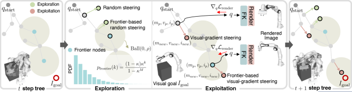
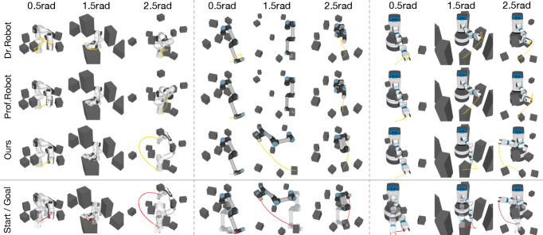

# One Picture Tells the Robot Where to Go

_CVPR 2026 Highlight Visual-RRT — Visual-Goal Motion Planning and What It Means for the Data Pipeline_

## Executive Summary

> [!callout]
> For twenty-eight years, telling a robot where to go has meant typing in numbers. A 6-DoF pose or a vector of joint angles — the goal had to be a number, and the RRT family of planners drew collision-free paths on top of those numbers. **Visual-RRT**, presented as a CVPR 2026 Highlight by KAIST's SGVR Lab, breaks that assumption. The input is a single goal image, no coordinates required, and the robot still finds a way toward the pose in the picture.

> The method is the product of two components. Differentiable robot rendering supplies a pixel-level gradient by drawing the robot's current pose and comparing it to the goal image, while a frontier-based explore-exploit policy steers tree expansion toward the visually most promising nodes. Ablations show the two are not additive but multiplicative. Remove frontier sampling and the success rate collapses to near zero; lower inertial momentum β₁ from 0.9 to 0.5 and 79.8% drops to 29.6%. The result is not a one-line tweak to an algorithm. It is the inflection point at which the "goal representation" inside robot training data shifts from coordinate vectors to images.

> From where Pebblous sits, the shift asks two questions at once. Does synthetic-data curation need a new axis called "goal-image consistency," and should data-quality diagnostics descend one level further, down to the pixel? This report follows both questions.

### Key Metrics

Source: Lee et al., _Visual-RRT_, CVPR 2026 Highlight (arXiv:2604.16388).

<!-- stat-card -->
**75–80%** — Visual-goal success rate — Average across Franka, UR5e, Fetch — ~3x the 19–26% of gradient-only baselines

<!-- stat-card -->
**79.8 → 29.6%** — Inertial β₁ ablation gap — Lower β₁ from 0.9 to 0.5 and success more than halves

<!-- stat-card -->
**0.083 rad** — Real-world joint error — Panda-3CAM-Azure real RGB-D — about 4.75°

<!-- stat-card -->
**22,297** — 3DGS GitHub stars — In 2.9 years — differentiable rendering arriving inside robotics

## When Coordinates Step Aside — A Robot Goal as an Image

If you have never questioned the input specification of robot motion planning, the crack Visual-RRT opens can look minor. It is not. Once the input shifts from a 6-DoF coordinate to a pixel, every layer that sits on top of that input shakes. The unit of training data changes, the basis for curation changes, and ultimately so does the language we use to diagnose data quality.

The existing pipeline had stabilized around "observation → policy → coordinate output." During training, the robot saw camera observations and produced actions, but the goal those actions reached for was always a coordinate. A human operator wrote that coordinate by hand, and scenes synthesized in simulation were eventually reduced to coordinates before they entered training. Visual-RRT puts an image, not a coordinate, in the goal slot at inference time. In that moment, an assumption that had been quietly built in — that the representation of training data and the representation of inference input must match — comes to the surface.

*▲ (a) RRT — random tree from coordinate goal, (b) Visual gradient-only optimization — local minima trap, (c) Visual-RRT — gradient of visual loss combined with tree expansion, (d) Planning progression over time. | Source: [KAIST SGVR Lab — Visual-RRT project page](https://sgvr.kaist.ac.kr/Visual-RRT/)*

### 1.1. From Observation Data to Goal Images — Expanding the Simulator's Role

Scenes that simulators like Isaac Sim or PebbloSim have produced were mostly "observation candidates" — frames that go into a training set so a policy can imitate the distribution. Visual-RRT opens the possibility of also using a simulator-rendered scene as a "goal candidate" at inference time. When an operator says "grasp it in this pose," a single rendered image of that pose becomes the input.

This extension is not small, because the unit of responsibility in data curation shifts. When you are producing observation candidates, the central question is "is the training distribution diverse enough?" When you are producing goal candidates, a new question follows: "is the viewpoint, lighting, and object pose of this image inside the training distribution?" Even the same scene from the same simulator now has different things to verify depending on which capacity it enters.

> [!callout]
> **The takeaway.** The moment a coordinate becomes a pixel, data quality no longer ends at training-distribution problems. The visual distribution of the goal image at inference time becomes part of it too. "Garbage in, garbage out" has just dropped one level lower, down to the pixel.

## The One Assumption RRT Held for 28 Years

Since LaValle proposed Rapidly-exploring Random Trees in Iowa State University Technical Report TR 98-11 in 1998, the RRT family has gone through variant after variant. In 2011, Karaman and Frazzoli's RRT* guaranteed asymptotic optimality; RRT-Connect pushed up speed with a bidirectional search; BIT* improved cost optimality using informed heuristics. Twenty-eight years polished success rate, connectivity, and path optimality alike. One input assumption was never broken.

"q_goal is an explicit number." Whether a joint angle or a 6-DoF pose, the goal had to be a number. Visual-RRT flips that premise directly. It receives a goal image I_goal instead of q_goal, renders the current pose with a differentiable renderer at every node, and uses the gradient of pixel-level differences as the direction for tree expansion. Within a 28-year lineage, the texture of the change can look thin. As the first case to break the input specification, it is thick.

### 2.1. The Assumption No One Rewrote for 28 Years

Lay the 28-year history of RRT variants out as a single table and the picture becomes vivid. The algorithm name and the contribution column changed almost every time a new row was added. The rightmost column, "goal input," never did. Visual-RRT is the first paper to rewrite the word fixed in that single column.

| Year | Algorithm | Contribution | Goal Input |
| --- | --- | --- | --- |
| 1998 | RRT (LaValle, TR 98-11) | Random tree exploration in high-dimensional configuration space | Joint angle q_goal |
| 2000 | RRT-Connect | Bidirectional trees for faster planning | Joint angle q_goal |
| 2011 | RRT* (Karaman & Frazzoli) | Asymptotic optimality guarantee | Joint angle q_goal |
| 2015 | BIT* | Cost optimality via informed heuristics | Joint angle q_goal |
| 2026 | Visual-RRT (KAIST) | Visual goals via differentiable rendering | Image I_goal |

************

Read down the last column and one fact becomes sharp. Over twenty-eight years, the three left columns were updated frequently. The rightmost column was not updated once. From a data perspective, a change in that narrow column is anything but small. When the goal at inference time stops being a coordinate and becomes an image, the roles of the simulators, synthetic-data factories, and VLA training sets that produce those images are redefined too.

### 2.2. Why Now — The Possibility Differentiable Rendering Created

Visual-RRT arrived in 2026 because three technical prerequisites had finally settled. First, differentiable robot rendering — the ability to draw a robot in pixels and backpropagate a gradient from those pixels to pose parameters — became a general framework in 2024 with Dr.Robot (Columbia and Stanford). Second, 3D Gaussian Splatting appeared in 2023 and exploded to 22,297 GitHub stars in 2.9 years, stabilizing the real-time backend for differentiable rendering. Third, Prof.Robot (CVPR 2025) showed that collision-aware differentiable rendering can handle self- and static-collisions.

Visual-RRT showed up after all three currents had stabilized. On top of a differentiable rendering backend, a pixel representation of robot appearance, and collision-aware capability, it added the last piece, "tree expansion toward a visual goal." It is more accurate to say that what 1998 RRT could not do on its own was not an algorithmic limit but a limit of timing: differentiable rendering did not exist back then.

## Why the Two Components Multiply, Not Add

Two mechanisms make Visual-RRT work: a frontier-based explore-exploit strategy and inertial gradient tree expansion. On the surface they look like two modules bolted onto an RRT skeleton. The ablation table tells a different story. The two modules are not add-ons. They behave like a multiplication. Strip one out, and the other loses its meaning too.

*▲ Visual-RRT overview: frontier-based random sampling (Exploration) and visual-gradient frontier steering (Exploitation) operate multiplicatively within a single tree. | Source: [Lee et al., Visual-RRT (CVPR 2026 Highlight), Fig. 2](https://arxiv.org/abs/2604.16388)*

### 3.1. Frontier Sampling — Prioritize the Visually Promising

Frontier sampling does not expand every node in the tree equally. It scores each node by visual loss — "how close is this pose to the goal image?" — and prioritizes the most promising changes (the frontier). While plain random sampling sweeps the configuration space, the frontier strategy aligns that sweep along the gradient of the visual signal. The ratio η, which trades off exploration and exploitation, is the key hyperparameter of this stage.

### 3.2. Inertial Gradient — Carrying Optimization State Forward

Inertial gradient tree expansion lets each tree node inherit the gradient state (the momentum) of its parent. When the visual-loss optimization that started at a single node falls into a local minimum, other candidate nodes route around that wall. A momentum coefficient β₁ determines how strong that inertia is. Multiple branches grow simultaneously in different directions, dispersing the single-path optimization trap of local minima.

### 3.3. Ablation — Pull One Out and the Other Falls With It

How tightly the two mechanisms are coupled shows up most clearly in the ablation table. Turn frontier sampling off and the method effectively stops working. Lower the inertial β₁ and the success rate falls to less than half. The "79.8% with both" result is closer to a product of two components than to a sum.

*▲ (a) Exploration ratio η and (b) Frontier-based sampling ratio versus success rate — performance collapses when either ratio is pushed to an extreme. | Source: [Lee et al., Visual-RRT, Fig. 7](https://arxiv.org/abs/2604.16388)*

| Configuration | UR5e success rate | Reading |
| --- | --- | --- |
| frontier η = 0.0 (frontier removed) | ≈ 0% | Without visual-signal alignment, only a random tree remains |
| inertial β₁ = 0.5 | 29.6% | Weak inertia cannot climb out of local minima |
| inertial β₁ = 0.9 (optimal) | 79.8% | The stable operating point with both modules active |
| inertial β₁ = 0.99 | Mid | Excess inertia becomes insensitive to new signal |

************Source: Visual-RRT ablation in main text (arXiv preprint).

### 3.4. Success by Distance — The Gap Widens as the Goal Moves Farther

As the configuration-space distance between start and goal grows, gradient-based single-path optimization collapses fast. Visual-RRT, with its tree structure and parallel candidate exploration, degrades more gently. Even with the same visual loss, "descend along one path" and "branch out into many paths descending in parallel" produce different outcomes.

| Method | Franka | UR5e | Fetch |
| --- | --- | --- | --- |
| Dr.Robot (gradient-only) | 19–26% | 19–26% | 19–26% |
| Prof.Robot | 22–28% | 22–28% | 22–28% |
| Dr.Robot + RRT* (naïve combination) | 22–28% | 22–28% | 22–28% |
| Visual-RRT | 75–80% | 75–80% | 75–80% |

****************Source: Visual-RRT baseline comparison in main text (arXiv preprint). Average success-rate ranges.

Whether the same gap survives the move into the real world is its own validation problem. The authors took an actual Fetch robot and showed that a single goal image produces a collision-free path that the robot executes. On the Panda-3CAM-Azure real RGB-D dataset, the average joint error against a learning-based pose regressor came in at 0.083 rad — about 4.75°. Two facts are worth holding together: this is not a simulation-only result, and a training-free method outperformed a learning-based comparison. A small sim-to-real gap also suggests the same algorithm can be lifted into the KPIs of synthetic-data evaluation.

*▲ Real-world Fetch deployment: (top) collision-free execution from start to goal image, (bottom) temporal visualization of Exploration and Exploitation samples. | Source: [Lee et al., Visual-RRT, Fig. 4](https://arxiv.org/abs/2604.16388)*

> [!callout]
> **The takeaway.** Bolting RRT* onto Dr.Robot leaves you around 25%. Both frontier-based explore-exploit and inertial momentum have to be in the loop to reach 75–80%. The idea of "RRT plus differentiable rendering" is not hard to come up with — _how_ you combine the two is what separates the two-digit difference in outcomes.

## Differentiable Rendering Enters Robotics — A 24-Month Timeline

Place Visual-RRT on a 24-month timeline and the current it sits at the end of becomes visible. Right after 3D Gaussian Splatting was published at SIGGRAPH 2023, differentiable rendering shed its graphics-tool jacket and migrated into robotics as an input representation. In a little over two years, Dr.Robot, Prof.Robot, GS-Planner, Splat-Nav, and Visual-RRT lined up one after another.

*▲ Qualitative trajectories from Dr.Robot, Prof.Robot, and Visual-RRT: which method reaches the goal pose without collision when given only an image of the target. | Source: [Lee et al., Visual-RRT, Fig. 3](https://arxiv.org/abs/2604.16388)*

| Date | Work | Venue | Contribution |
| --- | --- | --- | --- |
| 2023.07 | 3D Gaussian Splatting (Kerbl et al.) | SIGGRAPH 2023 | Standard real-time differentiable-rendering backend |
| 2024.10 | Dr.Robot | CoRL 2024 | Differentiating robot appearance directly with control parameters |
| 2025.06 | Prof.Robot | CVPR 2025 | Collision-aware differentiable rendering (self- and static-) |
| 2025 | GS-Planner / Splat-Nav | IROS 2024 / TRO 2025 | 3DGS-based motion planning and navigation |
| 2026.06 | Visual-RRT | CVPR 2026 Highlight | RRT plus differentiable rendering for visual goals |

************

### 4.1. Ecosystem Signals — The Gravity 3DGS Created

Translate the timeline's acceleration into code-ecosystem terms and it becomes clearer. The 3DGS original repository gathered 22,297 stars and 3,256 forks in 2.9 years after its July 2023 release, with nerfstudio and OpenUSD growing alongside it. That code momentum, from both academia and industry, has pulled differentiable rendering out of "graphics research" and into "robotics and simulation infrastructure."

| Repository | GitHub Stars | Contribution |
| --- | --- | --- |
| graphdeco-inria/gaussian-splatting | 22,297 | 3DGS original implementation — real-time differentiable rendering |
| nerfstudio | 11,668 | Unified framework for NeRF-family methods |
| PixarAnimationStudios/OpenUSD | 7,316 | 3D data standard — flow of simulation assets |

****Source: Public GitHub repositories (as of 2026-06).

The acceleration across 24 months says this current is not a coincidence of one or two labs. Differentiable rendering is filling in the answer to "how do we send gradients from pixels back to robots?" Visual-RRT now sits on one branch of that answer. In the next 24 months, adjacent branches like natural-language goals combined with image generation and motion planning are likely to appear.

## Industry Is Still Stuck on Sampling

Twenty-four months in academia and twenty-four months in industry do not run on the same clock. The motion-planning industrial standard is still sampling-based. The RRT / RRT* family inside OMPL and MoveIt is the de facto standard for BMW, Volkswagen, Toyota, Schaeffler, Mitsubishi, and startups such as Realtime Robotics (Series B). KavrakiLab's 2024 comparative review put RRT-Connect at the top in five out of six standard scenarios with 100% success.

On the other side sit learning-based planners. Policies like DRL/SAC topped the Deusto/TECNALIA 2025 benchmark in both success rate and time over sampling, but the deployment share in industry remains below 5% (estimated), held back by real-world generalization limits. The "academic performance does not transfer to industrial performance" gap has persisted for more than five years.

### 5.1. Paradigm Adoption Tilts One Way

Place each paradigm and how deeply it penetrates the shop floor in one frame and the asymmetry becomes obvious. While sampling occupies what is effectively the standard slot, learning-based planners have multiplied their share of conference papers without much progress in deployment. The hybrid cell where Visual-RRT sits is the new doorway opening between the two.

| Paradigm | Representative algorithms | Industrial adoption | Limit |
| --- | --- | --- | --- |
| Sampling-based | RRT, RRT*, RRT-Connect, BIT* | De facto standard (BMW · VW · Toyota · Realtime Robotics) | Goal must be supplied as a number |
| Optimization-based | CHOMP, STOMP | Limited adoption | Local minima and initial-path dependence |
| Learning-based | DRL (SAC), VLA (OpenVLA, π0) | Under 5% (estimated) | Real-world generalization gap |
| Hybrid | Visual-RRT (sampling × differentiable rendering) | Research stage | Differentiable-renderer construction cost |

********

### 5.2. Market Gap — Single-Digit Planning SW vs Triple-Digit Humanoids

The motion-planning software market is estimated at about $17.86B in 2025 (Research Nester), with projections reaching $101.71B by 2035 at a CAGR around 19%. Meanwhile, Goldman Sachs places humanoids at $38B by 2035 (a 6x upward revision in 2024), while Morgan Stanley sees $5T by 2050. The gap between single-digit billions and trillions is the gap between "long-term TAM" (investment banks) and "realized revenue" (market-research firms), but as long as motion-planning software lies in the infrastructure layer of humanoids, the co-growth signal is clear.

IFR World Robotics 2025 reports industrial robot installations of 542,000 units in 2024 — over 500,000 for the fourth year running — with 4.664 million robots in operation (+9%). South Korea's robot density at 1,220 per 10,000 workers leads the world. The market grows, and the volume of training data running on it grows too, yet the household-task success rate reported in Stanford HAI AI Index 2026 remains at 12%. Generalist Robotics estimates that "100 million more hours of demonstration data" are still needed.

One reading of that gap is that there is not enough data. The other reading Visual-RRT offers is that the goal representation inside the data is not enough. The same 1M trajectories (Open X-Embodiment) will likely generalize differently depending on whether the dataset contains only coordinate goals or coordinates plus goal images plus demonstration video. The era when learning gets stacked on top of sampling will be decided by which of those two hypotheses gets validated more rigorously.

## A Pebblous Read — Goal Representation Is Data, Too

Translating all of the above into the seat Pebblous sits in, two questions remain. Do we add a new axis called "goal-image consistency" to synthetic-data curation, and do we expand the field of data-quality diagnostics one level deeper, down to the pixel? Rather than answering both at once, we lay out checklists that a practitioner on the ground can use.

### 6.1. Synthetic-Data Curation — Three Things to Check

For pipelines that have treated simulator-rendered scenes purely as "observation data," three new items follow.

<!-- stat-card -->
**Do you emit observation-time and goal-time images together?** — Is the simulation pipeline designed to emit both kinds of images (observation, goal) from a single scene? They need to be separable for goal images to be curated independently as inference-time input.

<!-- stat-card -->
**Is the goal image's viewpoint and lighting inside the training distribution?** — Measure whether the viewpoint and lighting of the goal image at inference time match the training-data distribution quantitatively. A goal image with a large distribution shift is not just "a different image" — it is a direct cause of generalization failure.

<!-- stat-card -->
**Is sim-to-real transferability tracked as a KPI?** — Track the difference in joint error between simulation and reality on real RGB-D datasets such as Panda-3CAM-Azure. Visual-RRT achieving 0.083 rad (about 4.75°) in the real world signals that the same metric can be pulled into synthetic-data evaluation.

### 6.2. DataClinic Diagnostics — Should We Go One Level Down to the Pixel?

The dimensions DataClinic has been diagnosing so far — distribution, freshness, label consistency — were mostly distributional. As visual-goal motion planning starts landing in industry, the unit of diagnosis slides one level lower, down to pixels. Even for the same training set, which viewpoint distribution it covers, which lighting conditions are absent, and at which poses the visual-loss landscape is flat all become new diagnostic dimensions.

The language DataClinic uses for distributional diagnostics today is in effect the same language as the academic line of work decomposing digital-twin accuracy with KL divergence. The fact that Visual-RRT's result depends heavily on its two modules (frontier and inertial) means the operating conditions of those two modules belong inside data-quality diagnostics. The next three items are the natural next step.

<!-- stat-card -->
**Viewpoint distribution diagnostics** — Quantify the camera-pose distribution of training data and measure whether the inference-time goal image lies within that distribution.

<!-- stat-card -->
**Visual-loss landscape diagnostics** — For a given goal image, map at which poses the visual-loss function is flat and at which it is steep.

<!-- stat-card -->
**Sim-to-real joint-error transferability** — Accumulate the joint-error gap between policies trained in synthetic environments and their behavior on real datasets as a quantitative indicator.

> [!callout]
> **Editor's Note.** The center of gravity of this report is rereading the meaning of KAIST's Visual-RRT through a data practitioner's eyes. Pebblous products are mentioned to show that the meaning need not stay abstract — that someone will actually have to handle it on the ground. Please read the assessment of the research and the positioning of our company as separate things.

## References

### Academic (Papers)

- 1.Sebin Lee, Jumin Lee, Taeyeon Kim, Youngju Na, Woobin Im, Sung-Eui Yoon. "Visual-RRT: Finding Paths toward Visual-Goals via Differentiable Rendering." CVPR 2026 Highlight. [arXiv: 2604.16388](https://arxiv.org/abs/2604.16388). Project page: [sgvr.kaist.ac.kr/Visual-RRT](https://sgvr.kaist.ac.kr/Visual-RRT)
- 2.Steven M. LaValle. "Rapidly-Exploring Random Trees: A New Tool for Path Planning." Computer Science Department, Iowa State University, TR 98-11 (1998).
- 3.Sertac Karaman, Emilio Frazzoli. "Sampling-based Algorithms for Optimal Motion Planning." IJRR (2011).
- 4.Bernhard Kerbl, Georgios Kopanas, Thomas Leimkühler, George Drettakis. "3D Gaussian Splatting for Real-Time Radiance Field Rendering." SIGGRAPH 2023. [arXiv: 2308.04079](https://arxiv.org/abs/2308.04079)
- 5.Ruoshi Liu, Alper Canberk, Carl Vondrick et al. "Differentiable Robot Rendering (Dr.Robot)." CoRL 2024. [arXiv: 2410.13851](https://arxiv.org/abs/2410.13851)
- 6."Prof. Robot: Collision-aware Differentiable Robot Rendering." CVPR 2025. [arXiv: 2503.11269](https://arxiv.org/abs/2503.11269)
- 7.Mohit Shridhar, Lucas Manuelli, Dieter Fox. "CLIPort: What and Where Pathways for Robotic Manipulation." CoRL 2021. [arXiv: 2109.12098](https://arxiv.org/abs/2109.12098)
- 8.Suraj Nair, Aravind Rajeswaran, Vikash Kumar, Chelsea Finn, Abhinav Gupta. "R3M: A Universal Visual Representation for Robot Manipulation." CoRL 2022. [arXiv: 2203.12601](https://arxiv.org/abs/2203.12601)
- 9.Open X-Embodiment Collaboration. "Open X-Embodiment: Robotic Learning Datasets and RT-X Models." ICRA 2024. [arXiv: 2310.08864](https://arxiv.org/abs/2310.08864)
- 10."DROID: A Large-Scale In-the-Wild Robot Manipulation Dataset." RSS 2024. [arXiv: 2403.12945](https://arxiv.org/abs/2403.12945)
- 11."Motion Planning for Robotics: A Review for Sampling-based Planners." (2024). [arXiv: 2410.19414](https://arxiv.org/abs/2410.19414)
- 12."Vision-Language-Action Models: A Survey." (2025). [arXiv: 2505.04769](https://arxiv.org/abs/2505.04769)

### Policy and Statistics

- 13.Stanford HAI. "AI Index Report 2026." [hai.stanford.edu](https://hai.stanford.edu/ai-index/2026-ai-index-report)
- 14.International Federation of Robotics. "World Robotics Report 2025 — Industrial Robots." [ifr.org](https://ifr.org/ifr-press-releases/news/global-robot-demand-in-factories-doubles-over-10-years)
- 15.Goldman Sachs. "The Global Market for Robots Could Reach $38 Billion by 2035" (2024 revision). [goldmansachs.com](https://www.goldmansachs.com/insights/articles/the-global-market-for-robots-could-reach-38-billion-by-2035)
- 16.Morgan Stanley. "Humanoid Robot Market — $5 Trillion by 2050." [morganstanley.com](https://www.morganstanley.com/insights/articles/humanoid-robot-market-5-trillion-by-2050)
- 17.Research Nester. "Motion Control Software in Robotics Market." 2025 — $17.86B, 2035 — $101.71B (CAGR ~19%).
- 18.MarketsandMarkets. "Humanoid Robot Market Forecast 2025–2030." $2.92B (2025) → $15.26B (2030), CAGR 39.2%.
- 19.MDPI Sensors. "Comparative Benchmark of Sampling-Based and DRL Motion Planners." 25/17/5282 (2025).

### Pebblous Adjacent (Internal Cross-References)

- 20.[Isaac Sim 3DGS · VLA Synthetic Data Report](/report/isaac-sim-3dgs-vla-synthetic-data-2026-04/en/)
- 21.[VLA Architecture Comparison](/report/vla-architecture-comparison/en/)
- 22.[Physical AI Industry Landscape](/report/physical-ai-industry-landscape/en/)

<!-- stat-card -->
**📚 Physical AI Series** — This piece is part of the [Physical AI](/project/PhysicalAI/en/) series — a place to read, side by side, the world robots will learn from and the representations of data piled on top of it. — It is also curated in the [Graphics for Physical AI](/project/GraphicsForPhysicalAI/en/) hub — where 3DGS and differentiable rendering become a robot's eyes.
