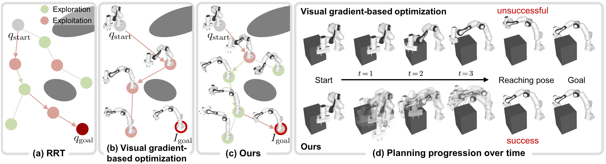
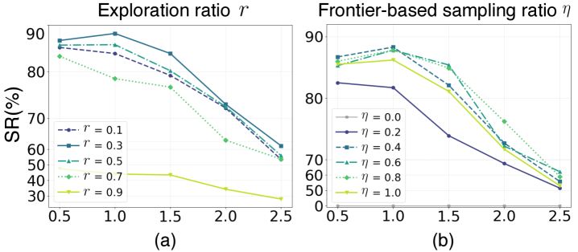
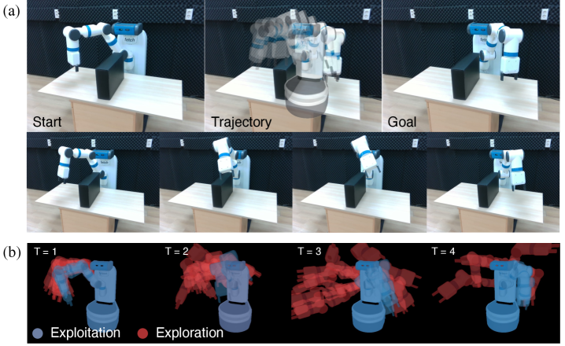

# 사진 한 장이면 로봇이 길을 찾는다

_CVPR 2026 Highlight Visual-RRT가 보여준 시각 목표 기반 모션 플래닝과 데이터 파이프라인 함의_

## Executive Summary

> [!callout]
> 로봇에게 "어디로 가라"고 지시할 때, 28년간 정답은 늘 숫자였다. 6-DoF 좌표든 관절각이든 목표는 명시적 수치로 주어져야 했고, RRT 계열 플래너는 그 수치 위에서 충돌 없는 경로를 짰다. KAIST SGVR 연구팀이 CVPR 2026 Highlight로 발표한 **Visual-RRT**는 이 가정을 깬다. 좌표 대신 한 장의 목표 이미지를 입력으로 받고도, 로봇이 그 자세를 향해 경로를 찾는다.

> 방법의 골격은 두 컴포넌트의 곱셈이다. 미분 가능 로봇 렌더링이 "현재 자세를 그려 목표 이미지와 비교하는" 픽셀 단위 기울기를 트리 확장에 공급하고, frontier 기반 탐색-활용 전략이 시각적으로 유망한 노드를 우선 탐색한다. 두 모듈은 ablation에서 보완재가 아니라 공동 필수재로 드러난다. frontier sampling을 빼면 성공률이 사실상 0으로, inertial momentum β₁을 0.5로 낮추면 79.8%가 29.6%로 떨어진다. 결과는 알고리즘 한 줄의 개선이 아니라, 로봇 학습 데이터의 '목표 표현'이 좌표 벡터에서 이미지로 옮겨가는 변곡점이다.

> 이 변화는 페블러스가 보는 자리에서 두 가지를 묻는다. 합성데이터 큐레이션 기준에 "목표 이미지 일관성"이라는 새 축을 추가해야 하는가, 그리고 데이터 품질 진단의 단위를 픽셀 수준까지 내려야 하는가. 이 보고서는 그 두 질문을 따라간다.

<!-- stat-card -->
**75~80%** — 시각 목표 성공률 — Franka·UR5e·Fetch 평균. 기울기 기반 베이스라인 19~26%의 약 3배

<!-- stat-card -->
**79.8 → 29.6%** — inertial β₁ ablation 격차 — β₁을 0.9에서 0.5로 낮추면 성공률이 절반 이하로 무너진다

<!-- stat-card -->
**0.083 rad** — 실세계 관절 오차 — Panda-3CAM-Azure 실제 RGB-D — 약 4.75°

<!-- stat-card -->
**22,297** — 3DGS GitHub stars — 발표 2.9년 만의 폭증 — 미분 가능 렌더링이 로봇학으로 흘러든 시그널

## 좌표가 사라진 자리 — 로봇 목표가 이미지가 될 때

로봇 모션 플래닝의 입력 명세를 한 번도 의심해 본 적이 없다면, Visual-RRT가 만든 균열은 작아 보일 수 있다. 그러나 입력이 6-DoF 좌표에서 픽셀로 바뀌면, 그 위의 모든 계층이 함께 흔들린다. 학습 데이터의 단위가 바뀌고, 큐레이션의 기준이 바뀌고, 결국 데이터 품질을 진단하는 언어가 바뀐다.

기존 파이프라인은 "관찰 → 정책 → 좌표 출력"이라는 흐름 위에서 안정화되어 있었다. 학습 시 로봇은 카메라 관찰을 보고 행동을 출력했지만, 그 행동이 향하는 목표는 늘 좌표였다. 작업자가 사람의 손으로 직접 그 좌표를 적었고, 시뮬레이터가 합성한 장면도 결국엔 좌표로 환원되어 학습에 들어갔다. Visual-RRT는 추론 단계의 목표 입력을 좌표가 아니라 이미지로 둔다. 그 순간 학습 데이터와 추론 입력 사이의 표현이 어긋날 수 있다는, 그동안 거의 드러나지 않던 가정이 표면에 떠오른다.

*▲ (a) RRT — 좌표 목표 기반 무작위 트리, (b) 시각 기울기 단일 최적화 — 국소 최솟값 함정, (c) Visual-RRT — 시각 손실 기울기를 트리 확장에 결합, (d) 시점별 진행. | Source: [KAIST SGVR Lab — Visual-RRT Project Page](https://sgvr.kaist.ac.kr/Visual-RRT/)*

### 1.1. 관찰 데이터에서 목표 이미지로 — 시뮬레이터의 역할 확장

Isaac Sim이나 PebbloSim 같은 시뮬레이터가 만들어 온 장면은 주로 "관찰 후보"였다. 학습 데이터셋에 들어가 정책이 그 분포를 보고 행동을 흉내 내도록 돕는 일. Visual-RRT는 시뮬레이터가 만든 장면을 추론 시점의 "목표 후보"로도 쓸 수 있다는 가능성을 연다. 예컨대 작업자가 "이 자세로 잡아 줘"라고 말할 때, 시뮬레이터가 그 자세를 렌더링한 한 장의 이미지가 입력이 된다.

이 확장이 사소해 보이지 않는 이유는 데이터 큐레이션의 책임 단위가 달라지기 때문이다. 관찰 후보를 만들 때는 "학습 분포가 다양한가"가 핵심 질문이었지만, 목표 후보를 만들 때는 "이 이미지의 뷰포인트·조명·물체 자세가 학습 분포 안에 있는가"가 새로 따라붙는다. 같은 시뮬레이터가 만든 같은 장면도, 어떤 자격으로 들어가느냐에 따라 검증해야 할 지표가 달라진다.

> [!callout]
> **핵심 시사점:** 좌표가 픽셀로 바뀌는 순간, 데이터 품질은 학습 데이터의 분포 문제에서 끝나지 않는다. 추론 시점에 주어지는 목표 이미지의 시각 분포까지 그 안에 포함된다. "Garbage in, Garbage out"이 픽셀 단위로 한 칸 더 내려온 셈이다.

## RRT 28년이 풀지 못한 한 가지

1998년 LaValle이 Iowa State University 기술보고서 TR 98-11에서 Rapidly-exploring Random Tree를 제안한 이래, RRT 계열은 변형에 변형을 거듭해 왔다. 2011년 Karaman과 Frazzoli의 RRT*는 점근적 최적성을 보장했고, RRT-Connect는 양방향 탐색으로 속도를 끌어올렸으며, BIT*는 정보 기반 휴리스틱으로 비용 최적성을 개선했다. 28년 동안 알고리즘은 성공률·연결성·경로 최적성을 모두 다듬었다. 그러나 입력 가정 하나는 한 번도 깨지지 않았다.

"q_goal은 명시적 수치다." 관절각이든 6-DoF pose든 목표는 숫자로 주어진다는 전제. Visual-RRT는 이 전제를 정면으로 바꾼다. q_goal 대신 목표 이미지 I_goal을 받고, 매 노드에서 현재 자세를 미분 가능 렌더러로 그려, 픽셀 단위 차이의 기울기를 트리 확장 방향으로 쓴다. 28년의 계보 안에서 이 변화의 결은 작아 보이지만, 입력 명세를 깨뜨린 첫 사례라는 점에서 결이 굵다.

### 2.1. 28년간 누구도 다시 쓰지 않은 가정

RRT 계열의 28년 변형사를 표 하나로 모아 보면, 무엇이 갱신되고 무엇이 갱신되지 않았는지가 한눈에 드러난다. 알고리즘 이름과 기여 컬럼은 줄이 늘 때마다 바뀌었지만, 가장 오른쪽의 '목표 입력' 컬럼만은 28년 내내 같은 단어만 적혀 있었다. 그 자리에 박혀 있던 가정을 Visual-RRT가 처음으로 다시 쓴다.

| 연도 | 알고리즘 | 기여 | 목표 입력 |
| --- | --- | --- | --- |
| 1998 | RRT (LaValle, TR 98-11) | 고차원 구성 공간의 무작위 트리 탐색 | 관절각 q_goal |
| 2000 | RRT-Connect | 양방향 트리로 속도 개선 | 관절각 q_goal |
| 2011 | RRT* (Karaman & Frazzoli) | 점근적 최적성 보장 | 관절각 q_goal |
| 2015 | BIT* | 정보 기반 휴리스틱으로 비용 최적 | 관절각 q_goal |
| 2026 | Visual-RRT (KAIST) | 미분 가능 렌더링으로 시각 목표 처리 | 이미지 I_goal |

************

표의 마지막 열을 따라 읽으면 분명해진다. 28년 동안 좌측 세 열은 활발히 갱신되었지만, 가장 오른쪽 열은 단 한 번도 갱신되지 않았다. 이 좁은 자리에서 일어난 변화가 데이터 측면에서는 결코 작지 않다. 추론 시점의 목표가 좌표가 아니라 이미지가 되면, 그 이미지를 만들어 내는 시뮬레이터·합성데이터·VLA 학습 데이터셋의 역할까지 함께 재정의된다.

### 2.2. 왜 지금이었나 — 미분 가능 렌더링이 만든 가능성

Visual-RRT가 2026년에 나온 데에는 기술적 전제 조건이 있다. 첫째, 로봇을 픽셀로 그리되 그 픽셀로부터 자세 파라미터로 기울기를 역전파할 수 있는 미분 가능 로봇 렌더링이 2024년에 일반 프레임으로 정착했다(Dr.Robot, Columbia/Stanford). 둘째, 3D Gaussian Splatting이 2023년에 등장한 뒤 2.9년 만에 GitHub stars 22,297개로 폭증하며 미분 가능 렌더링의 실시간 백엔드가 안정화되었다. 셋째, Prof.Robot(CVPR 2025)이 collision-aware 미분 렌더링으로 자기충돌·정적충돌까지 다룰 수 있음을 보였다.

Visual-RRT는 이 세 흐름이 모두 안정화된 시점에 등장했다. 미분 가능 렌더링이라는 백엔드 + 로봇 외관의 픽셀 표현 + 충돌 처리 능력이 갖춰진 위에서, "시각 목표를 향한 트리 확장"이라는 마지막 한 조각을 얹었다고 보는 편이 정확하다. 1998년 RRT가 단독으로 풀지 못한 것은 알고리즘의 한계가 아니라 그 시대에는 미분 가능 렌더링이 존재하지 않았다는 시점의 한계였다.

## 두 컴포넌트가 곱셈처럼 작동하는 이유

Visual-RRT를 작동시키는 두 메커니즘은 frontier 기반 탐색-활용 전략과 inertial gradient tree expansion이다. 표면적으로는 RRT라는 골격에 얹은 두 모듈처럼 보이지만, ablation 표가 말하는 바는 다르다. 두 모듈은 add-on이 아니라 곱셈처럼 작동한다. 어느 한쪽을 빼면 다른 한쪽도 의미를 잃는다.

*▲ Visual-RRT 개요: frontier 기반 무작위 샘플링(Exploration)과 시각 기울기 기반 frontier steering(Exploitation)이 한 트리 안에서 곱셈적으로 작동한다. | Source: [Lee et al., Visual-RRT (CVPR 2026 Highlight), Fig. 2](https://arxiv.org/abs/2604.16388)*

### 3.1. frontier sampling — 시각적으로 유망한 노드 우선 탐색

frontier sampling은 트리의 모든 노드를 균등하게 확장하지 않는다. 각 노드가 "목표 이미지로부터 얼마나 가까운가"를 시각 손실로 평가해, 가장 유망한 변경(frontier)을 우선 탐색한다. 단순 무작위 샘플링이 넓은 구성 공간을 휘젓는 동안, frontier 전략은 그 휘저음을 시각 신호의 기울기 방향으로 정렬한다. 탐색과 활용 사이의 균형을 조절하는 비율 η가 이 단계의 핵심 하이퍼파라미터다.

### 3.2. inertial gradient — 이전 최적화 상태를 잇는 관성

inertial gradient tree expansion은 각 트리 노드가 부모 노드의 기울기 상태(모멘텀)를 이어받게 한다. 단일 노드에서 시작한 시각 손실 최적화가 국소 최솟값에 빠지면 다른 후보 노드가 그 한계를 우회한다. β₁이라는 모멘텀 계수가 이 관성의 강도를 결정한다. 트리의 여러 가지가 동시에 다른 방향으로 자라면서, 단일 경로 최적화의 약점인 국소 최솟값 함정을 분산해 회피하는 구조다.

### 3.3. ablation — 한쪽을 빼면 다른 한쪽도 무너진다

두 메커니즘이 어느 정도로 서로 묶여 있는지는 ablation 표가 가장 잘 보여준다. frontier sampling을 끄면 사실상 작동하지 않고, inertial β₁을 낮추면 성공률이 절반 이하로 떨어진다. "둘 다 있어야 79.8%"라는 결과는 단순한 두 컴포넌트의 합산이 아니라 곱셈에 가깝다.

*▲ (a) Exploration ratio η와 (b) Frontier-based sampling ratio가 성공률에 미치는 영향 — 두 비율 모두 한쪽으로 치우치면 성능이 급락한다. | Source: [Lee et al., Visual-RRT, Fig. 7](https://arxiv.org/abs/2604.16388)*

| 설정 | UR5e 성공률 | 해석 |
| --- | --- | --- |
| frontier η = 0.0 (frontier 제거) | ≈ 0% | 시각 신호 정렬이 없으면 무작위 트리만 남는다 |
| inertial β₁ = 0.5 | 29.6% | 관성이 약해지면 국소 최솟값에서 빠져나오지 못함 |
| inertial β₁ = 0.9 (최적) | 79.8% | 두 모듈이 함께 작동할 때의 안정 작동점 |
| inertial β₁ = 0.99 | 중간 | 과한 관성은 새 신호에 둔감해진다 |

************출처: Visual-RRT 본문 ablation (arXiv 게재본 기준).

### 3.4. 거리 구간별 성공률 — 멀어질수록 격차가 벌어진다

시작 자세와 목표 자세 사이의 구성 공간 거리가 멀어질수록 기울기 기반 단일 최적화는 빠르게 무너진다. 반면 Visual-RRT는 트리 구조로 여러 후보를 병렬 탐색하기 때문에 거리 증가에 더 완만하게 반응한다. 같은 시각 손실을 쓰더라도, "단일 경로를 따라 내려가느냐"와 "여러 가지로 갈라져 동시에 내려가느냐"가 결과를 가른다.

| 방법 | Franka | UR5e | Fetch |
| --- | --- | --- | --- |
| Dr.Robot (gradient-only) | 19~26% | 19~26% | 19~26% |
| Prof.Robot | 22~28% | 22~28% | 22~28% |
| Dr.Robot + RRT* (단순 결합) | 22~28% | 22~28% | 22~28% |
| Visual-RRT | 75~80% | 75~80% | 75~80% |

****************출처: Visual-RRT 본문 베이스라인 비교 (arXiv 게재본 기준). 평균 성공률 레인지.

같은 격차가 실세계로 옮겨질 때도 같은 결로 나타나는지는 또 다른 검증의 영역이다. 연구팀은 실제 Fetch 로봇을 두고 목표 이미지만으로 충돌 없는 경로를 생성·실행해 보였고, 학습 기반 자세 회귀와 비교한 Panda-3CAM-Azure 실제 RGB-D 데이터셋에서는 평균 관절 오차 0.083 rad, 약 4.75°를 기록했다. 시뮬레이션 한정 결과가 아니라는 점, 그리고 학습 기반 비교군을 training-free 방식이 앞섰다는 점이 함께 적힌 결과다. 실세계에서 갭이 작다는 신호는 같은 알고리즘이 합성데이터 평가의 KPI까지 끌어올려질 수 있다는 가능성을 함께 연다.

*▲ 실제 Fetch 로봇 배포: (위) 시작·목표 이미지로부터 추론된 충돌 없는 경로 실행, (아래) Exploration·Exploitation 샘플의 시간 변화 시각화. | Source: [Lee et al., Visual-RRT, Fig. 4](https://arxiv.org/abs/2604.16388)*

> [!callout]
> **핵심 시사점:** Dr.Robot에 RRT*를 단순히 갖다 붙이는 것만으로는 25% 부근에 머무른다. frontier 기반 탐색-활용과 inertial 관성이 함께 들어가야 75~80%로 올라간다. "RRT + 미분 가능 렌더링"이라는 결합 발상 자체는 어렵지 않다 — 어떤 방식으로 결합하느냐가 결과의 두 자릿수를 가른다.

## 미분 가능 렌더링이 로봇학에 들어오는 24개월

Visual-RRT를 24개월 타임라인 안에 놓고 보면, 이 연구가 어느 흐름의 끝에 도달해 있는지가 보인다. 2023년 SIGGRAPH에서 3D Gaussian Splatting이 발표된 직후부터, 미분 가능 렌더링은 그래픽스 도구의 옷을 벗고 로봇학의 입력 표현으로 옮겨왔다. 2년 남짓 사이 Dr.Robot, Prof.Robot, GS-Planner, Splat-Nav, Visual-RRT가 줄지어 나왔다.

*▲ Dr.Robot, Prof.Robot, Visual-RRT의 정성적 경로 비교: 좌표 없이 목표 이미지만 주어졌을 때 어느 방법이 충돌 없이 목표 자세에 도달하는지를 시각화. | Source: [Lee et al., Visual-RRT, Fig. 3](https://arxiv.org/abs/2604.16388)*

| 시점 | 연구 | 학회 | 기여 |
| --- | --- | --- | --- |
| 2023.07 | 3D Gaussian Splatting (Kerbl et al.) | SIGGRAPH 2023 | 실시간 미분 가능 렌더링의 표준 백엔드 |
| 2024.10 | Dr.Robot | CoRL 2024 | 로봇 외관을 제어 파라미터로 직접 미분 |
| 2025.06 | Prof.Robot | CVPR 2025 | 자기충돌·정적충돌을 인지하는 미분 렌더링 |
| 2025 | GS-Planner / Splat-Nav | IROS 2024 / TRO 2025 | 3DGS 기반 모션 플래닝·내비게이션 |
| 2026.06 | Visual-RRT | CVPR 2026 Highlight | RRT + 미분 가능 렌더링으로 시각 목표 처리 |

************

### 4.1. 생태계 지표 — 3DGS가 만든 중력

타임라인의 가속도를 코드 생태계로 환산하면 한층 더 또렷하다. 3DGS 원 리포지토리는 2023년 7월 발표 후 2.9년 만에 22,297개의 별을 모았고(3,256 fork), nerfstudio·OpenUSD가 그 옆에서 함께 성장했다. 이 코드 모멘텀이 학계와 산업의 양쪽에서 미분 가능 렌더링을 "그래픽스 연구"가 아니라 "로봇·시뮬레이션 기반 인프라"로 끌어올렸다.

| 리포지토리 | GitHub Stars | 기여 |
| --- | --- | --- |
| graphdeco-inria/gaussian-splatting | 22,297 | 3DGS 원 구현 — 실시간 미분 가능 렌더링 |
| nerfstudio | 11,668 | NeRF 계열 통합 프레임워크 |
| PixarAnimationStudios/OpenUSD | 7,316 | 3D 데이터 표준 — 시뮬레이션 자산 흐름 |

****출처: GitHub 공개 리포지토리(2026-06 기준).

24개월의 가속도는 이 흐름이 한두 연구실의 우연이 아님을 시사한다. 미분 가능 렌더링이 "어떻게 픽셀에서 로봇으로 기울기를 내려보낼까"라는 질문에 답을 만들어 가고 있고, Visual-RRT는 그 답의 한 갈래에 자리 잡았다. 다음 24개월에는 같은 결의 다른 갈래(예: 자연어 목표 + 이미지 생성 + 모션 플래닝의 결합)가 나올 가능성이 크다.

## 산업은 아직 sampling 위에서 멈춰 있다

학계의 24개월과 산업의 24개월은 같은 시계로 흐르지 않는다. 모션 플래닝 산업의 표준은 여전히 sampling 기반이다. OMPL/MoveIt의 RRT·RRT* 계열은 BMW, Volkswagen, Toyota, Schaeffler, Mitsubishi의 자동화 라인과 Realtime Robotics(Series B) 같은 스타트업이 채택한 사실상의 표준이다. KavrakiLab의 2024년 비교 리뷰에서도 RRT-Connect가 6개 시나리오 중 5개에서 100% 성공률로 정상에 있었다.

반대편에는 학습 기반 플래너가 있다. DRL(SAC) 같은 정책은 Deusto/TECNALIA 2025 벤치마크에서 성공률·시간 모두 sampling 위에 있었지만, 실세계 일반화의 한계로 산업 deployment 비중은 5% 미만으로 추정된다. "학계 성능이 산업 성능으로 옮겨가지 않는다"는 격차가 5년 넘게 지속되고 있는 셈이다.

### 5.1. 패러다임 채택은 한쪽으로 기울어 있다

각 패러다임이 산업 현장에 얼마나 깊이 들어가 있는지를 한 장에 정리해 두면 비대칭의 폭이 분명해진다. sampling이 사실상 표준 자리를 차지한 동안 학습 기반 플래너는 학회 발표 비중을 크게 늘렸지만, deployment 비중은 좀처럼 올라가지 않았다. Visual-RRT가 들어선 hybrid 칸은 그 둘 사이에 새로 열린 입구다.

| 패러다임 | 대표 알고리즘 | 산업 채택 | 한계 |
| --- | --- | --- | --- |
| Sampling 기반 | RRT, RRT*, RRT-Connect, BIT* | De facto 표준 (BMW·VW·Toyota·Realtime Robotics) | 목표가 수치로 주어져야 함 |
| 최적화 기반 | CHOMP, STOMP | 제한적 채택 | 국소 최솟값·초기 경로 의존 |
| 학습 기반 | DRL(SAC), VLA(OpenVLA, π0) | 5% 미만(추정) | 실세계 일반화 격차 |
| 하이브리드 | Visual-RRT (sampling × diff rendering) | 연구 단계 | 미분 가능 렌더러 구축 비용 |

********

### 5.2. 시장 격차 — 모션 플래닝 SW와 휴머노이드의 한 자릿수 vs 세 자릿수

모션 플래닝 소프트웨어 시장은 2025년 약 $17.86B(Research Nester)로 추산되고, 2035년 $101.71B까지 CAGR 19% 부근으로 성장할 것으로 전망된다. 한편 휴머노이드 시장은 Goldman Sachs가 2035년 $38B로(2024년 6배 상향), Morgan Stanley는 2050년 $5T로 본다. 둘 사이의 한 자릿수와 세 자릿수의 갭은 "long-term TAM(투자은행)"과 "realized revenue(시장조사기관)"의 차이지만, 모션 플래닝 SW가 휴머노이드의 인프라 층에 깔리는 한 동조 성장 시그널은 분명하다.

IFR World Robotics 2025는 2024년 산업용 로봇 설치가 542,000대로 4년 연속 50만 대를 넘었고, 운영 중 로봇이 466.4만 대(+9%)에 이른다고 보고했다. 한국의 로봇 밀도는 만 명당 1,220대로 세계 1위. 시장이 자라는 만큼 그 위에서 돌아가는 학습 데이터의 양도 늘지만, Stanford HAI AI Index 2026이 보고한 가사 task 성공률은 여전히 12%다. Generalist Robotics는 "1억 시간 demonstration data가 더 필요하다"고 추정한다.

그 격차의 한쪽 해석은 데이터의 양이 부족하다는 것이지만, Visual-RRT가 던지는 다른 해석은 데이터의 목표 표현이 부족하다는 쪽이다. 같은 1M trajectory(Open X-Embodiment)라도 좌표 목표만 들어 있는 데이터셋과 좌표 + 목표 이미지 + 시연 영상이 함께 들어 있는 데이터셋은 일반화의 결이 다를 가능성이 크다. sampling 위에 학습이 얹히는 시기는 둘 중 어느 가설을 더 잘 검증하느냐에 따라 결정될 것이다.

## 페블러스 관점 — 목표 표현도 데이터다

지금까지의 분석을 페블러스가 보는 자리로 옮겨오면, 두 가지 질문으로 요약된다. 합성데이터 큐레이션의 단위에 "목표 이미지 일관성"이라는 새 축을 추가할 것인가, 그리고 데이터 품질 진단의 시야를 픽셀 수준까지 확장할 것인가. 두 질문 모두에 즉답을 내리기보다, 현장의 실무자가 점검할 만한 체크리스트로 정리해 둔다.

### 6.1. 합성데이터 큐레이션 — 점검할 세 가지

시뮬레이터가 만든 장면을 "관찰 데이터"로만 다뤄 온 파이프라인이라면, 다음 세 가지가 새로 따라붙는다.

<!-- stat-card -->
**관찰 시점과 목표 시점 이미지를 함께 출력하는가** — 시뮬레이션 파이프라인이 한 장면에서 두 종류의 이미지(관찰·목표)를 함께 내보내도록 설계되어 있는지. 이 둘이 분리되어 있어야 추론 시점 입력으로 목표 이미지를 따로 큐레이션할 수 있다.

<!-- stat-card -->
**목표 이미지의 뷰포인트·조명이 학습 분포 안에 있는가** — 추론 시점에 들어올 목표 이미지의 뷰포인트와 조명 조건이 학습 데이터 분포와 정량적으로 일치하는지 측정. 분포 시프트가 큰 목표 이미지는 단순히 "다른 이미지"가 아니라 일반화 실패의 직접 원인이 된다.

<!-- stat-card -->
**합성-실측 transferability를 KPI로 가지고 있는가** — Panda-3CAM-Azure 같은 실제 RGB-D 데이터셋에서 시뮬과 실측의 관절 오차 차이를 정량 지표로 추적. Visual-RRT가 0.083 rad(약 4.75°)을 실세계에서 달성했다는 것은, 같은 지표를 합성데이터 평가에도 끌어올 수 있다는 신호다.

### 6.2. DataClinic 진단 — 픽셀 수준으로 한 칸 더 내려갈 것인가

DataClinic이 지금까지 진단해 온 차원은 주로 분포·신선도·라벨 일관성이었다. 시각 목표 모션 플래닝이 산업에 얹히기 시작하면, 진단의 단위가 픽셀로 한 칸 더 내려간다. 같은 학습 데이터셋이라도 어떤 뷰포인트의 분포로 잘려 있는지, 어떤 조명 조건이 빠져 있는지, 어떤 자세에서 목표 이미지의 시각 손실 곡면이 평평한지가 모두 진단 차원에 추가된다.

DataClinic이 현재 다루는 분포 진단 언어와, 디지털 트윈 정확도를 KL 발산으로 분해하려는 학계의 후속 연구는 사실상 같은 언어다. Visual-RRT가 보여준 "frontier·inertial 두 모듈에 결과가 무겁게 의존한다"는 사실은, 그 두 모듈의 작동 조건을 데이터 품질의 일부로 진단해야 한다는 뜻이기도 하다. 다음 세 가지가 진단 확장의 자연스러운 다음 자리다.

<!-- stat-card -->
**뷰포인트 분포 진단** — 학습 데이터의 카메라 자세 분포를 정량화하고, 추론 시점 목표 이미지가 그 분포 안에 있는지 측정.

<!-- stat-card -->
**시각 손실 곡면 진단** — 목표 이미지에 대해 시각 손실 함수가 어떤 자세에서 평평한지, 어떤 자세에서 가파른지 매핑.

<!-- stat-card -->
**합성-실측 관절 오차 transferability** — 합성 환경에서 학습한 정책이 실 데이터셋에서 보이는 관절 오차의 차이를 정량 지표로 누적.

> [!callout]
> **Editor's Note.** 이 보고서의 무게중심은 KAIST Visual-RRT라는 연구의 의미를 데이터 실무자의 시각으로 다시 읽는 데 있다. 페블러스의 제품을 언급한 것은 그 의미가 추상으로 머물지 않고 누군가 실제로 다뤄야 할 자리임을 보이기 위해서다. 연구의 가치 판단과 자사 포지셔닝은 분리해 읽어 주시길 바란다.

## 참고문헌

### 학술 (논문)

- 1.Sebin Lee, Jumin Lee, Taeyeon Kim, Youngju Na, Woobin Im, Sung-Eui Yoon. "Visual-RRT: Finding Paths toward Visual-Goals via Differentiable Rendering." CVPR 2026 Highlight. [arXiv: 2604.16388](https://arxiv.org/abs/2604.16388). 프로젝트 페이지: [sgvr.kaist.ac.kr/Visual-RRT](https://sgvr.kaist.ac.kr/Visual-RRT)
- 2.Steven M. LaValle. "Rapidly-Exploring Random Trees: A New Tool for Path Planning." Computer Science Department, Iowa State University, TR 98-11 (1998).
- 3.Sertac Karaman, Emilio Frazzoli. "Sampling-based Algorithms for Optimal Motion Planning." IJRR (2011).
- 4.Bernhard Kerbl, Georgios Kopanas, Thomas Leimkühler, George Drettakis. "3D Gaussian Splatting for Real-Time Radiance Field Rendering." SIGGRAPH 2023. [arXiv: 2308.04079](https://arxiv.org/abs/2308.04079)
- 5.Ruoshi Liu, Alper Canberk, Carl Vondrick et al. "Differentiable Robot Rendering (Dr.Robot)." CoRL 2024. [arXiv: 2410.13851](https://arxiv.org/abs/2410.13851)
- 6."Prof. Robot: Collision-aware Differentiable Robot Rendering." CVPR 2025. [arXiv: 2503.11269](https://arxiv.org/abs/2503.11269)
- 7.Mohit Shridhar, Lucas Manuelli, Dieter Fox. "CLIPort: What and Where Pathways for Robotic Manipulation." CoRL 2021. [arXiv: 2109.12098](https://arxiv.org/abs/2109.12098)
- 8.Suraj Nair, Aravind Rajeswaran, Vikash Kumar, Chelsea Finn, Abhinav Gupta. "R3M: A Universal Visual Representation for Robot Manipulation." CoRL 2022. [arXiv: 2203.12601](https://arxiv.org/abs/2203.12601)
- 9.Open X-Embodiment Collaboration. "Open X-Embodiment: Robotic Learning Datasets and RT-X Models." ICRA 2024. [arXiv: 2310.08864](https://arxiv.org/abs/2310.08864)
- 10."DROID: A Large-Scale In-the-Wild Robot Manipulation Dataset." RSS 2024. [arXiv: 2403.12945](https://arxiv.org/abs/2403.12945)
- 11."Motion Planning for Robotics: A Review for Sampling-based Planners." (2024). [arXiv: 2410.19414](https://arxiv.org/abs/2410.19414)
- 12."Vision-Language-Action Models: A Survey." (2025). [arXiv: 2505.04769](https://arxiv.org/abs/2505.04769)

### 정책 · 통계

- 13.Stanford HAI. "AI Index Report 2026." [hai.stanford.edu](https://hai.stanford.edu/ai-index/2026-ai-index-report)
- 14.International Federation of Robotics. "World Robotics Report 2025 — Industrial Robots." [ifr.org](https://ifr.org/ifr-press-releases/news/global-robot-demand-in-factories-doubles-over-10-years)
- 15.Goldman Sachs. "The Global Market for Robots Could Reach $38 Billion by 2035" (2024 revision). [goldmansachs.com](https://www.goldmansachs.com/insights/articles/the-global-market-for-robots-could-reach-38-billion-by-2035)
- 16.Morgan Stanley. "Humanoid Robot Market — $5 Trillion by 2050." [morganstanley.com](https://www.morganstanley.com/insights/articles/humanoid-robot-market-5-trillion-by-2050)
- 17.Research Nester. "Motion Control Software in Robotics Market." 2025 — $17.86B, 2035 — $101.71B (CAGR ~19%).
- 18.MarketsandMarkets. "Humanoid Robot Market Forecast 2025-2030." $2.92B(2025)→$15.26B(2030), CAGR 39.2%.
- 19.MDPI Sensors. "Comparative Benchmark of Sampling-Based and DRL Motion Planners." 25/17/5282 (2025).

### 페블러스 인접 (내부 교차 인용)

- 20.[Isaac Sim 3DGS · VLA 합성데이터 보고서](/report/isaac-sim-3dgs-vla-synthetic-data-2026-04/ko/)
- 21.[VLA 아키텍처 비교 분석](/report/vla-architecture-comparison/ko/)
- 22.[Physical AI 시장 지형도](/report/physical-ai-industry-landscape/ko/)

<!-- stat-card -->
**📚 피지컬 AI 시리즈** — 이 글은 [피지컬 AI](/project/PhysicalAI/ko/)에서 큐레이션하는 시리즈의 일부입니다. 좌표 대신 이미지로 — 로봇이 학습할 세계와 그 위에 얹히는 데이터의 표현을 한자리에서 묶어 읽는 자리. — 그리고 [Physical AI를 위한 그래픽스](/project/GraphicsForPhysicalAI/ko/) 허브에도 함께 묶입니다 — 3DGS·미분 가능 렌더링이 로봇의 눈이 되는 흐름을 모은 자리입니다.
