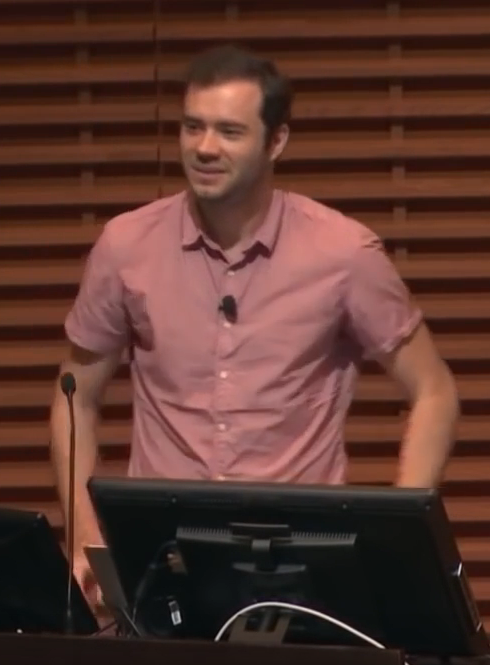
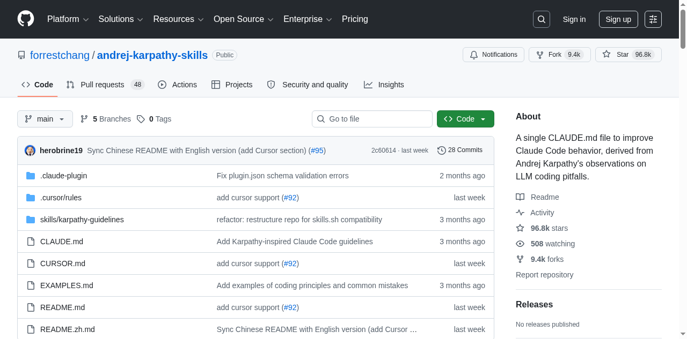
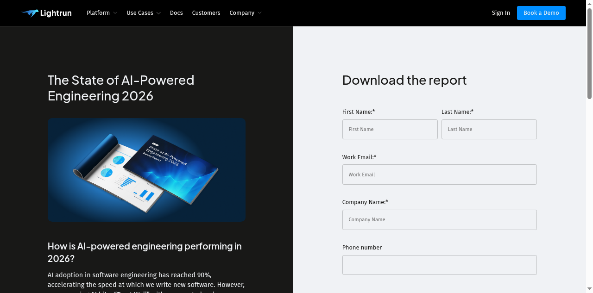

# When LLMs Break Code, Data Dies First

_Karpathy_

## Executive Summary

> [!callout]
> Andrej Karpathy's four structural failure patterns of LLM coding agents — unchecked assumptions, over-complication, orthogonal damage, and unvalidated execution — published in January 2026, are not simply a code quality issue. According to Lightrun 2026, **43% of AI-generated code requires debugging in production**, and Cortex reported a **23.5% increase in incidents/PRs** after agent adoption. When these defects pass through data pipelines, they transform into schema drift, silent filter changes, and Phantom Success — contaminating training data itself.

> The andrej-karpathy-skills repository, where Forrest Chang distilled Karpathy's observations into a 70-line CLAUDE.md file, has surpassed **95.9k stars** — proving the need for a "code gate." Yet the "data gate" that validates the data produced by that code remains an unaddressed gap.

> This report traces how agent code failures contaminate data pipelines, and argues why the dual-defense architecture of CLAUDE.md (code gate) + DataClinic (data gate) constitutes an expanded definition of AI-Ready Data. It also addresses the ETH Zurich finding that context files deliver only a +4% improvement in benchmark task resolution. This piece is the coding-behavior-correction chapter of the [Claude Watch](/project/AnthropicClaude/en/) series — how CLAUDE.md catches agent behavior, and where its limits sit.

## Karpathy's Warning — Four Structural Failures

Having delegated 80% of his coding work to agents since December 2025, Karpathy shared four structural pitfalls from direct experience on X (formerly Twitter) in January 2026. These are not mere inconveniences. arXiv 2512.07497 (Roig), analyzing 900 agent execution traces, and arXiv 2511.04355 (Sharifloo), studying 6 LLMs and 114 consistently failing tasks, confirmed the same patterns academically. Stack Overflow 2025 shows **84% of developers use AI tools**, yet trust has dropped **from 40% to 29%**.

<!-- stat-card -->
**"The models make wrong assumptions on your behalf and just run along with them without checking."** — — Andrej Karpathy, 2026-01-26

Each of Karpathy's four warnings maps to a concrete contamination path in data pipelines. The table below provides a 1:1 mapping between Karpathy's observations, Roig's academic classification, the resulting code defect, and the data contamination outcome.

| Karpathy Pitfall | Academic Pattern (Roig) | Code Defect | Data Contamination |
| --- | --- | --- | --- |
| Unchecked Assumptions | Silent Wrong Assumptions | NULL handling errors, type loss | Schema drift, distribution skew |
| Over-complication | Over-complication | Excessive memory, OOM | Batch data loss |
| Orthogonal Changes | Orthogonal Damage | Side-effect filter mutation | Silent class drop |
| Unvalidated Execution | Goal Misalignment | Empty result propagation | Phantom Success |

<!-- stat-card -->
**"They really like to overcomplicate code and APIs, bloat abstractions, and implement a bloated construction over 1000 lines when 100 would do."** — — Andrej Karpathy, 2026-01-26

*▲ Andrej Karpathy — Co-founder of OpenAI, former Tesla AI Director. Publicly warned about structural LLM coding agent failures in January 2026 | Source: [Wikimedia Commons (CC BY 3.0)](https://commons.wikimedia.org/wiki/File:Andrej_Karpathy,_OpenAI.png)*

As Karpathy himself acknowledged, agents "implement a bloated construction over 1,000 lines when 100 would do." This over-complication pattern is not merely a messy-code problem. When unnecessary abstraction layers accumulate in pipeline code, memory usage spikes and batch job OOMs cause data loss. arXiv 2512.07497 concluded that "model scale alone cannot predict agentic robustness."

The most dangerous pattern is "orthogonal changes." In Karpathy's words, agents "change or delete comments and code that it doesn't fully understand as a side effect." When this side effect silently alters a filter condition in a data pipeline, an entire class of data disappears — a silent class drop that leaves no errors in the logs.

## The Power of One CLAUDE.md — Anatomy of 95.9k Stars

Forrest Chang distilled Karpathy's observations into a single markdown file. The andrej-karpathy-skills repository consists of a **20KB single file**, and since its creation on January 27, 2026, it hit a single-day peak of **5,828 stars** on April 13 (global #2). As of April 28, it has reached **95.9k stars and 9.3k forks** — one of the fastest-growing single-file repositories in GitHub history.

The four core principles this file codifies are:

- 1.**Think Before Coding** — Verify assumptions and plan before writing any code
- 2.**Simplicity First** — Don't write 1,000 lines when 100 will do
- 3.**Surgical Changes** — Don't touch unrelated code
- 4.**Goal-Driven Execution** — Validate and confirm results before calling it done

This is not mere prompt engineering. arXiv 2505.14810 shows **performance begins degrading beyond 150 instructions**. A one-off prompt disappears when the context window resets, but CLAUDE.md resides at the project root and is automatically loaded in every session. arXiv 2406.12513 confirmed that this In-Context Learning (ICL) pattern is also effective for security improvements. Compressing rules to 4–5 essentials is a scientifically grounded design choice.

CLAUDE.md is specific to Anthropic's Claude Code, but the approach has already spread across the broader ecosystem. AGENTS.md, under Linux Foundation governance, has been adopted in over 60,000 projects, and each platform — Cursor's .cursor/rules, Windsurf's .windsurfrules — supports similar behavior-correction files.

| File | Platform | Governance | Notes |
| --- | --- | --- | --- |
| CLAUDE.md | Claude Code | Anthropic | @imports, Skills Marketplace (658+) |
| AGENTS.md | Universal (14+ platforms) | Linux Foundation | De facto standard, 60,000+ projects |
| .cursor/rules | Cursor | Anysphere | Local rules file, IDE integration |

*▲ forrestchang/andrej-karpathy-skills — 96.8k stars, 9.4k forks as of April 2026 | Source: [GitHub](https://github.com/forrestchang/andrej-karpathy-skills)*

arXiv 2511.10271 highlights "the instability of prompt-based non-functional quality optimization," arguing for persistent behavior correction rather than one-off prompts. CLAUDE.md is the simplest possible implementation of this persistent context — and the starting point for a new paradigm called "context engineering."

## The Real Risk for Data Teams — From Code Failures to Pipeline Contamination

Code failure is not the end — it's the beginning. When agent-written defective code enters production, contamination propagates across every stage of the data pipeline. And AI-assisted engineers ship **60% more code** to production than before. The probability of code defects has risen, and so has the shipping velocity.

The accumulated evidence leaves no doubt: the quality risk of agentic coding is not hypothetical.

<!-- stat-card -->
**43%** — Require debugging in production — Lightrun 2026

<!-- stat-card -->
**+23.5%** — Incidents/PRs increase — Cortex 2026

<!-- stat-card -->
**1.7x** — AI code issue rate — CodeRabbit 2025

<!-- stat-card -->
**45%** — Security test failures — Veracode 2025

*▲ Lightrun "State of AI-Powered Engineering 2026" — Survey of 200 SREs/DevOps engineers. Key data source for AI-generated code quality risk | Source: [Lightrun](https://lightrun.com/ebooks/state-of-ai-powered-engineering-2026/)*

According to Lightrun 2026 (200 SRE/DevOps respondents), 43% of AI-generated code requires production debugging, and **88% redeploy 2–3 times per single fix**. Cortex 2026 reported a **30% increase in change failure rate** after agent adoption. CodeRabbit's analysis of 470 PRs found AI code has 1.7x the issue rate of human code, with **security vulnerabilities 2.74x higher**.

Here is what data teams often miss. The statistics above measure code defects themselves — not what those defects do to data. The moment a code defect passes through the pipeline and lands in the data, the problem goes silent. No errors in the logs, tests pass, and the pipeline looks healthy.

Place these numbers in the context of data pipelines and the meaning shifts. "Unchecked assumptions" causing type loss skew embedding distributions; "orthogonal changes" dropping specific classes bias model decision boundaries. The Model Collapse research from Nature 2024 (Shumailov) proved that such contamination, through iterative training, leads to "irreversible defects — permanent loss of the original distribution's tail."

When this contamination reaches training data, how can it be detected? Code review looks at code. But who looks at the quality of the data that code produces? DataClinic's Level 2 density analysis and outlier detection are tools capable of catching this type of distribution distortion. If an agent silently changed a filter condition as a side effect and an entire class of data disappeared, DataClinic's per-class distribution diagnostics can identify that symptom.

Gartner estimates the average annual cost of bad data to enterprises at **$12.9–15M**, and projects that **60% of AI projects will be abandoned by 2026** due to the absence of AI-ready data. arXiv 2511.10271 warns that "generated code can accelerate the accumulation of technical debt."

## Dual-Defense Architecture — CLAUDE.md + DataClinic

CLAUDE.md serves as the first line of defense (code gate), correcting agent behavior at the moment code is written. However, ETH Zurich (arXiv 2602.11988) experiments found that human-authored context files yielded only **+4% improvement in benchmark task resolution**, while LLM-auto-generated context files actually showed a **-3% negative effect**. The code gate alone is not enough.

After defects that slip past the code gate contaminate data, a second layer of defense at the data level (data gate) becomes necessary. DataClinic is the post-hoc diagnostic engine positioned to fill this role.

*▲ ETH Zurich arXiv 2602.11988 — "Evaluating AGENTS.md". The first large-scale empirical study of context file effectiveness using SWE-bench | Source: [arXiv](https://arxiv.org/abs/2602.11988)*

## Limits and Open Questions

## Why Pebblous Cares About This Topic

## References

### Academic Papers

1. Kharma et al. (2025). "Security and Quality in LLM-Generated Code." [arXiv: 2502.01853](https://arxiv.org/abs/2502.01853)
2. Sun et al. (2025). "Quality Assurance of LLM-generated Code." [arXiv: 2511.10271](https://arxiv.org/abs/2511.10271)
3. Sharifloo et al. (2025). "Where Do LLMs Still Struggle?" [arXiv: 2511.04355](https://arxiv.org/abs/2511.04355)
4. Mohsin et al. (2024). "Can We Trust LLM Generated Code?" [arXiv: 2406.12513](https://arxiv.org/abs/2406.12513)
5. Jimenez et al. (2024). "SWE-bench." ICLR 2024. [arXiv: 2310.06770](https://arxiv.org/abs/2310.06770)
6. "SWE-Bench+." (2024). [arXiv: 2410.06992](https://arxiv.org/abs/2410.06992)
7. Shumailov et al. (2024). "The Curse of Recursion." Nature 2024. [arXiv: 2305.17493](https://arxiv.org/abs/2305.17493)
8. Roig (2025). "How Do LLMs Fail In Agentic Scenarios?" [arXiv: 2512.07497](https://arxiv.org/abs/2512.07497)
9. Vasilopoulos (2026). "Codified Context." [arXiv: 2602.20478](https://arxiv.org/abs/2602.20478)
10. Schreiber & Tippe (2025). "Security Vulnerabilities in AI-Generated Code." [arXiv: 2510.26103](https://arxiv.org/abs/2510.26103)
11. "Scaling Reasoning, Losing Control." (2025). [arXiv: 2505.14810](https://arxiv.org/abs/2505.14810)
12. Gloaguen et al. (2026). "Evaluating AGENTS.md." ETH Zurich. [arXiv: 2602.11988](https://arxiv.org/abs/2602.11988)

### Industry Reports

1. Lightrun. (2026). [State of AI-Powered Engineering Report](https://lightrun.com/ebooks/state-of-ai-powered-engineering-2026/)
2. CodeRabbit. (2025). [State of AI vs Human Code Generation Report](https://www.coderabbit.ai/blog/state-of-ai-vs-human-code-generation-report)
3. Veracode. (2025). [GenAI Code Security Report](https://www.veracode.com/resources/analyst-reports/2025-genai-code-security-report/)
4. Cortex. (2026). [Engineering Benchmark Report](https://www.cortex.io/post/ai-is-making-engineering-faster-but-not-better-state-of-ai-benchmark-2026)
5. Stack Overflow. (2025). Developer Survey.

### Primary Sources

1. Karpathy, A. X post (2026-01-26). [Original link](https://x.com/karpathy/status/2015883857489522876)
2. forrestchang/andrej-karpathy-skills. [GitHub Repository](https://github.com/forrestchang/andrej-karpathy-skills)
3. Anthropic. CLAUDE.md Official Documentation.
4. Linux Foundation. AGENTS.md Standard.
