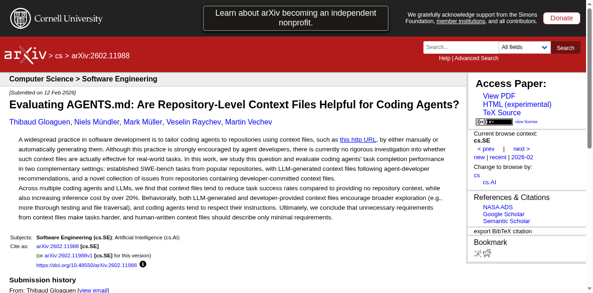

# LLM이 코드를 망칠 때, 데이터가 먼저 죽는다

_Karpathy의 4대 코딩 함정과 CLAUDE.md 행동 교정 — 데이터팀이 알아야 할 진짜 이야기_

## Executive Summary

> [!callout]
> Andrej Karpathy가 2026년 1월 공개한 LLM 코딩 에이전트의 4대 구조적 실패 패턴(가정 미확인, 과복잡화, 직교적 수정, 미검증 실행)은 코드 품질의 문제에 그치지 않는다. Lightrun 2026에 따르면 AI 생성 코드의 **43%가 프로덕션에서 디버깅이 필요**하고, Cortex는 에이전트 도입 후 **인시던트/PR이 23.5% 증가**했다고 보고했다. 이 결함들이 데이터 파이프라인을 관통하면 스키마 드리프트, 사일런트 필터 변경, 유령 성공(Phantom Success)으로 변환되어 학습 데이터 자체를 오염시킨다.

> Forrest Chang이 Karpathy의 관찰을 70줄짜리 CLAUDE.md 파일로 체계화한 andrej-karpathy-skills 저장소는 **95.9k 스타**를 돌파하며 "코드 게이트"의 필요성을 입증했다. 그러나 코드가 생성한 데이터 자체를 검증하는 "데이터 게이트"는 여전히 공백이다.

> 이 보고서는 에이전트 코드 실패가 데이터 파이프라인을 어떻게 오염시키는지를 추적하고, CLAUDE.md(코드 게이트) + DataClinic(데이터 게이트)의 2중 방어 아키텍처가 왜 AI-Ready Data의 확장된 정의를 구성하는지 논증한다. ETH Zurich 연구에서 컨텍스트 파일의 효과가 +4%에 불과하다는 결과도 함께 다룬다. 이 글은 [Claude 워치](/project/AnthropicClaude/ko/) 시리즈의 코딩 행동 교정 편으로, CLAUDE.md가 에이전트의 행동을 어떻게 잡고, 그 한계는 어디까지인지를 본다.

## Karpathy의 경고 — 4대 구조적 실패

2025년 12월부터 코딩 작업의 80%를 에이전트에게 위임해온 Karpathy는 2026년 1월, X(구 Twitter)에서 직접 체험한 4가지 구조적 함정을 공개했다. 단순한 불편 사항이 아니다. arXiv 2512.07497(Roig)의 900개 에이전트 실행 트레이스 분석과 arXiv 2511.04355(Sharifloo)의 6개 LLM, 114개 일관 실패 태스크 연구가 동일한 패턴을 학술적으로 확인했다. Stack Overflow 2025 설문에서 개발자의 **84%가 AI 도구를 사용**하지만, 신뢰도는 **40%에서 29%로 하락**했다.

<!-- stat-card -->
**"The models make wrong assumptions on your behalf and just run along with them without checking."** — — Andrej Karpathy, 2026-01-26

Karpathy의 네 가지 경고는 각각 데이터 파이프라인에서 구체적인 오염 경로로 변환된다. 아래 표는 Karpathy의 관찰, Roig의 학술 분류, 코드 결함, 데이터 오염 결과를 1:1로 매핑한 것이다.

| Karpathy 함정 | 학술 원형 (Roig) | 코드 결함 | 데이터 오염 |
| --- | --- | --- | --- |
| 가정 미확인 | Silent Wrong Assumptions | NULL 처리 오류, 타입 손실 | 스키마 드리프트, 분포 왜곡 |
| 과복잡화 | Over-complication | 메모리 과다, OOM | 배치 데이터 누락 |
| 직교적 수정 | Orthogonal Damage | 부작용 필터 변경 | 사일런트 클래스 드랍 |
| 미검증 실행 | Goal Misalignment | 빈 결과 전파 | Phantom Success |

<!-- stat-card -->
**"They really like to overcomplicate code and APIs, bloat abstractions, and implement a bloated construction over 1000 lines when 100 would do."** — — Andrej Karpathy, 2026-01-26

*▲ Andrej Karpathy — OpenAI 공동창업자, 전 Tesla AI 디렉터. 2026년 1월 LLM 코딩 에이전트의 구조적 실패를 공개 경고했다 | Source: [Wikimedia Commons (CC BY 3.0)](https://commons.wikimedia.org/wiki/File:Andrej_Karpathy,_OpenAI.png)*

Karpathy 자신도 인정했듯, 에이전트는 "100줄이면 충분한 작업에 1,000줄짜리 추상화를 세운다." 이 과복잡화 패턴은 단순히 코드가 지저분해지는 문제가 아니다. 파이프라인 코드에 불필요한 추상 계층이 쌓이면 메모리 사용량이 급증하고, 배치잡 OOM으로 데이터가 누락된다. arXiv 2512.07497은 이를 두고 "모델 규모만으로는 에이전틱 견고성을 예측할 수 없다"고 결론지었다.

가장 위험한 것은 "직교적 수정"이다. Karpathy의 표현을 빌리면, 에이전트는 "충분히 이해하지 못한 코멘트와 코드를 부작용으로 변경하거나 삭제한다." 데이터 파이프라인에서 이 부작용이 필터 조건을 조용히 바꾸면, 특정 클래스의 데이터가 통째로 사라지는 사일런트 클래스 드랍이 발생한다. 로그에는 에러가 남지 않는다.

## CLAUDE.md 한 장의 힘 — 95.9k Stars 해부

Forrest Chang은 Karpathy의 관찰을 하나의 마크다운 파일로 압축했다. andrej-karpathy-skills 저장소는 **20KB 단일 파일**로 구성되며, 2026년 1월 27일 생성 이후 4월 13일에 일일 최고 **5,828 스타**(글로벌 2위)를 기록했다. 4월 28일 현재 **95.9k 스타, 9.3k 포크**를 달성해 GitHub 역사상 가장 빠르게 성장한 단일 파일 저장소 중 하나가 되었다.

이 파일이 체계화한 4가지 핵심 원칙은 다음과 같다.

- 1.**Think Before Coding** — 코드를 쓰기 전에 가정을 확인하고 계획을 세운다
- 2.**Simplicity First** — 100줄로 충분한 일에 1,000줄을 쓰지 않는다
- 3.**Surgical Changes** — 관련 없는 코드를 건드리지 않는다
- 4.**Goal-Driven Execution** — 결과를 검증하고 확인한 뒤 완료한다

이것은 단순한 프롬프트 엔지니어링이 아니다. arXiv 2505.14810에 따르면 **150개 이상의 지시에서 성능 하락이 시작**된다. 일회성 프롬프트는 컨텍스트 윈도우가 초기화되면 사라지지만, CLAUDE.md는 프로젝트 루트에 상주하며 모든 세션에서 자동으로 로드된다. arXiv 2406.12513은 이러한 In-Context Learning(ICL) 패턴이 보안 개선에도 효과적임을 확인했다. 4~5개 핵심 규칙으로의 압축은 과학적 근거가 있는 선택이다.

CLAUDE.md는 Anthropic Claude Code 전용이지만, 이 접근법은 이미 생태계 전체로 확산되고 있다. Linux Foundation 관할의 AGENTS.md는 60,000개 이상의 프로젝트에서 채택되었으며, Cursor의 .cursor/rules, Windsurf의 .windsurfrules 등 각 플랫폼이 유사한 행동 교정 파일을 지원한다.

| 파일 | 플랫폼 | 관할 | 특징 |
| --- | --- | --- | --- |
| CLAUDE.md | Claude Code | Anthropic | @imports, Skills Marketplace(658+) |
| AGENTS.md | 범용(14+ 플랫폼) | Linux Foundation | 사실상 표준, 60,000+ 프로젝트 |
| .cursor/rules | Cursor | Anysphere | 로컬 룰 파일, IDE 통합 |

*▲ forrestchang/andrej-karpathy-skills — 2026년 4월 기준 96.8k 스타, 9.4k 포크 | Source: [GitHub](https://github.com/forrestchang/andrej-karpathy-skills)*

arXiv 2511.10271은 "프롬프트 기반 비기능 품질 최적화의 불안정성"을 지적하며, 일회성 프롬프트가 아닌 지속적 행동 교정의 필요성을 논증했다. CLAUDE.md는 바로 이 지속적 컨텍스트의 가장 단순한 구현이며, "컨텍스트 엔지니어링"이라는 새로운 패러다임의 출발점이다.

## 데이터팀의 진짜 위험 — 코드 실패에서 파이프라인 오염으로

코드 실패는 끝이 아니라 시작이다. 에이전트가 작성한 결함 있는 코드가 프로덕션에 투입되면, 데이터 파이프라인의 전 단계에 걸쳐 오염이 전파된다. 그리고 AI 지원 엔지니어는 기존보다 코드를 **60% 더 많이** 프로덕션에 출하한다. 코드 결함의 확률이 높아지고, 출하 속도까지 빨라진 셈이다.

현재까지 축적된 수치를 종합하면, 에이전트 코딩의 품질 위험은 결코 가설이 아니다.

<!-- stat-card -->
**43%** — 프로덕션 디버깅 필요 — Lightrun 2026

<!-- stat-card -->
**+23.5%** — 인시던트/PR 증가 — Cortex 2026

<!-- stat-card -->
**1.7x** — AI 코드 이슈율 — CodeRabbit 2025

<!-- stat-card -->
**45%** — 보안 테스트 실패 — Veracode 2025

*▲ Lightrun "State of AI-Powered Engineering 2026" — 200명 SRE/DevOps 대상 조사. AI 생성 코드 품질 위험의 핵심 데이터 출처 | Source: [Lightrun](https://lightrun.com/ebooks/state-of-ai-powered-engineering-2026/)*

Lightrun 2026(200명 SRE/DevOps 대상)에 따르면 AI 생성 코드의 43%가 프로덕션에서 디버깅을 필요로 하며, **88%가 수정 1건에 2~3회 재배포**한다. Cortex 2026은 에이전트 도입 후 **change failure rate가 30% 증가**했음을 보고했다. CodeRabbit은 470개 PR 분석에서 AI 코드의 이슈율이 인간 대비 1.7배, **보안 취약점은 2.74배**라고 밝혔다.

여기서 데이터팀이 놓치기 쉬운 지점이 있다. 위 수치들은 코드 결함 자체의 통계이지, 그 결함이 데이터를 어떻게 망가뜨리는지는 측정하지 않는다. 코드 결함이 파이프라인을 통과해 데이터에 착지하는 순간, 문제는 조용해진다. 로그에는 에러가 없고, 테스트도 통과하며, 파이프라인은 정상으로 보인다.

이 수치들을 데이터 파이프라인의 맥락에 놓으면, 의미가 달라진다. "가정 미확인"으로 타입이 손실되면 임베딩 분포가 왜곡되고, "직교적 수정"으로 특정 클래스가 누락되면 모델 결정 경계가 편향된다. Nature 2024(Shumailov)의 Model Collapse 연구는 이러한 오염이 반복 학습을 통해 "비가역적 결함, 즉 원본 분포의 tail이 영구 소실"된다고 증명했다.

이 오염이 학습 데이터에 도달했을 때, 어떻게 탐지할 수 있는가? 코드 리뷰는 코드를 본다. 하지만 코드가 만들어낸 데이터의 품질은 누가 보는가? DataClinic의 Level 2 밀도 분석과 아웃라이어 탐지는 이 유형의 분포 왜곡을 포착할 수 있는 도구다. 에이전트가 부작용으로 필터 조건을 바꿔 특정 클래스 데이터가 사라졌다면, DataClinic의 클래스별 분포 진단이 그 증상을 식별할 수 있다.

Gartner는 불량 데이터로 인한 기업 평균 연간 비용을 **$12.9~15M**으로 추정하며, **2026년까지 AI 프로젝트의 60%가 AI-ready data 부재로 포기**될 것으로 예측했다. arXiv 2511.10271은 "생성된 코드가 기술 부채의 축적을 가속화할 수 있다"고 경고한다.

## 2중 방어 아키텍처 — CLAUDE.md + DataClinic

CLAUDE.md는 에이전트가 코드를 작성하는 시점에서 행동을 교정하는 1차 방어선(코드 게이트)이다. 그러나 ETH Zurich(arXiv 2602.11988)의 실험 결과, 인간이 작성한 컨텍스트 파일의 효과는 **벤치마크 태스크 해결률 기준 +4%**에 불과했고, LLM이 자동 생성한 컨텍스트 파일은 오히려 **-3%**의 역효과를 보였다. 코드 게이트만으로는 충분하지 않다.

코드 게이트를 통과한 결함이 데이터를 오염시킨 후에는, 데이터 수준의 2차 방어선(데이터 게이트)이 필요하다. DataClinic은 이 역할을 수행할 수 있는 사후 진단 엔진이다.

*▲ ETH Zurich arXiv 2602.11988 — "Evaluating AGENTS.md". 컨텍스트 파일의 실제 효과를 SWE-bench 기반으로 실증한 최초의 대규모 연구 | Source: [arXiv](https://arxiv.org/abs/2602.11988)*

## 한계와 남은 질문

## 페블러스가 이 주제에 주목하는 이유

## 참고문헌

### 학술 논문

1. Kharma et al. (2025). "Security and Quality in LLM-Generated Code." [arXiv: 2502.01853](https://arxiv.org/abs/2502.01853)
2. Sun et al. (2025). "Quality Assurance of LLM-generated Code." [arXiv: 2511.10271](https://arxiv.org/abs/2511.10271)
3. Sharifloo et al. (2025). "Where Do LLMs Still Struggle?" [arXiv: 2511.04355](https://arxiv.org/abs/2511.04355)
4. Mohsin et al. (2024). "Can We Trust LLM Generated Code?" [arXiv: 2406.12513](https://arxiv.org/abs/2406.12513)
5. Jimenez et al. (2024). "SWE-bench." ICLR 2024. [arXiv: 2310.06770](https://arxiv.org/abs/2310.06770)
6. "SWE-Bench+." (2024). [arXiv: 2410.06992](https://arxiv.org/abs/2410.06992)
7. Shumailov et al. (2024). "The Curse of Recursion." Nature 2024. [arXiv: 2305.17493](https://arxiv.org/abs/2305.17493)
8. Roig (2025). "How Do LLMs Fail In Agentic Scenarios?" [arXiv: 2512.07497](https://arxiv.org/abs/2512.07497)
9. Vasilopoulos (2026). "Codified Context." [arXiv: 2602.20478](https://arxiv.org/abs/2602.20478)
10. Schreiber & Tippe (2025). "Security Vulnerabilities in AI-Generated Code." [arXiv: 2510.26103](https://arxiv.org/abs/2510.26103)
11. "Scaling Reasoning, Losing Control." (2025). [arXiv: 2505.14810](https://arxiv.org/abs/2505.14810)
12. Gloaguen et al. (2026). "Evaluating AGENTS.md." ETH Zurich. [arXiv: 2602.11988](https://arxiv.org/abs/2602.11988)

### 업계 보고서

1. Lightrun. (2026). [State of AI-Powered Engineering Report](https://lightrun.com/ebooks/state-of-ai-powered-engineering-2026/)
2. CodeRabbit. (2025). [State of AI vs Human Code Generation Report](https://www.coderabbit.ai/blog/state-of-ai-vs-human-code-generation-report)
3. Veracode. (2025). [GenAI Code Security Report](https://www.veracode.com/resources/analyst-reports/2025-genai-code-security-report/)
4. Cortex. (2026). [Engineering Benchmark Report](https://www.cortex.io/post/ai-is-making-engineering-faster-but-not-better-state-of-ai-benchmark-2026)
5. Stack Overflow. (2025). Developer Survey.

### 1차 출처

1. Karpathy, A. X 포스트 (2026-01-26). [원문 링크](https://x.com/karpathy/status/2015883857489522876)
2. forrestchang/andrej-karpathy-skills. [GitHub Repository](https://github.com/forrestchang/andrej-karpathy-skills)
3. Anthropic. CLAUDE.md 공식 문서.
4. Linux Foundation. AGENTS.md 표준.
