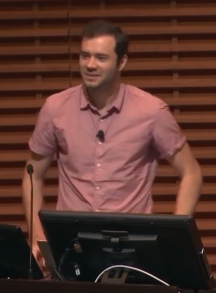
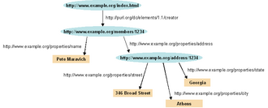
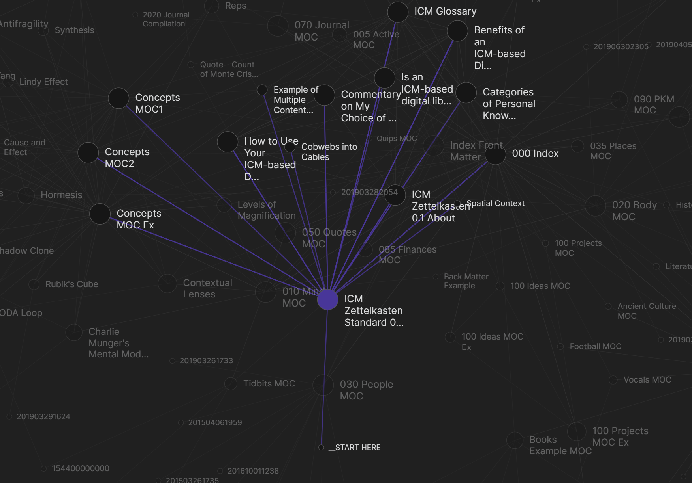

# LLMs That Compile Knowledge

_From Karpathy_

## Executive Summary

> [!callout]
> On April 3–4, 2026, Andrej Karpathy shared an LLM-powered personal knowledge base (PKB) methodology on X and GitHub Gist. This is not a productivity tip. It is a direct challenge to the knowledge representation paradigm — two decades built on OWL, SPARQL, and the specialized profession of ontology engineering. Traditional enterprise knowledge graphs demand $10M–$20M in upfront investment and years of expert labor, yet reach production deployment at a rate of only 27%. Karpathy achieves the same knowledge representation functionality with LLMs, Markdown, and Obsidian.

> What Pebblous editor JH has called "Cheap Ontology" is exactly the right framing. The methodology runs on three layers: raw source materials stored immutably in a `raw/` directory (Layer 1); a Markdown wiki compiled and maintained by LLMs (Layer 2); and a schema document — a CLAUDE.md or AGENTS.md — that governs how the LLM operates (Layer 3). The key innovation is compounding. Traditional RAG performs a one-time retrieval against a vector database per query. In the Karpathy wiki, even query outputs get filed back into the wiki, so the knowledge asset grows with every use.

> Context window expansion is what made this practical. From 2K tokens in GPT-3 (2020) to 2M tokens in Gemini 2.0 Pro (2025) — a 1,000× expansion in five years. Since Gemini 1.5 Pro hit 1M tokens in 2024, loading an entire wiki into a single context has become technically viable without any vector database. The critical bottleneck in this pipeline is the front door: if the raw data is noisy, errors propagate into the wiki, and if that wiki is then used to generate synthetic Q&A for fine-tuning, those errors get baked into model weights permanently. Data quality diagnosis — what DataClinic provides — is the prerequisite for everything downstream. This article is part of the [Neuro-Symbolic × Ontology hub](/project/NeuroSymbolicOntology/en/) series — tracing how twenty years of ontology engineering is being quietly democratized in the LLM era.

$10M–$20M

Enterprise KG build cost

1.5M+

Obsidian monthly active users

2×

RAG accuracy on new facts  
(vs. fine-tuning)

1.8 hrs

Daily time spent searching  
for information (McKinsey)

"Every business has a raw/ directory. Nobody's ever compiled it. That's the product."

— Vamshi Reddy (X), endorsed by Karpathy

*▲ Andrej Karpathy — former Director of AI at Tesla, co-founder of OpenAI, who shared this knowledge base methodology in April 2026 | Source: [Wikimedia Commons](https://commons.wikimedia.org/wiki/File:Andrej_Karpathy,_OpenAI.png) (CC BY 2.0)*

## 1. A History of Ontology — The Road to Cheap Ontology

To grasp why Karpathy's approach is disruptive, you need to trace the 20-year lineage of knowledge representation — the journey from expert-built ontologies costing millions to a few Markdown files and an LLM API call.

Phase 1 · 1970s–2000

### Traditional Ontology — From Philosophy to Engineering

Ontology began as a philosophical term — a "formal catalog of what exists" — before AI researchers began translating it into machine-readable form. Description Logic, Frame Systems, and the Cyc Project (launched in 1984, attempting to encode all of human common sense into a computer) defined this era. The fundamental constraint was the Closed World Assumption: "anything not explicitly known is false." Real-world knowledge, of course, is open and incomplete.

Phase 2 · 2001–2007

### The Semantic Web — An Era of Standards

Tim Berners-Lee's 2001 Scientific American paper on the Semantic Web (cited over 30,000 times) laid out a vision of a machine-readable web. The technology stack grew layer by layer: RDF → RDFS → OWL → SPARQL. The W3C's OWL recommendation (2004), grounded in Description Logic, enabled automated reasoning engines. SKOS (2009) provided an RDF representation of thesauri and classification schemes, gaining adoption in library and archival communities.

But the reality was harsh. **Build costs of $10M–$20M, ontology engineer salaries of $107,282–$206,907/year (ZipRecruiter, 2025), and a production adoption rate of just 27%.** This is what Graph Praxis (February 2026) called the "ontology tax" — technically viable, but out of reach for most organizations.

*▲ RDF knowledge graph — the Semantic Web's subject-predicate-object triple structure. OWL and SPARQL built layers on top of this foundation, but required $10M–$20M in specialist labor to implement at enterprise scale | Source: [Wikimedia Commons](https://commons.wikimedia.org/wiki/File:Rdf-graph2.png) (CC BY-SA 3.0)*

Phase 3 · 2007–2020

### The Knowledge Graph Era — Victory at Scale

DBpedia (2007) converted Wikipedia infoboxes into RDF triples, launching the Linked Open Data movement. Google Knowledge Graph (2012) built 570 million entities and 18 billion facts within seven months, supporting one-third of Google's 100 billion monthly searches. Wikidata (2012–present) has grown to 119 million items as of 2025.

The KG market is forecast to grow from $1.07B (2024) to $6.94B (2030) at a 36.6% CAGR (MarketsandMarkets, 2025). But expert dependency remained entrenched. A domain change meant redefining SPARQL queries and schemas from scratch. Tacit knowledge, procedural knowledge, and context-dependent knowledge remained stubbornly hard to formalize.

Phase 4 · 2024–

### LLM Wikis / "Cheap Ontology" — The Democratization Begins

Two technologies matured simultaneously: LLMs' natural language understanding and the explosive expansion of context windows. GPT-3 (2020): 2K → Claude 1 (2023): 100K → Gemini 1.5 Pro (2024): 1M → Gemini 2.0 Pro (2025): 2M tokens. A 1,000× expansion in five years.

Pan et al. (2024, IEEE TKDE) with their "Synergized LLMs+KGs" framework, and the LLM-empowered KG Construction Survey (arXiv:2510.20345, 2025), provide the academic grounding for this transition. What once took three distinct pipeline stages — entity extraction, relation extraction, ontology alignment — an LLM now handles in a single prompt.

The core shift: from Schema-based to Schema-free, from human experts to LLM agents. LLM-assisted KG construction is now reporting 300–320% ROI (Medium/Branzan, 2025). And in April 2026, Karpathy put all of this into language anyone can understand.

#### Three Structural Bottlenecks of Traditional Ontology

- ①**Expert dependency:** You need both an ontology engineer and a domain expert simultaneously. The talent pool commanding $107K–$207K/year is thin.
- ②**Maintenance overhead:** Domain changes require redefining SPARQL queries and schemas. Traditional KG pipelines cannot keep pace with business velocity.
- ③**Rigidity:** Formal logic struggles to capture tacit knowledge, procedural knowledge, and context-dependent knowledge — which is most of what actually matters in any organization.

## 2. The Karpathy Architecture — A Deep Dive

What Karpathy shared on X and GitHub Gist centers on a **3-layer structure** and **four operational cycles**. On the surface it sounds like "organizing notes with an LLM," but underneath, it's a re-implementation of core ontology engineering principles in Markdown.

"A large fraction of my recent token throughput is going less into manipulating code, and more into manipulating knowledge."

— Andrej Karpathy (X, 2026-04-03)

### The 3-Layer Architecture

#### Layer 1 · raw/ — The Immutable Source of Truth

The original repository for papers, articles, images, and datasets. **The LLM reads from here but never modifies it.** Obsidian Web Clipper converts web pages to Markdown and images for storage. LLM vision capabilities allow images to be referenced directly.

**Design philosophy:** Single Source of Truth. Hallucinations are quarantined from the originals. The data quality of this layer determines the quality of the entire pipeline downstream.

#### Layer 2 · Wiki — The Markdown Collection Generated and Maintained by LLMs

Karpathy's own wiki: **~100 articles, ~400K words (~533K tokens)**. The key components are an `index.md` (a categorized list of all pages with links and summaries) and a `log.md` (timestamped records of all changes).

As of 2026, with 1M-token context windows now standard across multiple frontier models, loading an entire wiki into a single context is practically viable — no vector database required for a robust Q&A experience.

#### Layer 3 · Schema — The LLM's Operating Blueprint

Delivered as **CLAUDE.md or AGENTS.md**. Contains wiki structure, conventions, and operational guidelines for ingestion, querying, and maintenance workflows. This tells the LLM how to maintain and extend the wiki.

What this means: OWL's formal axioms have been replaced by natural-language instructions in Markdown. Schema definition — once the exclusive province of ontology engineers — has been democratized.

### Four Operational Cycles

① Ingest — Absorbing Knowledge

One source triggers updates to 10–15 wiki pages. The flow: read source → summarize → update index.md → revise related entities and concepts → log in log.md. Every new paper read causes a small but meaningful refresh across the entire wiki.

② Query — Compounding Returns

This is Karpathy's key innovation. Query answers are saved as new wiki pages. Traditional RAG searches the index per query and stops there — retrieval without accumulation. The Karpathy wiki accumulates those results as knowledge assets. In his own words: _"outputs from queries get filed back into the wiki, so every exploration adds up."_ And why this works: _"the wiki is a persistent, compounding artifact."_

③ Lint (Health Check) — Maintaining Knowledge Integrity

The LLM takes on the role that a formal reasoner plays in traditional ontology engineering. Contradiction detection, checking stale claims, identifying orphan pages, surfacing missing concepts, verifying facts against web search. Karpathy's explicit list of functions: "find data inconsistencies, fill gaps, discover new connections."

④ Future — Next Steps

Two directions proposed. First: wiki → synthetic Q&A generation → fine-tuning → knowledge internalized into model weights. A path to building your own domain-specialist LLM. Second (Ephemeral Wiki): a frontier LLM, given a single question, automatically assembles an entire ephemeral wiki, runs a Lint loop, and outputs a final report. On-demand KG generation per query.

*▲ Obsidian — the Markdown wiki editor at the heart of the Karpathy methodology. Left: structured note editing; Right: graph view revealing connections across ~100 wiki articles | Source: [Obsidian.md](https://obsidian.md)*

#### The Tool Stack

- • **Obsidian**: Wiki IDE, Web Clipper, Graph View visualization (1.5M+ MAU, $25M ARR, avg. 43 min/day usage)
- • **qmd** (by Tobi Lutke / Shopify CEO): BM25 + vector + LLM re-ranking hybrid, fully on-device, node-llama-cpp-based
- • **Marp**: Markdown → slide deck generation
- • **Dataview**: Structured data queries via frontmatter YAML within the wiki
- • **Git**: Wiki version control (change history, branching for collaboration)

## 3. RAG vs. Fine-Tuning vs. the Karpathy Approach

These three approaches are not in competition — each is optimized for a different operating threshold. The right choice depends on data volume, query frequency, and the need for human auditability.

| Dimension | Traditional RAG | Fine-Tuning (FT) | Karpathy Approach |
| --- | --- | --- | --- |
| Knowledge storage | Vector DB (external) | Model weights (internal) | Markdown files (external) |
| New-fact accuracy | 0.875 (Ovadia 2024) | 0.504 (Ovadia 2024) | Depends on wiki quality |
| New knowledge retention (commercial APIs) | — | 37% (FineTuneBench 2024) | — |
| Updating context | Re-indexing | Re-training required | Add / edit files |
| Upfront cost | Low ($0) | Medium–High ($2K–$20K) | Low (API costs only) |
| Ongoing cost | $500–$3,000/mo | Low (post-training) | API token usage |
| Human auditability | Chunk-level (low) | Not possible (black box) | High (Markdown) |
| Scalability | Millions of documents | Unlimited (at training time) | ~100 articles sweet spot |
| Hallucination risk | Retrieval-dependent | Training data-dependent | Wiki contamination riskCaution |
| Compounding knowledge effect | None | None | Yes (query→wiki filing) |
| Best fit | Large scale (millions of docs) | High-frequency queries (100K+/day) | Small–medium (individual or team) |

************

#### Decision Guide by Threshold

- • **Karpathy approach optimal:** Individual or small team, domain knowledge accumulation, human auditability is critical, ~100-article scope
- • **RAG optimal:** Millions of documents, recency matters, frequent additions of new knowledge (accuracy 0.875 vs. FT 0.504)
- • **Fine-tuning optimal:** 100K+ queries/day + clearly defined repetitive tasks (10–50× cost reduction)
- • **RAFT hybrid:** Domain FT + RAG combination outperforms either alone. Agriculture domain FT alone: 81% → FT+RAG: 86% (arXiv:2401.08406)

*▲ Obsidian graph view of a mature wiki — the visual representation of compounding knowledge. Each node is an article; each edge is a link. Unlike RAG, query outputs are filed back as new nodes, making the graph grow with every use | Source: [Obsidian.md](https://obsidian.md)*

A notable competitor: Microsoft GraphRAG extracts a KG with LLMs and generates answers through community-based graph traversal. In one LinkedIn case study, it cut ticket resolution time from 40 hours to 15 hours (63% reduction). But building a 1M-token KG costs $20–$50 and hours of compute. LightRAG (2024) offers 10× token savings and 65–80% cost reduction versus GraphRAG. The Karpathy approach prioritizes human readability and auditability over raw scale — making it cost-effective for small-to-medium domain scopes.

## 4. Enterprise Adoption Reality — Opportunities and Traps

### The Opportunity

**Cost disruption:** Enterprise KG at $10M–$20M → LLM wiki running on local on-premise models (Llama 3, Mistral) with API costs only. A first working prototype is achievable within 8 weeks (Enterprise Knowledge). KG ROI: organizations reaching production are reporting 300–320% returns (2024–2025).

**An untapped product category:** Every company has meeting notes, emails, and documents sitting in raw/ state. Enterprise software that compiles these into an LLM wiki remains essentially unbuilt. A KG market growing from $1.07B (2024) to $6.94B (2030) at 36.6% CAGR indicates how large that opportunity is.

**Productivity ROI:** McKinsey's 2012 data still holds — employees spend 1.8 hours per day (25% of the workday) searching for information. IDC puts it at 2.5 hours. Deploying knowledge management tools can yield a 20–25% productivity improvement (McKinsey). Karpathy's proposed enterprise use case — "an internal LLM wiki fed by meeting notes and documents" — targets this directly.

**Local LLM privacy:** The Karpathy methodology supports on-device models like Llama 3 and Mistral. This makes it suitable for environments with significant data security concerns — finance, healthcare, large enterprises in regulated markets.

"The real product problem is not organization, it is epistemic integrity."

— Community critic (Gist discussion thread)

### Pitfalls and Criticisms

#### ① Hallucination contamination risk Most critical

When an LLM writes a wrong connection into the wiki, every subsequent query is contaminated. Steph Ango (Obsidian CEO) recommends vault separation as a hard requirement — keeping human-curated vaults strictly separate from agent-generated content. Tanwar et al. (2024, arXiv:2510.09359) found that fine-tuning on hallucinated data causes "poor calibration," permanently baking errors into model weights.

#### ② Scale limits

Karpathy himself acknowledged it: this does not scale to "a million documents." The ~400K-word sweet spot is the current practical limit within available context windows. For larger corpora, LlamaIndex (35% improvement in retrieval accuracy, 2025) or GraphRAG is more appropriate.

#### ③ Technical barrier to entry

Glen Rhodes called it "a hacky collection of scripts" — and Karpathy didn't disagree. Setting up CLI tooling, LLM API configuration, and Obsidian customization is out of reach for most non-technical users. That barrier is also a product opportunity.

#### ④ Enterprise scaling complexity

Cross-team contradictions, millions of records of conflicting tribal knowledge, and concurrent editing conflicts are difficult to resolve with basic Markdown. Microsoft 365 Copilot ($30/user/month) and Notion AI (Business $20/user/month) are already staking out this territory.

#### ⑤ Speed vs. trust tension

LLMs are fast but need verification. Traditional wikis are slow but build trust through community moderation. The right balance has not yet been established — enterprise deployments need governance policies in place before technical implementation, not after.

## 5. Where Pebblous Fits — Why DataClinic Is Non-Negotiable

The greatest risk in the Karpathy pipeline lives at the front door. No matter how capable the LLM, garbage in the raw data means garbage in the wiki. And if that contaminated wiki is used to generate synthetic Q&A for fine-tuning, the errors get locked into model weights permanently. Microsoft Research's phi-1 (2023) demonstrated the governing principle: "data quality matters more than model scale."

[raw/ data] → [DataClinic Diagnosis] → [LLM Compile] → [Markdown Wiki]
                                                              ↓
                                                    [Synthetic Q&A Generation]
                                                              ↓
                                                    [DataClinic Validation]
                                                              ↓
                                                         [Fine-Tuning]
                                                              ↓
                                                       [Domain Model]

### Critical Point 1: Quality Diagnosis at the raw/ Entry Gate

Karpathy himself specified the LLM-based health check — "find data inconsistencies, fill gaps, discover new connections." But an LLM health check does not guarantee the quality of the input data itself. The "hallucination contamination risk" flagged by Steph Ango (Obsidian CEO) ultimately traces back to uncertainty about raw data quality.

DataClinic's Level 1 (basic quality metrics), Level 2 (DataLens neural network analysis), and Level 3 (domain-custom diagnostics) provide quality assurance at the entry gate — stopping contamination before it enters the pipeline. As Elvis Saravia (DAIR.AI) has emphasized: "getting the data structure right first" is the foundation of effective LLM curation.

### Critical Point 2: The Synthetic Data + Fine-Tuning Stage

The academic evidence is unambiguous:

- •**phi-1 (arXiv:2306.11644, 2023):** A 1.3B parameter model trained on "textbook-quality" synthetic data achieved HumanEval 50.6% and MBPP 55.5% — competitive with models far larger. Data quality trumps model scale.
- •**Gretel (2024):** High-quality synthetic data delivered +73.6% performance improvement versus human expert-curated data.
- •**Tanwar et al. (arXiv:2510.09359, 2024):** Low-quality fine-tuning data causes "error amplification" — errors become fixed in model weights.
- •**Amazon Science (arXiv:2409.16341, 2024):** "Quality Matters" — a small amount of high-quality data consistently outperforms a large amount of low-quality data.
- •**Hybrid approach (arXiv:2410.09168, 2024):** Mixing real data with synthetic data outperforms either approach alone across all metrics.

### Market Size Context

$97B

Synthetic data market forecast (2030)

$3.23B (2023) → CAGR 31–42%

$6.94B

Knowledge graph market forecast (2030)

$1.07B (2024) → CAGR 36.6%

$62B

Enterprise knowledge management market (2033)

$20.15B (2024) → CAGR 13.6%

$2.45B

PKM software market

CAGR 16.3%

> [!callout]
> "The Karpathy methodology democratizes knowledge management. But output quality is a function of input quality. DataClinic is the first and last quality gate in the pipeline."

> In the emerging space of "LLM-based domain knowledge internalization" — where these markets intersect — DataClinic is positioned as the pipeline's quality assurance layer. In a $97B synthetic data market, "quality verification" is an independent business layer in its own right.

## FAQ

## References

### Primary Sources (Karpathy)

- 1.Karpathy, A. (2026-04-03). X post on LLM knowledge base. [x.com](https://x.com/karpathy/status/2039805659525644595)
- 2.Karpathy, A. (2026-04-04). GitHub Gist: LLM knowledge base methodology. [gist.github.com](https://gist.github.com/karpathy/442a6bf555914893e9891c11519de94f)

### Academic Papers

- 3.Berners-Lee, T., Hendler, J., & Lassila, O. (2001). The Semantic Web. _Scientific American_, 284(5), 34–43. (~30,000 citations)
- 4.Pan, S. et al. (2024). Unifying Large Language Models and Knowledge Graphs: A Roadmap. _IEEE Transactions on Knowledge and Data Engineering_. [arXiv:2306.08302](https://arxiv.org/abs/2306.08302)
- 5.Ovadia, O. et al. (2024). Fine-Tuning or Retrieval? Comparing Knowledge Injection in LLMs. _EMNLP 2024_. [arXiv:2312.05934](https://arxiv.org/abs/2312.05934)
- 6.Gunasekar, S. et al. (2023). Textbooks Are All You Need (phi-1). _Microsoft Research_. [arXiv:2306.11644](https://arxiv.org/abs/2306.11644)
- 7.Tanwar, S. et al. (2024). The Impact of Hallucinations in Finetuned LLMs. [arXiv:2510.09359](https://arxiv.org/abs/2510.09359)
- 8.Zhang, T. et al. (2024). RAFT: Adapting Language Model to Domain Specific RAG. [arXiv:2403.10131](https://arxiv.org/abs/2403.10131)
- 9.LLM-empowered Knowledge Graph Construction and Reasoning: A Survey (2025). [arXiv:2510.20345](https://arxiv.org/abs/2510.20345)
- 10.Edge, D. et al. (2024). From Local to Global: A Graph RAG Approach to Query-Focused Summarization. _Microsoft Research_. [arXiv:2404.16130](https://arxiv.org/abs/2404.16130)
- 11.Guo, T. et al. (2024). LightRAG: Simple and Fast Retrieval-Augmented Generation. [arXiv:2410.05779](https://arxiv.org/abs/2410.05779)
- 12.FineTuneBench (2024). Evaluating LLMs on Fine-Tuning New Information. [arXiv:2411.05059](https://arxiv.org/abs/2411.05059)
- 13.Amazon Science (2024). Quality Matters More Than Quantity in LLM Training. [arXiv:2409.16341](https://arxiv.org/abs/2409.16341)
- 14.Hybrid synthetic+real data approach (2024). [arXiv:2410.09168](https://arxiv.org/abs/2410.09168)

### Industry & Market Reports

- 15.McKinsey Global Institute (2012). The Social Economy: Unlocking Value and Productivity Through Social Technologies.
- 16.MarketsandMarkets (2025). Knowledge Graph Market — Global Forecast to 2030.
- 17.Graph Praxis (2026-02-01). The Ontology Tax: Why Enterprise KGs Stall at 27% Production Rate.
- 18.ZipRecruiter (2025). Ontology Engineer Salary Report, United States.
- 19.Gretel AI (2024). Synthetic Data Performance Benchmarks vs. Human-Curated Data.

<!-- stat-card -->
**📚 Neuro-Symbolic × Ontology Series** — This article is part of a series curated in the [Neuro-Symbolic × Ontology hub](/project/NeuroSymbolicOntology/en/) — 13 pieces threading System 1/2 integration, ontology as a formal foundation, and the diverse approaches from Palantir and the Semantic Web to Pebblous CURK.
