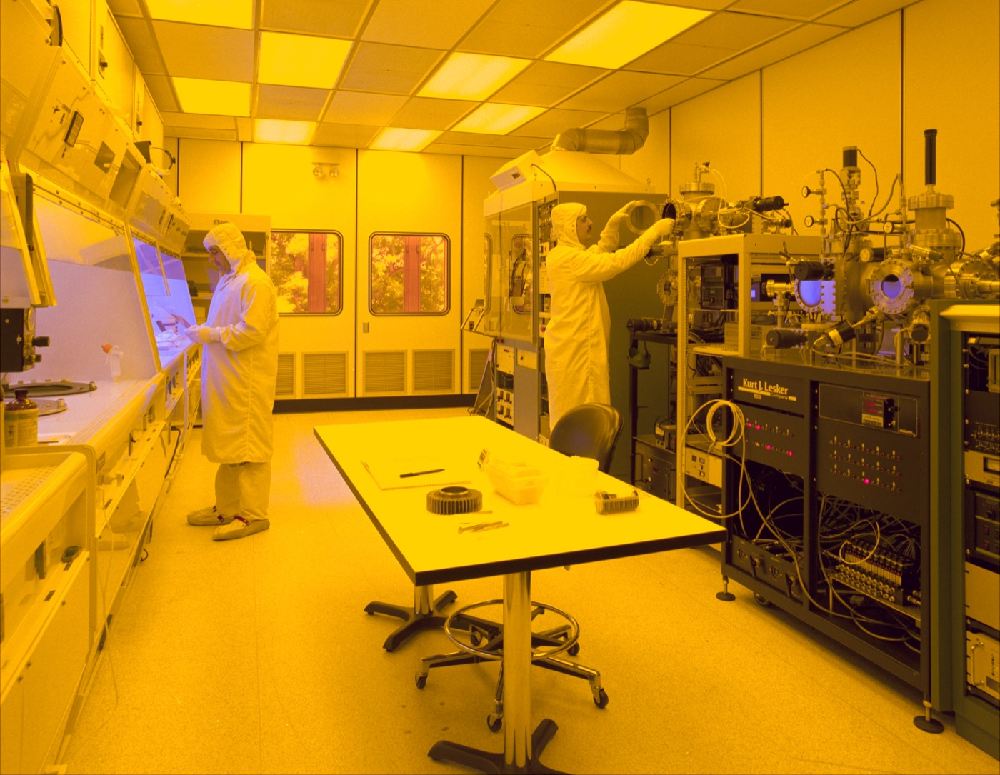
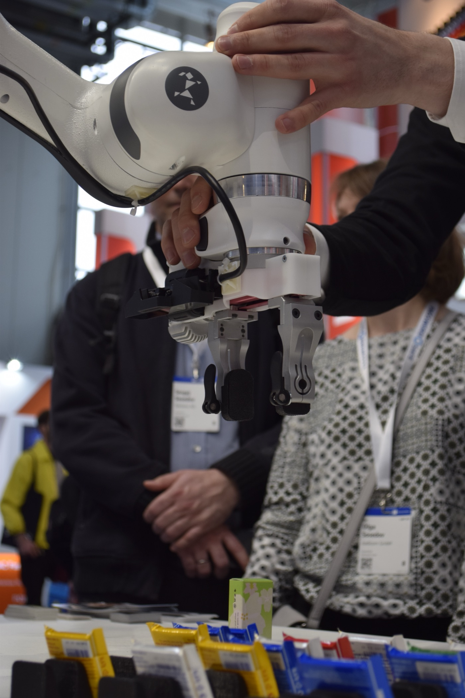
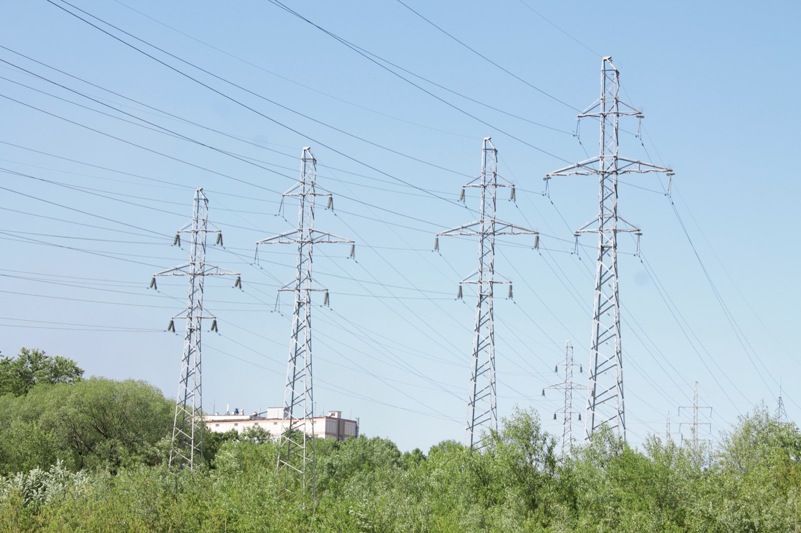
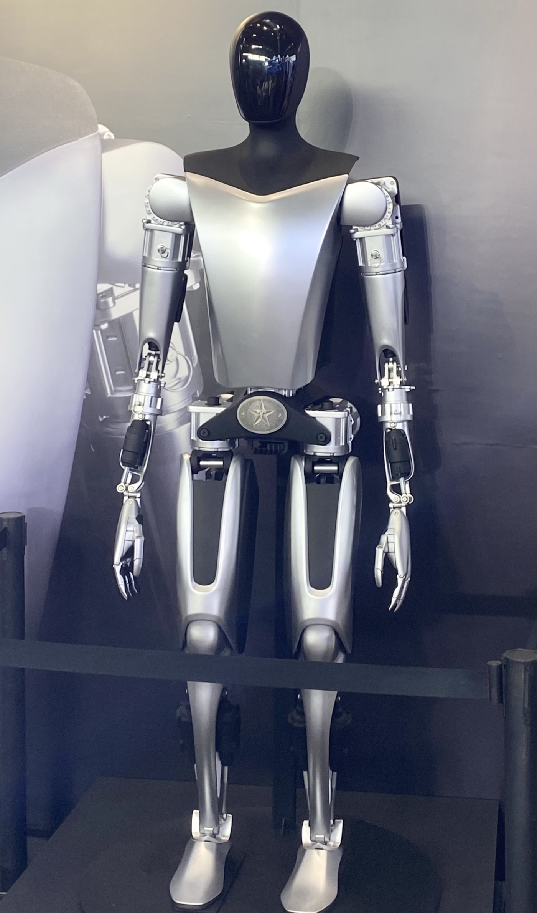

# Robot Experience Data Can

_Korea_

## Executive Summary

> [!callout]
> South Korea has drawn up the largest plan in its history: roughly $88 billion (KRW 1,350 trillion) over the next decade for semiconductor fabs, power and water infrastructure, AI data centers, and humanoid mass production. The hardware carries clear accounts: who invests, how much, and what gets built. Some KRW 800 trillion for chip fabs, KRW 550 trillion for AI data centers. But the real battleground behind the government's own market-share ambition, the standards and quality assurance for the experience data robots must accumulate through their bodies, has no comparable line in the budget.

> Data is not missing entirely. Under the names "data factory" and "robot training center," about KRW 1.4 trillion has been earmarked, and the government classified data as one of four pillars. The problem is that this amounts to just 0.1% of the total, and that every mention of data speaks the language of collection: how much can we gather. There is a budget to pile data up, but none to make what is piled up trustworthy.

> This report follows that missing line. Buy all the fabs and robots you like: without a system to verify, in a standard structure, the data those robots produce, a 20% market share becomes a sandcastle built on hardware. The gap Pebblous flagged across three earlier reports is now being repeated, verbatim, by a national plan.

<!-- stat-card -->
**$88B** — 10-year national bet — KRW 1,350 trillion. KRW 800T for chips + 550T for AI data centers anchor a hardware-first plan

<!-- stat-card -->
**~0.1%** — share for data infra — KRW 1.4T training center ÷ 1,350T total = 964-to-1. Absent from all three foreign reports

<!-- stat-card -->
**1% → 20%** — govt. share target — Domestic humanoid market-share goal (dates blur 2028–2030; not a global figure)

<!-- stat-card -->
**73% → 43%** — closed-loop collapse — When low-quality data is blended in unweighted (PebbloSim). Invisible to static cleanliness checks

## Reading the Budget: What Gets an Account, and What Doesn't

Start by fixing one number. Coverage of this plan, at home and abroad, sometimes renders it as "KRW 880 trillion," but no such figure exists. All three foreign outlets (The Information, MLQ.ai, and Tom's Hardware) reported **"$880 billion,"** which converts to roughly **KRW 1,350 trillion**. The "880 trillion won" version is a common slip made while carrying the dollar figure into won; primary and secondary Korean coverage uses "1,350 trillion won" ([Newspim, 2026-07-13](https://www.newspim.com)). This report uses KRW 1,350 trillion throughout.

Take the plan apart and a rule emerges: hardware gets a name, a number, and a target. About KRW 800 trillion goes to southwestern-region chip fabs, roughly KRW 550 trillion to AI data centers, each announced with its investors (private players like Samsung and SK) and its facility targets (number of fabs, gigawatts of capacity). The government also pledged to commercialize industry-specific humanoids by 2028 and lift the domestic market share from 1% to 20% ([Seoul Economic Daily, 2026-06-29](https://www.sedaily.com)). Every one of these targets points at something you can buy or build.

*▲ A semiconductor fab cleanroom — a representative site for the KRW 800 trillion hardware axis (illustrative image) | Source: [Wikimedia Commons](https://commons.wikimedia.org/wiki/File:Clean_room.jpg)*

Data is not absent from the budget. The government's "Physical AI Core Competitiveness Strategy" (2026-07-01) named data as one of four pillars and earmarked around KRW 1.4 trillion under the labels "robot training center" and "data factory." Deputy Prime Minister Bae Kyung-hoon spoke of "turning even a robot's fingertip sensations into data," citing a goal of 10,000 hours of collected data ([Korea Economic Daily, 2026-07-13](https://www.hankyung.com)). The problem is what comes after. The bars below place all three items on the same axis.

10-year allocation — the asymmetry between hardware and data infrastructure (KRW trillion)

Sources: southwestern chip fabs KRW 800T, AI data centers KRW 550T (Policy Briefing & ZDNet Korea, 2026-06–07); robot training center KRW 1.4T (Physical AI Core Competitiveness Strategy, 2026-07-01). The data bar is almost too small to see.

Divide the KRW 1.4 trillion training center by the KRW 1,350 trillion total and you get about 0.1%, a ratio of 964 to 1. More telling than the number itself: in the three foreign reports that investors and policymakers actually read, this data item **never appears at all.** Chips, data centers, and humanoid unit counts make the headlines; the robot training center surfaces only if you dig into the Korean-language fine print. In the budget, data lives below the decimal point, and in the summary the world reads, it may as well not exist.

This vocabulary of "collection" is not confined to government documents. LG announced it would build Korea's first humanoid "data factory" to train its robots ([The Korea Herald, 2026](https://www.koreaherald.com)). The name is the metaphor: a factory that stamps out data by the ton. Government budgets and corporate announcements speak with one voice about how much to gather, yet neither sentence says a word about verifying that data in a standard structure and making it reusable.

> [!callout]
> The point of this section is not the exaggeration that "data got zero won." Data is in the budget. It is simply 1/964th of the hardware, and it vanishes from the coverage the world reads. And even that KRW 1.4 trillion is described only in the language of collection: how much can we gather. The words "standard" and "quality" appear nowhere in the budget.

## A Humanoid's Value Comes from Experience, Not Its Body

Why is data the battleground? Today's robot intelligence is not built by hand-coding rules one by one; it is learned from data. In a VLA (Vision-Language-Action) architecture, which folds sight, language, and action into a single model, a robot's capability comes not from its parameter count but from the diversity and coherence of the interactions it has lived through. Two robots with identical bodies diverge in ability depending on what — and how much — they have experienced.

This is backed by evidence, not intuition. Open X-Embodiment, which pooled data from 34 robot platforms across 22 institutions, holds more than one million trajectories and 527 skills; training on many robots' data together sharply improved generalization over any single robot. RT-1-X gained about 50%, and the larger RT-2-X roughly tripled its performance ([Open X-Embodiment, arXiv:2310.08864](https://arxiv.org/abs/2310.08864)). It is a large-scale demonstration that data scale and diversity translate directly into capability.

Yet the same dataset also exposes the trap of scale. Behind that one-million-trajectory headline, the actual data is heavily skewed toward a few platforms. The Franka arm alone accounts for about 40%, WidowX for roughly 25%. The total is large, but the data you can use evenly across cases is not nearly as large. Scale is not the same as reusability.

Open X-Embodiment platform skew — "scale ≠ reusability"

Source: Open X-Embodiment Collaboration (arXiv:2310.08864). Shares are approximate, by trajectory count.

So why not simply buy the missing data? Here is where robot data differs decisively from a chip fab. Real-world robot data is a labor-intensive asset that exists only once physical contact actually happens. Human operators build it up one episode at a time by teleoperating or demonstrating with the robot. Operator wages run $25–48 an hour, and a single production-grade dataset costs $50,000 to $200,000 to assemble. By one estimate, collecting data in the real world runs up to 82 times the cost of simulation. DROID, a large-scale in-the-wild manipulation dataset, is likewise the product of many institutions teleoperating robots over months ([DROID, arXiv:2403.12945](https://arxiv.org/abs/2403.12945)). It is time and hands, not money, that make this data.

*▲ A person hand-guiding a robot arm to demonstrate a motion — the Franka-class arm that accounts for 40% of Open X-Embodiment data | Source: [Wikimedia Commons](https://commons.wikimedia.org/wiki/File:Franka_Emika1.jpg)*

Pour in capital and a fab gets built; pay the price and a robot gets delivered. But the experience that robot leaves behind as it collides with the world has to be accumulated over time or refined and reused against a standard. That is the structural reason data keeps surfacing in budgets only as a "qualitative item." It is hard to buy, it cannot be built — it can only be accumulated and managed.

## ISO 26264: Robot Experience Data Needs Structure

Take the government's "10,000 hours of data" at face value. Does filling the hours make the data usable? It does not. Robot experience data does not become learnable simply by piling it up. What you capture, and in what structure, decides whether it can be reused. That is exactly the target of **ISO/WD 26264**, now under discussion at the International Organization for Standardization.

What the standard demands is that a robot's experience be captured in a five-layer embedded structure: which body (the robot's form and joints), performing which motion (joint angles and forces), inside which scene (the environment its cameras and sensors saw), through which execution trace (state changes over time), arriving at which outcome (success or failure). Only when these five are bound into a single synchronized unit can a different robot or a different model later learn from that experience again.

What happens if you pile it up without that structure? The classic failure is time-synchronization error between sensors. If a camera's and a joint sensor's timestamps drift by just 40 milliseconds, a fast-moving robot arm can amplify that gap into a positional error of up to 10 meters. Data that looks perfectly fine to the human eye becomes poison for training. And the 82× cost gap between real-world and simulation data cuts the same way: if real-world data cannot be refined into a standard structure, that expensive data may be thrown away wholesale.

> [!callout]
> "We collected it" and "we piled it up so it can be used" are entirely different statements. The government's announcement makes the former. Robot training center, data factory, 10,000 hours — all the language of how much to gather. Not one sentence points toward the latter: the standardization, quality assurance, and reusability that ISO 26264 requires. That gap is where this report goes beyond both the three foreign reports and the government's own announcement.

Pebblous has already treated this problem in a separate earlier report. Why robot experience data needs a standard structure, how a 40ms error balloons into 10m, and why the real-vs-simulation cost gap cannot be closed without standardization. We laid all of this out in our "Humanoid Robot Data ISO Standard" piece. This national plan has, in effect, scaled up the volume without translating that standards conversation into the language of a budget.

## Buy Only the Hardware, and the Bottleneck Comes in Two Layers

This plan already has one visible bottleneck: power and water. A single completed Yongin chip cluster needs 15–16 gigawatts of electricity, yet the supply secured so far is only about 1.9 gigawatts. Roughly 6 of the remaining gigawatts have no confirmed sourcing plan, and closing that gap means laying 1,153 kilometers of new transmission lines at a cost of some KRW 37 trillion ([Tom's Hardware, 2026](https://www.tomshardware.com/tech-industry/power-and-water-lag-the-fabs-in-south-koreas-880-billion-chip-and-ai-plan)). The worry that the fabs may get built before the electricity to run them arrives is already out in the open.

*▲ High-voltage transmission towers — of the 15–16GW the Yongin cluster needs, roughly 6GW still has no confirmed sourcing plan (illustrative image) | Source: [Wikimedia Commons](https://commons.wikimedia.org/wiki/File:Electric_transmission_power_tower.jpg)*

So here is the question. If even power and water, a bottleneck that is at least visible and carries a price tag, provoke debate about lead times, what is happening with data infrastructure, which is far less visible? The answer is simple: it never even reached the table. The bottleneck is twofold. One is the visible kind, like power and water; the other is the invisible kind, like the data pipeline. And the invisible one is the more dangerous.

Why data is a decisive bottleneck becomes clear in how quality is verified. Data quality cannot be checked with static metrics like whether a file is clean or free of missing values. It shows up only when you run a robot trained on that data through a simulation closed loop and have it actually perform tasks. Pebblous's PebbloSim experiment shows exactly this. When unverified "prescription" data was blended in with no weighting, the robot's task success rate collapsed from 73% to 43%, and the median minimum distance to target widened from 1.8 centimeters to 11.2 centimeters.

Closed-loop task verification — before and after blending in low-quality data (PebbloSim)

Source: Pebblous PebbloSim closed-loop verification experiment. A performance collapse that static file-cleanliness checks cannot reveal.

This collapse is entirely invisible to static metrics. The files are intact and the formats are correct — yet the moment the robot actually moves, it falls apart. That is why formalization that only inflates the headline figure, like a "KRW 1.4 trillion data dam," is dangerous. Data that has not been verified in a closed loop can pile up all it likes and still become a liability rather than an asset.

## Where 20% Is Actually Won: the Country That Budgets Standards and Quality

The government's goal is to lift Korea's domestic humanoid market share from 1% to 20% by 2028–2030. Separately, Goldman Sachs projected that Korea could account for about 30% of global humanoid production by around 2035 ([Goldman Sachs Research, 2026-06-25](https://www.goldmansachs.com)). The two figures measure different things: one is the government's domestic market-share target, the other an outside firm's global production-share forecast. They must not be conflated. But both rest on the same premise: that Korea will be good at making humanoids.

*▲ A humanoid robot on display — the hardware may look close to finished, but the standards for the experience data it must accumulate are a separate question (illustrative image) | Source: [Wikimedia Commons](https://commons.wikimedia.org/wiki/File:Optimus_Tesla.jpg)*

For that premise to hold, there has to be a system that verifies and reuses, in a standard structure, the experience data robots accumulate through their bodies. And competitors are already translating that system into the language of budgets and institutions. What they share is that they do not treat data strategy as separable from products and infrastructure.

| Player | How they treat data | Defining feature |
| --- | --- | --- |
| China | A national standards technical committee | Stood up a real standardization body for humanoids and embodied intelligence in late 2025, and unveiled the standards framework in early 2026. The state leads on data standards directly. |
| Tesla | The factory is the data pipeline | Designs production lines and real-use sites as a data collection-and-recirculation loop. Data acquisition is inseparable from the product roadmap. |
| NVIDIA | Simulation is the business model | Sells synthetic-data generation and closed-loop verification as platform products via Isaac and Omniverse. Producing data is itself a revenue stream. |
| Korea | Stuck at qualitative mentions | Robot training center and data factory mention collection, but standards and quality assurance are absent from budget and institutions. |

The contrast is stark. China built its standard as an institution; the two U.S. companies turned data production and verification into a factory and a product, respectively. Korea, in committing to the world's largest hardware investment, left the question of which standard would verify and reuse the data that hardware produces to a few qualitative sentences.

The recommendation converges on one point: budget for standards and quality assurance early. Not 0.1% of KRW 1,350 trillion, but a separate account for data standardization and quality-verification infrastructure, sized in proportion to the hardware investment. You can buy the fabs and the robots, but making the experience they accumulate trustworthy begins with drawing one new line in the budget today. The real battleground for a 20% market share is not the number of fabs — it is that one line.

## Why Pebblous Keeps Asking This Question

This report did not come out of nowhere. Over the past two months, Pebblous has flagged the same gap three times. In June, on the government's KRW 402.2 billion full-stack strategy, we pointed to the [sub-budget for robot behavior data](/report/korea-physical-ai-behavior-data/en/); in July, on KRW 16 trillion in policy financing, we widened the scale to the [data gap in policy finance](/blog/korea-physical-ai-policy-finance-data-gap/en/). The standards problem for robot experience data itself we treated separately in our [ISO 26264 piece](/report/humanoid-robot-data-iso-standard/en/). This article is the capstone that re-reads all three on the largest national canvas there is: KRW 1,350 trillion.

### Business and technology fit

Physical AI is a core axis of the Pebblous business. DataClinic, which diagnoses data quality; PebbloSim, which verifies through a simulation closed loop; and DataGreenhouse, which handles synthetic and behavior data. Together they turn exactly the items this report flags into products: the collection, standardization, and quality assurance of robot experience data. The character gap in a KRW 1,350 trillion plan explains, at national scale, why Pebblous exists.

### The data-quality view

A humanoid's capability comes not from parameters but from the diversity and coherence of the interaction data it has accumulated through its body. Low-quality, non-standard robot data distorts a model's internal representations and shows up as collapses in closed-loop practice: success rate 73%→43%, minimum distance 1.8cm→11.2cm. The proposition that "static file cleanliness is not data quality; quality is verified only in a dynamic closed loop" aims squarely at the blind spot in the national investment logic.

### What it means for customers and partners

Governments, large enterprises, and robotics startups can buy all the fabs and robots they want, but without a system to collect, refine, and verify the data those robots produce in a standard structure (ISO 26264), the investment will not return. This report offers both the practical priority (that the real bottleneck after hardware is the data pipeline) and the grounds for budgeting data standardization and quality assurance early.

> [!callout]
> **Editor's Note.** Pebblous is the party that flagged this gap first, across three reports. This capstone is not written to sell a particular product; it is a record of reading a national plan from the perspective that has raised the data-quality and standards discourse in Korean Physical AI most consistently. What the new line in the budget should be — that judgment we leave to the reader.

## References

### Policy & News

- 1.The Information (2026). South Korea to Invest $880 Billion in Chips, Robotics, AI Over 10 Years. 2026-06-28. (original seed report, paywalled)
- 2.MLQ.ai (2026). [South Korea Unveils $880 Billion Plan to Double Memory Chip Output and Mass-Produce Humanoid Robots](https://mlq.ai/news/south-korea-unveils-880-billion-plan-to-double-memory-chip-output-and-mass-produce-humanoid-robots-1/).
- 3.Tom's Hardware (2026). [Power and water lag the fabs in South Korea's $880 billion chip and AI plan](https://www.tomshardware.com/tech-industry/power-and-water-lag-the-fabs-in-south-koreas-880-billion-chip-and-ai-plan). (Yongin needs 15–16GW vs 1.9GW supplied; transmission grid KRW 37T / 1,153km)
- 4.Newspim (2026). [H2 Economic Growth Strategy] Government to Pour KRW 1,350 Trillion into Chips and AI. 2026-07-13. (in Korean)
- 5.Korea Policy Briefing (2026). KRW 800 Trillion Chip Fab Complex for the Southwestern Region; KRW 81 Trillion for the Chungcheong Region. 2026-06-29. (in Korean)
- 6.ZDNet Korea (2026). "AI for All" for the Whole Population; Focused Support for Chips, AIDC, and Physical AI. 2026-07-16. (in Korean)
- 7.Asia Economy (2026). Bae Kyung-hoon: "Physical AI is a top-tier priority; the next three years are the golden window; AI data centers are the heart." 2026-06-29. (in Korean)
- 8.Korea Economic Daily (2026). Turning Even a Robot's Fingertip Sensations into Data; Government to Invest KRW 1.4 Trillion in Physical AI. 2026-07-13. (robot training center, 10,000 hours, data as one of four pillars; in Korean)
- 9.Seoul Economic Daily (2026). Korea to Commercialize Industry-Specific Humanoids by 2028; Samsung to Invest in Gumi. 2026-06-29. (domestic share target 1%→20%)
- 10.Goldman Sachs Research (2026). South Korea's Growing Role in Humanoid Robot Development. 2026-06-25. (forecast of ~30% global production share by 2035)
- 11.The Korea Herald (2026). LG to build Korea's first humanoid 'data factory' to train robots.

### Academic

- 12.Open X-Embodiment Collaboration (2023). [Open X-Embodiment: Robotic Learning Datasets and RT-X Models](https://arxiv.org/abs/2310.08864). arXiv:2310.08864. (1M+ trajectories, 527 skills; RT-1-X +50%, RT-2-X ~3×; Franka 40% / WidowX 25% skew)
- 13.Khazatsky, A. et al. (2024). [DROID: A Large-Scale In-The-Wild Robot Manipulation Dataset](https://arxiv.org/abs/2403.12945). RSS 2024, arXiv:2403.12945.

### Prior Pebblous Reports

- 14.Pebblous (2026). [Robot Behavior Data in Korea's Physical AI](/report/korea-physical-ai-behavior-data/en/). 2026-06-29. (KRW 402.2B, data dam, AgiBotWorld, Tesla's 10 billion miles)
- 15.Pebblous (2026). [Humanoid Robot Data ISO Standard](/report/humanoid-robot-data-iso-standard/en/). (ISO 26264, 40ms→10m, 82× real-vs-sim cost gap)
- 16.Pebblous (2026). [Robot Data Curation and the Closed-Loop Gap](/report/robot-data-curation-closed-loop-gap/en/) (success rate 73%→43%, PebbloSim) and [The Data Gap in Korea's Physical AI Policy Finance](/blog/korea-physical-ai-policy-finance-data-gap/en/) (KRW 16T in policy financing).
