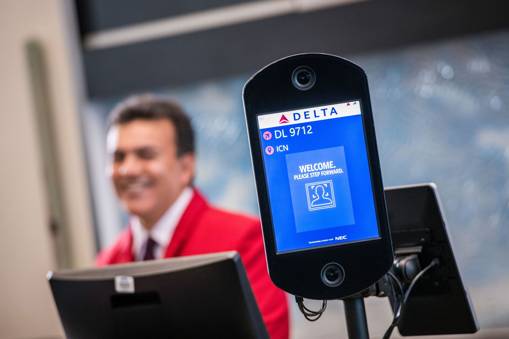

# 안전신뢰문서의 실체는 데이터 계보다

_10개 고영향 영역·한국/EU/미국 규제 비교·ISO/IEC 5259 매핑으로 읽는, 계도기간에 데이터 담당자가 먼저 해야 할 일_

## Executive Summary

> [!callout]
> 2026년 7월 21일, 한국 AI 기본법이 시행령·책무 고시안과 함께 전면 시행에 들어갔다. 같은 6월 EU는 방향을 반대로 틀어 고위험 AI(Annex III) 의무를 2026년 8월에서 2027년 12월로 미뤘다. 실질적으로 작동하는 시점을 기준으로 보면, 신용·의료·채용처럼 사람을 판단하는 AI에 강행 의무를 먼저 채운 나라는 한국이다. 이 리포트는 그 규제가 데이터 담당자에게 실제로 무엇을 요구하는지를, 10개 고영향 영역과 한국·EU·미국 비교를 통해 해부한다.

> 핵심은 규제가 요구하는 것의 성격이다. 사업자는 안전성·신뢰성 확보 조치를 '안전신뢰문서'로 남겨 5년간 보관해야 하고, 그 안에는 AI와 학습용 데이터에 대한 설명가능성 확보가 명시적으로 들어간다. 이는 서명 한 장의 정책 선언이 아니라, 이 판단이 어떤 데이터로 학습됐고 그 출처·품질을 어떻게 증빙하는가에 대한 지속적 증적이다. 고영향 영역의 편향은 모델 구조가 아니라 학습 데이터 구성에서 나온다는 사실이 학술적으로 반복 확인됐고, 규제는 정확히 그 지점을 겨눈다.

> 그래서 컴플라이언스의 실체는 문서가 아니라 데이터의 계보·품질·감사 가능성 세 층위이며, ISO/IEC 5259가 그 측정 언어를 제공한다. 국제 벤치마크는 "거버넌스가 있다"는 선언과 "완전히 구현했다"는 실행 사이의 큰 격차를 보여준다. 계도기간(최소 1년)의 진짜 용도는 문서를 사후에 채우는 것이 아니라, 계보·품질·감사를 파이프라인에 심어 1년 뒤 그 로그가 곧 안전신뢰문서가 되게 하는 것이다.

<!-- stat-card -->
**2026.7.21** — 한국 AI 기본법 전면 시행 — 고영향 AI 규제를 실제로 가동한 세계 첫 사례

<!-- stat-card -->
**16개월** — EU 고위험 AI 의무 연기 — 2026.8 → 2027.12, 규제 타이밍이 뒤집혔다

<!-- stat-card -->
**5년** — 안전신뢰문서 보관 의무 — 학습 데이터 설명가능성 확보 포함

<!-- stat-card -->
**87% vs 25%** — 거버넌스 '있다' vs '완전 구현' — 선언과 실행의 격차 (IBM 2026)

## 두 대륙의 시간표가 갈렸다

규제를 비교할 때 흔히 명목 발효일을 본다. 그러나 고영향 AI처럼 사업자에게 실제 의무를 지우는 규제는 '언제 법이 통과됐나'보다 '언제 의무가 실제로 작동하나'가 훨씬 중요하다. 이 실질 작동일을 기준으로 한국·EU·미국을 나란히 놓으면, 2026년 현재 고영향 AI 규제를 실제로 가동한 관할권은 한국과 뉴욕시뿐이다.

아래 타임라인은 세 관할권의 명목 일정과 실질 작동 시점을 하나의 축에 겹쳐 놓은 것이다. 한국이 2026년 7월 스위치를 올리는 동안, EU는 가장 논쟁적인 고위험 의무를 오른쪽으로 밀었고, 미국 콜로라도는 시행 전에 원안을 아예 폐지했다.

*▲ 국회의사당. 2026년 7월 21일 고영향 AI 사업자 의무를 실제로 가동시킨 개정법·시행령이 이곳에서 다뤄졌다. | 출처: [Wikimedia Commons](https://commons.wikimedia.org/wiki/File:National_Assembly_Building_of_the_Republic_of_Korea.png)*

*▲ 차트 1. 한국·EU·미국 고영향/고위험 AI 규제 시행 타임라인 (2023–2028). 오렌지=실제 작동 시점, 회색=선행 단계, 빨강=폐지. 모든 규제 사실은 2026-07-21 기준. | 자료: 로펌 3곳 교차 확인, 아래 표 1.*

한국의 「인공지능 발전과 신뢰 기반 조성 등에 관한 기본법」은 2026년 1월 22일 본법이 시행됐지만, 사업자 의무를 구체화한 개정법·시행령이 7월 14일 국무회의를 거쳐 7월 21일 발효되면서 고영향 AI 규율이 비로소 현실의 의무로 작동하기 시작했다. 반면 EU는 유럽의회가 6월 16일 승인한 '디지털 옴니버스' 개정으로 사용 기반 고위험 AI(Annex III)의 의무 적용을 2026년 8월 2일에서 2027년 12월 2일로 16개월 미뤘다. 명목일과 실질 작동일은 세 관할권에서 크게 어긋난다.

| 관할권 · 사건 | 명목/원 예정일 | 실질/변경일 | 비고 |
| --- | --- | --- | --- |
| 한국 · AI 기본법 본법 시행 | — | 2026-01-22 | 정의·진흥 골격 발효 |
| 한국 · 개정법·시행령·책무고시안('전면 시행') | — | 2026-07-21 (국무회의 07-14) | 고영향/생성형 사업자 의무 실제 작동 |
| 한국 · 과태료 계도기간 | — | 최소 1년 (2026-07-21~) | 시정 지도 우선, 과태료 유예 |
| 한국 · 딥페이크 등 생성물 표시 | — | 즉시 적용 (유예 없음) | 계도기간 예외 |
| EU · 금지행위(Art.5) | — | 2025-02-02 | 이미 집행, 2026 초 EC 첫 조사 |
| EU · 거버넌스·GPAI·제재(Art.99) | — | 2025-08-02 | 벌금 프레임 발효 |
| EU · 고위험(Annex III) 의무 | 2026-08-02 | 2027-12-02 (16개월 연기) | 2026-06-16 의회 승인 '디지털 옴니버스', 소급 미적용 |
| 美 콜로라도 · SB24-205 | 2026-02-01 → 2026-06-30 | 폐지 (2026-05-14) | SB26-189로 교체, 신법 2027-01-01 시행 |
| 美 뉴욕시 · Local Law 144(채용 AI 감사) | 2023-01-01 | 2023-07-05 집행 | 3년째 시행, 2025-12 감사원 실효성 감사 |

연기의 무게는 시점에만 있지 않다. EU 개정법은 소급 적용되지 않기 때문에, 2027년 12월 이전에 시장에 나온 고위험 시스템은 새 의무를 영구히 피해 갈 수 있다는 우려가 함께 제기됐다. 규제가 1년 늦게 켜지는 데서 그치는 것이 아니라, 그사이 배치된 시스템 상당수가 규제 그물 밖에 남는다는 뜻이다.

미국은 결이 또 다르다. 콜로라도 원안(SB24-205)은 시행을 앞두고 2026년 5월 폐지됐고, 재정의된 신법(SB26-189)이 2027년 1월 1일로 미뤄졌다. 사용 단계 규제를 3년째 실제 집행 중인 곳은 뉴욕시(채용 AI 편향 감사, Local Law 144)뿐이다. '세계 최초'라는 수사는 늘 조심해야 하지만, 적어도 사람의 신용·건강·일자리를 판단하는 AI에 강행 규범을 먼저 가동했다는 점에서 한국의 선행은 과장이 아니다.

## 10개 고영향 영역을 데이터의 눈으로 읽기

법 제2조제4호는 10개 영역을 열거하고, 그 영역에서 사람의 생명·신체 안전이나 기본권에 중대한 영향을 미칠 우려가 있는 AI를 고영향으로 분류한다. 열거된 영역은 에너지, 먹는 물, 보건의료·의료기기, 원자력, 생체인식, 채용, 대출심사 등 개인의 권리관계 평가, 교통, 공공서비스, 학생평가다. 이 목록을 데이터 담당자의 눈으로 다시 읽으면 하나의 축이 보인다. 이 중 네 영역은 결국 "데이터로 사람을 판단"하는 일이고, 바로 그 지점에서 편향이 기본권 침해로 이어진다.

*▲ 차트 2. 10개 고영향 영역의 두 성격. 신용·채용·의료·생체 4영역(★)은 데이터 구성이 곧 차별의 통로가 된다.*

10개 영역을 대표 사용사례·핵심 데이터 리스크·요구 증빙·한국과 EU의 범위 차이로 갈라 보면 한 가지가 특히 눈에 띈다. 한국의 지정 범위가 EU보다 좁다는 점이다. 금융에서 한국은 '대출심사'만, EU는 신용도 평가 전반을 포괄하고, 고용에서 한국은 '채용'만, EU는 성과·해고 등 근로자 관리까지 포함한다.

| 영역 | 대표 사용사례 | 핵심 데이터 리스크 | 요구 증빙 | 한국 vs EU |
| --- | --- | --- | --- | --- |
| ★ 대출심사 등 개인권리평가 | 신용점수·여신심사 | 과소대표 집단·대리변수 차별 | 학습데이터 출처·대표성·공정성 검증 로그 | 한국=대출심사만 / EU=신용도 평가 전반 |
| ★ 채용 | 이력서 스크리닝·면접평가 | 과거 편향 이력서 학습 → 차별 재생산 | 데이터 계보·편향감사·라벨 근거 | 한국=채용만 / EU=근로자 관리까지 |
| ★ 보건의료·의료기기 | 진단보조·중증도 분류 | proxy 라벨 편향(지출액→건강필요도) | 데이터셋 구성·라벨 정의·검증 재현 | 디지털의료제품법 충족 시 중복 인정 |
| ★ 생체인식 | 안면·지문 인증 | 인구집단별 오류율 격차 | 학습셋 대표성·집단별 성능 문서 | — |
| 에너지 | 수요예측·계통운영 | 센서·이력데이터 편중 | 데이터 출처·품질 기준 | — |
| 먹는 물 | 수질예측·배수관리 | 측정 결측·대표성 | 데이터 계보·품질 | — |
| 원자력 | 안전감시·이상탐지 | 희소 이상 데이터·라벨 신뢰도 | 데이터 검증·감사 재현 | — |
| 교통 | 신호·자율주행 보조 | 지역·조건 편중 | 수집 조건·출처 문서 | — |
| 공공서비스 | 복지판정·자원배분 | 행정데이터 편향·결측 | 데이터 출처·공정성 | — |
| 학생평가 | 성적·역량 평가 | 표본 편향·라벨 주관성 | 평가데이터 계보·근거 | — |

각주: '인공지능사업자' 정의가 매우 넓어 개발자뿐 아니라 AI를 도입해 서비스하는 사업자(예: 대출심사 모델을 쓰는 은행)도 포함된다. 한 사업자가 개발·이용·고영향 지위를 중첩할 수 있으며, 고영향 판단은 사업자의 1차 자기판단 + 불확실 시 과기정통부 'AI 기본법 지원데스크' 상담으로 이뤄진다. 사람이 최종 개입·통제 가능하면 제외될 수 있다.

### 2.1. 편향은 모델이 아니라 데이터에서 나온다

규제가 데이터를 향해 질문을 던지는 이유는 학술 연구가 반복해 보여준 사실 때문이다. 가장 널리 인용되는 사례는 의료 AI다. 미국의 한 상용 알고리즘은 환자의 건강 필요도를 예측하는 데 '의료 지출액'을 대리지표로 학습했다. 그런데 흑인 환자는 같은 건강 상태에서도 역사적으로 의료비를 덜 지출해 왔기 때문에, 알고리즘은 흑인 환자를 체계적으로 과소분류했다. 대리지표를 건강 그 자체를 반영하도록 재설계하자, 추가 돌봄 대상으로 지정되는 흑인 환자 비율이 17.7%에서 46.5%로 뛰었다(Obermeyer et al., Science, 2019). 모델 구조가 아니라 학습 데이터의 라벨 정의가 편향의 원천이었다.

생체인식도 같은 결을 보인다. 상용 안면분석 시스템의 오류율을 성별·피부색으로 나눠 측정한 연구는, 밝은 피부 남성에서 거의 완벽하던 정확도가 어두운 피부 여성에서 크게 무너지는 것을 확인했다(Buolamwini & Gebru, Gender Shades, 2018). 학습셋에 특정 인구집단이 과소대표됐다는 데이터 문제가 그대로 성능 격차로 나타난 것이다. 신용평가에서도 민감속성을 제거하더라도 우편번호·구매이력 같은 대리변수를 통해 차별이 재현되는 '공정성 역설'이 보고된다.

*▲ 공항 탑승구의 안면인식 인증 키오스크. 생체인식은 한국 AI 기본법이 지정한 10개 고영향 영역 중 하나로, 인구집단별 오류율 격차가 핵심 리스크다. | 출처: [Wikimedia Commons](https://commons.wikimedia.org/wiki/File:Facial_recognition_technology_at_gate_(44275734970).jpg)*

> [!callout]
> 그래서 고영향 AI인지 판단하는 순간, 규제의 초점은 모델의 성능이 아니라 그 판단이 딛고 선 데이터로 옮겨 간다. 편향된 이력서, 과소대표된 신용 데이터, 잘못 정의된 의료 라벨은 그 자체로 기본권 침해의 통로다. 안전신뢰문서가 "학습용 데이터의 설명가능성"을 요구하는 이유가 바로 여기에 있다.

## 의무의 구조 — 영향평가와 안전신뢰문서

고영향 AI 사업자에게 부과되는 의무는 크게 두 갈래다. 영향평가와 안전성·신뢰성 확보다. 둘은 성격이 다른데, 이 차이를 놓치면 준비의 우선순위가 흔들린다. 영향평가는 강행 의무가 아니라 노력 의무에 가깝다. 대신 국가기관 등이 조달할 때 영향평가를 마친 제품·서비스를 우선 고려하도록 설계돼 있어, 실질적으로는 공공 시장에 들어가기 위한 자격처럼 작동한다.

의무의 진짜 무게중심은 안전성·신뢰성 확보 쪽에 있다. 책무 고시안 제8조에 따라 사업자는 자신이 취한 조치를 '안전신뢰문서'로 작성해 5년간 보관하고 주기적으로 점검·최신화해야 하며, 그 문서에는 AI와 학습용 데이터에 대한 설명가능성 확보가 명시적으로 포함된다. 법적 성격·트리거·산출물·보관·제재 어느 기준으로 봐도 무게중심은 안전신뢰문서 쪽에 쏠린다.

| 구분 | 영향평가 | 안전성·신뢰성 확보(안전신뢰문서) |
| --- | --- | --- |
| 법적 성격 | 노력 의무 | 사업자 책무(고시안 제8조) |
| 강행/노력 | 노력 (단 공공조달 우선 고려로 사실상 시장 자격) | 실질적 강행 |
| 트리거 | 고영향 AI 제공·이용 | 고영향 AI 제공·이용 |
| 핵심 산출물 | 영향평가 결과 | 안전신뢰문서 (AI+학습데이터 설명가능성 포함) |
| 보관 | (조달 활용) | 5년 보관 · 주기적 점검 · 최신화 |
| 위반 제재 | 직접 과태료보다 조달 불이익 | 시정명령 → 불이행 시 3천만원 이하 과태료 |
| 중복 인정 | 디지털의료제품법·신용정보법·금융소비자보호법 등에서 동등 조치 이행 시 인정 (단 위험관리·설명가능성·데이터 거버넌스 기이행 전제) |  |

### 3.1. 안전신뢰문서가 요구하는 것은 서명이 아니라 증적

여기서 법이 요구하는 것은 서명된 정책 선언 한 장이 아니다. 이 판단이 어떤 데이터로 학습됐고, 그 출처와 품질을 5년 뒤에도 설명할 수 있는가에 대한 증적이다. 모델을 재학습하고 데이터셋을 교체하는 동안에도 그 기록이 끊기지 않아야 한다는 뜻이기도 하다. '문서'라는 이름과 달리 그 실체는 데이터의 이력 그 자체다.

### 3.2. 중복 인정의 전제, 그리고 EU FRIA와의 차이

다른 법에서 동등한 조치를 이미 이행 중이면 AI 기본법 의무를 이행한 것으로 인정된다. 얼핏 부담을 덜어 주는 조항처럼 보이지만, 인정의 전제가 관건이다. 그 인정은 위험관리·설명가능성·데이터 거버넌스를 이미 갖추고 있었는지를 묻는다. 결국 어느 법을 경유하든 데이터 거버넌스라는 도착지는 같다.

각주(EU 비교): EU의 기본권영향평가(FRIA, 제27조)는 배포자를 대상으로 "사람을 공정히 대우하는가·이의제기 경로가 있는가"를 묻는 권리 중심 평가로, 데이터 중심의 개인정보영향평가(DPIA)와 구분된다. 미이행 시 Art.99 Tier 2(€15M 또는 매출 3%)가 적용된다. 한국의 영향평가는 성격상 FRIA와 DPIA의 중간에 가깝다. 이 비교는 참고일 뿐 한국 상황에 그대로 대입하기는 어렵다.

## 설명가능성을 데이터 실천으로 번역하다

안전신뢰문서가 요구하는 '설명가능성 확보'는 추상적인 구호처럼 들리지만, 데이터 담당자의 언어로 옮기면 세 가지 구체적인 질문으로 좁혀진다. 학습 데이터의 출처를 추적할 수 있는가(계보), 그 품질이 기준을 충족하는지 검증할 수 있는가(품질), 그 검증을 5년 뒤에도 재현하고 감사할 수 있는가(감사 가능성). 이 세 층위가 규제가 던지는 질문의 실체다.

중요한 것은 이 세 층위가 이미 국제적으로 표준화돼 있다는 점이다. ISO/IEC 5259 시리즈(5개 파트, 2024~2025)가 데이터 품질의 측정·관리·프로세스·거버넌스 언어를 제공하고, 학계·산업의 데이터 문서화 관행(Datasheets, Model Cards, Data Cards)이 그 뼈대를 이룬다. 세 층위가 어떻게 맞물리고 각각 어느 표준에 대응하는지는 아래 개념도에 담았다.

*▲ 데이터센터 서버 랙. 안전신뢰문서가 요구하는 "설명가능성"은 결국 이런 인프라에 쌓이는 로그·이력 데이터로 증빙된다. | 출처: [Wikimedia Commons](https://commons.wikimedia.org/wiki/File:Wikimedia_Foundation_servers_-_CyrusOne_(Carrollton,_Texas)_(31).jpg)*

*▲ 차트 3. 데이터 거버넌스 3층위와 ISO/IEC 5259 매핑. 계보에서 시작해 품질을 거쳐 감사 가능성으로 이어지는 흐름이 곧 안전신뢰문서의 뼈대다.*

아래 표는 세 층위 각각이 규제가 던지는 어떤 질문에 답하고, ISO/IEC 5259의 어느 파트와 어떤 문서화 관행에 대응하는지를 정리한 것이다. 데이터 계보는 "이 데이터는 어디서 왔고 어떤 가공을 거쳤나"에 답하며 Datasheets for Datasets·Data Cards가 그 서식을 제공한다. 품질은 "그 품질이 기준을 충족하는지 검증 가능한가"를, 감사 가능성은 "5년 뒤에도 재현·감사 가능한가"를 묻고 Model Cards·알고리즘 영향평가 방법론이 뒷받침한다.

| 데이터 거버넌스 층위 | 규제가 던지는 질문 | ISO/IEC 5259 대응 | 학술·산업 문서화 관행 |
| --- | --- | --- | --- |
| 계보 (lineage) | 이 데이터는 어디서 왔고 어떤 가공을 거쳤나 | 5259-1 (용어·예시) | Datasheets for Datasets, Data Cards, 데이터 프로버넌스 추적 |
| 품질 (quality) | 그 품질이 기준을 충족하는지 검증 가능한가 | 5259-2 (품질 측정) · 5259-3 (품질관리 요구) | 라벨 정확도·대표성 지표, 편향 진단 |
| 감사 가능성 (auditability) | 5년 뒤에도 재현·감사 가능한가 | 5259-4 (프로세스 프레임워크) | Model Cards, 알고리즘 영향평가(AIA) 방법론 |
| 거버넌스 총괄 | 조직 차원에서 통합 관리되는가 | 5259-5 (품질 거버넌스, 2025) | 데이터 품질관리체계(DQMS) 조직 운영 |

> [!callout]
> 그래서 안전신뢰문서는 이름은 문서지만 실체는 데이터 계보 기록이다. 규제가 온 뒤에 문서를 급조하는 기업과, 처음부터 파이프라인에 계보·품질·감사 기능을 심어 둔 기업의 격차는 여기서 갈린다. 앞의 기업은 5년 치 증적을 사후에 복원해야 하고, 뒤의 기업은 이미 쌓인 로그를 정리해 제출하면 된다. ISO/IEC 5259는 그 "측정 가능한 언어"를 이미 제공하고 있다.

## 어기면 무슨 일이 생기나 — 제재와 집행 비교

제재 규정을 나란히 놓으면 한국의 과태료 상한이 유독 낮아 보인다. 한국은 3천만원 이하(≈$23K, 건별)인 반면 EU는 최고 €35M 또는 전 세계 매출의 7%에 이른다. 그러나 이 숫자만으로 규제 부담을 가늠하면 오히려 위험을 놓친다. 제재의 구조와 실질 리스크가 관할권마다 질적으로 다르기 때문이다.

| 법역 · 근거 | 대상 | 상한 | 집행 주체 | 소급 |
| --- | --- | --- | --- | --- |
| 한국 · AI 기본법 | 표시의무·시정명령 불이행·국내대리인 미지정 | 3천만원 이하 과태료 (건별) | 과기정통부장관 | 표시의무 즉시, 그 외 계도기간(1년+) |
| 한국(형사) · 위원 비밀누설 | 비밀누설 | 3년 이하 징역 또는 3천만원 벌금 | 사법 | — |
| EU · Art.99 Tier 1 | 금지행위(Art.5) | €35M 또는 매출 7% | 회원국 감독당국 + EC | Art.5 시행 중 |
| EU · Art.99 Tier 2 | 고위험 위반(데이터 거버넌스·기술문서·투명성), GPAI | €15M 또는 매출 3% | 동일 | 2027-12-02~ |
| EU · Art.99 Tier 3 | 부정확 정보 제공 | €7.5M 또는 매출 1% | 동일 | — |
| 美 뉴욕시 · LL144 | 편향감사 미실시·미공개 | 건당 $500~$1,500, 상한 없음 | DCWP | 계속위반형 |
| 美 콜로라도 · SB26-189(신법) | (재정의 예정) | 미확정 (신법 시행규칙 별도) | 주 법무장관 | 2027-01-01~ |

한국의 3천만원은 EU에 비하면 작아 보이지만, 실질 리스크는 금전 밖에 있다. 첫째, 시정명령 불이행이 반복되면 영업정지 등으로 격상될 수 있다. 둘째, 그리고 더 중요하게, 고영향 지정과 의무 위반 자체가 공공조달 배제와 시장 신뢰 훼손으로 이어진다. 영향평가를 마친 사업자를 조달에서 우선 고려하는 구조에서, 데이터 거버넌스를 갖추지 못한 기업은 과태료를 맞기 전에 시장에서 밀려난다.

뉴욕시의 구조는 또 다르다. 건당 $500~$1,500로 액수는 작지만 상한이 없고 계속위반형이라, 감사를 방치하면 누적 벌금이 무제한으로 불어난다. 건당 상한형인 한국과 단순 병렬 비교가 어려운 이유다. 결국 세 관할권의 제재는 액수가 아니라 "무엇을 증빙하지 못했을 때 벌하는가"에서 갈리며, 그 대상은 공통적으로 데이터 거버넌스로 수렴한다. EU가 Tier 2에 '데이터 거버넌스 위반'을 명시적으로 넣은 것이 그 방향을 가장 분명하게 보여준다.

*▲ 뉴욕 시청. Local Law 144에 따라 채용 AI 편향감사를 2023년부터 집행 중이며, 상한 없는 계속위반형 제재 구조를 쓴다. | 출처: [Wikimedia Commons](https://commons.wikimedia.org/wiki/File:New_York_City_Hall_-_September_2025.jpg)*

## 계도기간에 무엇부터 — 분기별 실행 로드맵

전면 시행이라고 해서 오늘 당장 과태료가 날아오는 것은 아니다. 사업자 의무 전반에는 최소 1년 이상의 계도기간이 주어진다. 다만 딥페이크 등 생성물 표시 의무는 유예 없이 즉시 적용되니, 생성형 서비스라면 이 부분은 미룰 수 없다. 계도기간의 진짜 용도는 문서를 사후에 채워 넣을 시간을 버는 것이 아니라, 데이터 거버넌스를 파이프라인에 심을 유예로 쓰는 것이다.

왜 지금 시작해야 하는지는 국제 벤치마크가 정량으로 말해 준다. 여러 서베이가 공통으로 보여주는 것은 "거버넌스가 있다"는 선언과 "완전히 구현했다"는 실행 사이의 큰 격차다. 그 격차는 서로 다른 세 지표에서 똑같이 확인된다.

*▲ 차트 4. 선언과 실행의 격차. 절대 수치는 서베이 정의에 따라 다르지만, 방향성은 다수 출처가 일관되게 보여준다. | 자료: IBM(2026), Aon/Economist Impact, TDWI.*

이 격차가 계도기간을 어떻게 써야 하는지를 결정한다. 지금 학습에 들어가는 데이터의 출처를 기록하기 시작하면 1년 뒤 그것이 곧 안전신뢰문서가 된다. 반대로 기록을 미루면 1년 뒤 이미 흘러간 데이터의 출처를 거슬러 복원해야 한다. 그렇다면 남은 1년, 무엇부터 손대야 할까. 분기별 착수 순서는 아래 로드맵과 같다.

| 분기 | 착수 항목 | 목적 |
| --- | --- | --- |
| Q1 | 고영향 해당성 자기판단(10영역 × 중대영향), 지원데스크 상담, 대상 AI·데이터셋 인벤토리 | 범위 확정 |
| Q2 | 지금 학습에 들어가는 데이터부터 계보 기록 시작(출처·가공 이력), 딥페이크 표시 즉시 적용 확인 | 신규 데이터 계보 확보(사후복원 방지) |
| Q3 | ISO/IEC 5259 기준 품질 지표 정의·측정(라벨 정확도·대표성), 편향 진단, Datasheet·Model Card 작성 | 품질·문서화 |
| Q4 | 감사 가능성 확보(버전관리·로그 저장), 안전신뢰문서 초안 통합, 중복 인정 근거 정리 | 5년 보관 체계·제출 준비 |

> [!callout]
> AI 기본법이 바꾼 것은 데이터 거버넌스의 위치다. 예전에는 하면 좋은 관리 비용이었다면, 이제는 고영향 AI를 시장에 내놓기 위한 전제 조건이 됐다. 규제 준수의 실체가 문서가 아니라 데이터의 계보·품질·감사 가능성이라면, 준비의 시작점도 문서 양식이 아니라 데이터 파이프라인이어야 한다. 선언 87%와 실행 25%의 격차를 건너는 유일한 방법은, 계도기간을 문서 작성이 아니라 파이프라인 구축에 쓰는 것이다.

EDITOR'S NOTE

이 리포트가 다루는 계보·품질·감사 가능성은 페블러스가 AI-Ready Data와 DataClinic에서 다뤄 온 주제와 정확히 겹친다. 안전신뢰문서가 요구하는 "학습용 데이터의 설명가능성 확보"는 데이터 진단·품질 관리·계보 추적을 규제의 언어로 다시 쓴 것에 가깝다. 다만 이 글의 결론은 특정 도구가 아니라 규제 논리 그 자체다. 어떤 파이프라인을 쓰든, 계도기간에 계보를 기록하기 시작한 기업만이 1년 뒤 증적을 손에 쥔다.

(주)페블러스 데이터 커뮤니케이션팀  
2026년 7월 23일

## 참고문헌

### 공식 문서·법령

- 1.국가법령정보센터. (2026). "[인공지능 발전과 신뢰 기반 조성 등에 관한 기본법](https://www.law.go.kr/lsInfoP.do?lsiSeq=268543)." 법제처.

### 업계·보도 해설

- 2.AI Citizen Lab. (2026). "[AI기본법 2026년 7월 21일 시행, 내 삶과 비즈니스는 어떻게 달라질까?](https://aicitizenlab.com/entry/korea-ai-regulations-grace-period-2026)."
- 3.신·김앤장 법률사무소. (2026). "[AI 기본법 시행 관련 뉴스레터](https://www.shinkim.com/kor/media/newsletter/3114)." Shin & Kim Newsletter 3114.
- 4.법률신문. (2026). "[AI기본법 시행에 따른 쟁점과 과제](https://www.lawtimes.co.kr/news/articleView.html?idxno=215368)."
- 5.Lexology. (2026). "[고영향 인공지능사업자의 책무 — AI기본법 가이드라인 해설 시리즈 (4)](https://www.lexology.com/library/detail.aspx?g=45171c0a-9e28-4952-89eb-fd2619c7ecfa)."

### EU AI Act 비교

- 6.Gibson Dunn. (2026). "[EU AI Act Omnibus Agreement: Postponed High-Risk Deadlines and Other Key Changes](https://www.gibsondunn.com/eu-ai-act-omnibus-agreement-postponed-high-risk-deadlines-and-other-key-changes/)."
- 7.Morgan Lewis. (2026). "[EU Approves Delays and Other Amendments to Certain EU AI Act Obligations](https://www.morganlewis.com/pubs/2026/06/eu-approves-delays-and-other-amendments-to-certain-eu-ai-act-obligations-what-businesses-should-know)."
- 8.Tech Policy Press. (2026). "[EU's AI Act Delays Let High-Risk Systems Dodge Oversight](https://www.techpolicy.press/eus-ai-act-delays-let-highrisk-systems-dodge-oversight/)."

### 미국 주법 비교

- 9.Colorado General Assembly. (2024–2026). "[SB24-205: Consumer Protections for Artificial Intelligence](https://leg.colorado.gov/bills/sb24-205)" (repealed 2026-05; replaced by SB26-189, eff. 2027-01-01).
- 10.New York City Department of Consumer and Worker Protection. (2023–2025). "[Automated Employment Decision Tools (Local Law 144)](https://www.nyc.gov/site/dca/about/automated-employment-decision-tools.page)."

### 데이터 품질 표준·학술

- 11.ISO/IEC. (2024–2025). "[ISO/IEC 5259 series (Parts 1–5): Data quality for analytics and machine learning](https://www.iso.org/standard/81088.html)."
- 12.Gebru, T., et al. (2021). "[Datasheets for Datasets](https://arxiv.org/abs/1803.09010)." Communications of the ACM, 64(12).
- 13.Mitchell, M., et al. (2019). "[Model Cards for Model Reporting](https://arxiv.org/abs/1810.03993)." FAT* '19.
- 14.Obermeyer, Z., Powers, B., Vogeli, C., & Mullainathan, S. (2019). "[Dissecting racial bias in an algorithm used to manage the health of populations](https://doi.org/10.1126/science.aax2342)." Science, 366(6464), 447–453.
- 15.Buolamwini, J., & Gebru, T. (2018). "[Gender Shades: Intersectional Accuracy Disparities in Commercial Gender Classification](https://proceedings.mlr.press/v81/buolamwini18a.html)." PMLR, 81.

모든 규제 사실은 2026-07-21 기준이며, 미국 주법 관련 최신 동향(콜로라도 재입법)은 발행 시점 기준 로펌 3곳 교차 확인에 근거한다.
