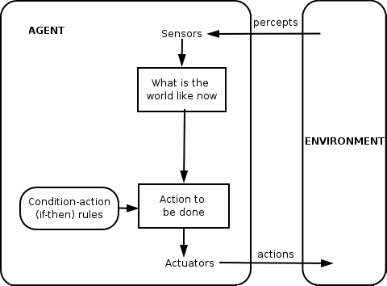
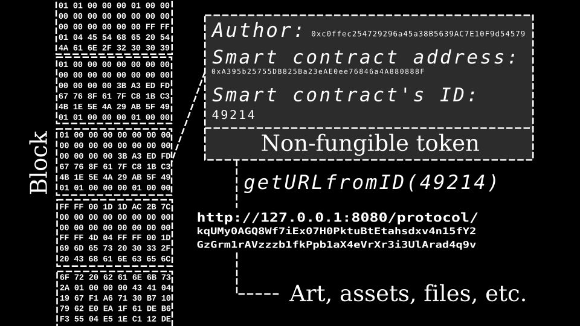

# 데이터도 자산이다 — 한국 디지털 자산 기본법이 바꾸는 것

_12개 사업 영역이 만드는 에이전트 경제의 법적 지형도_

## Executive Summary

> [!callout]
> 한국 디지털자산기본법(2025년 6월 발의)은 단순한 금융 규제가 아니다. 이 법안은 AI 에이전트가 자율적으로 거래, 결제, 계약을 수행할 수 있는 법적 자산 범주를 확정하는 인프라 법안이다. 인가 3개 + 등록 5개 + 신고 2개 + 특별인가 1개 + ICO 1개, 총 12개 사업 영역은 자본시장법의 금융투자업 분류를 디지털 자산에 이식한 것으로, 1,113만 이용자가 참여하는 87.2조 원 규모 시장에 제도적 기반을 부여한다.

> 이 법안의 진정한 의미는 "데이터의 자산화"에 있다. 토큰화 자산(RWA) 시장이 2025년 240억 달러에서 2030년 2조~16조 달러 규모로 성장이 전망되는 가운데, 데이터가 법적 자산으로 토큰화되면 품질과 출처, 진단이 자산 가치 평가의 핵심 변수가 된다. 부동산 거래에 감정평가사가 필수이듯, 토큰화된 데이터 거래에서도 "데이터 자산 감정사(Data Asset Appraiser)"가 필요해지는 시대가 열린다.

> 에이전트 경제는 2025년 약 78억 달러에서 2030년 526억 달러(CAGR 46%)로 폭발적 성장이 예측된다. 디지털자산기본법의 12개 사업 영역 중 8개 이상에서 AI 에이전트의 자율적 참여가 기술적으로 가능하나, 에이전트의 법적 지위와 불공정거래 알고리즘 규제는 4개국 모두에서 미해결 과제로 남아 있다.

<!-- stat-card -->
**12개** — 법안이 정의한 사업 영역 — 인가 3 + 등록 5 + 신고 2 + 특별 1 + ICO 1

<!-- stat-card -->
**1,113만** — 한국 디지털 자산 이용자 — 인구의 21.4%, 87.2조 원 규모 시장

<!-- stat-card -->
**$52.6B** — AI 에이전트 경제 규모 (2030) — CAGR 46%, 12개 중 8개 영역 참여 가능

## 디지털자산기본법 해부 — 12개 사업 영역의 구조와 진입 규제

2025년 6월 민병덕 의원이 발의한 디지털자산기본법은 기존 자본시장법의 금융투자업 분류체계를 디지털 자산에 이식한 법안이다. 기본법(10개 사업 유형)과 혁신법(대여업 + ICO)을 통합하면, 한국 디지털 자산 생태계는 총 12개 사업 영역으로 구성된다. 이 구조의 핵심은 규제 강도의 차등화다. 시장 안정성에 직접 영향을 미치는 매매업과 중개업, 보관업에는 가장 엄격한 인가제를 적용하고, 기술 혁신이 활발한 주문전송업과 유사자문업에는 진입 장벽이 낮은 신고제를 두었다.

*▲ 대한민국 국회 (National Assembly of Korea) | 디지털자산기본법이 발의된 입법 기관 | Source: [Wikimedia Commons](https://commons.wikimedia.org/wiki/File:Emblem_of_the_National_Assembly_of_Korea.svg)*

### 1.1. 인가제 사업 영역 — 최소 자본금 5억 원

매매업, 중개업, 보관업은 금융위원회의 인가를 받아야 영업할 수 있다. 최소 자본금 5억 원, 3개월 이상의 심사 기간이 소요되며, 임원 자격 요건과 대주주 자격, 전산 안정성, 이해상충 방지체계가 필수다. 기존 가상자산 이용자보호법(2024년 7월 시행) 이후 사업자가 37개에서 약 15개로 축소되고, 상위 3사의 점유율이 99%에 달하는 과점 구조가 형성된 것은 이러한 높은 진입 장벽의 결과다.

### 1.2. 등록제 사업 영역 — 자본금 1억 원 이상

집합관리업, 지갑관리업, 일임업, 자문업, 대여업(혁신법)은 등록제로 운영된다. 인가제보다 진입 장벽이 낮지만, 여전히 금융당국의 심사를 거쳐야 한다. 이 중 자문업과 일임업은 AI 에이전트의 자율적 참여 가능성이 가장 높은 영역으로, 기술적 성숙도와 법적 진입 장벽 양면에서 가장 빠른 에이전트화가 예상된다.

### 1.3. 신고제와 특별인가

주문전송업과 유사자문업은 신고만으로 사업을 시작할 수 있어 진입 장벽이 가장 낮다. 반면, 자산연동형 디지털자산(스테이블코인) 발행은 "특별 인가"로 별도 요건이 적용되어 실질적으로 가장 높은 장벽이 된다. 100% 이상 준비금 규정과 함께 은행 51% 지분 요건 논쟁은 발행 주체를 사실상 은행 계열로 제한할 가능성을 내포하고 있다.

아래 표는 12개 사업 영역의 규제 등급, 자본 요건, 그리고 에이전트 연관도를 정리한 것이다.

| # | 사업 유형 | 규제 등급 | 근거 | 에이전트 연관도 |
| --- | --- | --- | --- | --- |
| 1 | 매매업 | 인가 | 기본법 | 높음 |
| 2 | 중개업 | 인가 | 기본법 | 높음 |
| 3 | 보관업 | 인가 | 기본법 | 중간 |
| 4 | 집합관리업 | 등록 | 기본법 | 높음 |
| 5 | 지갑관리업 | 등록 | 기본법 | 높음 |
| 6 | 일임업 | 등록 | 기본법 | 높음 |
| 7 | 자문업 | 등록 | 기본법 | 높음 |
| 8 | 주문전송업 | 신고 | 기본법 | 높음 |
| 9 | 유사자문업 | 신고 | 기본법 | 높음 |
| 10 | 스테이블코인 발행 | 특별인가 | 기본법 | 중간 |
| 11 | 일반 디지털자산 발행(ICO) | 등록/공시 | 혁신법 | 중간 |
| 12 | 대여업 | 등록 | 혁신법 | 중간 |

> [!callout]
> 12개 영역의 규제 차등화는 명확한 메시지를 담고 있다. 시장 안정이 우선인 영역(매매, 중개, 보관)에는 높은 진입 장벽을, 기술 혁신이 필요한 영역(자문, 주문전송, 유사자문)에는 낮은 장벽을 설정하여 "규제 속의 혁신"을 유도한다. 이 구조는 AI 에이전트가 각 영역에 차등적으로 진입할 수 있는 법적 경로를 제공한다.

## 글로벌 규제 비교 — MiCA, FIT21, 일본 FSA vs 한국

디지털 자산 규제는 2024~2026년 사이 글로벌 전환점을 맞이했다. EU MiCA의 전면 시행(2024년 12월), 미국 GENIUS Act 서명(2025년 7월), 일본 자금결제법 개정(2025년 6월), 그리고 한국 디지털자산기본법 발의(2025년 6월)가 연속으로 이루어졌다. 4개국의 접근 방식은 공통점과 차이점을 동시에 드러낸다.

가장 두드러진 차이는 사업자 분류 체계의 세분화 수준이다. EU MiCA는 8개 CASP(Crypto-Asset Service Provider) 유형을 정의하고, 한국은 12개 사업 영역으로 가장 세분화된 분류를 채택했다. 미국 FIT21은 SEC와 CFTC의 이원 체계를 유지하되, 탈중앙화 테스트라는 독특한 기준으로 규제 관할을 구분한다.

| 항목 | 한국 기본법 | EU MiCA | 미국 FIT21 / GENIUS | 일본 FSA |
| --- | --- | --- | --- | --- |
| 사업자 분류 | 12개 (기본법 + 혁신법) | 8개 CASP 유형 | SEC/CFTC 이원 체계 | 자금결제법 기반 |
| 스테이블코인 | 특별인가, 100%+ 준비금, 은행 51% 지분 논쟁 | ART/EMT 구분, 전자화폐기관 인가 | GENIUS Act: 100% 준비금, 연방/주 이중 경로 | 은행·자금이동업자 발행 |
| 패스포팅 | 없음 (별도 인가/등록) | 1개국 인가 = 27개국 영업 | 연방/주 이중 체계 | 없음 |
| 에이전트 조항 | 없음 (공백) | 없음 (공백) | 없음 (공백) | 없음 (공백) |
| 시행 시기 | 2027~2028 예상 | 2024.12 전면 시행 | FIT21 하원 통과, GENIUS 2025.07 시행 | 2026.06 시행 |
| 집행 사례 | 이용자보호법 기반 | 1년 만에 CASP 102개 인가, EUR 5.4억 벌금 | SEC 개별 집행 | FSA 행정지도 |

EU MiCA는 전면 시행 1년 만에 102개 CASP 인가, 5.4억 유로 벌금이라는 강력한 집행 실적을 보여주며 글로벌 기준을 선도하고 있다. 미국은 GENIUS Act(2025년 7월 서명)로 스테이블코인 규제의 새로운 기준을 세웠고, David Sacks가 "AI & Crypto Czar"로 임명되며 AI와 디지털 자산의 교차 정책을 조율하고 있다.

*▲ EU MiCA(Markets in Crypto-Assets)는 2024년 12월 전면 시행되어 글로벌 디지털 자산 규제의 기준점이 되었다 | Source: [Wikimedia Commons](https://commons.wikimedia.org/wiki/File:Flag_of_Europe.svg)*

> [!callout]
> 4개국 모두 에이전트의 자율적 경제 행위에 대한 명시적 규제 조항이 부재하다. 이는 에이전트 경제 확산 시 법적 불확실성의 원천이 되는 동시에, 선제적으로 에이전트 조항을 마련하는 국가에게 규제 차익(regulatory arbitrage) 기회를 제공한다. 불공정거래 금지 조항이 에이전트 알고리즘 거래에 어떻게 적용될지는 한국과 EU MiCA 모두에서 해결해야 할 과제다.

## 에이전트 경제와 디지털 자산의 교차점

에이전트 경제는 2025~2026년 사이 독립적 학술 분야로 확립되었다. Xu(2026)의 5계층 아키텍처(Physical Infra, Identity, Cognitive, Economic, Governance), Alqithami(2026)의 317편 체계적 문헌 리뷰(SLR), ETHOS의 탈중앙화 거버넌스 모델이 연속 발표되면서, 에이전트가 자율적으로 경제 행위를 수행하는 시스템의 이론적 토대가 마련되었다. 글로벌 AI 에이전트 크립토 프로젝트는 550개 이상, 섹터 시가총액은 43억 달러에 달한다(CoinGecko 2025).

*▲ 지능형 에이전트(Intelligent Agent) 기본 구조 — 환경(Environment)을 인식(Sensors)하고, 조건-행동 규칙에 따라 의사결정 후 행동(Actuators)을 수행하는 자율 시스템 | Source: [Wikimedia Commons](https://commons.wikimedia.org/wiki/File:IntelligentAgent-SimpleReflex.png)*

### 3.1. 12개 사업 영역별 에이전트 참여 시나리오

12개 사업 영역을 에이전트 수행 가능성, 법적 장벽, 기술 성숙도, DataClinic 연결점의 4축으로 분석하면, 영역별 에이전트화 우선순위가 드러난다. 자문업과 일임업은 기술 성숙도가 높고 법적 장벽이 상대적으로 낮아 가장 빠른 에이전트화가 예상되며, 매매업과 중개업은 알고리즘 트레이딩의 형태로 이미 부분적으로 에이전트화가 진행 중이다.

기술적으로는 Account Abstraction(ERC-4337, EIP-7702)이 에이전트 월렛의 기반을 제공하고, Virtuals Protocol의 Agent Commerce Protocol(ACP)과 Fetch.ai의 AEA(Autonomous Economic Agents) 프레임워크가 에이전트 간 거래 인프라를 구축했다. x402 마이크로페이먼트 프로토콜은 에이전트 간 소액 결제를 HTTP 계층에서 직접 처리할 수 있게 한다.

### 3.2. 불공정거래와 3A 프레임워크

에이전트 경제의 가장 큰 법적 쟁점은 불공정거래 규제와 알고리즘 거래의 충돌이다. 디지털자산기본법의 불공정거래 금지 조항(시세조종, 미공개정보 이용 등)은 기존 증권법의 규제를 차용한 것으로, "의도"를 가진 자연인을 전제하고 있다. AI 에이전트에게 "의도"가 있는가? 에이전트의 데이터 접근이 "미공개정보 이용"에 해당하는가? 에이전트의 반복 거래가 "시세조종"인가?

학술 연구에서는 "3A 프레임워크"(Autonomy, Anonymity, Automation)로 이 위험을 체계화하고 있다. 에이전트의 자율성이 높아질수록 법적 책임의 귀속이 불분명해지고, 익명성은 규제 회피의 도구가 될 수 있으며, 자동성은 시장 조작의 속도를 인간의 대응 범위를 넘어서게 만든다. "점진적 탈중앙화(progressive decentralization)" 접근이 학술적 해법으로 부상하고 있으며, 초기에는 인간 감독 하의 에이전트 참여에서 점진적으로 자율성을 확대하는 것이 현실적 경로다.

Xu (2026)
                            에이전트 경제는 5계층으로 구성된다 — Physical Infrastructure, Identity, Cognitive, Economic, Governance. 디지털자산기본법은 이 중 Economic 계층과 Governance 계층의 법적 기반을 제공한다.

> [!callout]
> AI 에이전트 경제 시장 규모는 2025년 $5~8B(컨센서스 범위)에서 2030년 $52.6B(CAGR 46%)으로 성장이 전망된다(MarketsandMarkets). 디지털자산기본법의 12개 사업 영역 중 8개 이상에서 AI 에이전트의 자율적 참여가 기술적으로 가능하나, 법적 지위(법인격)에 대한 규정 공백은 4개국 공통 과제다.

## 데이터의 자산화 — 토큰화된 데이터의 가치 평가 체계

"데이터 품질이 자산 가치를 결정한다"는 명제는 2025년에 학술적으로 입증되기 시작했다. Tang et al.(2025)의 GenAI 기반 데이터 자산 가치 평가 모델, DQSM(2025)의 ML+XAI 데이터 가치 정량화 메커니즘, Shapley value 기반 데이터 마켓 가치 산정 연구가 수렴하면서, "data quality to asset value" 인과관계가 정량적으로 확인되기 시작한 것이다.

*▲ NFT 블록체인 구조 — 토큰화된 자산은 블록체인 위에서 스마트 컨트랙트 주소로 식별되며, 이 구조가 데이터 자산의 소유권과 거래 이력을 불변(immutable)하게 기록한다 | Source: [Wikimedia Commons](https://commons.wikimedia.org/wiki/File:NFT_diagram.svg)*

### 4.1. 데이터 자산 가치 평가의 세 가지 접근법

데이터 자산의 가치를 평가하는 방법론은 전통 자산 평가와 유사하게 세 가지 접근법으로 나뉜다. 수익접근법은 데이터가 창출하는 미래 현금흐름을 할인하여 현재 가치를 산정한다. 비용접근법은 동일한 데이터를 재생산하는 데 필요한 비용을 기준으로 한다. 시장접근법은 유사 데이터의 거래 가격을 참조한다.

2025년의 학술적 전환점은 이 세 가지 접근법이 ML 기반 동적 평가로 진화하고 있다는 점이다. Tang et al.의 연구는 GenAI를 활용한 통합 가치 평가 모델이 개별 모델 대비 정확도와 안정성에서 유의미한 우위를 보이며, 데이터 집약 산업(정보기술, 금융서비스)에서 특히 효과적임을 실증했다. DQSM 연구는 ML+XAI를 결합하여 데이터의 실제 내용을 공개하지 않고도 특정 모델이나 분석에 기여할 수 있는 가치를 평가하는 "비파괴적 진단" 메커니즘을 제안했다.

### 4.2. 스마트 컨트랙트와 데이터 품질 합의

Heideman et al.(2024)은 스마트 컨트랙트 기반 데이터 품질 합의 프로토콜을 Solidity로 구현하고 이더리움에서 검증했다. 이 연구의 핵심적 함의는, 데이터 품질 진단 결과가 블록체인 위에서 자동 실행되는 거래 조건이 될 수 있다는 점이다. 예를 들어, 데이터셋의 품질 점수가 특정 임계값 이상일 때만 거래가 체결되는 스마트 컨트랙트를 설계할 수 있다. "진단, 스마트 컨트랙트, 자산 거래"의 파이프라인은 데이터 자산 거래의 새로운 표준이 될 수 있다.

### 4.3. 부동산 감정 vs 데이터 감정

데이터 자산 감정의 개념을 이해하는 가장 직관적인 비유는 부동산 감정이다. 부동산 거래에서 감정평가사(공인 자격)는 시장가치, 수익가치, 원가를 감정하고, 이것이 담보, 매매, 세금의 기초가 된다. 데이터 자산에서는 품질, 다양성, 출처, 적합성을 평가하고, 이것이 토큰 가격, 거래 조건, 공시의 기초가 된다.

핵심 차이점은 이렇다. 부동산은 물리적 실체가 있어 감정 방법론이 100년 이상 성숙되어 왔다. 데이터 자산은 비물리적이므로 품질 메트릭이 가치의 "유일한 객관적 증거"가 된다. 토큰화 RWA 시장이 2025년 약 240억 달러에 도달했으나, 대부분의 토큰이 낮은 2차 시장 거래량과 제한된 투자자 참여를 보인다(arXiv:2508.11651). 토큰화가 곧 유동성을 의미하지는 않으며, 제3자의 품질 인증이 유동성 프리미엄을 창출하는 차별화 요소가 된다.

> [!callout]
> 데이터 마켓플레이스 시장은 $1.86B(2025)에서 $5.73B(2030, CAGR 25.2%)으로, 데이터 거버넌스 시장은 $5.38B(2026)에서 $24.07B(2034, CAGR 20.5%)으로 성장이 전망된다. 이 두 시장의 교차점에서 "데이터 자산 감정" 수요가 발생한다. 디지털자산기본법 제5장의 공시 의무는 이 수요에 법적 강제력을 부여하는 기제다.

## 전망과 시사점 — 2027년의 디지털 자산 생태계

디지털자산기본법의 시행 시기는 국회 정무위원회 심의와 하위법령 제정 기간을 고려하면 2027~2028년으로 예상된다. 2026년 4월 GFC에서 구윤철이 "입법 지원 속도"를 언급한 것은 긍정적 시그널이지만, 기본법과 혁신법의 통합 여부에 따라 일정은 유동적이다.

### 5.1. 시장 구조 변화 시나리오

법안 시행 후 시장 구조는 세 가지 시나리오로 전개될 수 있다. **보수적 시나리오**에서는 인가제의 높은 진입 장벽으로 기존 상위 사업자의 과점이 유지되며, 새로운 사업자 진입은 제한적이다. **중립 시나리오**에서는 등록제와 신고제 영역에서 핀테크와 AI 기업의 진입이 활발해지고, 특히 자문업과 주문전송업에서 에이전트 기반 서비스가 등장한다. **낙관적 시나리오**에서는 글로벌 기업의 한국 시장 진입이 가속화되고, 데이터 토큰화 시장이 별도의 세그먼트로 성장한다.

### 5.2. 스테이블코인 논쟁과 에이전트 결제 인프라

스테이블코인 발행에 대한 은행 51% 지분 요건 논쟁은 에이전트 결제 인프라의 미래를 결정짓는 핵심 변수다. 한국은행은 스테이블코인이 통화 정책에 미치는 영향을 우려하여 은행 주도 발행을 선호하는 반면, 금융위원회는 비은행 발행자에게도 기회를 열어야 한다는 입장이다. 이 논쟁의 귀결은 에이전트가 사용할 수 있는 결제 수단의 다양성과 접근성을 결정한다.

### 5.3. 데이터 인프라 정책 공백이 만드는 기회

한국 정부는 모델(업스테이지 5,600억 원), 인프라(해남 솔라시도 2.9조 원), 반도체(리벨리온 6,400억 원)에 집중 투자하고 있으나, 데이터 인프라 단독 펀딩 트랙은 명시되지 않았다. 인도(BharatGen, 22개 언어 데이터 우선)와 싱가포르(SEA-LION, 13개 언어)에서는 모델 펀드 다음에 데이터 및 평가 펀드가 따라오는 패턴이 관찰된다. 디지털자산기본법이 데이터 자산화의 법적 기반을 만들면, "데이터 품질 진단에서 자산 가치 평가로"의 경로는 새로운 정책 수요가 된다.

> [!callout]
> IOSCO의 "same activities, same risks, same regulatory outcomes" 원칙에 따라, 토큰화된 데이터 자산도 기존 금융 자산과 동일한 수준의 공시와 감정 요건을 적용받을 가능성이 높다. RWA 토큰화 시장이 2030년 $2조~$16조(McKinsey 보수적~BCG 낙관적 추정)로 성장하는 가운데, 그 성장의 질은 "토큰화된 자산의 신뢰성을 누가, 어떻게 보증하는가"에 달려 있다.

## 페블러스가 이 법안에 주목하는 이유 — 데이터 자산 감정사의 시대

디지털자산기본법은 토큰화된 자산의 법적 지위를 확정하는 법안이다. 데이터가 토큰화되어 거래 가능한 자산이 되면, 그 자산의 품질을 객관적으로 진단하고 증명하는 인프라가 필수적이다. 이 인프라가 부재한 상태에서의 데이터 토큰 거래는 감정 없는 부동산 거래와 같다. 여기서 "데이터 자산 감정사(Data Asset Appraiser)"라는 새로운 역할이 등장한다.

### 비즈니스와 기술의 교차점

DataClinic의 3단계 진단 체계는 법안 제5장 공시 의무가 요구하는 디지털 자산의 출처, 품질, 리스크 투명 공개와 직접 매핑된다. Level 1(기본 품질)은 형식 오류, 결측치, 이상치를 탐지하여 공시 요건의 기본 정보를 충족한다. Level 2(임베딩 분석)는 데이터 분포, 다양성, 대표성을 평가하여 탈중앙화 데이터 마켓의 "다양성과 관련성 평가"와 개념적으로 연결된다. Level 3(도메인 특화)는 금융, 의료, 제조 등 산업별 자산 가치 차별화의 근거를 제공한다.

### 학술적 근거와 실무 함의

DQSM(2025) 연구가 보여준 "데이터 내용을 공개하지 않고 가치를 평가하는" 메커니즘은 DataClinic의 비파괴적 진단 접근과 개념적으로 일치한다. Shapley value 기반 데이터 거래 연구는 에이전트 간 데이터 거래에서 개별 데이터의 기여도를 공정하게 산정할 수 있음을 보여주며, DataClinic 진단 결과가 Shapley value 산정의 입력이 될 수 있는 이론적 연결고리를 제공한다. PebbloSim의 특허(US 12,481,720)에 포함된 감사 추적(Provenance) 자동 생성 기능은 ISO 42001 준수 증적과 함께 데이터 자산의 법적 신뢰성을 보장한다.

### 고객 실무에서의 변화

대량 산업 데이터를 보유한 기업들은 디지털자산기본법 시행 후 자체 데이터를 토큰화하여 공급망 파트너와 거래하거나, AI 모델 학습 데이터를 자산으로 관리할 수 있다. 이때 데이터 품질 진단 보고서는 "자산 감정서"로 기능하고, 법안 제5장의 공시 의무는 이 감정서를 법적 요건으로 만든다. 기업 내 AI 에이전트가 디지털 자산을 자율적으로 거래하려면, 데이터 품질이 거래 조건의 일부가 되어야 하며, "진단에서 스마트 컨트랙트 조건으로, 다시 에이전트 자율 거래로" 이어지는 파이프라인이 여기서 작동한다.

### 앞으로 탐구할 질문들

디지털자산기본법이 실제로 시행되었을 때, 데이터 자산의 품질 진단은 금융 규제의 필수 요건이 될 것인가? 에이전트가 데이터 품질을 자율적으로 평가하고 거래 조건에 반영하는 시스템은 기술적으로 가능하지만, 법적으로는 어떤 프레임워크가 필요한가? DataClinic, PebbloSim, DataGreenhouse로 이어지는 진단에서 자산 개선까지의 풀스택 접근은 이 질문들에 대한 하나의 해법을 제시하지만, 시장과 규제의 진화에 따라 그 형태는 계속 달라질 것이다.

> [!callout]
> 글로벌 패턴은 명확하다. 인도(BharatGen), 싱가포르(SEA-LION) 사례에서 모델 펀드 다음에 데이터 및 평가 펀드가 따라온다. 한국의 후속 라운드에서도 데이터 인프라 기업의 기회가 열릴 것이며, 디지털자산기본법은 그 기회의 법적 기반을 만드는 법안이다. "토큰화는 가능성이고, 신뢰는 증명해야 한다" — 데이터 자산 감정사의 역할은 이 간극을 메우는 것이다.

## 참고문헌

### 학술 논문

- 1.Pithadia, Fenoglio, Batrinca, Treleaven et al. "[Data Assets: Tokenization and Valuation](https://papers.ssrn.com/sol3/papers.cfm?abstract_id=4419590)." SSRN 4419590, 2023.
- 2.Hafner, Mira da Silva. "Data valuation as a business capability: from research to practice." Springer ISeBM 23:745-784, 2025.
- 3.Xu, Minghui. "[The Agent Economy: A Blockchain-Based Foundation for Autonomous AI Agents](https://arxiv.org/abs/2602.14219)." arXiv:2602.14219, 2026.
- 4.Alqithami, Saad. "[Autonomous Agents on Blockchains: Standards, Execution Models, and Trust Boundaries](https://arxiv.org/abs/2601.04583)." arXiv:2601.04583, 2026.
- 5.[A Comprehensive Study of Shapley Value in Data Analytics](https://arxiv.org/abs/2412.01460). arXiv:2412.01460, 2024.
- 6.Xia, Ning. "[Exploration on Real World Assets (RWAs) & Tokenization](https://arxiv.org/abs/2503.01111)." arXiv:2503.01111, 2025.
- 7.Tang et al. "Data asset valuation model based on generative artificial intelligence." PLOS ONE, 2025.
- 8."Selecting Data Assets in Data Marketplaces (DQSM)." BISE, Springer, 2025.
- 9.[Data Measurements for Decentralized Data Markets](https://arxiv.org/abs/2406.04257). arXiv:2406.04257, 2024.
- 10.Heideman, Kumara, Van Den Heuvel, Tamburri. "Smart Contracts as Data Quality Consensus Enforcers in Data Markets." Springer BMSD, 2024.
- 11.[Can We Govern the Agent-to-Agent Economy?](https://arxiv.org/abs/2501.16606) arXiv:2501.16606, 2025.
- 12.[Decentralized Governance of Autonomous AI Agents (ETHOS)](https://arxiv.org/abs/2412.17114). arXiv:2412.17114, 2024.
- 13.[Giving AI Agents Access to Cryptocurrency and Smart Contracts Creates New Vectors of AI Harm](https://arxiv.org/abs/2507.08249). arXiv:2507.08249, 2025.
- 14.[Is Your AI Truly Yours? Leveraging Blockchain for Copyrights, Provenance, and Lineage](https://arxiv.org/abs/2404.06077). arXiv:2404.06077, 2024.
- 15.[Tokenize Everything, But Can You Sell It? RWA Liquidity Challenges](https://arxiv.org/abs/2508.11651). arXiv:2508.11651, 2025.
- 16."Shapley value-based data valuation for machine learning data markets." Discover Applied Sciences, Springer, 2025.

### 법안 및 규제 문서

- 17.민병덕 의원 디지털자산기본법 (의안번호 2213449, 2025.06.10 발의).
- 18.EU MiCA (Markets in Crypto-Assets Regulation, 전면 시행 2024.12.30).
- 19.미국 GENIUS Act (Guiding and Establishing National Innovation for US Stablecoins, 2025.07.18 서명).
- 20.미국 FIT21 (Financial Innovation and Technology for the 21st Century Act, H.R.4763).
- 21.일본 FSA 자금결제법/금상법 개정 (2025.06.06 통과, 2026.06.13 시행 예정).
- 22.IOSCO "Tokenization of Financial Assets" (FR/17/25, 2025.11).
- 23.한국 AI 기본법 (2025.12.26 통과, 2026.01.22 시행).
- 24.한국 가상자산 이용자보호법 (2024.07.19 시행).

### 시장 데이터 및 보고서

- 25.금융정보분석원(KoFIU) 가상자산 실태조사 (2024 H1~2025 H2).
- 26.CoinGecko 2025 연간 보고서.
- 27.MarketsandMarkets AI Agent 시장 보고서 (2025).
- 28.Grand View Research 데이터 마켓플레이스 보고서 (2025).
- 29.Fortune Business Insights 데이터 거버넌스 시장 보고서 (2026).
- 30.Broadridge Digital Transformation Study.
- 31.McKinsey Global Institute RWA 토큰화 전망.
- 32.BCG + Ripple RWA 토큰화 공동 보고서.

### 업계 및 뉴스

- 33.금융위원회 보도자료: 국민성장펀드 업스테이지 5,600억 투자 (2026.05.03).
- 34.Stanford HAI AI Index 2026 (2026.04.13).
- 35.GFC 2026 구윤철 발언 (2026.04.23).
