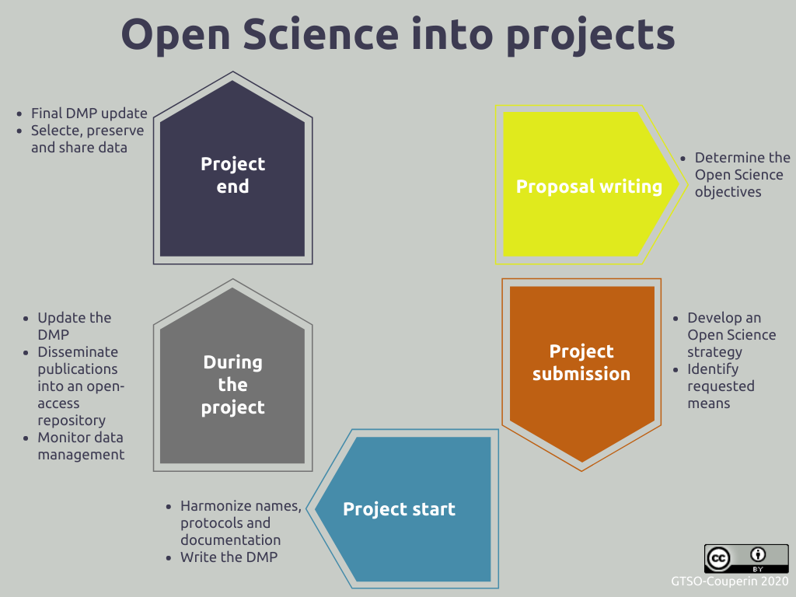
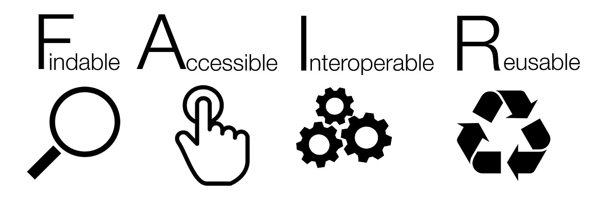
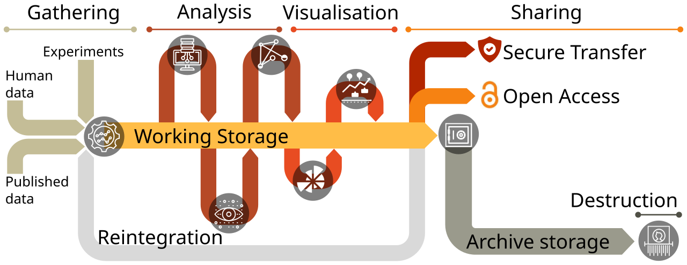

# Opening Data Is Not the Same as Making It Usable

_The road Korea_

## Executive Summary

> [!callout]
> In June 2026, Korea promulgated its Research Data Act, the first law to bring research data generated by national R&D projects within the reach of statute. Until now, research data carried no management obligation; it sat scattered across individual labs and projects, and downstream researchers frequently re-ran the same measurements or could not verify the work that came before. The new law clarifies who is responsible for managing data, makes openness the default principle, and lets researchers find data through an integrated platform. The United States and the EU have already begun treating research data as core infrastructure for the AI era, and Korea now stands at the same starting line. This report looks at both the road the law opened and the distance still left to cover.

> There is one gap worth naming. Opening data and making it usable — for the next researcher, and for AI — are two different problems. Across multiple empirical studies, the share of data that is "findable" approaches 100%, yet the share that is actually "reusable" hovers around half. Data stripped of metadata, provenance, format, and quality remains open in name but cannot serve as an input for reproduction or retraining. Openness is the starting line, not the finish.

> That is why the year before the law takes effect should be spent not on processing a disclosure obligation as paperwork, but on building a usable data foundation. For open research data to be reused repeatedly across follow-on research, industry, and AI pipelines, one last layer must be filled in: the AI-Ready condition of data quality, metadata, and provenance. This report explains that final layer through the lens of data practice.

<!-- stat-card -->
**70%+** — of scientists failed to reproduce others' experiments — Survey of 1,576 scientists (Baker, Nature 2016)

<!-- stat-card -->
**100% → 61%** — findability vs. reusability — FAIR analysis of COVID-19 research data (2024)

<!-- stat-card -->
**+69%** — higher citation for papers that shared data — the reward of reuse (Piwowar, 2007)

<!-- stat-card -->
**64% → 86%** — AI accuracy from improving data quality alone — fixed model · data-centric AI benchmark

## Research Data: Why a Law, and Why Now

Papers have journals; patents have registration systems. Both come with a framework that defines who created what and when, and how it should be preserved and cited. Yet the source beneath those papers and patents — the research data born from experiment and observation — had no such framework. Even within national R&D projects, there was no obligation governing how research data should be preserved or who should manage it; it was left to the discretion of ministries, institutions, and individual researchers. With no standard in place, data scattered the moment a project ended.

The cost of scattered data compounds over time. One longitudinal study reported that the probability of the original data still being available drops by roughly 17% each year after a paper is published. As broken email addresses, lost storage devices, and departed researchers accumulate, data five or ten years old becomes practically irrecoverable. As a result, downstream researchers re-measure values that have already been measured and repeat the same trial and error, unable to reach the evidence behind the prior work they set out to verify.

The paradox lies in the scale of investment. In 2026, Korea's government R&D budget reached a record KRW 35.3 trillion (about USD 24 billion), up 19.3% from the year before. R&D investment as a share of GDP stands at 4.96%, second among OECD members. That much public money produces data, yet the mechanism to gather those outputs systematically and put them back to use had been missing. The Research Data Act takes aim at precisely this gap.

*▲ Research data lifecycle — six stages from collection through description, storage, processing, archiving, and making data available. Each stage must be systematically designed for data to be reusable in follow-on research and AI pipelines. | Source: [Wikimedia Commons (CC BY)](https://commons.wikimedia.org/wiki/File:Data_management_-_The_Passport_For_Open_Science_10.png)*

> [!callout]
> Korea already counts roughly 6.5 million datasets through its National Research Data Platform (DataON), including links to external repositories. But a large share of that is heavily concentrated in a single institution, and one empirical assessment found that domestic digital archives score an average in the low 50s (out of 100) on FAIR compliance. The volume has accumulated; quality and usability remain the unfinished work.

## The Law's Three Pillars — Responsibility, Openness, and a Path

The frame of the new law can be read as three pillars. What each pillar means lies not in the clause itself, but in how it reshapes the everyday data practice of research.

### 2.1. Management responsibility becomes clear

The research institution that carries out a national R&D project holds the rights to the research data it produces and bears the obligation to manage it systematically. A procedure for drafting and submitting a Data Management Plan (DMP) enters at the project stage. This is not a device for offloading administrative burden onto a single researcher; it is a design in which the institution and the state jointly preserve the data a researcher creates, and put standards and procedures in place so the next researcher can trust and reuse it. From the researcher's side, it becomes possible to anticipate, in advance, how far the data must be preserved, submitted, and disclosed once a project ends.

*▲ Open Science integrated into the project lifecycle — from proposal writing to project end, each stage carries DMP updates, data sharing obligations, and open-access repository tasks. This is the structure EU Horizon Europe mandates. | Source: [Wikimedia Commons, GTSO-Couperin 2020 (CC BY)](https://commons.wikimedia.org/wiki/File:Open_Science_into_projects.png)*

### 2.2. Openness becomes the rule, protection the exception

Research data is open by default, but data that needs protection — trade secrets, third-party rights, national security — can be withheld for a defined period. Once it is set out as a rule what must be disclosed and in what cases protection applies, researchers can anticipate whether their data will be opened, and users can responsibly make use of it under clear standards for attribution and cost-sharing. This mirrors the principle the EU has long refined: "as open as possible, as closed as necessary."

### 2.3. A path to finding data opens up

Research data that is disclosed is registered and linked on the National Integrated Research Data Platform or on domain-specific specialized platforms, so researchers can locate and access it. The point is to reduce the pool of "data we can't use because we don't know where it is." The payoff is largest for data that is expensive to regenerate: large-scale instruments, long-term observation, space, earth science. A year's worth of climate observations or particle-collision data cannot be obtained again once that moment has passed.

Intent of the law
                            This law does not target only the data behind "successful outcomes" that became papers or patents. If it is needed to verify and reproduce a result, data that emerged from trial, error, and failure also counts as an important research asset, because a later researcher may find a new starting point in it.

## The World Treats Research Data as Infrastructure

Korea's law did not emerge in a vacuum. Major economies have already begun treating research data as the infrastructure that underpins research competitiveness in the AI era. Two movements stand out.

### 3.1. United States — the Genesis Mission, linking data to supercomputers and AI

In November 2025, the United States launched the "Genesis Mission" by executive order. Led by the Department of Energy (DOE), it sets out to link federal scientific datasets, supercomputing resources, and AI models on a single platform. It mobilizes 17 national laboratories and roughly 40,000 personnel, with the goal of doubling the productivity and impact of American science and engineering within a decade, solving hard problems in strategic fields such as energy, health, advanced materials, fusion, space, and quantum. What is striking is that one explicit pillar of the plan is "integration of multi-source datasets." Gathering data is itself treated as the starting point of national strategy.

### 3.2. EU — Horizon Europe and the institutionalization of FAIR

Through "Horizon Europe," which invests roughly €95.5 billion from 2021 to 2027 (about €93.5 billion after the mid-term review), the EU requires research projects to draw up a data management plan and mandates that data be findable, accessible, interoperable, and reusable. Research data is deposited in trusted repositories under the principle "as open as possible, as closed as necessary." At the root of that principle are the FAIR principles, published in 2016. FAIR is the international standard that data should be Findable, Accessible, Interoperable, and Reusable. It has become the common language of nearly every research-data policy today.

Setting the three regions side by side, across governance, budget, and core principle, reveals where Korea's law stands.

*▲ FAIR principles — Findable, Accessible, Interoperable, Reusable. Proposed by Wilkinson et al. in 2016, they have become the common language of virtually every research-data policy in the world today. | Source: [Wikimedia Commons (CC0)](https://commons.wikimedia.org/wiki/File:FAIR_data_principles.jpg)*

| Dimension | Korea Research Data Act | US Genesis Mission | EU Horizon Europe · EOSC |
| --- | --- | --- | --- |
| Form | Statute (promulgated 2026, in force 2027) | Executive order (Nov 2025) | Research-funding program + policy |
| Scale · budget | 2026 govt R&D: KRW 35.3T (~USD 24B) | 17 national labs, ~40,000 personnel | ~€95.5B (2021–2027) |
| Core mechanism | Management duty · DMP · integrated/specialized platforms | Dataset–supercomputing–AI platform | DMP duty · trusted-repository deposit · FAIR |
| Openness principle | Open by default + protected exceptions (time-bound) | Emphasis on integrating and using federal data | "As open as possible, as closed as necessary" |
| Aim | Turn scattered data into assets | Double scientific productivity within a decade | Open science · reusability |

> [!callout]
> The forms differ, but the direction is one: treating research data not as a byproduct of research but as infrastructure that opens the next discovery. Korea's law sits within this movement, and by creating a management obligation it has laid the institutional foundation. But what the institution built is a path to opening data, not a state in which that data is immediately usable. That difference is the subject of the next section.

## Being Open Does Not Mean Being Usable

The four letters of FAIR are not four equally hard tasks. When you actually measure them, the first two (Findable, Accessible) hold up reasonably well, while the last two — especially the final R, Reusable — are the weakest. A meta-study analyzing COVID-19 research data against the FAIR criteria shows this gap in sharp relief.

Findable100%

Accessible21.5%

Interoperable46.7%

Reusable61.3%

▲ FAIR compliance of COVID-19 research data by dimension (share meeting "moderate" or above). Findable, yet barely half is reusable. Source: COVID-19 FAIR meta-research (2024).

This gap between data that is "findable" and data that is "reusable" is not a mere statistic; it touches a symptom science as a whole has long suffered from. In a 2016 Nature survey of 1,576 scientists, more than 70% said they had tried and failed to reproduce another researcher's experiment, and over half could not reproduce even their own. When the pharmaceutical company Amgen tried to reproduce "landmark" preclinical cancer papers, only 6 of 53 — about 11% — succeeded. Even when the data exists, results go unverified if the documentation, provenance, and quality around it are missing.

This loss does not stay inside one lab. The European Union estimated that because research data is not FAIR, member-state economies lose at least €10.2 billion every year: the combined cost of re-measuring the same data, hunting for where it is, and reprocessing it to make it usable. The cost of data that never gets opened, or is open but unusable, accumulates this way into waste at the scale of a national economy.

Conversely, when data is properly prepared and shared, the reward is large. One study found that papers that shared their data were cited about 69% more often than those that did not, and data designed for openness from the start — like the Human Genome Project — is cited as a case that generated enormous economic and scientific returns relative to the investment (the figure is an estimate, and the methodology is debated). Speed creates value too. In January 2020, less than 48 hours after Chinese researchers obtained the genome of an unidentified coronavirus, they released the full sequence to GISAID, and researchers worldwide could begin developing vaccines and diagnostics immediately, without ever handling the physical virus. The same data splits into "vanishing cost" or "returning value" depending on how it is managed.

#### The cost of not managing it

70%+failed to reproduce others' experiments (Baker, 2016)

17% / yrodds of original data being lost after publication (Vines, 2014)

€10.2B / yrminimum the EU loses to non-FAIR data (EC, 2018)

#### The value of doing it right

+69%higher citation for papers that shared data (Piwowar, 2007)

48 hrsfrom genome release to vaccine/diagnostic work (GISAID, 2020)

64% → 86%AI accuracy gain from improving data quality alone

> [!callout]
> The conclusion is simple. Openness is a necessary condition, not a sufficient one. Keeping data from vanishing, making it findable, making it reusable, and making it verifiable are each a distinct piece of work. The Research Data Act gives strong institutional momentum to the first two, keeping data from vanishing and making it findable. The remaining two, making it reusable and making it verifiable, depend on the quality of the data.

## Research Data in the AI Era — the AI-Ready Condition and the Year Ahead

In the AI era, the bar for "reusable data" rises one notch higher. It is no longer enough for a person to read and interpret it; a machine must be able to feed it directly into training and validation without extra processing. This state is commonly called "AI-Ready data." If open data means a state anyone can access, AI-Ready data means a state — equipped with consistent metadata, labels, provenance, and quality — that can enter an AI pipeline as-is.

This bar is not an abstract slogan; it is being codified into international standards. The ISO/IEC 5259 series, issued from 2024, covers "data quality for analytics and machine learning," defining the metrics, processes, and governance of data quality as a standard. In the same vein, the center of gravity in AI research is shifting from the model to the data. In one data-centric AI benchmark, holding the model architecture fixed and refining only the dataset — fixing mislabeled cases and filling in missing ones — raised accuracy from 64.4% to 85.8%. Some reports find that improving data quality delivers an effect on par with collecting three times as much data.

So what does it take for research data, once disclosed, to reach an AI-Ready state? At a minimum, the following five things must travel with the data.

- ✓**Metadata** — what was measured, when, and under what conditions, in a machine-readable form
- ✓**Provenance and lineage** — traceability of where the data came from and what processing it went through
- ✓**Labels and structure** — a format organized for training and validation, with consistent definitions
- ✓**Format interoperability** — standard formats readable across systems, not locked into a single tool
- ✓**Quality validation** — checking for missing values, outliers, and inconsistencies, and recording the results alongside the data

*▲ Research data flow — from gathering through analysis and visualisation, then shared via secure transfer or open access, and preserved in archive storage. For data to be AI-Ready, metadata and quality validation must accumulate at each stage. | Source: [Wikimedia Commons (CC BY-SA)](https://commons.wikimedia.org/wiki/File:Data_lifecycle.svg)*

Looking again at where Korea stands, the task is clear. DataON counts roughly 6.5 million entries, but they are concentrated in a single institution, and domestic digital archives average a FAIR score in the low 50s. In one field, a study reported that only 1% of disclosed data was directly machine-learning-readable (this is a single-domain case and hard to generalize across all fields). The quantitative foundation is in place; the signal is that the last layer on the way to AI-Ready has yet to be filled.

> [!callout]
> The year before the law takes effect, then, should be spent designing not "excessive administrative procedure" but "a management system that helps research" — one that accounts for the data characteristics of each field and the burden on the research floor. When there are rules researchers can trust, procedures institutions can execute, and touchpoints industry can use, open data finally becomes an asset that AI can train on and follow-on research can reproduce.

## Where Pebblous Stands on This

Pebblous does not stand in the seat of interpreting the statute. If Korea's Ministry of Government Legislation and Ministry of Science and ICT are the authoritative interpreters of the law, the problem we have always worked on begins at the end of the road the law opened: the last layer that open research data must cross to actually be used in follow-on research and AI pipelines: the problem of data quality, metadata, and provenance.

### Why this gap is our problem space

The proposition data-centric AI has confirmed again and again is that data quality sets the ceiling on model performance. A model trained on low-quality or undocumented data forms a distorted internal representation. Public research data that will be disclosed is a potential source for training and validation, but without metadata, labels, and quality validation it cannot be fed into AI as-is. This extends a point Pebblous has made consistently — "the data that goes in is the world the model sees" — into the domain of public-data policy.

### What it means on the ground

Once the law takes effect, AI startups and research institutions will soon evaluate the public research data being released as a data source. At that point, the capacity to diagnose and refine — to judge "which datasets are actually AI-Ready, and what needs reinforcing to make them usable" — becomes a competitive edge. For research institutions too, turning a "submission and disclosure obligation" into "usable assets" calls for tools that inspect metadata and quality. The next step after the disclosure obligation becomes, in effect, real demand for data quality.

### The questions ahead

Who will diagnose the quality of disclosed research data, and by what standard? How do the minimum requirements that separate AI-Ready from not-ready differ across fields? What more does it take, from a quality standpoint, to turn the data of trial, error, and failure into an asset? These questions do not close with a single report. In the writing that follows, Pebblous plans to unpack FAIR's reusability, ISO 5259, and the conditions for AI-Ready data more deeply, in the language of data practice.

> [!callout]
> The Research Data Act is a law that keeps the data researchers produce from vanishing and lets it be used more widely, on the premise of legitimate rights and protection. Researchers can move faster to the next question, and the nation can spread the value of data it has already paid for further and longer. On that starting line, filling the last layer that turns openness into use is where we stand.

## References

### Academic — FAIR · reproducibility · data-centric AI · data preservation

- 1.Wilkinson, M.D. et al. "[The FAIR Guiding Principles for scientific data management and stewardship](https://www.nature.com/articles/sdata201618)." _Scientific Data_ 3:160018, 2016.
- 2.Baker, M. "[1,500 scientists lift the lid on reproducibility](https://www.nature.com/articles/533452a)." _Nature_ 533, 452–454, 2016. (n=1,576)
- 3.Begley, C.G. & Ellis, L.M. "[Raise standards for preclinical cancer research](https://www.nature.com/articles/483531a)." _Nature_ 483, 531–533, 2012.
- 4.Piwowar, H.A., Day, R.S. & Fridsma, D.B. "[Sharing Detailed Research Data Is Associated with Increased Citation Rate](https://pmc.ncbi.nlm.nih.gov/articles/PMC1817752/)." _PLoS ONE_ 2(3):e308, 2007.
- 5.Vines, T.H. et al. "[The Availability of Research Data Declines Rapidly with Article Age](https://pubmed.ncbi.nlm.nih.gov/24361065/)." _Current Biology_ 24(1):94–97, 2014.
- 6."[COVID-19-related research data availability and quality according to the FAIR principles](https://www.ncbi.nlm.nih.gov/pmc/articles/PMC11573139/)." PMC11573139, 2024. (Findable 100% vs Reusable 61.3%)
- 7."[Dental Research Data Availability and Quality According to the FAIR Principles](https://www.ncbi.nlm.nih.gov/pmc/articles/PMC9516597/)." PMC9516597, 2022. (ML-usable 1%)
- 8.Mazumder, M. et al. "[DataPerf: Benchmarks for Data-Centric AI Development](https://arxiv.org/abs/2207.10062)." arXiv:2207.10062, 2022. (64.4%→85.8%)
- 9.Ng, A. — IEEE Spectrum. "[Andrew Ng: Unbiggen AI](https://spectrum.ieee.org/andrew-ng-data-centric-ai)." 2022. (data-centric AI; quality improvement ≈ 3× collection)
- 10."[A Data-Centric Approach to improve performance of deep learning models](https://www.nature.com/articles/s41598-024-73643-x)." _Scientific Reports_, 2024.

### Policy & statistics — law · government · international bodies · standards

- 11.Sideview. "[Research Data Act passes the National Assembly… in force 2027](https://www.sideview.co.kr/news/articleView.html?idxno=16788)" (in Korean). 2026.
- 12.Ministry of Science and ICT / Policy Briefing. "[2026 government R&D budget confirmed at KRW 35.3 trillion](https://www.korea.kr/briefing/policyBriefingView.do?newsId=156721759)" (in Korean). 2025-08-22.
- 13.The White House. "[Launching the Genesis Mission](https://www.whitehouse.gov/presidential-actions/2025/11/launching-the-genesis-mission/)" (Executive Order, 2025-11-24); Federal Register FR Doc 2025-21665.
- 14.U.S. Department of Energy. "[Energy Department Launches 'Genesis Mission'](https://www.energy.gov/articles/energy-department-launches-genesis-mission-transform-american-science-and-innovation)." 2025.
- 15.European Commission. "[Horizon Europe](https://research-and-innovation.ec.europa.eu/funding/funding-opportunities/funding-programmes-and-open-calls/horizon-europe_en)." (€95.5B; ~€93.5B after mid-term review)
- 16.ISO/IEC 5259-1:2024. "[Artificial intelligence — Data quality for analytics and machine learning (ML)](https://www.iso.org/standard/81088.html)." (Part 1–4: 2024 / Part 5: 2025)
- 17.PwC EU Services / European Commission. "[Cost of not having FAIR research data](https://op.europa.eu/en/publication-detail/-/publication/d375368c-1a0a-11e9-8d04-01aa75ed71a1/language-en)." 2018. (at least €10.2 billion/year)
- 18.KISTI. "[National Research Data Platform (DataON) data status](https://dataon.kisti.re.kr/datause/datauseStatus.do)" (in Korean). (~6.5 million entries as of 2026-06-11)
- 19.Journal of Korean Society of Archives and Records Management. "[Evaluation and improvement of domestic digital archives under the FAIR data principles](https://koreascience.kr/article/JAKO202405132581019.pub)" (in Korean). 2024. (average 50.43/100)
- 20.OECD. "[Enhancing Access to and Sharing of Data](https://www.oecd.org/en/publications/enhancing-access-to-and-sharing-of-data_276aaca8-en)." 2019.

### Cases — the value and openness of data

- 21.Battelle / Tripp, S. & Grueber, M. "[Economic Impact of the Human Genome Project](https://www.battelle.org/docs/default-source/misc/battelle-2011-misc-economic-impact-human-genome-project.pdf)." 2011/2013. (ROI estimate; methodology debated)
- 22.GISAID. "[Global data sharing initiative](https://gisaid.org/)." (genome released in 48 hours; ~15 million sequences cumulatively)
- 23.Ajunews. "[Coverage of the Research Data Act](https://www.ajunews.com/view/20260610132746606)" (in Korean). 2026-06-10.
