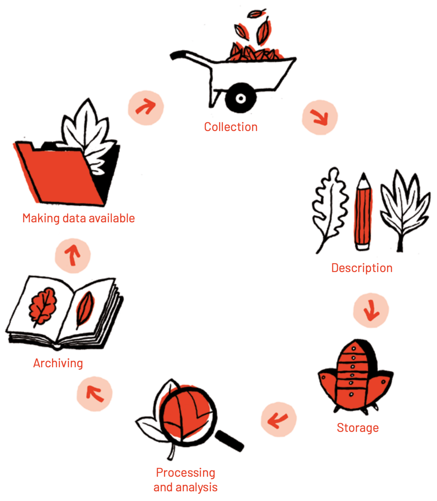

# 데이터를 공개하는 것과 쓸 수 있게 만드는 것은 다르다

_국가연구데이터법이 연 길과, AI-Ready 데이터까지 남은 거리_

## Executive Summary

> [!callout]
> 2026년 6월, 국가연구데이터법이 공포됐다. 국가 연구개발 과제에서 나온 연구데이터를 처음으로 법의 대상으로 끌어올린 법이다. 그동안 연구데이터는 관리 의무 없이 개별 연구실과 과제 안에 흩어져 있었고, 후속 연구자가 같은 측정을 반복하거나 선행 연구를 검증하지 못하는 일이 잦았다. 새 법은 관리 책임을 분명히 하고, 공개를 원칙으로 삼으며, 통합 플랫폼으로 데이터를 찾을 수 있게 한다. 미국과 EU가 연구데이터를 AI 시대의 핵심 인프라로 다루기 시작한 흐름 위에, 한국도 같은 출발선에 섰다. 이 글은 그 법이 연 길과, 아직 남은 거리를 함께 본다.

> 짚어야 할 거리가 하나 있다. 데이터를 공개하는 것과, 다음 연구자가 그리고 AI가 실제로 쓸 수 있게 만드는 것은 다른 문제다. 여러 실증 연구에서 데이터를 '찾을 수 있는' 비율은 거의 100%에 이르지만, 정작 '다시 쓸 수 있는' 비율은 절반 안팎에 머문다. 메타데이터와 출처, 포맷과 품질이 빠진 데이터는 공개돼 있어도 재현과 재학습의 입력이 되지 못한다. 공개는 출발선이지 도착선이 아니다.

> 그래서 시행까지 남은 1년은 공개 의무를 처리하는 행정이 아니라, 활용 가능한 데이터 기반을 만드는 시간이어야 한다. 공개된 연구데이터가 후속 연구와 산업, 그리고 AI 파이프라인에서 반복 활용되려면 마지막 한 층, 곧 데이터 품질과 메타데이터와 출처를 갖춘 AI-Ready 조건이 채워져야 한다. 이 보고서는 그 마지막 한 층을 데이터 실무의 렌즈로 해설한다.

<!-- stat-card -->
**70%+** — 타인의 실험 재현에 실패한 과학자 — 과학자 1,576명 설문 (Baker, Nature 2016)

<!-- stat-card -->
**100% → 61%** — 발견가능성 대비 재사용성 — COVID-19 연구데이터 FAIR 분석 (2024)

<!-- stat-card -->
**+69%** — 데이터를 공개한 논문의 인용 증가 — 활용이 주는 보상 (Piwowar, 2007)

<!-- stat-card -->
**64% → 86%** — 데이터 품질만 개선했을 때 AI 정확도 — 모델 고정·data-centric AI 경진대회

## 연구데이터, 왜 지금 법이 되었나

논문에는 학술지가 있고, 특허에는 등록 제도가 있다. 둘 다 누가 언제 무엇을 만들었는지, 어떻게 보존하고 인용할지를 규정하는 틀을 갖췄다. 그런데 그 논문과 특허를 떠받친 원천, 곧 실험과 관측에서 나온 연구데이터에는 그런 틀이 없었다. 국가 연구개발 과제에서도 연구데이터를 어떻게 보존하고 누가 관리하는지에 대한 의무 자체가 없었고, 부처와 기관과 연구자의 재량에 맡겨져 있었다. 표준이 없으니 데이터는 과제가 끝나는 순간 흩어졌다.

흩어진 데이터의 비용은 시간이 지날수록 커진다. 한 추적 연구는 논문 출판 이후 원본 데이터가 남아 있을 확률이 매년 약 17%씩 떨어진다고 보고했다. 깨진 이메일 주소, 사라진 저장장치, 떠난 연구원이 쌓이면서 5년, 10년이 지난 데이터는 사실상 복원이 어려워진다. 그 결과 후속 연구자는 이미 측정된 값을 다시 측정하고, 검증하려던 선행 연구의 근거에 접근하지 못한 채 같은 시행착오를 반복한다.

역설은 투자 규모에 있다. 2026년 한국의 정부 연구개발 예산은 35.3조 원으로 역대 최대이며, 전년보다 19.3% 늘었다. 국내총생산 대비 연구개발 투자 비율은 4.96%로 OECD 2위 수준이다. 그만큼 막대한 공적 자금이 데이터를 생산하지만, 그 산출물을 체계적으로 모으고 다시 쓰게 만드는 장치는 그동안 비어 있었다. 국가연구데이터법은 바로 이 빈자리를 겨냥한다.

*▲ 연구데이터 생애주기 — 수집·기술·저장·처리·아카이빙·공개 여섯 단계. 각 단계를 체계적으로 설계해야 데이터가 후속 연구와 AI 파이프라인에서 재사용될 수 있다. | Source: [Wikimedia Commons (CC BY)](https://commons.wikimedia.org/wiki/File:Data_management_-_The_Passport_For_Open_Science_10.png)*

> [!callout]
> 한국은 이미 국가연구데이터플랫폼(DataON)을 통해 외부 저장소 연계를 포함해 약 650만 건의 데이터셋을 집계한다. 다만 이 가운데 상당수가 특정 기관 한 곳에 크게 편중돼 있고, 국내 디지털 아카이브의 FAIR 준수 점수는 평균 50점대(100점 만점)에 머문다는 실증 평가도 있다. 양은 쌓였지만 품질과 활용성은 아직 과제로 남아 있다는 뜻이다.

## 법의 세 기둥 — 책임, 공개, 그리고 길

새 법의 골격은 세 개의 기둥으로 읽을 수 있다. 각 기둥의 의미는 조문 그 자체가 아니라, 그것이 연구 현장의 데이터 실무를 어떻게 바꾸는가에 있다.

### 2.1. 관리 책임이 분명해진다

국가연구개발과제를 수행한 연구개발기관은 생산된 연구데이터에 대한 권리를 가지고, 이를 체계적으로 관리할 의무를 진다. 과제 단계에서 연구데이터관리계획(DMP)을 작성하고 제출하는 절차도 들어온다. 이는 연구자 한 사람에게 행정 부담을 떠넘기는 장치가 아니라, 연구자가 만든 데이터를 기관과 국가가 함께 보존하고 다음 연구자가 신뢰하고 쓸 수 있도록 표준과 절차를 갖추자는 설계다. 연구자 입장에서는 과제가 끝난 뒤 데이터를 어디까지 보존하고 제출하고 공개해야 하는지를 미리 예측할 수 있게 된다.

*▲ 연구 과제 생애주기와 오픈사이언스 — 기획부터 종료까지 각 단계에서 DMP 작성·갱신·데이터 공개 절차가 이어진다. EU 호라이즌 유럽이 의무화한 방식과 같은 구조다. | Source: [Wikimedia Commons, GTSO-Couperin 2020 (CC BY)](https://commons.wikimedia.org/wiki/File:Open_Science_into_projects.png)*

### 2.2. 공개가 원칙이 되고, 보호는 예외로 정해진다

연구데이터는 공개를 원칙으로 하되, 영업비밀이나 제3자의 권리, 국가안보처럼 보호가 필요한 데이터는 기간을 정해 비공개할 수 있다. 무엇을 공개해야 하고 어떤 경우 보호받을 수 있는지가 규칙으로 정해지면, 연구자는 공개 여부를 예측할 수 있고 이용자는 출처 표시와 비용 부담 기준에 따라 데이터를 책임 있게 활용할 수 있다. 이는 EU가 오래 다듬어 온 "가능한 한 개방하고, 필요한 만큼 보호한다"는 원칙과 같은 구조다.

### 2.3. 데이터를 찾는 길이 열린다

공개되는 연구데이터는 국가연구데이터통합플랫폼이나 분야별 전문플랫폼에 등록·연계되어, 연구자가 소재를 확인하고 접근할 수 있게 된다. "어디에 있는지 몰라 못 쓰는 데이터"를 줄이는 것이다. 특히 대형 장비, 장기 관측, 우주, 지구과학처럼 다시 만들어 내는 비용이 큰 데이터일수록 한 번 잘 모아 공유했을 때의 효과가 크다. 한 해의 기후 관측값이나 입자 충돌 데이터는 그 시점이 지나면 같은 값을 다시 얻을 수 없기 때문이다.

법의 취지
                            이 법은 논문이나 특허로 이어진 '성공한 성과'의 데이터만을 대상으로 하지 않는다. 연구 결과를 검증하고 재현하는 데 필요하다면, 시행착오와 실패의 과정에서 나온 데이터도 중요한 연구 자산으로 본다. 후속 연구자가 거기서 새로운 출발점을 찾을 수 있기 때문이다.

## 세계는 연구데이터를 인프라로 본다

한국의 법은 진공 속에서 나온 것이 아니다. 주요국은 이미 연구데이터를 AI 시대의 연구 경쟁력을 떠받치는 기반 시설로 다루기 시작했다. 두 가지 흐름이 대표적이다.

### 3.1. 미국 — 데이터를 슈퍼컴퓨터·AI와 잇는 제네시스 미션

미국은 2025년 11월 행정명령으로 '제네시스 미션(Genesis Mission)'을 출범시켰다. 에너지부(DOE)가 주도해 연방정부의 과학 데이터셋과 슈퍼컴퓨팅 자원, AI 모델을 하나의 플랫폼으로 연계하는 구상이다. 17개 국립연구소와 약 4만 명의 인력이 동원되며, 10년 안에 미국 과학·공학의 생산성과 영향력을 2배로 끌어올려 에너지, 보건, 첨단소재, 핵융합, 우주, 양자 같은 전략 분야의 난제를 풀겠다는 목표를 내걸었다. 흥미로운 점은 이 구상의 한 축이 명시적으로 '다출처 데이터셋의 통합'이라는 데 있다. 데이터를 모으는 일 자체가 국가 전략의 출발점으로 다뤄진다.

### 3.2. EU — 호라이즌 유럽과 FAIR의 제도화

EU는 2021년부터 2027년까지 약 955억 유로(중간검토 후 약 935억 유로)를 투입하는 '호라이즌 유럽'을 통해, 연구과제에 데이터관리계획 수립을 요구하고 데이터가 발견·접근·상호운용·재사용될 수 있도록 의무화한다. 연구데이터는 신뢰할 수 있는 저장소에 기탁하고, "가능한 한 개방하고, 필요한 만큼 보호한다"는 원칙을 따른다. 이 원칙의 뿌리에는 2016년 발표된 FAIR 원칙이 있다. FAIR는 데이터가 Findable(찾을 수 있고), Accessible(접근 가능하고), Interoperable(상호운용되고), Reusable(재사용 가능해야) 한다는 국제 기준으로, 오늘날 거의 모든 연구데이터 정책의 공통 언어가 됐다.

세 지역의 접근을 거버넌스, 예산, 핵심 원칙으로 나란히 놓으면 한국 법이 어디에 서 있는지 드러난다.

*▲ FAIR 원칙 — Findable(찾을 수 있고), Accessible(접근 가능하고), Interoperable(상호운용되고), Reusable(재사용 가능). 2016년 Wilkinson et al.이 제안해 오늘날 연구데이터 정책의 공통 언어가 됐다. | Source: [Wikimedia Commons (CC0)](https://commons.wikimedia.org/wiki/File:FAIR_data_principles.jpg)*

| 항목 | 한국 국가연구데이터법 | 미국 제네시스 미션 | EU 호라이즌 유럽·EOSC |
| --- | --- | --- | --- |
| 형식 | 법률 (2026 공포, 2027 시행) | 행정명령 (2025.11) | 연구지원 프로그램 + 정책 |
| 규모·예산 | 2026 정부 R&D 35.3조 원 | 17개 국립연구소, 약 4만 명 동원 | 약 €95.5B (2021–2027) |
| 핵심 장치 | 관리 의무·DMP·통합/전문플랫폼 | 데이터셋·슈퍼컴퓨팅·AI 연계 플랫폼 | DMP 의무·신뢰 저장소 기탁·FAIR |
| 공개 원칙 | 공개 원칙 + 보호 예외(기간 지정) | 연방 데이터 통합·활용 강조 | "가능한 한 개방, 필요한 만큼 보호" |
| 지향 | 흩어진 데이터의 자산화 | 10년 내 과학 생산성 2배 | 오픈사이언스·재사용성 |

> [!callout]
> 형식은 달라도 방향은 하나다. 연구데이터를 연구의 부산물이 아니라 다음 발견을 여는 기반 시설로 본다는 것이다. 한국 법은 이 흐름 위에 놓이며, '관리 의무를 신설했다'는 점에서 제도적 기초를 마련했다. 다만 제도가 만든 것은 데이터를 공개하는 길이지, 그 데이터를 곧바로 쓸 수 있는 상태는 아니다. 그 차이가 다음 장의 주제다.

## 공개되었다고 쓸 수 있는 건 아니다

FAIR 원칙의 네 글자는 똑같이 어려운 네 가지 과제가 아니다. 실제 측정을 해 보면, 앞의 둘(Findable, Accessible)은 비교적 잘 지켜지지만 뒤의 둘, 특히 마지막 R(Reusable)이 가장 취약하다. COVID-19 연구데이터를 FAIR 기준으로 분석한 한 메타 연구는 이 격차를 선명하게 보여준다.

Findable100%

Accessible21.5%

Interoperable46.7%

Reusable61.3%

▲ COVID-19 연구데이터의 FAIR 차원별 충족 비율 (moderate 이상 기준). 찾을 수는 있어도 다시 쓸 수 있는 비율은 절반대에 머문다. 출처: COVID-19 FAIR meta-research (2024).

'찾을 수 있는' 데이터와 '다시 쓸 수 있는' 데이터 사이의 이 간극은 단순한 통계가 아니라 과학 전체가 앓아 온 증상과 맞닿아 있다. 2016년 학술지 Nature가 과학자 1,576명을 설문한 결과, 70% 이상이 다른 연구자의 실험을 재현하려다 실패한 경험이 있다고 답했고, 절반 이상은 자기 자신의 실험조차 재현하지 못했다. 제약사 암젠이 전임상 암 연구의 '랜드마크' 논문들을 재현하려 했을 때는 53편 중 6편, 약 11%만 성공했다. 데이터가 있어도 그것을 둘러싼 문서와 출처와 품질이 없으면, 결과는 검증되지 않는다.

이 손실은 한 연구실 안에서 끝나지 않는다. 유럽연합은 연구데이터가 FAIR하지 않아 회원국 경제가 매년 최소 102억 유로를 잃는다고 추산했다. 같은 데이터를 중복으로 다시 측정하고, 어디 있는지 찾아 헤매고, 쓰려고 다시 가공하는 데 드는 비용을 합한 값이다. 공개되지 못하거나 공개돼도 쓸 수 없는 데이터의 비용은, 이렇게 국가 단위의 낭비로 쌓인다.

반대로, 데이터를 제대로 갖춰 공유하면 보상은 크다. 데이터를 함께 공개한 논문은 그렇지 않은 논문보다 인용이 약 69% 더 많았다는 연구가 있고, 인간게놈프로젝트처럼 공개를 전제로 설계된 데이터는 투입 대비 막대한 경제·과학 파급을 만들어 낸 사례로 꼽힌다(추정치이며 산정 방법에는 논쟁이 있다). 속도가 만드는 가치도 있다. 2020년 1월, 중국 연구진이 정체불명의 코로나바이러스 게놈을 확보한 지 48시간이 채 지나지 않아 전체 염기서열을 GISAID에 공개했고, 전 세계 연구자들은 바이러스 실물 없이도 곧바로 백신과 진단법 개발에 착수할 수 있었다. 같은 데이터라도 어떻게 관리하느냐에 따라 '사라지는 비용'과 '되돌아오는 가치'로 갈린다.

#### 관리하지 않을 때의 비용

70%+타인 실험 재현 실패 (Baker, 2016)

17% / 년출판 후 원본 데이터 소실 확률 (Vines, 2014)

€102억 / 년FAIR 미준수로 EU가 잃는 최소 비용 (EC, 2018)

#### 제대로 할 때의 가치

+69%데이터 공개 논문의 인용 증가 (Piwowar, 2007)

48시간바이러스 게놈 공개 후 백신·진단 착수까지 (GISAID, 2020)

64% → 86%데이터 품질만 개선했을 때 AI 정확도 상승

> [!callout]
> 결론은 단순하다. 공개는 필요조건이지 충분조건이 아니다. 데이터가 사라지지 않게 하고, 찾을 수 있게 하고, 다시 쓸 수 있게 하고, 검증할 수 있게 만드는 일은 각각 다른 작업이다. 국가연구데이터법은 이 가운데 '사라지지 않게'와 '찾을 수 있게'에 강력한 제도적 동력을 부여한다. 남은 두 가지, '다시 쓸 수 있게'와 '검증할 수 있게'는 데이터의 품질에 달려 있다.

## AI 시대의 연구데이터 — AI-Ready 조건과 남은 1년

AI 시대에는 '다시 쓸 수 있는 데이터'의 기준이 한 단계 더 올라간다. 사람이 읽고 해석할 수 있는 정도를 넘어, 기계가 별도 가공 없이 학습과 검증에 곧바로 투입할 수 있어야 하기 때문이다. 이 상태를 흔히 'AI-Ready 데이터'라고 부른다. 공개 데이터가 누구나 접근 가능한 상태를 뜻한다면, AI-Ready 데이터는 일관된 메타데이터와 라벨, 출처와 품질을 갖춰 AI 파이프라인에 바로 들어갈 수 있는 상태를 뜻한다.

이 기준은 추상적인 구호가 아니라 국제표준으로 성문화되고 있다. 2024년부터 발행된 ISO/IEC 5259 시리즈는 '분석과 머신러닝을 위한 데이터 품질'을 다루며, 데이터 품질의 측정 항목과 프로세스, 거버넌스를 표준으로 정의한다. 같은 맥락에서, AI 연구의 무게중심도 모델에서 데이터로 옮겨 가고 있다. 한 data-centric AI 경진대회에서는 모델 구조를 그대로 고정하고 데이터셋만 다듬었을 때, 곧 잘못 붙은 라벨을 고치고 빠진 경우를 채워 넣었을 때 정확도가 64.4%에서 85.8%로 올랐다. 데이터 품질을 개선하는 일이 데이터를 3배 더 모으는 것과 맞먹는 효과를 냈다는 보고도 있다.

그렇다면 공개될 연구데이터가 AI-Ready 상태가 되려면 무엇이 필요한가. 최소한 다음 다섯 가지가 데이터에 함께 따라와야 한다.

- ✓**메타데이터** — 무엇을, 언제, 어떤 조건에서 측정했는지를 기계가 읽을 수 있는 형식으로
- ✓**출처와 이력** — 데이터가 어디서 왔고 어떤 가공을 거쳤는지의 추적 가능성
- ✓**라벨과 구조** — 학습·검증에 쓸 수 있도록 정리된 형식과 일관된 정의
- ✓**포맷의 상호운용성** — 특정 도구에 갇히지 않고 다른 시스템에서 읽히는 표준 포맷
- ✓**품질 검증** — 결측·이상치·불일치를 점검하고 그 결과를 함께 남기는 것

*▲ 연구데이터 흐름 — 수집·분석·시각화 이후 안전 전송 또는 오픈 접근으로 공유되고, 아카이브에 보존된다. AI-Ready 데이터가 되려면 이 흐름의 각 단계에서 메타데이터와 품질 검증이 함께 쌓여야 한다. | Source: [Wikimedia Commons (CC BY-SA)](https://commons.wikimedia.org/wiki/File:Data_lifecycle.svg)*

한국의 현재 위치를 다시 보면 과제가 분명해진다. DataON은 약 650만 건을 집계하지만 특정 기관에 편중돼 있고, 국내 디지털 아카이브의 FAIR 평균 점수는 50점대다. 한 분야 연구에서는 공개된 데이터 가운데 머신러닝이 곧바로 이해할 수 있는 비율이 1%에 그쳤다는 보고도 있었다(단일 분야 사례이므로 전 분야로 일반화하기는 어렵다). 양적 토대는 갖춰졌으나, AI-Ready로 가는 마지막 한 층은 아직 채워야 한다는 신호다.

> [!callout]
> 법 시행까지 남은 1년은, 그래서 분야별 데이터 특성과 연구 현장의 부담을 함께 고려해 '과도한 행정절차'가 아니라 '연구를 돕는 관리 체계'를 설계하는 시간이어야 한다. 연구자가 신뢰할 수 있는 규칙, 기관이 실행할 수 있는 절차, 산업계가 활용할 수 있는 접점이 마련될 때, 공개된 데이터는 비로소 AI가 학습하고 후속 연구가 재현하는 자산이 된다.

## 페블러스가 이 주제를 보는 자리

페블러스는 법령을 해설하는 자리에 서지 않는다. 법제처와 과기정통부가 법의 권위 있는 해석자라면, 우리가 줄곧 다뤄 온 문제는 그 법이 연 길의 끝에서 시작된다. 공개된 연구데이터가 후속 연구와 AI 파이프라인에서 실제로 쓰이려면 넘어야 하는 마지막 한 층, 곧 데이터 품질과 메타데이터와 출처의 문제다.

### 왜 이 간극이 우리의 문제영역인가

data-centric AI가 거듭 확인한 명제는 "모델 성능의 상한을 데이터 품질이 결정한다"는 것이다. 저품질이거나 문서가 없는 데이터로 학습한 모델은 잘못된 내부 표현을 형성한다. 공개될 공공 연구데이터는 잠재적인 학습·검증 데이터원이지만, 메타데이터와 라벨과 품질 검증이 빠진 채로는 AI에 곧바로 투입될 수 없다. 이것은 페블러스가 일관되게 말해 온 "들어가는 데이터가 곧 모델이 보는 세계"라는 논지를, 공공 데이터 정책의 영역으로 확장한 것이다.

### 현장에서의 함의

법이 시행되면 AI 스타트업과 연구기관은 곧 풀리는 공공 연구데이터를 데이터원으로 검토하게 된다. 이때 "어떤 데이터셋이 실제로 AI-Ready인가, 무엇을 보강해야 쓸 수 있는가"를 판단하는 진단·정제 역량이 경쟁력이 된다. 연구개발기관 입장에서도 '제출·공개 의무'를 '활용 가능한 자산화'로 바꾸려면 메타데이터와 품질을 점검하는 도구가 필요하다. 공개 의무의 다음 단계가 곧 데이터 품질의 실수요가 되는 셈이다.

### 앞으로 던질 질문들

공개된 연구데이터의 품질을 누가, 어떤 기준으로 진단할 것인가. AI-Ready 여부를 가르는 최소 요건은 분야마다 어떻게 달라지는가. 시행착오와 실패의 데이터를 자산으로 만드는 일은 품질의 관점에서 무엇을 더 요구하는가. 이 질문들은 한 편의 보고서로 닫히지 않는다. 페블러스는 이어지는 글에서 FAIR의 재사용성, ISO 5259, AI-Ready 데이터의 조건을 데이터 실무의 언어로 더 깊이 풀어 갈 계획이다.

> [!callout]
> 국가연구데이터법은 연구자가 생산한 데이터가 사라지지 않게 하고, 정당한 권리와 보호를 전제로 더 넓게 쓰이도록 하는 법이다. 연구자는 더 빨리 다음 질문으로 나아가고, 국가는 이미 투자한 데이터의 가치를 더 오래, 더 넓게 확산시킬 수 있다. 그 출발선 위에서, 공개를 활용으로 바꾸는 마지막 한 층을 채우는 일이 우리가 선 자리다.

## 참고문헌

### 학술 — FAIR·재현성·data-centric AI·데이터 보존

- 1.Wilkinson, M.D. et al. "[The FAIR Guiding Principles for scientific data management and stewardship](https://www.nature.com/articles/sdata201618)." _Scientific Data_ 3:160018, 2016.
- 2.Baker, M. "[1,500 scientists lift the lid on reproducibility](https://www.nature.com/articles/533452a)." _Nature_ 533, 452–454, 2016. (n=1,576)
- 3.Begley, C.G. & Ellis, L.M. "[Raise standards for preclinical cancer research](https://www.nature.com/articles/483531a)." _Nature_ 483, 531–533, 2012.
- 4.Piwowar, H.A., Day, R.S. & Fridsma, D.B. "[Sharing Detailed Research Data Is Associated with Increased Citation Rate](https://pmc.ncbi.nlm.nih.gov/articles/PMC1817752/)." _PLoS ONE_ 2(3):e308, 2007.
- 5.Vines, T.H. et al. "[The Availability of Research Data Declines Rapidly with Article Age](https://pubmed.ncbi.nlm.nih.gov/24361065/)." _Current Biology_ 24(1):94–97, 2014.
- 6."[COVID-19-related research data availability and quality according to the FAIR principles](https://www.ncbi.nlm.nih.gov/pmc/articles/PMC11573139/)." PMC11573139, 2024. (Findable 100% vs Reusable 61.3%)
- 7."[Dental Research Data Availability and Quality According to the FAIR Principles](https://www.ncbi.nlm.nih.gov/pmc/articles/PMC9516597/)." PMC9516597, 2022. (ML-usable 1%)
- 8.Mazumder, M. et al. "[DataPerf: Benchmarks for Data-Centric AI Development](https://arxiv.org/abs/2207.10062)." arXiv:2207.10062, 2022. (64.4%→85.8%)
- 9.Ng, A. — IEEE Spectrum. "[Andrew Ng: Unbiggen AI](https://spectrum.ieee.org/andrew-ng-data-centric-ai)." 2022. (data-centric AI, 품질개선 ≈ 3배 수집)
- 10."[A Data-Centric Approach to improve performance of deep learning models](https://www.nature.com/articles/s41598-024-73643-x)." _Scientific Reports_, 2024.

### 정책·통계 — 법·정부·국제기구·표준

- 11.사이드뷰. "[국가연구데이터법 국회 본회의 통과… 2027년 시행](https://www.sideview.co.kr/news/articleView.html?idxno=16788)." 2026.
- 12.과학기술정보통신부 / 정책브리핑. "[2026년 정부 R&D 예산 35.3조원 확정](https://www.korea.kr/briefing/policyBriefingView.do?newsId=156721759)." 2025-08-22.
- 13.The White House. "[Launching the Genesis Mission](https://www.whitehouse.gov/presidential-actions/2025/11/launching-the-genesis-mission/)" (Executive Order, 2025-11-24); Federal Register FR Doc 2025-21665.
- 14.U.S. Department of Energy. "[Energy Department Launches 'Genesis Mission'](https://www.energy.gov/articles/energy-department-launches-genesis-mission-transform-american-science-and-innovation)." 2025.
- 15.European Commission. "[Horizon Europe](https://research-and-innovation.ec.europa.eu/funding/funding-opportunities/funding-programmes-and-open-calls/horizon-europe_en)." (€95.5B; 중간검토 후 약 €93.5B)
- 16.ISO/IEC 5259-1:2024. "[Artificial intelligence — Data quality for analytics and machine learning (ML)](https://www.iso.org/standard/81088.html)." (Part 1–4: 2024 / Part 5: 2025)
- 17.PwC EU Services / European Commission. "[Cost of not having FAIR research data](https://op.europa.eu/en/publication-detail/-/publication/d375368c-1a0a-11e9-8d04-01aa75ed71a1/language-en)." 2018. (최소 €10.2 billion/년 ≈ 102억 유로)
- 18.KISTI. "[국가연구데이터플랫폼(DataON) 데이터 현황](https://dataon.kisti.re.kr/datause/datauseStatus.do)." (2026-06-11 기준 약 650만 건)
- 19.한국기록관리학회지. "[FAIR 데이터 원칙을 적용한 국내 디지털 아카이브 평가와 개선 방향](https://koreascience.kr/article/JAKO202405132581019.pub)." 2024. (평균 50.43/100)
- 20.OECD. "[Enhancing Access to and Sharing of Data](https://www.oecd.org/en/publications/enhancing-access-to-and-sharing-of-data_276aaca8-en)." 2019.

### 데이터 가치·개방 사례

- 21.Battelle / Tripp, S. & Grueber, M. "[Economic Impact of the Human Genome Project](https://www.battelle.org/docs/default-source/misc/battelle-2011-misc-economic-impact-human-genome-project.pdf)." 2011/2013. (ROI 추정, 방법론 논쟁 병기)
- 22.GISAID. "[Global data sharing initiative](https://gisaid.org/)." (게놈 공개 48시간, 누적 약 1,500만 시퀀스)
- 23.아주경제. "[국가연구데이터법 관련 보도](https://www.ajunews.com/view/20260610132746606)." 2026-06-10.
