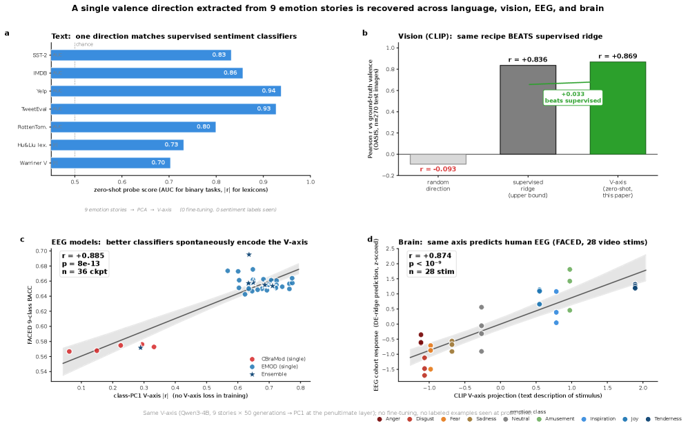
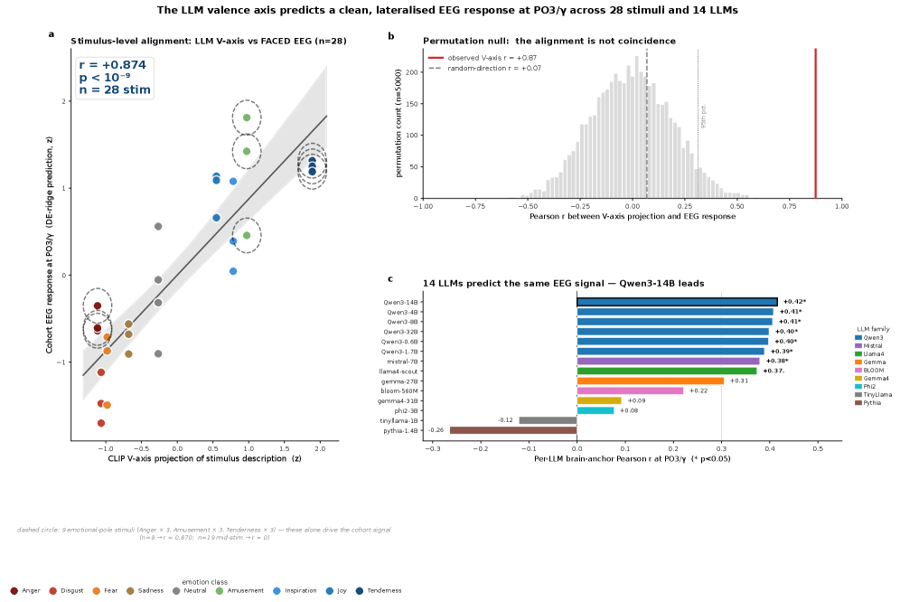
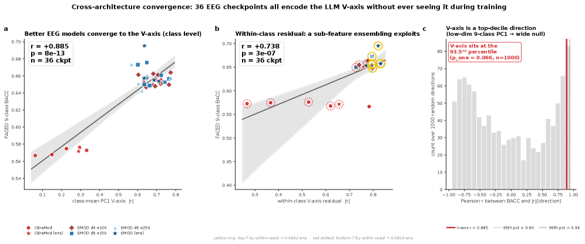
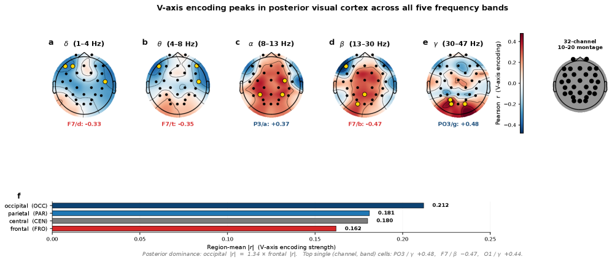
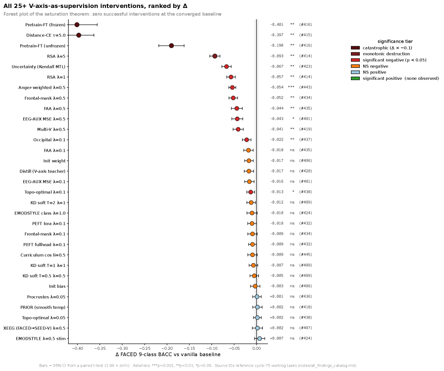

# LLMs Draw Emotion on the Same Axis as the Human Brain

_The same emotional axis appeared across 14 LLMs and the EEG of 123 people_

## Executive Summary

> [!callout]
> "AI understands emotion" has long been closer to marketing than to measurement. Then, in late May 2026, a paper gave that intuition its first measurable footing in neuroscience. The emotional coordinate axis that a modern large language model (LLM) draws inside itself, and the emotional axis of brainwaves (EEG) recorded from a person's scalp while they watch emotionally charged video, **point in the same direction**. This article pins down exactly what that finding is, and just as carefully, what it is not.

> The researchers extracted a one-dimensional "valence axis" from an LLM using just nine emotion-evoking stories, then laid that axis directly against human EEG. With a CLIP-text construction, it predicted the emotional polarity of each stimulus at r = +0.87 (p < 10⁻⁹). The more striking part is that the convergence was never forced. Thirty-six EEG classifiers trained only to label emotions rediscovered the same direction on their own, without ever being shown the axis. And when the team tried to teach that axis harder, performance did not improve — it fell, in 16 of 25 strategies.

> We work through the shared axis (Sections 2 and 3), the paradox where teaching more makes things worse — "Saturation Regularity" (Section 4), and how to read its implications through the lens of data quality (Section 5). Section 6 is just as honest about what the finding never claims: that emotional experience or consciousness is the same. New to the thread? You may want to start with Part 1, our deep dive on [Anthropic's emotion vectors](/report/anthropic-emotions-report/en/).

### The Shared Axis in Numbers

Every figure below is discussed in the body. Source: Radwan et al. (2026), _A Shared Valence Axis Across Modern LLMs and Human EEG_ (arXiv:2606.00129).

<!-- stat-card -->
**14 LLMs** — Same axis, model-agnostic — From 560M to 32B, different LLMs drew essentially the same emotional axis

<!-- stat-card -->
**r = +0.87** — LLM axis → human EEG — The LLM's axis predicts per-stimulus emotional polarity in people (p < 10⁻⁹)

<!-- stat-card -->
**16 / 25** — Strategies that hurt — Of 25 alignment strategies that taught the axis harder, 16 lowered performance (0 improved it)

<!-- stat-card -->
**+10.5%** — Emotion-decoding SOTA — FACED classification improved from the prior best 0.6287 to 0.6948

## What "Understanding Emotion" Really Means

The phrase "AI understands emotion" has always wobbled between two meanings. One is the statistical fact that a model can sort emotion words out of text. The other is a far heavier claim: that a human-like emotional structure actually exists inside the model. The first was settled long ago. The second always stayed a metaphor, because you cannot tell what lives inside a model by reading only its output.

The paper posted to arXiv on May 28, 2026 by Radwan, Liu, Haydarov, Fu, and Elhoseiny — [A Shared Valence Axis Across Modern LLMs and Human EEG](https://arxiv.org/abs/2606.00129) (arXiv:2606.00129) — brought outside evidence to that heavier claim for the first time. The outside evidence is the human brain. More precisely, it is the EEG picked up from a person's scalp as they watch video that evokes emotion. What the paper shows is that the emotional coordinate axis inside an LLM and the emotional axis of human EEG point in the same mathematical direction.

Why is this new? Researchers had looked directly inside an LLM's emotional representations before. Anthropic's work on emotion vectors, which we covered as Part 1 of this series, is the clearest example: Anthropic located emotion-concept vectors inside Claude and showed they steer behavior. But that work stayed within the model. This paper adds that the representation is shared with a human brain outside the model. Measuring a model's internal representation and human EEG with the same ruler, and comparing them directly, is what had never been done before.

The two studies sit next to each other cleanly. If Part 1 established that an emotional structure exists inside the LLM, Part 2 takes the next step: that structure shares a direction with the emotional structure of the human brain.

| Study | What it showed | Where the evidence lives |
| --- | --- | --- |
| Part 1 — Anthropic emotion vectors (arXiv:2604.07729, Apr 2026) | Emotion-concept vectors inside an LLM causally steer behavior | Inside the model (interpretability) |
| Part 2 — Shared valence axis (arXiv:2606.00129, May 2026) | That emotional axis points the same way as the human EEG axis | Model ↔ human brain (external comparison) |

Note: the two papers form a series, but they report different correlation figures. Part 1's r=0.81 is not the subject of this article ([see FAQ 4](#faq)).

> [!callout]
> The key word is location. "Understanding emotion" has moved from the statistics of output to the structure of an internal representation space, and then to the claim that this structure is shared with the human brain. One caveat holds throughout this article: "shared" means the directions in representation space line up, in a mathematical sense. It does not mean the emotional experience is the same. Section 6 nails that distinction down again.

## V-axis, an Axis Pulled From Nine Sentences

The paper starts from a deliberately simple tool it calls the "V-axis," or valence axis: a single one-dimensional direction running from positive (+) to negative (−). What is striking is how little raw material goes into building it. The researchers used one short story for each of the nine emotion classes in the FACED dataset (amusement, inspiration, joy, tenderness, anger, fear, disgust, sadness, neutral) — nine emotion-evoking stories in all.

The extraction procedure goes like this. To stabilize the representations, each story is rewritten 50 times by an LLM. For each sentence, the activation of the final token is pulled from the second-to-last layer. Averaging within each emotion leaves nine centroids; running principal component analysis (PCA) over them yields a first principal component (PC1), and that is the V-axis. The only manual step is fixing the sign so that joy lands on the positive (+) side.

| Step | Operation |
| --- | --- |
| 1. Stories | One short emotion-evoking story per emotion class (9 total) |
| 2. Paraphrase | 50 LLM-generated variants per story (representation stabilization) |
| 3. Activation | Final-token activation from the second-to-last layer |
| 4. Centroids | Per-class average → 9 emotion centroids |
| 5. PCA | PCA over the 9 centroids → PC1 = V-axis (joy on the + side) |

The first thing to doubt is whether an axis built this way works at all. Can a single direction, pulled out with no extra training, be of any use for actual emotion classification? The result was unexpected. On movie-review sentiment (SST-2), the axis scored AUC 0.832 with no supervised training — effectively level with a model supervised on 55,000 examples (0.837). Without a single label, one direction extracted from nine stories did that much.

Nor was it a lucky outcome from one setup. Swapping the extraction backbone for a sentence-embedding model (SBERT) or a RoBERTa fine-tuned on natural language inference left the discriminative power intact — the RoBERTa version was actually sharper, at AUC 0.912. Run the same procedure on the visual representations of CLIP, which handles images rather than text, and the valence direction survived at r = 0.869. Change the extraction model, change the medium from words to pictures, and the same direction kept resurfacing.

*▲ One valence axis is recovered across language models, human EEG, and EEG classifiers alike (paper Figure 1). | Source: [arXiv:2606.00129](https://arxiv.org/html/2606.00129v1)*

### 2.1. Fourteen Models, Nearly the Same Axis

More important is that the axis is not the quirk of one model. The researchers repeated the procedure across 14 LLMs: six sizes of the Qwen3 family (from 560M to 32B), plus Mistral-7B, Llama-4-Scout, the Gemma family, and others. Within the Qwen3 family the axis matched almost perfectly across sizes (r = +0.995), and even across different families the directions overlapped significantly. A direction that recurs regardless of model architecture suggests the axis is not an accident but a signal latent in the data.

Not every model, though. In older models like Pythia, TinyLlama, and BLOOM, the axis fell below the detection threshold. The shared valence axis is, in other words, a phenomenon specific to modern large LLMs — a limit we return to in Section 6. Now we take this single axis and lay it against the human brain.

## The Brain Draws the Same Axis

The EEG side is the FACED dataset: 123 healthy university students recorded on 32-channel EEG while watching 28 emotion-evoking video clips. Among public emotional-EEG datasets, it is the cohort with the most subjects. The researchers took the V-axis straight from the LLM and, with a single linear projection, tracked the emotional polarity each stimulus produced.

The result is the headline. A V-axis built from CLIP-text predicted per-stimulus valence at r = +0.87 (p < 10⁻⁹); with the primary model, a Qwen3-4B axis, it reached r = +0.80 (p < 10⁻⁵). An emotional map a language model drew from text alone matched the polarity of brain signals recorded while people watched video that closely.

*▲ The emotional coordinate an LLM drew from text (x-axis) aligns with the human EEG valence projection (y-axis) per stimulus at r=+0.87 (paper Figure 3). | Source: [arXiv:2606.00129](https://arxiv.org/html/2606.00129v1)*

### 3.1. Thirty-Six Classifiers That Found the Same Direction, Unprompted

But the real weight comes from elsewhere. If you deliberately inject an axis, a high correlation is hardly surprising. So the researchers prepared 36 EEG classifiers trained on emotion classification alone, never once shown the V-axis. When they measured how strongly these classifiers encoded the V-axis direction inside their own representations, that strength moved together with classification accuracy (balanced accuracy, BACC) at r = +0.885 (p = 7.8×10⁻¹³) — the 93.5th percentile against random directions.

Put plainly: the better an EEG classifier was at reading emotion, the more sharply it drew the same valence direction as the LLM, without anyone telling it to. The same axis recurred spontaneously in the LLM, in human EEG, and in separate classifiers decoding that EEG. This convergence-without-coercion is the paper's strongest card.

*▲ Across 36 EEG classifiers never shown the V-axis, the more accurate ones encoded the same valence direction more strongly (paper Figure 2). | Source: [arXiv:2606.00129](https://arxiv.org/html/2606.00129v1)*

They also checked whether the axis fit only one dataset. Taking the very V-axis derived from FACED and carrying it over to SEED-V, an entirely different EEG dataset, they had it rank the valence of five emotions there — and the ranking agreed at r = +0.96. The same ordering reproduced on data with different subjects and different stimuli, which signals that the axis was not sculpted to fit a single cohort but holds more broadly.

### 3.2. Where in the Brain Is It Strongest?

You can also ask which scalp regions the axis fits best. The signal was strongest at the occipital lobe (back of the head), weakening through the parietal and central regions and weakest at the frontal lobe. As a single channel, gamma-band activity at PO3, near the occipito-parietal junction, was strongest at r = +0.48.

*▲ Across all five frequency bands, V-axis encoding peaks in the posterior occipital visual cortex (paper Figure 4). | Source: [arXiv:2606.00129](https://arxiv.org/html/2606.00129v1)*

| Brain region | Mean |r| | Note |
| --- | --- | --- |
| Occipital | 0.21 | Strongest |
| Parietal | 0.18 |  |
| Central | 0.18 |  |
| Frontal | 0.16 | Weakest |
| Strongest single channel | PO3 / γ: +0.48 | +0.87 on the 9 high-arousal clips |

Note: the authors state that this occipital dominance reflects the video-stimulus paradigm, and is not a claim against established emotional-EEG theories such as frontal alpha asymmetry (FAA).

That said, this topographic signal swings hard with the stimulus. The same PO3 gamma channel sharpens to r = +0.87 on the nine clips with strong emotional arousal, but on the nineteen mid-intensity clips it drops to r = −0.02, essentially vanishing. A topographic signal read off a channel fixed at the cohort level is a relatively coarse measurement that surfaces mostly under strong emotional contrast. That is a different layer from the section's opening r = +0.87 (CLIP-text), which comes from a single linear projection over all 28 stimuli. The headline correlation and the single-channel topography are the same axis seen at different resolutions, not the same number.

## Saturation Regularity: Teaching More, Performing Worse

So far this matches intuition. If the shared axis is that crisp, then teaching the axis to the model more forcefully ought to raise emotion-decoding performance too. The researchers expected exactly that, and brought 25 alignment strategies to bear: knowledge distillation, representational similarity alignment (RSA), supervised contrastive loss, LoRA adapters, curricula, multi-model ensembles, channel-targeted losses — seven families of methods in all.

The result was the opposite. Of the 25 strategies, the number that significantly improved performance was zero, and 16 significantly hurt it (p < 0.05). The worst, an anger-weighted target, cut balanced accuracy by 0.054. The random directions added as a control barely moved the needle (ΔBACC ≤ ±0.003), which means it was not the act of adding a loss that did the damage, but teaching that particular valence direction harder.

*▲ Of 25 strategies that taught the V-axis harder, zero significantly improved performance and 16 lowered accuracy (paper Figure 13). | Source: [arXiv:2606.00129](https://arxiv.org/html/2606.00129v1)*

> [!callout]
> The authors call this **Saturation Regularity**. Once a model has already reached the target direction through task learning alone (task-only BACC roughly 0.62–0.66 or above), the expected performance change from adding any valence auxiliary loss is zero or below. It is like pouring more water into a glass that is already full.

This is not ordinary overfitting. Overfitting is a model memorizing its training data; saturation is an interaction that arises when task learning and auxiliary supervision aim at the same direction in feature space at the same time. On a weak baseline (BACC ≤ 0.62) the intervention is just noise, but on a strong recipe (BACC ≥ 0.66) the same intervention flips to a statistically significant negative. The same loss can be harmless or harmful depending on the baseline it lands on.

### 4.1. So Where Does the Performance Come From — the Residual Subspace

The answer comes from splitting the LLM features into two orthogonal spaces. One is the "class-mean" space connecting the emotion centroids, where the V-axis lives. The other is the "within-class residual" space holding the fine, individual variation inside a single emotion. The auxiliary loss moved the class-mean component quite a lot (Δ|r| = +0.01 to +0.36), but the residual space that actually carries accuracy barely budged (change ~10⁻⁷). Remove the V-axis direction at inference time and performance dropped (ΔBACC = −0.0157).

In other words, the signal that holds up performance is not in the emotion axis that supervision reaches, but in the residual space that supervision cannot reach. That is why teaching the valence axis harder never lifts performance. The places you can teach are already saturated; the places that matter are out of reach.

Along the way, all this analysis also set a new state of the art on FACED emotion classification. The previous best (EMOD) was 0.6287; by stacking augmentation, distillation, depth expansion, and ensembling in turn, the team reached 0.6948 — a relative gain of +10.5%. The crucial point is that the engine of this gain was not teaching the valence axis, but the accumulation of generic training techniques.

| Stage | Configuration | BACC |
| --- | --- | --- |
| Baseline | EMOD replication | 0.619 |
| + Augmentation | Time jitter, channel dropout, noise | 0.634 |
| + Distillation | LLM prototype knowledge distillation | 0.644 |
| + Depth | Network depth doubled | 0.658 |
| + Ensemble | 10-checkpoint ensemble (final) | 0.6948 |

Note: 0.6948 vs. the prior SOTA EMOD 0.6287 = +10.5%. The gain came from accumulated generic training techniques; none of the 25 strategies that added a valence auxiliary loss improved anything.

The authors' practical recommendation is short and clear: any paper proposing an auxiliary loss should first report whether the receiving baseline is already saturated. The same loss can look harmless on a weak baseline and turn harmful on a strong one.

## Data Shapes the Structure of Emotion

Connect the findings so far in a single line, and a concrete implication appears for data practitioners. The starting point is the convergence-without-coercion from Section 3. That 36 classifiers rediscovered the same valence axis with no instruction points to the possibility that the axis is not the product of a particular architecture but a universal signal latent in the data. What a model learns is what shapes the emotional structure inside it.

Overlay Section 4's Saturation Regularity, and the direction becomes clear. Piling on alignment losses to reshape a model's emotional structure can backfire. The room for improvement is not in the emotion axis that supervision reaches, but in the residual space it cannot reach. And what fills that residual space is, in the end, the fine diversity and balance carried by the training data.

That moves the lever for improvement away from adding more supervision and toward reshaping the data distribution. Diagnosing whether the emotional distribution of training data skews one way, whether a particular affect is under-sampled, whether the fine variation is sufficient — that becomes the same task as diagnosing a model's emotional profile. The value of the training-data diagnosis Pebblous performs with DataClinic finds its neuroscientific footing here. Looking at data quality is, in effect, reading ahead of time what emotional structure a model will come to hold.

> [!callout]
> **Editor's Note.** The argument in this section is not something the paper claims directly. It is Pebblous reading the paper's findings — a signal latent in the data, plus a load-bearing residual subspace — through the lens of data quality. The paper itself does not assert data-causation; it leaves it as an open question (see Section 6). If diagnosing the emotional distribution of training data interests you, [DataClinic](https://dataclinic.pebblous.ai) can be a starting point.

## What It Claims and What It Does Not

Findings like this are easy to overstate. What matters is where the paper itself draws the line — because where those lines fall is what decides how much to trust the result.

### 6.1. Isomorphism of Representation ≠ Emotional Experience or Consciousness

This is the most important limit. The authors are explicit: "probe transfer is direction-existence only, not a neuroscientific claim." What the shared V-axis shows is that a direction in a mathematical representation space lines up — not that the LLM subjectively feels emotion the way a person does, nor that it has consciousness. Isomorphism of representation and identity of experience are entirely different layers.

### 6.2. Correlation ≠ Causation — Two Competing Hypotheses

Why the shared axis arises is still an open question, and two hypotheses compete. Hypothesis A: because the LLM trained on emotion-laden human text, it absorbed the human valence structure — the shared axis is a byproduct of training data. Hypothesis B: systems across modalities (language, vision, EEG) converge on the common statistical structure of reality, a more fundamental phenomenon, and an extension of the Platonic Representation Hypothesis from Huh et al. (2024). The paper does not commit to either. The data reading in Section 5 leans toward Hypothesis A, but leaning is not proof.

### 6.3. Limits of Sample and Reproducibility

- The EEG cohort is 123 university students — a small, age-biased sample, with no Korean speakers included.
- What is shared is the single dimension of valence. Arousal transferred only in the visual modality and failed in text. This is a result confined to the positive–negative axis, not "emotion in general."
- In older LLMs (Pythia, TinyLlama, BLOOM) the axis was not detected. It is a phenomenon limited to modern large models.
- These are the results of a single research team, so independent replication is needed. The authors themselves confine the scope of Saturation Regularity to FACED-9, where a V-axis basis exists.

### 6.4. A Standing Methodological Critique

The broader line of work aligning brain and LLM representations for comparison carries a methodological counterargument too. Hadidi et al. (2025) caution that such alignment may be an artifact of how things are measured. This paper's convergence-without-coercion design (the 36 classifiers) sidesteps part of that critique, but it is worth being clear that brain–AI alignment research is not yet a settled field.

> [!callout]
> To sum up, what the paper claims is a fact about representation space: that modern LLMs and the human brain share the same mathematical direction on a single emotional dimension, valence. What it does not claim are the propositions that "AI feels emotion," that "it is conscious," that "data is the cause of that axis," or that "every emotional dimension is shared." Hold that distinction, and the finding is both genuinely impressive and honest.

## References

### Academic (core)

- 1.Radwan, Y. A., Liu, X., Haydarov, K., Fu, Y., & Elhoseiny, M. (2026). "A Shared Valence Axis Across Modern LLMs and Human EEG: The Saturation Regularity." _arXiv preprint_. arXiv:2606.00129. [arxiv.org/abs/2606.00129](https://arxiv.org/abs/2606.00129)
- 2.Chen, J., et al. (2023). "A large finer-grained affective computing EEG dataset (FACED)." _Scientific Data_. doi:10.7303/syn50614194.
- 3.Liu, W., et al. (2021). "SEED-V: A Multimodal EEG Dataset for Emotion Recognition." BCMI Lab, Shanghai Jiao Tong University.
- 4.Huh, M., Cheung, B., Wang, T., & Isola, P. (2024). "Position: The Platonic Representation Hypothesis." _ICML 2024_, PMLR 235:20617–20642. arXiv:2405.07987. [arxiv.org/abs/2405.07987](https://arxiv.org/abs/2405.07987)
- 5.Anthropic (2026). "Emotion Concepts and their Function in a Large Language Model." _arXiv preprint_. arXiv:2604.07729. [arxiv.org/abs/2604.07729](https://arxiv.org/abs/2604.07729) [Pebblous series, Part 1]
- 6.Kriegeskorte, N., Mur, M., & Bandettini, P. A. (2008). "Representational similarity analysis — connecting the branches of systems neuroscience." _Frontiers in Systems Neuroscience_, 2:4.
- 7.Russell, J. A. (1980). "A circumplex model of affect." _Journal of Personality and Social Psychology_, 39(6), 1161–1178.
- 8.Hadidi, N., et al. (2025). "Illusions of alignment between large language models and brains." _bioRxiv_ (Mar 2025). [critique of alignment studies]
- 9."Brain-Grounded Axes for Reading and Steering LLM States." (2025). _arXiv preprint_. arXiv:2512.19399. [arxiv.org/abs/2512.19399](https://arxiv.org/abs/2512.19399)
- 10."EEG-Based Brain-LLM Interface for Human Preference Aligned Generation." (2026). _arXiv preprint_. arXiv:2603.16897. [arxiv.org/abs/2603.16897](https://arxiv.org/abs/2603.16897)

### Policy & Market (supporting context)

- 11.MIT Technology Review (Jan 2026). "Mechanistic interpretability." _10 Breakthrough Technologies 2026_.
- 12.Research and Markets (2026). _Emotion AI Market Report_. [narrow definition ~$5B (2025) → ~$16B (2030), CAGR ~27%]
- 13.IMARC Group (2025). _South Korea Affective Computing Market Report_. [$1.7B (2024) → $14.2B (2033), CAGR 26.8%]

### Pebblous adjacent

- 14.Pebblous (Apr 2026). "Anthropic's Emotion Vectors: 171 Emotions Inside an AI." _Pebblous Blog_. [report/anthropic-emotions-report](/report/anthropic-emotions-report/en/) [series, Part 1]
