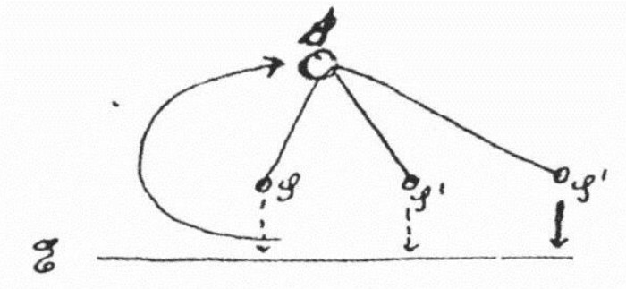

# It Can Reason, But It Cannot Discover

_A Google DeepMind researcher uses Einstein_

## Executive Summary

> [!callout]
> Scientific discovery is not a straight line running from observation to theory. In a 1952 letter to his friend Maurice Solovine, Einstein sketched the process by hand. It is a cycle: you begin with sensory experience, take an intuitive leap that no logic can bridge to arrive at axioms, deduce propositions from those axioms, and then check them back against experience. A position paper titled **“LLMs can’t jump,”** written by Tom Zahavy of Google DeepMind’s discovery team, argues that today’s language models are excellent at the pattern-finding and the deduction on either side of that cycle, but that the leap in the middle is the one thing they cannot, in principle, perform. This piece follows what that leap is and why it has become a live question again.

> The middle step already has a name, coined by the philosopher Charles Sanders Peirce more than a century ago: abduction. It is the move that turns an observation into a genuinely new explanatory principle. The paper’s central counterexample is general relativity. Einstein did not compress existing data more efficiently; with almost no data to work from, he invented the unprecedented concept of spacetime curvature itself. And a benchmark now draws the same boundary. On tasks where the goal is handed over and the system merely has to search and prove, AI climbs steeply — but on ARC-AGI-3, where the system must first figure out what problem it is even solving, frontier models solve less than 1% of puzzles that humans solve almost completely.

> So today’s AI is less an autonomous discoverer than an extraordinarily powerful assistant. It can out-reason humans from a given set of assumptions, but it cannot invent those assumptions. To teach the leap, the paper argues, we need embodied, multimodal world models that experience the world beyond text — which points to the bottleneck of discovery being not model size but **data that captures the world**. One caveat up front: this is neither DeepMind’s official position nor a death sentence declaring that “LLMs will never discover.” Zahavy himself has publicly corrected both readings.

<!-- stat-card -->
**< 1%** — Frontier AI on ARC-AGI-3 — Tasks where you must set your own goal. Humans solve nearly 100%

<!-- stat-card -->
**91.6%** — Symbolic-regression equation recovery — But this is re-finding known formulas, not inventing new axioms

<!-- stat-card -->
**~18×** — Generate-vs-understand time gap — Tao’s proof: 80 minutes to produce, 24 hours to verify

<!-- stat-card -->
**$3.06B** — 2036 world-model market — Growing 33.5% a year — industry’s bet on the paper’s remedy

## The Real Shape of Science, Drawn by Einstein

We are taught that science works like this: you observe the world, gather data, find the rule, and the rule becomes a theory. A ladder running straight from observation up to theory. Einstein thought that picture was wrong. In 1952 he sketched, by hand, what he took to be the real shape of science in a letter to Maurice Solovine, his longtime friend and philosophical sparring partner. It was not a ladder but a cycle, and the cycle had one gap that no logic could close.

*▲ Albert Einstein. The diagram he sketched in his 1952 letter to Solovine is this piece's starting point. | Source: [Wikimedia Commons (Public Domain)](https://commons.wikimedia.org/wiki/File:Albert_Einstein_Head_cleaned.jpg)*

The diagram has three levels. At the bottom sits the layer of sensory experience (E, _Erlebnisse_), the world we actually live through and measure. At the top sit the axioms (A, _Axiome_), the founding assumptions that hold a theory up. From the axioms you deduce various propositions (S) and then test those propositions back against experience below. The trouble is the first arrow, the one climbing from experience up to the axioms. Einstein labeled it “J” and insisted it was an **intuitive leap (a leap, _ein Sprung_)**, that between experience and axioms “there is no logical path.” No matter how much observation you pile up, an axiom does not fall out of it on its own. Someone has to jump.

*▲ Einstein's actual hand-drawn sketch from his 1952 letter to Solovine. The SVG below reconstructs the same sketch in today's visual language. | Source: [Wikimedia Commons (CC BY-SA 4.0)](https://commons.wikimedia.org/wiki/File:Scheme_of_Einstein_theory_construction.jpg)*
