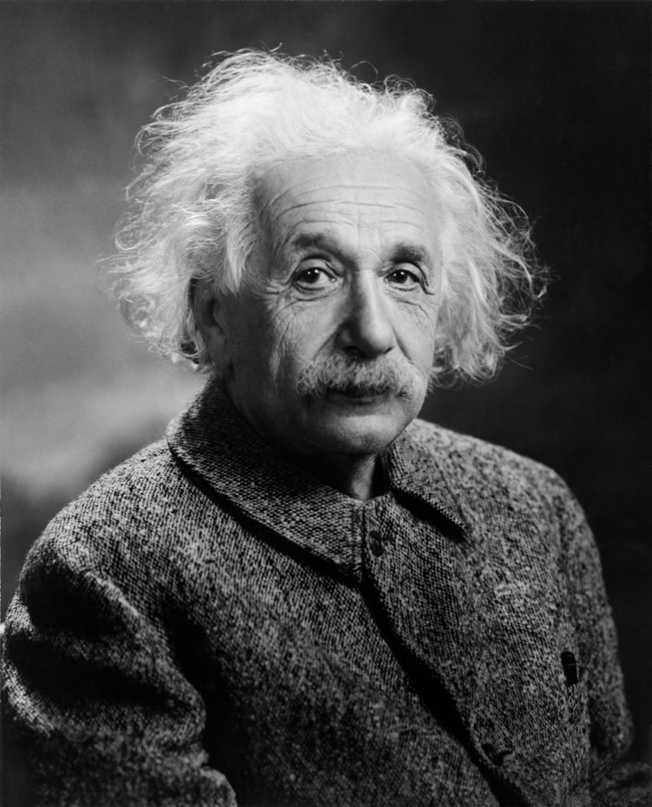

# 추론은 하지만 발견은 못 한다

_구글 딥마인드 연구자가 아인슈타인의 발견 도식으로 짚어낸 LLM의 귀추적 도약 한계_

## Executive Summary

> [!callout]
> 과학적 발견은 관찰에서 곧장 이론으로 이어지는 직선이 아니다. 아인슈타인은 1952년 친구 마우리스 솔로빈에게 보낸 편지에 이 과정을 직접 그림으로 그렸다. 감각 경험에서 출발해, 논리로는 이을 수 없는 직관적 도약으로 공리를 세우고, 그 공리에서 명제를 연역한 뒤 다시 경험과 대조하는 순환이다. 구글 딥마인드 discovery 팀의 톰 자하비가 쓴 포지션 페이퍼 **『LLMs can’t jump』**는, 오늘의 언어모델이 관찰의 패턴화와 논리적 연역은 탁월하게 해내지만 그 가운데의 도약만은 원리적으로 수행하지 못한다고 논증한다. 이 글은 그 도약이 무엇이고 왜 지금 다시 쟁점이 되었는지를 따라간다.

> 가운데 단계에는 100여 년 전 철학자 퍼스가 붙인 이름이 있다. 귀추(歸推)다. 관찰을 새로운 설명 원리로 바꾸는 도약을 가리킨다. 논문이 든 대표 반례는 일반상대성이론이다. 아인슈타인은 데이터를 더 잘 압축한 것이 아니라, 데이터가 거의 없는 상태에서 시공간 곡률이라는 전례 없는 개념 자체를 발명했다. 그리고 벤치마크가 이 경계를 실증한다. 목표가 주어진 뒤 탐색하고 증명하는 과제에서 AI는 가파르게 오르지만, 무엇을 풀어야 하는지부터 스스로 알아내야 하는 ARC-AGI-3에서는 사람이 거의 다 푸는 문제를 프론티어 AI가 1% 미만밖에 풀지 못한다.

> 그래서 오늘의 AI는 자율적 발견자가 아니라 대단히 강력한 조수에 가깝다. 가정으로부터 추론하는 능력은 사람을 앞지르지만, 그 가정을 발명하지는 못한다. 도약을 가르치려면 텍스트 너머의 세계를 겪는 신체화된 멀티모달 world model이 필요하다는 것이 논문의 제언이고, 이는 발견의 병목이 모델 크기가 아니라 **세계를 담은 데이터**에 있음을 가리킨다. 한 가지는 분명히 해 두자. 이것은 딥마인드의 공식 입장도, “LLM은 영원히 발견하지 못한다”는 사망 선고도 아니다. 자하비 본인이 그런 해석을 공개적으로 바로잡았다.

<!-- stat-card -->
**1% 미만** — ARC-AGI-3 프론티어 AI — 목표를 스스로 세워야 하는 과제. 사람은 거의 100%를 푼다

<!-- stat-card -->
**91.6%** — 기호 회귀 방정식 복원율 — 그러나 이미 알려진 공식의 재발견일 뿐, 새 공리의 발명이 아니다

<!-- stat-card -->
**약 18배** — 생성 vs 이해의 시간 격차 — 타오의 증명: 만드는 데 80분, 검증하는 데 24시간

<!-- stat-card -->
**$3.06B** — 2036 world model 시장 — 연평균 33.5% 성장. 논문이 제시한 해법에 산업이 거는 베팅

## 아인슈타인이 그린 과학의 진짜 모양

우리는 과학이 이렇게 흘러간다고 배운다. 세상을 관찰하고, 데이터를 모으고, 규칙을 찾아내면 이론이 된다. 관찰에서 이론으로 곧게 뻗은 사다리다. 아인슈타인은 이 그림이 틀렸다고 보았다. 1952년 그는 오랜 벗이자 철학 토론 상대였던 마우리스 솔로빈에게 보낸 편지에 자신이 생각하는 과학의 실제 모양을 손으로 그려 넣었다. 사다리가 아니라 순환이었고, 그 순환에는 논리로 메울 수 없는 틈이 하나 있었다.

*▲ 알베르트 아인슈타인. 그가 1952년 솔로빈에게 보낸 편지에 그린 도식이 이 글의 출발점이다. | Source: [Wikimedia Commons (Public Domain)](https://commons.wikimedia.org/wiki/File:Albert_Einstein_Head_cleaned.jpg)*

도식은 세 단계로 이루어진다. 아래쪽에는 감각 경험(E, Erlebnisse)의 층이 있다. 우리가 실제로 겪고 측정하는 세계다. 위쪽에는 공리(A, Axiome)가 있다. 이론을 떠받치는 기본 가정이다. 그리고 공리에서 여러 명제(S)를 연역해 내려, 그 명제들을 다시 아래의 경험과 맞대어 검증한다. 문제는 경험에서 공리로 올라가는 첫 화살표다. 아인슈타인은 여기에 “J”라고 적고, 이것이 **직관적 도약(a leap, ein Sprung)**이며 경험과 공리 사이에는 “논리적 다리가 없다(there is no logical path)”고 못 박았다. 관찰을 아무리 쌓아도 그 자체로는 공리가 튀어나오지 않는다. 누군가 도약해야 한다.

*▲ 아인슈타인이 솔로빈에게 보낸 편지(1952)에 실제로 그린 손그림 원본. 아래 SVG는 이 스케치를 오늘의 시각 언어로 재구성한 것이다. | Source: [Wikimedia Commons (CC BY-SA 4.0)](https://commons.wikimedia.org/wiki/File:Scheme_of_Einstein_theory_construction.jpg)*
