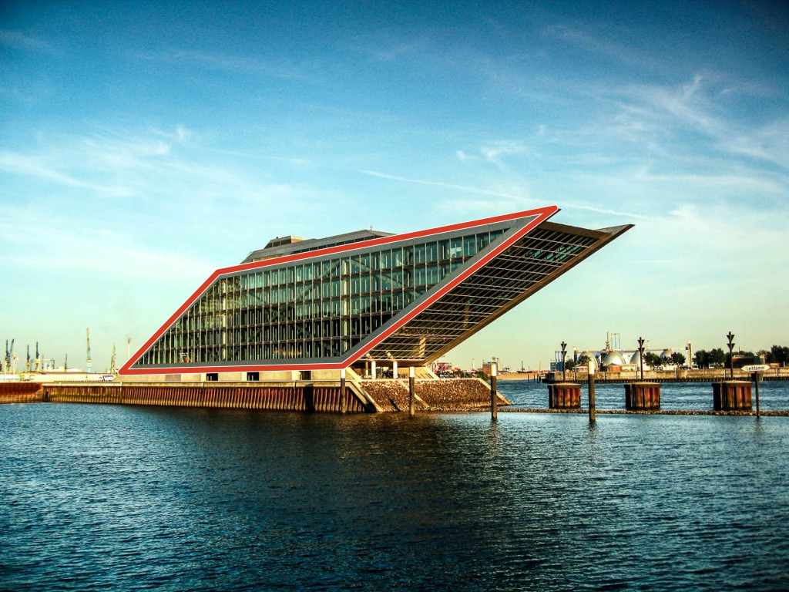
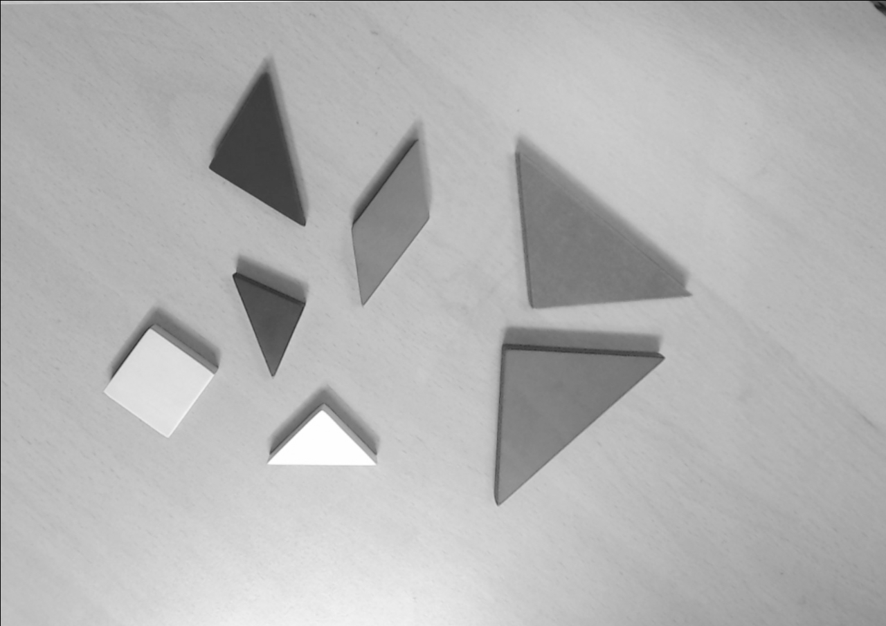
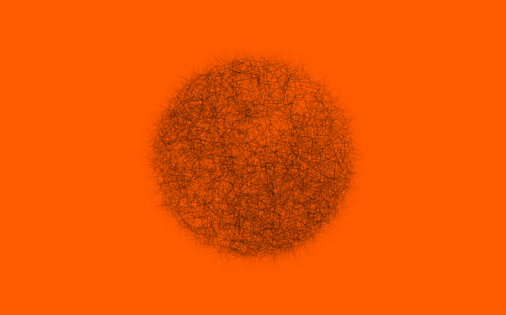
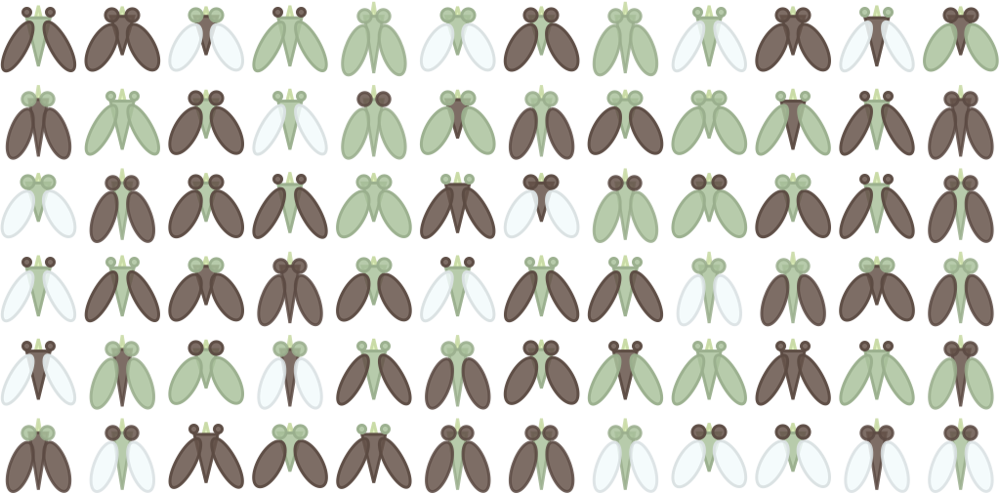

# 15 Years of .nb Files

_A Researcher_

## Executive Summary

> [!callout]
> I ran a full census of the Mathematica notebooks sleeping in my Dropbox. After filtering out only the files I personally created: **2,322 Mathematica notebook (.nb) files**. From the very first file in December 2011 to the last in March 2026 — the complete laboratory record of one researcher across fifteen years.

> These files trace a path from geometry research at ETRI, through a season of painting with code, to founding Pebblous and the LG Electronics PebbloScope project. The monthly histogram reads like a biography. Peaks and silences alternate; each summit holds that year's question.

> The most dramatic moment comes in October 2025. Right after the final peak (238 files in September 2025), the graph falls off a cliff. 29, 6, 0. What turned 238 notebooks into zero? The point where code typed by hand gave way to code summoned by words — this essay is the record of that transition.

## Prologue: Unearthing 2,322 Files

I wasn't trying to organize anything. I happened to be pulling a file list through the Dropbox API, and on a whim I typed `.nb` into the extension filter. Mathematica notebook files. When the results came back, the number stopped me cold.

2,709 in total. Subtract 236 from the [DS] team shared folder, 98 UST course materials, and 53 student assignments, and you get **2,322**. Every one of them mine. From the first file in December 2011 to the last in March 2026. Fifteen years.

A Mathematica notebook is a peculiar format. Code, equations, graphs, and prose coexist in a single document. Like a laboratory notebook, you formulate the day's hypothesis, run the code, see the result with your own eyes, and jot down the next question. Each .nb file preserves that day's question like a fossil.

I counted these files by month of creation and drew a histogram. And there, laid out before me, was the story of my life.

### Monthly .nb File Creation Histogram (2011-2026)

Full Dropbox API census; team folders, course materials, and student assignments excluded. 2,322 files total. Each bar represents the number of .nb files created that month.

Five distinct peaks emerge from the histogram. Summer 2013 (CLC research), 2018-2019 (the golden age of Code Painting), 2020-2021 (the founding era), 2023 (the LLM era), and the second half of 2025 (the LG project). The valleys between the peaks have stories of their own. And at the far right, where the graph bends vertically downward — that is where this essay begins.

## The Researcher Years (2011-2017)

Research: 334 filesETRI Researcher · Computer Vision · Geometric Algebra

December 2011 — the first .nb file was born. In a lab at ETRI (Electronics and Telecommunications Research Institute). I was standing at the intersection of cameras and geometry.

**CLC (Coupled Line Cameras)** — a study on recovering camera parameters from a single image using nothing but the geometric properties of quadrilaterals. I solved the geometric constraints formed by vanishing points and diagonals of a rectangle through Mathematica's symbolic computation. The test image was the Dockland building in Hamburg. Its elegant parallelogram facade satisfied the geometric conditions perfectly. This research was presented at ICPR 2012 and 2014.

*CLC research: Recovering camera parameters from the quadrilateral geometry of Hamburg's Dockland building (ICPR 2012, 2014)*

Mathematica was the essential instrument of this era. I expanded equations with symbolic computation, generated 3D visualizations on the fly, and recorded results directly in the notebook. I wasn't translating math from paper into code — the code itself was mathematics.

Around the same time, **RSAR (Robotic Spatial AR)** — Robotic Spatial Augmented Reality research — was underway, and in the **Tangram Alive** project, I solved tangram puzzle pose estimation in 0.2 seconds using Hausdorff distance. Thirty-four notebooks remain from camera calibration and Geometric Algebra research as well.

*Tangram Alive: Pose estimation of each piece from the input image (left) in 0.2 seconds (right). Hausdorff distance-based pose estimation algorithm.*

The first major peak appears in June 2013: 75 files. It was the climax of the CLC experiments. The daily routine of a researcher — splitting a single question open from hundreds of angles — reveals itself in the numbers. The 167 CLC experiment notebooks span from 2013 to 2024, a trace of one research theme expanding over more than a decade.

## Painting with Code (2017-2019)

Art: ~748 filesCode Painting · Style Transfer · Fly4ML

Two peaks leap out from the histogram before anything else. May 2018: **208 files**. July 2019: **316 files**. The annual maxima. What was happening during this period?

**Code Painting**. I had begun making pictures with Mathematica. The Shapes series (72 notebooks) composed geometric forms; Kinetic Art (27) set code in motion; Pixel Stack (18) built images by stacking pixels; Style Study (15) explored diverse visual languages; and Pebbles (8) shaped the forms of small stones. Some 140 notebooks were devoted purely to art.

*Code Painting debut exhibition "Ambiguous Boundary" — IBS (Institute for Basic Science), October 2019. Geometric pattern works generated from Mathematica code.*

*Daejeon Biennale 2020 — Invited to the Daejeon Museum of Art. The moment code paintings born in .nb files hung on a gallery wall.*

It was the moment a researcher's tool became an artist's brush. Mathematica's functional programming and instant visualization created an environment where changing one line of code immediately changed the image. Every tweak of a parameter transformed the screen. The boundary between experiment and creation dissolved. `Graphics[]`, `Manipulate[]`, `ColorFunction` — these functions were my palette.

*Kinexel Moon: One piece from the Kinetic Art series. Code art born at the intersection of pixels and motion.*

During the same period, **Neural Style Transfer** experiments were in full swing. A standout project cross-transferred the styles of Van Gogh's Irises and Gyeomjae Jeong Seon's View of Inwangsan Mountain After Rain. Western impressionism and Eastern ink-wash painting met inside a neural network. At the time it was artistic curiosity, but looking back, it was early work exploring the intersection of AI and art.

*Visual Style Transfer — Cross-applying content/style between Van Gogh's Irises (top) and Gyeomjae Jeong Seon's View of Inwangsan Mountain After Rain (bottom). Neural Style Transfer implemented with Mathematica's NetTrain (2017).*

*Output image with Van Gogh's Irises style applied. Based on "A Neural Algorithm of Artistic Style" (Gatys et al., 2015).*

Alongside the art, experiments that would later become the seeds of a business were taking root in this same period.

**Fly4ML** was a delightful experiment. I generated synthetic fly images and used them to test Mathematica's `Classify[]` function. Training a classifier on self-made data — this was a small seed of the synthetic data business to come.

*Fly4ML: Synthetic image generation and machine learning classification experiment. An early attempt at creating training data from scratch.*

And then there was **ModMan SLS (Synthetic Learning Set)**. Across 40 notebooks, I designed a pipeline in Mathematica for generating synthetic training data through Blender's physics-based rendering. This project, which began in 2015 and continued until 2025, was **the seed of PebbloSim**. I had no idea at the time that it would become the core technology of Pebblous a decade later.

*ModMan SLS: A grid of synthetic hand-and-object images. Training data generated through Blender physics-based rendering + Mathematica pipeline — the seed of PebbloSim.*

## Startup and Transition (2020-2023)

Pebblous: 717 filesFounding · Art Camp · The LLM Era

In November 2021, I founded Pebblous. On the histogram, this period reveals a fascinating pattern — the file count drops sharply, then rises again, a wave-like oscillation.

After founding the company, Mathematica's role changed at its root. It went from being an experimental tool for research papers to a prototyping instrument for building the early form of **DataClinic**. Visualizing class-level density distributions in image datasets, detecting outliers, designing quality metrics — all of this happened inside Mathematica notebooks. Every algorithm validation before productization is recorded in .nb files.

*DataClinic data quality diagnosis results — Industrial waste dataset. The density analysis algorithm prototyped in Mathematica evolved into a product. | Source: [dataclinic.ai](https://dataclinic.ai)*

Just before founding the company, in August 2021, there was a 3-day **Art Camp**. Thirty-one notebooks poured out in three days. Ten a day. It was the final concentrated explosion of art and code. Looking back, it was the last deep immersion before crossing over into the life of an entrepreneur. The density of ten files a day says it all.

### Yearly Topic Distribution (Stacked Bar)

Research (blue), Art (orange), Pebblous (teal), Lectures (purple), Other (gray). Note how the teal area surges after 2022.

In 2022, a folder called **[CLV] Research Management** appeared. The moment Mathematica transitioned from a research tool to a business tool. I used Mathematica for managing research projects, data analysis, and business plan simulations. This folder would eventually hold 427 notebooks spanning 2022 to 2026, peaking at 235 in 2025 — the largest project folder in all of Pebblous.

Meanwhile, September 14, 2022 holds an unusual record: 119 files uploaded in a single day. It was a bulk upload of Code Painting works — pieces actually created between 2017 and 2021, now being organized into Dropbox. The 2022.09 spike on the histogram isn't new creation but a settling of the past, a kind of digital archiving.

In 2023, a month after the ChatGPT API launched, I created my first notebook that called an LLM from inside Mathematica. It was the year ML/DL-related notebooks peaked at 48. The marriage of Wolfram Language and LLMs opened new possibilities — yet it was also the moment when the limits of Mathematica alone began to come into view.

## The Peak and the Turning Point (2025)

571 files → sharp declineLG PebbloScope · Second-highest peak ever · Then the cliff

2025 was the absolute zenith of my Mathematica usage — and its final blaze. **The LG Electronics PebbloScope project** — geography, spheres, data visualization. From March through September, 189 notebooks were devoted to this project alone.

Over just three months, July to September 2025: **467 files**. Twenty percent of all 2,322 files are concentrated in these ninety days. September 2025 alone saw **238 files** — the second-highest monthly peak in fifteen years, after July 2019 (316). That translates to roughly eight notebooks a day.

And yet, at this very summit, I felt Mathematica's limits most acutely. Complex interactions, web deployment, large-scale data processing. Mathematica excels at exploration and prototyping, but a wall stands between it and production-grade applications. As the LG project scaled, that wall grew ever more visible.

Then, in October, the graph falls off a cliff.

238

2025.09

→

29

2025.10

→

6

2025.11

→

0

2025.12

### Project Timeline

Activity period and file count for each project. Pebblous [CLV] is the largest project; LG PebbloScope shows the highest density.

## The Plot Twist — When Words Became Code (2025.10-)

Vibe CodingClaude Code · The birth of blog.pebblous.ai

At the very moment the Mathematica histogram plunged off its cliff, something else was beginning. **Vibe Coding**. My first encounter with Claude Code.

Code that had been typed by hand, stitch by stitch, for fifteen years — gave way to code conjured by words. The instant the last bar of the Mathematica histogram vanished, the first post went up on blog.pebblous.ai. One era ended; another began.

When I pressed Enter instead of Shift+Enter, what changed wasn't a keyboard shortcut — it was the unit of thought. In Mathematica, you typed a function and executed it. In Claude Code, you speak an intention and review the result. The smallest unit of execution shifted from a function to an intent.

> [!callout]
> **The irony of February 2026** — twelve .nb files suddenly appear on the histogram after three months of silence. Open them and you'll find Wolfram Language code inside, but this time I didn't type it. **Claude generated those Mathematica notebooks.** .nb files written by AI. The moment the tool's role was completely inverted.

I haven't abandoned Mathematica. It remains irreplaceable for symbolic computation and mathematical exploration. But for everyday coding, web development, and data pipeline construction, Vibe Coding is overwhelmingly faster. The notebooks I used to create several times a day over fifteen years — their role is now fulfilled by conversations with Claude Code.

## Epilogue — From Handcrafted Stitches to a Robot's Brushstrokes

The evolution of code can be told in three sentences.

**Pictures painted with hand-typed code** — [Code Painting](/project/DAL/code-painting/en/). I composed functions in Mathematica notebooks to create images.

**Pictures painted with code made from words** — Vibe Coding. Speak an intention to Claude Code, and the code materializes.

**Pictures painted by a robot running that code** — [Robotic Painting](/project/DAL/robotic-painting/en/). Code steps into the physical world.

The tool has changed. From Mathematica to Claude Code. But the question remains the same: **"What can we see through data?"**

The researcher who once reconstructed the geometry of quadrilaterals with CLC now diagnoses the quality of AI training data with DataClinic. The way of seeing the world through mathematical intuition hasn't changed. Read the structure hidden in data, visualize what that structure means, and from there, ask the next question.

These 2,322 .nb files are one person's intellectual trajectory. From geometry to art, from art to business, from business to AI. And threading through all of it, a single disposition — the attempt to understand the world through code.

That the histogram's last bar has fallen to zero is not an ending. It simply means the next question will be recorded somewhere other than an .nb file. Perhaps this very essay — fifteen years from now — will turn out to be the first bar of another histogram.

## Why This Record Matters to Pebblous

There is a reason this apparently personal memoir appears on the Pebblous blog. The trajectory revealed by 2,322 .nb files explains where Pebblous came from.

### The Origin of Synthetic Data: From ModMan SLS to PebbloSim

ModMan SLS — the experiment in creating synthetic training data through physics-based rendering, which began in a Mathematica notebook in 2015 — became PebbloSim a decade later. The trial and error captured in 40 notebooks evolved into the design philosophy of a Neuro-Symbolic Hybrid World Model. The conviction that data quality determines model performance first took shape in Fly4ML's synthetic fly image experiment.

### The DNA of Data Quality Diagnosis: From CLC to DataClinic

The essence of CLC research was "recovering hidden structure (camera parameters) from incomplete data (a single image)." DataClinic does the same thing. It diagnoses quality problems in incomplete or contaminated data, identifies structural defects, and suggests remediation. The mathematical sensibility that once calibrated cameras through Geometric Algebra is woven directly into the design of data quality metrics.

### Practical Questions Raised by a Tool Transition

The shift from Mathematica to Vibe Coding holds implications for Pebblous's clients as well. When an enterprise adopts AI, how should it transition its existing tools and workflows? How is the knowledge accumulated in fifteen years of .nb files transferred to a new environment? These are questions Pebblous confronts daily while building DataClinic.

### Questions to Explore Next

The AI-generated .nb files that appeared in February 2026 raise new questions. How do we verify the quality of AI-generated code? When AI-created training data is used to train yet another AI, how must data quality standards evolve? These are precisely the challenges DataClinic must tackle in its next chapter.

## Frequently Asked Questions

### What is Mathematica?

Mathematica is a mathematical software and programming language (Wolfram Language) developed by Wolfram Research. It handles symbolic computation, numerical analysis, visualization, and machine learning in a single environment, documenting code and results in .nb (notebook) files. Since its launch in 1988, it has been widely used in science, engineering, mathematics, and finance.

### What is a .nb file?

It is the file extension for Mathematica notebooks. It's an interactive document format where code, equations, text, graphs, and images coexist in a single file. Similar to Jupyter Notebooks (.ipynb), but tightly integrated with Wolfram Language's symbolic computation system.

### How was the Dropbox API census conducted?

I used the Dropbox API's files/search_v2 endpoint to search for all files with the .nb extension. After extracting each file's path, creation date, and modification date, I filtered out team shared folders ([DS] team, 236 files), UST course materials (98 files), and student assignments (53 files) by path pattern. The final 2,322 files were aggregated by month to generate the histogram.

### What is Code Painting?

It is the practice of creating artwork through programming code. In this essay, it refers to generating geometric forms, kinetic art, and pixel art by combining Mathematica functions such as Graphics, ColorFunction, and Manipulate. Where traditional painting uses a brush as its tool, Code Painting uses code.

### What is the relationship between PebbloSim and ModMan SLS?

ModMan SLS was a synthetic learning set generation experiment that began in 2015. It created synthetic data through Blender's physics-based rendering and designed the pipeline in Mathematica. The know-how accumulated in this experiment — generating "physically accurate synthetic data" — directly informed the design philosophy of Pebblous's PebbloSim (a synthetic data generation engine based on a Neuro-Symbolic Hybrid World Model).

### What is Vibe Coding?

It is a way of programming through natural language conversation with an AI coding assistant. Instead of typing code line by line, you describe your intent and context in words; the AI generates the code, and the developer reviews the result and steers the direction. This essay traces how Vibe Coding with Claude Code came to replace Mathematica.

### Which month saw the most files created in the 15-year span?

July 2019, with 316 files — the golden age of Code Painting. The runner-up is September 2025 with 238 files (the LG PebbloScope project).

## References

1. Lee, J.-H., "Coupled Line Cameras for Precise and Robust Parameter Estimation", _ICPR 2014_ (International Conference on Pattern Recognition), Stockholm, Sweden, 2014.
2. Lee, J.-H., "Single-View Based Geometric Parameter Estimation of Quadrilaterals Using Coupled Line Cameras", _ICPR 2012_, Tsukuba, Japan, 2012.
3. Wolfram Research, _Mathematica_, Version 14.1, Champaign, IL, 2024. [wolfram.com](https://www.wolfram.com/mathematica/)
4. Pebblous, ["Code Painting: Painting with Code"](/project/DAL/code-painting/en/), blog.pebblous.ai, 2025.
5. Pebblous, ["Robotic Painting: Pictures Drawn by a Robot"](/project/DAL/robotic-painting/en/), blog.pebblous.ai, 2025.
6. Dropbox API v2 Documentation, [developers.dropbox.com](https://www.dropbox.com/developers/documentation/http/documentation)
