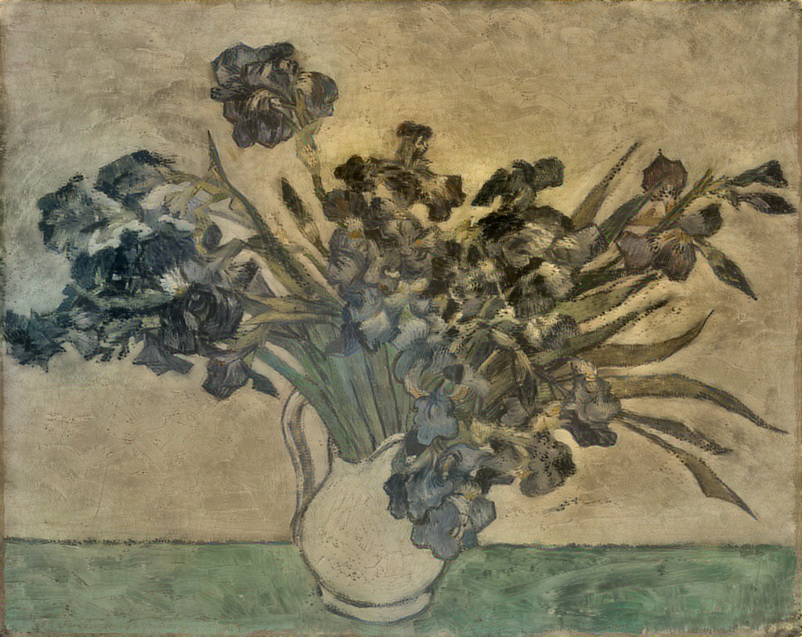
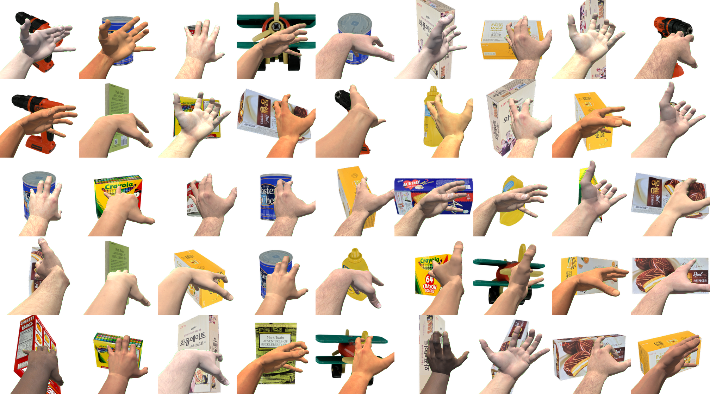

# 15년간의 .nb 파일

_Mathematica로 쓴 연구자의 일대기, 그리고 말이 코드가 된 순간_

## Executive Summary

> [!callout]
> Dropbox에 잠들어 있던 Mathematica 노트북을 전수조사했다. 본인이 직접 만든 파일만 추리니 **2,322개의 Mathematica 노트북(.nb) 파일**. 2011년 12월의 첫 파일부터 2026년 3월의 마지막 파일까지, 15년간 한 연구자가 남긴 실험 노트의 전체 기록이다.

> 이 파일들은 ETRI 연구원 시절의 기하학 연구에서 출발해, 코드로 그림을 그리던 시기, 페블러스 창업과 사업화, LG전자 PebbloScope 프로젝트까지를 관통한다. 월별 파일 수의 히스토그램은 연구자의 일대기 그 자체다. 피크와 침묵이 번갈아 나타나며, 각 봉우리에는 그해의 질문이 담겨 있다.

> 가장 극적인 순간은 2025년 10월이다. 마지막 피크(월 238개, 2025.09) 직후 그래프가 절벽처럼 떨어진다. 29개, 6개, 0개. 무엇이 238개의 노트북을 0으로 만들었는가. 타이핑으로 짓던 코드가 말로 만드는 코드로 전환된 지점 — 이 글은 그 전환의 기록이다.

## 프롤로그: 2,322개의 발굴

정리를 하려던 건 아니었다. Dropbox API로 파일 목록을 뽑아볼 일이 있었는데, 확장자 필터에 `.nb`를 넣어봤다. Mathematica 노트북 파일. 결과가 돌아왔을 때 숫자에 잠시 멈췄다.

총 2,709개. 여기서 [DS]팀 공유 폴더 236개, UST 교재 98개, 학생 과제 53개를 빼면 **2,322개**. 전부 내가 만든 파일이다. 2011년 12월 첫 파일부터 2026년 3월 마지막 파일까지. 15년.

Mathematica 노트북은 특별한 형식이다. 코드와 수식, 그래프와 텍스트가 하나의 문서에 공존한다. 실험실 노트처럼 그날의 가설을 세우고, 코드를 돌려보고, 결과를 눈으로 확인하고, 다음 질문을 적어두는 공간. 각 .nb 파일에는 그날의 질문이 화석처럼 남아 있다.

이 파일들의 생성일을 월별로 세어 히스토그램을 그려보았다. 그랬더니 거기에 내 일대기가 있었다.

### 월별 .nb 파일 생성 히스토그램 (2011~2026)

Dropbox API 전수조사, 팀 폴더/교재/학생 과제 제외 후 2,322개. 각 막대는 해당 월에 생성된 .nb 파일 수.

히스토그램에는 뚜렷한 봉우리 다섯 개가 보인다. 2013년 여름(CLC 연구), 2018~2019년(Code Painting 전성기), 2020~2021년(창업기), 2023년(LLM 시대), 그리고 2025년 하반기(LG 프로젝트). 각 봉우리 사이의 골짜기도 이야기가 있다. 그리고 맨 오른쪽, 그래프가 수직으로 꺾이는 곳 — 거기서 이 글이 시작됐다.

## 연구자 시절 (2011~2017)

연구 334개ETRI 연구원 · 컴퓨터 비전 · 기하대수

2011년 12월, 첫 번째 .nb 파일이 생겼다. ETRI(한국전자통신연구원) 연구실에서였다. 그때 나는 카메라와 기하학의 교차점에 서 있었다.

**CLC(Coupled Line Cameras)** — 단일 영상에서 사각형의 기하학적 성질만으로 카메라 파라미터를 복원하는 연구. 사각형 네 변의 소실점과 대각선이 만드는 기하학적 구속 조건을 Mathematica의 심볼릭 연산으로 풀어냈다. 함부르크 Dockland 건물 사진이 실험 이미지였다. 그 유려한 평행사변형 외벽이 기하학적 조건을 완벽하게 만족했기 때문이다. 이 연구는 ICPR 2012, 2014에서 발표했다.

*CLC 연구: 함부르크 Dockland 건물의 사각형 기하학으로 카메라 파라미터 복원 (ICPR 2012, 2014)*

Mathematica는 이 시기 연구의 핵심 도구였다. 심볼릭 연산으로 수식을 전개하고, 즉석에서 3D 시각화를 만들고, 결과를 노트북에 바로 기록했다. 종이 위의 수학을 코드로 옮기는 것이 아니라, 코드 자체가 수학이었다.

같은 시기 **RSAR(Robotic Spatial AR)** — 로봇 공간 증강현실 연구가 진행됐고, **Tangram Alive**라는 프로젝트에서는 탱그램 퍼즐의 포즈 추정을 Hausdorff distance로 0.2초 만에 해결했다. 카메라 캘리브레이션, 기하대수(Geometric Algebra) 연구에도 34개의 노트북이 남아 있다.

*▲ Tangram Alive: 입력 이미지(좌)에서 각 조각의 위치와 회전을 0.2초 만에 추정(우). Hausdorff distance 기반 포즈 추정 알고리즘.*

2013년 6월에 75개라는 첫 번째 큰 봉우리가 나타난다. CLC 실험의 절정기였다. 하나의 질문을 수백 번 다른 각도에서 쪼개보는 연구자의 일상이 숫자로 드러난다. 167개의 CLC 실험 노트북은 2013년부터 2024년까지 이어지는데, 하나의 연구 주제가 10년 넘게 확장되는 과정의 흔적이다.

## 코드로 그린 그림 (2017~2019)

아트 ~748개Code Painting · Style Transfer · Fly4ML

히스토그램에서 가장 먼저 눈에 띄는 두 개의 봉우리가 있다. 2018년 5월 **208개**, 2019년 7월 **316개**. 연간 최대 피크다. 이 시기에 무슨 일이 있었을까.

**Code Painting**이었다. Mathematica로 그림을 그리기 시작한 것이다. 기하학적 형태를 조합하는 Shapes 시리즈(72개), 움직이는 코드 예술 Kinetic Art(27개), 픽셀을 쌓아올리는 Pixel Stack(18개), 다양한 스타일을 탐구하는 Style Study(15개), 그리고 조약돌 형상의 Pebbles(8개). 약 140개의 노트북이 순수하게 예술 작업에 쓰였다.

*▲ Code Painting 첫 전시 "모호한 경계(Ambiguous Boundary)" — IBS(기초과학연구원), 2019년 10월. Mathematica 코드로 생성한 기하학적 패턴 작품들.*

*▲ 대전 비엔날레 2020 — 대전시립미술관 초대. .nb 파일에서 태어난 코드 페인팅이 미술관 벽에 걸린 순간.*

연구자의 도구가 예술가의 붓이 된 순간이었다. Mathematica의 함수형 프로그래밍과 즉각적인 시각화는 코드 한 줄의 변화가 곧바로 이미지의 변화로 이어지는 환경을 만들었다. 파라미터 하나를 바꿀 때마다 화면이 달라졌다. 실험과 창작의 경계가 사라지는 경험이었다. `Graphics[]`, `Manipulate[]`, `ColorFunction` — 이 함수들이 팔레트였다.

*Kinexel Moon: Kinetic Art 시리즈 중 하나. 픽셀과 움직임의 교차점에서 탄생한 코드 예술.*

같은 시기에 **Neural Style Transfer** 실험도 활발했다. 반 고흐의 아이리스와 겸재 정선의 인왕제색도를 크로스 스타일 트랜스퍼한 작업이 대표적이다. 서양 인상주의와 동양 수묵화의 기법이 뉴럴 네트워크 안에서 만나는 실험. 당시에는 예술적 호기심이었지만, 돌이켜보면 AI와 예술의 교차점을 탐구한 초기 작업이었다.

*▲ Visual Style Transfer — 반 고흐의 아이리스(위)와 겸재 정선의 인왕제색도(아래)의 Content/Style을 교차 적용. Mathematica의 NetTrain으로 구현한 Neural Style Transfer (2017).*

*반 고흐 아이리스의 스타일이 적용된 출력 이미지. "A Neural Algorithm of Artistic Style" (Gatys et al., 2015) 기반.*

예술과 병행하여, 훗날 사업의 씨앗이 되는 실험도 이 시기에 진행됐다.

**Fly4ML**은 재미있는 실험이었다. 합성 파리 이미지를 만들어서 Mathematica의 `Classify[]` 함수를 테스트했다. 학습 데이터를 직접 만들어 분류기를 훈련시키는 과정 — 이것은 훗날 합성 데이터 사업의 작은 씨앗이었다.

*Fly4ML: 합성 이미지 생성과 머신러닝 분류 실험. 학습 데이터를 직접 만드는 초기 시도.*

그리고 **ModMan SLS(합성 학습셋)**. 40개의 노트북에 걸쳐, Blender의 물리 기반 렌더링으로 합성 학습 데이터를 생성하는 파이프라인을 Mathematica로 설계했다. 2015년에 시작해 2025년까지 이어지는 이 프로젝트가 바로 **PebbloSim의 씨앗**이다. 10년 뒤 페블러스의 핵심 기술이 될 것을 그때는 몰랐다.

*▲ ModMan SLS: 손과 물체의 합성 이미지 그리드. Blender 물리 기반 렌더링 + Mathematica 파이프라인으로 생성한 합성 학습 데이터 — PebbloSim의 씨앗.*

## 창업과 전환 (2020~2023)

페블러스 717개창업 · Art Camp · LLM 시대

2021년 11월, 페블러스를 설립했다. 히스토그램에서 이 시기는 흥미로운 패턴을 보인다. 파일 수가 크게 줄어들었다가 다시 올라오는 파동.

창업 이후 Mathematica의 역할이 근본적으로 달라졌다. 연구 논문을 위한 실험 도구에서, **데이터클리닉(DataClinic)의 원형**을 만드는 프로토타이핑 도구로. 이미지 데이터셋의 클래스별 밀도 분포를 시각화하고, 이상치를 탐지하고, 품질 메트릭을 설계하는 작업이 Mathematica 노트북 안에서 이루어졌다. 제품화 이전의 모든 알고리즘 검증이 .nb 파일에 기록되어 있다.

*▲ DataClinic의 데이터 품질 진단 결과 — 산업폐기물 데이터셋. Mathematica로 프로토타이핑한 밀도 분석 알고리즘이 제품으로 진화했다. | Source: [dataclinic.ai](https://dataclinic.ai)*

창업 직전인 2021년 8월, 3일간의 **Art Camp**가 있었다. 31개의 노트북이 단 3일 만에 쏟아졌다. 하루에 10개씩. 예술과 코드의 마지막 집중 폭발이었다. 지금 돌이켜보면, 사업가로 넘어가기 직전의 마지막 집중 몰입이었다. 하루 10개라는 밀도가 그것을 말해준다.

### 연도별 주제 분포 (Stacked Bar)

연구(파랑), 아트(오렌지), 페블러스(틸), 강의(보라), 기타(회색). 2022년 이후 틸색 영역이 급성장한다.

2022년, **[CLV] 연구관리**라는 폴더가 등장한다. Mathematica가 연구 도구에서 사업 도구로 전환되는 순간이다. 연구 과제 관리, 데이터 분석, 사업 계획 시뮬레이션에 Mathematica를 썼다. 이 폴더는 2022년부터 2026년까지 총 427개의 노트북을 담게 되는데, 피크는 2025년(235개) — 페블러스에서 가장 큰 프로젝트 폴더다.

한편 2022년 9월 14일에는 특이한 기록이 있다. 119개의 파일이 하루에 올라왔다. Code Painting 작품들의 일괄 업로드였다. 실제로는 2017~2021년에 만든 작품들을 정리해서 Dropbox에 올린 것이다. 히스토그램의 2022.09 봉우리는 새로운 창작이 아니라 과거의 정리, 일종의 디지털 아카이빙이다.

2023년, ChatGPT API가 공개되고 한 달 뒤 Mathematica 안에서 LLM을 호출하는 첫 노트북을 만들었다. 머신러닝/딥러닝 관련 노트북이 48개로 피크를 찍은 해. Wolfram Language와 LLM의 결합은 새로운 가능성을 열었지만, 동시에 Mathematica만으로는 부족한 영역이 보이기 시작한 시점이기도 했다.

## 정점과 전환점 (2025)

571개 → 급감LG PebbloScope · 역대 두 번째 피크 · 그리고 절벽

2025년은 Mathematica 사용의 절대적 정점이자 마지막 불꽃이었다. **LG전자 PebbloScope 프로젝트** — Geography, Sphere, 데이터 시각화. 3월부터 9월까지 189개의 노트북이 이 프로젝트에 쓰였다.

2025년 7월부터 9월까지 3개월간 **467개**. 전체 2,322개의 20%가 이 석 달에 집중되어 있다. 2025년 9월에는 월 **238개** — 2019년 7월(316개)에 이어 역대 두 번째 피크. 하루 평균 8개의 노트북을 만들었다는 뜻이다.

그런데 이 정점에서 Mathematica의 한계를 절감했다. 복잡한 인터랙션, 웹 배포, 대규모 데이터 처리. Mathematica는 탐색과 프로토타이핑에는 탁월하지만, 프로덕션 수준의 애플리케이션을 만들기에는 벽이 있었다. LG 프로젝트의 규모가 커질수록 그 벽은 더 선명해졌다.

그리고 10월, 그래프가 절벽처럼 떨어진다.

238

2025.09

→

29

2025.10

→

6

2025.11

→

0

2025.12

### 프로젝트 타임라인

각 프로젝트의 활동 기간과 파일 수. 페블러스 [CLV]가 가장 큰 프로젝트이며, LG PebbloScope가 가장 밀도 높은 기간을 보인다.

## 반전 — 말이 코드가 되다 (2025.10~)

Vibe CodingClaude Code · blog.pebblous.ai 탄생

Mathematica 히스토그램이 절벽을 그린 바로 그 시점, 다른 무언가가 시작됐다. **바이브 코딩(Vibe Coding)**. Claude Code와의 첫 만남.

15년간 한 땀 한 땀 타이핑하던 코드가 — 말로 만드는 코드로 전환됐다. Mathematica 노트북의 마지막 막대가 사라지는 순간, blog.pebblous.ai의 첫 포스트가 올라갔다. 하나의 시대가 끝나고 다른 시대가 시작된 것이다.

Shift+Enter 대신 Enter를 치는 순간, 달라진 것은 키보드 단축키가 아니라 사고의 단위였다. Mathematica에서는 함수 하나를 타이핑하고 실행했다. Claude Code에서는 의도 하나를 말하고 결과를 검토한다. 함수가 아니라 의도가 실행의 최소 단위가 됐다.

> [!callout]
> **2026년 2월의 아이러니** — 히스토그램에 12개의 .nb 파일이 갑자기 나타난다. 석 달간의 공백 이후에. 열어보면 Wolfram Language 코드가 들어 있는데, 이번에는 내가 타이핑한 게 아니다. **Claude가 생성한 Mathematica 노트북**이다. AI가 쓴 .nb 파일. 도구의 역할이 완전히 뒤집힌 순간이다.

Mathematica를 버린 것은 아니다. Mathematica는 여전히 심볼릭 연산과 수학적 탐구에서 대체 불가능한 도구다. 하지만 일상적인 코딩, 웹 개발, 데이터 파이프라인 구축은 바이브 코딩이 압도적으로 빠르다. 15년간 Mathematica로 하루에 몇 개씩 만들던 노트북의 역할을, 이제는 Claude Code와의 대화가 대신한다.

## 에필로그 — 한 땀 한 땀에서 로봇의 붓질까지

코드의 진화를 세 문장으로 요약할 수 있다.

**손으로 지은 코드로 그린 그림** —[Code Painting](/project/DAL/code-painting/ko/). Mathematica 노트북에서 함수를 조합해 이미지를 만들었다.

**말로 만든 코드로 그린 그림** —Vibe Coding. Claude Code에게 의도를 말하면 코드가 만들어진다.

**이 코드가 로봇에 연결되어 로봇이 그린 그림** —[Robotic Painting](/project/DAL/robotic-painting/ko/). 코드가 물리적 세계로 나아간다.

도구는 바뀌었다. Mathematica에서 Claude Code로. 하지만 질문은 같다: **"데이터로 무엇을 볼 수 있는가?"**

15년 전 CLC로 사각형의 기하학을 복원하던 연구자가, 지금은 DataClinic으로 AI 학습 데이터의 품질을 진단한다. 수학적 직관으로 세상을 보는 방식은 변하지 않았다. 데이터 속에서 구조를 읽어내고, 그 구조가 의미하는 바를 시각화하고, 거기서 다음 질문을 던진다.

2,322개의 .nb 파일은 한 사람의 지적 궤적이다. 기하학에서 예술로, 예술에서 사업으로, 사업에서 AI로. 그리고 그 모든 것을 관통하는 하나의 태도 — 코드로 세상을 이해하려는 시도.

이 히스토그램의 마지막 막대가 0이 된 것은 끝이 아니다. 다만 다음 질문은 .nb 파일이 아니라 다른 어딘가에 기록될 것이다. 어쩌면 이 글 자체가 — 15년 뒤 또 다른 히스토그램의 첫 번째 막대일지 모른다.

## 이 기록이 페블러스의 출발점인 이유

개인적인 회고록처럼 보이는 이 글이 페블러스 블로그에 실리는 데에는 이유가 있다. 2,322개의 .nb 파일이 보여주는 궤적은 페블러스라는 회사가 어디서 왔는지를 설명하기 때문이다.

### 합성 데이터의 원점: ModMan SLS에서 PebbloSim으로

2015년 Mathematica 노트북에서 시작된 ModMan SLS — 물리 기반 렌더링으로 합성 학습 데이터를 만드는 실험 — 가 10년 뒤 PebbloSim이라는 제품이 됐다. 노트북 40개에 담긴 시행착오가 Neuro-Symbolic Hybrid World Model의 설계 철학으로 이어졌다. 데이터의 품질이 모델 성능을 결정한다는 확신은 Fly4ML의 합성 파리 이미지 실험에서 처음 형성됐다.

### 데이터 품질 진단의 DNA: CLC에서 DataClinic으로

CLC 연구의 본질은 "불완전한 데이터(단일 영상)에서 숨겨진 구조(카메라 파라미터)를 복원하는 것"이었다. DataClinic이 하는 일도 같다. 불완전하거나 오염된 데이터에서 품질 문제를 진단하고, 구조적 결함을 찾아내고, 수정 방향을 제시한다. 기하대수로 카메라를 교정하던 수학적 감각이 데이터 품질 메트릭 설계에 그대로 녹아 있다.

### 도구 전환이 던지는 실무적 질문

Mathematica에서 바이브 코딩으로의 전환은 페블러스 고객사에게도 시사점이 있다. 기업이 AI를 도입할 때, 기존 도구와 워크플로우를 어떻게 전환할 것인가? 15년간 축적된 .nb 파일의 지식은 어떻게 새로운 환경으로 이전되는가? 이 질문은 페블러스가 DataClinic을 만들면서 매일 마주하는 질문이기도 하다.

### 앞으로 탐구할 질문

2026년 2월에 나타난 AI가 생성한 .nb 파일은 새로운 질문을 던진다. AI가 생성한 코드의 품질을 어떻게 검증할 것인가? AI가 만든 학습 데이터로 다시 AI를 훈련시킬 때, 데이터 품질 기준은 어떻게 달라져야 하는가? 이것은 DataClinic이 다음 단계에서 풀어야 할 과제이기도 하다.

## 자주 묻는 질문

### Mathematica란 무엇인가요?

Wolfram Research가 개발한 수학 소프트웨어이자 프로그래밍 언어(Wolfram Language)입니다. 심볼릭 연산, 수치 계산, 시각화, 머신러닝을 하나의 환경에서 처리할 수 있으며, .nb(노트북) 형식으로 코드와 결과를 문서화합니다. 1988년 출시 이래 과학, 공학, 수학, 금융 분야에서 널리 사용됩니다.

### .nb 파일이란 무엇인가요?

Mathematica 노트북 파일의 확장자입니다. 코드, 수식, 텍스트, 그래프, 이미지가 하나의 문서에 공존하는 인터랙티브 문서 형식입니다. Jupyter Notebook(.ipynb)과 유사하지만, Wolfram Language의 심볼릭 연산 체계와 통합되어 있다는 점이 다릅니다.

### Dropbox API 전수조사는 어떻게 했나요?

Dropbox API의 files/search_v2 엔드포인트로 확장자 .nb에 해당하는 모든 파일을 검색했습니다. 각 파일의 경로, 생성일, 수정일을 추출한 뒤, 팀 공유 폴더([DS]팀 236개), UST 교재(98개), 학생 과제(53개)를 경로 패턴으로 필터링하여 제외했습니다. 최종 2,322개를 월별로 집계하여 히스토그램을 생성했습니다.

### Code Painting이란 무엇인가요?

프로그래밍 코드를 이용해 예술 작품을 만드는 행위입니다. 이 글에서는 Mathematica의 Graphics, ColorFunction, Manipulate 등의 함수를 조합하여 기하학적 형태, 키네틱 아트, 픽셀 아트를 생성한 작업을 가리킵니다. 전통 회화가 붓을 도구로 사용한다면, Code Painting은 코드가 붓입니다.

### PebbloSim과 ModMan SLS는 어떤 관계인가요?

ModMan SLS는 2015년 시작된 합성 학습셋 생성 실험 프로젝트입니다. Blender 물리 기반 렌더링으로 합성 데이터를 만들고 Mathematica로 파이프라인을 설계했습니다. 이 실험에서 축적된 "물리적으로 정확한 합성 데이터" 생성 노하우가 페블러스의 PebbloSim(Neuro-Symbolic Hybrid World Model 기반 합성 데이터 생성 엔진)의 설계 철학으로 직접 이어졌습니다.

### 바이브 코딩(Vibe Coding)이란 무엇인가요?

AI 코딩 어시스턴트와 자연어 대화를 통해 프로그래밍하는 방식입니다. 코드를 한 줄씩 타이핑하는 대신, 의도와 맥락을 말로 설명하면 AI가 코드를 생성하고, 개발자는 결과를 검토하고 방향을 조정합니다. 이 글에서는 Claude Code를 이용한 바이브 코딩이 Mathematica를 대체한 과정을 다룹니다.

### 15년간 가장 많이 생성된 달은 언제인가요?

2019년 7월, 316개입니다. Code Painting 전성기에 해당합니다. 두 번째는 2025년 9월 238개(LG PebbloScope 프로젝트)입니다.

## 참고문헌

1. Lee, J.-H., "Coupled Line Cameras for Precise and Robust Parameter Estimation", _ICPR 2014_ (International Conference on Pattern Recognition), Stockholm, Sweden, 2014.
2. Lee, J.-H., "Single-View Based Geometric Parameter Estimation of Quadrilaterals Using Coupled Line Cameras", _ICPR 2012_, Tsukuba, Japan, 2012.
3. Wolfram Research, _Mathematica_, Version 14.1, Champaign, IL, 2024. [wolfram.com](https://www.wolfram.com/mathematica/)
4. Pebblous, ["Code Painting: 코드로 그리는 그림"](/project/DAL/code-painting/ko/), blog.pebblous.ai, 2025.
5. Pebblous, ["Robotic Painting: 로봇이 그리는 그림"](/project/DAL/robotic-painting/ko/), blog.pebblous.ai, 2025.
6. Dropbox API v2 Documentation, [developers.dropbox.com](https://www.dropbox.com/developers/documentation/http/documentation)
