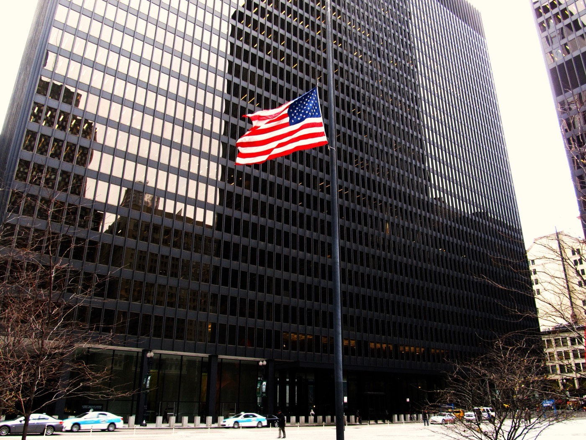

# 맥도날드 AI 가격 추천, 사흘 사이 세 문서가 엇갈린다

_일리노이 북부연방지법에 접수된 소비자 집단소송, 쟁점은 가맹점의 비공개 매출 자료를 한 추천 엔진에 모은 일_

## Executive Summary

> [!callout]
> 이 글은 2026년 9월 말 사흘 사이에 나온 세 개의 문서를 나란히 놓고 읽는다. 9월 29일 로이터가 맥도날드의 가격 추천 엔진을 취재해 실었고, 10월 1일 맥도날드가 "AI는 맥도날드의 메뉴 가격을 정하지 않는다"는 반박문을 냈고, 10월 2일 일리노이 북부연방지법에 소비자 집단소송이 접수됐다. 셋이 같은 기계를 두고 서로 다른 말을 한다.

> 세 문서를 겹쳐 놓으면 다툼의 초점이 "누가 합의했나"가 아니라 "어떤 자료가 어디로 흘렀나"에 놓여 있다. 소장은 프랜차이즈 공개문서를 인용해, 본사가 가맹점에 자사 판매시점관리 시스템 사용을 의무화하고 거래 단위 기록을 본사 서버로 받으면서 가맹점끼리의 공개는 금지한다고 적는다. 그 두 조항을 묶어 소장이 내린 결론은 본사가 한 가맹점의 자료를 경쟁 가맹점의 가격에 닿게 할 수 있는 유일한 통로라는 것이다. 맥도날드는 그 도구가 권고를 줄 뿐 값을 정하지 않으며 사람이 최종 결정을 내린다고 반박했다.

> 여기까지가 세 문서가 적은 것이고, 여기서부터는 이 글이 그것을 데이터 파이프라인의 조건으로 읽은 해석이다. "남의 숫자를 모델에 어디까지 넣어도 되나"라는 질문에는 이미 숫자가 적힌 답이 있다. 그것도 세 번째 판본이다. 1996년에 미국 경쟁당국이 공동으로 적은 안전지대가 자료의 나이를 석 달로 적었고, 2023년에 두 기관이 기계학습의 발전을 이유로 그 안전지대를 거둬들였고, 2025년 임대주택 사건의 동의명령이 열두 달로 다시 적었다. 이 글은 엔진이 값을 올렸는지 내렸는지를 판정하지 않는다. 보는 것은 무엇이 모델에 들어갔는가다.

<!-- stat-card -->
**3개월 → 12개월** — 경쟁사 비공개 자료를 모델에 넣기 전 기다리라고 적힌 시간 — 1996년 미 법무부·연방거래위원회 공동 안전지대와 2025년 RealPage 동의명령의 값. 사이에 폐기가 한 번 있었다

<!-- stat-card -->
**95%** — 미국 맥도날드 매장 가운데 별개 법인이 소유·운영하는 비율 — FY2025 10-K 기준 미국 매장 13,706개. 수평 담합은 경쟁자 사이에서만 성립한다

<!-- stat-card -->
**+28%** — 두 경쟁자가 모두 알고리즘 가격을 채택한 시장의 마진 상승폭 — 독일 주유소 실증. 한쪽만 채택한 시장에서는 유의한 변화가 없었다(Assad 외, JPE 2024)

<!-- stat-card -->
**약 90%** — 호텔들이 알고리즘 권고를 따랐다고 주장된 비율 — Cornish-Adebiyi 사건. 거부·무효화 권한이 있었다는 사실은 각하 사유가 되지 않았다

## 사흘 사이에 나온 세 문서

2026년 9월 29일 로이터가 "Inside McDonald's push to have AI price your Big Mac"를 실었다. 기사는 취재 방법을 본문에 밝힌다. 가맹점주가 쓰는 가격 엔진 화면을 8월에 찍은 스크린샷으로 검토했고, 이 전략을 직접 아는 취재원 아홉 명을 인터뷰했다는 것이다. 기사의 요지는 맥도날드가 기계학습 알고리즘으로 미국 내 1만 4천여 매장의 일일 거래 수백만 건을 계속 분석해 매장별·품목별로 회사가 "최적 가격"이라 부르는 값을 만든다는 것이고, 화면에는 "Your restaurant is showing MEDIUM SENSITIVITY to Price"(이 매장은 가격에 중간 정도로 민감하게 반응한다) 같은 메시지가 뜬다.

이틀 뒤인 10월 1일, 맥도날드가 "Separating Fact from Fiction: AI Does Not Set Prices at McDonald's"라는 제목의 문서를 자사 사이트에 올렸다. 소문과 사실을 여섯 쌍으로 짝지어 반박하는 형식이고, 맺음말은 한 문장이다.

"AI는 맥도날드의 메뉴 가격을 정하지 않는다. 사람이 정한다."
                        원문: "AI does not set McDonald's menu prices. People do." (McDonald's, 2026-10-01)

그 다음 날인 10월 2일, 일리노이 북부연방지법에 소비자 집단소송이 접수됐다. **Thomas v. McDonald's USA, LLC**, 사건번호 1:26-cv-12149이고 피고는 맥도날드 USA와 맥도날드 코퍼레이션 두 곳이다. 본문에 단락이 132개까지 매겨져 있고, 청구는 넷이다. 셔먼법 제1조 위반이 둘(가격 고정과 정보 교환), 일리노이 반독점법 위반이 하나, 일리노이 소비자사기·기만적 거래행위법 위반이 하나다. 배심 재판을 청구했다.

*▲ 소장이 접수된 일리노이 북부연방지법(시카고)의 연방 청사 | Source: [Wikimedia Commons](https://commons.wikimedia.org/wiki/File:Dirksen_United_States_Courthouse,_Chicago_Loop,_Chicago,_Illinois_(11004376983).jpg)*

이 사건의 규모부터 짚는다. 맥도날드가 증권거래위원회에 낸 FY2025 연차보고서 기준으로 미국 매장은 13,706개이고, 그중 95%를 본사가 소유하지 않은 별개 법인이 소유·운영한다. 한 엔진이 권고를 보내는 상대가 그만큼이고, 수평 담합은 경쟁자 사이에서만 성립하므로 그 95%라는 비율이 이 소송의 출발 조건이다.

세 문서의 순서가 중요하다. 소장은 사실관계의 뼈대를 로이터 기사에서 가져왔고, 그 사실을 스스로 적는다. 소장 ¶79는 맥도날드가 가격 결정에 이 도구를 쓴다는 사실이 "로이터가 2026년 9월 29일 그것을 설명하는 기사를 낼 때까지 널리 알려지지 않았다"고 적는다. 로이터 기사에 각주를 달아 인용한 단락이 ¶49·55·57·58·59·62·64로 여럿이다. 즉 이 사건의 출발점은 소장이 아니라 사흘 앞선 취재다. 이 글이 소장·로이터 기사·반박문 세 문서의 원문을 각각 열어 놓고 읽는 이유가 거기에 있다.

아래 타임라인은 세 문서가 나오기까지의 자취다. 2019년 인수부터 2026년 1월 기준 변경까지는 배경이고, 굵게 표시한 열흘이 이 글이 읽는 구간이다.
