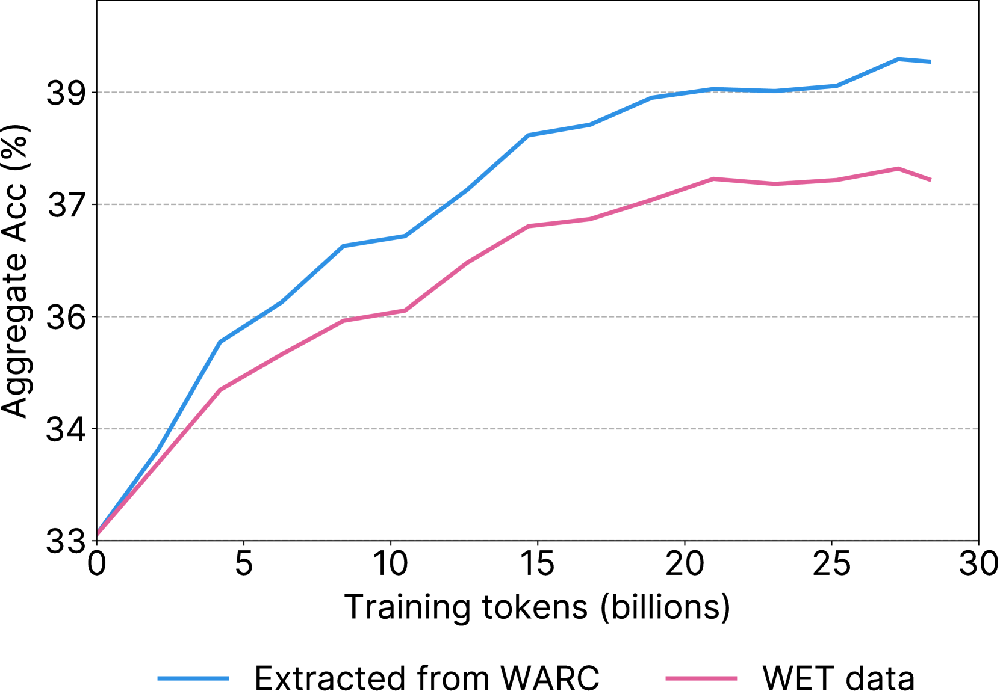

# They Called It 

_Microsoft marketed its MAI models as trained on _

## Executive Summary

> [!callout]
> In June 2026, Microsoft introduced its new reasoning model, MAI-Thinking-1, as trained "exclusively on clean, enterprise-grade data, without distillation from third-party models." Its Build 2026 keynote went further, promising a "commercially licensed data lineage." Yet the technical report the same company released days later listed, alongside its own web crawl, pages pulled from Common Crawl as part of the training corpus. A marketing sentence and a technical document collided inside a single company.

> The point is not that Microsoft lied. In a world where 64% of major LLMs rely on Common Crawl, MAI's practice is closer to the norm than to the exception. The real problem is that "clean" was a claim no one could prove. "Clean data" has no agreed definition, and without infrastructure to record and verify data lineage, even the world's largest software company can be tripped up by its own technical document.

> And that claim is getting more expensive. The EU AI Act mandates disclosure of training data starting August 2026, and Anthropic settled for $1.5 billion for taking data provenance lightly. So this report converges on a single question: when your company says "our data is clean," what can you point to as proof?

<!-- stat-card -->
**24.2B** — Common Crawl pages in MAI's training corpus — The point that clashed with "clean, licensed" marketing

<!-- stat-card -->
**64%** — Major LLMs that relied on Common Crawl — MAI is the industry norm, not the exception

<!-- stat-card -->
**81.3%** — Best-in-class post-hoc training-data detection accuracy — ~19% missed — the ceiling of "proving after the fact"

<!-- stat-card -->
**3% of revenue** — EU AI Act GPAI penalty ceiling — Enforced Aug 2026 — clean becomes a legal duty

## One Company, Two Sentences

The episode begins simply. Microsoft introduced a new model and stressed the innocence of its training data; a technical report from the same company wrote that the data included Common Crawl. Place the two documents side by side and the difference in intensity is striking. The marketing asserts the data is "clean and commercially licensed," while the body of the technical report uses a far more cautious phrase: data that is "publicly available and licensed/acquired."

| Source | How the data is described | Intensity |
| --- | --- | --- |
| Build 2026 keynoteMustafa Suleyman | "enterprise-grade, clean, and commercially licensed data lineage ... ship to production with full confidence" | Strongest |
| Technical report abstract | "exclusively on clean, enterprise-grade data, without distillation from third-party models" | Strong |
| Technical report bodyAppendix B.1 | "publicly available and licensed/acquired data" + 24.2B Common Crawl pages included | Weak |

****

Within one company, the language weakens from keynote → abstract → body. Source: MAI-Thinking-1 Technical Report, Build 2026 keynote, Simon Willison (2026-06-02).

The first to flag the conflict was developer and technology commentator Simon Willison. Reading Microsoft's announcement alongside the technical report, he noted that "data advertised as licensed includes Common Crawl," and The Decoder and MLQ.ai followed. What is telling is that Microsoft did not hide the fact. The use of Common Crawl was clearly written into the body of the technical report. The problem was not concealment but the gap in language.

### 1.1. What the training corpus actually contained

The data pipeline described in the technical report has two branches. One is Microsoft's own web crawl; the other is Common Crawl. Both pass through multiple stages of filtering before entering training, and the point that collides with the marketing is unmistakable: the 24.2 billion pages drawn from Common Crawl.

Own web crawl (respects robots.txt)

1.2T pages collected→794B after refining

Common Crawl

300B+ cumulative captures→100B unique→24.2B in training

The own crawl and Common Crawl together form the training corpus. Mixed into the data the marketing called "clean, licensed" were 24.2 billion Common Crawl pages. Source: MAI-Thinking-1 Technical Report, Appendix B.1.

> [!callout]
> The essence of the conflict is not a lie but an absence of proof. Microsoft did not hide its use of Common Crawl. What it lacked was a lineage record to back up the words "clean" and "commercially licensed." The real problem is less that the company used Common Crawl, and more that it had no way to prove the data was actually clean.

## The Trap in the Words 'Clean Data'

When we hear "clean data," we picture something verified. Yet machine learning has no agreed definition of the term. Clean, licensed, enterprise-grade are all, in practice, marketing words. Even ISO/IEC 5259, the international standard for data quality, defines quality not as an absolute bar but as a "context-dependent characteristic." The same data can be clean for one purpose and unfit for another.

So the first thing to clear up is the misunderstanding around Common Crawl. Common Crawl is not dirty data. It is a nonprofit archive that has crawled the open web while respecting robots.txt, and at more than 300 billion cumulative pages it serves as a de facto standard for research and industry. Microsoft, too, specified a crawl that respects robots.txt. The problem is not dirtiness but opacity — the inability to prove, page by page, where each individual page came from and under what license.

The Decoder
                            "Microsoft does exactly what every other AI company does, yet sells its own training data as uniquely 'clean.' It isn't."

### 2.1. MAI is the norm, not the exception

If reliance on Common Crawl were unique to MAI, this would be an article condemning one company. The data says the opposite. Of 47 major LLMs released between 2019 and 2023, 64% — 30 of them — used datasets derived from Common Crawl. Drill into individual models and the dependence runs higher still.

Falcon (RefinedWeb)84%

GPT-3~80%

OLMo78.7%

LLaMA 1 (+C4)67%

Industry avg (47)64%

Major LLMs' dependence on Common Crawl (including derivatives). Even "refined" open datasets such as FineWeb, RedPajama2, and Dolma trace back to Common Crawl as their source. Source: ACM FAccT 2024 (Mozilla), FineWeb (arXiv:2406.17557).

Note the trap in the word "refined." Datasets like FineWeb (15 trillion tokens), RedPajama2 (20 trillion tokens), and Dolma are all promoted as "clean" data that has passed heavy filtering and deduplication. But before refinement, the source is, without exception, Common Crawl. No amount of processing changes where the data came from. Clean processing does not amount to clean lineage.

*▲ How you extract from Common Crawl matters — direct WARC extraction (blue) consistently outperforms standard WET files (orange) in downstream model performance. FineWeb, RedPajama, Dolma and similar "refined" datasets all trace back to Common Crawl as their source. | Source: [Penedo et al., FineWeb (arXiv:2406.17557)](https://arxiv.org/abs/2406.17557)*

### 2.2. Provenance vs. lineage: telling two words apart

To prove that data is "clean," you must record two things: provenance and lineage. The two are often used interchangeably, but they point to different objects. Provenance is the question of origin — "where did this data come from?" Lineage is the question of history — "what path did the data travel from collection to training?"

| Concept | Core question | What gets recorded |
| --- | --- | --- |
| Provenance (origin) | Where did this data come from? | Source site, rights holder, license, consent status |
| Lineage (history) | What path did it travel into training? | Processing history: collection → filter → transform → training |

To prove "clean," both provenance and lineage must be on record. Either one alone is not enough.

*▲ The W3C PROV standard defines the structural backbone for recording data provenance: Entity (data object), Activity (processing step), Agent (responsible party). The wasDerivedFrom, wasGeneratedBy, and used relationships capture both provenance and lineage in a verifiable graph. | Source: [W3C PROV-DM Primer (W3C Note, 2013)](https://www.w3.org/TR/prov-primer/)*

> [!callout]
> The problem is not the data itself but the absence of what we can prove about it. It is not that Common Crawl is dirty; it is that its origin is opaque and there is no lineage recording that origin, so "clean" cannot be substantiated. Even refined datasets trace back to Common Crawl, and clean processing does not create clean lineage.

## The Engineering of Proof — Making Lineage Verifiable

Could we not simply work out, after the fact, what data a model was trained on? Academia has long wrestled with this question. The leading method is the membership inference attack (MIA), which reverse-engineers, from a model's responses, whether a particular piece of data was used in training. Yet even the most advanced techniques have a clear ceiling.

AUROC 81.3% detected

18.7% missed

Training-data detection accuracy of the state-of-the-art Active Reconstruction technique (ICLR 2025). It misses roughly one in five. Not accurate enough for legal proof.

The best technique presented at ICLR 2025 reaches AUROC 81.3% — meaning it misses close to one in five. A more decisive verdict comes from the title of a paper published the same year: "Membership Inference Attacks Cannot Prove that a Model Was Trained On Your Data." Post-hoc inference is evidence of possibility, not proof that would stand in court.

*▲ Membership inference attack ROC curves by model size (10M to 1018M parameters). AUC values cluster between 0.55 and 0.70 — only marginally better than chance — illustrating why post-hoc detection cannot serve as legal proof of training data membership. | Source: [Zhang et al., arXiv:2505.18773](https://arxiv.org/abs/2505.18773)*

Here the conclusion flips. If proving cleanliness after the fact is technically hard, then lineage must be recorded at the very moment data enters the pipeline. Proof is not something you dig up later; it is something you plant at the start. The tools to make that shift already exist, and there are several.

### 3.1. Four tools for planting proof at design time

Recording origin and processing history together from the moment data is collected has become a standard canon in the field. Four approaches secure provability at design time, without leaning on post-hoc inference.

| Tool | What it does | What it proves |
| --- | --- | --- |
| Datasheets for Datasets | Document a dataset's motivation, composition, collection, preprocessing | How the data was made |
| Data Cards / Model Cards | Structure origin, intended use, and limits as metadata | Context for responsible use |
| Data watermarking | Embed an identifying signal in data before training | Membership, provable in advance |
| C2PA content credentials | Record creation/edit history with cryptographic signatures | Authenticity of origin and history of edits |

****

Design-time proof tools. Datasheets (Gebru et al.), Data Cards (Pushkarna et al.), data watermarking (Wei et al. ACL 2024, STAMP), C2PA v2.3 (6,000+ company coalition).

*▲ STAMP's two-stage watermarking approach: Stage 1 generates watermarked paraphrases using public and private keys (public version released, private versions kept secret); Stage 2 applies a statistical test to the target model to verify training data membership. The proof is planted before training — not excavated afterward. | Source: [Rastogi et al., STAMP (arXiv:2504.13416)](https://arxiv.org/abs/2504.13416)*

No single tool is a cure-all, though. Data watermarking only works if the signal is planted before training, so it cannot be applied retroactively to data already collected. C2PA, likewise, holds only on the premise that metadata is preserved; if content is transcoded and the metadata is stripped, the chain of proof breaks. They are best understood not as a single solution but as overlapping safeguards that distribute provability across the entire data lifecycle.

> [!callout]
> Post-hoc proof stops at 81.3%. The most advanced membership inference still misses one in five, and the field has stated flatly that it cannot serve as legal proof. The conclusion is clear: lineage must be planted the moment data enters the pipeline. Proof is not excavated — it is designed.

## Regulation Is Catching Up — In Documents, Not Words

Until recently, data lineage was a technical and ethical recommendation. That picture is changing fast. We have entered an era in which data provenance becomes evidence in court. "Clean" is no longer a marketing line but a claim that must be defended before regulators and judges.

2025.08EU AI Act GPAI obligations take effect — a "sufficiently detailed public summary" of training content is required

2025.09Bartz v. Anthropic $1.5B settlement — the largest copyright-training dispute to date

2026.01South Korea's AI Basic Act takes effect — the world's second comprehensive AI law, with fair-use guidelines for training data

2026.08EU AI Act GPAI fines begin — up to €15M or 3% of global revenue for violations

A regulatory and litigation timeline around data provenance. The center of gravity is shifting from recommendation to obligation, from ethics to law.

The most direct pressure is EU AI Act Article 53. Providers of general-purpose AI (GPAI) models must publish a sufficiently detailed summary of the content used in training, and from August 2, 2026, violations carry fines. The ceiling is €15 million or 3% of global annual revenue. Applied naively to revenue at Microsoft's scale, the theoretical maximum reaches into the billions of dollars — not an amount that would actually be levied, but a figure that conveys the weight of the rule.

### 4.1. The price tag for taking provenance lightly

If regulation is abstract, litigation has attached a concrete price tag. In September 2025, Anthropic settled a copyright dispute with authors for $1.5 billion — roughly $3,000 per book, across some 500,000 works. In that case, Judge Alsup drew an important line. Training on legally acquired data may be fair use, but copying pirated material is "inherently, irredeemably infringing." Whether the source is legal or not decides the size of the liability. The New York Times' suit against OpenAI and Microsoft is proceeding along the same axis.

Standardization is moving the same way. The ISO/IEC 5259 series for data quality produced the world's first certification in November 2025, and ISO/IEC 42001, the AI management system standard, is taking hold. Three forces — regulation, litigation, and standards — point at the same spot: you must be able to prove where your data came from.

> [!callout]
> Data provenance is becoming courtroom evidence. The EU AI Act enforces training-data disclosure with fines of up to 3% of revenue from August 2026, and Anthropic's $1.5 billion settlement put a number on the cost of taking provenance lightly. Clean by assertion does not hold up. Only clean you can prove survives.

## Is Your Company's Data Provable?

If even Microsoft was tripped up by its own technical document, smaller companies are more exposed. The moment regulators, customers, and investors demand "prove the provenance of your model's training data" is not far off. Whether you train your own model, fine-tune a foundation model, or pull external data through RAG, you are not free of the duty to trace provenance. The crux is one thing: don't try to prove it later — plant the proof at design time.

Adobe Firefly makes a useful counterpoint. Firefly states that it trained on Adobe Stock, explicitly licensed content, and public-domain material, and it pays bonuses to the contributors who supplied the data. Who contributed what, when, and under which license is tracked by contract. 73% of users rated the clarity of its licensing positively, and more than 75% of the Fortune 500 have adopted it. The difference between Firefly and MAI is not that the data is cleaner, but whether the infrastructure of proof exists.

| Axis | Adobe Firefly | MAI-Thinking-1 |
| --- | --- | --- |
| Data source | Adobe Stock · licensed · public domain | "Clean, licensed" claim + 24.2B Common Crawl |
| Contributor compensation | Bonuses paid (traceable by contract) | None |
| Proof infrastructure | Who, when, under which license — traceable | No lineage record |

Provability becomes a trust premium. The difference is not data quality but the presence or absence of proof infrastructure. Source: Adobe official announcements, MAI Technical Report.

### 5.1. A design-time proof checklist

So what should you actually do? From the moment data enters to the moment it is used in training, here is a practical frame for planting provability at each stage. Don't try to dig it all up at the end — the key is to leave a record at every step.

CollectionAt the point of intake, record provenance, license, and consent as metadata alongside the data. Bind the site URL, rights holder, license type, and robots.txt compliance so they are inseparable from the data.

DocumentationWrite a Datasheet or Data Card for every dataset. Structure the motivation, composition, collection method, preprocessing, and known limits so a third party can verify how the data was made.

ProcessingTrace the path from collection through filtering, transformation, and training as a lineage graph. Recording which filter removed what is what makes the refinement history of "refined data" itself provable.

Pre-proofWhere possible, apply data watermarking before training so membership can be proven in advance. Content carrying C2PA credentials preserves that chain.

> [!callout]
> Provable data is not made by accident. Only when you plant a record at each stage — collection, documentation, processing, pre-proof — does "our data is clean" become a verifiable claim. What Microsoft failed to do was not to use clean data, but to record that cleanliness from the very start.

## Why Pebblous Is Watching This Episode

Pebblous has consistently argued one proposition: data must be diagnosed and verified before it is used. The MAI episode demonstrated that proposition through the self-contradiction of the world's largest software company. One incident proved, in full, the sentence "clean data is the result of diagnosis, not a declaration."

### Data quality becomes a model's DNA

Once 24.2 billion pages enter the model weights, their origin, license, and bias are permanently imprinted in the model's internal representations. Saying "it was licensed" after the fact cannot reverse the weights, and even the best inference techniques detect only 81% of it. This is the technical reason data quality must be decided before training. Lineage is a model's DNA, and DNA cannot be swapped out later.

### Implications for enterprise practice

Enterprise data teams will soon face the same question — the moment regulators, customers, and investors ask them to prove the provenance of their training data. To pull off what even Microsoft could not, small and mid-sized companies have no choice but to plant provenance in the pipeline from the very start. Data diagnosis and lineage tracing are the tools that make "design-time proof" possible rather than "proving it later." The checklist in Section 5 is the starting point.

### Provability as an asset

Estimates vary by research firm, but the data governance market is put in the billions of dollars and growing at roughly 16–22% a year. In 2025, Gartner for the first time treated data and analytics governance platforms as a standalone category. The same firm estimates that poor data quality costs organizations an average of $12.9 million a year. And by 2030, it projects, half of all organizations will automate data governance into machine-verifiable "data contracts." Verifying data provenance is not a niche but a market in formation. As Adobe Firefly showed, provable lineage becomes a trust premium and a differentiating asset.

> [!callout]
> **Editor's Note.** This report read the MAI episode through the lens of "clean data is proof, not declaration." The AI-Ready Data and DataClinic work Pebblous pursues sits at the point where data's origin and quality are diagnosed and recorded before it enters training — overlapping with the gap in "design-time proof" this piece identifies. That judgment, however, is for each reader to verify in their own context, and there is no need to read this article's conclusion as a claim of any single product's superiority.

## References

### Primary sources · the episode

- 1.Microsoft AI. "[MAI-Thinking-1 Technical Report](https://microsoft.ai/wp-content/uploads/2026/06/main_20260602_2.pdf)." microsoft.ai, 2026-06-02.
- 2.Microsoft AI. "Introducing MAI-Thinking-1." microsoft.ai, 2026-06-02.
- 3.Simon Willison. "[Microsoft's new MAI models](https://simonwillison.net/2026/Jun/2/microsofts-new-models/)." simonwillison.net, 2026-06-02.
- 4.The Decoder. "Microsoft trained its MAI models on unlicensed web data despite promising clean data." the-decoder.com, 2026-06.
- 5.MLQ.ai. "[Microsoft trained MAI models on Common Crawl data despite marketing clean pipeline](https://mlq.ai/news/v2/microsoft-trained-mai-models-on-common-crawl-data-despite-marketing-clean-licensed-training-pipeline/)." mlq.ai, 2026-06.

### Data documentation · lineage · datasets (academic)

- 6.Gebru, T. et al. "[Datasheets for Datasets](https://arxiv.org/abs/1803.09010)." Communications of the ACM, 2021 (arXiv:1803.09010).
- 7.Mitchell, M. et al. "[Model Cards for Model Reporting](https://arxiv.org/abs/1810.03588)." FAccT 2019 (arXiv:1810.03588).
- 8.Pushkarna, M. et al. "[Data Cards: Purposeful and Transparent Dataset Documentation](https://arxiv.org/abs/2204.01075)." FAccT 2022 (arXiv:2204.01075).
- 9.Baack, S. (Mozilla Foundation). "A Critical Analysis of the Largest Source for Generative AI Training Data: Common Crawl." ACM FAccT 2024.
- 10.Penedo, G. et al. "[The FineWeb Datasets: Decanting the Web for the Finest Text Data at Scale](https://arxiv.org/abs/2406.17557)." NeurIPS 2024 (arXiv:2406.17557).
- 11.Common Crawl. "Statistics of Common Crawl Monthly Archives." commoncrawl.github.io/cc-crawl-statistics.

### Membership inference · watermarking

- 12.Zhang, X. et al. "[Membership Inference Attacks Cannot Prove that a Model Was Trained On Your Data](https://arxiv.org/abs/2505.18773)." arXiv:2505.18773, 2025.
- 13."Learning to Detect Language Model Training Data via Active Reconstruction." ICLR 2025.
- 14.Wei, J. et al. "Proving Membership in LLM Pretraining Data via Data Watermarks." Findings of ACL 2024.
- 15.Rastogi et al. "[STAMP: Proving Dataset Membership via Watermarked Rephrasings](https://arxiv.org/abs/2504.13416)." arXiv:2504.13416, 2025.

### Regulation · litigation · standards · market

- 16.European Parliament and Council. "Regulation (EU) 2024/1689 — AI Act, Article 53." Official Journal, 2024.
- 17.EU AI Act Explorer. "Article 101: Fines for Providers of GPAI Models." artificialintelligenceact.eu.
- 18.WilmerHale. "European Commission Releases Mandatory Template for Public Disclosure of AI Training Data." wilmerhale.com, 2025.
- 19.Copyright Alliance. "What to Know About the Bartz v. Anthropic Settlement." copyrightalliance.org, 2025.
- 20.NPR. "Anthropic settlement with authors over copyright." npr.org, 2025-09.
- 21.SGS. "World's First ISO/IEC 5259-3 Certification for AI Data Quality Management." sgs.com, 2025-11.
- 22.Fortune Business Insights. "Data Governance Market Size, Share, Trends Analysis 2034." fortunebusinessinsights.com, 2025.
- 23.C2PA. "C2PA Specification v2.3." contentauthenticity.org, 2025-12.
- 24.Adobe. "Adobe Firefly: Designed to be commercially safe." adobe.com, 2024–2025.

<!-- stat-card -->
**🔗 Read together — the AI-Ready Data series** — For the practical frame of planting lineage in the pipeline, see the [Data Lineage framework](/blog/data-lineage-ai-pipeline/); for another precedent in training-data regulation, see [OpenAI · PIPEDA training-data regulation](/report/openai-pipeda-ai-training-data-regulation/). For the quality bar of AI-Ready Data, see [OpenMetadata and AI-Ready Data](/report/openmetadata-ai-ready-data-2026-04/).
