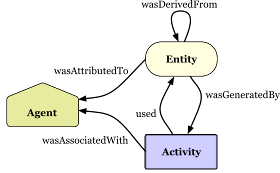
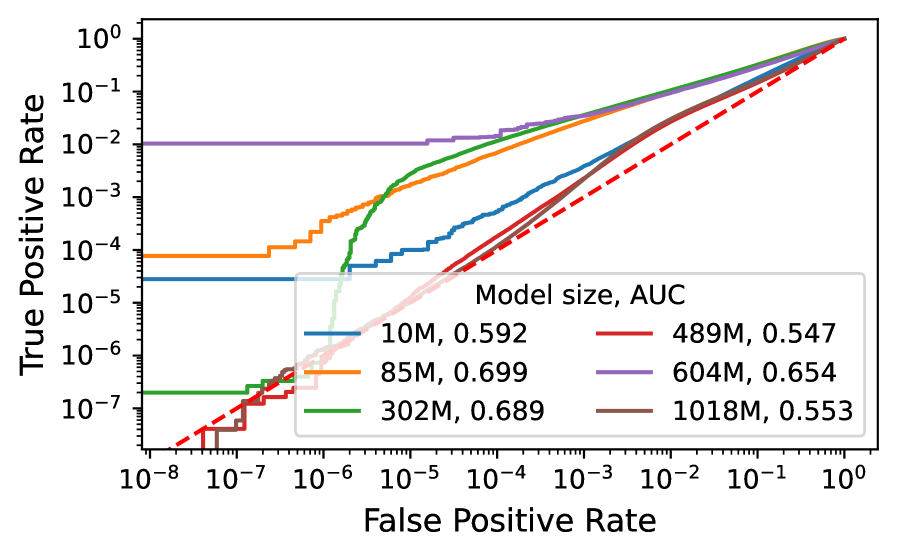
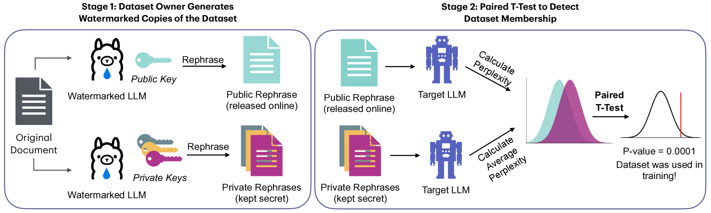

## Executive Summary

> [!callout]
> 2026년 6월, 마이크로소프트는 새 추론 모델 MAI-Thinking-1을 "깨끗하고(clean) 엔터프라이즈급이며 제3자 모델 증류가 없는 데이터로 학습했다"고 발표했다. Build 2026 키노트에서는 "상업적으로 라이선스된 데이터 계보(commercially licensed data lineage)"라는 표현까지 더했다. 그런데 같은 회사가 며칠 뒤 공개한 기술 보고서에는 자체 웹 크롤에 더해 Common Crawl에서 가져온 페이지가 학습 코퍼스로 명시돼 있었다. 마케팅 문장과 기술 문서가 한 회사 안에서 부딪힌 것이다.

> 핵심은 마이크로소프트가 거짓말을 했다는 것이 아니다. 업계 주요 LLM의 64%가 Common Crawl에 의존하는 현실에서 MAI의 관행은 예외가 아니라 표준에 가깝다. 진짜 문제는 "깨끗하다"는 말이 증명될 수 없는 선언이었다는 점이다. '클린 데이터'에는 합의된 정의가 없고, 데이터 계보를 기록하고 검증하는 인프라 없이는 세계 최대 소프트웨어 기업조차 자기 기술 문서에 발목을 잡힌다.

> 그리고 이 선언은 점점 더 비싸지고 있다. EU AI Act는 2026년 8월부터 학습 데이터 공개를 의무화하고, Anthropic은 데이터 출처를 가볍게 본 대가로 15억 달러에 합의했다. 그래서 이 보고서는 하나의 질문으로 수렴한다. 당신 회사가 "우리 데이터는 깨끗하다"고 말할 때, 그 문장을 무엇으로 증명할 수 있는가.

<!-- stat-card -->
**242억** — MAI 학습 코퍼스의 Common Crawl 페이지 — "클린·라이선스" 마케팅과 충돌한 지점

<!-- stat-card -->
**64%** — Common Crawl에 의존한 주요 LLM 비율 — MAI는 예외가 아니라 업계 표준

<!-- stat-card -->
**81.3%** — 최선단 사후 학습 데이터 탐지 정확도 — 약 19%는 놓치는 '사후 증명'의 한계

<!-- stat-card -->
**매출 3%** — EU AI Act GPAI 위반 과징금 상한 — 2026-08 집행 — 클린은 법적 의무가 된다

## 같은 회사, 두 개의 문장

사건의 출발은 단순하다. 마이크로소프트는 새 모델을 소개하며 학습 데이터의 결백함을 강조했고, 같은 회사가 펴낸 기술 보고서는 그 데이터에 Common Crawl이 들어 있다고 적었다. 두 문서를 나란히 놓으면 표현의 강도가 눈에 띄게 다르다. 마케팅은 "깨끗하고 상업적으로 라이선스됐다"고 단언하지만, 기술 보고서 본문은 "공개적으로 이용 가능하고 라이선스됐거나 취득한(publicly available and licensed/acquired)" 데이터라는 한결 조심스러운 표현을 쓴다.

| 출처 | 데이터에 대한 표현 | 강도 |
| --- | --- | --- |
| Build 2026 키노트Mustafa Suleyman | "enterprise-grade, clean, and commercially licensed data lineage ... 완전한 확신을 갖고 프로덕션에 투입" | 가장 강함 |
| 기술 보고서 Abstract | "exclusively on clean, enterprise-grade data, without distillation from third-party models" | 강함 |
| 기술 보고서 본문Appendix B.1 | "publicly available and licensed/acquired data" + Common Crawl 24.2B 페이지 포함 | 약함 |

****

한 회사 안에서 표현의 강도가 키노트 → Abstract → 본문 순으로 약해진다. 출처: MAI-Thinking-1 Technical Report, Build 2026 키노트, Simon Willison(2026-06-02).

이 충돌을 처음 짚은 사람은 개발자이자 기술 평론가인 Simon Willison이었다. 그는 마이크로소프트의 발표문과 기술 보고서를 나란히 읽고 "라이선스됐다고 광고한 데이터에 Common Crawl이 포함돼 있다"는 점을 지적했고, The Decoder와 MLQ.ai가 뒤를 이었다. 흥미로운 것은 마이크로소프트가 이 사실을 숨기지 않았다는 점이다. Common Crawl 사용은 기술 보고서 본문에 분명히 적혀 있었다. 은폐가 아니라 표현의 격차가 문제였다.

### 1.1. 학습 코퍼스는 실제로 어떻게 구성됐나

기술 보고서가 밝힌 데이터 파이프라인은 두 갈래다. 한쪽은 마이크로소프트가 직접 수집한 자체 웹 크롤이고, 다른 한쪽이 Common Crawl이다. 두 갈래 모두 여러 단계의 필터링을 거쳐 학습에 들어가는데, 마케팅 문장과 충돌하는 지점은 명확하다. Common Crawl에서 가져온 242억 페이지다.

자체 웹 크롤 (robots.txt 존중)

1.2조 페이지 수집→7,940억 정제

Common Crawl

누적 3,000억+ 캡처→고유 1,000억→학습 포함 242억

자체 크롤과 Common Crawl이 함께 학습 코퍼스를 이룬다. 마케팅이 "클린·라이선스"라고 부른 데이터에 242억 페이지의 Common Crawl이 섞여 있었다. 출처: MAI-Thinking-1 Technical Report, Appendix B.1.

> [!callout]
> 충돌의 본질은 거짓말이 아니라 증명의 부재다. 마이크로소프트는 Common Crawl 사용을 숨기지 않았다. 다만 "clean"과 "commercially licensed"라는 단어를 입증할 계보 기록이 없었다. Common Crawl을 썼다는 사실보다, 그 데이터가 정말 깨끗한지를 증명할 수단이 없다는 점이 진짜 문제다.

## '클린 데이터'라는 말의 함정

"클린 데이터"라는 표현을 들으면 우리는 무언가 검증된 상태를 떠올린다. 그런데 머신러닝 업계에는 이 단어의 합의된 정의가 없다. clean, licensed, enterprise-grade는 모두 사실상 마케팅 용어다. 데이터 품질의 국제 표준인 ISO/IEC 5259조차 품질을 절대 기준이 아니라 "맥락에 의존하는 특성"으로 정의한다. 같은 데이터가 한 용도에는 깨끗하고 다른 용도에는 부적합할 수 있다는 뜻이다.

그래서 Common Crawl을 둘러싼 오해부터 풀어야 한다. Common Crawl은 더러운 데이터가 아니다. robots.txt를 존중하며 공개 웹을 수집해 온 비영리 아카이브이고, 누적 3,000억 페이지가 넘는 규모로 연구와 산업에 표준처럼 쓰인다. 마이크로소프트도 robots.txt를 존중하는 크롤을 명시했다. 문제는 더러움이 아니라 불투명함이다. 그 안의 개별 페이지가 어디서 왔고 어떤 라이선스인지를 페이지 단위로 증명할 수 없다는 것이다.

The Decoder
                            "마이크로소프트는 다른 모든 AI 기업이 하는 일을 똑같이 하면서, 자사의 학습 데이터를 유독 '깨끗하다'고 판다. 그렇지 않다."

### 2.1. MAI는 예외가 아니라 표준이다

Common Crawl 의존이 MAI만의 일이라면 이 글은 한 회사를 단죄하는 글이 됐을 것이다. 그러나 데이터를 보면 정반대다. 2019년부터 2023년 사이 출시된 주요 LLM 47개 중 64%인 30개가 Common Crawl에서 파생된 데이터셋을 썼다. 개별 모델로 들어가면 의존도는 더 높다.

Falcon (RefinedWeb)84%

GPT-3~80%

OLMo78.7%

LLaMA 1 (+C4)67%

업계 평균(47개)64%

주요 LLM의 Common Crawl(파생 포함) 의존도. FineWeb·RedPajama2·Dolma 같은 "정제된" 오픈 데이터셋도 원본은 모두 Common Crawl이다. 출처: ACM FAccT 2024(Mozilla), FineWeb(arXiv:2406.17557).

주목할 점은 "정제"의 함정이다. FineWeb(15조 토큰), RedPajama2(20조 토큰), Dolma 같은 데이터셋은 모두 강력한 필터링과 중복 제거를 거친 "깨끗한" 데이터로 홍보된다. 그러나 정제 이전의 원본은 예외 없이 Common Crawl이다. 가공을 아무리 거쳐도 출처는 바뀌지 않는다. clean 처리가 곧 clean 계보를 뜻하지는 않는다.

*▲ Common Crawl을 어떻게 추출하느냐도 학습 품질에 영향을 미친다 — WARC 원본 직접 추출(파란)이 기본 WET 파일(주황)보다 일관되게 높은 성능을 보인다. FineWeb·RedPajama·Dolma 같은 "정제 데이터셋"의 원본은 예외 없이 Common Crawl이다. | Source: [Penedo et al., FineWeb (arXiv:2406.17557)](https://arxiv.org/abs/2406.17557)*

### 2.2. provenance와 lineage, 두 단어를 구분하기

'깨끗하다'를 증명하려면 두 가지를 기록해야 한다. 출처(provenance)와 계보(lineage)다. 둘은 자주 섞여 쓰이지만 가리키는 대상이 다르다. provenance는 "이 데이터가 어디서 왔는가"라는 원천의 질문이고, lineage는 "그 데이터가 수집에서 학습까지 어떤 경로를 거쳤는가"라는 이력의 질문이다.

| 구분 | 핵심 질문 | 기록 대상 |
| --- | --- | --- |
| Provenance (출처) | 이 데이터는 어디서 왔는가 | 원천 사이트·저작권자·라이선스·동의 여부 |
| Lineage (계보) | 어떤 경로를 거쳐 학습에 들어갔는가 | 수집 → 필터 → 변환 → 학습의 처리 이력 |

"깨끗하다"를 증명하려면 출처와 계보가 모두 기록돼야 한다. 둘 중 하나만으로는 부족하다.

*▲ W3C PROV 표준이 정의하는 데이터 계보의 핵심 개념: Entity(데이터 개체)·Activity(처리 활동)·Agent(행위자). wasDerivedFrom·wasGeneratedBy·used 관계가 provenance와 lineage를 기록하는 구조적 뼈대가 된다. | Source: [W3C PROV-DM Primer (W3C Note, 2013)](https://www.w3.org/TR/prov-primer/)*

> [!callout]
> 문제는 데이터 자체가 아니라, 데이터에 대해 우리가 증명할 수 있는 것의 부재다. Common Crawl이 더러워서가 아니라 출처가 불투명해서, 그리고 그 출처를 기록한 계보가 없어서 "클린"을 입증할 수 없다. 정제된 데이터셋조차 원본은 Common Crawl이며, clean 처리가 clean 계보를 만들어 주지는 않는다.

## 증명의 기술 — 계보를 검증 가능하게

그렇다면 모델이 어떤 데이터로 학습됐는지 사후에 알아내면 되지 않을까. 학계는 오랫동안 이 질문에 매달려 왔다. 대표적 방법이 멤버십 추론 공격(Membership Inference Attack)이다. 특정 데이터가 학습에 쓰였는지를 모델의 반응으로 역추정하는 기법이다. 그런데 가장 발전된 기법조차 한계가 분명하다.

AUROC 81.3% 탐지

18.7% 놓침

최선단 Active Reconstruction 기법의 학습 데이터 탐지 정확도(ICLR 2025). 약 5건 중 1건을 놓친다. 법적 증명에는 부족한 정확도다.

2025년 ICLR에서 발표된 최선단 기법의 정확도는 AUROC 81.3%다. 다섯 건 중 한 건 가까이 놓친다는 뜻이다. 더 결정적인 진단은 같은 해 나온 한 논문의 제목이 그대로 말해 준다. "멤버십 추론 공격은 모델이 당신의 데이터로 학습됐음을 증명할 수 없다(Membership Inference Attacks Cannot Prove that a Model Was Trained On Your Data)." 사후 추론은 가능성의 증거일 뿐, 법정에서 통하는 증명이 되지 못한다.

*▲ 모델 크기별 멤버십 추론 공격 ROC 곡선. 10M~1018M 파라미터 모델 모두에서 AUC가 0.55~0.70 수준에 그쳐, "우연보다 조금 나은" 탐지 능력을 보인다. 사후에 학습 데이터를 증명하는 일이 왜 법적으로 불충분한지를 수치로 보여준다. | Source: [Zhang et al., arXiv:2505.18773](https://arxiv.org/abs/2505.18773)*

여기서 결론이 뒤집힌다. 사후에 깨끗함을 증명하는 일이 기술적으로 어렵다면, 계보는 데이터가 파이프라인에 들어오는 그 순간에 기록돼야 한다. 증명은 나중에 캐내는 것이 아니라 처음에 심는 것이다. 이 전환을 가능하게 하는 도구는 이미 여럿 나와 있다.

### 3.1. 설계 단계에 증명을 심는 네 가지 도구

데이터를 수집하는 순간부터 출처와 처리 이력을 함께 기록하는 방법은 학계의 표준 캐논으로 자리 잡았다. 사후 추론에 기대지 않고 설계 단계에서 증명 가능성을 확보하는 네 가지 접근은 다음과 같다.

| 도구 | 무엇을 하나 | 증명하는 것 |
| --- | --- | --- |
| Datasheets for Datasets | 데이터셋의 동기·구성·수집·전처리를 문서화 | 데이터가 어떻게 만들어졌는가 |
| Data Cards / Model Cards | 출처·용도·한계를 메타데이터로 구조화 | 책임 있는 사용을 위한 맥락 |
| 데이터 워터마킹 | 학습 전 데이터에 식별 신호 삽입 | 이후 소속 여부를 사전에 증명 가능 |
| C2PA 콘텐츠 자격증명 | 콘텐츠 생성·편집 이력을 암호 서명으로 기록 | 출처의 진위와 변형 이력 |

****

설계 단계 증명 도구. Datasheets(Gebru et al.)·Data Cards(Pushkarna et al.)·데이터 워터마킹(Wei et al. ACL 2024, STAMP)·C2PA v2.3(6,000+ 기업 연합).

*▲ STAMP 워터마킹 2단계: Stage 1에서 공개·비공개 키로 파라프레이즈된 사본을 생성하고(공개본은 배포, 비공개본은 보관), Stage 2에서 대상 모델에 통계 검정을 적용해 학습 데이터 소속 여부를 증명한다. 학습 전에 신호를 심어야 사후 증명이 가능하다는 설계 철학의 구현체다. | Source: [Rastogi et al., STAMP (arXiv:2504.13416)](https://arxiv.org/abs/2504.13416)*

다만 어느 도구도 만능은 아니다. 데이터 워터마킹은 학습 전에 신호를 심어야만 작동하므로, 이미 수집된 데이터에는 소급 적용이 불가능하다. C2PA 역시 메타데이터가 보존된다는 전제 위에서만 유효해서, 콘텐츠가 트랜스코딩되며 메타데이터가 떨어져 나가면 증명 체인이 끊긴다. 그래서 이들은 단일 해법이 아니라, 데이터 수명주기 전체에 증명 가능성을 분산해 심는 겹겹의 장치로 이해해야 한다.

> [!callout]
> 사후 증명은 81.3%에서 멈춘다. 가장 발전된 멤버십 추론도 다섯 건 중 하나를 놓치고, 학계는 그것이 법적 증명이 될 수 없다고 못 박았다. 결론은 분명하다. 계보는 데이터가 파이프라인에 들어오는 순간 심어야 한다. 증명은 캐내는 것이 아니라 설계하는 것이다.

## 규제가 따라온다 — 말이 아니라 문서로

지금까지는 데이터 계보가 기술적·윤리적 권장 사항이었다. 그러나 이 그림이 빠르게 바뀌고 있다. 데이터 출처가 법정 증거가 되는 시대로 들어선 것이다. '클린'은 더 이상 마케팅 카피가 아니라, 규제기관과 법원 앞에서 방어해야 하는 주장이 됐다.

2025.08EU AI Act의 GPAI 의무 발효 — 학습 콘텐츠의 "충분히 상세한 공개 요약" 요구

2025.09Bartz v. Anthropic 15억 달러 합의 — 저작권 학습 분쟁 역대 최대 규모

2026.01한국 AI 기본법 시행 — 세계 두 번째 포괄 AI 법, 학습데이터 공정이용 가이드라인 동반

2026.08EU AI Act GPAI 벌금 집행 시작 — 위반 시 €1,500만 또는 글로벌 매출 3%

데이터 출처를 둘러싼 규제·소송 타임라인. 권장에서 의무로, 윤리에서 법으로 무게중심이 옮겨가고 있다.

가장 직접적인 압력은 EU AI Act Article 53이다. 범용 AI 모델(GPAI) 제공자는 학습에 사용한 콘텐츠의 충분히 상세한 요약을 공개해야 하고, 2026년 8월 2일부터는 위반에 벌금이 집행된다. 상한은 1,500만 유로 또는 글로벌 연매출의 3%다. 마이크로소프트 규모의 매출에 단순 대입하면 이론적 최대치는 수십억 달러에 이르는데, 이는 실제 부과액이 아니라 규제의 무게를 가늠하기 위한 수치다.

### 4.1. 출처를 가볍게 본 가격표

규제가 추상적이라면, 소송은 구체적인 가격표를 붙였다. 2025년 9월 Anthropic은 작가들과의 저작권 분쟁에서 15억 달러에 합의했다. 도서 한 권당 약 3,000달러, 50만 건 규모다. 이 사건에서 Alsup 판사는 중요한 구분선을 그었다. 합법적으로 취득한 데이터로 학습하는 것은 공정 이용일 수 있지만, 해적판을 복제해 쓰는 것은 "본질적으로, 돌이킬 수 없이 침해(inherently, irredeemably infringing)"라는 것이다. 출처가 합법인지 아닌지가 곧 책임의 크기를 가른다. NYT가 OpenAI·마이크로소프트를 상대로 제기한 소송도 같은 축에서 진행 중이다.

표준화도 같은 방향으로 움직인다. 데이터 품질을 다루는 ISO/IEC 5259 시리즈는 2025년 11월 세계 최초 인증 사례를 냈고, AI 경영시스템 표준인 ISO/IEC 42001도 자리를 잡아 가고 있다. 규제·소송·표준이라는 세 갈래가 동시에 한 곳을 가리킨다. 데이터 출처를 증명할 수 있어야 한다는 것이다.

> [!callout]
> 데이터 출처가 법정 증거가 된다. EU AI Act는 2026년 8월부터 학습 데이터 공개를 매출 3% 과징금으로 강제하고, Anthropic의 15억 달러 합의는 출처를 가볍게 본 대가를 숫자로 보여줬다. 말로 한 클린은 방어되지 않는다. 증명할 수 있는 클린만 살아남는다.

## 당신 회사의 데이터는 증명 가능한가

마이크로소프트조차 자기 기술 문서에 발목이 잡혔다면, 그보다 작은 기업은 더 취약하다. 규제기관·고객·투자자가 "당신 모델의 학습 데이터 출처를 증명하라"고 요구하는 순간은 멀지 않다. 자체 모델을 학습하든, 파운데이션 모델을 파인튜닝하든, RAG로 외부 데이터를 끌어오든, 출처 추적의 의무에서 자유롭지 않다. 핵심은 하나다. 나중에 증명하려 하지 말고, 설계 단계에 증명을 심는 것이다.

Adobe Firefly가 좋은 대조군이다. Firefly는 Adobe Stock, 명시적으로 라이선스된 콘텐츠, 퍼블릭 도메인 자료로 학습했다고 밝히고, 데이터를 제공한 컨트리뷰터에게 보너스를 지급한다. 누가 언제 어떤 라이선스로 기여했는지가 계약으로 추적된다. 사용자의 73%가 라이선싱의 명확성을 긍정적으로 평가했고, Fortune 500의 75% 이상이 이를 채택했다. Firefly와 MAI의 차이는 데이터가 더 깨끗해서가 아니라, 증명 인프라가 있느냐 없느냐다.

| 축 | Adobe Firefly | MAI-Thinking-1 |
| --- | --- | --- |
| 데이터 출처 | Adobe Stock·라이선스·퍼블릭 도메인 | "클린·라이선스" 주장 + Common Crawl 242억 |
| 컨트리뷰터 보상 | 보너스 지급(계약 추적 가능) | 없음 |
| 증명 인프라 | 누가·언제·어떤 라이선스로 추적 가능 | 계보 기록 부재 |

증명 가능성이 곧 신뢰 프리미엄이 된다. 차이는 데이터 품질이 아니라 증명 인프라의 유무다. 출처: Adobe 공식 발표, MAI 기술 보고서.

### 5.1. 설계 단계 증명 체크리스트

그래서 무엇을 해야 하는가. 데이터가 들어오는 순간부터 학습에 쓰이기까지, 각 단계에서 증명 가능성을 심는 실무 프레임은 다음과 같다. 사후에 한꺼번에 캐려 하지 말고, 단계마다 기록을 남기는 것이 핵심이다.

수집 단계데이터가 들어오는 시점에 출처·라이선스·동의 여부를 메타데이터로 함께 기록한다. 사이트 URL, 저작권자, 라이선스 유형, robots.txt 준수 여부를 데이터와 분리되지 않게 묶는다.

문서화 단계데이터셋마다 Datasheet 또는 Data Card를 작성한다. 동기·구성·수집 방법·전처리·알려진 한계를 구조화해, 데이터가 어떻게 만들어졌는지 제3자가 검증할 수 있게 한다.

처리 단계수집에서 필터·변환·학습까지의 경로를 lineage 그래프로 추적한다. 어떤 필터가 무엇을 걸러냈는지가 기록돼야, "정제된 데이터"의 정제 이력 자체가 증명 가능해진다.

사전 증명 단계가능한 경우 학습 전에 데이터 워터마킹을 적용해, 이후 소속 여부를 사전에 증명할 수 있게 한다. C2PA 자격증명이 붙은 콘텐츠는 그 체인을 보존한다.

> [!callout]
> 증명 가능한 데이터는 우연히 만들어지지 않는다. 수집·문서화·처리·사전 증명의 각 단계에 기록을 심을 때 비로소 "우리 데이터는 깨끗하다"가 검증 가능한 주장이 된다. 마이크로소프트가 못 한 일은 데이터를 깨끗하게 쓰는 것이 아니라, 그 깨끗함을 처음부터 기록하는 것이었다.

## 페블러스가 이 사건에 주목하는 이유

페블러스가 일관되게 말해 온 명제가 있다. 데이터는 사용되기 전에 진단되고 검증돼야 한다는 것이다. MAI 사건은 그 명제를 세계 최대 소프트웨어 기업의 자기모순으로 실증했다. "클린 데이터는 진단의 결과이지 선언이 아니다"라는 문장을, 한 사건이 통째로 증명한 셈이다.

### 데이터 품질이 모델의 DNA가 된다

242억 페이지가 모델 가중치 안으로 들어가면, 그 출처와 라이선스와 편향은 모델 내부 표현에 영구히 각인된다. 사후에 "라이선스됐다"고 말해도 가중치를 되돌릴 수 없고, 최선단 추론 기법으로도 81%밖에 탐지하지 못한다. 데이터 품질이 학습 이전에 결정돼야 하는 기술적 이유가 여기 있다. 계보는 모델의 DNA이고, DNA는 나중에 바꿔 끼울 수 없다.

### 고객 실무에서의 함의

엔터프라이즈 데이터 팀은 곧 같은 질문을 받는다. 규제기관과 고객과 투자자가 학습 데이터의 출처를 증명하라고 요구할 때다. 마이크로소프트도 못 한 일을 중소·중견 기업이 해내려면, provenance를 파이프라인에 처음부터 심는 수밖에 없다. 데이터 진단과 계보 추적은 "나중에 증명하기"가 아니라 "설계 단계 증명"을 가능하게 하는 도구다. 섹션 5의 체크리스트가 그 출발점이다.

### 검증 가능성이라는 자산

데이터 거버넌스 시장은 조사기관에 따라 차이는 있지만 수십억 달러 규모로 추산되고, 연 16~22%대로 성장하고 있다. Gartner는 2025년 처음으로 데이터·분석 거버넌스 플랫폼을 독립 카테고리로 다루기 시작했다. 같은 기관은 불량 데이터 품질이 기업에 연평균 1,290만 달러의 손실을 안긴다고 추산한다. 그리고 2030년이면 조직의 절반이 데이터 거버넌스를 기계가 검증할 수 있는 '데이터 계약'으로 자동화할 것으로 내다본다. 데이터 출처 검증은 틈새가 아니라 형성 중인 시장이다. Adobe Firefly가 보여줬듯, 증명 가능한 계보는 곧 신뢰 프리미엄이자 차별화 자산이 된다.

> [!callout]
> **Editor's Note.** 이 리포트는 MAI 사건을 "클린 데이터는 선언이 아니라 증명"이라는 렌즈로 읽었다. 페블러스가 추구하는 AI-Ready Data와 DataClinic은 데이터가 학습에 들어가기 전 출처와 품질을 진단·기록하는 자리에 있고, 이 글이 짚은 "설계 단계 증명"의 빈자리와 겹친다. 다만 그 판단은 독자 각자의 맥락에서 검증될 몫이며, 이 글의 결론을 특정 제품의 우월성 주장으로 읽을 필요는 없다.

## 참고문헌

### 1차 출처 · 사건

- 1.Microsoft AI. "[MAI-Thinking-1 Technical Report](https://microsoft.ai/wp-content/uploads/2026/06/main_20260602_2.pdf)." microsoft.ai, 2026-06-02.
- 2.Microsoft AI. "Introducing MAI-Thinking-1." microsoft.ai, 2026-06-02.
- 3.Simon Willison. "[Microsoft's new MAI models](https://simonwillison.net/2026/Jun/2/microsofts-new-models/)." simonwillison.net, 2026-06-02.
- 4.The Decoder. "Microsoft trained its MAI models on unlicensed web data despite promising clean data." the-decoder.com, 2026-06.
- 5.MLQ.ai. "[Microsoft trained MAI models on Common Crawl data despite marketing clean pipeline](https://mlq.ai/news/v2/microsoft-trained-mai-models-on-common-crawl-data-despite-marketing-clean-licensed-training-pipeline/)." mlq.ai, 2026-06.

### 데이터 문서화 · 계보 · 데이터셋 (학술)

- 6.Gebru, T. et al. "[Datasheets for Datasets](https://arxiv.org/abs/1803.09010)." Communications of the ACM, 2021 (arXiv:1803.09010).
- 7.Mitchell, M. et al. "[Model Cards for Model Reporting](https://arxiv.org/abs/1810.03588)." FAccT 2019 (arXiv:1810.03588).
- 8.Pushkarna, M. et al. "[Data Cards: Purposeful and Transparent Dataset Documentation](https://arxiv.org/abs/2204.01075)." FAccT 2022 (arXiv:2204.01075).
- 9.Baack, S. (Mozilla Foundation). "A Critical Analysis of the Largest Source for Generative AI Training Data: Common Crawl." ACM FAccT 2024.
- 10.Penedo, G. et al. "[The FineWeb Datasets: Decanting the Web for the Finest Text Data at Scale](https://arxiv.org/abs/2406.17557)." NeurIPS 2024 (arXiv:2406.17557).
- 11.Common Crawl. "Statistics of Common Crawl Monthly Archives." commoncrawl.github.io/cc-crawl-statistics.

### 멤버십 추론 · 워터마킹

- 12.Zhang, X. et al. "[Membership Inference Attacks Cannot Prove that a Model Was Trained On Your Data](https://arxiv.org/abs/2505.18773)." arXiv:2505.18773, 2025.
- 13."Learning to Detect Language Model Training Data via Active Reconstruction." ICLR 2025.
- 14.Wei, J. et al. "Proving Membership in LLM Pretraining Data via Data Watermarks." Findings of ACL 2024.
- 15.Rastogi et al. "[STAMP: Proving Dataset Membership via Watermarked Rephrasings](https://arxiv.org/abs/2504.13416)." arXiv:2504.13416, 2025.

### 규제 · 소송 · 표준 · 시장

- 16.European Parliament and Council. "Regulation (EU) 2024/1689 — AI Act, Article 53." Official Journal, 2024.
- 17.EU AI Act Explorer. "Article 101: Fines for Providers of GPAI Models." artificialintelligenceact.eu.
- 18.WilmerHale. "European Commission Releases Mandatory Template for Public Disclosure of AI Training Data." wilmerhale.com, 2025.
- 19.Copyright Alliance. "What to Know About the Bartz v. Anthropic Settlement." copyrightalliance.org, 2025.
- 20.NPR. "Anthropic settlement with authors over copyright." npr.org, 2025-09.
- 21.SGS. "World's First ISO/IEC 5259-3 Certification for AI Data Quality Management." sgs.com, 2025-11.
- 22.Fortune Business Insights. "Data Governance Market Size, Share, Trends Analysis 2034." fortunebusinessinsights.com, 2025.
- 23.C2PA. "C2PA Specification v2.3." contentauthenticity.org, 2025-12.
- 24.Adobe. "Adobe Firefly: Designed to be commercially safe." adobe.com, 2024–2025.

<!-- stat-card -->
**🔗 함께 읽기 — AI-Ready Data 시리즈** — 데이터 계보를 파이프라인에 심는 실무 프레임은 [데이터 계보(Data Lineage) 프레임워크](/blog/data-lineage-ai-pipeline/)에서, 학습 데이터 규제의 또 다른 선례는 [OpenAI·PIPEDA 훈련 데이터 규제](/report/openai-pipeda-ai-training-data-regulation/)에서 이어집니다. AI-Ready Data의 품질 기준은 [OpenMetadata와 AI-Ready Data](/report/openmetadata-ai-ready-data-2026-04/)를 참고하세요.
