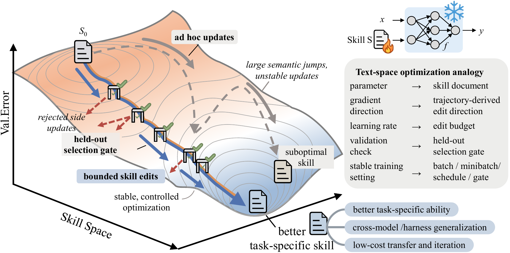

# 스킬 문서가 학습하기 시작했다 — 행동 운영체제의 시대

_Microsoft SkillOpt 논문(arXiv:2605.23904)이 보여준 +23.5pt 자기진화 알고리즘과 페블러스가 본 다음 카테고리_

## Executive Summary

> [!callout]
> AI 업계에는 오래된 환상이 하나 있었다. 더 강력한 모델만 만들면 에이전트도 자연스럽게 똑똑해질 것이라는 믿음. 그래서 사람들은 GPU를 더 쌓고, 파라미터를 더 키우고, 프롬프트를 더 길게 늘어뜨렸다. 정작 현실의 에이전트는 여전히 불안정했다. 같은 문제를 두 번 시키면 다른 결과를 내놓고, 환경이 조금만 바뀌어도 무너졌으며, 인간이 밤새 손으로 다듬은 스킬 문서는 몇 번의 업데이트만 지나면 낡은 유물처럼 변했다. **2026년 5월 22일 arXiv에 올라온 한 편의 논문(arXiv:2605.23904, _SkillOpt: Executive Strategy for Self-Evolving Agent Skills_)**이 이 문제를 정면으로 마주했다. Microsoft Research의 제안은 단순하면서도 급진적이다. **모델을 계속 바꾸려 하지 말고, 에이전트의 스킬 자체를 학습 가능한 상태로 다뤄라.**

> 정량적 충격은 세 줄이다. 첫째, **52/52 cells에서 best-or-tied**. 6개 벤치마크 × 7개 모델 × 3개 실행 환경의 모든 조합에서 SkillOpt가 동등하거나 앞섰고, no-skill·human-skill·one-shot LLM-skill·TextGrad·GEPA·Trace2Skill·EvoSkill 등 7개 베이스라인을 모두 눌렀다. 둘째, **GPT-5.5 direct chat +23.5pt, Codex agentic loop +24.8pt, Claude Code +19.1pt**라는 향상폭은 거대 모델 한 세대 점프(GPT-3.5→GPT-4가 통상 +15~+20pt)와 같거나 더 크다. 그것도 **모델 학습 비용의 6~7 자릿수 아래** 가격으로. 셋째, **스킬은 모델 사이를 옮겨다닌다.** Cross-model +15.2%, Cross-harness +31.8%, 그리고 Codex에서 학습된 SpreadsheetBench 스킬이 Claude Code 환경에서 22.1→81.8(+59.7pt)로 작동한다는 사실은 "스킬 = 모델 독립적 자산"이라는 명제를 더 이상 비유가 아니라 측정값으로 만든다.

> 이 흐름이 우리와 무관할 리 없다. **SkillOpt 논문이 발표된 2026년 5월 22일, 같은 날 한국에서는 한글과컴퓨터와 LG AI연구원이 ChatEXAONE 결합 협약을 체결**했다. 한국 AI 시장은 IITP 기준 2025년 3.44조원에서 2027년 4.46조원(CAGR 14.3%)으로 가고 있고, **2026년 1월 22일 한국 AI 기본법**이 시행되면서 "AI 에이전트의 오판 책임은 누구에게 귀속되는가"가 산업계의 최대 쟁점이 되었다. 페블러스는 지난 몇 해 "데이터를 진단 가능한 상태로 만든다"는 명제로 DataClinic·AI-Ready Data·DataGreenhouse·PebbloSim을 운영해 왔다. SkillOpt가 던진 명제는 우리의 명제를 **행동(behavior) 차원으로 확장**한 것이다. 데이터의 진단 가능성에서 행동의 진단 가능성으로, **AI-Ready Data → AI-Ready Behavior**의 도약이다.

### 주요 수치

출처: [arXiv:2605.23904](https://arxiv.org/abs/2605.23904) (Microsoft Research, 2026-05-22), Stanford HAI AI Index 2026, Epoch AI.

<!-- stat-card -->
**+23.5pt** — GPT-5.5 direct chat — 6개 벤치마크 평균, no-skill 대비

<!-- stat-card -->
**52/52** — cells best-or-tied — 7개 베이스라인 모두 깔린 비교

<!-- stat-card -->
**+31.8%** — Cross-harness 전이 — Codex → Claude Code 평균

<!-- stat-card -->
**6~7 자릿수** — 비용 차이 — Frontier 학습 vs SkillOpt 1회

## 더 큰 모델의 환상

AI 업계에는 오래된 환상이 하나 있었다. 더 강력한 모델만 만들면 에이전트도 자연스럽게 똑똑해질 것이라는 믿음이다. 그래서 사람들은 GPU를 더 쌓고, 파라미터를 더 키우고, 프롬프트를 더 길게 늘어뜨렸다.

그러나 정작 현실의 에이전트는 여전히 불안정했다. 같은 문제를 두 번 시키면 다른 결과를 내놓고, 환경이 조금만 바뀌어도 무너졌으며, 인간이 밤새 손으로 다듬은 '스킬 문서'는 몇 번의 업데이트만 지나면 낡은 유물처럼 변해버렸다.

Microsoft의 SkillOpt 논문은 이 문제를 정면으로 마주한다. **"모델 자체를 계속 바꾸려 하지 말고, 에이전트의 스킬 자체를 학습 가능한 상태로 다뤄라"**라는 급진적인 전환의 제안이다. 같은 모델 위에서, 같은 추론 비용으로, 그러나 다른 스킬 문서를 가지고 에이전트의 평균 정확도가 한 세대 분량 점프한다.

같은 2026년 봄, 빅테크의 전략이 두 갈래로 가시화되었다. **진영 A**는 모델을 계속 키운다. OpenAI GPT-5/o3, Anthropic Opus 4.x, Google Gemini Ultra, Meta Llama 5, xAI Grok 4.3 Heavy. **진영 B**는 모델은 frozen으로 두고 그 위에 학습되는 행동 자산을 다듬는다. Microsoft SkillOpt(2026-05-22), Anthropic Claude Skills와 Managed Agents Dreaming, NousResearch Hermes, Sentient EvoSkill, Stanford GEPA. 어느 쪽이 옳다고 단정할 시점은 아직 아니다. 다만 진영 B의 등장이 "더 큰 모델"만이 유일한 길은 아님을 분명히 보여준다.

> [!callout]
> 이 글은 그 두 번째 길의 첫 번째 결정판인 SkillOpt를 해부한다. 알고리즘이 어떻게 작동하는지, 정량 데이터가 무엇을 말하는지, 산업적 함의는 무엇인지. 그리고 마지막으로 데이터 진단을 해온 회사가 이 흐름을 어떻게 받아 안는가라는 페블러스의 시각으로, **AI-Ready Data → AI-Ready Behavior**라는 다음 카테고리의 윤곽을 그린다.

## 스킬 문서가 던지는 질문

SkillOpt가 정확히 무엇을 학습시키는가. 모델은 frozen이다. 에이전트도 frozen이다. 학습되는 유일한 객체는 단 하나의 마크다운 파일, `best_skill.md`다. 이 파일에는 절차(procedures), 도메인 휴리스틱, 도구 사용 정책, 출력 제약, 실패 모드가 자연어로 적힌다. 옵티마이저 모델(별도의 LLM)은 타깃 모델의 실행 궤적을 보고 이 문서를 수정한다. 두 모델이 같이 돌지만 학습되는 것은 두 모델 사이의 텍스트 한 장이다.

저자들의 자기 규정은 다음과 같다.

"We formulate agent-skill learning as optimization over an external natural-language state and introduce SkillOpt, a harness-agnostic optimizer with rollout batches, reflection minibatches, add/delete/replace edits, textual learning rates, schedules, held-out acceptance, rejected-edit buffers, and epoch-wise slow/meta update."

— SkillOpt §1 Contributions (arXiv:2605.23904)

풀어 쓰면 **"학습이란 외부 자연어 상태(external natural-language state)에 대한 최적화"**라는 선언이다. 가중치라는 수십억 차원 연속 공간을 떠나, 자연어 문서라는 이산·의미 공간으로 학습 대상의 위상이 옮겨졌다. 이 구조의 함의는 세 가지로 나타난다.

### 2.1. 학습 대상의 위상이 바뀌었다

가중치 공간에서 자연어 공간으로. 이건 단순한 표현 변경이 아니라 학습 대상의 본질이 바뀐 사건이다. 가중치는 모델에 종속되고, 한 번 학습되면 인간이 그 내용을 직접 읽을 수 없으며, 작은 수정도 비싸다. 반면 스킬 문서는 모델에 묶이지 않고, 사람이 읽을 수 있으며, 부분 수정이 자연스럽다.

### 2.2. 학습 결과물을 인간이 읽을 수 있다

GB짜리 모델 파일 대신 수 KB의 마크다운. 변경 이력을 git으로 추적할 수 있고, 회고할 수 있으며, 사람의 검토 게이트를 끼워 넣을 수 있다. AI 거버넌스와 책임 귀속의 관점에서 이 한 가지 사실만으로도 의미가 크다. 학습된 결과물을 두고 "왜 이렇게 결정했는가"를 처음으로 텍스트로 묻고 답하게 됐다.

### 2.3. 학습 결과가 다른 모델로 옮겨갈 수 있다

가중치는 그 모델을 위해 태어난다. 그러나 자연어로 적힌 스킬 문서는 — GPT-5.5에서 학습한 것을 Qwen3.5-4B로, Codex 환경의 것을 Claude Code 환경으로 그대로 옮겨도 작동한다. 저자들은 이 성질을 명시적으로 못 박는다.

"A skill is a portable natural-language artifact that packages procedures, domain heuristics, tool policies, output constraints, and failure modes, letting a frozen agent adapt through external text."

— SkillOpt §1 Introduction

세 가지 함의가 모이는 곳에 한 가지 결과가 있다 — **52/52 cells best-or-tied.** 6개 벤치마크 × 7개 모델 × 3개 실행 환경의 모든 셀에서, SkillOpt는 no-skill·human-skill·one-shot LLM-skill·TextGrad·GEPA·Trace2Skill·EvoSkill 등 7개 베이스라인을 모두 깔고 동등하거나 우위였다. 단일 평가가 아니라 52개 독립 측정 모두에서 일관된 우위.

*▲ SkillOpt 파이프라인 전체 도식 — train/val/test split, rollout batches, optimizer 모델, batch-level merge, validation gate, rejected-edit buffer, epoch-wise slow/meta update까지. 고정된 에이전트(왼쪽)와 학습되는 스킬 문서(가운데), 옵티마이저(위)의 3자 구조가 한눈에 들어온다. | Source: [SkillOpt Project Page](https://microsoft.github.io/SkillOpt/) (Microsoft Research, MIT License)*

> [!callout]
> SkillOpt는 모델·에이전트·옵티마이저를 명시적으로 분리한다. 학습되는 객체는 셋 다 아니다. 세 객체 사이를 매개하는 한 장의 마크다운이다. 학습이 모델에서 일어나지 않고 그 옆의 텍스트에서 일어난다는 발상의 전환이, "행동을 학습한다(learn to behave)"는 명제를 처음으로 실용 알고리즘으로 만들었다.

## 텍스트 공간의 gradient descent

SkillOpt 알고리즘의 한 epoch은 네 단계로 흐른다. 익숙한 딥러닝 학습 규율이 텍스트 공간으로 그대로 이식된다.

<!-- stat-card -->
**① Rollout** — 타깃 모델이 현재 `best_skill.md`를 들고 mini-batch의 태스크들을 실행하여 궤적과 점수를 수집한다.

<!-- stat-card -->
**② Reflect** — 옵티마이저 모델이 성공·실패 궤적을 분리해서 들여다보고 재사용 가능한 절차(reusable procedures)를 추출한다.

<!-- stat-card -->
**③ Edit** — `add`·`delete`·`replace` 세 연산을 **edit budget**(텍스트 학습률) 한도 안에서 제안한다.

<!-- stat-card -->
**④ Gate** — held-out validation set에서 점수가 **엄격하게 개선**될 때만 채택. 아니면 `rejected-edit buffer`로 떨어져 다음 epoch의 학습 신호가 된다.

저자들은 이 isomorphism이 비유가 아니라 공학이라고 못 박는다.

"The deep-learning analogy is operational rather than decorative. Rollout and reflection batch sizes control the noise in the evidence used for each edit; the textual learning rate and schedule control how far one skill version is allowed to move from the previous one; the held-out gate plays the role of validation; and the epoch-wise slow/meta update acts like a momentum term, carrying stable editing directions across epochs."

— SkillOpt §1

*▲ 텍스트 공간 위의 gradient descent — bounded skill edits가 손실 곡면을 따라 내려가고, 거부된 사이드 업데이트는 ad-hoc updates 영역으로 흩어진다. 오른쪽 패널의 대응표가 weight ↔ skill document, learning rate ↔ edit budget, validation check ↔ held-out gate임을 못 박는다. | Source: [SkillOpt Project Page](https://microsoft.github.io/SkillOpt/), Figure 1 (arXiv:2605.23904)*

### 3.1. 가중치 공간 ↔ 텍스트 공간 — 7가지 대응

deep learning이 가중치에서 했던 일을 SkillOpt는 텍스트에서 한다. 비교하면 일대일 대응이 깔끔하게 떨어진다.

| Deep Learning (가중치 공간) | SkillOpt (텍스트 공간) |
| --- | --- |
| Mini-batch | Rollout / Reflection minibatch |
| Learning rate | Textual learning rate (edit budget) |
| Validation loss | Held-out acceptance gate |
| Momentum | Epoch-wise slow/meta update |
| Gradient | Reflection on success/failure trajectories |
| Negative-sample replay | Rejected-edit buffer |
| Frozen backbone + LoRA | Frozen agent + external skill.md |

``

이 대응이 깔끔할수록 한 가지가 무겁게 다가온다. **"학습"이라는 행위가 더 이상 weight 위에서만 일어나지 않는다는 것**이 알고리즘적으로 정당화된다는 사실이다. 모델이 한 번 잘 만들어졌다면, 그 위에 얹히는 자연어 문서를 다듬는 일만으로 우리는 "학습한다"고 말할 수 있게 됐다.

### 3.2. 학술 계보 — 8년의 누적이 한 시스템에 모이다

SkillOpt는 갑자기 등장한 시스템이 아니다. 2022년부터 8년 동안 누적된 self-evolving agent 흐름의 거의 모든 지반을 받아 안는다.

- •**ReAct (2022, Yao et al.)** — 추론과 행동을 interleaved 시퀀스로 결합. 에이전트의 "호흡"을 만들었다.
- •**Reflexion (2023, Shinn et al., NeurIPS)** — binary/scalar feedback을 verbal feedback으로 변환하는 "semantic gradient" 개념의 직계 선조. 그러나 episodic 메모리에 머물렀다.
- •**Voyager (2023, Wang et al.)** — GPT-4 위에 ever-growing skill library를 처음으로 만든 시스템. 다만 스킬을 "추가만" 했다. [페블러스 선행 글에서 다룬 학술 원형](/report/voyager-lifelong-agent-2023/ko/).
- •**DSPy (2023, Khattab et al.)** — "프롬프트를 짜지 말고 LM을 프로그래밍하라". 파이프라인 컴파일러의 위상을 정립.
- •**TextGrad (2024, Yuksekgonul et al.)** — "텍스트 미분"의 수학적 정당화 첫 시도. SkillOpt의 직계 학술 선조.
- •**GEPA (2025, Stanford)** — Reflective Prompt Evolution이 강화학습을 능가할 수 있음을 보였다. ICLR 2026 oral.
- •**Hermes Agent (2025, NousResearch)** — 산업 구현체로서의 self-evolving 에이전트. 사용자와 함께 자라는 시스템. [페블러스 선행 글](/report/hermes-agent-growth-with-user/ko/).
- •**EvoSkill·Trace2Skill (2026)** — 실패 궤적에서 스킬을 발견하는 직계 경쟁자. SkillOpt 52/52 비교에서 함께 깔린다.

SkillOpt는 이 모든 흐름을 받아 **"단일 procedural skill document라는 안정된 학습 대상에 deep-learning training discipline 풀세트를 처음으로 이식한 시스템"**이다. Reflexion이 "semantic gradient"라는 직관을 던졌다면, TextGrad가 그것의 수학을 시도했고, SkillOpt는 그 위에 epoch·mini-batch·validation gate·momentum까지 모두 올려놓은 공학. 비유가 비유에서 멈추지 않고 공학이 된 지점.

README의 한 줄이 명제를 가장 간결하게 표현한다.

"Train agent skills like you train neural networks — with epochs, (mini-)batchsize, learning rates, and validation gates — but without touching model weights."

— microsoft/SkillOpt README (MIT License)

## 평균 뒤의 이야기 — +23.5, +24.8, +19.1

+23.5pt라는 평균 숫자만 보면 추상적이다. GPT-5.5 direct chat 환경에서 6개 벤치마크의 baseline → after를 셀 단위로 풀면 진짜 이야기가 드러난다.

| 벤치마크 | 도메인 | No-skill | SkillOpt | 향상 |
| --- | --- | --- | --- | --- |
| SearchQA | 문서 검색 QA | 77.7 | 87.3 | +9.6 |
| ALFWorld | 임바디드 추론 | 83.6 | 95.5 | +11.9 |
| DocVQA | 스캔 문서 이해 | 78.8 | 91.2 | +12.4 |
| LiveMathematicianBench | 고급 수학 | 37.6 | 66.9 | +29.3 |
| SpreadsheetBench | 스프레드시트 조작 | 41.8 | 80.7 | +38.9 |
| OfficeQA | 엔터프라이즈 생산성 | 33.1 | 72.1 | +39.0 |
| 평균 | — | 58.8 | 82.3 | +23.5 |

출처: arXiv:2605.23904 (Microsoft Research, 2026-05-22), Table 1.

평균이 두 자릿수 후반인 작업들은 한자릿수 향상에 그치지만, **베이스라인이 낮고 절차적 지식이 결정적인 작업에서 향상폭이 폭발한다.** 이건 우연이 아니다. 절차는 "이 상황에서 이렇게 한다"는 명시적 명제로 쓰여질 수 있고, 그것이 바로 스킬 문서가 잘 표현하는 종류의 지식이기 때문이다. 사람의 머릿속에 있는 "엑셀 잘 다루는 직장인의 휴리스틱"이나 "올림피아드 수학자의 풀이 전략" 같은 것이 적절한 형식으로 자연어화될 때, 그것은 모델의 행동을 한 세대 분량 끌어올린다.

가장 큰 폭발이 일어난 세 자리는 엑셀과 오피스, 그리고 올림피아드 수학이다. 사람이 오랜 시간 손과 머리로 다듬어 온 절차들이 모인 곳에서 향상폭이 가장 크게 터졌다. 모델의 한 세대 점프가 통상 +15~+20pt임을 떠올리면, 이 세 셀은 그 점프를 두 번 겹친 자리다.

<!-- stat-card -->
**+39.0** — OfficeQA — 33.1 → 72.1, 엔터프라이즈 생산성

<!-- stat-card -->
**+38.9** — SpreadsheetBench — 41.8 → 80.7, 스프레드시트 조작

<!-- stat-card -->
**+29.3** — LiveMath — 37.6 → 66.9, 고급 수학

이 향상은 **52개 셀 모두에서 동등 또는 우위**로 나타난다. 어떤 모델, 어떤 환경, 어떤 벤치마크를 골라도 SkillOpt가 직계 경쟁자(TextGrad, GEPA, Trace2Skill, EvoSkill)보다 떨어지지 않는다. 더 인상적인 것은 epoch이 진행되는 동안 학습 곡선이 어떻게 그려지는지다. 단순 평균이 아니라 시간에 따른 학습 동학(training dynamics)의 형태가 직접 보인다.

*▲ Epoch별 학습 동학 — 세 벤치마크(SpreadsheetBench, SearchQA, LiveMath) 모두에서 selection best(주황 점선)가 unseen test(녹색 점선)와 함께 epoch 진행에 따라 향상된다. SpreadsheetBench는 epoch 2까지 가파른 향상 후 plateau, SearchQA는 4 epoch 이후 안정, LiveMath는 16 epoch까지 점진적 향상. validation gate가 과적합을 막아주는 양상이 보인다. | Source: [SkillOpt Project Page](https://microsoft.github.io/SkillOpt/), Figure 4 (arXiv:2605.23904)*

"SkillOpt is best or tied-best on 52 of 52 cells and outperforms no-skill, human-skill, one-shot LLM-skill, prompt-optimization (TextGrad, GEPA), and skill-evolution (Trace2Skill, EvoSkill) baselines under every model."

— SkillOpt §1 Contributions

EvoSkill이 Codex SpreadsheetBench cell에서 27.5→67.5를 만든 자리에서, SkillOpt가 다시 67.5→85.0(+17.5)을 만든 단일 사례가 이 우위의 성격을 잘 보여준다. 같은 자기진화 계열에 속하는 직계 경쟁자가 끌어올린 위에서 또 한 번 동등한 폭으로 끌어올리는 일관성. 이건 통계적 우연이 아니라 **discipline의 차이**다.

> [!callout]
> **주의 — 신뢰구간은 미공개.** 논문은 6개 벤치마크 평균값과 셀 단위 수치를 공개했지만, 표준편차나 신뢰구간은 보고하지 않았다. 따라서 "통계적으로 robust"라는 단정은 학술적으로 위험하며, **"보고된 향상폭"**으로 기술하는 것이 정확하다. 다만 52/52 cells 우위는 단순 평균이 아니라 셀 단위로 측정된 결과이므로, 우위의 일관성(consistency) 자체는 강한 신호다.

## 옮겨다니는 스킬, 옮겨다닐 수 없는 가중치

가중치는 그 모델을 위해 태어난다. GPT-5.5에 맞춰 fine-tune한 LoRA adapter는 Qwen3.5에 붙지 않는다. 모델이 바뀌면 처음부터 다시 학습해야 한다. 스킬 문서는 다르다. SkillOpt가 GPT-5.4에서 학습한 SpreadsheetBench 스킬을 GPT-5.4-mini에 그대로 옮겼을 때 +9.4pt가 나왔고, GPT-5.4-nano로 옮겼을 때도 +15.2pt가 측정되었다. 환경 간 전이는 한 단계 더 인상적이다. Codex 안에서 학습된 스킬이 Claude Code 안에서 그대로 작동할 때 SpreadsheetBench가 22.1에서 81.8로 +59.7pt 뛰어올랐다. **다른 회사의 모델, 다른 회사의 실행 환경, 그러나 같은 자연어 문서.**

### 5.1. 전이 실험 — 세 종류의 옮겨다님

| 전이 유형 | 실험 설정 | 측정 향상폭 |
| --- | --- | --- |
| Cross-model (대 → 소) | GPT-5.4 학습 → GPT-5.4-mini, SpreadsheetBench | +9.4pt |
| Cross-model (극소형) | GPT-5.4 학습 → GPT-5.4-nano (논문 추정) | +15.2% |
| Cross-harness | Codex 학습 → Claude Code 실행 (평균) | +31.8% |
| 단일 극단 사례 | Codex → Claude Code, SpreadsheetBench (22.1 → 81.8) | +59.7pt |
| Self-optimizer | GPT-5.4-nano가 자기 자신의 옵티마이저 역할 | +10.4% |

출처: arXiv:2605.23904 본문 transfer 표.

### 5.2. 비용 자릿수 — 6~7개의 차이

이 사실의 경제학적 의미는 크다. Frontier 모델의 학습 비용은 GPT-4가 $78M, Gemini Ultra가 $191M, GPT-5가 비공식 추정 $200~$500M 수준이다(Stanford HAI AI Index 2025, Epoch AI). SkillOpt 1회 최적화 비용은 논문이 "수십~수백 달러"로 정성적으로 보고한다. 같은 단위로 환산하면 자릿수 차이가 또렷이 드러난다.

| 학습 방식 | 1회 비용 | 결과물 형식 | 모델 종속성 |
| --- | --- | --- | --- |
| Frontier 사전학습 | $78M ~ $500M | 모델 가중치 (GB~TB) | 완전 종속 |
| LoRA 파인튜닝 | $1K ~ $100K | Adapter 가중치 (MB) | 호환 모델 한정 |
| SkillOpt 1회 최적화 | $100 ~ $500 | best_skill.md (KB) | 모델 독립 |

``출처: Stanford HAI AI Index 2025·2026, Epoch AI(2024), arXiv:2605.23904 §3 정성 추정.

**자릿수 6~7개 차이.** Frontier 학습이 $10^8 수준이라면 SkillOpt는 $10^2 수준이다. 그리고 그 결과물은 모델에 종속되지 않는다. 즉 한 번 잘 다듬어 둔 스킬 문서는 다음 세대 모델로 자연스럽게 이전되며, 다른 벤더의 모델과도 호환된다.

이건 자산 클래스의 정의가 바뀌는 일이다. 모델 가중치는 매 세대마다 다시 만들어야 하는 소모재였다면, **스킬 문서는 누적되는 자본재**다. 저자들의 정리가 명료하다.

"SkillOpt instead optimizes a persistent skill document that can be trained, validated, exported, and reused with the adapted model, applying language-level controllability to a stable procedural skill state."

— SkillOpt §2 Related Work

## 학습하는 조직, 진영의 분기

같은 2026년 봄, 빅테크의 베팅이 두 갈래로 동시에 가시화되었다. 어느 한 쪽이 옳다는 결론을 내리기엔 이르지만, 흐름의 윤곽은 분명하다.

| 축 | 진영 A — 모델 스케일링 | 진영 B — 스킬·행동 자산 학습 |
| --- | --- | --- |
| 대표 주자 | OpenAI, Meta, Google DeepMind, xAI | Microsoft Research, Anthropic, NousResearch, Sentient, Stanford(GEPA) |
| 대표 산출물 | GPT-5.5 (1,000+ tool call), Llama 5, Gemini Ultra, Grok 4.3 Heavy | SkillOpt, Claude Skills + Managed Agents Dreaming, Hermes Agent |
| 핵심 명제 | "agentic model first, chat model second" | "Train the procedure, not the weights" |
| 학습 비용 | $100M~$500M (Frontier 1 run) | $100~$500 (SkillOpt 1 최적화) |
| 학습 결과물 | 모델 가중치 (GB~TB), 종속적 | 스킬 문서·메모리·트레이스, 이식 가능 |
| 표준화 게임 | 자사 API · 자사 모델 우선 | MCP open standard, Agent Skills open standard, SkillOpt MIT |

주목할 만한 것은 **표준화의 대칭성**이다. Anthropic은 "Claude Skills"를 open standard로 공개하고 MCP를 Linux Foundation에 기부했다(2026-05). Microsoft는 SkillOpt를 MIT 라이선스로 GitHub에 풀었다. **빅테크 둘이 같은 시기에 스킬·도구·메모리 계층을 모두에게 개방한 셈이다.** 어느 한 명이 표준을 독점하기 전에 시장 전체를 "행동 자산은 공유 가능한 자연어 자산"이라는 합의 위에 올려놓겠다는 동시 행동으로 읽힌다.

### 6.1. 한국의 같은 날 — 2026-05-22의 우연 아닌 시그널

같은 날 한국에서도 의미 있는 사건이 있었다. **2026년 5월 22일** — SkillOpt 논문이 arXiv에 올라간 바로 그 날, 한국에서는 **한글과컴퓨터와 LG AI연구원이 ChatEXAONE 결합 전략적 사업 협약을 체결**했다(ZDNet Korea, AI타임스, 디지털데일리 동시 보도). 한컴 AI 에이전트가 LG AI연구원의 ChatEXAONE 플랫폼에 정식 탑재되는 첫 외부 통합 사례. 우연일 수 있다. 그러나 그 우연이 가리키는 방향은 분명하다.

한국 AI 시장은 IITP 기준 2025년 3.44조원에서 2027년 4.46조원(CAGR 14.3%)으로 확대 중이고, 네이버 "에이전트N"(2026 Q1 쇼핑·Q2 검색), 카카오 "카나나", 업스테이지의 다음 인수, KT Agent Builder + Agentic Fabric, SK텔레콤 AI Native 전환까지 — 모두 같은 흐름 위에 있다. 그리고 그 한복판에 **2026년 1월 22일 시행된 한국 AI 기본법**이 있다. 이 법은 EU AI Act 다음으로 세계 두 번째 포괄적 AI 법률이며, 핵심 쟁점 중 하나가 **"AI 에이전트의 오판 책임은 누구에게 귀속되는가"**다. 한국 산업이 "에이전트의 행동을 누가 관리하고 누가 진단할 것인가"를 묻기 시작한 시점이 — 정확히 Microsoft가 "스킬 문서를 학습 가능한 자산으로 다룬다"는 청사진을 던진 시점과 겹친다.

한국은 아직 "스킬 자산 옵티마이저" 단계가 아니다. 도메인 특화 에이전트의 공공시장 진입 단계다. 그러나 그 단계가 깊어질수록 "이 에이전트가 학습한 행동을 누가 진단하고 누가 보증하는가"라는 질문이 시장의 정중앙으로 올라온다. AgentOps 시장이 2025년 $1.8B에서 2034년 $58.4B(CAGR 45%)로 가는 길목에서, 그 안에 **SkillOps라는 새 하위 범주**가 막 태어나는 것을 본다.

## 진단된 스킬 문서 — 데이터에서 행동으로

페블러스는 지난 몇 해 데이터를 진단 가능한 상태로 만드는 일에 천착했다. DataClinic은 학습 데이터를 다섯 가지 신호로 본다 — 레이블 무결성, 분포 균형, 신선도, 결측, 이상치. SkillOpt가 던진 명제는 우리의 명제를 행동 차원으로 확장한 것이다. 데이터의 진단 가능성에서 **행동의 진단 가능성**으로. **AI-Ready Data → AI-Ready Behavior.**

### 7.1. DataClinic 5신호 → SkillClinic 5신호 재맵핑

우리가 보기에 스킬 문서도 같은 다섯 가지 신호로 진단되어야 한다. 데이터 라벨에 무결성이 있듯, 검증 게이트에도 무결성이 있다. 데이터에 분포가 있듯, 스킬에는 전이 가능성이 있다. 그 대응을 표로 옮기면 다음과 같다.

| DataClinic (학습 데이터) | SkillClinic (스킬 문서) | 진단 질문 |
| --- | --- | --- |
| 레이블 무결성 | 검증 무결성 | held-out gate 통과 이력이 깨끗한가? |
| 분포 균형 | 전이 가능성 | 다른 모델·하니스에서도 작동하는가? |
| 신선도 | 갱신 신선도 | 옵티마이저가 마지막으로 다듬은 게 언제인가? 죽은 스킬은 아닌가? |
| 결측 | 의미 누락 | 어떤 실패 모드를 아직 다루지 못하고 있는가? |
| 이상치 | 실행 이상 | rejected-edit buffer에 같은 종류 거절이 반복되는가? |

### 7.2. 고객이 묻게 될 세 가지 질문

이 다섯 신호 위에서 고객이 묻게 될 세 가지 질문이 있다. SkillOpt 패러다임을 산업이 받아 안기 시작하면, 우리 모두가 곧 이 질문 앞에 선다.

<!-- stat-card -->
**① 현재 상태** — 우리 회사의 스킬 라이브러리는 지금 몇 개이며, 그 중 살아 있는 것·죽은 것·중복인 것은 얼마인가?

<!-- stat-card -->
**② 검증** — 옵티마이저가 수정한 스킬을 사람이 어떻게 검토하는가? 검증 게이트는 충분히 엄격한가?

<!-- stat-card -->
**③ 전이** — 모델을 GPT-5.5에서 Claude Code로 갈아탔을 때 어떤 스킬이 전이되고 어떤 스킬이 깨지는가?

이 모든 질문은 데이터 진단 회사의 일이다. 페블러스가 데이터에 대해 해온 일을 행동에 대해 한다. validation loss만 보고는 절대 잡을 수 없는, 구조적·의미적 결함을 진단하는 일. 학습 데이터 → 스킬 문서 → 에이전트 진화로 이어지는 새 파이프라인에서, 각 단계의 품질을 진단하는 시스템이 없다면 옵티마이저는 잘못된 방향으로 천천히, 그러나 확실히 망가진다. **한국 AI 기본법(2026-01-22 시행)의 책임 귀속 쟁점**은 이 흐름과 정확히 만난다 — 에이전트가 오판했을 때 그 오판이 어떤 스킬 문서의 어떤 줄에서 비롯되었는지를 사람이 읽을 수 있는 형태로 증명할 수 있는 능력이, 거버넌스의 새 표준이 된다.

> [!callout]
> **AI-Ready Data → AI-Ready Behavior.** 데이터를 진단 가능한 상태로 만든 회사가 이제 행동을 진단 가능한 상태로 만들 차례라는 명제. **"진단된 스킬 문서(diagnosed skill documents)"**라는 이름의 시장이 막 태어나고 있다. 데이터 진단을 해온 회사라면 이 흐름 앞에서 같은 결론에 도달할 수밖에 없다는 통찰의 결과로 이 명제가 적힌다.

구체적 제품 로드맵은 이 글의 몫이 아니다. 다만 DataClinic의 5신호 체계가 그대로 SkillClinic의 5신호로 재맵핑된다는 점, 그리고 행동 데이터베이스(에이전트 성공/실패 로그, 실행 궤적, 도구 호출 패턴)가 페블러스의 기존 PebbloSim·DataGreenhouse 자산과 자연스럽게 결합된다는 점은 명확하다. 페블러스가 그동안 데이터에 대해 해온 일이, 그대로 행동 자산으로 옮겨갈 수 있다는 것. 그것이 이 한 편의 논문이 던진 다음 좌표다.

이 시리즈의 앞선 두 글이 같은 흐름을 다른 각도에서 다루었다. 학술 원형은 [Voyager — 스스로 배우는 AI의 기원](/report/voyager-lifelong-agent-2023/ko/)에서, 산업 구현체는 [Hermes Agent — 사용자와 함께 자라는 시스템](/report/hermes-agent-growth-with-user/ko/)에서 추적했다. SkillOpt는 이 두 글의 결정판이며, 이 세 글이 함께 페블러스가 본 self-evolving 에이전트의 좌표계를 이룬다.

## 한 편의 논문이 그린 좌표

한 편의 논문이 시대 좌표를 다시 그렸다. 모델을 더 키우는 길은 여전히 열려 있다. 다만 그 옆에 분명히 하나의 길이 더 났다. **모델을 그대로 두고 행동을 학습시키는 길.** 옵티마이저가 짠 스킬 문서를 검증 게이트가 통과시키고, 그 문서가 다른 모델로 옮겨가 또 한 번의 향상을 만들어내는 흐름이다.

이 흐름은 단지 fine-tuning 비용의 회피가 아니다. **AI의 학습 가능한 객체의 위상이 가중치에서 자연어 문서로 확장**되었다는 사건이고, 그 자연어 문서는 한 번 만들어 두면 다음 모델로 옮겨갈 수 있는 누적 자산이라는 사건이다. 빅테크 두 곳이 같은 시기에 스킬 계층을 모두에게 개방했고, 한국 산업에는 AI 기본법이 책임 귀속이라는 묵직한 질문을 얹었다. 답해야 할 질문은 명확해졌다.

페블러스의 시각은 한 줄이다. **AI-Ready Data → AI-Ready Behavior.** 데이터를 진단 가능한 상태로 만든 회사가 이제 행동을 진단 가능한 상태로 만들 차례라는 명제다. 학습된 결과물을 처음으로 사람이 읽을 수 있게 된 이 시대에, "왜 이 에이전트가 이렇게 행동했는가"라는 물음에 답할 수 있는 능력. 그것이 다음 데이터 품질의 정의가 된다.

한 편의 논문이 신호탄이었다. 그 옆에 한국 산업의 같은 날 협약이 있었고, AI 기본법의 시행이 있다. 이 흐름의 한복판에 **"진단된 스킬 문서"**라는 신규 카테고리가 비어 있다. 데이터를 진단해 온 회사가 자연스럽게 도달하는 다음 좌표가 그 자리다.

## 자주 묻는 질문

## 참고문헌

### 1차 소스 (논문 및 코드)

- 1.Yang, Y., Gong, Z., Huang, W., Yang, Q., Zhou, Z., Huang, Z., Li, Y., Gao, X., Dai, Q., Liu, B., Qiu, K., Yang, Y., Chen, D., Yang, X., & Luo, C. (2026). [_SkillOpt: Executive Strategy for Self-Evolving Agent Skills_](https://arxiv.org/abs/2605.23904). arXiv:2605.23904. Microsoft Research, 2026-05-22.
- 2.Microsoft Research (2026). [microsoft/SkillOpt](https://github.com/microsoft/SkillOpt). GitHub repository (MIT License).
- 3.Microsoft Research (2026-05-22). [SkillOpt project page](https://microsoft.github.io/SkillOpt/).

### 학술 계보

- 4.Yao, S., Zhao, J., Yu, D., Du, N., Shafran, I., Narasimhan, K., & Cao, Y. (2023). [_ReAct: Synergizing Reasoning and Acting in Language Models_](https://arxiv.org/abs/2210.03629). ICLR 2023. arXiv:2210.03629.
- 5.Shinn, N., Cassano, F., Berman, E., Gopinath, A., Narasimhan, K., & Yao, S. (2023). [_Reflexion: Language Agents with Verbal Reinforcement Learning_](https://arxiv.org/abs/2303.11366). NeurIPS 2023. arXiv:2303.11366.
- 6.Wang, G., Xie, Y., Jiang, Y., Mandlekar, A., Xiao, C., Zhu, Y., Fan, L., & Anandkumar, A. (2023). [_Voyager: An Open-Ended Embodied Agent with Large Language Models_](https://arxiv.org/abs/2305.16291). NeurIPS 2023 Workshop. arXiv:2305.16291.
- 7.Khattab, O., Singhvi, A., Maheshwari, P., Zhang, Z., et al. (2023). [_DSPy: Compiling Declarative Language Model Calls into Self-Improving Pipelines_](https://arxiv.org/abs/2310.03714). arXiv:2310.03714.
- 8.Yuksekgonul, M. et al. (2024). [_TextGrad: Automatic "Differentiation" via Text_](https://arxiv.org/abs/2406.07496). arXiv:2406.07496.
- 9.Agrawal, L. A. et al. (2025). [_GEPA: Reflective Prompt Evolution Can Outperform Reinforcement Learning_](https://arxiv.org/abs/2507.19457). ICLR 2026 (Oral). arXiv:2507.19457.
- 10.Madaan, A. et al. (2023). [_Self-Refine: Iterative Refinement with Self-Feedback_](https://arxiv.org/abs/2303.17651). arXiv:2303.17651.
- 11.EvoSkill team (2026). [_EvoSkill: Skill Evolution from Failure Trajectories_](https://arxiv.org/abs/2603.02766). arXiv:2603.02766.
- 12.Trace2Skill team (2026). [_Trace2Skill: From Agent Traces to Reusable Skills_](https://arxiv.org/abs/2603.25158). arXiv:2603.25158.

### 시장·산업 보고서

- 13.Stanford HAI (2026). [_AI Index Report 2026_](https://hai.stanford.edu/ai-index/2026-ai-index-report).
- 14.McKinsey (2025-11). [_The state of AI in 2025: Agents, innovation, and transformation_](https://www.mckinsey.com/capabilities/quantumblack/our-insights/the-state-of-ai).
- 15.MarketsAndMarkets (2026). _AI Agents Market_.
- 16.MarketIntelo (2026). _AgentOps AI Infrastructure Platform Market_. (2034 $58.4B 추정 — 출처 추정 명시.)
- 17.Epoch AI (2024). [_How much does it cost to train frontier AI models?_](https://epoch.ai/blog/how-much-does-it-cost-to-train-frontier-ai-models)
- 18.Cottier, B. & Rahman, R. (2024). [_The rising costs of training frontier AI models_](https://arxiv.org/abs/2405.21015). arXiv:2405.21015.
- 19.Pillitteri, P. (2026-05). [_SkillOpt — Microsoft text-space optimizer for agent skills_](https://pasqualepillitteri.it/en/news/3452/skillopt-microsoft-text-space-optimizer-agent-skills-en).

### 한국 시장 및 정책

- 20.IITP (2026). **2026 인공지능(AI)·ICT 산업 보고서**.
- 21.[한국 AI 기본법](https://aibasicact.kr/) — 「인공지능 발전과 신뢰 기반 조성 등에 관한 기본법」(2024-12-26 통과, 2026-01-22 시행).
- 22.ZDNet Korea (2026-05-22). "한글 문서에 '엑사원' 붙인다 — 한컴·LG AI연구원 전략적 사업 협약."
- 23.AI타임스 (2026-05-22). 한컴·LG AI연구원 ChatEXAONE 협약 보도.
- 24.peekaboolabs.ai (2026). [**AI 기본법 가이드**](https://peekaboolabs.ai/blog/ai-basic-law-guide).
- 25.삼성SDS (2026). **2026년 데이터 관리 트렌드 — 확산보다 품질과 통제**.

### 페블러스 선행 글 (시리즈)

- 26.페블러스 (2026-05). [**Voyager — 스스로 배우는 AI의 기원**](/report/voyager-lifelong-agent-2023/ko/). 학술 원형 트랙.
- 27.페블러스 (2026-05-13). [**에이전트도 성장한다 — Hermes Agent와 자율형 데이터 운영체제의 시대**](/report/hermes-agent-growth-with-user/ko/). 산업 구현체 트랙.
