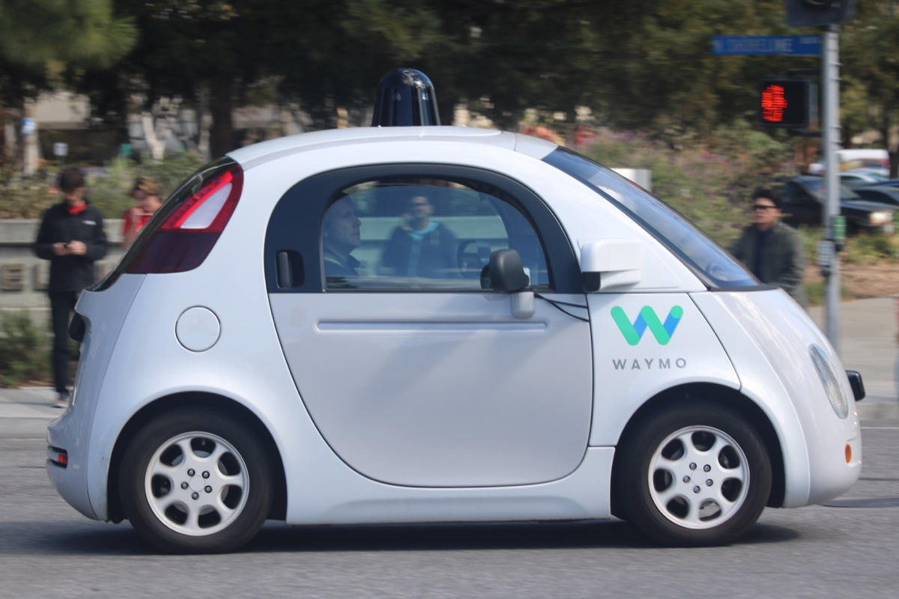
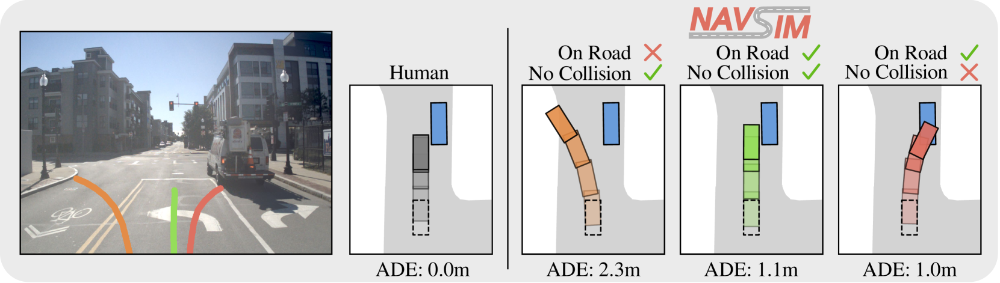
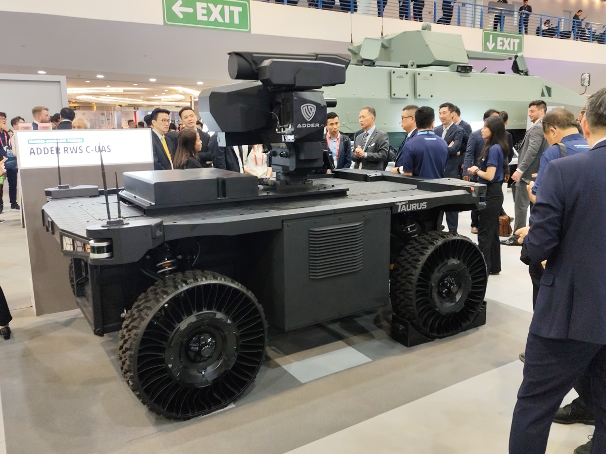

# How Do Autonomous Vehicle Simulators Learn 

_A Technical, Business, and Regulatory Analysis of Mixed Traffic AI Modeling_

## Executive Summary

> [!callout]
> Autonomous vehicle simulators have become indispensable infrastructure. Waymo replaces more than 99% of its real-world mileage with simulation, at roughly 1/1,000th the cost of physical testing (Mcity, University of Michigan). Yet these numbers conceal a troubling pattern: AI systems that perform brilliantly in simulation repeatedly behave in unpredictable ways on real roads.

> Two structural blind spots explain the gap. First, the **Evaluation Crisis**: open-loop metrics (ADE/FDE) simply cannot capture closed-loop reality. Second, the **Causality Gap**: AI models learn to mimic expert behavior but never internalize why those decisions were made. When both blind spots converge, simulation stops being a cost-saving tool and becomes an error-hiding tool instead.

> The industry is starting to recognize the problem. Applied Intuition reached a $15B valuation (June 2025) by expanding scenario diversity. nuPlan has shifted to closed-loop evaluation as the new standard. But the layer that diagnoses the quality of the data itself remains conspicuously empty. Pebblous fills that gap with PebbloSim × DataClinic. The next frontier in simulation is not "how many miles did we run?" — it is "how well did we actually learn?"

## Technical Challenges of Mixed Traffic Simulation

A fully autonomous road environment (100% CAV penetration) remains a distant future. Today's roads are a mixed traffic reality — human-driven vehicles and autonomous systems sharing the same space. According to the survey paper arXiv:2604.12857 (Rahmani et al.), traffic flow is most unstable and unpredictable precisely at 20–30% CAV penetration. Paradoxically, that is exactly where we are today.

> [!callout]
> The same study finds that once penetration exceeds 20–30%, traffic flow begins to stabilize, and at 100% full automation, travel times could fall by 25–50%. Yet the instability within that 20–30% band remains the hardest problem for simulators to solve.

### 1.1 Three Axes of Complexity

Mixed traffic simulation must tackle three interlocking dimensions simultaneously.

- •**Agent-Level**: Modeling individual vehicle behavior — the decision logic of autonomous vehicles and human drivers differs fundamentally, making interaction prediction extremely complex.
- •**Environment-Level**: Road geometry, traffic signals, weather, and other variables — particularly atypical environments like Korean urban roads, where motorcycles and scooters mix freely, are chronically underrepresented in global datasets.
- •**Cognition-Physics**: The intersection of human cognitive judgment (bounded rationality) and physical laws — AI cannot fully capture the intuitive, context-dependent decisions that human drivers make moment to moment.

*▲ A Waymo autonomous vehicle shares the road with pedestrians — the mixed traffic reality that simulators must learn to replicate | Source: [Wikimedia Commons](https://commons.wikimedia.org/wiki/File:Waymo_self-driving_car_side_view.gk.jpg) (CC BY-SA 4.0, Grendelkhan)*

### 1.2 Nine Core Challenges

The field faces nine fundamental challenges in mixed traffic simulation. None exists in isolation — they compound each other, which is precisely what makes the problem so difficult.

| Challenge | One-Line Description | Korean Context |
| --- | --- | --- |
| Evaluation Crisis | Simulation score ≠ real-road performance | Hyundai AV validation standards need redefining |
| Causality Gap | Learns patterns but not the reasons behind them | No causal verification layer in MORAI models |
| Sim-to-Real Transfer | Virtual environment → real environment transfer fails | Real-world validation challenges for defense unmanned systems |
| Interaction Realism | AV–human interaction poorly represented | Motorcycle and scooter mixed scenarios on Korean roads |
| Data Scarcity | Edge-case scenarios are rare | Regulatory barriers to collecting accident data |
| Bounded Rationality | Modeling cognitive biases in human judgment | Aggressive lane-cutting and jaywalking behaviors |
| Closed-Loop Interdependency | Ego vehicle behavior affects the environment | Traffic signal integration not yet implemented in simulations |
| Safety-Critical Scenarios | Rare high-risk scenarios must be generated | Edge cases in defense battlefield environments |
| Validation Gap | No clear method to prove regulatory compliance | ISO/PAS 8800 and EU AI Act compliance required |

Of these nine challenges, the first two — the Evaluation Crisis and the Causality Gap — are the most fundamental. Most of the remaining challenges are derivatives of these two. The next section examines both in depth.

## The Root of the Evaluation Crisis and Sim-to-Real Gap

There is a moment when "great simulation performance" rings hollow. The most illustrative example: a planner that tops the leaderboard on the nuPlan benchmark (1,282 hours across 4 cities) performs only modestly in real-world road tests. The reason lies in the evaluation methodology itself.

*▲ Onboard vs Offboard simulation loop — in closed-loop evaluation, the simulator feeds synthetic perception outputs back to the planner, creating a continuous interaction cycle that mirrors real-world driving | Source: [Montali et al., Waymo Open Sim Agents Challenge, arXiv:2305.12032](https://arxiv.org/abs/2305.12032)*

### 2.1 Open-Loop vs. Closed-Loop: Same Data, Different Reality

Most simulation evaluations still use open-loop methods — measuring the distance between a fixed reference trajectory and the model's predicted trajectory (ADE/FDE). These metrics are intuitive and easy to compute. But they carry a fundamental flaw.

| Dimension | Open-Loop | Closed-Loop |
| --- | --- | --- |
| Evaluation Method | Compare prediction against fixed reference trajectory | Ego vehicle actually drives in a live environment |
| Key Metrics | ADE (Average Displacement Error), FDE (Final Displacement Error) | TTC (Time to Collision), Progress, Comfort |
| Interaction Modeling | None (ego actions don't affect other agents) | Yes (ego action → environment change → feedback) |
| Predictive Power | Low (captures only short-horizon trajectories) | High (reflects complex multi-agent interactions) |
| Compute Cost | Low | High |

Open-loop evaluation assumes the ego vehicle's actions have no effect on the surrounding environment. In reality, when your car brakes, the car behind reacts — and that reaction shapes your next decision. Ignoring this interdependency means that even the most sophisticated prediction model will behave differently on real roads.

*▲ A Cruise AV bristling with LIDAR sensors — the physical reality that simulation must faithfully replicate to close the Sim-to-Real gap | Source: [Wikimedia Commons](https://commons.wikimedia.org/wiki/File:Cruise_Automation_Bolt_EV_third_generation_in_San_Francisco.jpg) (CC BY-SA 4.0, Dllu)*

*▲ NAVSIM benchmark: real-world camera view with simulated trajectory predictions — the gap between human driving (ADE 0.0) and AI predictions reveals why open-loop metrics alone are insufficient | Source: [Dauner et al., NAVSIM, arXiv:2406.15349](https://arxiv.org/abs/2406.15349)*

### 2.2 The Causality Gap: A Deeper Problem

Deeper than the evaluation methodology is the Causality Gap. Today's dominant AI approaches all share one blind spot: they don't understand "why."

- •**Behavior Cloning (Imitation Learning)**: Learns from expert driver behavior data but never internalizes the causal structure behind those decisions. When conditions drift outside the training distribution — say, a motorcycle suddenly cutting into the lane — covariate shift occurs and errors accumulate over time.
- •**Reinforcement Learning**: Optimizes toward a reward function. If the reward is poorly designed, genuinely unsafe behaviors can score highly. Optimization without causal understanding is inherently fragile.
- •**Diffusion Models**: Excel at generating diverse, realistic-looking scenarios. But a separate verification layer is still needed to confirm that generated scenarios comply with physical laws and are causally consistent.

> [!callout]
> **Data quality compounds the problem.** CleanLab's analysis of major ML datasets (Meta GATE study) found an average label error rate of 3.4%. In autonomous driving AI trained on hundreds of millions of records, 3.4% translates to millions of incorrectly labeled training samples — and existing tools make these errors almost impossible to detect at scale.

In summary: the Evaluation Crisis is a problem of measurement methodology; the Causality Gap is a problem of learning architecture. Both are ultimately rooted in data quality. The fact that NHTSA catalogued 392 ADS/ADAS-related incidents from voluntary reporting alone over an 11-month period in 2022 makes clear this is not a theoretical concern.

## Why Pebblous Is Focused Here (PebbloSim × DataClinic)

Running more simulations is not enough. Waymo has logged over 10 billion simulated miles (as of 2019, with continuous growth since), yet real-road incidents persist. The constraint is not volume — it is quality. What is needed is a diagnostic layer that asks: how realistic is the simulation data itself?

### 3.1 DataClinic Applied to Mixed Traffic

DataClinic uses a neuro-symbolic diagnostic framework to quantitatively evaluate the quality of simulation datasets. In the context of mixed traffic simulation, DataClinic specifically does the following.

- •**AV–Human Interaction Imbalance Detection**: Automatically analyzes how evenly AV–human driver interactions are distributed across a dataset. Identifies underrepresented situations — for example, yielding to pedestrians on right turns.
- •**Open-Loop vs. Closed-Loop Gap Quantification**: Analyzes the prediction error between ADE/FDE performance and actual closed-loop simulation performance, diagnosing the gap at the data quality layer.
- •**Scenario Prescription (Vector-to-Param Inversion)**: After detecting which scenario types are missing, reverse-calculates the parameters PebbloSim needs to generate them as synthetic data.
- •**Regulatory Evidence Automation**: Auto-generates data quality certification reports compliant with ISO 26262, SOTIF, and ISO/PAS 8800 requirements.

### 3.2 PebbloSim's Role: "Doctor to the Simulator"

PebbloSim runs real mixed traffic simulations — and has encountered the same data realism problems firsthand. That internal experience is the credibility foundation for DataClinic's diagnostic service. What Pebblous offers to external customers is the diagnostic capability that emerged from that direct experience.

> [!callout]
> Where Applied Intuition focuses on "how many scenarios can we generate," PebbloSim + DataClinic asks "how realistic are those scenarios?" These are complementary positions, not competing ones. Applied Intuition customers using DataClinic as an add-on layer is a natural and realistic go-to-market path.

For a detailed look at PebbloSim's design philosophy and technical architecture, see the [PebbloSim Design Strategy](/project/PebbloSim/pebblosim-design-strategy/en/).

## Academic & Industry Landscape

The global autonomous driving simulation market stood at approximately $2.57B in 2024, growing at a CAGR of 11.2% (Grand View Research). Broader AV simulation market estimates for 2025 range as high as ~$4.5B at ~22% CAGR — though definitions vary significantly across research firms. Within this market, players fall into three tiers.

| Tier | Players | Strength | Gap |
| --- | --- | --- | --- |
| Top | Applied Intuition | General-purpose simulation, defense expansion | No data quality diagnostics |
| Middle | Waymo, Tesla | Data scale, fleet learning | Closed ecosystems, no external access |
| Base | CARLA, SUMO | Openness, cost | Sim-to-Real Gap unresolved |
| Diagnostic Layer | Pebblous | DataClinic quality assessment | This space is currently empty |

### 4.1 Applied Intuition: What $15B Didn't Buy

Applied Intuition reached a $15B valuation in its June 2025 Series F. ARR hit $415M in 2024 (100% YoY growth from $207M), with ~$1B projected for 2025 (Sacra analysis, estimated). The company has signed a contract worth up to $49M with the US Army and is expanding into construction and mining automation via a partnership with Komatsu.

Yet underneath this growth, Applied Intuition's core value proposition remains "more scenarios." Data quality diagnostics — asking whether the generated scenarios are actually realistic — is not on their product roadmap. That is Pebblous's opening. For a detailed analysis of Applied Intuition's technical architecture and positioning gaps, see the [Applied Intuition Deep Dive](/project/BizReport/applied-intuition-analysis-01/ko/).

*▲ Waymo's latest AV fleet operating on public roads in Miami (2026) — simulation volume alone did not prevent real-world deployment challenges | Source: [Wikimedia Commons](https://commons.wikimedia.org/wiki/File:Waymo_Self_Driving_Car_in_West_Miami.jpg) (CC BY 4.0, Phillip Pessar)*

*▲ nuScenes Prediction Challenge — multi-modal trajectory forecasting on real urban scenes. The colored fans represent probability distributions over possible future paths, the foundation of closed-loop simulation evaluation | Source: [nuScenes (Motional)](https://www.nuscenes.org/prediction)*

### 4.2 Academic Standards: nuPlan and World Models

nuPlan (1,282 hours, 4 cities) has effectively become the de facto standard for closed-loop evaluation. Waymo's Argoverse and KITTI remain key benchmarks. At the research frontier, large-scale world models like GAIA-3 (15B parameters) are emerging, attempting to internalize physical laws within simulation. Tesla FSD v14.3, released April 2026, officially reports a 20% improvement in reaction time.

### 4.3 The Korean Market: MORAI, Hyundai, and Defense

Korea has developed its own distinct ecosystem, operating in parallel with global trends.

- •**MORAI**: Korea's only full-stack simulation platform. Key customers include Hyundai Motor, Naver Labs, and 42dot; the platform was used in the 2025 Autonomous Driving Challenge.
- •**Hyundai Motor**: Targeting full AV launch by 2028, with simulation validation frameworks being rapidly strengthened. Data quality standards will be a critical variable in meeting that timeline.
- •**Ministry of National Defense**: ₩1.25 trillion invested in the Drone-bot Combat System, with K-CEV unveiled in February 2026. Korea's 2026 defense budget of ₩66.3 trillion (+8.2% YoY) is rapidly driving demand for autonomous system simulation.
- •**Government AI Investment**: ₩10.1 trillion (~$7B) in government AI spending for 2026 (Korea Herald). Autonomous driving and Physical AI are central beneficiaries.

## Recommended Action Roadmap

ISO/PAS 8800 (published April 2025) formally codified safety requirements for AI in road vehicles. The EU AI Act and DoD autonomy directives are moving in the same direction — toward stricter simulation validation mandates. Regulation is creating mandatory demand for validation evidence automation, and that is DataClinic's B2B expansion opportunity. The roadmap unfolds in three phases.

### 5.1 Immediate Opportunities (2026)

The fastest path to market lies in the Korean ecosystem.

- •**MORAI Partnership**: Apply DataClinic diagnostics to MORAI simulation data to launch a Korean AV data quality assessment service. Hyundai's 2028 AV target creates a natural, urgent demand signal.
- •**Defense Unmanned System Validation**: Simulation reliability certification for K-CEV and Drone-bot Combat systems. Given the defense budget scale and pace of autonomy investment, this is likely the fastest B2B contract path.
- •**ISO/PAS 8800 Compliance Consulting**: Automated simulation evidence report generation aligned to new regulatory requirements. OEMs and Tier 1 suppliers face the most urgent need for exactly this service.

### 5.2 Medium-Term Opportunities (2027)

- •**Regulatory Evidence Automation Platform**: A SaaS product that auto-generates compliance reports meeting ISO/PAS 8800 + SOTIF requirements. Designed as a horizontal tool that can be supplied to Applied Intuition customers as well.
- •**DataClinic API Integration with Benchmarks**: Direct API integration with nuPlan, Waymax, and Argoverse to establish Pebblous as the academic-industry bridge for data quality.

### 5.3 Long-Term Opportunities (2028+)

The experience built in mixed traffic simulation scales across the entire Physical AI domain. Every industry pursuing autonomy — construction, mining, robotics, logistics — will face the same data quality diagnostic need.

| Phase | Timeline | Key Actions | Regulatory / Partner |
| --- | --- | --- | --- |
| Immediate | 2026 | MORAI partnership, defense validation | ISO/PAS 8800 enforcement |
| Medium-Term | 2027 | Evidence automation SaaS, API integration | EU AI Act expansion |
| Long-Term | 2028+ | Expand across all Physical AI domains | DoD autonomy budget growth |

*▲ ST Engineering Taurus UGV at Singapore Airshow 2026 — defense autonomous systems face the same simulation reliability challenges as civilian AVs | Source: [Wikimedia Commons](https://commons.wikimedia.org/wiki/File:ST_Engineering_Taurus_-_Singapore_Airshow_2026.jpg) (CC BY-SA 4.0)*

> [!callout]
> The central lever of this roadmap is regulation. As requirements become more explicit, "validation evidence automation" shifts from competitive advantage to legal obligation. Korea's R&D budget of ₩35.3 trillion (+19.3%) and ₩10.1 trillion in government AI investment provide the financial tailwind.

## References

This report draws on the following literature and public data. Reliability ratings and usage context are noted for each source.

- •Rahmani, S. et al. (2026). **A Survey on Mixed Traffic Simulation for Autonomous Driving**. arXiv:2604.12857. — Primary academic source; basis for the nine-challenge taxonomy.
- •Waymo. (2019). **Waymo Safety Report**. Waymo LLC. — Source for 99%+ simulation reliance and 10-billion-mile benchmark.
- •Mcity, University of Michigan. **Simulation Cost Comparison Study**. — Source for 1/1,000 cost reduction vs. physical testing.
- •Applied Intuition. (2025). **Series F Announcement**. TechCrunch. — $15B valuation; US Army contract up to $49M.
- •Sacra. (2025). **Applied Intuition Revenue Analysis**. — ARR $415M (2024); ~$1B projection for 2025 (estimated).
- •Grand View Research. (2025). **Automotive Simulation Software Market Report**. — Market size $2.57B (2024), CAGR 11.2%.
- •Oliver Wyman. (2025). **OEM Digital Transformation Survey**. — 42% of OEMs migrating to cloud-based simulation; 31% of R&D budget allocated to simulation tools.
- •nuPlan Team. **nuPlan: A closed-loop ML-based planning benchmark**. — 1,282 hours, 4-city dataset reference.
- •NHTSA. (2022). **ADS/ADAS Crash Reporting**. — 392 incidents over 11 months (voluntary reporting basis).
- •Meta GATE Research / CleanLab. **Label Error Rates in ML Datasets**. — Average label error rate of 3.4%.
- •Tesla. (2026-04-08). **FSD v14.3 Release Notes**. — Official 20% reaction time improvement announcement.
- •Republic of Korea Ministry of National Defense. (2025). **2026 Defense Budget Briefing**. KDEF News. — ₩66.3 trillion total; ₩1.25 trillion for Drone-bot Combat System.
- •The Korea Herald. (2026). **Government AI Investment 2026**. — ₩10.1 trillion government AI investment.
- •ISO/PAS 8800:2025. **Road vehicles — Safety and artificial intelligence**. International Organization for Standardization.

**Pebblous Research Team**  

                        Pebblous Data Communication Co., Ltd.  
April 15, 2026
