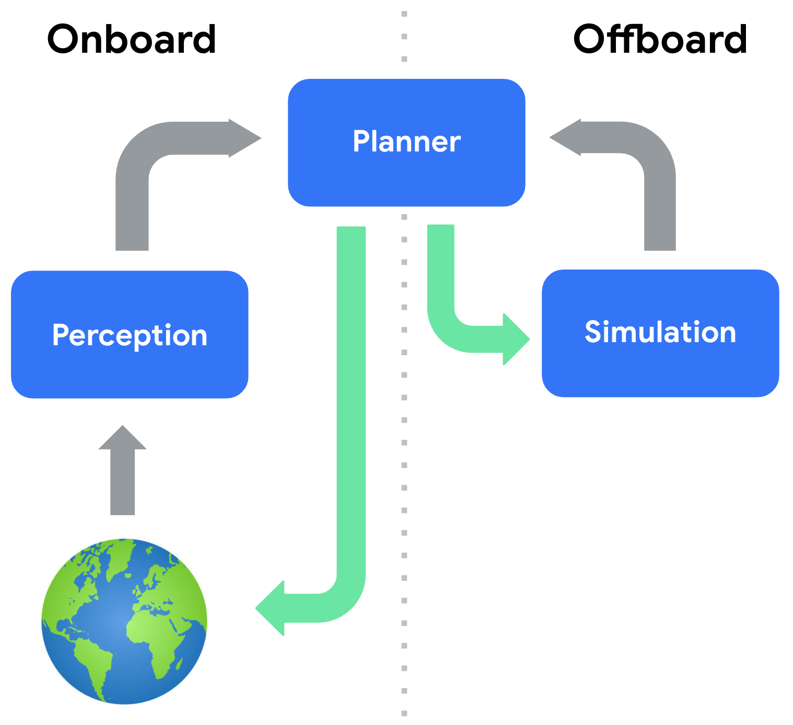
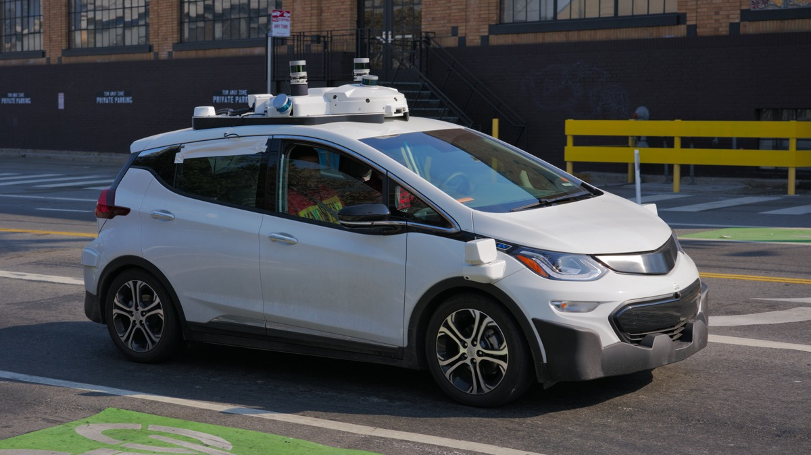
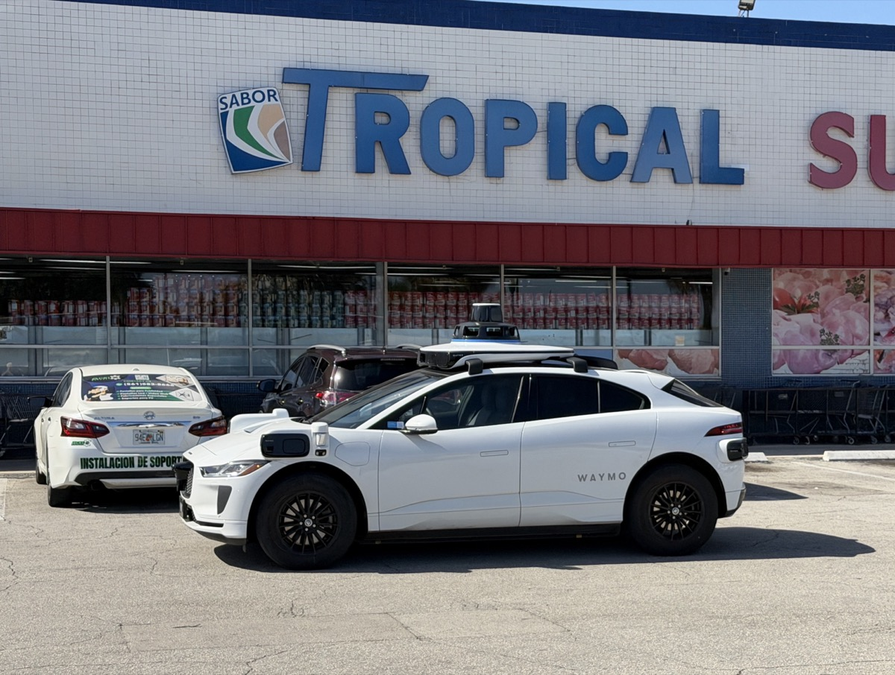
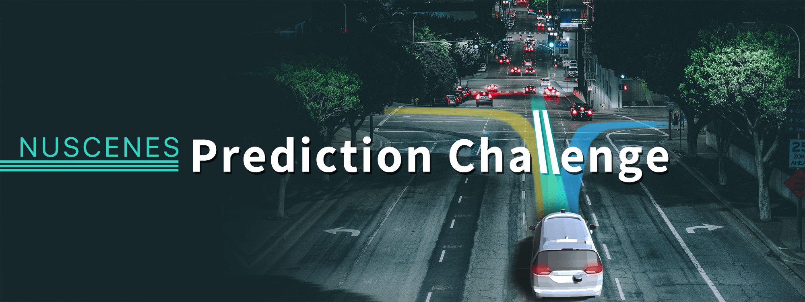

# 자율주행 시뮬레이터는 어떻게 

_혼합 교통 AI 모델링의 기술·비즈니스·규제 종합 분석_

## Executive Summary

> [!callout]
> 자율주행 시뮬레이터는 이미 자율주행 개발의 핵심 인프라다. Waymo는 실제 주행 마일리지의 99% 이상을 시뮬레이션으로 대체했고, 비용은 실주행 대비 약 1,000분의 1 수준이다(Mcity, 미시간대). 그러나 이 수치가 숨기는 것이 있다. 시뮬레이션에서 우수한 성능을 보인 AI가 실제 도로에서 전혀 다른 행동을 보이는 사례가 반복되고 있다.

> 그 원인은 두 가지 구조적 맹점이다. 첫째, **평가 위기(Evaluation Crisis)**: 개방 루프 지표(ADE/FDE)가 폐쇄 루프 현실을 포착하지 못한다. 둘째, **원인성 격차(Causality Gap)**: AI가 전문가의 행동 패턴을 학습하지만 왜 그 결정을 내렸는지 인과를 이해하지 못한다. 이 두 맹점이 결합되면, 시뮬레이션은 비용을 줄이는 도구가 아닌 오류를 숨기는 도구로 전락한다.

> 업계는 이 문제를 인식하기 시작했다. Applied Intuition은 $15B(2025년 6월 기준) 밸류에이션으로 시나리오 다양성을 강화하고 있다. nuPlan은 폐쇄 루프 평가 표준으로 전환했다. 그러나 '데이터 자체의 품질을 진단'하는 레이어는 아직 비어 있다. 페블러스는 PebbloSim × DataClinic을 통해 이 공백을 채운다. 시뮬레이션의 다음 경쟁은 '얼마나 많이 달렸는가'가 아니라 '얼마나 제대로 학습했는가'다.

## 혼합 교통 시뮬레이션의 기술적 난제

완전 자율주행(100% CAV) 환경은 아직 먼 미래다. 현재 도로는 인간이 운전하는 차량과 자율차가 뒤섞인 혼합 교통(Mixed Traffic) 상태다. arXiv 논문(2604.12857, Rahmani et al.)의 조사에 따르면, CAV 침투율이 20~30% 구간일 때 교통 흐름이 가장 불안정하고 예측 불가능하다. 역설적으로 이 구간이 지금 우리가 살고 있는 현실이다.

> [!callout]
> 같은 논문은 CAV 침투율이 20~30%를 넘으면 교통 흐름이 안정화되기 시작하고, 100% 완전 자율주행 시 여행 시간이 25~50% 단축될 수 있다고 분석한다. 그러나 20~30% 구간 자체의 불안정성이 시뮬레이터에게는 가장 풀기 어려운 문제다.

### 1.1 혼합 교통 시뮬레이션의 3축 복잡성

혼합 교통 시뮬레이션은 세 가지 축의 문제를 동시에 다뤄야 한다.

- •**Agent-Level**: 개별 차량의 행동 모델링 — 자율차와 인간 운전자 각각의 의사결정 로직이 달라 상호작용 예측이 복잡하다.
- •**Environment-Level**: 도로, 신호, 날씨 등 환경 변수 — 특히 한국 도시 도로처럼 오토바이·이륜차가 혼재하는 비정형 환경은 글로벌 데이터셋에 과소 표현돼 있다.
- •**Cognition-Physics**: 인간의 인지적 판단(제한 합리성, Bounded Rationality)과 물리 법칙의 결합 — AI는 인간의 직관적 판단을 데이터로 완전히 포착할 수 없다.

*▲ Waymo 자율주행차가 보행자와 함께 도로를 공유하는 장면 — 시뮬레이터가 재현해야 할 혼합 교통의 현실 | 출처: [Wikimedia Commons](https://commons.wikimedia.org/wiki/File:Waymo_self-driving_car_side_view.gk.jpg) (CC BY-SA 4.0, Grendelkhan)*

### 1.2 9대 핵심 과제

혼합 교통 시뮬레이션이 풀어야 할 핵심 과제를 정리하면 다음과 같다. 각 과제는 독립적으로 존재하지 않고, 서로 얽혀 있다는 점에서 더 어렵다.

| 과제 | 한 줄 설명 | 한국 맥락 |
| --- | --- | --- |
| 평가 위기 | 시뮬레이션 점수 ≠ 실도로 성능 | 현대차 AV 검증 기준 재정립 필요 |
| 원인성 격차 | 패턴은 배우지만 원인을 모름 | MORAI 모델 인과 검증 부재 |
| Sim-to-Real 전이 | 가상 환경 → 현실 환경 이식 실패 | 국방 무인체계 실환경 검증 난점 |
| 상호작용 현실성 | AV-인간 상호작용 표현 부족 | 한국 도로 이륜차 혼재 시나리오 |
| 데이터 부족 | 엣지 케이스 시나리오 희소 | 결함·사고 데이터 수집 규제 장벽 |
| 제한 합리성 | 인간 판단의 인지적 편향 모델링 | 끼어들기·무단횡단 등 비정형 행동 |
| 폐쇄 루프 상호의존성 | 에고 차량 행동이 환경에 영향 | 신호 체계 연동 시뮬레이션 미구현 |
| 안전 위협 시나리오 | 희귀 고위험 시나리오 생성 필요 | 국방 전장 환경 엣지 케이스 |
| 검증·인증 부재 | 규제 요건 충족 입증 방법 불명확 | ISO PAS 8800, EU AI Act 대응 필요 |

이 9개 과제 중 처음 두 가지 — 평가 위기와 원인성 격차 — 가 가장 근본적이다. 나머지 과제들은 대부분 이 두 문제의 파생이다. 다음 섹션에서 이 두 과제를 심층 분석한다.

## 평가 위기와 Sim-to-Real 격차의 근본

"시뮬레이션 성능이 좋다"는 말이 무색해지는 순간이 있다. nuPlan 벤치마크(1,282시간, 4개 도시)에서 최고 점수를 기록한 플래너가 실제 도로 테스트에서는 평범한 성능을 보인 사례가 대표적이다. 이 괴리가 발생하는 이유는 평가 방식 자체에 있다.

*▲ Onboard vs Offboard 시뮬레이션 루프 — 폐쇄 루프 평가에서는 시뮬레이터가 합성 인지 결과를 플래너에 피드백하여 실제 주행과 유사한 상호작용 사이클을 형성한다 | Source: [Montali et al., arXiv:2305.12032](https://arxiv.org/abs/2305.12032)*

### 2.1 개방 루프 vs. 폐쇄 루프: 같은 데이터, 다른 현실

기존 시뮬레이션 평가의 대부분은 개방 루프(Open-Loop) 방식이다. 고정된 참조 궤적과 예측 궤적 사이의 거리(ADE/FDE)를 측정한다. 이 지표는 계산이 쉽고 직관적이다. 그러나 핵심 문제가 있다.

| 구분 | 개방 루프 (Open-Loop) | 폐쇄 루프 (Closed-Loop) |
| --- | --- | --- |
| 평가 방식 | 고정 참조 궤적과 예측 비교 | 에고 차량이 실제로 환경에서 주행 |
| 주요 지표 | ADE (평균 변위 오차), FDE (최종 변위 오차) | TTC (충돌 시간), Progress, Comfort |
| 상호작용 모델링 | 없음 (에고 행동이 타 차량에 영향 없음) | 있음 (에고 행동 → 환경 변화 → 피드백) |
| 현실 예측력 | 낮음 (단기 궤적만 포착) | 높음 (복합 상호작용 반영) |
| 계산 비용 | 낮음 | 높음 |

개방 루프 평가는 에고 차량의 행동이 주변 환경에 영향을 주지 않는다고 가정한다. 현실에서는 내 차가 브레이크를 밟으면 뒤차가 반응하고, 그 반응이 다시 내 다음 행동에 영향을 준다. 이 상호의존성을 무시하면, 아무리 정교한 예측 모델도 실도로에서 다른 행동을 낳는다.

*▲ LIDAR 센서를 탑재한 Cruise 자율주행차 — 시뮬레이션이 충실하게 재현해야 할 물리적 현실 | 출처: [Wikimedia Commons](https://commons.wikimedia.org/wiki/File:Cruise_Automation_Bolt_EV_third_generation_in_San_Francisco.jpg) (CC BY-SA 4.0, Dllu)*

*▲ NAVSIM 벤치마크: 실제 도로 카메라 뷰에서의 경로 예측 비교 — 인간 운전(ADE 0.0)과 AI 예측 사이의 간극이 개방 루프 지표만으로 성능을 판단할 수 없는 이유를 보여준다 | Source: [Dauner et al., arXiv:2406.15349](https://arxiv.org/abs/2406.15349)*

### 2.2 원인성 격차 (Causality Gap): 더 깊은 문제

평가 방식의 문제보다 더 근본적인 것이 원인성 격차다. 현재 주요 AI 접근법들은 공통적으로 "왜"를 모른다.

- •**행동 클로닝(모방 학습)**: 전문가 운전자의 행동 데이터를 학습한다. 그러나 전문가가 왜 그 결정을 내렸는지 인과 구조는 학습하지 못한다. 훈련 분포를 벗어난 상황(예: 갑작스러운 오토바이 끼어들기)에서 공변량 이동(Covariate Shift)이 발생하고, 오류가 시간에 따라 누적된다.
- •**강화 학습**: 보상 함수를 극대화하는 방향으로 학습한다. 보상 설계가 불완전하면 실제로 안전하지 않은 행동이 높은 점수를 받을 수 있다. 인과 구조를 내면화하지 않은 채 최적화만 추구하는 구조다.
- •**확산 모델**: 다양하고 현실적인 시나리오를 생성하는 데 강점이 있다. 그러나 생성된 시나리오가 물리 법칙을 위반하는지, 인과적으로 일관되는지 검증하는 레이어가 별도로 필요하다.

> [!callout]
> **데이터 품질 문제도 함께한다.** CleanLab이 주요 머신러닝 데이터셋을 분석한 결과(Meta GATE 연구), 평균 라벨 오류율이 3.4%에 달한다. 수억 개 레코드를 학습하는 자율주행 AI에서 3.4%의 오류는 수백만 건의 잘못된 학습 샘플을 의미한다. 문제는 이 오류가 어디서 발생했는지 기존 도구로는 탐지하기 어렵다는 점이다.

결론적으로, 평가 위기는 평가 방식의 문제이고, 원인성 격차는 학습 구조의 문제다. 그리고 이 두 문제의 뿌리에는 데이터 품질 문제가 있다. NHTSA가 2022년 자발적 보고만으로 11개월간 ADS/ADAS 관련 사고 392건을 집계했다는 사실은, 이 문제가 이론이 아닌 현실임을 보여준다.

## 페블러스가 이 문제에 주목하는 이유 (PebbloSim × DataClinic)

시뮬레이터를 더 많이 돌리는 것만으로는 부족하다. Waymo가 100억 마일(2019년 기준, 이후 지속 증가)을 시뮬레이션으로 달렸지만 여전히 실도로 사고가 발생하는 이유가 이를 증명한다. 문제는 양(量)이 아니라 질(質)이다. 시뮬레이션 데이터 자체가 얼마나 현실적인가를 진단하는 레이어가 필요하다.

### 3.1 DataClinic의 혼합 교통 적용

DataClinic은 뉴로-심볼릭(Neuro-Symbolic) 진단 방식으로 시뮬레이션 데이터셋의 품질을 정량 평가한다. 혼합 교통 시뮬레이션에서 DataClinic이 구체적으로 하는 것은 다음과 같다.

- •**AV-인간 상호작용 비균형 표현 탐지**: 데이터셋에서 자율차-인간 운전자 상호작용이 얼마나 고르게 분포하는지 자동 분석. 특정 상황(예: 우회전 시 보행자 양보)이 과소 표현된 구간을 식별한다.
- •**개방 루프 vs. 폐쇄 루프 갭 정량화**: ADE/FDE 성능과 실제 폐쇄 루프 시뮬레이션 성능 간의 예측 오차를 데이터 품질 층위에서 분석한다.
- •**부족 시나리오 처방 (Vector-to-Param 역변환)**: 어떤 시나리오가 부족한지 탐지한 뒤, 이를 PebbloSim이 생성할 수 있도록 파라미터를 역계산해 제공한다.
- •**규제 증적 자동화**: ISO 26262, SOTIF, ISO/PAS 8800 요건에 맞는 데이터 품질 인증 리포트를 자동 생성한다.

### 3.2 PebbloSim의 역할: '시뮬레이션의 의사'

PebbloSim은 혼합 교통 시뮬레이션을 실제로 수행하면서 동일한 데이터 현실성 문제를 직접 경험했다. 이 내부 경험이 DataClinic 진단 서비스의 credibility 기반이다. 외부 고객에게 제공하는 것은 그 경험에서 나온 진단 역량이다.

> [!callout]
> Applied Intuition이 "얼마나 많은 시나리오를 생성하는가"에 집중한다면, PebbloSim + DataClinic은 "그 시나리오가 얼마나 현실적인가"를 진단한다. 이 포지션은 경쟁이 아닌 보완이다. Applied Intuition 고객이 DataClinic을 함께 사용하는 시나리오도 가능하다.

PebbloSim의 설계 철학과 기술 아키텍처에 대한 상세 내용은 [PebbloSim 설계 전략](/project/PebbloSim/pebblosim-design-strategy/ko/)에서 확인할 수 있다.

## 학술·업계 현황 종합

글로벌 자율주행 시뮬레이션 시장은 2024년 약 $2.57B 규모로, CAGR 11.2%로 성장 중이다(Grand View Research). 관련 AV 시뮬레이션 시장 전체로는 2025년 기준 ~$4.5B, CAGR ~22%로 추정되는 연구도 있다(다만 범위 정의가 기관마다 상이하다). 이 시장에서 플레이어들은 3개 계층으로 구분된다.

| 계층 | 플레이어 | 강점 | 빈 공간 |
| --- | --- | --- | --- |
| 상층 | Applied Intuition | 범용 시뮬레이션, 국방 확장 | 데이터 품질 진단 없음 |
| 중층 | Waymo, Tesla | 데이터 규모, 플릿 학습 | 외부 접근 불가 |
| 기층 | CARLA, SUMO | 개방성, 비용 | Sim-to-Real Gap 미해결 |
| 진단 레이어 | Pebblous | DataClinic 품질 평가 | 이 자리가 비어 있다 |

### 4.1 Applied Intuition: $15B가 사지 않은 것

Applied Intuition은 2025년 6월 Series F에서 $15B 밸류에이션을 달성했다. 2024년 ARR $415M(전년 $207M 대비 100% 성장), 2025년 ~$1B 전망(Sacra 분석, 추정). 미육군과 최대 $49M 규모 계약을 맺으며 국방 분야로 확장 중이다. Komatsu와의 파트너십으로 건설·광업 자율화도 겨냥한다.

그러나 이 성장의 이면을 보면, Applied Intuition의 핵심 가치 제안은 "더 많은 시나리오"다. 데이터 품질 진단, 즉 '생성된 시나리오가 얼마나 현실적인가'는 Applied Intuition의 제품 로드맵에 없다. 이것이 페블러스의 공간이다. Applied Intuition의 기술 아키텍처와 포지셔닝 차이의 상세 분석은 [Applied Intuition 심층 분석](/project/BizReport/applied-intuition-analysis-01/ko/)을 참조.

*▲ 마이애미 시내를 운행하는 Waymo 최신 차량(2026) — 시뮬레이션 물량만으로는 실도로 배치 과제를 해결할 수 없다 | 출처: [Wikimedia Commons](https://commons.wikimedia.org/wiki/File:Waymo_Self_Driving_Car_in_West_Miami.jpg) (CC BY 4.0, Phillip Pessar)*

*▲ nuScenes Prediction Challenge — 실제 도시 장면에서의 멀티모달 경로 예측. 색상 팬이 가능한 미래 경로의 확률 분포를 나타내며, 폐쇄 루프 시뮬레이션 평가의 기초가 된다 | Source: [nuScenes (Motional)](https://www.nuscenes.org/prediction)*

### 4.2 학술 표준: nuPlan과 World Models

nuPlan(1,282시간, 4개 도시 기반)은 현재 폐쇄 루프 평가의 사실상 표준으로 자리잡고 있다. Waymo의 Argoverse, KITTI도 핵심 벤치마크로 활용된다. 학술 최전선에서는 GAIA-3(15B 파라미터)과 같은 대형 World Model이 등장해 물리 법칙을 내재화한 시뮬레이션을 시도하고 있다. Tesla FSD v14.3은 2026년 4월 기준 반응 시간 20% 단축을 발표(Tesla 공식)했다.

### 4.3 한국 시장: MORAI·현대차·국방부 삼각형

한국 시장은 글로벌 트렌드와 독립적으로 자체 생태계를 형성하고 있다.

- •**MORAI**: 국내 풀스택 시뮬레이션 플랫폼. 현대차·네이버랩스·포티투닷 등이 주요 고객이며, 2025 자율주행 챌린지에 활용됐다.
- •**현대차**: 2028년 완성형 AV 출시를 목표로 시뮬레이션 검증 체계 강화 중. 시뮬레이션 데이터 품질 기준이 이 일정의 핵심 변수다.
- •**국방부**: 드론봇 전투체계에 1조 2,500억 원 투자, K-CEV 공개(2026-02). 2026년 국방 예산 66.3조 원(전년비 +8.2%)에서 자율화 시뮬레이션 수요가 급증 중이다.
- •**정부 AI 투자**: 2026년 기준 정부 AI 투자 10.1조 원(약 $70억, Korea Herald). 자율주행과 Physical AI 분야가 핵심 수혜 영역이다.

## 권장 실행 로드맵

ISO/PAS 8800(2025년 4월 공개)은 AI 기반 자동화 차량의 안전 요건을 규제 차원에서 명시했다. EU AI Act, DoD 자율화 지침도 시뮬레이션 검증 요건을 강화하는 방향으로 움직인다. 규제가 '증적 자동화' 수요를 만들고, 이것이 DataClinic의 B2B 확장 기회다. 로드맵은 3단계로 설계한다.

### 5.1 즉시 기회 (2026)

한국 시장에서 가장 빠르게 실현할 수 있는 기회다.

- •**MORAI 협력**: MORAI 시뮬레이션 데이터에 DataClinic 진단을 적용해 한국 자율주행 데이터 품질 평가 서비스 출시. 현대차 2028 AV 출시 일정이 이 수요를 만든다.
- •**국방 무인체계 검증**: K-CEV, 드론봇 전투체계 시뮬레이션 신뢰성 검증 서비스. 국방부 예산 규모와 자율화 수요를 고려하면 가장 빠른 B2B 계약 경로다.
- •**ISO/PAS 8800 대응 컨설팅**: 신규 규제 요건에 맞는 시뮬레이션 증적 리포트 자동 생성. OEM과 Tier 1 부품사가 가장 긴급하게 필요로 하는 서비스다.

### 5.2 중기 기회 (2027)

- •**규제 증적 자동화 플랫폼**: ISO/PAS 8800 + SOTIF 요건을 자동으로 충족하는 증적 리포트 생성 SaaS. Applied Intuition 고객에게 수평적으로 공급 가능한 도구로 설계.
- •**DataClinic API 표준 연동**: nuPlan, Waymax, Argoverse 주요 벤치마크 데이터셋에 DataClinic API를 직접 연동해 학술-산업 브리지 역할 확보.

### 5.3 장기 기회 (2028+)

자동차에서 시작한 혼합 교통 시뮬레이션 경험을 전 Physical AI 도메인으로 확장한다. 자율화가 필요한 모든 산업 — 건설, 광산, 로봇, 물류 — 에서 동일한 '데이터 품질 진단' 수요가 발생한다.

| 단계 | 기간 | 핵심 실행 | 규제/파트너 |
| --- | --- | --- | --- |
| 즉시 | 2026 | MORAI 협력, 국방 검증 | ISO/PAS 8800 시행 |
| 중기 | 2027 | 증적 자동화 SaaS, API 연동 | EU AI Act 적용 확대 |
| 장기 | 2028+ | Physical AI 전 도메인 확장 | DoD 자율화 예산 확대 |

*▲ 싱가포르 에어쇼 2026에 전시된 ST Engineering Taurus UGV — 국방 자율 시스템도 민간 AV와 동일한 시뮬레이션 신뢰성 과제에 직면한다 | 출처: [Wikimedia Commons](https://commons.wikimedia.org/wiki/File:ST_Engineering_Taurus_-_Singapore_Airshow_2026.jpg) (CC BY-SA 4.0)*

> [!callout]
> 이 로드맵의 핵심 레버는 규제다. 규제 요건이 명확해질수록 '증적 자동화' 수요는 의무가 된다. 한국 R&D 예산 35.3조 원(+19.3%), 정부 AI 투자 10.1조 원은 이 수요를 재정적으로 뒷받침한다.

## 참고문헌

본 보고서는 아래 문헌 및 공개 데이터를 기반으로 작성했다. 신뢰도 등급과 사용 맥락을 함께 표기한다.

- •Rahmani, S. et al. (2026). **A Survey on Mixed Traffic Simulation for Autonomous Driving**. arXiv:2604.12857. — 본 보고서의 1차 학술 출처, 혼합 교통 9대 과제 분류 기반.
- •Waymo. (2019). **Waymo Safety Report**. Waymo LLC. — 시뮬레이션 99% 의존 및 100억 마일 기준 수치.
- •Mcity, University of Michigan. **Simulation Cost Comparison Study**. — 실주행 대비 시뮬레이션 비용 1,000배 절감 수치.
- •Applied Intuition. (2025). **Series F Announcement**. TechCrunch. — $15B 밸류에이션, 미육군 $49M 계약.
- •Sacra. (2025). **Applied Intuition Revenue Analysis**. — ARR $415M (2024), ~$1B 전망(2025E, 추정).
- •Grand View Research. (2025). **Automotive Simulation Software Market Report**. — 시장 규모 $2.57B (2024), CAGR 11.2%.
- •Oliver Wyman. (2025). **OEM Digital Transformation Survey**. — 클라우드 시뮬레이션 전환 42%, R&D 예산 배분 31%.
- •nuPlan Team. **nuPlan: A closed-loop ML-based planning benchmark**. — 1,282시간, 4개 도시 데이터셋 기준.
- •NHTSA. (2022). **ADS/ADAS Crash Reporting**. — 11개월간 392건 사고 보고(자발적 보고 기반).
- •Meta GATE Research / CleanLab. **Label Error Rates in ML Datasets**. — 평균 라벨 오류율 3.4%.
- •Tesla. (2026-04-08). **FSD v14.3 Release Notes**. — 반응 시간 20% 단축 공식 발표.
- •대한민국 국방부. (2025). **2026 국방예산 브리핑**. KDEF News. — 66.3조 원, 드론봇 전투체계 1조 2,500억 원.
- •The Korea Herald. (2026). **Government AI Investment 2026**. — 정부 AI 투자 10.1조 원.
- •ISO/PAS 8800:2025. **Road vehicles — Safety and artificial intelligence**. International Organization for Standardization.

**페블러스 리서치팀**  

                        (주)페블러스 데이터 커뮤니케이션  
2026년 4월 15일
