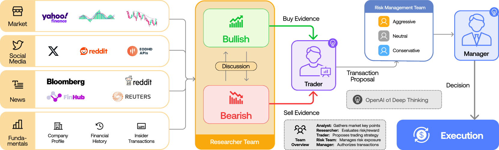

# 멀티에이전트 AI, 금융 넘어 제조·물류까지 확산

_TradingAgents 60K 스타에도 수익은 미달…_

## Executive Summary

> [!callout]
> TradingAgents가 GitHub에서 60K 스타를 넘기는 동안, 우리는 멀티에이전트 LLM이 금융이라는 가장 정형화된 도메인에서 새로운 패러다임으로 자리 잡는 광경을 보았다. 그러나 ACM Fintech 2026 재현성 연구는 같은 시스템이 buy-and-hold 단순 전략조차 추월하지 못함을 밝혔다. 60K 스타는 "방향성 검증"이지 "산업 transferability 검증"이 아니다.

> TradingAgents 패턴을 산업 데이터 운영 — 제조, 물류, 헬스케어, 에너지 — 으로 옮기면 어디가 무너지는가. 결론은 셋이다. 첫째, 멀티에이전트 아키텍처는 이미 도메인 간 수렴했다 — 역할 분화 + 중앙 오케스트레이션 + 도구 호출 + 검증 레이어. 둘째, 산업 도메인은 금융과 달리 "정답이 사후에 명확해지는" 백테스팅이 불가능하다. 셋째, LangGraph·DeerFlow·Anthropic Managed Agents 어느 쪽도 데이터 품질 보증층을 표준으로 갖추지 않았다. 1/1000 합성 데이터로도 모델이 붕괴된다는 Shumailov et al. (Nature 2024)의 결과, A2A 베이스라인 60~100% 데이터 누출, MCP 5.5% 도구 포이즈닝, 88% 파일럿 실패 — 모두 같은 원인의 다른 얼굴이다.

> 페블러스 DataGreenhouse / DataClinic은 이 공백을 채운다. MCP 표준 위에 데이터 readiness 검증 레이어를 표준화하면, 모든 에이전트 생태계에 cross-cut 가능한 "Agentic Data Operations Quality OS"가 된다. 한국 sovereign AI 컨소시엄, CJ대한통운 NextGen AI, 삼성 AI Factory, KEPCO 그리드 패러다임 시프트가 모두 같은 미들웨어를 기다리고 있다. 본 보고서는 DeerFlow + DataGreenhouse + 도메인의 삼각 통합 아키텍처를 제안하며, 페블러스가 오케스트레이터·LLM 진영과 경쟁하지 않고 그 위에 품질·신뢰 레이어를 얹는 "complement, not compete" 전략을 제시한다. 이 글은 [피지컬 AI](/project/PhysicalAI/ko/) 시리즈의 산업 운영 편으로, 멀티에이전트가 제조·물류로 확산될 때 어디가 무너지는지를 본다.

## TradingAgents 60K Stars — 멀티에이전트 시대의 분기점

2026년 5월 1일 기준, Tauric Research의 **TradingAgents**는 GitHub에서 62,306개 스타를 기록했다. 일일 +2,000 스타 페이스로 증가하며, 같은 분기 출시된 v0.2.0은 GPT-5, Claude 4, Gemini 3, Grok 4를 동시 지원하는 멀티 프로바이더 아키텍처로 단일 LLM 종속을 풀었다. 학계와 핀테크 스타트업의 채택이 가속됐다.

60K 스타가 가리키는 것은 단순한 "AI 자동매매" 매력이 아니다. 더 깊은 신호는 **역할 분화된 LLM 에이전트 + 도메인 지식 + 다중 라운드 합의**라는 일반화 가능한 패턴의 사회적 검증이다. TradingAgents는 5계층 12에이전트 토폴로지로 구성된다 — Analyst 4명(시장·뉴스·소셜·펀더멘털) → Researcher 2명(Bull / Bear) → Trader → Risk Manager 3명 → Portfolio Manager. 토론·합의·검토라는 인간 헤지펀드 의사결정 구조를 그대로 LLM 위에 올렸다.

### 1.1. 그러나 ACM Fintech 2026 재현성 연구가 드러낸 것

같은 분기, ACM Fintech 2026에 게재된 독립 재현성 연구는 다른 결론을 내놨다. TradingAgents가 buy-and-hold라는 단순 보유 전략조차 일관되게 추월하지 못했다는 보고다. 핵심 한계로 지적된 것은 두 가지 — 입력 데이터 품질에 대한 강한 가정, 그리고 멀티 라운드 토론이 시장 노이즈에 과적합되는 경향이다.

60K 스타와 buy-and-hold 미달이라는 두 사실은 모순이 아니다. 60K 스타는 **"이 패턴이 검토할 만하다"**는 사회적 검증이고, ACM 재현성 연구는 **"이 패턴이 알파를 만든다"**는 성능 검증의 부재를 보여준다. 두 가지를 분리해서 보아야 산업 도메인 transfer 논의가 가능해진다.

*▲ TradingAgents 전체 프레임워크 구조 — 5계층 12에이전트 토폴로지(분석가→연구팀→트레이더→리스크→매니저) | Source: [arXiv:2412.20138 (Tauric Research)](https://arxiv.org/abs/2412.20138)*

### 1.2. Du et al. 2023의 천장과 B05의 새로운 경고

다중 라운드 토론이 단일 LLM 대비 환각을 줄이고 사실성을 높인다는 학술 근거는 이미 있다. Du et al.이 ICML 2024에서 발표한 결과다 — 논문 제목 "Society of Minds"가 시사하듯, 혼자보다 여럿이 낫다는 가설을 검증했다. 그러나 2025년 11월 arXiv 2511.07784는 더 정밀한 경계를 그었다. **"the ceiling of debate success is effectively bounded by the strongest participant"** — 토론 성공의 천장은 가장 강한 참가자가 결정한다. 약한 LLM 여럿으로 강한 LLM 하나를 이길 수 없다.

2025년 9월 FREE-MAD(arXiv 2509.11035)는 또 다른 비대칭을 발견했다. 에이전트가 자기 출력과 외부 출력 사이 신뢰도를 조정하면 합의는 쉬워지지만 추론 정확도는 오히려 떨어진다. **"Garbage debate, garbage consensus."** 멀티에이전트가 단일 LLM보다 우월한 영역은 입력 데이터가 깨끗할 때만 성립한다. 산업 현장에서 그 전제가 충족되는 경우는 드물다.

→ 페블러스 관련 글: [DeerFlow 2.0 — Researcher가 SuperAgent로 진화하기까지](/report/deerflow-superagent/ko/)

## 아키텍처는 수렴했다 — 그런데 왜 산업에서는 안 되는가

멀티에이전트 아키텍처를 산업 도메인으로 옮기면 맨 먼저 부딪히는 벽은 "에이전트 설계"가 아니다. "에이전트가 받는 데이터의 성질"이 문제다. arXiv Group A(금융 A01-A06)와 Group H(산업 H01-H28)의 토폴로지는 사실상 동일하다 — specialized roles + orchestrator + tool calls + reflection layer. Bosch 2,000라인 multi-agent, CJ대한통운 NextGen AI, Schneider One Digital Grid, MX-AI 5G Open RAN — 모두 같은 패턴이다. 격차는 다른 곳에 있다.

한 줄로 요약하면 이렇다 — **아키텍처는 도메인 간 이미 수렴했고, 데이터 readiness만 발산한다.** 같은 토폴로지를 깔아놓고 한쪽(금융)은 시장가라는 사후 정답이 분 단위로 도착해 백테스팅이 가능하지만, 다른 쪽(산업)은 정답이 모호한 채 분포가 끊임없이 움직인다. 아래 4대 비대칭성 표는 그 발산이 어디에서 발생하는지를 차원별로 정리한 것이다.
