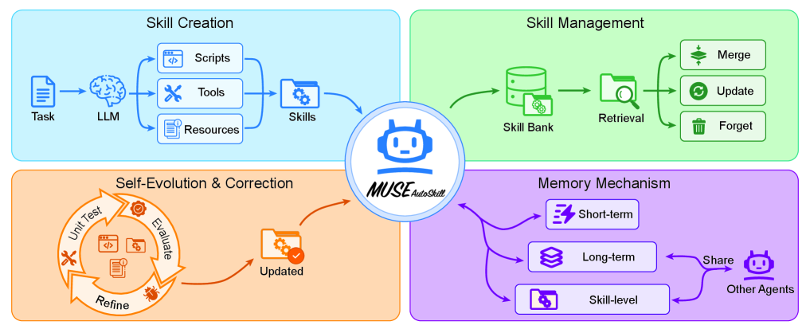
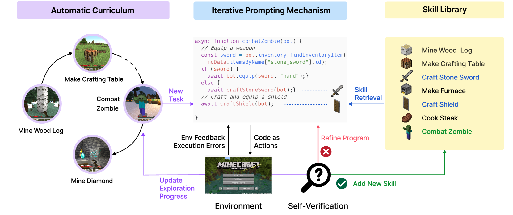
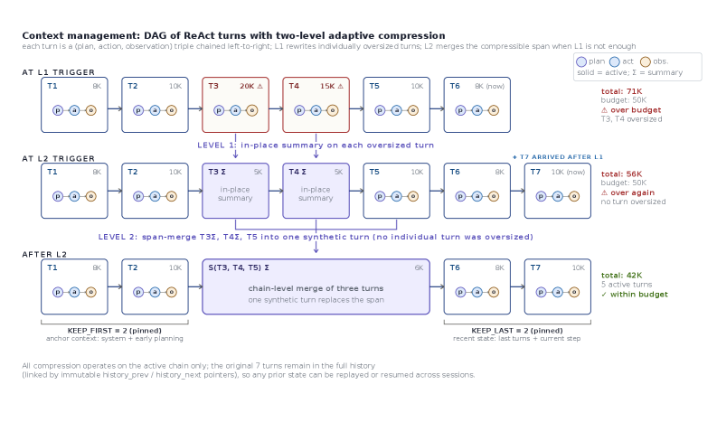
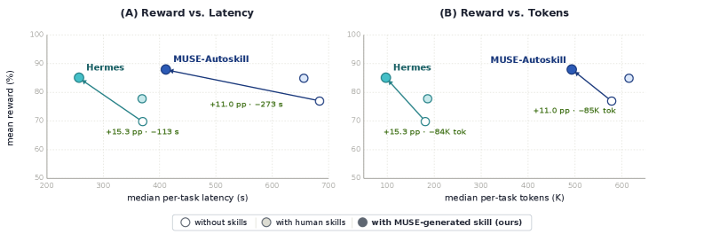
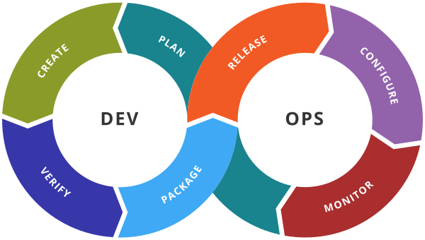

# When Skills Begin to Remember — How Behavior Assets Survive

_MUSE-Autoskill (arXiv:2605.27366) and the five-stage skill lifecycle that points to the next category of AI-Ready Behavior_

## Executive Summary

> [!callout]
> An AI without memory starts from zero every time. Yesterday's solved problem, yesterday's painstakingly crafted procedure, yesterday's nuanced feedback — all of it evaporates the moment a new session opens. That is the single deepest gap between how humans turn experience into ability and how today's agents operate. **On May 26, 2026, a paper landed on arXiv that addresses this gap head-on — MUSE-Autoskill (arXiv:2605.27366, Lin et al., affiliation estimated as ByteDance Infra AI Lab).** MUSE stands for Memory-Utilizing Skill Evolution, and its core thesis fits in one line: **"treat skills not as isolated and static artifacts, but as long-lived, experience-aware, and testable assets."** Not single-use procedures, but assets that accumulate their own experience and earn verification along the way. That single sentence draws the next coordinate for self-evolving agent research.

> MUSE wraps skills inside a five-stage **unified lifecycle (creation, memory, management, evaluation, and refinement)**. Skills are minted on-demand mid-task (Creation), accumulate experience with every invocation (Memory — **skill-level memory**, a genuinely new layer in the literature), are organized and searched in a library (Management), pass through both unit tests and runtime feedback (Evaluation), and then get rewritten when the signals demand it (Refinement). Three months earlier, in February 2026, SkillsBench (arXiv:2602.12670, 86 tasks × 11 domains × 7,308 trajectories) had delivered an uncomfortable verdict — **"self-generated Skills provide no benefit on average."** Models, left to themselves, cannot reliably write the procedural knowledge they benefit from consuming. MUSE reads as a direct response to that diagnosis: generation alone is not enough; you need a lifecycle. In just four months, SkillsBench diagnosed the problem, SkillOpt answered it at the level of single-skill learning, and MUSE answered it at the level of lifecycle governance.

> Pebblous has been tracking this arc as a four-part series — **Voyager (2023, the academic prototype) → Hermes Agent (2025, the industrial implementation) → SkillOpt (May 22, 2026, a learning technique) → MUSE (May 26, 2026, lifecycle governance)**. The level of abstraction climbs one rung each time, from "a skill library" all the way up to "the lifespan of a skill asset." If DataClinic stood on the claim that _data deserves to be treated as a living asset_, that claim now extends naturally into **AI-Ready Behavior** — making behavior, not just data, diagnosable. The five DataClinic signals (labels, distribution, freshness, missingness, outliers) map cleanly onto the five lifecycle stages, and the audit-trail obligations introduced by Korea's AI Framework Act (effective January 22, 2026) line up almost exactly with the evidence chain produced by unit tests + runtime feedback + skill-level memory. If the Hancom + LG AI Research ChatEXAONE alliance (May 22, 2026) was the first signal of SkillOps becoming a Korean agenda, this post — published five days later — is the first Korean-language declaration of **"behavior-asset diagnostics"** as a category.

A one-glance read of the MUSE-Autoskill frame and the quantitative signals around it. Sources: arXiv:2605.27366, arXiv:2602.12670, McKinsey State of AI 2026, LangChain State of AI Agents 2025 (n=1,340), Mem0.ai.

<!-- stat-card -->
**5 stages** — skill lifecycle — Creation · Memory · Mgmt · Eval · Refine

<!-- stat-card -->
**88% / 64%** — pilot failure — McKinsey — 64% cite evaluation gap

<!-- stat-card -->
**31% → 79%** — task completion — LangChain — cost −62%

<!-- stat-card -->
**+16.2pp** — curated skills — SkillsBench — self-gen ≈ 0

## The Limits of Memoryless AI

Anyone who has spent a full hour deep in conversation with an AI agent has felt the small ache at the end of it — **"tomorrow it won't remember any of this."** The company-specific rule you walked it through yesterday, the working procedure you co-discovered, the subtle feedback you offered — all of it is wiped clean the moment the next session opens. A human learns from a single mistake; an agent can repeat the same mistake a hundred times from the same starting line.

Through 2025, every major lab tried to patch this hole with "memory features": ChatGPT memory, Anthropic Memory, Google Gemini personalization. Look closely, though, and they share a common shape. **All of today's memory operates on the axis of "who is talking."** Per user, per session, at most per agent. The idea that "what is being done" — **the skill itself** — could carry its own experience was, until very recently, an empty space in both the literature and the product landscape.

Five days ago, in our [Microsoft SkillOpt deep dive](/report/microsoft-skillopt-self-evolving-agents/en/), we introduced the claim that **"a skill document can be treated as a learnable text asset."** SkillOpt answered the question **"how do you train a single skill?"** The next question follows almost automatically — **once trained, how does that skill remember, accumulate, get verified, and improve?** If a well-crafted procedure forgets itself with every invocation, can we honestly say it has been learned at all?

The market numbers say the question is not abstract. McKinsey's _State of AI 2026_ reports that **88% of agent pilots fail to reach production**, and that among those failures, **64% point to an "evaluation gap"** as the root cause. LangChain's late-2025 survey (n=1,340) finds that organizations introducing **layered memory saw task completion jump from 31% to 79% while costs fell 62%**. Memoryless agents are not merely frustrating in a chat window — they **collapse in production**, and the field data is unambiguous.

> [!callout]
> **This report is an attempt to dissect the first academic effort to fill that empty space — MUSE-Autoskill.** What it proposes, how it actually works, and — most importantly — how a company that has spent years diagnosing data should receive this turn. **From AI-Ready Data to AI-Ready Behavior**: the proposition shifts up one rung.

## What MUSE Proposes — A Five-Stage Lifecycle

The thesis of MUSE-Autoskill (arXiv:2605.27366, Lin · Li · Song · Jiang · Zhang, 2026-05-26) is right at the top of the abstract.

"Existing skill creation approaches treat skills as **isolated and static artifacts**, limiting their reusability, reliability, and long-term improvement."

— MUSE-Autoskill abstract (arXiv:2605.27366)

Read it in plain English — **skills, as we know them today, get authored once and then sit there aging in place.** Voyager's skill library, the procedures Hermes wrote down after detecting a 5+ tool-call pattern, the `best_skill.md` that SkillOpt refined in text space — once minted, none of them were able to accumulate their own operational experience. A skill called a hundred times leaves no trace of those hundred calls anywhere. MUSE's answer is a unified five-stage lifecycle.

"We propose **MUSE-Autoskill Agent (Memory-Utilizing Skill Evolution)**, a skill-centric agent framework that manages skills through a unified lifecycle (**creation, memory, management, evaluation, and refinement**), highlighting the importance of treating skills as **long-lived, experience-aware, and testable assets**."

— MUSE-Autoskill abstract

None of the five stages is itself new. Creation was Voyager's territory; Memory belongs to MemGPT; Management has lived inside industrial AgentOps tools; Evaluation traces back to Reflexion; Refinement to GEPA. **What MUSE does for the first time is bind all five into a single unified lifecycle — drawing the full lifespan of "a skill as an asset" in one figure.** The novelty is integrative: stages that had been working in parallel are now one operational model.

Stretched out in a line, the five stages tell the life of an asset. **It is born (Creation), accumulates experience (Memory), is organized in a library (Management), gets a health check (Evaluation), and is rewritten when needed (Refinement).** Not unlike how a person grows into a profession — first you learn, then you practice, then you share with colleagues, then you get evaluated, then you come back as a better version of yourself. The MUSE paper draws all five into a single picture.

*▲ The MUSE-Autoskill frame — Creation · Management · Memory · Self-Evolution closing into a single five-stage lifecycle inside one agent. | Source: [Lin et al., MUSE-Autoskill, arXiv:2605.27366, Figure 1](https://arxiv.org/abs/2605.27366)*

The cards below give you the five stages at a glance — how they interlock inside a single skill.

<!-- stat-card -->
**① Creation** — When the agent spots a reusable procedure mid-task, it decides **on-demand to crystallize it into a skill document**. Not a human curator, but the agent itself classifying "this procedure deserves to become an asset."

<!-- stat-card -->
**② Memory** — **Experience accumulates per skill** — skill-level memory. Every invocation deposits success/failure signals, variant patterns, and domain context onto the skill itself.

<!-- stat-card -->
**③ Management** — The skill library is **organized, searched, and deduplicated**. Similar skills get merged; unused ones quietly age out.

<!-- stat-card -->
**④ Evaluation** — A **two-track gate: unit tests (static) + runtime feedback (dynamic)**. Skills must pass like a function does, and signals from live operations feed back into the evaluation.

<!-- stat-card -->
**⑤ Refinement** — Evaluation signals drive **updates to the skill body, its memory, and its metadata**. Not a one-shot create-and-forget — the closed loop of evaluation → refinement → back into memory is the heartbeat of the lifecycle.

Why this lifecycle, and why now? Exactly **three months before** MUSE landed (February 13, 2026), another paper rattled the self-evolving agent literature. SkillsBench (arXiv:2602.12670, Li et al.) — **86 tasks × 11 domains × 7,308 trajectories**, the first serious benchmark for agent skills. Its decisive line:

"**Self-generated Skills provide no benefit on average**, showing that models cannot reliably author the procedural knowledge they benefit from consuming."

— SkillsBench abstract (arXiv:2602.12670)

Plainly: when a model fed itself its own self-authored skills, **on average there was no benefit.** The same paper reports that human-curated skills delivered an average +16.2pp lift (with domain-level swings from +4.5 to +51.9pp), while 16 of 84 tasks actually got worse when fed self-generated skills. **"Generation alone is not enough."** Three months later, MUSE — using the same SkillsBench as its evaluation tool — responds with a lifecycle prescription. **SkillsBench diagnosed; MUSE prescribed.**

One important note. **SkillsBench is not MUSE's benchmark.** It is the independent work of a separate team (Li et al.); MUSE simply adopted it as an evaluation tool. And MUSE's own SkillsBench numbers are, in the v1 paper, described only as "initial evidence that lifecycle-managed skills can improve task success, efficiency, reuse, and cross-agent transfer." No exact baseline comparisons have been published yet. So this report deliberately avoids hard quantitative claims about MUSE itself and rests its weight on **the integrative force of the lifecycle frame**.

## Creation — How Skills Are Born

How does a skill come into being? MUSE's Creation stage did not arrive out of nowhere; it sits at the end of a clear lineage we've been tracing.

### 3.1. Voyager — The Original Skill Library

[Voyager (arXiv:2305.16291)](/report/voyager-lifelong-agent-2023/en/), published by NVIDIA and Caltech in 2023, was the first system to build an **ever-growing skill library** on top of GPT-4. Inside Minecraft, the agent autonomously crafted tools, registered them in a library, and reused them on the next task. That was the academic prototype of skills-as-assets. But Voyager's library was a one-way street — **append-only**. A skill, once registered, stayed there without any update, evaluation, or retirement procedure.

*▲ Voyager — the academic prototype. Automatic Curriculum poses tasks, Iterative Prompting writes procedures, Skill Library accumulates the assets. | Source: [Wang et al., Voyager, arXiv:2305.16291, Figure 1](https://arxiv.org/abs/2305.16291)*

### 3.2. Hermes Agent — The First Industrial Implementation

In April 2025, NousResearch released [Hermes Agent](/report/hermes-agent-growth-with-user/en/), which ported Voyager's academic intuition into industrial code. Whenever a user-agent interaction involved five or more tool calls, Hermes would automatically detect it and write the procedure down as a skill — the first industrial implementation of **"an agent that grows alongside its user."** Even so, Hermes lacked the closed feedback loop in which a skill, once written, systematically pulled its own operational data back into a training signal.

### 3.3. MUSE's Creation — Now With Unit Tests

MUSE's Creation stage differs from its predecessors in one decisive way: **unit tests are written alongside the skill from the moment it is born.** Test-Driven Development, transplanted to the level of skills. SkillsBench's diagnosis — that self-generated skills, on average, fail to help — can be read as the predictable consequence of releasing unverified skills into the library, where they act as noise. MUSE inserts a verification gate at Creation precisely to choke off that noise at the source.

How is a skill born? Voyager said "by being registered into the library." Hermes said "by being detected after five repetitions." MUSE says **"by entering the lifecycle already accompanied by its verification."** The same question, answered one rung more carefully each time.

> [!callout]
> **Creation is not a lonely event.** In MUSE, the moment a skill is born is the first breath of a full lifecycle to come. It will not be left to fade unless someone happens to revisit it. Memory will pick up the breath; Evaluation will check its health; Refinement will feed it. That is what the word _asset_ deserves to mean.

## Memory — Skills Accumulate Experience Too

The most genuinely new piece of MUSE lives in the Memory stage. The abstract makes it explicit.

"**Skill-level memory** that accumulates experience for each skill across tasks, enabling more effective reuse and adaptation over time."

— MUSE-Autoskill abstract

Until MUSE, agent memory research has lived along two axes. **Session/user-level memory** (MemGPT 2023, ChatGPT memory 2024, Anthropic Memory 2025) and **agent-level memory** (Generative Agents 2023, Reflexion 2023). Session memory remembers "who I am talking with." Agent memory remembers "what this agent has lived through." MUSE introduces a third layer explicitly — **memory at the level of the skill itself.**

The three layers, side by side, make the distinction sharp.

| Memory level | Representative work | What it remembers | Limitation |
| --- | --- | --- | --- |
| Session / User | MemGPT (2023), ChatGPT memory (2024) | A conversation history with one person | Change the skill, same user — same memory |
| Agent | Generative Agents (2023), Reflexion (2023) | The agent's own stream of experience | Everything the agent ever did, mixed into one memory |
| Skill | MUSE (2026) | One skill's invocation history — success, failure, variants | A new operational dimension (the subject of this post) |

Sources: synthesis from MemGPT (arXiv:2310.08560), Generative Agents (arXiv:2304.03442), Reflexion (arXiv:2303.11366), MUSE-Autoskill (arXiv:2605.27366).

The cleanest analogy for this idea comes from object-oriented programming: **the split between class and instance.** A class defines a method; the class has no notion of which instances have called that method or how. But suppose the method itself remembered — "how many times have I been called? how many of those succeeded? which argument patterns trip me up?" That is exactly what skill-level memory means. A method that carries its own call history, like an instance — a new operational dimension.

### 4.1. Cross-Task Transfer — Same Skill, Different Tasks

One decisive consequence of skill-level memory is **cross-task transfer**. When the same user moves to a different task, or a different user runs the same kind of task, the skill arrives carrying the experience it has accumulated from previous invocations. Whichever user, whichever task — every experience this skill has met travels with it into the next call. The route by which the value of data turns into the value of behavior is made explicit here for the first time.

### 4.2. LangChain's Layered Memory Data — The Empirical Footing

Direct academic numbers on skill-level memory are still v1-thin, but adjacent industry data gives a strong adjacent signal. **LangChain's late-2025 survey (n=1,340)** reports that organizations introducing layered memory (combined session- and agent-level memory) saw **task completion jump from 31% to 79% while costs fell 62%**. Moving from single-layer to multi-layer memory alone nearly doubled production-grade success. MUSE's skill-level memory adds a third layer onto that stack, and a similar (or larger) quantitative effect is a reasonable expectation.

The paper itself shows what actually accumulates inside a single skill through a concrete breakdown of the SKILL.md package — **median 326 lines of SKILL.md body, ~9% scripts, ~9% unit tests, 0% references**. A quantitative snapshot of what it takes to turn a procedure into an asset.

*▲ MUSE skill package breakdown — (A) SKILL.md size distribution (human-curated median 146 lines vs MUSE-generated 326 lines), (B) component composition. The decisive difference is unit tests showing up at 9%. | Source: [Lin et al., MUSE-Autoskill, arXiv:2605.27366, Figure 5](https://arxiv.org/abs/2605.27366)*

> [!callout]
> **"Where does the experience from a hundred invocations live?"** Before MUSE, it lived nowhere in particular. It drained into user memory and dispersed at session end; it folded into agent memory and lost its identity in the mix. After MUSE, those hundred invocations become an asset that lives with the skill itself. The claim that data is a living asset has just been carried over, intact, to behavior.

## Evaluation + Refinement — Only Verified Skills Survive

At the heart of SkillsBench's diagnosis — "self-generated Skills provide no benefit on average" — is a problem of **unverified skills**. MUSE's Evaluation stage is the direct prescription.

"We evaluate them through **unit tests and runtime feedback** for continuous refinement."

— MUSE-Autoskill abstract

The two-track nature of the verification is the point. **Unit tests are static; runtime feedback is dynamic.** Each track catches a different family of failures.

### 5.1. Unit Tests — TDD at the Skill Level

Just as functions pass unit tests in code review, skills must pass their declared inputs, outputs, and exception behaviors before they enter the library. Fifty years of software engineering practice gets transplanted, here, into skill-level verification. Unit tests — once a chore for humans — become an automated gate that an optimizer model writes and checks alongside the skill itself.

### 5.2. Runtime Feedback — Failures That Only Show Up in Production

Unit tests do not catch everything. Subtly out-of-distribution inputs, small drifts in the tool environment, semantic drift accumulated over time — these surface only at runtime. The verbal-feedback mechanism first proposed by Reflexion (2023) enters MUSE as the second verification track, using self-critique to catch failure and anomaly patterns that emerge during operation. A double safety net: static gates for what static gates can catch, dynamic gates for the rest.

### 5.3. Refinement — The Closed Loop of Verification Signals

Once Evaluation signals accumulate, Refinement kicks in. Structural defects caught by unit tests flow into rewrites of the skill body; semantic drift caught by runtime feedback flows into updates to memory and metadata. The refined skill then re-enters Memory, becoming the starting point for the next invocation. **Creation → Memory → Management → Evaluation → Refinement → Memory** — a closed loop. Rather than a create-and-forget event, the lifecycle itself becomes the locus of learning.

The MUSE paper compresses the effect of this evaluation + refinement coupling into a single chart. Reward (quality) holds steady, while latency and tokens drop — **lifecycle-managed skills come out cheaper, faster, and more accurate**.

*▲ MUSE quantitative results — across "without skills / with human skills / with MUSE-generated skills," lifecycle-managed skills raise reward by +11.0pp while simultaneously cutting latency and tokens. | Source: [Lin et al., MUSE-Autoskill, arXiv:2605.27366, Figure 4](https://arxiv.org/abs/2605.27366)*

Why does the industry need this lifecycle right now? One set of numbers makes the urgency vivid. The three figures below are not unrelated statistics — they trace a single picture: **the field is collapsing, more than half of those collapses point to missing evaluation, and adding even one memory layer nearly doubles recovery.** McKinsey diagnoses, LangChain responds.

<!-- stat-card -->
**88%** — pilots stall — McKinsey: agent PoCs fail to reach production

<!-- stat-card -->
**64%** — evaluation gap — The leading reason cited by failing teams

<!-- stat-card -->
**+48pp** — layered memory effect — LangChain: task completion 31% → 79%, cost −62%

McKinsey's 88%/64% is not just a benchmark. It is the signal that **nearly every pilot is collapsing in the field, and that more than half of those collapses come down to "no evaluation system in place."** If SkillOpt's text-space learning produces +23.5pt on a single skill, MUSE's lifecycle evaluation opens the on-ramp for the 84% that have been stuck — and the industrial significance dwarfs a one- or two-point lift on any single benchmark.

> [!callout]
> **A clean match with Korea's AI Framework Act (effective January 22, 2026).** The law requires high-impact AI assessments to demonstrate "the presence of systems for in-operation risk detection, containment, and switchover." The lifecycle data produced by MUSE's Evaluation (unit tests + runtime feedback) + skill-level memory + Refinement maps almost one-to-one onto that audit trail's technical evidence chain. Compliance overhead absorbed naturally into lifecycle overhead.

## Voyager → Hermes → SkillOpt → MUSE — Coordinates of a Quartet

Pebblous's self-evolving agents series has rested on one assumption from the start — **academic intuition flows into industry, and industrial implementations flow back to refine the academy.** The arc from Voyager to MUSE, in just four years, traces that loop precisely.

| When | Work | Position | What was new |
| --- | --- | --- | --- |
| 2023-05 | Voyager (NVIDIA · Caltech) | Academic prototype | ever-growing skill library — the first claim that skills are "assets" |
| 2025-04 | Hermes Agent (NousResearch) | Industrial implementation | 5+ tool-call detection → automatic skill authoring |
| 2026-05-22 | SkillOpt (Microsoft) | Learning technique | text-space gradient descent — +23.5pt on a single skill |
| 2026-05-26 | MUSE-Autoskill (ByteDance, est.) | Lifecycle governance | Five-stage unified lifecycle + skill-level memory |
| 2026-05-27 | Pebblous publishes | Categorization in Korean | AI-Ready Data → AI-Ready Behavior · SkillClinic declared |

****Sources: synthesis from each paper's arXiv entry, NousResearch Hermes Agent v0.10.0, Microsoft SkillOpt project page, and the estimated ByteDance Infra AI Lab affiliation.

Running through the series, you can watch the level of abstraction climb one rung at a time. Voyager was the academic prototype of **"the skill is an object that exists."** Hermes showed **"how that object gets automatically authored inside industrial code."** SkillOpt solved **"how to treat that object as something learnable."** MUSE finally asks **"how to govern that object as a living asset."** From a single skill to a full library, from a learning technique to lifecycle governance — five years of thinking deepening one step at a time.

### 6.1. AgentOps → SkillOps → MemoryOps — How the Category Evolves

Tech has historically absorbed new paradigms through "operations" categories. DevOps (2007), MLOps (2017), LLMOps (2023). Around 2024, **AgentOps** stabilized — a four-way market in Mem0 (GitHub 48,000+ stars, Series A $24M, exclusive partnership with AWS Agent SDK), Letta, Zep, and LangMem. Anthropic's _Agent Skills Open Standard_ (December 2025), adopted simultaneously by Claude, OpenAI Codex, and Gemini CLI, was the decisive signal that the category had landed.

*▲ The DevOps toolchain prototype — Plan · Code · Build · Test · Release · Deploy · Operate · Monitor, in a closed loop. SkillOps inherits this lineage and adds "lifecycle of a skill asset" on top. | Source: [Wikimedia Commons](https://commons.wikimedia.org/wiki/File:Devops-toolchain.svg), CC BY-SA 4.0*

From the spring of 2026, a new sub-segment is now taking shape on top of it — **SkillOps**. SkillOpt and MUSE have drawn the academic blueprint; the industrial tooling has yet to standardize. And alongside it sits an even larger empty space — **MemoryOps**. Once skill-level memory matures, the lifecycle management of memory itself (creation, diagnosis, deletion, transfer) will likely break off as its own category.

| When | Category | Representative tools / standards |
| --- | --- | --- |
| 2007 | DevOps | Jenkins, Git, Docker, Kubernetes |
| 2017 | MLOps | MLflow, Kubeflow, SageMaker |
| 2023 | LLMOps | LangSmith, Langfuse, Weights & Biases |
| 2024 | AgentOps | Mem0, Letta, Zep, LangMem · Agent Skills Open Standard |
| 2026~ | SkillOps | SkillOpt, MUSE-Autoskill (academic blueprint); standard tooling not yet settled |
| TBD | MemoryOps | Expected to spin out as skill-level memory matures |

Sources: synthesis from each category's standardization timeline, Mem0.ai blog, and Anthropic's Agent Skills Open Standard (December 2025).

### 6.2. The Big-Tech Memory Race

The spring of 2026 is when every major lab planted a flag on the memory/skill frontier. **Anthropic's _Dreaming_** (May 6, 2026, reported by VentureBeat) proposed a system in which agents learn from their own mistakes; **Microsoft's SkillOpt** reported +23.5pt from learning a single skill. **Meta's HyperAgent** and **Google's Astra** accelerated their own work on memory and tool-use integration in the same window. MUSE's estimated affiliation — ByteDance Infra AI Lab — suggests that Eastern tech companies are now formally entering the academic conversation as well.

### 6.3. One Note of Caution — A Same-Name Adjacent Case

One fact to set straight before moving on. The **MUSE-Autoskill (arXiv:2605.27366, Lin et al., May 26, 2026)** at the center of this report is distinct from a separate framework — _"Learning on the Job"_ (arXiv:2510.08002, Cheng Yang et al., a five-institution collaboration, October 9, 2025, GitHub KnowledgeXLab/MUSE) — published around the same time. They share the acronym "MUSE," but the authors, affiliations, and approach are different. This report explicitly names **arXiv:2605.27366** as its primary source, having verified the link verbatim.

## Time to Diagnose Behavior Assets — A Pebblous Read

Pebblous has been moving, year after year, behind one claim — **"make data diagnosable."** DataClinic diagnosed five signals in training data; AI-Ready Data was the output category; DataGreenhouse and PebbloSim provided the operating environments. The claim MUSE-Autoskill puts on the table is the natural next step — **can _behavior_ assets be made diagnosable too?**

### 7.1. AI-Ready Data → AI-Ready Behavior

The claim shifts up one rung. A company that has spent years diagnosing the quality of data for training moves, naturally, into diagnosing the quality of behavior assets for agents. If SkillOpt showed that "a skill document is a learnable text asset," MUSE declares that _"the same text asset is a long-lived asset with a lifecycle."_ Where the two propositions meet, the next Pebblous category emerges — **AI-Ready Behavior**. The proposition of data diagnostics, extended into the dimension of behavior.

### 7.2. DataClinic's Five Signals → SkillClinic's Five Signals

DataClinic has long diagnosed training data across five signals — label integrity, distribution balance, freshness, missingness, outliers. Those five signals map one-to-one onto the five lifecycle stages. **The same diagnostic philosophy, carried over from data to behavior.**

| DataClinic five signals (data) | → | SkillClinic five signals (behavior assets) | What the mapping means |
| --- | --- | --- | --- |
| Label integrity | → | Creation defects | Skills decided incorrectly; assets ossified around a wrong procedure |
| Distribution balance | → | Memory accumulation balance | Has the skill's experience been collected from too narrow a domain or pattern? |
| Freshness | → | Lifecycle turnover | A skill that hasn't been updated in a year; an asset minted once and forgotten |
| Missingness | → | Missing verification gates | A skill deployed without unit tests; a skill whose runtime feedback has gone silent |
| Outliers | → | Refinement triggers | A skill whose runtime feedback has suddenly worsened; an anomalous invocation pattern |

Source: Pebblous DataClinic five signals → MUSE-Autoskill lifecycle five stages, mapped one-to-one (this report's own synthesis). The first such mapping in either language.

This mapping is a Pebblous asset. No work in English has yet attempted to lay the DataClinic five signals against the lifecycle five stages in this kind of one-to-one form. **"Behavior assets are assets that can be diagnosed"** — declared, for the first time, as a category, in this post.

### 7.3. What Customers and Partners Will Ask — Four Questions

Lifecycle governance is attractive, but it also introduces a new operational burden — "who manages the skill assets, and how?" The questions practitioners will naturally raise are clear:

- •In our skill library, how many skills are **alive, dead, or duplicated**?
- •Is the experience memory accumulated on a given skill **trustworthy**? Is there a hidden bad accumulation?
- •How do we diagnose the **structural defects** that unit tests do not catch?
- •How do we satisfy the audit-trail requirements of Korea's AI Framework Act using **lifecycle data**?

Every one of these questions is **the work of a data-diagnostics company**. If Pebblous can deliver tools — visualization, diagnosis, management — for behavior assets adapted to the Korean enterprise context, the on-ramp into the AgentOps · SkillOps market past MLOps becomes a natural one.

### 7.4. A Korean Coincidence — Between May 22 and May 27

Korea's market coordinates support the same arc. By IITP estimates, the Korean AI market grows from **KRW 3.44 trillion in 2025 to KRW 4.46 trillion in 2027 (14.3% CAGR)**. In the very same spring, one decisive week opened across the Korean AI industry.

The timeline below is not a list of events. **Regulation (the AI Framework Act) had already laid down the grammar of audit trails; industry (the Hancom × LG alliance) planted Korea's first SkillOps flag on the same day; academia (SkillOpt and MUSE) drew the lifecycle blueprint on top.** Within five days, regulation, industry, and academia met in one place — and Pebblous's publication date sits at the point that pulls the meeting into a Korean-language category. The timing is not coincidence; it is the natural inflection point at which a category forms.

| Date | Event | What it means |
| --- | --- | --- |
| 2026-01-22 | Korea's AI Framework Act takes effect | High-impact AI assessments require systems for in-operation risk detection, containment, and switchover |
| 2026-05-22 | Hancom × LG AI Research ChatEXAONE alliance | First signal of SkillOps as a Korean agenda |
| 2026-05-22 | Microsoft SkillOpt arXiv (same day) | +23.5pt empirical lift on a single skill |
| 2026-05-26 | MUSE-Autoskill arXiv | First unified five-stage lifecycle + skill-level memory |
| 2026-05-27 | Pebblous publishes (this report) | AI-Ready Behavior · SkillClinic declared as a Korean-language category |

Sources: Korea Law Information Center, ZDNet Korea (2026-05-22), arXiv submission dates, Pebblous synthesis.

The timing is not coincidence. Four months after the Korean AI Framework Act's audit-trail requirements take effect, five days after the Hancom × LG ChatEXAONE alliance puts a Korean SkillOps agenda on the table — exactly here, the academy delivers a lifecycle frame, and Pebblous receives it as a Korean-language diagnostic category. **AI-Ready Data → AI-Ready Behavior**, **DataClinic → SkillClinic**, **DataGreenhouse → BehaviorGreenhouse**. Three pairs of claims, lined up in a single row.

## Where Does Memory Live?

Anyone who has spent a deep hour with an AI agent has felt the small ache — that the conversation will be gone tomorrow. What MUSE-Autoskill proposes is the closest thing yet to a first academic answer to that ache. **Memory lives with users, and with agents, and in the end, with the skills themselves.** A procedure carries its own invocation history. A skill accumulates a hundred experiences inside itself. The category of a behavior asset that remembers yesterday has finally been drawn, for the first time, as an academic frame.

An AI with memory is not simply a smarter AI. **It becomes a more human-shaped collaborator.** If today it still remembers the company conventions a user explained yesterday, if it slightly adjusts yesterday's failed procedure before trying again, if every small operational asset carries its own experience — then it stops being a tool that repeats the same mistake from the same starting line, and becomes a colleague that grows alongside us. MUSE drew that future as a five-stage lifecycle. Pebblous receives it, and writes it down as a Korean diagnostic category.

One honest caveat. MUSE's decisive quantitative results are still v1-thin: precise comparison scores, baseline lifts, confidence intervals — all of it waits for the next version. But that is not where this report's weight sits. **What matters is the integrative force of the frame itself.** Five lifecycle stages, three layers of memory, two tracks of verification, one new category. Before the numbers fill in, the qualitative map gets drawn. The proposition of data diagnostics extended, by one rung, into behavior diagnostics — and the first Korean-language coordinate for it.

> [!callout]
> **What the next posts will explore — what if pb had memory?** If Pebblous's internal AI agent pb gained skill-level memory, what would become possible? It could fold the company tone a colleague taught yesterday into today's writing; it could route around last week's failed deployment one step at a time; every small asset could accumulate, line by line, its own experience. That future is what happens when the peak of academic insight gets rewritten in the warmth of an industrial workflow. The next posts in this series will draw that future slowly.

## References

The academic papers, industrial standards, market reports, and policy documents cited in this report, organized by source group. Primary sources (arXiv papers) link directly so you can verify the verbatim quotations.

### Primary sources — the focal papers

- 1.Lin, H., Li, P., Song, J., Jiang, F., & Zhang, T. (2026). [**MUSE-Autoskill: Self-Evolving Agents via Skill Creation, Memory, Management, and Evaluation**](https://arxiv.org/abs/2605.27366). arXiv:2605.27366. (Estimated affiliation: ByteDance Infra AI Lab), 2026-05-26.
- 2.Li, X., Chen, W., Liu, Y., Zheng, S. et al. (2026). [_SkillsBench: Benchmarking How Well Agent Skills Work Across Diverse Tasks_](https://arxiv.org/abs/2602.12670). arXiv:2602.12670. 2026-02-13.

### Self-evolving agents lineage (academic)

- 3.Wang, G., Xie, Y., Jiang, Y., Mandlekar, A., Xiao, C., Zhu, Y., Fan, L., & Anandkumar, A. (2023). [_Voyager: An Open-Ended Embodied Agent with Large Language Models_](https://arxiv.org/abs/2305.16291). NeurIPS 2023 Workshop. arXiv:2305.16291.
- 4.Yao, S., Zhao, J., Yu, D., Du, N., Shafran, I., Narasimhan, K., & Cao, Y. (2023). [_ReAct: Synergizing Reasoning and Acting in Language Models_](https://arxiv.org/abs/2210.03629). ICLR 2023. arXiv:2210.03629.
- 5.Shinn, N., Cassano, F., Berman, E., Gopinath, A., Narasimhan, K., & Yao, S. (2023). [_Reflexion: Language Agents with Verbal Reinforcement Learning_](https://arxiv.org/abs/2303.11366). NeurIPS 2023. arXiv:2303.11366.
- 6.Park, J. S., O'Brien, J. C., Cai, C. J., Morris, M. R., Liang, P., & Bernstein, M. S. (2023). [_Generative Agents: Interactive Simulacra of Human Behavior_](https://arxiv.org/abs/2304.03442). UIST 2023. arXiv:2304.03442.
- 7.Packer, C., Wooders, S., Lin, K., Fang, V., Patil, S. G., Stoica, I., & Gonzalez, J. E. (2023). [_MemGPT: Towards LLMs as Operating Systems_](https://arxiv.org/abs/2310.08560). arXiv:2310.08560.
- 8.Wang, Z. Z., Mao, J., Fried, D., & Neubig, G. (2024). [_Agent Workflow Memory_](https://arxiv.org/abs/2409.07429). arXiv:2409.07429.
- 9.Agrawal, L. A. et al. (2025). [_GEPA: Reflective Prompt Evolution Can Outperform Reinforcement Learning_](https://arxiv.org/abs/2507.19457). ICLR 2026 (Oral). arXiv:2507.19457.
- 10.Yang, Y., Gong, Z., Huang, W. et al. (2026). [_SkillOpt: Executive Strategy for Self-Evolving Agent Skills_](https://arxiv.org/abs/2605.23904). arXiv:2605.23904. Microsoft Research, 2026-05-22.
- 11.Yang, C., Yang, X., Wen, L. et al. (2025). [_Learning on the Job: An Experience-Driven, Self-Evolving Agent for Long-Horizon Tasks_](https://arxiv.org/abs/2510.08002). arXiv:2510.08002. (A distinct same-name case — see §6.3 of this report.)

### Industry / standards / tools

- 12.NousResearch (2026-04-16). [_Hermes Agent v0.10.0_](https://hermes-agent.nousresearch.com/).
- 13.Anthropic (2025-12). _Agent Skills Open Standard_. (Adopted by Claude, OpenAI Codex, Gemini CLI.)
- 14.VentureBeat (2026-05-06). _Anthropic introduces 'dreaming': a system that lets AI agents learn from their own mistakes_.
- 15.Mem0.ai (2026). [_State of AI Agent Memory 2026_](https://mem0.ai/blog/state-of-ai-agent-memory-2026). (GitHub 48,000+ stars, Series A $24M, exclusive AWS Agent SDK partnership.)
- 16.Microsoft (2026). [microsoft/SkillOpt](https://github.com/microsoft/SkillOpt). GitHub repository (MIT License).

### Market and quantitative reports

- 17.Stanford HAI (2026). [_AI Index Report 2026_](https://hai.stanford.edu/ai-index/2026-ai-index-report).
- 18.McKinsey & Company (2026). [_The State of AI 2026_](https://www.mckinsey.com/capabilities/quantumblack/our-insights/the-state-of-ai). (88% of agent pilots fail to reach production; 64% cite an evaluation gap.)
- 19.LangChain (2025). [_State of AI Agents 2025_](https://www.langchain.com/state-of-agent-engineering). (n=1,340. Layered memory: task completion 31% → 79%, cost −62%.)
- 20.Gartner (2026). _Hype Cycle for Agentic AI 2026_. (40%+ of projects forecast to be cancelled by 2027.)

### Korea — market and policy

- 21.Korea Law Information Center. [**Framework Act on the Development of Artificial Intelligence and Establishment of Trust**](https://www.law.go.kr/lsInfoP.do?lsiSeq=268543). Effective 2026-01-22.
- 22.ZDNet Korea (2026-05-22). [**Hancom × LG AI Research ChatEXAONE strategic alliance**](https://zdnet.co.kr/view/?no=20260522105512).
- 23.IITP (2026). **2026 AI · ICT Industry Report**. (Korean AI market: KRW 3.44T in 2025 → KRW 4.46T in 2027, 14.3% CAGR.)

### Pebblous series — preceding posts (the quartet)

- 24.Pebblous (2026-05). [**Voyager — The Origin of Self-Learning AI**](/report/voyager-lifelong-agent-2023/en/). Part 1 of 4 · the academic prototype track.
- 25.Pebblous (2026-05-13). [**Agents Grow Too — Hermes Agent and the Era of Autonomous Data OS**](/report/hermes-agent-growth-with-user/en/). Part 2 of 4 · the industrial implementation track.
- 26.Pebblous (2026-05-27). [**Skill Documents Start to Learn — The Era of the Behavior Operating System (Microsoft SkillOpt deep dive)**](/report/microsoft-skillopt-self-evolving-agents/en/). Part 3 of 4 · the learning-technique track.
