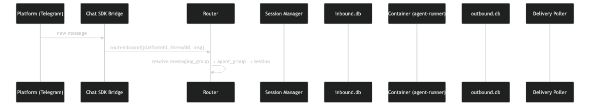
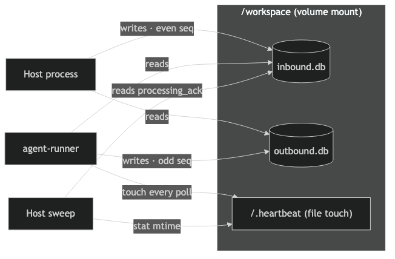
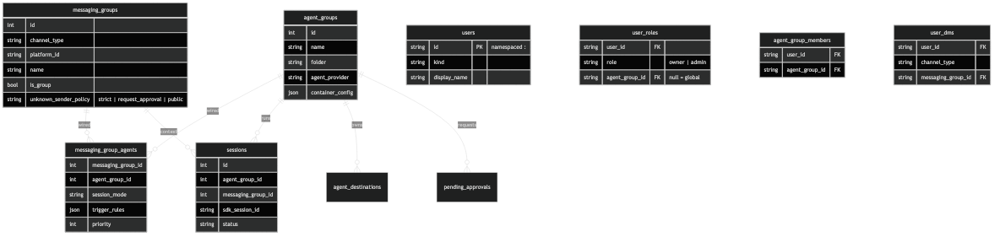

# 21개 파일로 보는 AI 에이전트 아키텍처의 선택과 한계 — NanoClaw 완전 해부

_Claude Agent SDK 위의 단일 프로세스 멀티채널 에이전트, 그 구조적 트레이드오프_

## Executive Summary

> [!callout]
> 21개 파일, 5,526줄. 처음 NanoClaw(v1.2.12)의 소스를 열었을 때, 이 안에 멀티채널 AI 에이전트의 전 생애가 담겨 있다는 사실이 잘 믿기지 않았다. 단일 Node.js 프로세스가 메시지를 받고, 컨테이너를 띄우고, 스케줄을 잡고, 다시 답을 돌려 보낸다. 추론 루프는 Claude Agent SDK에 맡겼지만, 그 바깥의 모든 것을 이 한 프로세스가 손수 챙긴다.

> GitHub 27,690 스타, 12,607 포크. 작은 코드베이스에 이 정도의 관심이 모인 이유는 따로 있다. 그러나 동시에 한계도 분명하다. SQLite 단일 파일에 매달려 있고, 수평 확장이 막혀 있고, 실제로 살아 움직이는 채널은 Slack과 Gmail 두 개뿐이다. 작게 만든 것에는 이유가 있지만, 작게 만든 것에는 대가도 있다.

> 이 글은 NanoClaw를 Claude Agent SDK(라이브러리, v0.2.118, 월 1,680만 npm 다운로드)와 Anthropic Managed Agents(호스팅 플랫폼, 2026년 4월 출시)와 나란히 놓고 따라가 본다. 같은 에이전트 시대의 세 가지 다른 답이 있다. 라이브러리, 자체 호스팅 프레임워크, 그리고 완전 관리형. 어떤 선택은 우아하고, 어떤 선택은 대가를 치른다. 이 보고서는 그 선택들을 하나씩 열어 보는 과정이다. 이 글은 [Claude 워치](/project/AnthropicClaude/ko/) 시리즈의 에이전트 아키텍처 편으로, Claude Agent SDK 위에서 무엇을 직접 만들고 무엇을 맡길 것인가를 본다.

## NanoClaw란 무엇인가 — 21개 파일로 이루어진 AI 에이전트

NanoClaw는 OpenClaw(434,453줄, 3,680 파일)의 경량 대안으로 탄생했다. "전체 코드베이스를 8분 내 파악 가능"을 목표로 한 극단적 미니멀리즘이 설계의 출발점이다. 실측 규모는 21개 소스 파일, 5,526줄이며, 런타임 의존성은 8개에 불과하다.

NanoClaw의 설계는 세 가지 원칙 위에 서 있다.

- •**Code-as-Configuration** — 설정 파일이 0개다. 동작을 바꾸려면 코드를 직접 수정한다. OpenClaw의 53개 설정 파일과 대비된다.
- •**Skills Over Features** — 기능을 프레임워크에 내장하지 않고, 스킬(코드 조각)로 확장한다. 프레임워크는 얇게 유지한다.
- •**AI-Native Debugging** — 에이전트가 자기 자신의 코드를 읽고 디버깅할 수 있을 만큼 작아야 한다.

다음은 OpenClaw와 NanoClaw의 규모 비교다.

| 항목 | OpenClaw | NanoClaw |
| --- | --- | --- |
| 소스 파일 | 3,680개 | 21개 |
| 코드 줄 수 | 434,453줄 | 5,526줄 |
| 의존성 | 70+ | 8개 |
| 설정 파일 | 53개 | 0개 |

기술 스택은 Node.js 20+, TypeScript(전체의 90.2%), SQLite(WAL 모드), Docker/Apple Container, Claude Agent SDK로 구성된다. Shell 스크립트가 7.6%, Python이 1.2%를 차지한다.

## 아키텍처 해부 — 메시지가 흐르는 길

NanoClaw 안에서 하나의 메시지가 처리되는 경로를 추적하면, 이 시스템의 설계 의도가 선명하게 드러난다. 메시지는 다음과 같은 경로를 따라 흐른다.

*▲ NanoClaw 메시지 흐름 — 클릭하면 확대 | Source: [NanoClaw 공식 문서](https://github.com/qwibitai/nanoclaw/blob/main/docs/architecture-diagram.html)*

`src/index.ts`(662줄)가 전체 시스템의 오케스트레이터다. Anthropic이 제안하는 Orchestrator-Workers 패턴에 정확히 대응한다. 이 파일 하나가 채널 등록, 메시지 폴링, 컨테이너 관리, 응답 라우팅을 모두 담당한다.

### 2.1 채널 자기등록 패턴

채널 연결은 `registry.ts`(28줄)의 Map 기반 패턴으로 구현된다. 크레덴셜이 환경변수에 존재하면 해당 채널이 자동으로 활성화된다. 코드에 채널을 하드코딩하지 않아도 되는 우아한 설계이지만, v1.2.12 기준으로 실제 활성화된 채널은 Slack과 Gmail 2개뿐이다. WhatsApp, Telegram, Discord 어댑터는 주석 처리 상태다.

### 2.2 동시성 제어: GroupQueue

`group-queue.ts`(366줄)는 두 가지 동시성을 동시에 관리한다. 그룹 내 메시지 순서를 보장하면서, 글로벌 수준에서는 `MAX_CONCURRENT_CONTAINERS=5`라는 물리적 상한을 건다. 동시에 5개 이상의 컨테이너가 실행될 수 없다는 뜻이다.

학술적으로 보면 이 구조는 Supervisor/Hub-Spoke 패턴에 해당한다. 가장 성숙한 패턴이지만 "중앙 오케스트레이터가 스케일에서 병목이 된다"는 알려진 한계가 있다(arXiv:2601.13671).

## 컨테이너 격리 전략 — 보안의 물리적 경계

NanoClaw가 다른 에이전트 프레임워크와 가장 뚜렷하게 구분되는 지점은 OS 수준 컨테이너 격리를 프레임워크 자체에 내장했다는 점이다. LangGraph, CrewAI, AutoGen 중 어느 것도 이 수준의 격리를 제공하지 않는다.

### 3.1 .env 섀도잉: API 키의 물리적 차단

`buildVolumeMounts()` 함수는 `.env` 파일을 `/dev/null`로 마운트한다. 컨테이너 내부에서 API 키가 물리적으로 존재하지 않는 것이다. 단순히 환경변수를 전달하지 않는 수준이 아니라, 파일 자체를 빈 장치로 덮어쓰는 적극적 차단이다.

### 3.2 Credential Proxy 패턴

`credential-proxy.ts`(126줄)가 API 키를 호스트 측에서 관리하며, 컨테이너는 프록시를 통해서만 외부 서비스에 접근한다. OWASP ASI05(Unexpected Code Execution)와 ASI03(Identity and Privilege Abuse)에 대응하는 설계다.

### 3.3 파일시스템 기반 IPC

에이전트와 호스트 간 통신은 네트워크 소켓이 아닌 파일시스템 기반 IPC로 동작한다(`ipc.ts`, 490줄). 네트워크 포트를 열지 않으므로 공격 면적이 줄어든다.

### 3.4 격리 3단계 옵션

NanoClaw는 격리 수준을 3단계로 제공한다.

- •**Docker 컨테이너** — 기본 격리. 공유 커널 위에서 동작하므로 커널 취약점에는 노출된다.
- •**Docker Sandboxes(마이크로VM)** — Firecracker 수준의 격리. 부팅 시간 약 125ms, 메모리 5MiB 미만.
- •**Apple Container** — macOS 네이티브 가상화. 개발 환경에서 Docker 없이 격리를 제공한다.

다만 컨테이너 격리만으로 보안이 완결되지는 않는다. 학술 연구와 NanoClaw 자체 코드에서 드러나는 추가 고려사항을 짚어본다.

> [!callout]
> **주의:** 컨테이너 격리는 보안의 시작이지 끝이 아니다. IsolateGPT(NDSS 2025) 연구에 따르면 컨테이너는 호스트 커널을 공유하므로, 비신뢰 코드 실행에는 MicroVM이 권장된다. `mount-security.ts`(420줄)의 allowlist 기반 마운트 경로 검증이 추가적인 방어선을 구축한다.

## 스케줄러와 상태 관리 — SQLite 위의 시간

NanoClaw의 모든 상태는 단일 SQLite 파일에 저장된다. 메시지 저장, 그룹 등록, 스케줄 상태, 세션 매핑까지 7개 테이블, 4개 인덱스가 WAL 모드로 동작한다. `db.ts`(698줄)가 30개의 export 함수로 전체 데이터 액세스를 담당한다.

*▲ Two-DB Split — 호스트와 컨테이너가 각각 다른 SQLite 파일에 쓴다. 클릭하면 확대 | Source: [NanoClaw 공식 문서](https://github.com/qwibitai/nanoclaw/blob/main/docs/architecture-diagram.html)*

*▲ Entity-Relationship 모델 — 7개 테이블의 관계. 클릭하면 확대 | Source: [NanoClaw 공식 문서](https://github.com/qwibitai/nanoclaw/blob/main/docs/architecture-diagram.html)*

### 4.1 3종 스케줄 타입

`task-scheduler.ts`(297줄)는 세 가지 스케줄 타입을 지원한다.

- •**cron** — 특정 시각에 반복 실행. 표준 cron 표현식을 사용한다.
- •**interval** — 일정 간격으로 반복. 밀리초 단위로 지정한다.
- •**once** — 특정 시각에 1회 실행 후 삭제한다.

### 4.2 Drift Prevention

스케줄러의 핵심은 drift prevention 로직이다. `computeNextRun()` 함수는 interval 타입에서 `Date.now()`가 아닌 `task.next_run`을 앵커로 사용한다. `while (next <= now) next += ms;` 루프로 놓친 간격을 건너뛰되, 실행 지연이 누적되지 않도록 한다. 단, `SCHEDULER_POLL_INTERVAL`이 60초이므로 최대 60초의 실행 지연은 불가피하다.

### 4.3 의도적 트레이드오프

SQLite 단일 파일은 의도적 트레이드오프다. 외부 DB 서버가 불필요하고, 단일 파일로 배포할 수 있는 운영 단순성을 확보했다. 대가로 수평 확장이 구조적으로 불가능하며, WAL 모드에서도 쓰기는 직렬화된다. 에이전트 메모리 서베이(arXiv:2603.07670)가 제안하는 벡터 검색이나 반성적 메모리도 존재하지 않는다.

## Skills 시스템과 MCP 통합 — 확장의 설계

NanoClaw가 외부 세계와 연결되는 경로는 두 가지다. 하나는 Skills 시스템이고, 다른 하나는 MCP(Model Context Protocol) 통합이다.

### 5.1 Skills: 코드로 정의된 확장

Skills는 YAML 프론트매터 기반의 적시 로딩(just-in-time loading) 방식으로 동작한다. 에이전트가 특정 스킬이 필요한 시점에 해당 스킬의 정의를 로드하여 컨텍스트에 주입한다. 이는 "필요할 때만 로드"하는 원칙으로, 컨텍스트 윈도우의 효율적 사용을 위한 설계다.

### 5.2 MCP 패스스루

MCP(2024년 11월 Anthropic 발표)는 Host/Client/Server 3자 구조, JSON-RPC 2.0 기반의 도구 통합 프로토콜이다. NanoClaw는 Claude Agent SDK의 `mcpServers` 옵션을 통해 stdio/HTTP 전송으로 MCP 서버를 연결한다. MCP의 5개 프리미티브(Tools, Resources, Prompts, Sampling, Elicitation) 중 Tools를 주로 활용한다.

학술적으로 MCP는 Toolformer(NeurIPS 2023)가 제안한 "도구 선택 및 호출" 패러다임을 인프라 수준에서 표준화한 것이다. NanoClaw는 이 표준을 패스스루 방식으로 수용하되, 자체적인 도구 선택 로직을 추가하지 않는다. Claude Agent SDK의 `query()` 호출을 래핑하면서 `allowedTools`, `mcpServers`, `agents` 옵션으로 에이전트의 능력 범위를 제어한다.

### 5.3 포크 기반 커스터마이징

NanoClaw는 플러그인 시스템이나 설정 파일 대신 포크(fork)를 통한 커스터마이징을 권장한다. 5,526줄이라는 작은 코드베이스 덕분에 전체를 포크하고 직접 수정하는 것이 현실적으로 가능하다. 이는 Code-as-Configuration 원칙의 자연스러운 귀결이다.

## 아키텍처 비교 — NanoClaw vs. Agent SDK vs. Managed Agents

NanoClaw의 위치를 이해하려면 Anthropic 생태계 안에서의 비교가 필수적이다. 자체 호스팅(NanoClaw), 라이브러리 임베딩(Claude Agent SDK), 호스팅 플랫폼(Managed Agents)이라는 세 가지 접근법은 각각 다른 문제를 풀기 위해 설계되었다.

### 6.1 Managed Agents의 3분 아키텍처

2026년 4월 출시된 Managed Agents는 Brain(상태 비보존 추론), Hands(샌드박스 실행), Session(append-only 이벤트 로그)으로 관심사를 분리한다. Brain이 stateless이므로 수평 확장이 가능하고, Session 로그 기반으로 장애 시 자동 복구가 된다. p50 TTFT(Time to First Token) 약 60% 감소, p95 TTFT 90% 이상 감소라는 성능 개선을 달성했다. 가격은 세션시간당 $0.08에 토큰 비용이 추가된다.

### 6.2 3자 비교표

다음은 핵심 차원에서의 3자 비교다.

| 차원 | NanoClaw | Agent SDK | Managed Agents |
| --- | --- | --- | --- |
| 배포 모델 | 자체 호스팅 단일 프로세스 | 라이브러리 임베딩 | Anthropic 호스팅 클라우드 |
| 격리 단위 | Docker/Apple Container per 그룹 | 개발자 책임 | Brain/Hands/Session 분리 |
| 상태 관리 | SQLite 단일 파일(WAL) | 세션 ID 기반 로컬 파일 | 서버사이드 이벤트 로그 |
| 확장성 | 수직만 가능(동시 5개) | 애플리케이션 종속 | 수평 확장(stateless Brain) |
| MCP 통합 | 패스스루(stdio/HTTP) | 네이티브 | 네이티브 |
| 메시징 통합 | 내장(Slack+Gmail) | 없음 | 없음 |
| 스케줄링 | cron/interval/once 내장 | 없음 | 없음 |
| 비용 모델 | 인프라 + API 토큰 | API 토큰만 | 토큰 + $0.08/세션시간 |
| 장애 복구 | 수동 재시작 | 세션 resume | Session 로그 자동 복구 |
| 코드 투명성 | 5,526줄, 완전 감사 가능 | 오픈소스 SDK | 블랙박스 인프라 |
| 크레덴셜 보안 | Credential Proxy + .env 섀도잉 | 환경변수 직접 노출 | 크레덴셜 격리(샌드박스 외부) |

### 6.3 경쟁 프레임워크와의 위치

GitHub 스타 기준으로 AutoGen(57,347), CrewAI(49,605), LangGraph(30,088), NanoClaw(27,690) 순이다. 그러나 NanoClaw만이 OS 수준 컨테이너 격리를 프레임워크 자체에 내장한 사실상 유일한 프레임워크이며, 메시징 앱 연동이 1급 시민(first-class citizen)이다. 반면 멀티벤더 LLM 지원, 그래프 기반 워크플로, 역할 기반 팀 구성 등의 고급 오케스트레이션 패턴은 NanoClaw에 없다.

## 구조적 한계 — NanoClaw의 천장

NanoClaw의 미니멀리즘은 명확한 천장을 동반한다. 다음은 데이터에 기반한 구조적 한계 분석이다.

### 7.1 단일 프로세스 병목

`MAX_CONCURRENT_CONTAINERS=5`가 물리적 상한이다. 동시에 6개 이상의 그룹이 요청하면 대기열이 발생한다. SQLite 동기 쓰기와 컨테이너 기동(약 3초)이 이벤트 루프를 블로킹할 위험이 있다. 프로세스가 크래시하면 모든 채널, 스케줄, 세션이 동시에 중단되는 단일 실패점(SPOF)이다.

### 7.2 SQLite 확장성 한계

WAL 모드에서도 쓰기는 직렬화된다. 다수 그룹이 동시에 메시지를 처리하면 쓰기 대기가 발생한다. 7개 테이블에 메시지, 세션, 스케줄, 라우터 상태가 모두 통합되어 있으므로 테이블 크기는 선형으로 증가한다. 파일 기반 DB이므로 수평 확장(다중 서버 분산)이 구조적으로 불가능하다.

### 7.3 채널 지원 격차

공식적으로 13개 이상의 채널을 지원한다고 표방하지만, v1.2.12 소스 코드 분석 결과 실제 활성 채널은 Slack(606줄)과 Gmail(419줄) 2개뿐이다. 채널 자기등록(`registry.ts` 28줄)은 우아하지만, 실제 어댑터 구현 부담은 각 400~600줄로 상당하다.

### 7.4 관측성과 복구 부재

내장 모니터링이나 알림 시스템이 없다. 로거(pino)가 17줄로 존재하지만, 외부 대시보드나 알림과 연결되지 않는다. 장애 복구는 수동 재시작만 가능하며, Managed Agents의 Session 로그 기반 자동 복구와 뚜렷한 대비를 이룬다.

### 7.5 메모리 아키텍처 한계

벡터 검색, 반성적 메모리, 시맨틱 그래프가 없다. 에이전트 메모리 서베이(arXiv:2603.07670)가 제안하는 write-manage-read 루프가 미구현 상태다. 장기 실행 에이전트에서 컨텍스트 윈도우 소진 위험이 있으며, 컴팩션은 Claude Agent SDK의 내장 기능에 의존한다.

## 시사점 — 로컬 AI 에이전트 구축의 현실

### 8.1 NanoClaw가 증명한 것

5,526줄로 프로덕션 수준의 멀티채널 AI 에이전트가 가능하다는 것을 증명했다. 컨테이너 격리와 Credential Proxy로 보안을 코드 수준에서 해결할 수 있음을 보여줬다. Anthropic이 권장하는 "가장 단순한 솔루션부터 시작하고, 필요할 때만 복잡도를 높인다"는 원칙을 실체화한 사례다.

### 8.2 NanoClaw가 드러낸 것

단일 프로세스의 천장은 명확하다. Managed Agents 시대에 자체 호스팅의 가치는 "완전한 통제"와 "코드 투명성"에 있다. Gartner 조사에 따르면 멀티에이전트 시스템 문의는 2024 Q1에서 2025 Q2 사이에 1,445% 급증했고, 기업 AI 프로젝트의 멀티에이전트 비율은 23%에서 72%로 뛰었다. 이 흐름 속에서 NanoClaw 같은 미니멀 프레임워크의 역할은 "이해와 학습"에 가깝다.

### 8.3 의사결정 프레임워크

당신의 상황에 따라 선택지가 달라진다.

- •**메시징 통합이 핵심이고, 소규모 팀** → NanoClaw. 전체 코드를 직접 감사하고, 메시징 채널 연동이 프레임워크에 내장되어 있다.
- •**기존 앱에 에이전트 임베딩, CI/CD 자동화** → Claude Agent SDK. 라이브러리로 임베딩하여 원하는 곳에 에이전트 능력을 추가한다.
- •**엔터프라이즈 장시간 비동기 워크로드** → Managed Agents. 수평 확장, 자동 장애 복구, 관측성이 필요하다면 인프라를 위임한다.

> [!callout]
> 21개 파일, 5,526줄. 이 숫자는 AI 에이전트 아키텍처를 한 사람이 완전히 이해할 수 있는 규모의 상한선에 가깝다. NanoClaw는 그 한계 안에서 무엇이 가능한지, 그리고 무엇이 불가능한지를 동시에 보여주는 실험이다.

**페블러스 팀**  

                        (주)페블러스 데이터 커뮤니케이션  
2026년 4월

<!-- stat-card -->
**📚 Claude 워치 시리즈** — 이 글은 [Claude 워치](/project/AnthropicClaude/ko/)에서 큐레이션하는 시리즈의 일부입니다. Anthropic이 만든 Claude를 페블러스 관점에서 추적하는 자리 — 모델 공개의 정치학부터 하네스, 정렬, 에이전트 아키텍처, 코딩 행동 교정까지.
