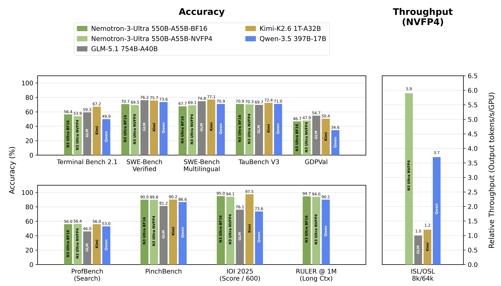

# 미국 최강 오픈웨이트, 그런데 왜 중국에 밀릴까

_NVIDIA Nemotron 3 Ultra 550B 해부 — 라이선스·MoE·vLLM 배포, 그리고 데이터로 갈리는 승부_

## Executive Summary

> [!callout]
> 2026년 6월 4일 NVIDIA가 공개한 Nemotron 3 Ultra는 미국이 내놓은 가장 강력한 오픈웨이트 추론 모델이다. 가중치와 학습 데이터, 레시피, 강화학습 환경까지 통째로 Hugging Face에 올렸고, 상업 사용을 폭넓게 허용하는 Linux Foundation의 OpenMDW-1.1 라이선스를 달았다. 미국 오픈웨이트 진영에서는 직전 선두를 큰 폭으로 제치며 분명한 1위에 올랐다. 그런데 같은 리더보드의 더 높은 자리에는 중국 모델들이 앉아 있다. 글로벌 오픈웨이트 1위는 여전히 중국 Kimi K2.6이고, Nemotron은 출시 시점 유일한 독립 벤치마크 기준 그 아래에 선다. 이 글은 "미국 최강이지만 중국에 밀린다"는 구도가 데이터로 성립하는지, 그리고 그 격차가 어디서 오는지를 본다.

> 기술적으로 Nemotron 3 Ultra는 전체 용량을 키우되 토큰당 계산은 작게 묶는 희소 구조다. 거대한 총 파라미터를 두고도 한 토큰을 처리할 때는 그중 10분의 1 규모만 깨운다. Artificial Analysis 지능 지수에서 Nemotron은 약 48점, Kimi K2.6은 약 54점으로 6점 차다. 다만 이 점수 열세에는 반전이 있다. Nemotron은 환각 억제와 장문 신뢰성에서 앞서고, 처리량과 효율에서도 강점을 보인다. 즉 단순한 "이김과 짐"이 아니라 강점이 갈리는 비대칭이며, 그 비대칭은 아키텍처가 아니라 학습·후처리 데이터의 차이에서 온다.

> 그래서 이 출시가 던지는 진짜 신호는 "또 하나의 거대 모델"이 아니다. 프런티어급 가중치를 누구나 내려받아 자기 인프라에서 서빙하고 파인튜닝할 수 있게 된 순간, 기업 간 차이는 모델 접근성이 아니라 그 모델에 무엇을 먹이느냐로 옮겨간다. 미국이 중국에 밀리는 격차의 본질도, 한국 기업이 오픈웨이트로 자체 에이전트를 세울 때의 승부처도 결국 데이터 품질과 거버넌스다. 모델은 공개됐고, 경쟁은 데이터에서 결정난다.

<!-- stat-card -->
**48 ↔ 54** — AA 지능 지수 · Nemotron ↔ Kimi K2.6 — 미국 오픈 1위지만 중국 선두에 6점 뒤짐

<!-- stat-card -->
**550B / 55B** — 총 파라미터 / 토큰당 활성 — ~10%만 깨우는 희소 LatentMoE 구조

<!-- stat-card -->
**~5배 / ~3배** — 동급 오픈 대비 처리량 — NVIDIA 발표 최대 ~5배 / 독립 측정 ~3배

<!-- stat-card -->
**22→4개월** — 오픈-클로즈드 시간 격차 — 2024년 최대 22개월 → 2026년 약 4개월

## 미국 최강, 그런데 중국에 밀린다 — 오픈웨이트의 현주소

헤드라인부터 데이터로 확인하자. 출시 8일째인 지금, Nemotron 3 Ultra를 다른 모델과 같은 잣대로 잰 독립 측정치는 사실상 하나뿐이다. Artificial Analysis 지능 지수(AA Intelligence Index)는 GDPval, τ²-Bench, Terminal-Bench Hard, GPQA Diamond, Humanity's Last Exam 등 10종 벤치마크를 묶어 하나의 점수로 만든다. 이 지수 위에서 Nemotron 3 Ultra는 약 48점(47.7)을 받았다. 직전 미국 오픈웨이트 선두였던 Gemma 4 31B(39)와 OpenAI의 GPT-OSS 120B(33)를 큰 폭으로 앞서는 분명한 미국 1위다.

문제는 그 위다. 같은 리더보드 상단의 오픈웨이트 자리는 중국 모델이 점령하고 있다. Kimi K2.6과 Xiaomi의 MiMo-V2.5-Pro가 각각 약 54점으로 선두권이고, DeepSeek V4 Pro와 Qwen 계열이 52점으로 뒤를 잇는다. Nemotron(48)은 이 중국 상위권 모두에 밀린다. 아래 막대는 그 순위를 그대로 보여준다. 오렌지가 미국산, 회색이 중국산이다.

Kimi K2.6 中54

MiMo-V2.5-Pro 中54

DeepSeek V4 Pro 中52

Qwen3.6 中52

Nemotron 3 Ultra 美48

Gemma 4 31B 美39

Nemotron 3 Super 美36

GPT-OSS 120B 美33

오픈웨이트 AA 지능 지수 비교(2026-06 기준, 반올림). Nemotron 3 Ultra는 미국 오픈 1위지만 중국 상위권 4종에 모두 밀린다. 출처: [Artificial Analysis](https://artificialanalysis.ai/models/nvidia-nemotron-3-ultra-550b-a55b), The Batch(2026-06).

한 가지 단서를 분명히 해 두자. 개별 벤치마크 점수의 대부분은 NVIDIA가 직접 발표한 자체 측정치(vendor-stated)이며, 출시 8일 시점에는 제3자 재현이 아직 끝나지 않았다. 그래서 이 글은 모델 간 순위를 말할 때는 독립 지수인 AA 지능 지수를 기준으로 삼고, NVIDIA가 발표한 세부 점수는 "자체 발표"라고 매번 표시한다. 데이터에 관한 글이 데이터 출처에 부정직할 수는 없다.

### 1.1. 강점은 갈린다 — 단순한 우열이 아닌 비대칭

"48 대 54"를 한 줄로 읽으면 Nemotron이 그냥 진 것처럼 보인다. 그러나 세부 벤치마크를 펼치면 그림이 달라진다. NVIDIA 기술 보고서(Table 10) 기준, Kimi K2.6은 터미널 작업·다국어 코딩·전문 지식 같은 에이전틱·지식 과제에서 앞선다. 반대로 Nemotron은 환각을 억제하는 비-환각율과 장문 컨텍스트 신뢰성에서 앞선다. 같은 희소 MoE 계열인데 강점이 정반대로 갈리는 것이다. 아래 표는 그 비대칭을 정리한다.

| 영역 | 벤치마크(자체 발표) | 우위 |
| --- | --- | --- |
| 환각 억제 | AA-Omniscience 비-환각율 78.7 | Nemotron |
| 장문 컨텍스트 | RULER @1M 94.7% | Nemotron |
| 에이전틱(터미널) | Terminal-Bench / PinchBench | Kimi K2.6 |
| 다국어 코딩 | SWE-Multilingual 77.1 | Kimi K2.6 |
| 전문 지식 | GPQA Diamond ~90.5% | Kimi K2.6 |

개별 수치는 모두 NVIDIA·Moonshot 자체 발표 기준(제3자 재현 미완). 출처: Nemotron 3 Ultra 기술 보고서 Table 10, Kimi K2.6 모델 카드.

*▲ 주요 벤치마크별 정확도(좌)·처리량(우) 비교 — Kimi K2.6은 Terminal Bench·SWE-Bench 등 에이전틱·코딩 과제에서 앞서고, Nemotron 3 Ultra NVFP4는 RULER @1M과 처리량(5.8 tok/s/GPU)에서 압도적 우위를 보인다. | Source: [NVIDIA Research](https://research.nvidia.com/labs/nemotron/Nemotron-3-Ultra/)*

> [!callout]
> "미국 최강이지만 중국에 밀린다"는 구도는 독립 지수에서 사실로 성립한다. 그러나 그 6점 차 안에는 강점의 비대칭이 숨어 있다. Nemotron은 거짓말을 덜 하고 긴 문서를 더 잘 읽으며, 중국 모델은 도구를 다루고 코드를 짜는 데 더 능하다. 이 갈림이 어디서 오는지가 이 글의 진짜 질문이다.

## 550B인데 활성 55B — LatentMoE가 노린 것

Nemotron 3 Ultra의 정체성은 두 숫자에 압축돼 있다. 총 파라미터 550B, 그러나 한 토큰을 처리할 때 실제로 깨어나는 활성 파라미터는 55B다. 전체의 약 10%만 일하는 셈이다. 이것이 전문가 혼합(Mixture-of-Experts, MoE)의 핵심 아이디어다. 거대한 용량에 지식을 넓게 담아 두되, 입력마다 그 지식 중 일부 전문가만 호출해 추론 비용을 낮춘다. NVIDIA는 이 모델에 512개의 전문가를 두고 토큰마다 상위 22개를 고르도록 라우팅한다(기술 보고서 Table 1 확정).

55B 활성

495B 휴면 — 토큰마다 다르게 깨어남

한 토큰을 처리할 때 전체 550B 중 약 10%(55B)만 활성화된다. 512 전문가 중 토큰당 상위 22개 선택.

그런데 Nemotron의 설계는 단순한 MoE를 넘어선다. NVIDIA가 LatentMoE라 부르는 이 구조는 세 가지를 한 몸에 엮는다. 어텐션 비용과 KV 캐시를 줄이는 Mamba-2 계열 상태공간 레이어, 필요한 곳에만 두는 선택적 어텐션, 그리고 한 번에 여러 토큰을 미리 내다보는 다중 토큰 예측(MTP)이다. 아래는 그 적층을 단순화한 그림이다.

MTP — 다중 토큰 예측으로 디코딩 가속 (약 1.46배)

<!-- stat-card -->
**MoE — 512 전문가 / 토큰당 top-22 라우팅**

<!-- stat-card -->
**선택적 Attention — 필요한 레이어에만 배치**

<!-- stat-card -->
**Mamba-2 상태공간 — 어텐션·KV 캐시 비용 절감**

LatentMoE 하이브리드 구성(기술 보고서 Table 1 기준 단순화). "큰데 빠른" 모델을 노린 설계.

이 설계의 보상은 처리량이다. NVIDIA는 동급 오픈 모델 대비 처리량이 GLM-5.1의 5.9배, Kimi K2.6의 4.8배, Qwen-3.5의 1.6배라고 발표했다. 다만 이 "5배"는 NVIDIA 자체 측정이라는 점을 짚어야 한다. 독립 측정 기관인 Artificial Analysis가 잰 출력 속도는 약 181 tok/s로, 비교군 중앙값(약 60 tok/s)의 3배 수준이다. 발표 기준으로는 최대 5배, 독립 측정으로는 약 3배라고 읽는 편이 정직하다. 어느 쪽이든 같은 무게의 모델치고 빠르다는 사실은 변하지 않는다.

*▲ Artificial Analysis 지능 지수 × 출력 속도 산점도 — Nemotron 3 Ultra는 '가장 매력적인 사분면'(고속·중간 지능)에 유일하게 위치한다. Kimi K2.6(지능 ~54)은 좌상단, Nemotron은 우측(300+ tok/s)에 자리한다. | Source: [NVIDIA Research](https://research.nvidia.com/labs/nemotron/Nemotron-3-Ultra/)*

효율의 역설
                            희소 구조는 "용량을 무엇으로 채웠는가"라는 질문을 더 날카롭게 만든다. 어느 전문가가 무엇을 학습했는지가 성능을 좌우하기 때문이다. 빠르다는 건 데이터를 적게 먹어도 된다는 뜻이 아니라, 같은 데이터를 더 잘 먹어야 한다는 뜻이다.

효율에는 단서도 붙는다. AA 측정에서 Nemotron은 같은 벤치마크를 풀 때 중앙값 동급 모델보다 약 2.3배 많은 출력 토큰을 생성하는 장황한(verbose) 경향을 보였다. 토큰을 더 쓰면 추론 비용이 늘어난다. NVIDIA는 "태스크당 최대 30% 저비용"을 주장하지만, 실제 경제성은 워크로드가 얼마나 장황한 출력을 요구하느냐에 따라 달라진다. 속도와 비용은 같은 축이 아니다.

> [!callout]
> LatentMoE는 "큰데 빠른" 모델을 만들었다. 550B의 용량을 담되 토큰당 55B만 깨우고, Mamba-2와 MTP로 속도를 끌어올렸다. 하지만 구조가 희소하고 전문화될수록 성능은 그 전문가들이 무엇을 학습했는가, 곧 데이터의 질에 더 직접적으로 매인다. 아키텍처는 그릇이고, 채우는 것은 데이터다.

## OpenMDW-1.1 해부 — 웨이트에 권리를 붙이는 라이선스

오픈웨이트라는 말에는 오래된 모호함이 있었다. 모델 가중치는 사람이 쓴 코드가 아니라 학습으로 산출된 숫자 덩어리다. 그렇다면 "저작권이 있는 코드"를 전제로 만든 Apache 2.0 같은 라이선스를 가중치에 붙일 때, 수령자는 실제로 무슨 권리를 받는 걸까. OpenMDW-1.1은 이 질문을 정면으로 돌파한, 모델 전용으로 설계된 퍼미시브 라이선스다. Linux Foundation이 2026년 5월 28일 공개했고, NVIDIA가 Cosmos·Isaac GR00T·Nemotron 패밀리에 채택했다.

OpenMDW의 핵심은 가중치·데이터·코드·문서를 "모델 재료(Model Materials)"라는 하나의 묶음으로 보고, 거기에 저작권·특허·데이터베이스권·영업비밀까지 명시적으로 권리를 부여한다는 점이다. 출력물에는 별도 제약이 없고(무제한·무귀속), 상업 사용은 로열티 프리다. Apache 2.0, Meta의 Llama Community License와 나란히 놓으면 차이가 또렷하다.

| 항목 | OpenMDW-1.1 | Apache 2.0 | Llama Community |
| --- | --- | --- | --- |
| 설계 대상 | 모델+데이터+웨이트+코드 | 소프트웨어 코드 | Meta Llama 모델 |
| 상업 사용 | 무제한·로열티 프리 | 무제한 | 700M MAU 초과 시 별도 라이선스 |
| 출력물 제약 | 명시적 무제한·무귀속 | 미명시 | "바이럴" 의무 전이 |
| 보호 IP 범위 | 저작권·특허·DB권·영업비밀 | 저작권·특허 | 커스텀 grant |
| 사용 제한 | 없음 | 없음 | 지역·용도 제한 |

라이선스 핵심 조건 비교. 출처: [openmdw.ai](https://openmdw.ai/license/1-1/), Linux Foundation, Diginomica 분석(2026-05~06).

다만 이 라이선스를 향한 시선이 우호적이기만 한 건 아니다. Red Hat의 오픈소스 법무 담당 Richard Fontana는 "Apache 2.0 대비 OpenMDW를 택할 강력한 이유를 못 느낀다"며 Red Hat은 사용 계획이 없다고 밝혔다. 일부에서는 실질적 개방성보다 이미지에 기댄 'openwashing(개방 위장)' 우려도 제기한다. 라이선스 자체가 2026년 5월 신규라 NVIDIA 바깥의 채택은 아직 미지수다. 그래서 이 글의 분석은 법적 조언이 아니라 해석의 제시이며, 실제 도입 전에는 자사 법무의 검토가 필요하다.

> [!callout]
> OpenMDW-1.1은 "웨이트에 저작권이 있는가"라는 모호함을 우회하지 않고 정면으로 다룬 모델 전용 라이선스다. 상업·파생·출력 권리를 명시해 기업이 자체 서비스를 만들 길을 넓혔다. 다만 신규 라이선스인 만큼 법적 해석은 아직 형성 중이며, 도입 결정은 라이선스 조항 확인에서 시작해야 한다.

## vLLM·SGLang 실무 배포 — 돌릴 수 있지만 가볍지 않다

"우리 GPU로 직접 돌릴 수 있나"는 가장 현실적인 질문이다. 답은 "가능하지만 가볍지 않다"이다. NVFP4 양자화 기준 약 330~352GB의 메모리가 필요하고, NVIDIA는 4×B200 또는 8×H100을 권장한다. BF16 원본은 약 1.1TB로 단일 노드에 빠듯해 CPU 오프로딩이 따라온다. 같은 NVFP4 체크포인트가 Hopper와 Blackwell 양쪽에서 구동된다는 점은 도입 부담을 다소 덜어 준다. 아래 표는 정밀도별 배포 자원을 정리한다.

| 구성 | 메모리 | 권장 GPU | 비고 |
| --- | --- | --- | --- |
| NVFP4 | ~330–352 GB | 4×B200 / 8×H100 | 출시 권장 구성 |
| BF16 | ~1.1 TB | 더 많은 GPU | 단일 노드 빠듯, CPU 오프로딩 |
| INT4(극한) | ~2×96GB | 2×RTX PRO 6000 | 성능 저하 감수 |

배포 자원 추정. 출처: NVIDIA NIM 배포 가이드, vLLM 블로그, 독립 테스터(dredyson), Spheron(2026-06).

*▲ NVIDIA H100 Tensor Core GPU — Nemotron 3 Ultra의 기본 권장 배포 구성(NVFP4 기준 8×H100 또는 4×B200). | Source: [Wikimedia Commons](https://commons.wikimedia.org/wiki/Category:NVIDIA_H100) / 极客湾 Geekerwan (CC-BY-SA)*

서빙 스택은 출시 당일부터 준비됐다. vLLM은 day-0(v0.22.0)로 지원하며, 가장 흔한 NVFP4·8×H100 구성의 기동 명령은 간결하다.

# vLLM day-0 (v0.22.0) — NVFP4, 8×H100 예시
vllm serve nvidia/NVIDIA-Nemotron-3-Ultra-550B-A55B-NVFP4 \
  --tensor-parallel-size 8 \
  --max-model-len 262144 \
  --trust-remote-code

다만 고동시성에서는 단서가 붙는다. vLLM은 256-way 같은 높은 동시 요청에서 일부 미완 케이스가 보고됐다(4×Blackwell 450/512, HGX H100 229/512 완료). 프로덕션에서 동시성이 높거나 긴 시스템 프롬프트를 반복 재사용하는 환경이라면 RadixAttention을 쓰는 SGLang이나 TensorRT-LLM이 더 안정적이다. 두 스택은 위 동시성 테스트를 완주했다.

### 4.1. "1M 컨텍스트"는 카드 스펙과 실서빙이 다르다

모델 카드의 "1M 토큰 컨텍스트"는 매력적이지만, 실사용과는 거리가 있다. 컨텍스트는 세 층위로 나눠 읽어야 한다. 아키텍처 최대는 1M이지만 기본 서빙 설정은 256K이고, 독립 테스터들은 32K는 안정적, 64K는 빠듯, 1M은 KV 캐시가 수 TB VRAM을 요구해 현실적으로 어렵다고 보고한다. RULER 1M 94.7%라는 긴 컨텍스트 강점은 사실이지만, 그것을 실서빙 자원과 분리해 판단해야 한다.

비용은 자가 호스팅과 API 두 갈래다. 클라우드 자가 호스팅은 구성에 따라 시간당 약 $7.28(8×RTX PRO 6000)에서 $14.24(8×H200) 사이다. API로 쓰면 더 가볍다. 입력 토큰 기준 약 $0.37~0.50, 출력 약 $1.08~2.50 범위로, Kimi K2.6의 $0.95/$4.00보다 약 1.9~2.6배 저렴하다. 일부 채널은 출시 초기 무료 티어도 제공하는데, 이는 프로모션일 수 있어 장기 비용 산정에 넣기엔 이르다.

> [!callout]
> 배포는 가능하지만 가볍지 않다. NVFP4로 4×B200 또는 8×H100이면 돌아가고 vLLM이 day-0로 받쳐 주지만, 고동시성은 SGLang/TensorRT-LLM이 안전하고 "1M 컨텍스트"는 실용 64K 안팎으로 읽어야 한다. 도입 결정은 동시성·컨텍스트·비용이라는 세 변수를 자사 워크로드에 대입하는 데서 시작한다.

## 격차의 본질은 데이터 — 모델이 평준화될수록

이제 섹션 1의 비대칭으로 돌아가자. Nemotron은 환각을 덜 하고, 중국 모델은 도구를 더 잘 다룬다. 둘 다 희소 MoE라는 같은 계열의 아키텍처를 쓴다. 그렇다면 강점이 정반대로 갈리는 이유는 무엇인가. 아키텍처가 같다면 남는 변수는 하나, 그 거대한 용량을 무엇으로 채웠느냐다. 곧 학습 데이터와 후처리 파이프라인(지도학습→검증가능 보상 강화학습 등)의 차이다.

이 해석은 거시 추세와도 맞물린다. Epoch AI의 능력 지수(ECI) 기준, 오픈 모델이 클로즈드 모델을 따라잡는 시간 격차는 2024년 5~22개월에서 2026년 5월 약 4개월로 압축됐다. MMLU 같은 지식 벤치마크는 오픈·클로즈드 모두 91%를 넘어 격차가 사실상 사라졌다. 가중치 접근성과 기본 지식이 평준화되는 만큼, 모델들 사이의 차이는 점점 더 데이터와 후처리에서 벌어진다. Epoch 자신도 "오픈 모델이 공개 벤치마크를 과적합해 실제 격차가 과소평가됐을 수 있다"는 단서를 단다. 공개 점수가 비슷해질수록 진짜 실력은 보이지 않는 데이터 품질에서 갈린다는 뜻이다.

다만 그 평준화는 균질하지 않다는 점도 함께 봐야 한다. 지식 벤치마크에서 격차가 사라진 것과 달리, 코딩·에이전틱·비공개 평가에서는 여전히 클로즈드 모델이 앞선다. 같은 AA 지능 지수 위에서 클로즈드 최상위 모델은 약 65점으로, 오픈 최상위 Kimi K2.6(약 54)보다 11점가량 위에 있다. 격차가 사라진 영역과 남은 영역을 가르는 선은 공교롭게도, 공개 텍스트로 학습하기 쉬운 능력(지식)과 풍부한 상호작용·도구 사용 궤적이 있어야 길러지는 능력(에이전틱·코딩)의 경계와 겹친다. 어느 쪽이든 그 선을 긋는 것은 결국 데이터다.

여기서 데이터 품질을 측정 가능한 언어로 옮기면 ISO 5259 같은 데이터 품질 차원이 등장한다. 정확성, 완전성, 일관성, 적시성 같은 축으로 학습·파인튜닝 데이터를 진단하는 일이다. Nemotron의 환각 억제 강점은 사실성을 검증한 데이터와 보상 모델의 결과이고, 중국 모델의 에이전틱 우위는 도구 사용 궤적을 풍부하게 학습한 결과로 읽을 수 있다. 강점은 아키텍처가 아니라 데이터에 새겨진다.

> [!callout]
> 모델 가중치가 공개되고 기본 능력이 평준화될수록, 경쟁의 무게중심은 "어떤 모델을 쓰는가"에서 "그 모델에 무엇을 먹이는가"로 옮겨간다. Nemotron과 중국 모델의 강점이 갈리는 비대칭은 그 증거다. 모델 내부 표현의 질은 결국 학습 데이터의 질이고, 격차는 데이터에서 결정난다.

## 한국 기업의 시사점 — 오픈웨이트로 에이전트를 세운다면

한국은 이미 Nemotron 생태계의 무대가 됐다. Nemotron Developer Days가 2026년 4월 21~22일 서울에서 처음 열렸고, 과학기술정보통신부가 공동 주최한 한국형 독자 파운데이션 모델 패널에는 SK텔레콤·업스테이지·엘리스그룹·모티프테크놀로지스 4개 컨소시엄이 참여했다. Nemotron 3 Ultra는 한국어를 네이티브 지원 언어에 포함한다. 소버린 AI(주권 AI)와 데이터 주권 흐름 속에서, 오픈웨이트를 자체 인프라에서 서빙하는 선택은 점점 더 현실적인 전략이 된다.

*▲ NVIDIA Nemotron 3 Ultra 발표 — Jensen Huang이 에이전틱 AI 멀티에이전트 네트워크 비전을 제시했다. Nemotron Developer Days는 2026년 4월 서울에서 처음 개최됐다. | Source: [NVIDIA Developer Blog](https://developer.nvidia.com/blog/nvidia-nemotron-3-ultra-powers-faster-more-efficient-reasoning-for-long-running-agents/)*

그렇다면 한국 기업이 Nemotron 같은 오픈웨이트로 자체 에이전트를 구축할 때 필요한 의사결정은 세 겹이다. 이 글이 짚은 섹션들이 그대로 체크리스트가 된다.

1**라이선스 준수** — OpenMDW-1.1의 상업·파생·출력 권리를 확인한다(섹션 3). 신규 라이선스인 만큼 자사 법무 검토를 병행한다.

2**파인튜닝 데이터 품질 진단** — 모델에 먹일 데이터를 ISO 5259 차원(정확성·완전성·일관성·적시성)으로 측정한다(섹션 5). 모델 성능이 갈리는 진짜 지점이다.

3**배포 스택 선택** — 동시성·컨텍스트·비용을 자사 워크로드에 대입해 vLLM·SGLang·TensorRT-LLM 중 적합한 스택을 고른다(섹션 4).

세 겹 중 1번과 3번은 한 번 정하면 비교적 안정적이다. 그러나 2번, 데이터 품질 진단은 모델을 새로 튜닝할 때마다 반복되는 상시 과제다. 모델이 공개된 시대에 기업의 경쟁력이 결국 어디서 갈리는지를 이 한 줄이 말해 준다. 모델은 누구나 같은 걸 내려받지만, 그 위에 올리는 데이터는 회사마다 다르다.

> [!callout]
> 오픈웨이트 자체 에이전트 구축은 라이선스 준수, 데이터 품질 진단, 배포 스택 선택의 세 겹 의사결정이다. 라이선스와 배포는 한 번의 결정에 가깝지만, 데이터 품질 진단은 튜닝마다 되풀이되는 승부처다. 서울에서 시작된 컨소시엄 흐름의 병목도 모델이 아니라 데이터에 있다.

## 페블러스가 이 출시에 주목하는 이유 — 모델 다음의 질문

이 글이 거듭 돌아온 자리는 하나다. 모델은 공개됐고, 차이는 데이터에서 벌어진다. 페블러스가 Nemotron 3 Ultra의 출시를 주시하는 까닭은 새 모델의 성능 자체가 아니라, 그 모델이 풀어 준 문제 뒤에 남긴 질문 때문이다.

### 비즈니스와 기술의 교차점

오픈웨이트 550B의 등장으로 "프런티어 모델 접근"은 더 이상 병목이 아니게 됐다. NVFP4로 4×B200이면 구동되고, OpenMDW-1.1이 상업 사용을 폭넓게 허용한다. 그러면 병목은 어디로 옮겨가는가. "이 모델을 우리 데이터로 튜닝해도 되는가, 그 데이터는 충분히 깨끗한가"라는 데이터 적합성·거버넌스 질문이다. 이것이 정확히 DataClinic·AI-Ready Data의 정의역이다. 온프레미스 오픈웨이트 서빙은 소버린 AI 흐름과 직결되며, 이는 Physical AI의 온디바이스 추론 맥락에서도 똑같이 작동한다.

### 데이터 품질이 모델을 만든다

이 리포트가 발견한 비대칭이 페블러스 테제의 증거다. Nemotron은 환각 억제에서 압도적이고 중국 모델은 에이전틱·코딩에서 앞선다. 같은 희소 MoE인데 강점이 갈리는 건 아키텍처가 아니라 학습·후처리 데이터의 차이다. 모델 용량이 커지고 구조가 전문화될수록, 어느 전문가가 무엇을 학습했는가가 성능에 더 직접 전사된다. "모델 내부 표현의 질은 학습 데이터의 질"이라는 명제가 벤치마크 표에서 그대로 읽힌다.

### 고객 실무에서의 함의

한국 기업이 Nemotron 기반 에이전트를 만들 때 마주하는 세 겹 의사결정(섹션 6) 중, 라이선스와 배포는 한 번 정하면 안정적이지만 데이터 품질 진단은 튜닝마다 반복된다. 모델은 공개됐어도 데이터는 회사마다 다르고, 그 데이터가 충분하고 정확한지를 측정하는 일은 누군가의 상시 과제로 남는다. ISO 5259 차원의 진단은 그 과제를 측정 가능한 언어로 옮기는 작업이다.

> [!callout]
> **Editor's Note.** 이 리포트는 Nemotron 3 Ultra를 "미국 최강이지만 중국에 밀리는" 모델로 읽고, 그 격차의 본질이 아키텍처가 아니라 데이터·후처리에 있음을 정리했다. 페블러스는 이 "모델 위의 데이터 품질 레이어"를 자사의 방향과 겹치는 지점으로 본다. 다만 그 판단은 독자 각자의 맥락에서 검증될 몫이며, 이 글의 결론을 특정 제품의 우월성 주장으로 읽을 필요는 없다.

※ 본 분석은 2026년 6월 4일 출시 시점 기준이며, 출시 8일째 독립 벤치마크는 Artificial Analysis 지능 지수 1종뿐이다. 개별 벤치마크는 NVIDIA·Moonshot 등의 자체 발표를 포함하며 제3자 재현이 진행 중이다. 점수·순위는 후속 측정으로 갱신될 수 있다.

## 참고문헌

### 1차 기술 문서 (NVIDIA·Hugging Face)

- 1.NVIDIA. "[NVIDIA Nemotron 3 Ultra Technical Report](https://research.nvidia.com/labs/nemotron/files/NVIDIA-Nemotron-3-Ultra-Technical-Report.pdf)." 2026-06-09 (Table 1 아키텍처, Table 10 사후훈련).
- 2.NVIDIA. "[Nemotron 3 Ultra 550B-A55B Model Card](https://huggingface.co/nvidia/NVIDIA-Nemotron-3-Ultra-550B-A55B-BF16)." Hugging Face, 2026-06-04.
- 3.NVIDIA. "[Nemotron 3 Ultra Powers Faster, More Efficient Reasoning](https://developer.nvidia.com/blog/nvidia-nemotron-3-ultra-powers-faster-more-efficient-reasoning-for-long-running-agents/)." NVIDIA Developer Blog, 2026-06-04.

### 벤치마크·데이터·정책

- 4.Artificial Analysis. "[NVIDIA Nemotron 3 Ultra Released](https://artificialanalysis.ai/articles/nvidia-nemotron-3-ultra-released)." 2026-06.
- 5.Artificial Analysis. "[Nemotron 3 Ultra — Model Page / Leaderboards](https://artificialanalysis.ai/models/nvidia-nemotron-3-ultra-550b-a55b)." 2026-06.
- 6.DeepLearning.AI. "[The Batch — Kimi K2.6](https://www.deeplearning.ai/the-batch/)." 2026-06.
- 7.Epoch AI. "[Open vs Closed Model Performance Gap (ECI)](https://epoch.ai/data-insights/open-closed-eci-gap)." 2026.
- 8.Hugging Face. "[State of Open Source, Spring 2026](https://huggingface.co/blog/huggingface/state-of-os-hf-spring-2026)." 2026.

### 배포·라이선스·생태계

- 9.vLLM. "[Day-0 Support for Nemotron 3 Ultra](https://vllm.ai/blog/2026-06-04-nemotron-3-ultra-vllm)." vLLM Blog, 2026-06-04.
- 10.Linux Foundation. "[OpenMDW-1.1 License](https://openmdw.ai/license/1-1/)." 2026-05-28; Diginomica. "[What OpenMDW-1.1 Guarantees](https://diginomica.com/what-openmdw-11-guarantees-enterprise-apache-license-model-weights-cant)."
- 11.The Decoder. "[Nvidia's Nemotron 3 Ultra Becomes the Smartest Open US Model, but China Still Leads](https://the-decoder.com/)." 2026-06.
- 12.Digital Today. "[Nemotron Developer Days Seoul 2026 / 과기정통부 공동주최](https://www.digitaltoday.co.kr/en/view/47483/)." 2026-04.
