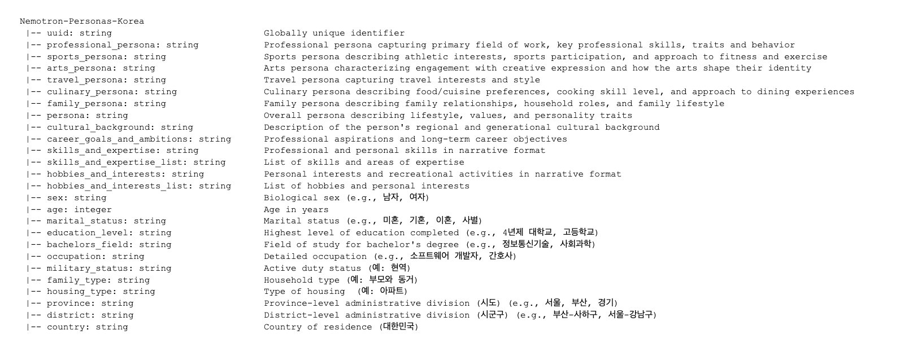
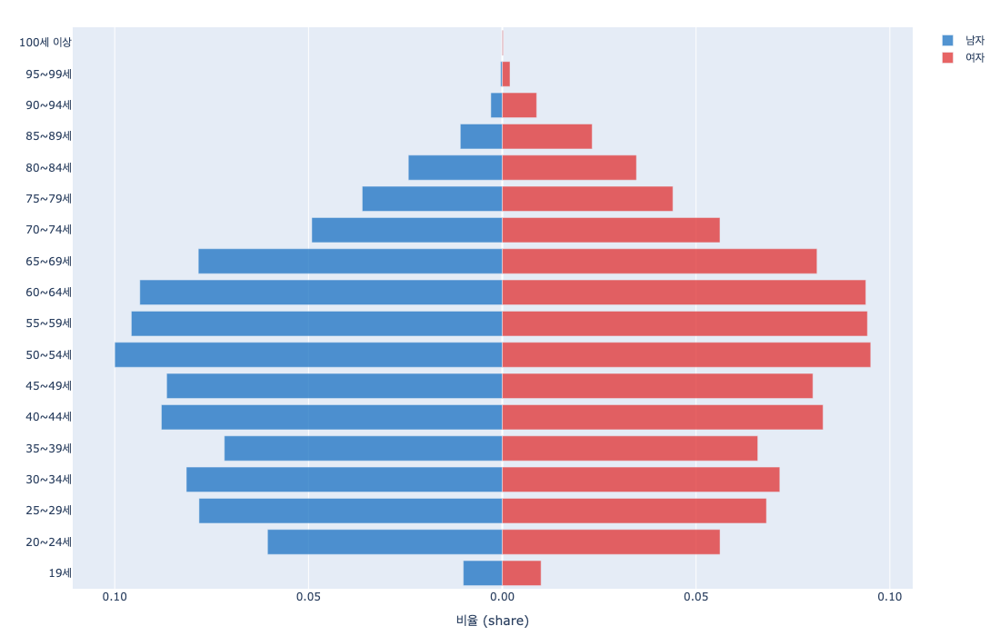
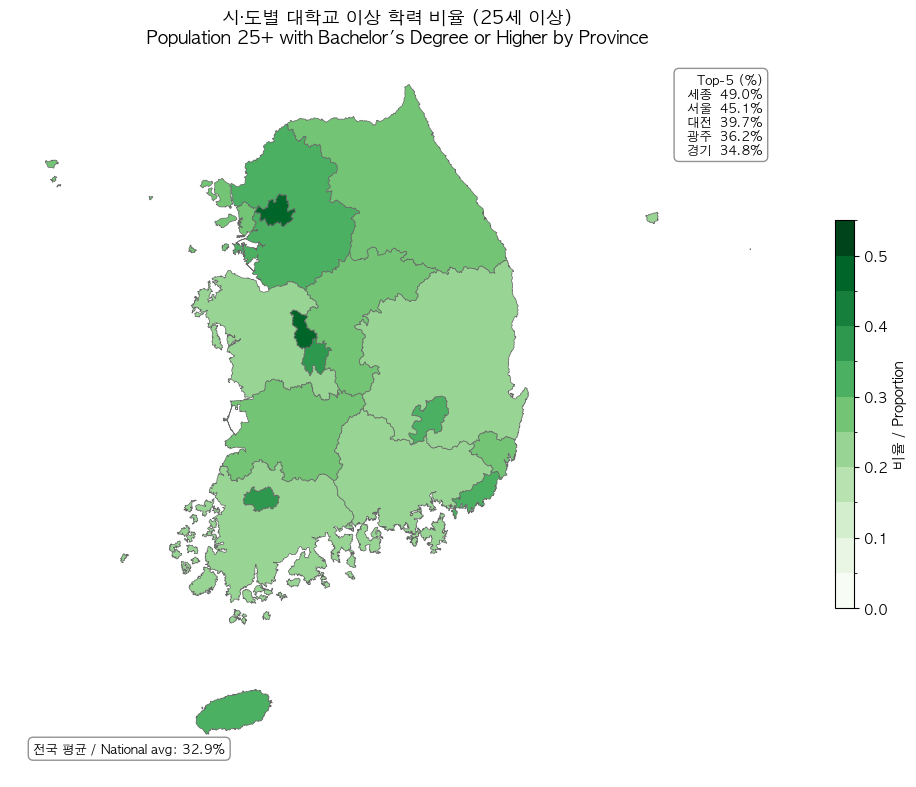
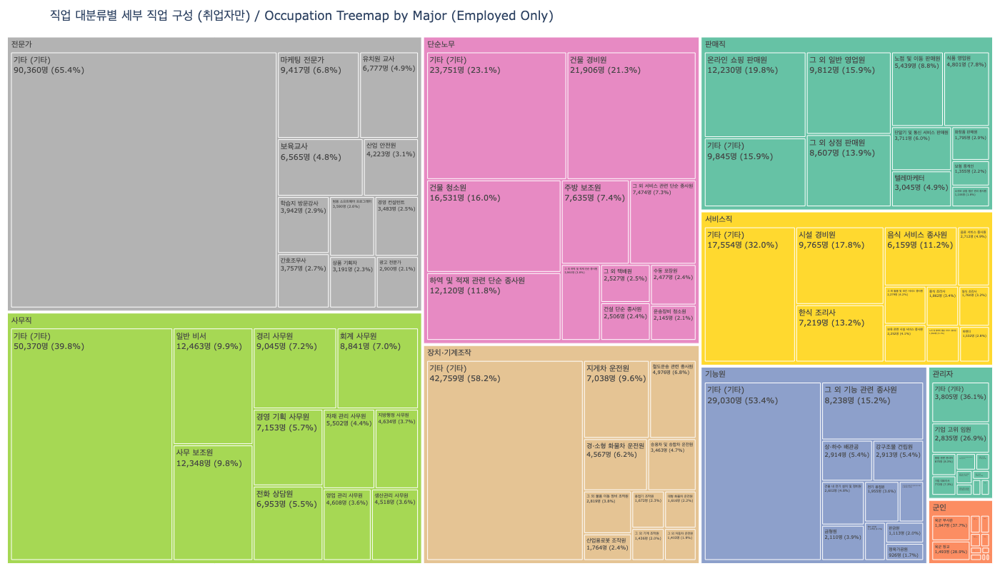
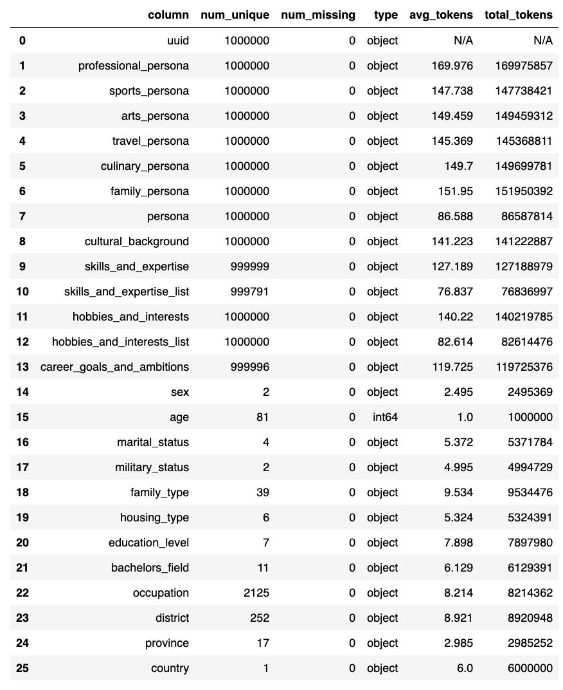

# 7 Million Synthetic Personas \u2014 Korea\u2019s Path to Sovereign AI

_Why census-grounded synthetic personas are becoming the foundation of sovereign LLMs_

## Executive Summary

> [!callout]
> On April 20, 2026, Dr. Hyunwoo Kim of NVIDIA (Seoul National University PhD; incoming KAIST AI assistant professor) released **Nemotron-Personas-Korea** — a dataset of **7 million synthetic personas** grounded in official Korean statistics (KOSIS, Supreme Court name registries, National Health Insurance Service, Korea Rural Economic Institute). Unlike earlier translation-based Korean datasets such as KoAlpaca and KULLM, this resource starts from the actual demographic distribution of Korea's population and uses a PGM (Probabilistic Graphical Model) + Gemma-4-31B hybrid pipeline to generate native Korean-language personas. It reached #1 on Hugging Face's overall trending chart.

> According to published research, demographic-aligned persona conditioning reduces social simulation alignment error by **37.9–49.8%** (arXiv:2509.10127). As Korea rolls out its **$735 billion** sovereign AI strategy and enforces the AI Basic Act (effective January 2026), demographically grounded synthetic personas represent the first tangible deliverable on the path to data self-reliance.

> At the same time, critical quality challenges are emerging: synthetic data bias propagation (arXiv:2403.07857), limitations of the independence assumption, and the exclusion of individuals under 19. DataClinic's distribution diagnostics offer a way to quantitatively validate demographic fidelity and preempt fairness feedback loops — filling a strategic gap in the synthetic data supply chain.

The key numbers reveal the scale and research significance of this dataset at a glance.

7M

Total synthetic personas generated from 1M records × 7 narrative types

26

Structured fields: 12 demographic + 7 narrative + 6 attribute + 1 UUID

~49.8%

Simulation error reduction vs. uniform sampling with population-aligned personas

$735B

Korea's total sovereign AI investment including Samsung (250K+ GPUs)

## What Nemotron-Personas-Korea Is and Why It Hit #1

On April 20, 2026, NVIDIA published Nemotron-Personas-Korea on Hugging Face, where it promptly reached #1 on the overall trending chart. Among the **450,000–500,000** datasets on the platform, no Korean-specific large-scale persona dataset had previously claimed the top spot. What sets this dataset apart is not merely its size (7 million) but its **architecture**.

### 1.1. The PGM + LLM Hybrid Pipeline

The construction process has two stages. First, a PGM directly samples demographic distributions from official Korean statistics (KOSIS 2020–2026, Supreme Court name registries, National Health Insurance Service, Korea Rural Economic Institute), producing **1 million records** of structured attribute combinations. Then Gemma-4-31B transforms these attribute sets into 7 types of Korean-language narrative personas. The critical innovation is probabilistic sampling that mirrors actual population distributions, not uniform random generation.

*Two-stage PGM + LLM pipeline: Official statistics → Probabilistic Graphical Model → Gemma-4-31B → 7 narrative personas (Source: NVIDIA HuggingFace)*

The resulting dataset comprises **26 structured fields** (12 demographic + 7 persona + 6 attribute + 1 UUID), covering **17 metropolitan provinces**, **252+ municipalities**, **2,000+ occupations**, and approximately **209,000 unique names** (118 family names + 21,400+ given names). The age range spans 19 to 99, and the CC BY 4.0 license enables unrestricted commercial use.

*26 structured fields: 12 demographic + 7 persona narrative + 6 attribute + 1 UUID (Source: NVIDIA HuggingFace)*

### 1.2. Why It Reached #1: Five Converging Factors

No single factor explains the #1 ranking — five conditions converged simultaneously. First, the release coincided with Nemotron Developer Days Seoul (April 21–22, 500+ attendees), driving an initial download surge. Second, the NVIDIA organizational account (55,600 followers) amplified visibility. Third, a supply vacuum existed: no large-scale Korean persona dataset had been publicly available. Fourth, the CC BY 4.0 license removed commercial adoption barriers. Fifth, the timing aligned with Korea's sovereign AI policy push. NVIDIA's official AI account on X confirmed the #1 trending status.

### 1.3. A Paradigm Shift from Existing Korean Datasets

Existing Korean LLM datasets and Nemotron-Personas-Korea are fundamentally different classes of resources. KoAlpaca (~20K, translation-based) and KULLM v2 (tens of thousands, GPT-4/Dolly translations) are English instructions translated into Korean. Cultural context is inevitably lost in translation. Nemotron-Personas-Korea, by contrast, originates from Korean official statistics and generates natively in Korean.

The table below summarizes these structural differences.

| Dimension | Nemotron-Personas-Korea | PersonaHub | KoAlpaca / KULLM |
| --- | --- | --- | --- |
| Scale | 7M (1M x 7 types) | 1B (English) | ~20K / tens of thousands |
| Source | Korean official statistics (KOSIS, Supreme Court) | Web crawling | English translation |
| Attribute Fields | 26 structured | 3–5 unstructured | Instruction-response pairs |
| Demographic Fidelity | PGM-based distribution sampling | None | None |
| License | CC BY 4.0 | CC BY-NC-SA 4.0 | Various |
| Primary Use | Agent simulation, cultural alignment | General-purpose personas | SFT / instruction tuning |

************

One important caveat: Nemotron-Personas-Korea is a persona dataset, not an instruction dataset. Using it directly for SFT (Supervised Fine-Tuning) requires an additional pipeline to transform personas into dialogue or instruction formats. In this sense, it complements rather than competes with existing Korean instruction datasets.

### 1.4. Real Persona Examples — What the Data Actually Looks Like

Numbers and schemas alone don't convey the texture of this dataset. Three actual records illustrate the level of specificity that 26 structured fields and 7 narrative types achieve.

👤Jeon Gi-tae (Male, 74)

Gwangju, Seo-gu | Cargo handler | Elementary school | Married

professional_persona

"Mr. Jeon has spent decades stacking cargo at the Gwangju Seo-gu docks, using leverage principles to efficiently move heavy materials with the seasoned eye of a veteran..."

sports_persona

"Every weekend he ambles along the Mudeungsan foothills, working up a sweat, then wraps up the week at his regular bathhouse debating politics with friends..."

skills_and_expertise

Load center-of-gravity assessment, on-site material lashing, cargo route optimization, workplace conflict mediation

hobbies_and_interests

Mudeungsan trail walks, public bathhouse visits, traditional market food crawls, trot music shows, historic site trips

👤Choi Eun-ji (Female, 71)

Seoul, Seocho-gu | Accountant | 4-year university (Natural Sciences/Math) | Married

professional_persona

"Ms. Choi is a veteran accountant at a Seocho-dong real estate office, mentally calculating complex acquisition and transfer taxes at near-mental-math speed..."

skills_and_expertise

Real estate acquisition/holding tax calculation, double-entry bookkeeping, rapid mental arithmetic verification

👤An Sang-sik (Male, 73)

Seoul, Yangcheon-gu | Retired | High school | Married

professional_persona

"Even after retirement, Mr. An beams at the Mokdong community center's stacks of paperwork, volunteering as the go-to guide for neighbors struggling with municipal procedures..."

hobbies_and_interests

Palace and historic site visits, Na Hoon-a music appreciation, Mokdong neighborhood park walks

> [!callout]
> **What the 7 narrative types mean** — Each record generates `professional_persona`, `sports_persona`, `arts_persona`, `travel_persona`, `culinary_persona`, `family_persona`, and `persona` (summary) — seven narratives from a single set of demographic attributes. That's how 1 million records × 7 = 7 million personas. The specificity of a 74-year-old Gwangju cargo worker hiking Mudeungsan and browsing traditional markets is cultural context that could never emerge from a translation-based dataset.

## Sovereign AI and Data Self-Reliance — Why Korea Needs This

Sovereign AI refers to a nation's ability to control the core components of its AI stack: data, models, and infrastructure. Academically, it has been reframed as "network autonomy" (arXiv:2511.15734). The realistic strategy is not complete self-sufficiency but rather maintaining control over critical AI components while selectively engaging in international cooperation. Nemotron-Personas-Korea is the minimum viable unit — and the first implementation — of "data self-reliance" within this framework.

### 2.1. The Current State of Korea's Sovereign AI

Korea enacted the AI Basic Act in January 2026. In August 2025, five sovereign LLM consortia were selected with **240 billion won (~$175M)** in funding; a December evaluation narrowed the field from five to four, with a planned consolidation to two survivors by 2027. The 2026 AI-related budget stands at **10.1 trillion won (~$7.3 billion)**, while total investment including Samsung reaches **$735 billion**. NVIDIA plans to deploy **250,000+ GPUs** in Korea.

But infrastructure investment alone does not make sovereign AI. Without training data that ensures a model's cultural representativeness, what runs on those GPUs is still an English-biased model.

### 2.2. The WEIRD Bias Problem and Demographic-First Design

The Personality Trap (arXiv:2602.03334) empirically demonstrated that LLMs systematically exhibit **WEIRD bias** (Western, Educated, Industrialized, Rich, Democratic) when generating synthetic populations. English-centric synthetic personas skew young, highly educated, Western, heterosexual, and moderate-to-progressive.

Nemotron-Personas-Korea structurally circumvents this bias. The PGM directly samples from KOSIS distributions: a mean age of **45.2 years**, the **50s as the largest age cohort**, **17 metropolitan/provincial regions**, and **7 education levels**. The distribution charts below show how Korea's actual population structure is reflected in the dataset.

*Age group distribution: 50s cohort is largest, mean age 45.2 — mirroring Korea's actual population pyramid (Source: NVIDIA HuggingFace)*

*7-level education distribution (Source: NVIDIA HuggingFace)*

*Education levels by 17 provinces/metros (Source: NVIDIA HuggingFace)*

DeepPersona's (arXiv:2511.07338) taxonomy-based sampling showing a **43% improvement** over national statistics baselines further confirms the quantitative impact of demographic alignment.

> [!callout]
> **Key Insight:** Data self-reliance rests on a triad — representativeness (reflecting Korea's actual population distribution), diversity (2,000+ occupations, 209K names, 39 household types), and quality (zero PII, CC BY 4.0, NeMo Data Designer validation). The ongoing verification of this triad is DataClinic's role, and monitoring whether synthetic data keeps pace with real demographic changes over time is the core challenge.

## Transforming Social Science Research Methods

Synthetic persona-based surveys ("Silicon Sampling") offer efficiency that traditional survey methods cannot match in terms of cost and scale. However, structural inconsistency and homogenization remain core challenges, and cross-validation against real surveys is non-negotiable.

### 3.1. The Polypersona Methodology

Polypersona (arXiv:2512.14562) embeds demographic and psychographic consistency into LLM survey simulations. Testing 433 personas across 10 domains with 3,568 synthetic responses, the study found that compact models (TinyLlama 1.1B) with LoRA + 4-bit quantization approached 7B–8B model performance (BLEU 0.090, ROUGE-1 0.429). Applying this methodology to Nemotron-Personas-Korea's 7 million personas opens the door to demographically representative large-scale synthetic surveys in Korean social science.

### 3.2. Silicon Sampling: Limitations and Cross-Validation

Silicon Sampling research (arXiv:2507.02919) warns of structural inconsistency and homogenization in LLM-generated survey responses. Population-Aligned Persona research (arXiv:2509.10127) showed that deep persona conditioning improved response accuracy by up to **11.6%**, but cross-validation against the World Values Survey (WVS) remains essential. The methodological position of synthetic persona surveys is "complement," not "replacement."

### 3.3. Research Application Scenarios

Synthetic surveys excel where traditional methods struggle: expensive pilot studies, rare population simulations, and pre-testing policy scenarios. The occupation and household type distributions below illustrate what kinds of simulations become possible.

*2,000+ occupation categories (Source: NVIDIA HuggingFace)*

*39 household types (Source: NVIDIA HuggingFace)*

Examining what Nemotron-Personas-Korea enables reveals both its potential and its current boundaries.

- •**Aging society policy simulation:** Synthesize behavioral patterns of the 60s cohort (7.77 million) and 70+ populations to pre-test welfare policy impacts across scenarios
- •**Regional depopulation research:** Use municipality-level personas (252+ regions) to simulate population migration and local economic impacts
- •**Pilot studies and rare-group simulation:** Explore hard-to-reach populations (specific occupations, specific regions) before committing to full-scale surveys
- •**Limitation — multicultural households:** The current dataset is based on Korean nationals, so immigrant and multicultural personas are not included

## World Models and Homegrown Foundation Models

The PGM + LLM hybrid pipeline achieves "statistical fidelity + natural language richness" simultaneously — a genuine technical innovation. The central question of this section is what role this approach can play in training Korea's own foundation models.

### 4.1. Technical Significance of the PGM + LLM Pipeline

Traditional synthetic persona generation relied on uniform or random sampling. Population-Aligned Persona research (arXiv:2509.10127) quantitatively proved that population-aligned approaches reduce social simulation alignment error by **37.9–49.8%** compared to uniform sampling and cut WVS response deviation by **31.7%**. NeMo Data Designer (publicly released at NeurIPS 2024, with MCP tool calling + HuggingFace Hub integration in v0.5.0) makes this pipeline industrially reproducible.

### 4.2. Theory of Mind and Social Reasoning

A recent survey of Theory of Mind in LLMs (arXiv:2502.06470) analyzes behavioral and representational ToM evaluation alongside safety risks. The impact of demographic-conditioned personas on ToM performance is still in its early stages, but the potential for enhancing reasoning across diverse social contexts (age, region, occupation) is promising. The fact that over **98%** of Nemotron-4 340B's alignment data (arXiv:2406.11704) was synthetic reflects NVIDIA's wholesale adoption of synthetic-data-centric training.

### 4.3. Connecting to Korea's Foundation Model Ecosystem

Korea's homegrown foundation model ecosystem is growing rapidly, but a structural shortage of Korean-language training data is a shared bottleneck. Polyglot-ko-5.8B's training corpus is just 863 GB — less than one-tenth of LLaMA-2's 2 trillion tokens. The benchmark ecosystem is also maturing, progressing from KLUE to CLIcK (1,995 Korean culture/language QA items) and KoBALT (700 MCQs, 24 phenomena). Nemotron-Personas-Korea fills this gap not as direct SFT data, but as raw material for persona-conditioned dialogue generation, agent simulation, and cultural alignment fine-tuning.

- •**HyperCLOVA X THINK:** Trained on 6 trillion Korean + English tokens, augmented with "targeted synthetic Korean data"
- •**EXAONE 4.0 (LG AI Research, 30B):** Vocabulary redesigned from 100K to 150K tokens
- •**SOLAR Pro 2 (Upstage):** The only Korean model on the Frontier LM leaderboard
- •**The data gap:** Polyglot-ko-5.8B's 863 GB is less than 1/10 of LLaMA-2 (2 trillion tokens)

Nemotron-Personas-Korea is a synthetic persona resource that helps bridge this gap. Rather than direct SFT, it serves as foundational material for persona-conditioned dialogue generation, AI agent simulation, and cultural alignment fine-tuning. The benchmark ecosystem is maturing in parallel: from KLUE to CLIcK (1,995 Korean culture/language QA items, where 60%+ of open-source models struggle) and KoBALT (700 MCQs across 24 phenomena), evaluation criteria are becoming increasingly sophisticated.

## Limitations and Critiques

Bias propagation in synthetic data is an academically measurable risk. Demographic-first design is not a panacea but a "first line of defense," and independent quality audits must accompany any deployment.

### 5.1. Fairness Feedback Loops

Wyllie et al. (arXiv:2403.07857) demonstrated that model-induced distributional shift (MIDS) amplifies bias across successive generations of synthetic data training. Even data that starts unbiased can lose minority representation through feedback loops. Shumailov et al. (Nature 2024) theoretically proved that iterative synthetic training erases the tails of the original distribution. A separate study (arXiv:2404.01413) showed that while replacing original data with synthetic data causes model collapse, cumulative mixing of both avoids it. This means preserving the original official statistics (KOSIS, etc.) is non-negotiable.

### 5.2. Explicit Dataset Limitations

The text length distributions across the 7 narrative fields offer a window into the quality and consistency of generated narratives. Several limitations are also directly acknowledged in the dataset card.

*Text length distribution statistics across 7 narrative fields (Source: NVIDIA HuggingFace)*

- •**Under-19 exclusion:** Cannot be used for AI agent development involving children or adolescents
- •**Biological sex only:** Gender identity and sexual orientation are not represented
- •**Independence assumption:** Interaction effects between demographic variables (e.g., gender x major, region x occupation) are not modeled
- •**No industry-specific personas:** Specialized personas for finance, healthcare, or other verticals are absent
- •**No personality traits:** Big Five and other psychological attributes are missing, constraining social simulation precision

### 5.3. The Synthetic-Real Gap and Model Collapse

Silicon Sampling research (arXiv:2507.02919) warns of structural inconsistency and homogenization. The Personality Trap (arXiv:2602.03334) shows that LLM-generated personas inherently carry WEIRD bias. Since Gemma-4-31B is itself an English-pretrained model, residual bias in Korean narrative generation is plausible. The mitigation strategy is clear: preserve original official statistics, use synthetic data in a blended fashion, and deploy independent distribution audits to preempt feedback loops.

## Why Pebblous Is Paying Attention

The emergence of Nemotron-Personas-Korea poses a sharp question to the market: _Who verifies the quality of synthetic data?_ In a world where NVIDIA generates synthetic data at scale, an independent infrastructure is needed to validate whether that data accurately represents the target population. This is precisely where Pebblous's DataClinic and DataGreenhouse fit in.

### 6.1. DataClinic Diagnostic Scenarios

Applying DataClinic's existing diagnostic capabilities to Nemotron-Personas-Korea enables quantitative verification of the synthetic personas' demographic fidelity. Three concrete scenarios emerge.

- •**Class-level distribution analysis:** Compare actual Korean population distributions (KOSIS) against synthetic persona distributions by age, region, occupation, and education level to quantitatively identify under- and over-represented segments
- •**Density contour analysis:** Monitor tail distribution loss during iterative synthetic training (as demonstrated by Shumailov et al., Nature 2024) to detect early signs of model collapse
- •**Embedding manifold visualization:** Analyze whether residual bias from the English-pretrained base model (Gemma-4-31B) introduces cultural clustering distortions in Korean-language personas

### 6.2. NVIDIA (Generation) + Pebblous (Diagnosis): A Complementary Structure

The academic case for this complementary structure is clear. Fairness Feedback Loops research (arXiv:2403.07857) empirically demonstrated bias amplification in synthetic data and proposed independent distribution audits as a mitigation strategy. DataClinic's distribution diagnostics automate exactly this kind of bias auditing. DataGreenhouse's Governance Layer manages synthetic persona metadata (source agencies, generation dates, PGM parameters, licenses), enabling governance and traceability for synthetic data assets in compliance with ISO/IEC 5259 and ISO 42001.

PebbloSim's "Vector-to-Param" patent (US 12,481,720) automatically converts data gap coordinates into simulation parameters. This makes it possible to build a Data Flywheel where DataClinic identifies demographic gaps in synthetic personas and PebbloSim precisely fills them.

### 6.3. Practical Implications for Customers and Partners

When Korean conglomerates (NAVER, LG, SK, NC, and others) pursue LLM internalization, demand for quality verification of training data reflecting Korean population characteristics will follow. When sovereign LLM consortia (240 billion won, 4 teams) leverage synthetic data, a quality certification process will be required. When social science research teams run synthetic persona simulations, they will need distribution verification partners. At every one of these touchpoints, the message reaches the market: "Synthetic data needs quality diagnostics too."

### 6.4. Questions for the Road Ahead

This report's analysis surfaces several questions Pebblous should explore next.

- •Can Nemotron-Personas-Korea be published as a DataClinic demo case to establish a reference for "synthetic data quality diagnostics"?
- •Can the DataClinic diagnosis → PebbloSim precision generation → DataClinic re-diagnosis flywheel create a structural moat in the synthetic persona space that competitors would struggle to replicate?
- •What government and enterprise partnership pathways exist to position DataClinic/DataGreenhouse as data quality verification infrastructure for sovereign LLM consortium synthetic data?
- •Given that synthetic data quality standards remain unestablished, what academic and industry collaboration pathways can Pebblous pursue to help define them?

## FAQ

## References

**Academic Papers**

1. Hu et al. (2025). "Population-Aligned Persona Generation for LLM-based Social Simulation." arXiv:2509.10127.
2. Amidei et al. (2026). "The Personality Trap: How LLMs Embed Bias When Generating Human-Like Personas." arXiv:2602.03334.
3. Wyllie et al. (2024). "Fairness Feedback Loops: Training on Synthetic Data Amplifies Bias." arXiv:2403.07857.
4. Ge et al. (2024). "Scaling Synthetic Data Creation with 1,000,000,000 Personas." arXiv:2406.20094.
5. Parmar et al. (2024). "Nemotron-4 340B Technical Report." arXiv:2406.11704.
6. Bondarenko et al. (2025). "Sovereign Large Language Models: Benefits, Strategies, and Regulations." arXiv:2503.04745.
7. Dash et al. (2025). "Polypersona: Persona-Grounded LLM for Synthetic Survey Responses." arXiv:2512.14562.
8. Shumailov et al. (2024). "AI Models Collapse When Trained on Recursively Generated Data." Nature.
9. (2025). "Silicon Sampling: Representativeness and Structural Consistency in LLM Surveys." arXiv:2507.02919.
10. (2025). "Sovereign AI: Rethinking Autonomy in the Age of Foundation Models." arXiv:2511.15734.
11. Nguyen (2025). "A Survey of Theory of Mind in Large Language Models." arXiv:2502.06470.
12. Su et al. (2024). "Nemotron-CC: Transforming Common Crawl into a Refined LLM-Training Dataset." arXiv:2412.02595.
13. Kim et al. (2024). "CLIcK: Cultural and Linguistic Intelligence in Korean." arXiv:2403.06412.
14. (2025). "KoBALT: Korean Benchmark for Advanced Linguistic Tasks." arXiv:2505.16125.
15. (2025). "DeepPersona: A Generative Engine for Scaling Deep Synthetic Personas." arXiv:2511.07338.
16. (2024). "Is Model Collapse Inevitable? Breaking the Curse of Recursion by Accumulating Real and Synthetic Data." arXiv:2404.01413.

**Industry Sources**

1. HuggingFace Dataset Card: [nvidia/Nemotron-Personas-Korea](https://huggingface.co/datasets/nvidia/Nemotron-Personas-Korea)
2. HuggingFace Blog: "How to Ground a Korean AI Agent in Real Demographics" (NVIDIA)
3. NVIDIA Newsroom: South Korea AI Infrastructure — 250K+ GPU deployment plan (2025.10)
4. NVIDIA AI on X: Confirmed Nemotron-Personas-Korea #1 trending status
5. Asia Economy: Nemotron Developer Days Seoul coverage (2026.04.21)

**Market and Policy Data**

1. Ministry of the Interior and Safety: Resident Registration Population — 51,801,449 (2024.08)
2. OECD: Education at a Glance 2023 — Korea tertiary attainment 54.5% (OECD #1)
3. Korea Herald / Bloomberg: Korea AI-related budget 10.1 trillion won (2026)
4. Fortune Business Insights / Mordor Intelligence: Synthetic data market $510M–$600M (2025)
5. GrandView Research / ResearchAndMarkets: Synthetic data market $1.79B–$3.7B (2030–31, CAGR 31–39%)
