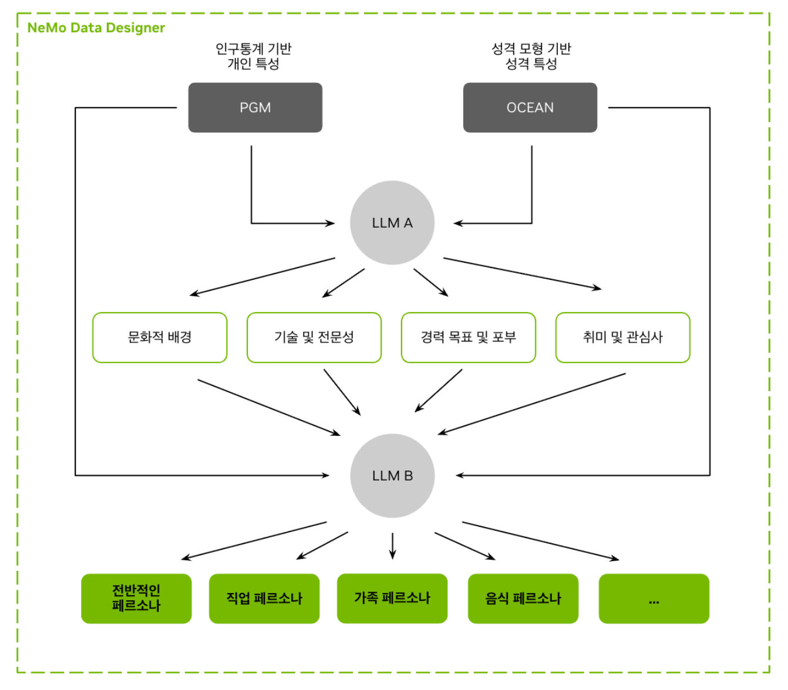
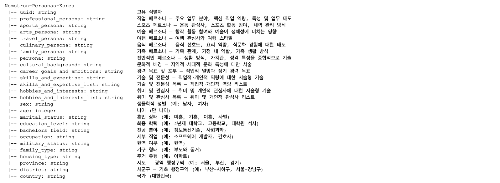
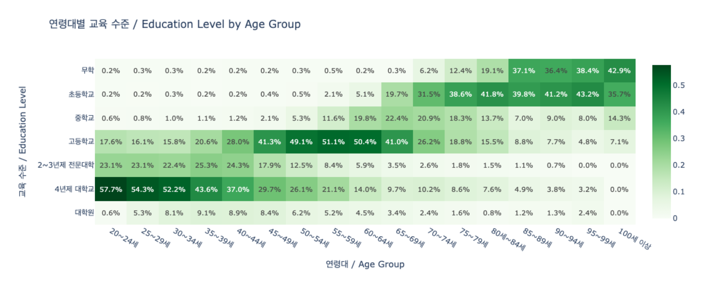
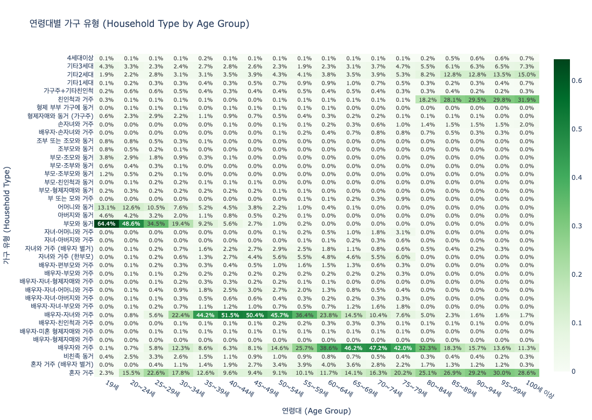

# Nemotron-Personas-Korea \u2014 \ud55c\uad6d AI \uc790\ub9bd\uc758 \ucd9c\ubc1c\uc810

_\uc2e4\uc81c \uc778\uad6c\ud1b5\uacc4 \uae30\ubc18 \ud569\uc131 \ud398\ub974\uc18c\ub098\uac00 \uc18c\ubc84\ub9b0 LLM\uc758 \ud1a0\ub300\uac00 \ub418\ub294 \uc774\uc720_

## Executive Summary

> [!callout]
> NVIDIA 김현우 박사(서울대 박사, KAIST AI 조교수 부임 예정)가 2026년 4월 20일 공개한 **Nemotron-Personas-Korea**는 한국 공식 통계(KOSIS, 대법원, 국민건강보험공단, 농촌경제연구원)를 기반으로 구축된 **700만 합성 페르소나** 데이터셋이다. 허깅페이스 전체 트렌딩 1위를 달성한 이 데이터셋은, 기존 번역 기반 한국어 데이터셋(KoAlpaca, KULLM)과 달리 한국 실제 인구 분포에서 출발하여 PGM(확률 그래프 모델) + Gemma-4-31B 하이브리드 파이프라인으로 생성된 최초의 대규모 네이티브 한국어 페르소나 자원이다.

> 학술 연구에 따르면, 인구통계 기반 페르소나 정렬은 사회 시뮬레이션의 정렬 오차를 **37.9~49.8%** 감소시킨다(arXiv:2509.10127). 한국 정부가 **7,350억 달러** 규모 소버린 AI 전략을 추진하고 AI 기본법을 시행(2026.01)한 시점에서, 인구통계 기반 합성 페르소나는 데이터 자립의 첫 번째 구체적 성과물이다.

> 동시에, 합성 데이터의 편향 전파(arXiv:2403.07857), 독립 가정의 한계, 19세 미만 미포함 등 품질 검증 과제가 부상한다. DataClinic의 분포 진단은 합성 페르소나의 인구통계 정합성을 정량 검증하고 편향 피드백 루프를 사전 차단하는 도구로서, 이 간극을 메우는 전략적 가치를 가진다.

핵심 수치로 보면 이 데이터셋의 규모와 연구적 의의가 한눈에 드러난다.

700만

1M 레코드 × 7종 내러티브로 생성된 합성 페르소나 총 규모

26개

인구통계 12 + 내러티브 7 + 속성 6 + UUID 1 구조화 필드

~49.8%

인구 정렬 페르소나가 균일 샘플링 대비 줄인 시뮬레이션 오차

$735B

삼성 포함 한국 소버린 AI 총 투자 규모 (GPU 25만대+)

## Nemotron-Personas-Korea, 무엇이고 왜 1위인가

2026년 4월 20일, NVIDIA가 허깅페이스에 공개한 Nemotron-Personas-Korea는 한국어 데이터셋으로서 전체 트렌딩 1위를 달성했다. 허깅페이스에 등록된 **45만~50만**개 데이터셋 가운데 한국어 특화 대규모 페르소나가 전체 1위를 기록한 사례는 확인되지 않는다. 이 데이터셋의 차별점은 규모(700만)보다 **구조**에 있다.

### 1.1. PGM + LLM 하이브리드 파이프라인

구축 과정은 두 단계로 나뉜다. 먼저 PGM(확률 그래프 모델)이 한국 공식 통계(KOSIS 2020~2026, 대법원 성명 분포, 국민건강보험공단, 농촌경제연구원)로부터 인구통계 분포를 직접 샘플링하여 **1백만 레코드**의 구조화된 속성 조합을 생성한다. 이어서 Gemma-4-31B가 이 속성 조합을 7종 한국어 내러티브 페르소나로 변환한다. 단순 균일 샘플링이 아닌 실제 인구 분포를 반영한 확률적 샘플링이 핵심이다.

*PGM + LLM 2단계 파이프라인: 공식 통계 → 확률 그래프 모델 → Gemma-4-31B → 7종 내러티브 페르소나 (출처: NVIDIA HuggingFace)*

최종 데이터셋은 **26개 구조화 필드**(인구통계 12 + 페르소나 7 + 속성 6 + UUID 1)로 구성되며, **17개 광역시도**, **252개 이상의 시군구**, **2,000개 이상의 직업**, **약 209,000개의 고유 이름**(성 118개 + 이름 21,400개 이상)을 포함한다. 연령 범위는 19세에서 99세까지이며, CC BY 4.0 라이선스로 상업적 활용이 자유롭다.

*26개 구조화 필드 스키마: 인구통계 12 + 페르소나 내러티브 7 + 속성 6 + UUID 1 (출처: NVIDIA HuggingFace)*

### 1.2. 허깅페이스 1위 달성의 구조적 원인

단일 요인이 아닌 다섯 가지 조건의 동시 충족이 1위를 만들었다. 첫째, Nemotron Developer Days Seoul(4/21~22, 500명 이상 참석)과 동시에 릴리스하여 초기 다운로드가 폭증했다. 둘째, NVIDIA 조직 계정(팔로워 55,600명)의 브랜드 효과가 확산을 가속했다. 셋째, 한국어 대규모 페르소나 데이터셋이 전무했다는 공급 공백이 있었다. 넷째, CC BY 4.0 라이선스가 상업적 활용 장벽을 제거했다. 다섯째, 한국 정부의 소버린 AI 정책과 시의적으로 맞물렸다. NVIDIA AI 공식 X 계정이 트렌딩 1위 사실을 직접 확인했다.

### 1.3. 기존 한국어 데이터셋과의 패러다임 차이

기존 한국어 LLM 데이터셋과 Nemotron-Personas-Korea는 근본적으로 다른 종류의 자원이다. KoAlpaca(약 20K, 번역 기반)와 KULLM v2(수만 건, GPT-4/Dolly 번역)는 영어 명령어를 한국어로 번역한 것이다. 번역 과정에서 한국 문화 맥락이 소실된다. 반면 Nemotron-Personas-Korea는 한국 공식 통계에서 출발하여 한국어로 직접 생성된다.

아래 표는 이 차이를 구조적으로 정리한 것이다.

| 구분 | Nemotron-Personas-Korea | PersonaHub | KoAlpaca / KULLM |
| --- | --- | --- | --- |
| 규모 | 700만 (1M x 7 유형) | 10억 (영어) | ~20K / 수만 건 |
| 출처 | 한국 공식 통계 (KOSIS, 대법원) | 웹 크롤링 | 영어 번역 |
| 속성 필드 | 26개 구조화 | 3~5개 비구조화 | 명령어-응답 쌍 |
| 인구통계 정합성 | PGM 기반 분포 샘플링 | 없음 | 없음 |
| 라이선스 | CC BY 4.0 | CC BY-NC-SA 4.0 | 다양 |
| 용도 | 에이전트 시뮬레이션, 문화 정렬 | 범용 페르소나 | SFT / 명령어 튜닝 |

************

다만 Nemotron-Personas-Korea는 명령어 데이터셋이 아닌 페르소나 데이터셋이다. 직접 SFT(Supervised Fine-Tuning)에 사용하려면 페르소나를 대화/명령어로 변환하는 후속 파이프라인이 필요하다. 이 점에서 기존 한국어 명령어 데이터셋과 경쟁이 아닌 보완 관계에 있다.

### 1.4. 실제 페르소나 예시 — 데이터는 이렇게 생겼다

숫자와 스키마만으로는 이 데이터셋의 실체가 와닿지 않는다. 실제 레코드 세 건을 발췌하면, 26개 구조화 필드와 7종 내러티브가 어떤 수준의 구체성을 갖는지 직접 확인할 수 있다.

👤전기태 (74세, 남성)

광주 서구 | 하역 단순 종사원 | 초등학교 졸업 | 배우자 있음

professional_persona

"전기태 씨는 광주 서구의 하역 현장에서 수십 년간 짐을 쌓아 올리며, 지렛대 원리를 이용해 무거운 자재를 효율적으로 옮기는 베테랑의 면모를 보입니다..."

sports_persona

"주말마다 무등산 자락을 느릿느릿 걸으며 땀을 흘리고, 내려오는 길에 단골 목욕탕에서 친구들과 정치 이야기를 나누는 것으로 일주일을 마무리합니다..."

skills_and_expertise

적재물 무게 중심 파악, 현장 자재 결속 기술, 하역 동선 최적화, 현장 갈등 중재

hobbies_and_interests

무등산 둘레길 산책, 대중사우나, 전통시장 맛집 탐방, 트로트 시청, 역사 유적지 여행

👤최은지 (71세, 여성)

서울 서초구 | 회계 사무원 | 4년제 대학교 (자연과학/수학) | 배우자 있음

professional_persona

"최은지 씨는 서초동 부동산 사무실에서 장부를 잡으며 복잡한 취득세나 양도세 계산을 암산 수준으로 빠르게 처리하는 베테랑 회계 사무원입니다..."

culinary_persona

경복궁/창덕궁 고궁 산책, 트로트 경연 시청, 동네 공원 낮잠, 청국장/나물 비빔밥 맛집

skills_and_expertise

부동산 취득세/보유세 산출, 복식부기 회계 장부 작성, 빠른 암산 수치 검증

👤안상식 (73세, 남성)

서울 양천구 | 무직/퇴직 | 고등학교 졸업 | 배우자 있음

professional_persona

"안상식 씨는 퇴직 후에도 목동 주민센터의 복잡한 서류 뭉치를 보며 흐뭇해하며, 동네 이웃들이 쩔쩔매는 민원 서류 절차를 막힘없이 짚어주는 해결사 역할을 자처합니다..."

skills_and_expertise

가계부 정밀 기록, 서류 체계적 분류/보관, 공공기관 행정 절차 안내

hobbies_and_interests

고궁/역사 유적지 탐방, 나훈아 음악 감상, 목동 근린공원 산책

> [!callout]
> **7종 내러티브의 의미** — 각 레코드에서 `professional_persona`, `sports_persona`, `arts_persona`, `travel_persona`, `culinary_persona`, `family_persona`, `persona`(요약) 총 7종이 생성된다. 동일한 인구통계 속성에서 직업, 스포츠, 예술, 여행, 음식, 가족, 종합 관점의 내러티브가 각각 만들어져 1백만 레코드 × 7 = 700만 페르소나가 되는 구조다. 광주의 74세 하역 노동자가 무등산을 걷고 전통시장을 탐방하는 구체성은, 영어 번역 기반 데이터셋에서는 절대 나올 수 없는 한국 문화 맥락이다.

## 소버린 AI와 데이터 자립 — 왜 한국에 필요한가

소버린 AI(Sovereign AI)는 핵심 AI 구성요소(데이터, 모델, 인프라)에 대한 국가 통제권 확보를 의미한다. 학술적으로는 "네트워크 자율성"으로 재정의된다(arXiv:2511.15734). 완전한 자급이 아니라 핵심 AI 구성요소를 통제하면서 선택적으로 국제 협력하는 것이 현실적 전략이다. Nemotron-Personas-Korea는 이 프레임워크에서 "데이터 자립"의 최소 단위이자 최초 구현체다.

### 2.1. 한국 소버린 AI의 현주소

한국은 2026년 1월 AI 기본법을 시행했다. 2025년 8월에는 소버린 LLM 5개 컨소시엄이 선정되어 **2,400억 원**이 투입되었고, 12월 1차 평가에서 5개에서 4개로 축소, 2027년까지 2개 생존 구조로 설계되었다. 2026년 AI 관련 예산은 **10.1조 원(약 73억 달러)**이며, 삼성을 포함한 총 투자 규모는 **7,350억 달러**에 달한다. NVIDIA는 한국에 **25만 대 이상**의 GPU 배치를 계획하고 있다.

그러나 인프라 투자만으로는 소버린 AI가 완성되지 않는다. 모델의 문화적 대표성을 보장하는 학습 데이터가 없으면, GPU 위에 올라가는 것은 여전히 영어 편향의 모델이다.

### 2.2. WEIRD 편향과 한국 인구통계 기반 설계

The Personality Trap(arXiv:2602.03334)은 LLM이 합성 인구를 생성할 때 체계적으로 **WEIRD 편향**(Western, Educated, Industrialized, Rich, Democratic)을 보인다는 점을 실증했다. 영어 중심 합성 페르소나는 젊고, 교육 수준이 높고, 서구적이며, 이성애적이고, 중도~진보 성향으로 편향된다.

Nemotron-Personas-Korea는 이 편향을 구조적으로 우회한다. KOSIS 실제 분포에서 평균 연령 **45.2세**, **50대 인구가 최대**, **17개 시도별 지역 분포**, **7단계 교육수준**을 PGM이 직접 샘플링한다. 아래 분포 차트에서 실제 한국 인구 구조가 데이터셋에 어떻게 반영되었는지 확인할 수 있다.

*연령대별 분포: 50대 인구가 최대, 평균 45.2세 — 한국 실제 인구 피라미드를 반영 (출처: NVIDIA HuggingFace)*

*7단계 교육수준 분포 (출처: NVIDIA HuggingFace)*

*17개 시도별 교육수준 지역 분포 (출처: NVIDIA HuggingFace)*

DeepPersona(arXiv:2511.07338)의 분류학 기반 샘플링이 국가별 통계 대비 **43%** 개선을 보인 것은, 인구통계 정렬의 정량적 효과를 추가로 입증한다.

> [!callout]
> **핵심 인사이트:** 데이터 자립의 삼각 구조는 대표성(한국 인구 분포 반영), 다양성(2,000+ 직업, 209K 이름, 39종 가구유형), 품질(PII 제로, CC BY 4.0, NeMo Data Designer 검증)로 구성된다. 이 삼각 구조의 지속적 검증이 DataClinic의 역할이며, 합성 데이터가 시간이 지나며 실제 인구 변화를 반영하는지 모니터링하는 것이 핵심 과제다.

## 사회과학 · 인문학 연구 방법론의 변혁

합성 페르소나 기반 설문(Silicon Sampling)은 비용과 규모에서 기존 설문 방법론과 비교 불가능한 효율성을 제공한다. 그러나 구조적 비일관성과 동질화가 핵심 과제로 남아 있으며, 실제 설문과의 교차 검증이 반드시 수반되어야 한다.

### 3.1. Polypersona 방법론

Polypersona(arXiv:2512.14562)는 인구통계적, 심리통계적 일관성을 LLM 설문 시뮬레이션에 내장한 방법론이다. 433개 페르소나를 10개 도메인에 걸쳐 3,568개 합성 응답으로 테스트한 결과, 소형 모델(TinyLlama 1.1B)이 LoRA + 4비트 양자화로 7B~8B 모델에 근접하는 성능(BLEU 0.090, ROUGE-1 0.429)을 보였다. Nemotron-Personas-Korea의 700만 페르소나를 이 방법론에 적용하면, 한국 사회과학 연구에서 인구통계적으로 대표성 있는 대규모 합성 설문이 가능해진다.

### 3.2. Silicon Sampling의 한계와 교차 검증

Silicon Sampling 연구(arXiv:2507.02919)는 LLM 합성 설문의 구조적 비일관성과 동질화 현상을 경고한다. Population-Aligned Persona 연구(arXiv:2509.10127)에서 심층 페르소나 조건화가 응답 정확도를 최대 **11.6%** 향상시켰으나, WVS(World Values Survey) 교차 검증은 필수적이다. 합성 페르소나 기반 설문의 방법론적 위치는 "대체"가 아닌 "보완"이다.

### 3.3. 구체적 연구 활용 시나리오

합성 설문의 방법론적 위치는 "대체"가 아닌 "보완"이다. 비용과 시간이 많이 드는 파일럿 스터디, 기존 설문이 도달하기 어려운 희귀 인구집단 시뮬레이션, 정책 시나리오 사전 테스트에서 합성 페르소나는 독보적 효율을 발휘한다. 데이터셋의 직업 분포와 가구유형 분포를 보면, 어떤 시뮬레이션이 가능한지 감이 온다.

*2,000개 이상 직업 카테고리 분포 (출처: NVIDIA HuggingFace)*

*39종 가구유형 분포 (출처: NVIDIA HuggingFace)*

Nemotron-Personas-Korea가 열어주는 구체적 시나리오를 살펴보면, 그 잠재력과 현재의 한계가 함께 드러난다.

- •**한국 고령화 사회 정책 시뮬레이션:** 60대(777만 명), 70대 이상 인구의 행동 패턴을 합성하여 복지 정책의 시나리오별 영향을 사전 시뮬레이션
- •**지역 소멸 연구:** 252개 이상의 시군구 수준 지역별 페르소나로 인구 이동과 지역 경제 영향을 시뮬레이션
- •**파일럿 스터디 / 희귀 집단 시뮬레이션:** 기존 설문이 도달하기 어려운 소규모 인구집단(특정 직업, 특정 지역)의 사전 탐색
- •**한계 — 다문화 가정:** 현 데이터셋은 한국 국적 기반이므로 이주민/다문화 페르소나가 미포함됨

## 월드모델과 독자 파운데이션 모델

PGM + LLM 하이브리드 파이프라인은 "통계적 정합성 + 자연어 풍부성"을 동시에 달성하는 기술적 혁신이다. 이 접근법이 한국 독자 파운데이션 모델의 학습에서 어떤 역할을 할 수 있는지가 이 섹션의 핵심 질문이다.

### 4.1. PGM + LLM 파이프라인의 기술적 의의

기존의 합성 페르소나 생성은 균일(uniform) 또는 무작위(random) 샘플링에 의존했다. Population-Aligned Persona 연구(arXiv:2509.10127)는 인구 정렬 접근이 균일 샘플링 대비 사회 시뮬레이션 정렬 오차를 **37.9~49.8%** 줄이고, WVS 응답 편차를 **31.7%** 축소함을 정량적으로 입증했다. NeMo Data Designer(NeurIPS 2024 공개, v0.5.0에서 MCP 도구 호출 + HuggingFace Hub 통합)는 이 파이프라인을 산업적으로 재현 가능하게 만든다.

### 4.2. Theory of Mind과 Social Reasoning

LLM의 Theory of Mind 서베이(arXiv:2502.06470)는 행동적, 표상적 ToM 평가와 안전 위험을 분석한다. 인구통계 기반 페르소나 조건화가 ToM 성능에 미치는 영향은 아직 초기 단계이나, 다양한 사회적 맥락(연령, 지역, 직업)에서의 추론 능력 강화 가능성을 시사한다. Nemotron-4 340B(arXiv:2406.11704)에서 정렬 과정 데이터의 **98%** 이상이 합성으로 구성된 것은, NVIDIA가 합성 데이터 중심 학습을 전면 채택한 맥락을 보여준다.

### 4.3. 한국 독자 파운데이션 모델과의 연결

한국 독자 파운데이션 모델 생태계는 빠르게 성장하고 있으나, 한국어 학습 데이터의 구조적 부족이 공통된 과제다. Polyglot-ko-5.8B의 학습 데이터가 863GB에 불과해 LLaMA-2(2조 토큰)의 1/10 이하 수준이며, 벤치마크 생태계도 KLUE에서 CLIcK(1,995개 한국 문화·언어 QA), KoBALT(700개 MCQ)로 성숙하는 중이다. Nemotron-Personas-Korea는 직접 SFT 데이터가 아닌 페르소나 조건부 대화 생성·에이전트 시뮬레이션·문화 정렬 파인튜닝의 원자재로서 이 간극을 메우는 역할을 한다.

- •**HyperCLOVA X THINK:** 6조 한국어+영어 토큰으로 학습, "타겟 합성 한국어 데이터"로 보강
- •**EXAONE 4.0(LG AI Research, 30B):** 어휘 크기를 100K에서 150K로 재설계
- •**SOLAR Pro 2(Upstage):** Frontier LM 리더보드에서 유일한 한국 모델
- •**데이터 간극:** Polyglot-ko-5.8B의 863GB는 LLaMA-2(2조 토큰)의 1/10 이하

Nemotron-Personas-Korea는 이 간극을 메우는 합성 페르소나 자원이다. 직접 SFT보다는 페르소나 조건부 대화 생성, AI 에이전트 시뮬레이션, 문화 정렬 파인튜닝의 기초 자원으로 활용된다. 벤치마크 생태계도 성숙하고 있다. KLUE에서 CLIcK(1,995개 한국 문화/언어 QA, 오픈소스 모델 60% 이상 어려움), KoBALT(700 MCQ, 24개 현상)로 평가 기준이 정교화되고 있다.

## 한계와 비판

합성 데이터의 편향 전파는 학술적으로 측정 가능한 위험이다. 인구통계 기반 설계는 만능이 아니라 "첫 번째 완화 전략"이며, 독립적 품질 감사가 반드시 수반되어야 한다.

### 5.1. 편향 전파(Fairness Feedback Loops)

Wyllie et al.(arXiv:2403.07857)은 모델 유도 분포 이동(MIDS)이 합성 데이터 학습 세대를 거듭할수록 편향을 증폭시킴을 실증했다. 초기에 편향이 없는 데이터에서조차 피드백 루프로 소수 집단의 대표성이 상실된다. Nature 2024(Shumailov et al.)는 반복 합성 학습 시 원본 분포의 꼬리(tail)가 소실됨을 이론적으로 증명했다. 별도 연구(arXiv:2404.01413)는 합성으로 원본을 대체하면 모델이 붕괴하지만, 원본과 누적 혼합하면 회피할 수 있음을 보여주었다. 이는 원본 공식 통계(KOSIS 등)의 보존이 필수적임을 의미한다.

### 5.2. 데이터셋 자체의 명시적 한계

7종 내러티브 필드의 텍스트 길이 분포를 보면, 각 페르소나 유형별로 생성된 내러티브의 품질과 일관성을 가늠할 수 있다. Nemotron-Personas-Korea 데이터셋 카드에서 직접 확인할 수 있는 한계들도 함께 정리한다.

*7종 내러티브 필드별 텍스트 길이 분포 통계 (출처: NVIDIA HuggingFace)*

- •**19세 미만 미포함:** 아동/청소년 관련 AI 에이전트 개발에 활용 불가
- •**생물학적 성별만 포함:** 성 정체성, 성적 지향이 미반영
- •**독립 가정:** 성별과 전공, 지역과 직업 등 인구통계 변수 간 상호작용 효과가 미모델링
- •**기업 특화 미포함:** 금융, 의료 등 산업별 특화 페르소나 없음
- •**성격 특성 미포함:** Big Five 등 심리적 특성이 없어 사회 시뮬레이션 정밀도에 제약

### 5.3. 합성-실제 격차와 모델 붕괴

Silicon Sampling 연구(arXiv:2507.02919)는 구조적 비일관성과 동질화 현상을 경고한다. The Personality Trap(arXiv:2602.03334)에 따르면, LLM이 생성하는 페르소나는 WEIRD 편향을 내재한다. Gemma-4-31B 또한 영어 사전학습 모델이므로 한국어 내러티브 생성 시 잔여 편향이 존재할 수 있다. 완화 전략은 명확하다. 원본 공식 통계를 보존하고 합성 데이터와 혼합 사용하되, 독립적 분포 감사를 통해 피드백 루프를 사전 차단해야 한다.

## 페블러스가 이 데이터셋에 주목하는 이유

Nemotron-Personas-Korea의 등장은 "합성 데이터의 품질을 누가 검증하는가"라는 질문을 시장에 던진다. NVIDIA가 합성 데이터를 생성하는 세계에서, 생성된 데이터가 실제 인구를 정확히 대표하는지 독립적으로 진단하는 인프라가 필요하다. 이 지점에서 페블러스의 DataClinic과 DataGreenhouse가 자연스럽게 연결된다.

### 6.1. DataClinic 진단 시나리오

DataClinic의 기존 진단 기능을 Nemotron-Personas-Korea에 적용하면, 합성 페르소나의 인구통계 정합성을 정량적으로 검증할 수 있다. 구체적으로 세 가지 시나리오가 성립한다.

- •**클래스별 분포 분석:** 연령, 지역, 직업, 교육수준별로 실제 한국 인구 분포(KOSIS)와 합성 페르소나 분포를 비교하여 과소/과대 대표 영역을 정량적으로 식별
- •**밀도 등고선 분석:** 반복 합성 학습 시 꼬리 분포가 소실되는 현상(Nature 2024)을 모니터링하여 모델 붕괴 징후를 조기 탐지
- •**임베딩 매니폴드 시각화:** 영어 사전학습 모델(Gemma-4-31B)의 잔여 편향이 한국어 페르소나에 문화적 클러스터링 왜곡을 일으키는지 분석

### 6.2. NVIDIA(생성) + 페블러스(진단) 보완 구조

이 보완 구조의 학술적 근거는 명확하다. Fairness Feedback Loops 연구(arXiv:2403.07857)는 합성 데이터의 편향 증폭을 실증했고, 이에 대한 완화 전략으로 독립적 분포 감사를 제안한다. DataClinic의 분포 진단은 이 "편향 감사의 자동화"에 해당한다. DataGreenhouse의 Governance Layer는 합성 페르소나 메타데이터(출처 기관, 생성일, PGM 파라미터, 라이선스)를 관리하여 합성 데이터 자산의 거버넌스와 추적(ISO/IEC 5259 + ISO 42001 준수)을 가능하게 한다.

PebbloSim의 "Vector-to-Param" 특허(US 12,481,720)는 데이터 공백 좌표를 시뮬레이션 파라미터로 자동 변환한다. 합성 페르소나에서 DataClinic이 발견한 인구통계 공백을 PebbloSim이 정밀 보충하는 Data Flywheel이 가능해지는 것이다.

### 6.3. 고객/파트너 실무 함의

한국 대기업(NAVER, LG, SK, NC 등)이 LLM 내재화를 추진할 때, 한국 인구 특성을 반영한 학습 데이터의 품질 검증 수요가 발생한다. 소버린 LLM 컨소시엄(2,400억 원, 4개 팀)이 합성 데이터를 활용할 때 품질 인증 프로세스가 필요하다. 사회과학 연구팀이 합성 페르소나 시뮬레이션을 실행할 때 분포 검증 파트너가 요구된다. 이 모든 지점에서 "합성 데이터도 품질 진단이 필요하다"는 메시지가 시장에 전달된다.

### 6.4. 앞으로 탐구할 질문들

이 보고서의 분석에서 도출된, 페블러스가 다음 단계에서 탐구해야 할 질문들이 있다.

- •Nemotron-Personas-Korea를 DataClinic 데모 케이스로 공개하여 "합성 데이터 품질 진단"의 레퍼런스를 구축할 수 있는가?
- •DataClinic 진단 → PebbloSim 정밀 생성 → DataClinic 재진단의 Data Flywheel은 합성 페르소나 영역에서 경쟁자가 복제하기 어려운 구조적 해자를 형성할 수 있는가?
- •소버린 LLM 컨소시엄의 합성 데이터 활용에서, DataClinic/DataGreenhouse를 데이터 품질 검증 인프라로 포지셔닝할 수 있는 정부/대기업 파트너십 경로는?
- •합성 데이터 품질 표준이 아직 미확립된 시점에서, 페블러스가 표준 선점에 기여할 수 있는 학술/산업 협력 경로는 무엇인가?

## FAQ

## 참고문헌

**학술 논문**

1. Hu et al. (2025). "Population-Aligned Persona Generation for LLM-based Social Simulation." arXiv:2509.10127.
2. Amidei et al. (2026). "The Personality Trap: How LLMs Embed Bias When Generating Human-Like Personas." arXiv:2602.03334.
3. Wyllie et al. (2024). "Fairness Feedback Loops: Training on Synthetic Data Amplifies Bias." arXiv:2403.07857.
4. Ge et al. (2024). "Scaling Synthetic Data Creation with 1,000,000,000 Personas." arXiv:2406.20094.
5. Parmar et al. (2024). "Nemotron-4 340B Technical Report." arXiv:2406.11704.
6. Bondarenko et al. (2025). "Sovereign Large Language Models: Benefits, Strategies, and Regulations." arXiv:2503.04745.
7. Dash et al. (2025). "Polypersona: Persona-Grounded LLM for Synthetic Survey Responses." arXiv:2512.14562.
8. Shumailov et al. (2024). "AI Models Collapse When Trained on Recursively Generated Data." Nature.
9. (2025). "Silicon Sampling: Representativeness and Structural Consistency in LLM Surveys." arXiv:2507.02919.
10. (2025). "Sovereign AI: Rethinking Autonomy in the Age of Foundation Models." arXiv:2511.15734.
11. Nguyen (2025). "A Survey of Theory of Mind in Large Language Models." arXiv:2502.06470.
12. Su et al. (2024). "Nemotron-CC: Transforming Common Crawl into a Refined LLM-Training Dataset." arXiv:2412.02595.
13. Kim et al. (2024). "CLIcK: Cultural and Linguistic Intelligence in Korean." arXiv:2403.06412.
14. (2025). "KoBALT: Korean Benchmark for Advanced Linguistic Tasks." arXiv:2505.16125.
15. (2025). "DeepPersona: A Generative Engine for Scaling Deep Synthetic Personas." arXiv:2511.07338.
16. (2024). "Is Model Collapse Inevitable? Breaking the Curse of Recursion by Accumulating Real and Synthetic Data." arXiv:2404.01413.

**업계 출처**

1. HuggingFace Dataset Card: [nvidia/Nemotron-Personas-Korea](https://huggingface.co/datasets/nvidia/Nemotron-Personas-Korea)
2. HuggingFace Blog: "How to Ground a Korean AI Agent in Real Demographics" (NVIDIA)
3. NVIDIA Newsroom: South Korea AI Infrastructure — 250K+ GPU 배치 계획 (2025.10)
4. NVIDIA AI on X: Nemotron-Personas-Korea 트렌딩 1위 확인
5. 아시아경제: Nemotron Developer Days Seoul 보도 (2026.04.21)

**시장/정책 데이터**

1. 행정안전부: 주민등록 인구통계 — 51,801,449명 (2024.08)
2. OECD: Education at a Glance 2023 — 한국 고등교육 이수율 54.5% (OECD 1위)
3. Korea Herald / Bloomberg: 한국 AI 관련 예산 10.1조 원 (2026)
4. Fortune Business Insights / Mordor Intelligence: 합성 데이터 시장 $5.1억~$6.0억 (2025)
5. GrandView Research / ResearchAndMarkets: 합성 데이터 시장 $17.9억~$37억 (2030~31, CAGR 31~39%)
