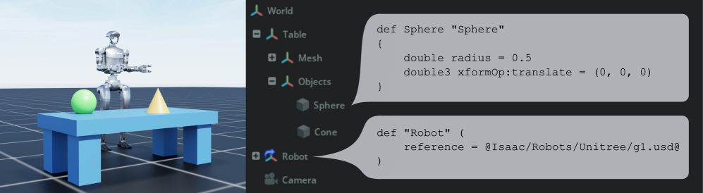
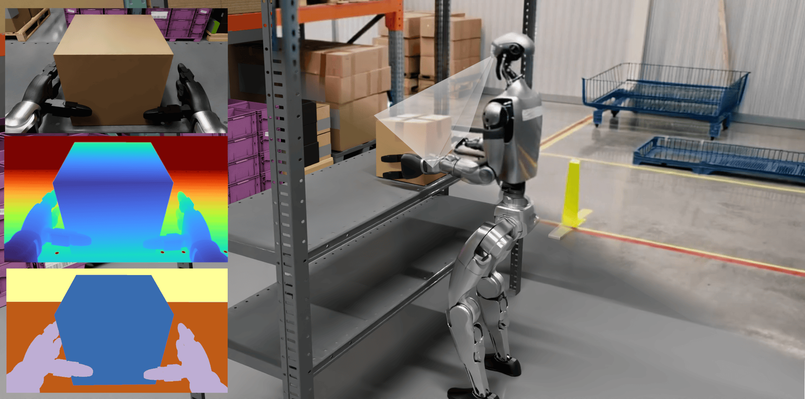
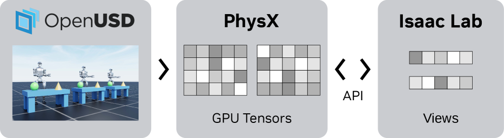

# Once the Standard Is Laid, Who Guarantees Data Quality?

_Once the standard is laid, who guarantees the quality of synthetic data?_

## Executive Summary

> [!callout]
> On December 17, 2025, the OpenUSD Core Specification 1.0 was announced as a formal standard under the Linux Foundation. For the first time, a 3D scene-description language that had been a Pixar internal tool for 25 years was pinned down as a "definitive syntax." With that, the center of gravity in the conversation around NVIDIA Omniverse shifts from a "tool" for rendering and simulation to a "data-standard layer" that places fragmented CAD, DCC, and sensor data on a single, verifiable format. This report reads Omniverse not as a feature list but as the data operating layer for physical AI.

> But a standard is only the beginning. OpenUSD standardizes the **format** of data; it does not guarantee that the data is **sufficient and accurate** for training. NVIDIA's humanoid foundation model GR00T N1 generated 780,000 synthetic trajectories in just 11 hours, yet still could not break the 49.6% ceiling on the RoboCasa benchmark. More volume is not the fix. Coverage, distribution, and quality are the real bottleneck.

> This is where the report's question sharpens. Once the standard is laid, who guarantees the quality of the data? The deeper NVIDIA's grip — format through OpenUSD, infrastructure through Omniverse — the more valuable an independent quality layer that diagnoses and corrects the sufficiency and bias of synthetic data above it becomes.

<!-- stat-card -->
**780K / 11h** — Synthetic trajectories / time to generate — GR00T N1 · ≈ 9 months of human demos

<!-- stat-card -->
**49.6%** — Success-rate ceiling, RoboCasa 300 demos — A sufficiency wall that holds even at 10× data

<!-- stat-card -->
**34.4%** — Best VLA model under OOD stress — VLATest · the trap behind LIBERO's 97.3% saturation

<!-- stat-card -->
**138** — Organizations in the OpenUSD alliance (AOUSD) — "350+ adopters" is a misattributed figure

## Why a "Standard" Is an Event — OpenUSD 1.0 and Data Interoperability

The 3D industry's long-standing pain was "export/import hell." Every time a designer moved a model built in Maya into Blender, or CAD data into a simulator, they had to convert formats — and in the conversion, material, scale, and hierarchy information drifted out of alignment. Data describing the same factory existed in a different shape in every tool. OpenUSD (Universal Scene Description) is the technology that merges these fragments into a single scene without export/import, and Omniverse is the collaboration and simulation infrastructure that lets multiple tools edit that same scene together in real time.

*▲ OpenUSD describes a 3D scene with declarative syntax (`def Sphere`, `references`) — the skeleton of a standard that places data once shaped differently in each tool onto a single definitive syntax. | Source: [Isaac Lab (arXiv:2511.04831)](https://arxiv.org/abs/2511.04831)*

The significance of the Core Specification 1.0 announced on December 17, 2025 is often misread. This is not the addition of new features. It pins down, for the first time, the core algorithms of OpenUSD — the syntax and data types, the composition algorithm, stage construction, value resolution, and the USDA/USDC/USDZ formats — as a "normative reference." It takes behavior that had functioned as a de facto standard and fixes it as a definitive syntax that anyone can implement and verify. The mission statement of the standards alliance AOUSD compresses that character.

AOUSD · Core Spec 1.0 announcement
                            "From fragmented workflows and incompatible data formats to true native interoperability."

That said, 1.0 did not standardize everything. Materials, Physics, Animation, and Rendering were **not included** in 1.0; they were deferred to working groups from 1.1 onward. In other words, this standard fixed the skeleton of the data structure — "how a scene is described and composed" — but it does not prescribe whether that scene is physically accurate. This distinction, that standardizing the format is not the same as guaranteeing quality, is the first echo running through the entire report.

### 1.1. The Road to Standardization — From Open Source to Normative Reference

OpenUSD did not become a standard overnight. The arc — from technology Pixar refined internally, to an open-source release, to the formation of an industry alliance, and finally to a normative reference specification — runs as follows.

2016Pixar releases USD as open source — an internal film-production tool reaches outside industries

2023AOUSD (Alliance for OpenUSD) founded — led by Pixar, Adobe, Apple, Autodesk, and NVIDIA, under the Linux Foundation (JDF)

2025.12Core Specification 1.0 announced — core behavior fixed as a normative reference ("definitive syntax")

2026–1.1 roadmap — materials, physics, animation, and rendering expanded in stages via working groups

### 1.2. Did "350+ Companies Adopt It"? Not Quite

Writing that introduces OpenUSD often carries the line "more than 350 companies have adopted it." That figure is inaccurate. "350" is the **number of CUDA-X acceleration libraries** NVIDIA mentioned in its October 2025 GTC keynote — not the count of companies that adopted OpenUSD. It is a misattribution that stuck when numbers from different announcements got transposed.

AOUSD's own official tally is different. As of year-end 2025, it is **50 General + 88 Contributor = 138 organizations**. Correcting a figure inflated roughly 2.5× may look trivial, but knowing the true scale of a standard is the starting point for any decision built on top of it. This report drops 350+ and uses 138 — because a piece about data cannot be dishonest about data.

> [!callout]
> OpenUSD 1.0 is not a "feature addition" but the "formal standardization of existing behavior." It is a data-interoperability event that resolves format fragmentation, and at the same time it makes clear that standardizing the format is not the same as standardizing quality. And the scale of that standards alliance is not an exaggerated "350+" but 138 organizations.

## Anatomy of Omniverse's Three Layers — Simulation, Collaboration, Agentic Microservices

Omniverse is not a single app. It is a bundle of tools for specific industrial and scientific workflows, and those tools divide broadly into three layers: simulation (the layer that runs virtual worlds with physical accuracy), collaboration (the layer where multiple tools handle the same scene together on top of OpenUSD), and the most recently realized agentic microservices (the layer where AI agents work directly on 3D data). The diagram below simplifies that stack.

Quality layer — diagnosing the sufficiency and bias of synthetic data (currently an empty seat)

<!-- stat-card -->
**Agentic microservices — Agent Toolkit · NIM · OpenShell governance**

<!-- stat-card -->
**Collaboration — OpenUSD-based real-time co-editing (USD Composer)**

<!-- stat-card -->
**Simulation — Isaac Sim · Newton physics engine · synthetic-data generation**

Omniverse's three layers and the empty "quality layer" above them. The firmer the standard and the infrastructure, the sharper the absence of a quality-assurance layer.

### 2.1. Agent Toolkit — What Agents Do to 3D Data

On June 1, 2026 at GTC Taipei, NVIDIA open-sourced the Agent Toolkit. The core idea is to package each stage of physical-AI development as "repeatable instructions an agent can execute." Work that people used to run by hand each time — preparing robot scenes, running simulations, training reinforcement learning, reconstructing autonomous-driving scenes, configuring industrial digital twins — is bundled into agent-callable skill units. The six skill areas are as follows.

| Skill area | Core task | Related stack |
| --- | --- | --- |
| Robot scene prep | Assemble, lay out, and light 3D scenes | USD Composer · Isaac Sim |
| Simulation run | Drive physics-based virtual environments | Isaac Sim · Newton |
| RL training | GPU-parallel reinforcement / imitation learning | Isaac Lab |
| AV scene reconstruction | Reconstruct autonomous-driving scenes | Alpamayo |
| Vision AI | Video analytics / synthetic generation | Metropolis · Cosmos |
| Industrial digital twin | Virtual validation of factories / data centers | Omniverse Blueprints |

Source: NVIDIA Agent Toolkit open-source announcement (2026-06-01, GTC Taipei).

If an agent executes these skills autonomously, a governance question follows: "Who supervises that execution?" NVIDIA assigned the security and governance of autonomous agent execution to the OpenShell™ runtime. The point is that agents do not roam the 3D environment freely but work inside controlled boundaries.

### 2.2. Agentic Scene Generation Is Not "Automation" but "Generation-with-Verification"

An agent building a 3D scene does not simply mean faster automation. The academic literature shows that a quality-verification loop has to live inside it. SAGE (arXiv:2602.10116) addresses scalable agentic 3D scene generation, improving scene quality through an iterative loop that critiques the generated scene. In other words, good agentic scene generation is not "build and done" but a cycle of "build, evaluate, fix." This insight leads straight into the heart of Section 4 — that generating data and verifying whether that data is sufficient are separate tasks.

*▲ What the simulation layer actually looks like — a humanoid picks a box in a virtual warehouse while the same scene is observed simultaneously as RGB, depth, and segmentation. This is how synthetic data is generated. | Source: [Isaac Lab (arXiv:2511.04831)](https://arxiv.org/abs/2511.04831)*

## The Synthetic-Data Trap — Not "Volume" but "Sufficiency"

Omniverse's most powerful promise is synthetic data. If robot demonstration data that would take 9 months in the real world can be made virtually in just 11 hours, the data-scarcity problem in robot learning looks solved. NVIDIA's humanoid foundation model GR00T N1 did in fact generate 780,000 synthetic trajectories in 11 hours. But the scorecard behind that dazzling number tells a different story.

*▲ GR00T N1's training-data pyramid — rising from web and human video (high quantity) to synthetic and real-world data (high specificity). Synthetic data fills the middle of quantity and specificity, but that does not by itself mean sufficiency. | Source: [GR00T N1 (arXiv:2503.14734)](https://arxiv.org/abs/2503.14734)*

On the RoboCasa benchmark, success rate rises as data grows, but the curve quickly hits a ceiling: 17.4% at 30 demos, 32.1% at 100 demos, 49.6% at 300 demos. Even a 10× increase in data does not break the half-way wall. A precise pick-and-place task stayed at 2.2% even with 100 demos. The bars below show that "data ceiling."

30 demos17.4%

100 demos32.1%

300 demos49.6%

full demos76.8%

RoboCasa data–performance scaling: even a 10× data increase (30→300) slows at 49.6%. Source: evaluation related to GR00T N1 (arXiv:2503.14734).

### 3.1. The Benchmark Trap — Saturated In-Distribution, Collapsing OOD

"But some benchmarks were above 97%" is a fair objection. True. On LIBERO, the standard in-distribution benchmark, models are effectively saturated at 97.3%. The problem is that the number does not mean real-world capability. Under the VLATest stress test, which systematically applies out-of-distribution (OOD) conditions, even the best model drops to 34.4% on its strongest task, with per-task averages plunging into the single digits to around 12%.

LIBERO (in-dist)97.3%

VLATest (OOD)34.4%

The same kind of model saturates in-distribution (97.3%) and collapses under OOD stress (34.4%). Source: VLATest (FSE 2025).

FactoryBench, announced in May 2026, repeats the same message in the industrial domain. Six frontier LLMs understood industrial data at under 50% at the structural level and under 18% at the decision level. Whether the modality is time series or imagery, models break down in similar ways when faced with out-of-distribution reality. This consistency is no accident.

> [!callout]
> Synthetic data stalls not at "volume" but at "sufficiency." The boast of 780K trajectories in 11 hours and the ceilings of RoboCasa 49.6%, VLATest 34.4%, and FactoryBench 50%/18% are two sides of the same fact. Even with the ability to generate infinitely, whether that data has the coverage, diversity, and quality to represent the real distribution is a separate question.

## The Standard Owns Format — Who Owns Quality? The Structural Sim-to-Real Gap

How deeply OpenUSD is embedded in simulation infrastructure shows in the training frameworks. Isaac Lab (arXiv:2511.04831) uses USD prototypes as the unit for building training environments. That means USD is the most basic building block of the virtual world a robot learns in. But standardizing the syntax that describes a scene does not automatically guarantee that scene's physical accuracy, diversity, or coverage. Even for a scene written in the same syntax, whether it represents the real world is an entirely different question.

*▲ OpenUSD → PhysX (GPU tensors) → Isaac Lab. USD is the most basic brick of the training environment. Yet standardizing the format does not guarantee that scene's physical accuracy or coverage. | Source: [Isaac Lab (arXiv:2511.04831)](https://arxiv.org/abs/2511.04831)*

This gap has been quantified in the literature. Fidelity-Aware (arXiv:2509.24797) shows that a "fidelity gap" induces out-of-distribution failure, and the Reality Gap survey (arXiv:2510.20808) documents how the scope of domain randomization expands sharply with task complexity. In other words, the harder the task, the more explosively the space of variation a simulation must cover widens. Judging whether that wide space has been filled sufficiently is precisely the domain of quality.

### 4.1. "Fast" Is Not "Sufficient"

The Newton physics engine is a case that makes this distinction vivid. Built jointly by NVIDIA, Google DeepMind, and Disney Research and contributed to the Linux Foundation in September 2025, this engine is built on OpenUSD and, in certain GPU environments, runs simulations hundreds of times faster than prior solvers. But a faster simulation means "make more data faster," not "that data is sufficient." Speed is the axis of volume; sufficiency is the axis of quality. The two axes do not move together.

> [!callout]
> The standard is responsible for the format of data; quality is the responsibility of the layer above it. Even when USD becomes the basic unit of the training environment, physical accuracy and coverage remain separate; even when simulation runs hundreds of times faster, sufficiency does not follow automatically. The sim-to-real gap is a structural data-quality challenge that does not close just by building better tools.

## The Double Structure of NVIDIA Lock-In — Officially Open, Effectively Dependent

"If OpenUSD is an open standard, there's no need to worry about NVIDIA dependence, right?" Answer that simply and you'll be wrong. OpenUSD is a formal open standard under the Linux Foundation's Joint Development Foundation (JDF), and on a standardization path toward ISO, so NVIDIA cannot unilaterally redirect it. The format is plainly open. But how that open format is actually implemented and operated tells a different picture.

Three facts forge the chain of "effective dependence." First, the chair of the Core Spec working group is from NVIDIA (Aaron Luk). Second, Omniverse is effectively the only large-scale commercial implementation. Third, real industrial workflows are implemented on top of the Omniverse libraries, NIM, and the Isaac stack. Combine these three and you get a practical path where "adopting the standard = adopting Omniverse" becomes easy. The standard is public, but the road to using it converges on a single ecosystem.

| Axis | Evidence of official openness | Evidence of effective dependence |
| --- | --- | --- |
| Governance | Under Linux Foundation / JDF, on an ISO path | Core Spec WG chair is from NVIDIA (Aaron Luk) |
| Implementation | Anyone can implement the spec | Omniverse is effectively the only large-scale commercial implementation |
| Workflow | The format is tool-neutral | Real pipelines depend on the NIM and Isaac stacks |
| Physics engine | Newton is also a Linux Foundation contribution | Built on OpenUSD, locking in down to the infrastructure level |

The double structure of official openness and effective dependence. A balance that does not declare for either side is needed.

Here a paradox arises. The deeper NVIDIA's grip on the standard and the infrastructure, the more valuable a layer that independently verifies and corrects data quality on top of that stack becomes. When a single ecosystem provides both the format and the infrastructure, an outside view that asks "is that data really sufficient?" grows both scarcer and more necessary. The tighter the lock-in, the more conspicuous the empty seat for an independent quality layer.

> [!callout]
> NVIDIA's lock-in is a double structure of "officially open + effectively dependent." OpenUSD is a genuine open standard, but the real-world road to using it converges on the single Omniverse ecosystem. In this structure, the value of a layer that independently guarantees data quality does not shrink but grows.

## Beyond BMW — SK Telecom and the Adoption Gap in Korea's Manufacturing Ecosystem

The most-cited Omniverse adoption case is BMW's virtual factory. By press accounts, roughly 15,000 people collaborate in an OpenUSD-based virtual environment, cutting factory-planning costs by up to 30%. As a first-order case of standard adoption, it matters. But the BMW story has been told enough, and the more important question lies beyond it — after adopting the standard, what practical gap remains? The place that shows that gap most clearly is Korea.

### 6.1. SK Telecom — Among the World's First Industrial Validations

SK Telecom built a digital twin of an SK hynix fab using its own "Agentic Digital Twin Modeling" technology, completed its PoC in 2025, and entered phased commercialization. In the June 2026 GTC Taipei keynote, Jensen Huang named SK Telecom directly as a key partner in manufacturing physical AI, and Mike Geyer, NVIDIA's head of industrial digital twins, assessed it as a case that "successfully applied and validated the Agent Toolkit in a real industrial environment." Quantitative metrics of synthetic-data quality (loading speed, GPU efficiency, etc.) were not disclosed with concrete figures in the initial press materials, so this report stays with the qualitative description of "improvement."

Mike Geyer · NVIDIA Industrial Digital Twins
                            SK Telecom successfully applied and validated the Agent Toolkit in a real industrial environment — a rare case that shows it working beyond simulation, in an operational setting.

### 6.2. Concentration at the Top, a Gap Among SMEs

Korea's adoption landscape is polarized. Samsung, Hyundai, and SK have each begun investments on the order of 50,000 GPUs, and Mobiltech became the first Korean company to join AOUSD as a General member, in March 2026. But this momentum is concentrated in a handful of large firms, while OpenUSD adoption and the practice of data-quality verification among mid-sized and small manufacturers remain a gap.

| Actor | Stage | Scale / case | Data-quality gap |
| --- | --- | --- | --- |
| SK Telecom | PoC complete → commercialization | SK hynix fab digital twin | Needs external validation of "is the synthetic data sufficient?" |
| Samsung | Large-scale investment | ~50K-GPU-class infrastructure | Diagnosis/correction practice not yet standardized |
| Hyundai | Large-scale investment | ~50K-GPU-class infrastructure | Diagnosis/correction practice not yet standardized |
| Mobiltech | Joined the standards alliance | First Korean AOUSD General member (2026-03) | Adopting the standard ≠ verifying quality |
| Mid-sized / small | Pre-entry | Adoption cases scarce | Both adoption and verification are a gap |

The OpenUSD/Omniverse adoption landscape in Korea's manufacturing ecosystem. Quantitative figures per press reports and announcements.

Even a large firm like SK Telecom needs an external validator asking "is this synthetic data sufficient?" as it moves from PoC to commercialization, and mid-sized and small firms are stalled at the adoption stage before they ever reach that question. The practical gap after the standard is laid is exactly this point: data-quality verification after adoption.

> [!callout]
> Korea holds, at once, an "among-the-world's-first validation case" and an "SME gap." SK Telecom achieved validation in an operational environment, but adoption is skewed toward large firms while adoption and data-quality verification among mid-sized and small companies sit empty. It is the market where the practical gap after standard adoption is most clearly visible.

## Why Pebblous Watches This Shift — The Quality Layer Above the Standard

The more OpenUSD frees the format and Omniverse lays the infrastructure, the clearer the outline of the gap this report has returned to again and again: the layer that judges whether the data is sufficient and accurate for training. Pebblous watches this shift not for the dazzle of the new tools but for the question those tools left unsolved.

### Where Business and Technology Intersect

Omniverse provides the standard (format) for 3D and industrial data through OpenUSD, but it does not guarantee that data's sufficiency and accuracy (quality). Pebblous's DataClinic and AI-Ready Data correspond exactly to this "quality layer above the standard" — positioned to diagnose and correct the sufficiency and bias of the synthetic data that Isaac Sim and Replicator pour out. The deeper NVIDIA lays the standard and the infrastructure (Sections 1 and 5), the more visible the missing quality-assurance layer above it becomes (Section 4).

### Data Quality Makes the Model

Synthetic data can be made infinitely, but the sim-to-real gap, gaps in domain coverage, and distribution bias distort a model's internal representations. Behind the quantitative boast of "780K trajectories," which trajectories represent the real distribution is fundamentally a data-quality question. RoboCasa 300 demos stalling at 49.6% and VLATest plunging to 34.4% are the evidence. This is why the report moves the frame from "volume" to "sufficiency and quality."

### Implications for Customer Practice

When Korean manufacturing, robotics, and telecom companies adopt Omniverse and OpenUSD (Section 6), standard adoption is only the start; a practical gap remains in data-quality verification and synthetic-data sufficiency diagnosis. Even a large firm like SK Telecom needs an external validator asking "is this synthetic data sufficient?" as it moves from PoC to commercialization, and mid-sized and small firms struggle even to enter. Filling that gap remains someone's job to do.

### Positioning — Complement, Not Competition

"Once Omniverse lays the standard, who guarantees quality?" That question is the report's final anchor. The deeper NVIDIA's grip on the stack's infrastructure and standard, the more valuable an independent layer that verifies and corrects data quality on top of it becomes. This seat is not one for an NVIDIA competitor to take; it is one to be filled complementarily, as a quality-assurance layer above the standard. That is precisely the place for AI-Ready Data and DataClinic, which answer the question that comes after the standard is laid.

> [!callout]
> **Editor's Note.** This report reads NVIDIA Omniverse as a data operating layer and lays out how OpenUSD standardization freed the format while leaving sufficiency and quality as the task of the layer above it. Pebblous sees this "quality layer above the standard" as a point that overlaps with its own direction. That judgment, however, is for each reader to test in their own context, and there is no need to read this piece's conclusion as a claim of any particular product's superiority.

## References

### Academic (arXiv, etc.)

- 1.NVIDIA. "[GR00T N1: An Open Foundation Model for Generalist Humanoid Robots](https://arxiv.org/abs/2503.14734)." arXiv:2503.14734, 2025.
- 2.Merzouki, Y. et al. "[FactoryBench: Evaluating Industrial Machine Understanding](https://arxiv.org/abs/2605.07675)." arXiv:2605.07675, 2026.
- 3.NVIDIA. "[Cosmos World Foundation Model Platform for Physical AI](https://arxiv.org/abs/2501.03575)." arXiv:2501.03575, 2025.
- 4.NVIDIA. "[Cosmos-Predict2.5](https://arxiv.org/abs/2511.00062)." arXiv:2511.00062, 2025.
- 5.NVIDIA. "[Isaac Lab: A GPU-Accelerated Simulation Framework for Robot Learning](https://arxiv.org/abs/2511.04831)." arXiv:2511.04831, 2025.
- 6."[SAGE: Scalable Agentic 3D Scene Generation for Embodied AI](https://arxiv.org/abs/2602.10116)." arXiv:2602.10116, 2026.
- 7.Aljalbout, E. et al. "[The Reality Gap in Robotics: A Survey](https://arxiv.org/abs/2510.20808)." arXiv:2510.20808, 2025.
- 8."[Neural Scaling Laws for Embodied AI](https://arxiv.org/abs/2405.14005)." arXiv:2405.14005, 2024 (updated 2025).
- 9."[Fidelity-Aware Data Composition for Robust Robot Generalization](https://arxiv.org/abs/2509.24797)." arXiv:2509.24797, 2025.
- 10."[Vision-Language-Action Models in Robotic Manipulation: A Systematic Review](https://arxiv.org/abs/2507.10672)." arXiv:2507.10672, 2025.
- 11.Wang, Z. et al. "[VLATest: Testing Vision-Language-Action Models](https://wangzhijie.me/assets/pubs/fse25-vlatest.pdf)." FSE 2025.

### Standards & Industry (NVIDIA · AOUSD · Linux Foundation)

- 12.AOUSD. "[OpenUSD Core Specification 1.0 Announcement](https://aousd.org/news/core-spec-announcement/)." 2025-12-17.
- 13.Linux Foundation. "OpenUSD Core Spec 1.0 Press Release." 2025-12-17.
- 14.AOUSD. "[Year-in-Review: A Landmark Year for OpenUSD (138 organizations)](https://aousd.org/blog/aousd-year-in-review-a-landmark-year-for-openusd-standardization-and-growth-in-2025/)." 2025.
- 15.AOUSD. "New Member Milestones (including Mobiltech)." PR Newswire 302725028, 2026-03.
- 16.NVIDIA. "[Omniverse Physical AI Operating System Expands](https://nvidianews.nvidia.com/news/nvidia-omniverse-physical-ai-operating-system-expands-to-more-industries-and-partners)." GTC DC 2025.
- 17.NVIDIA. "[Major Collection of Open-Source Agent Tools and Skills for Physical AI](https://nvidianews.nvidia.com/news/nvidia-releases-major-collection-of-open-source-agent-tools-and-skills-for-physical-ai)." 2026-06-01.
- 18.Linux Foundation. "Contribution of Newton Physics Engine (NVIDIA·DeepMind·Disney)." 2025-09-29.
- 19.NVIDIA. "[Omniverse DSX Blueprint](https://blogs.nvidia.com/blog/omniverse-dsx-blueprint/)." 2025-10.
- 20.NVIDIA. "[BMW Group + NVIDIA Omniverse](https://blogs.nvidia.com/blog/bmw-group-nvidia-omniverse/)."

### Korea

- 21.Asiae. "[SK Telecom GTC Taipei Partner Announcement](https://www.asiae.co.kr/en/article/IT/2026060117071546970)." 2026-06-01.
- 22.TheElec. "[SK Telecom Omniverse SK hynix Fab](https://www.thelec.net/news/articleView.html?idxno=10930)."
- 23.NVIDIA. "[SK Telecom + NVIDIA Infrastructure](https://nvidianews.nvidia.com/news/sk-telecom-ai-infrastructure)." 2026-06-07.
- 24.SK Telecom. "[Official Release (Mike Geyer quote)](https://news.sktelecom.com/en/3077)."
- 25.NVIDIA. "[South Korea AI Infrastructure (Samsung·Hyundai 50K GPU)](https://nvidianews.nvidia.com/news/south-korea-ai-infrastructure)." 2026-06.

<!-- stat-card -->
**📚 Physical AI Series** — This article is part of a series curated under [Physical AI](/project/PhysicalAI/en/). How do we standardize the world a robot will learn from, and how do we guarantee that the data is sufficient — a place that reads data, standards, quality, and the industrial landscape together. — It is also curated in the [Graphics for Physical AI](/project/GraphicsForPhysicalAI/en/) hub — where 3DGS, differentiable rendering, and OpenUSD become a robot's eyes.
