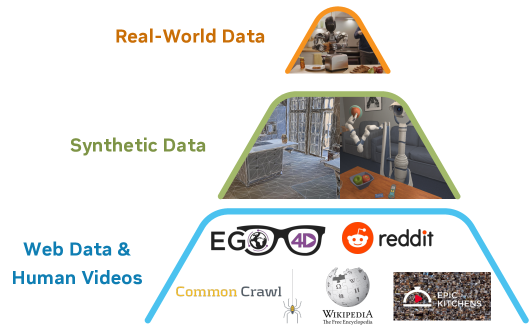

# 표준이 깔린 뒤, 누가 데이터의 품질을 보증하는가

_표준이 깔린 다음, 합성데이터의 품질은 누가 보증하나_

## Executive Summary

> [!callout]
> 2025년 12월 17일, OpenUSD Core Specification 1.0이 Linux Foundation 산하 정식 표준으로 발표됐다. 25년간 Pixar 내부 도구였던 3D 씬 기술 언어가 처음으로 "결정적 문법(definitive syntax)"으로 못 박힌 사건이다. 이로써 NVIDIA Omniverse를 둘러싼 논의의 무게중심은 렌더링·시뮬레이션이라는 "도구"에서, 파편화된 CAD·DCC·센서 데이터를 하나의 검증 가능한 형식 위에 올리는 "데이터 표준 계층"으로 옮겨간다. 이 글은 Omniverse를 기능 목록이 아니라 물리 AI의 데이터 운영 계층으로 읽는다.

> 그러나 표준은 시작일 뿐이다. OpenUSD는 데이터의 **형식**을 표준화하지만, 그 데이터가 학습에 **충분하고 정확한지**는 보장하지 않는다. NVIDIA의 휴머노이드 기반 모델 GR00T N1은 합성 궤적 78만 개를 단 11시간 만에 쏟아내고도 RoboCasa 벤치마크에서 49.6%의 천장을 넘지 못했다. "양을 부으면 풀린다"가 아니라, 커버리지·분포·품질이 진짜 병목이라는 뜻이다.

> 여기서 이 리포트의 질문이 또렷해진다. 표준이 깔린 뒤, 누가 데이터의 품질을 보증하는가. NVIDIA가 OpenUSD로 형식을, Omniverse로 인프라를 장악할수록, 그 위에서 합성데이터의 충분성과 편향을 진단·보정하는 독립 품질 레이어의 가치는 오히려 커진다.

<!-- stat-card -->
**78만 / 11h** — 합성 궤적 생성량 / 소요 시간 — GR00T N1 · 인간 시연 약 9개월 등가

<!-- stat-card -->
**49.6%** — RoboCasa 300 demos 성공률 천장 — 데이터 10배 늘려도 막히는 충분성의 벽

<!-- stat-card -->
**34.4%** — OOD 스트레스 최고 VLA 모델 — VLATest · LIBERO 97.3% 포화의 함정

<!-- stat-card -->
**138개** — OpenUSD 표준 연합(AOUSD) 조직 — "350+ 채택"은 다른 수치의 오귀속

## 왜 "표준"이 사건인가 — OpenUSD 1.0과 데이터 상호운용성

3D 산업의 오랜 고통은 "export/import 지옥"이었다. 디자이너는 Maya에서 만든 모델을 Blender로, CAD 데이터를 시뮬레이터로 옮길 때마다 포맷을 변환하고, 변환 과정에서 재질·스케일·계층 정보가 어긋났다. 같은 공장을 묘사한 데이터가 도구마다 다른 모양으로 존재했다. OpenUSD(Universal Scene Description)는 이 파편을 export/import 없이 하나의 씬으로 합치는 기술이고, Omniverse는 그 위에서 여러 도구가 실시간으로 같은 씬을 함께 편집하게 하는 협업·시뮬레이션 인프라다.

*▲ OpenUSD는 3D 씬을 선언적 문법(`def Sphere`, `references`)으로 기술한다 — 도구마다 다르던 데이터를 하나의 결정적 문법 위에 올리는 표준의 골격. | Source: [Isaac Lab (arXiv:2511.04831)](https://arxiv.org/abs/2511.04831)*

2025년 12월 17일 발표된 Core Specification 1.0의 의미는 흔히 오해된다. 이것은 새 기능 추가가 아니다. OpenUSD의 핵심 알고리즘, 즉 문법과 데이터 타입, 합성(composition) 알고리즘, 스테이지 구성, 값 해석, USDA/USDC/USDZ 포맷을 처음으로 "정규 참조(normative reference)"로 못 박은 것이다. 그동안 사실상의 표준처럼 쓰이던 동작을, 누구든 구현하고 검증할 수 있는 결정적 문법으로 확정한 사건이다. 표준 연합 AOUSD가 내건 목표 문장이 그 성격을 압축한다.

AOUSD · Core Spec 1.0 발표
                            "파편화된 워크플로우와 호환되지 않는 데이터 포맷에서, 진정한 네이티브 상호운용성으로(From fragmented workflows and incompatible data formats to true native interoperability)."

다만 1.0이 모든 것을 표준화한 것은 아니다. 재질(Materials)·물리(Physics)·애니메이션(Animation)·렌더링(Rendering)은 1.0에 **포함되지 않았고**, 1.1 이후 워킹 그룹으로 위임됐다. 즉 이번 표준은 "장면을 어떻게 기술하고 합칠 것인가"라는 데이터 구조의 골격을 확정했을 뿐, 그 장면이 물리적으로 정확한지까지 규정하지는 않는다. 형식의 표준화와 품질의 보장은 별개라는 이 구분이, 리포트 전체를 관통하는 첫 번째 메아리다.

### 1.1. 표준화의 여정 — 오픈소스에서 정규 참조까지

OpenUSD가 하루아침에 표준이 된 것은 아니다. Pixar가 내부에서 다듬어 온 기술이 오픈소스로 공개되고, 산업 연합이 꾸려지고, 마침내 정규 참조 명세로 확정되기까지의 흐름은 다음과 같다.

2016Pixar가 USD를 오픈소스로 공개 — 내부 영화 제작 도구가 외부 산업으로

2023AOUSD(Alliance for OpenUSD) 창립 — Pixar·Adobe·Apple·Autodesk·NVIDIA 주도, Linux Foundation(JDF) 산하

2025.12Core Specification 1.0 발표 — 핵심 동작을 정규 참조로 확정("결정적 문법")

2026~1.1 로드맵 — 재질·물리·애니메이션·렌더링을 워킹 그룹으로 단계 확장

### 1.2. "350+ 기업이 채택했다"는 진짜일까

OpenUSD를 소개하는 글에서 "350개 이상의 기업이 채택했다"는 문장이 자주 보인다. 이 수치는 정확하지 않다. "350"은 NVIDIA가 GTC 2025년 10월 기조연설에서 언급한 **CUDA-X 가속 라이브러리의 개수**이지, OpenUSD를 채택한 기업의 수가 아니다. 서로 다른 발표의 수치가 옮겨지는 과정에서 붙어버린 오귀속이다.

AOUSD가 직접 집계한 공식 수치는 다르다. 2025년 연말 기준 **General 50개 + Contributor 88개 = 138개 조직**이다. 약 2.5배 부풀려진 수치를 정정하는 일이 사소해 보일 수 있지만, 표준의 실제 규모를 정확히 아는 것은 그 위에서 어떤 의사결정을 내릴지의 출발점이다. 그래서 이 리포트는 350+를 버리고 138을 쓴다. 데이터에 관한 글이 데이터에 부정직할 수는 없다.

> [!callout]
> OpenUSD 1.0은 "기능 추가"가 아니라 "기존 동작의 정식 표준화"다. 형식의 파편화를 해결한 데이터 상호운용성 사건이며, 동시에 형식의 표준화가 곧 품질의 표준화는 아니라는 점을 분명히 한다. 그리고 그 표준 연합의 규모는 과장된 "350+"가 아니라 138개 조직이다.

## Omniverse 3계층 해부 — 시뮬레이션·협업·에이전트 마이크로서비스

Omniverse는 하나의 앱이 아니다. 특정 산업·과학 워크플로우를 위한 도구의 묶음이며, 그 도구들은 크게 세 계층으로 나뉜다. 시뮬레이션(가상 세계를 물리적으로 정확하게 돌리는 층), 협업(여러 도구가 OpenUSD 위에서 같은 씬을 함께 다루는 층), 그리고 가장 최근 실체화된 에이전트 마이크로서비스(AI 에이전트가 3D 데이터 위에서 직접 작업하는 층)다. 아래 그림은 그 적층을 단순화한 것이다.

품질 레이어 — 합성데이터의 충분성·편향 진단 (현재 빈자리)

<!-- stat-card -->
**Agentic 마이크로서비스 — Agent Toolkit·NIM·OpenShell 거버넌스**

<!-- stat-card -->
**Collaboration — OpenUSD 기반 실시간 공동 편집 (USD Composer)**

<!-- stat-card -->
**Simulation — Isaac Sim·Newton 물리 엔진·합성데이터 생성**

Omniverse 3계층과 그 위의 "품질 레이어" 빈자리. 표준·인프라가 탄탄할수록 품질 보증 계층의 부재가 선명해진다.

### 2.1. Agent Toolkit — 에이전트가 3D 데이터에 하는 일

2026년 6월 1일 GTC Taipei에서 NVIDIA는 Agent Toolkit을 오픈소스로 공개했다. 핵심은 물리 AI 개발의 각 단계를 "에이전트가 실행할 수 있는, 반복 가능한 지시"로 패키징한다는 것이다. 사람이 매번 손으로 돌리던 작업을 에이전트가 호출 가능한 스킬 단위로 묶었다. 로봇 씬 준비, 시뮬레이션 실행, 강화학습 훈련, 자율주행 씬 재구성, 산업 디지털 트윈 구성이 그 대상이다. 6개 스킬 영역은 다음과 같다.

| 스킬 영역 | 핵심 작업 | 관련 스택 |
| --- | --- | --- |
| 로봇 씬 준비 | 3D 씬 조립·배치·라이팅 | USD Composer · Isaac Sim |
| 시뮬레이션 실행 | 물리 기반 가상 환경 구동 | Isaac Sim · Newton |
| RL 훈련 | GPU 병렬 강화·모방 학습 | Isaac Lab |
| AV 씬 재구성 | 자율주행 주행 장면 복원 | Alpamayo |
| 비전 AI | 영상 분석·합성 생성 | Metropolis · Cosmos |
| 산업 디지털 트윈 | 공장·데이터센터 가상 검증 | Omniverse Blueprints |

출처: NVIDIA Agent Toolkit 오픈소스 발표(2026-06-01, GTC Taipei).

에이전트가 자율적으로 이 스킬을 실행한다면, "누가 그 실행을 감독하는가"라는 거버넌스 문제가 따라온다. NVIDIA는 OpenShell™ 런타임을 통해 에이전트 자율 실행의 보안과 거버넌스를 담당하게 했다. 에이전트가 3D 환경을 마음대로 휘젓는 것이 아니라, 통제된 경계 안에서 작업하도록 한 것이다.

### 2.2. 에이전트 씬 생성은 "자동화"가 아니라 "검증 포함 생성"

에이전트가 3D 씬을 만든다는 것이 단순히 빠른 자동화를 뜻하지는 않는다. 학술 연구는 그 안에 품질 검증 루프가 들어 있어야 함을 보인다. SAGE(arXiv:2602.10116)는 확장 가능한 에이전트 3D 씬 생성을 다루며, 생성된 씬을 비평(critic)하는 반복 루프로 씬 품질을 개선한다. 즉 좋은 에이전트 씬 생성은 "만들고 끝"이 아니라 "만들고, 평가하고, 고치는" 순환이다. 이 통찰은 섹션 4의 핵심으로 곧장 이어진다. 데이터를 생성하는 일과 그 데이터가 충분한지 검증하는 일은 분리된 과제라는 점이다.

*▲ 시뮬레이션 계층의 실제 모습 — 가상 창고에서 휴머노이드가 박스를 집고, 같은 장면이 RGB·깊이·세그멘테이션으로 동시에 관측된다. 합성데이터는 이렇게 생성된다. | Source: [Isaac Lab (arXiv:2511.04831)](https://arxiv.org/abs/2511.04831)*

## 합성데이터의 함정 — "양"이 아니라 "충분성"

Omniverse의 가장 강력한 약속은 합성데이터다. 현실에서 9개월 걸릴 로봇 시연 데이터를 가상에서 단 11시간에 만들 수 있다면, 로봇 학습의 데이터 부족 문제는 끝난 것처럼 보인다. NVIDIA의 휴머노이드 기반 모델 GR00T N1은 실제로 합성 궤적 78만 개를 11시간에 생성했다. 그러나 그 화려한 숫자 뒤의 성적표는 다른 이야기를 한다.

*▲ GR00T N1의 학습 데이터 피라미드 — 웹·인간 영상(양 많음)에서 합성, 실세계(특이성 높음)로 올라간다. 합성데이터는 양과 특이성의 중간을 메우지만, 그것이 곧 충분성을 뜻하지는 않는다. | Source: [GR00T N1 (arXiv:2503.14734)](https://arxiv.org/abs/2503.14734)*

RoboCasa 벤치마크에서 데이터를 늘릴수록 성공률은 오르지만, 그 곡선은 빠르게 천장에 부딪힌다. 30 demos에서 17.4%, 100 demos에서 32.1%, 300 demos에서 49.6%. 데이터를 10배 늘려도 절반의 벽을 넘지 못한다. 정밀한 pick-and-place 과제는 100 demos에서도 2.2%에 머물렀다. 아래 막대는 그 "데이터 천장"을 보여준다.

30 demos17.4%

100 demos32.1%

300 demos49.6%

full demos76.8%

RoboCasa 데이터-성능 스케일링: 데이터를 10배(30→300) 늘려도 49.6%에서 둔화. 출처: GR00T N1(arXiv:2503.14734) 관련 평가.

### 3.1. 벤치마크의 함정 — 포화한 in-distribution과 무너지는 OOD

"그래도 어떤 벤치마크는 97%를 넘던데"라는 반론이 가능하다. 맞다. 표준 in-distribution 벤치마크인 LIBERO에서 모델들은 97.3%로 사실상 포화 상태다. 문제는 그 숫자가 실제 환경 능력을 뜻하지 않는다는 데 있다. 체계적으로 분포 밖(OOD) 조건을 가하는 VLATest 스트레스 테스트에서는, 최고 모델조차 가장 잘하는 과제에서 34.4%, 과제 평균은 한 자릿수에서 12% 사이로 급락한다.

LIBERO (in-dist)97.3%

VLATest (OOD)34.4%

같은 종류의 모델이 in-distribution에서 포화(97.3%)하고 OOD 스트레스에서 무너진다(34.4%). 출처: VLATest(FSE 2025).

2026년 5월 발표된 FactoryBench는 같은 메시지를 산업 도메인에서 반복한다. 최전선 LLM 6종이 산업 데이터를 구조적 수준에서 50% 미만, 의사결정 수준에서 18% 미만으로만 이해했다. 모달리티가 시계열이든 이미지든, 분포 밖 현실 앞에서 모델은 비슷하게 무너진다. 이 일관성은 우연이 아니다.

> [!callout]
> 합성데이터는 "양"이 아니라 "충분성"에서 막힌다. 78만 궤적/11시간의 자랑과 RoboCasa 49.6%·VLATest 34.4%·FactoryBench 50%/18%의 천장은 같은 사실의 양면이다. 무한히 생성할 수 있어도, 그 데이터가 실제 분포를 대표하는 커버리지·다양성·품질을 갖췄는지는 별개의 문제다.

## 표준은 형식을, 누가 품질을 — sim-to-real의 구조적 격차

OpenUSD가 시뮬레이션 인프라에 얼마나 깊이 박혔는지는 학습 프레임워크에서 드러난다. Isaac Lab(arXiv:2511.04831)은 학습 환경을 구성하는 단위로 USD 프로토타입을 쓴다. 로봇이 학습하는 가상 세계의 가장 기본 벽돌이 USD라는 뜻이다. 그러나 장면을 기술하는 문법을 표준화한다고, 그 장면의 물리적 정확성·다양성·커버리지가 자동으로 보장되지는 않는다. 같은 문법으로 쓰인 장면이라도, 그것이 실세계를 대표하는지는 전혀 다른 질문이다.

*▲ OpenUSD → PhysX(GPU 텐서) → Isaac Lab. 학습 환경의 가장 기본 벽돌이 USD다. 그러나 형식의 표준화가 그 장면의 물리적 정확성·커버리지까지 보장하지는 않는다. | Source: [Isaac Lab (arXiv:2511.04831)](https://arxiv.org/abs/2511.04831)*

이 격차는 학술적으로 정량화돼 있다. Fidelity-Aware(arXiv:2509.24797)는 "데이터 충실도 격차(fidelity gap)"가 분포 밖 실패를 유발함을 보이고, Reality Gap 서베이(arXiv:2510.20808)는 도메인 랜덤화의 범위가 과제 복잡도와 함께 급팽창함을 정리한다. 즉 과제가 어려워질수록, 시뮬레이션이 커버해야 할 변이의 공간이 폭발적으로 넓어진다. 그 넓은 공간을 충분히 채웠는지를 판정하는 일이 바로 품질의 영역이다.

### 4.1. "빠르다"는 "충분하다"가 아니다

Newton 물리 엔진은 이 구분을 선명하게 보여주는 사례다. NVIDIA·Google DeepMind·Disney Research가 함께 만들어 2025년 9월 Linux Foundation에 기여한 이 엔진은 OpenUSD를 기반으로 구축됐고, 특정 GPU 환경에서 기존 솔버보다 수백 배 빠른 시뮬레이션 속도를 낸다. 그러나 시뮬레이션이 빨라진다는 것은 "더 많은 데이터를 더 빨리 만든다"는 뜻이지, "그 데이터가 충분하다"는 뜻이 아니다. 속도는 양의 축이고, 충분성은 품질의 축이다. 두 축은 함께 가지 않는다.

> [!callout]
> 표준은 데이터의 형식을 책임지고, 품질은 그 위 계층이 책임진다. USD가 학습 환경의 기본 단위가 되어도 물리적 정확성·커버리지는 별개로 남고, 시뮬레이션이 수백 배 빨라져도 충분성은 자동으로 따라오지 않는다. sim-to-real 격차는 도구를 더 잘 만든다고 닫히지 않는, 데이터 품질의 구조적 과제다.

## NVIDIA 잠금의 이중 구조 — 공식 개방, 실질 의존

"OpenUSD가 개방 표준이라면 NVIDIA 종속을 걱정할 필요는 없지 않나?" 이 질문에 단순하게 답하면 틀린다. OpenUSD는 Linux Foundation의 합동개발재단(JDF) 기반 공식 개방 표준이고, 표준화 경로상 ISO를 향하고 있어 NVIDIA가 단독으로 방향을 틀 수는 없다. 형식은 분명히 열려 있다. 그러나 그 열린 형식이 실제로 구현되고 운영되는 방식에는 다른 그림이 있다.

세 가지 사실이 "실질 의존"의 사슬을 만든다. 첫째, Core Spec 워킹 그룹의 의장이 NVIDIA 소속(Aaron Luk)이다. 둘째, Omniverse가 사실상 유일한 대규모 상용 구현체다. 셋째, 실제 산업 워크플로우가 Omniverse 라이브러리·NIM·Isaac 스택 위에서 구현된다. 이 셋이 합쳐지면 "표준 채택 = Omniverse 도입"이 되기 쉬운 현실적 경로가 만들어진다. 표준은 공개돼 있지만, 그것을 쓰는 길은 한 생태계로 수렴한다.

| 축 | 공식 개방의 근거 | 실질 의존의 근거 |
| --- | --- | --- |
| 거버넌스 | Linux Foundation/JDF 산하, ISO 경로 | Core Spec WG 의장이 NVIDIA(Aaron Luk) |
| 구현체 | 명세는 누구나 구현 가능 | Omniverse가 사실상 유일한 대규모 상용 구현체 |
| 워크플로우 | 형식은 도구 중립 | 실제 파이프라인이 NIM·Isaac 스택에 의존 |
| 물리 엔진 | Newton도 Linux Foundation 기여 | OpenUSD 기반으로 인프라 단위까지 고착 |

공식 개방과 실질 의존의 이중 구조. 어느 한쪽으로 단정하지 않는 균형이 필요하다.

여기서 역설이 생긴다. NVIDIA가 표준과 인프라를 깊이 장악할수록, 그 스택 위에서 데이터 품질을 독립적으로 검증·보정하는 레이어의 가치는 오히려 커진다. 한 생태계가 형식과 인프라를 모두 제공할 때, "그 데이터가 정말 충분한가"를 묻는 외부의 시선은 더 희소해지고 더 필요해진다. 잠금이 단단할수록 독립 품질 레이어의 빈자리가 선명해지는 것이다.

> [!callout]
> NVIDIA의 잠금은 "공식 개방 + 실질 의존"의 이중 구조다. OpenUSD는 진짜 개방 표준이지만, 그것을 쓰는 현실의 길은 Omniverse 한 생태계로 수렴한다. 이 구조에서 데이터 품질을 독립적으로 보증하는 계층의 가치는 줄어들지 않고 커진다.

## BMW를 넘어 — SK텔레콤과 한국 제조 생태계의 채택 격차

Omniverse 도입 사례로 가장 많이 인용되는 것은 BMW의 가상 공장이다. 보도 기준 약 15,000명이 OpenUSD 기반 가상 환경에서 협업하고, 공장 계획 비용을 최대 30%까지 줄였다고 한다. 이것은 표준 채택의 1차 사례로서 의미가 있다. 그러나 BMW 이야기는 이미 충분히 회자됐고, 더 중요한 질문은 그 다음에 있다. 표준을 채택한 뒤, 남는 실무 공백은 무엇인가. 그 공백을 가장 선명하게 보여주는 곳이 한국이다.

### 6.1. SK텔레콤 — 세계 최초급 산업 검증

SK텔레콤은 "Agentic Digital Twin Modeling"이라는 자체 기술로 SK하이닉스 팹의 디지털 트윈을 구현하고, 2025년 PoC를 완료해 단계적 상용화에 들어갔다. 2026년 6월 GTC Taipei 기조연설에서 Jensen Huang은 SK텔레콤을 제조 물리 AI의 핵심 파트너로 직접 언급했고, NVIDIA의 산업 디지털 트윈 총괄 Mike Geyer는 이를 "실제 산업 환경에서 Agent Toolkit을 성공적으로 적용·검증한" 사례로 평가했다. 합성데이터 품질의 정량 지표(로딩 속도·GPU 효율 등)는 1차 보도자료에 구체 수치로 공개되지 않아, 이 글은 "개선"이라는 정성 서술에 머무른다.

Mike Geyer · NVIDIA Industrial Digital Twins
                            SK텔레콤이 실제 산업 환경에서 Agent Toolkit을 성공적으로 적용하고 검증했다 — 시뮬레이션을 넘어 운영 환경에서 작동함을 보인 드문 사례다.

### 6.2. 대기업 집중과 중소의 공백

한국의 채택 지형은 양극화돼 있다. Samsung·Hyundai·SK는 각각 5만 GPU급 투자를 시작했고, Mobiltech는 2026년 3월 한국 기업 최초로 AOUSD 일반회원이 됐다. 그러나 이 흐름은 소수 대기업에 집중돼 있고, 중견·중소 제조의 OpenUSD 도입과 데이터 품질 검증 실무는 여전히 공백이다.

| 주체 | 단계 | 규모/사례 | 데이터 품질 공백 |
| --- | --- | --- | --- |
| SK텔레콤 | PoC 완료 → 상용화 | SK하이닉스 팹 디지털 트윈 | "충분한 합성데이터인가" 외부 검증 필요 |
| Samsung | 대규모 투자 | 약 5만 GPU급 인프라 | 진단·보정 실무 표준화 미정 |
| Hyundai | 대규모 투자 | 약 5만 GPU급 인프라 | 진단·보정 실무 표준화 미정 |
| Mobiltech | 표준 연합 가입 | 한국 최초 AOUSD 일반회원(2026-03) | 표준 채택 ≠ 품질 검증 |
| 중견·중소 | 진입 이전 | 도입 사례 희소 | 도입·검증 모두 공백 |

한국 제조 생태계의 OpenUSD/Omniverse 채택 지형. 정량 수치는 보도·발표 기준.

SK텔레콤급 대기업조차 PoC에서 상용화로 넘어갈 때 "이 합성데이터가 충분한가"를 묻는 외부 검증자가 필요하고, 중견·중소는 그 질문에 이르기 전 도입 단계에서 멈춰 있다. 표준이 깔린 다음의 실무 공백은 정확히 이 지점, 채택 이후의 데이터 품질 검증이다.

> [!callout]
> 한국은 "세계 최초급 검증 사례"와 "중소 공백"을 동시에 가졌다. SK텔레콤이 운영 환경 검증을 해냈지만, 채택은 대기업에 쏠려 있고 중견·중소의 도입과 데이터 품질 검증은 비어 있다. 표준 채택 다음의 실무 공백이 가장 또렷하게 보이는 시장이다.

## 페블러스가 이 변화에 주목하는 이유 — 표준 위의 품질 레이어

OpenUSD가 형식을 풀고 Omniverse가 인프라를 깔수록, 이 글이 거듭 짚은 빈자리가 도드라진다. 그 데이터가 학습에 충분하고 정확한지를 판정하는 계층이다. 페블러스가 이 변화를 주시하는 까닭은 새 도구의 화려함 때문이 아니라, 그 도구들이 풀지 못한 채 남긴 질문 때문이다.

### 비즈니스와 기술의 교차점

Omniverse는 OpenUSD로 3D·산업 데이터의 표준(형식)을 제공하지만, 그 데이터의 충분성·정확성(품질)은 보장하지 않는다. 페블러스의 DataClinic·AI-Ready Data는 정확히 이 "표준 위의 품질 레이어"에 해당한다. Isaac Sim과 Replicator가 쏟아내는 합성데이터의 충분성과 편향을 진단·보정하는 위치다. NVIDIA가 표준과 인프라를 깊이 깔수록(섹션 1·5), 그 위 품질 보증 레이어의 빈자리는 더 선명해진다(섹션 4).

### 데이터 품질이 모델을 만든다

합성데이터는 무한히 만들 수 있지만, sim-to-real 격차·도메인 커버리지 공백·분포 편향이 모델의 내부 표현을 왜곡한다. "78만 궤적"이라는 양적 자랑 뒤에서, 어떤 궤적이 실제 분포를 대표하는가는 본질적으로 데이터 품질의 문제다. RoboCasa 300 demos가 49.6%에서 멈추고 VLATest가 34.4%로 급락하는 것이 그 증거다. 이 리포트가 프레임을 "양"에서 "충분성·품질"로 옮긴 이유가 여기 있다.

### 고객 실무에서의 함의

한국 제조·로봇·통신 기업이 Omniverse·OpenUSD를 도입할 때(섹션 6), 표준 채택은 시작일 뿐 데이터 품질 검증·합성데이터 충분성 진단이라는 실무 공백이 남는다. SK텔레콤급 대기업조차 PoC에서 상용화로 넘어갈 때 "이 합성데이터가 충분한가"를 묻는 외부 검증자가 필요하고, 중견·중소는 그 진입조차 어렵다. 이 공백을 메우는 일은 누군가의 몫으로 남아 있다.

### 포지셔닝 — 경쟁이 아니라 보완

"Omniverse가 표준을 깔면, 누가 품질을 보증하는가?" 이 질문이 리포트의 마지막 앵커다. NVIDIA가 스택의 인프라와 표준을 장악할수록, 그 위에서 데이터 품질을 검증·보정하는 독립 레이어의 가치는 커진다. 이 자리는 NVIDIA의 경쟁자가 들어설 곳이 아니라, 표준 위 품질 보증 레이어로서 보완적으로 채워질 곳이다. 표준이 깔린 다음의 질문에 답하는 AI-Ready Data·DataClinic의 자리가 바로 그곳이다.

> [!callout]
> **Editor's Note.** 이 리포트는 NVIDIA Omniverse를 데이터 운영 계층으로 읽고, OpenUSD 표준화가 형식을 풀었으되 충분성·품질은 그 위 계층의 과제로 남겼음을 정리했다. 페블러스는 이 "표준 위의 품질 레이어"를 자사의 방향과 겹치는 지점으로 본다. 다만 그 판단은 독자 각자의 맥락에서 검증될 몫이며, 이 글의 결론을 특정 제품의 우월성 주장으로 읽을 필요는 없다.

## 참고문헌

### 학술 (arXiv 등)

- 1.NVIDIA. "[GR00T N1: An Open Foundation Model for Generalist Humanoid Robots](https://arxiv.org/abs/2503.14734)." arXiv:2503.14734, 2025.
- 2.Merzouki, Y. et al. "[FactoryBench: Evaluating Industrial Machine Understanding](https://arxiv.org/abs/2605.07675)." arXiv:2605.07675, 2026.
- 3.NVIDIA. "[Cosmos World Foundation Model Platform for Physical AI](https://arxiv.org/abs/2501.03575)." arXiv:2501.03575, 2025.
- 4.NVIDIA. "[Cosmos-Predict2.5](https://arxiv.org/abs/2511.00062)." arXiv:2511.00062, 2025.
- 5.NVIDIA. "[Isaac Lab: A GPU-Accelerated Simulation Framework for Robot Learning](https://arxiv.org/abs/2511.04831)." arXiv:2511.04831, 2025.
- 6."[SAGE: Scalable Agentic 3D Scene Generation for Embodied AI](https://arxiv.org/abs/2602.10116)." arXiv:2602.10116, 2026.
- 7.Aljalbout, E. et al. "[The Reality Gap in Robotics: A Survey](https://arxiv.org/abs/2510.20808)." arXiv:2510.20808, 2025.
- 8."[Neural Scaling Laws for Embodied AI](https://arxiv.org/abs/2405.14005)." arXiv:2405.14005, 2024 (updated 2025).
- 9."[Fidelity-Aware Data Composition for Robust Robot Generalization](https://arxiv.org/abs/2509.24797)." arXiv:2509.24797, 2025.
- 10."[Vision-Language-Action Models in Robotic Manipulation: A Systematic Review](https://arxiv.org/abs/2507.10672)." arXiv:2507.10672, 2025.
- 11.Wang, Z. et al. "[VLATest: Testing Vision-Language-Action Models](https://wangzhijie.me/assets/pubs/fse25-vlatest.pdf)." FSE 2025.

### 표준·산업 (NVIDIA·AOUSD·Linux Foundation)

- 12.AOUSD. "[OpenUSD Core Specification 1.0 Announcement](https://aousd.org/news/core-spec-announcement/)." 2025-12-17.
- 13.Linux Foundation. "OpenUSD Core Spec 1.0 Press Release." 2025-12-17.
- 14.AOUSD. "[Year-in-Review: A Landmark Year for OpenUSD (138 organizations)](https://aousd.org/blog/aousd-year-in-review-a-landmark-year-for-openusd-standardization-and-growth-in-2025/)." 2025.
- 15.AOUSD. "New Member Milestones (Mobiltech 포함)." PR Newswire 302725028, 2026-03.
- 16.NVIDIA. "[Omniverse Physical AI Operating System Expands](https://nvidianews.nvidia.com/news/nvidia-omniverse-physical-ai-operating-system-expands-to-more-industries-and-partners)." GTC DC 2025.
- 17.NVIDIA. "[Major Collection of Open-Source Agent Tools and Skills for Physical AI](https://nvidianews.nvidia.com/news/nvidia-releases-major-collection-of-open-source-agent-tools-and-skills-for-physical-ai)." 2026-06-01.
- 18.Linux Foundation. "Contribution of Newton Physics Engine (NVIDIA·DeepMind·Disney)." 2025-09-29.
- 19.NVIDIA. "[Omniverse DSX Blueprint](https://blogs.nvidia.com/blog/omniverse-dsx-blueprint/)." 2025-10.
- 20.NVIDIA. "[BMW Group + NVIDIA Omniverse](https://blogs.nvidia.com/blog/bmw-group-nvidia-omniverse/)."

### 한국

- 21.Asiae. "[SK Telecom GTC Taipei Partner Announcement](https://www.asiae.co.kr/en/article/IT/2026060117071546970)." 2026-06-01.
- 22.TheElec. "[SK Telecom Omniverse SK hynix Fab](https://www.thelec.net/news/articleView.html?idxno=10930)."
- 23.NVIDIA. "[SK Telecom + NVIDIA Infrastructure](https://nvidianews.nvidia.com/news/sk-telecom-ai-infrastructure)." 2026-06-07.
- 24.SK Telecom. "[Official Release (Mike Geyer 인용)](https://news.sktelecom.com/en/3077)."
- 25.NVIDIA. "[South Korea AI Infrastructure (Samsung·Hyundai 50K GPU)](https://nvidianews.nvidia.com/news/south-korea-ai-infrastructure)." 2026-06.

<!-- stat-card -->
**📚 피지컬 AI 시리즈** — 이 글은 [피지컬 AI](/project/PhysicalAI/ko/)에서 큐레이션하는 시리즈의 일부입니다. 로봇이 학습할 세계를 어떻게 표준화하고, 그 데이터가 충분한지 어떻게 보증할 것인가 — 데이터·표준·품질·산업 지형을 한자리에서 묶어 읽는 자리. — 그리고 [Physical AI를 위한 그래픽스](/project/GraphicsForPhysicalAI/ko/) 허브에도 함께 묶입니다 — 3DGS·미분 가능 렌더링·OpenUSD가 로봇의 눈이 되는 흐름을 모은 자리입니다.
