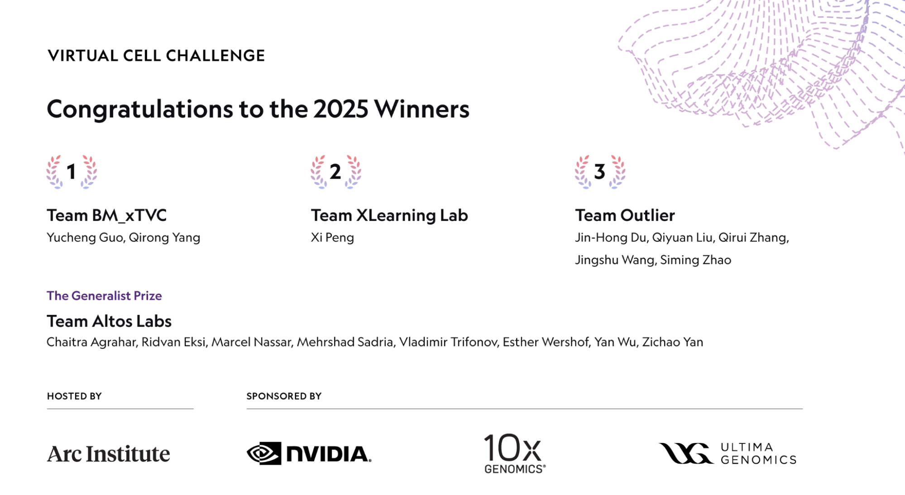
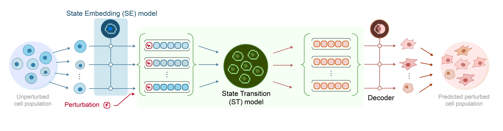

# The GPU Was Never the Bottleneck — Data Was

_What 1,200 teams at NVIDIA_

## Executive Summary

> [!callout]
> There's a recent AI challenge where the team with the biggest GPU and the biggest model didn't consistently win. The results announced at NeurIPS in December 2025 from the **Virtual Cell Challenge**, jointly hosted by Arc Institute, NVIDIA, 10x Genomics, and Ultima Genomics — over 5,000 registrants from 114 countries and more than 1,200 submitting teams — marked the largest cell-simulation contest in history. On a single cell line (H1 human embryonic stem cells), entrants were tested on **300,000 single-cell transcriptomes paired with 300 CRISPRi perturbations**, judged on three axes (PDS, DES, MAE) for how well they predict gene-expression shifts in unseen cell contexts. The overall winner was **BioMap Research (team BM_xTVC)**, a Hong Kong-headquartered bio-AI firm. A separate Generalist Prize went to **Altos Labs**'s "go-with-the-flow" flow-matching model out of the U.S. rejuvenation-research company.

> But the most consequential finding wasn't who won — it was _how_ they won. Arc Institute's Hani Goodarzi stated bluntly at the wrap-up: _"Pure end-to-end neural networks have yet to outperform hybrid models."_ The most-discussed solution, **TransPert** from the joint University of Chicago–Dartmouth–HKU "Outlier" team, reached the top of the PDS leaderboard not with a giant model but with classical statistics — pseudo-bulk summary stats and Wilcoxon-style tests. Even the BioMap winners publicly noted that _"purely AI-based approaches did not consistently outperform statistical baselines."_ In the same window, Ahlmann-Eltze et al. (_Nature Methods_, 2025) showed that five major single-cell foundation models — scGPT, scFoundation, GEARS and others — failed to consistently beat simple linear baselines. Arc Institute's wet-lab-curated 300K-cell dataset, Vevo Therapeutics's Tahoe-100M (50× larger than all prior public drug-perturbation data), the CZI Billion Cells Project, and the January 2026 Arc–Tahoe–Biohub 120M-cell pledge all point in the same direction: capital and attention are migrating **below** the model layer to data.

> Pebblous's read fits on one line. **"There's enough GPU. There's enough model. What's scarce is trustworthy training data and the domain inductive bias to use it."** The thesis we have argued for years in industrial AI — that data quality decides outcomes more than model architecture — was re-validated in a completely different domain by an objective contest. This report unpacks the event for global readers and traces what it implies for drug discovery, public bio-data infrastructure, and bio-AI startups outside the U.S. and China. This piece is the bio-AI chapter of the [Physical AI](/project/PhysicalAI/en/) series — where NVIDIA's ecosystem meets synthetic data and domain inductive bias.

<!-- stat-card -->
**300K × 300** — single cells × CRISPRi perturbations — Arc Institute · curated for the challenge

<!-- stat-card -->
**1,200+ teams / 114 countries** — 5,000+ registrants total — Arc Institute official wrap-up

<!-- stat-card -->
**~$2.6B** — Average cost to develop one new drug (10–15 yrs) — Tufts CSDD · the order-of-magnitude virtual cells aim to compress

## Defining the Virtual Cell — What AlphaFold Closed and What It Opened

The 2024 Nobel Prize in Chemistry going to AlphaFold 2's Demis Hassabis and John Jumper closed one era of computational biology. Predicting a protein's **static structure** moved into the "essentially solved" column after AlphaFold 3 (_Nature_, 2024) and RoseTTAFold All-Atom. The frontier promptly pivoted in the opposite direction — not the shape of one protein, but how an entire cell **dynamically responds** to a perturbation.

Virtual Cell is the attempt to simulate that dynamics inside a computer. The core question is simple: _"If we silence gene A in this cell, how does the expression of every other gene shift?"_ Roohani et al. (_Cell_, June 2025) framed this as _"a cellular Turing test, the equivalent of what protein structure prediction was for the molecular era."_ AlphaFold's problem (sequence → structure) was dimension N. The virtual cell's problem (perturbation → cell-state shift) is dimension N+1.

### 1.1. Why the Virtual Cell, Why Now

The Tufts Center for the Study of Drug Development pegs the average cost to develop one new drug at roughly **$2.6 billion over 10–15 years**. The biggest line item is the time spent in wet labs eliminating candidates that don't work — hypothesis pruning. The value proposition of the virtual cell is concrete: predict, in silico, how a compound will reshape a cell's expression profile, prioritize candidates before they hit the bench, and replace a meaningful slice of a multimillion-dollar CRISPRi screen with computation. The leverage is order-of-magnitude.

### 1.2. Two Adjacent Problems That Are Not the Same

It's worth disentangling two domains that get conflated. Protein structure prediction (the AlphaFold family) asks _"what 3D shape does this sequence fold into?"_ — a static problem. The virtual cell asks _"how does gene expression change when this cell is perturbed?"_ — a dynamic problem whose input is not a molecule but a **cell state**. That distinction colors every interpretation of the challenge results.

*▲ AlphaFold 2's architecture and accuracy vs. experiment. Once the _static_ 3D-structure problem was effectively solved, the field's gaze turned to the next dimension — the _dynamic_ state of the cell. | Source: [Wikimedia Commons (Jumper et al., Nature 2021)](https://commons.wikimedia.org/wiki/File:AlphaFold_2.png)*

## BioMap Took First — but the Most-Talked-About Solution Came from Elsewhere

In June 2025, Arc Institute published a launch commentary in _Cell_ (Roohani et al.) and released its in-house baseline model **STATE**. Arc led the organization; NVIDIA (compute and DGX Cloud credits), 10x Genomics (GEM-X Flex sequencing) and Ultima Genomics (UG 100 wafer sequencer) co-sponsored. Prizes: $100K for first place, an additional $100K Generalist Prize, $50K for second, $25K for third. Scoring combined three metrics: Perturbation Discrimination Score (PDS), Differential Expression Score (DES), and Mean Absolute Error (MAE).

### 2.1. BM_xTVC Was First — But TransPert Got the Press

Two facts often get conflated in coverage. **The overall winner is BioMap Research**'s BM_xTVC team. BioMap, Hong Kong–headquartered, operates what it describes as its 100B-parameter-plus **xTrimo foundation model**. But the most-discussed solution wasn't BioMap's — it was **TransPert**, from the joint University of Chicago–Dartmouth–HKU "Outlier" team, which placed at the top of the PDS leaderboard. A commentary by Liu et al. (_arXiv_ 2511.16954, accepted to the ICLR 2026 Workshop) makes clear that TransPert is built around classical statistics — _Wilcoxon test + pseudo-bulk profiles + distance-metric calibration_ — with a methods paper forthcoming. Two teams, two solutions, two different stories. Conflating them obscures the lesson.

*▲ Arc Institute's official 2025 results card. TransPert is the solution from third-place Team Outlier — a different team from first-place BM_xTVC. Sponsors: NVIDIA, 10x Genomics, Ultima Genomics. | Source: [Arc Institute · Virtual Cell Challenge 2025 Wrap-Up](https://arcinstitute.org/news/virtual-cell-challenge-2025-wrap-up)*

| Team / Solution | Affiliation | Core Approach | Result |
| --- | --- | --- | --- |
| BM_xTVC | BioMap Research (Hong Kong) | xTrimo foundation model (100B+, per BioMap) + statistical features + domain priors | Overall 1st |
| go-with-the-flow | Altos Labs (USA) | Flow-matching generative model + curated set of ~7M high-quality proprietary cells | Generalist Prize |
| TransPert | Team Outlier (UChicago · Dartmouth · HKU) | Wilcoxon test · pseudo-bulk · distance-metric calibration — classical-statistics core | Top of PDS leaderboard (co-top tier) |

Sources: Arc Institute Virtual Cell Challenge 2025 Wrap-Up · Liu et al., arXiv 2511.16954 · GEN Engineering News, Dec 2025

### 2.2. The MAE Hack and the Birth of the Generalist Prize

Midway through judging, Arc Institute realized the MAE metric was being gamed in ways it hadn't intended — some teams optimized for predicting mean expression, lowering MAE while losing PDS and DES. Goodarzi's framing: _"MAE was no longer influencing optimization."_ Before announcing winners, Arc spun up a separate **Generalist Prize**, a fresh round purely on generalization, which Altos Labs's flow-matching model took. The episode also crystallized something larger — Arc had quietly become the standards-setting body for the field. A single private nonprofit defined the dataset, the metrics, and the baseline model all in one stack.

*▲ Generalist Prize winner Team Altos Labs — their flow-matching generative model "go-with-the-flow" topped the generalization round. The decisive asset was ~7M proprietary, hand-curated cells. | Source: [Arc Institute · Virtual Cell Challenge 2025 Wrap-Up](https://arcinstitute.org/news/virtual-cell-challenge-2025-wrap-up)*

### 2.3. The Quote That Sets the Thesis

Arc Institute · Hani Goodarzi (NeurIPS 2025 wrap-up)
                            "Pure end-to-end neural networks are yet to outperform hybrid models. We have not yet reached the stage where simple scaling improves results. We need more thoughtful integration of biological priors."

BioMap's official commentary as the winning team carried the same tone: _"Purely AI-based approaches did not consistently outperform statistical baselines."_ When the team that just won publicly tells you the pure-AI approach isn't winning, that's the thesis — not the leaderboard order itself.

## Why Hybrid Won — You Have to Understand the Data Before the Model Works

Hybrid AI outperforming large foundation models wasn't a one-off challenge artifact. In the same year, Ahlmann-Eltze, Huber and Anders published an external benchmark in _Nature Methods_ (DOI 10.1038/s41592-025-02772-6) showing that five major single-cell foundation models — scGPT, scFoundation, GEARS, and others — **failed to consistently beat a simple linear ("no-change") baseline** for single- and double-gene perturbation prediction. The challenge results point in exactly the same direction as this academic finding.

### 3.1. The Intrinsic Noise of scRNA-seq Data

Single-cell RNA-seq data carries four kinds of intrinsic noise. **Dropout**: genes that are genuinely expressed but read as zero because the assay missed them. **Batch effects**: systematic signatures baked in by the plate, sequencer, or experiment date. **Cell-type imbalance**: some cell types appear by the thousands, others by the tens. And a weak perturbation signal at the gene level — Replogle et al. (_Cell_, 2022) reported that, in genome-scale Perturb-seq, **only 41% of gene perturbations produce a measurable transcriptome-wide signal**. For the other 59%, the signal isn't in the data at all.

On data like this, more parameters don't help. Wei et al.'s scPerturBench (_Nature Methods_, 2025, DOI 10.1038/s41592-025-02980-0) reached the same conclusion across 27 methods, 29 datasets and six metrics — what matters for generalization is _"leveraging prior knowledge through cellular-context embeddings."_ Domain inductive bias consistently beats parameter count.

### 3.2. Pure Deep Learning vs. Hybrid — Structurally Different Pipelines

Side by side, the reason the challenge ended the way it did becomes obvious. The fork is whether the pipeline carries explicit domain priors — guardrails that stop the model from treating technical noise like dropout and batch effects as signal. All three winning teams chose the latter architecture; foundation models on their own slid down the leaderboard.

#### Pure end-to-end deep learning

- Input → giant transformer → output
- Absorbs training-data noise wholesale
- Risk: model learns dropout and batch effects as "signal"
- Expectation that scaling solves it — the challenge refuted that

#### Hybrid AI

- Statistical features (Wilcoxon, gene-gene correlation, pseudo-bulk) → domain prior
- Deep learning handles residuals and generalization
- Stable generalization on smaller datasets
- The shared structure across BioMap, Altos Labs, and Team Outlier

The near-simultaneous push to standardize evaluation — Altos Labs's PerturBench (Wu et al., _arXiv_ 2408.10609) and Arc Institute's Cell-Eval — falls out of the same premise. Both frameworks assume that you can't get a model to work without first understanding what the data actually contains. The benchmarks themselves are being designed to force domain inductive bias into the evaluation surface.

> [!callout]
> This pattern is not unique to biology. Medical imaging (small domain datasets beating ImageNet-pretrained models), materials science (DFT priors stacked above ML models), climate modeling (physics-informed neural networks baking conservation laws into the loss) — all show the same shape. **Where data is noisy and unrefined, domain inductive bias beats model scale, consistently.**

## The Real Asset Behind the Results Wasn't GPUs or Models

The most-overlooked fact of the challenge is that the infrastructure asset that decided the outcome wasn't GPUs and it wasn't models — it was the **300,000 single cells × 300 CRISPRi perturbations** dataset itself. Arc Institute produced that data from scratch in its own wet lab specifically for the challenge. Picking a single cell line — **H1 human embryonic stem cells (H1 hESC)** — was not incidental either. It sits deliberately **outside** the pretraining distributions of scGPT, scFoundation and their peers, forcing cross-cell-line generalization rather than memorization.

### 4.1. Arc Institute's Data Operating System

What Arc operationalized for the challenge was less a dataset than a **wet-lab → single-cell measurement → QC → split-and-publish** pipeline. 10x Genomics GEM-X Flex and Ultima Genomics UG 100 wafer sequencing standardized measurement. The 300 CRISPRi perturbations were curated to balance strong and weak perturbation signals deliberately. PDS / DES / MAE metric definitions and the STATE baseline model all came out of the same organization. _This is the first time a private nonprofit — not the NIH — defined the evaluation rules for single-cell perturbation modeling._

*▲ Arc Institute's STATE model — an unperturbed cell population is fed a perturbation signal, then passed through State Embedding, State Transition, and a Decoder to predict the perturbed cell distribution. It served as the challenge baseline and the de facto starting point for evaluation standards. | Source: [Arc Institute · STATE: First Virtual Cell Model](https://arcinstitute.org/news/virtual-cell-model-state)*

### 4.2. The Data Ceiling Is Rising Fast

The challenge dataset is only a starting point. Quantitative evidence is accumulating that capital and attention are migrating away from the model layer and **below it, toward data infrastructure**.

> [!callout]
> **Data as the new power layer — quantitative evidence**

- **Tahoe-100M** (Vevo Therapeutics, Feb 2025 bioRxiv): 100M cells × 50 cancer cell lines × 1,100 small molecules — _"50× larger than all public drug-perturbed data combined"_
- **CZI CELLxGENE**: 93M+ unique cells published. **Billion Cells Project** underway
- **Arc × Tahoe × Biohub partnership** (Jan 12, 2026): multi-year pledge of **120M cells × 225,000 drug–patient interactions**
- Not one company or one institute — **nonprofits, startups, and foundations together** are concentrating capital on data-curation infrastructure

The hardware tier is consolidating too. NVIDIA's **Evo 2**, co-announced with Arc Institute (7B + 40B parameters, 9.3T nucleotides, 2,000+ H100 GPUs in training, 1M-token context — _Nature_, DOI 10.1038/s41586-026-10176-5), is the clearest signal that NVIDIA has repositioned from compute vendor to a _vertically integrated company bundling domain partnerships, platforms, and H100 infrastructure together_. The **$1B AI Co-Innovation Lab with Eli Lilly announced at JPM Healthcare 2026** sits in the same arc.

*▲ NVIDIA × Arc Institute's Evo 2 — DNA, RNA, and proteins handled jointly inside a single model. Training on 9.3T nucleotides with 2,000+ H100 GPUs marks NVIDIA's repositioning from compute vendor to a domain-vertical platform. | Source: [NVIDIA Blog · Evo 2 Biomolecular AI](https://blogs.nvidia.com/blog/evo-2-biomolecular-ai/)*

The Pebblous thesis from industrial AI — _"the real competitive moat is the data and simulation-integration layer beneath the model, not the model itself"_ — operates with the same shape in biology. Where Pebblous integrates wet measurement (factory sensors, robot telemetry) with synthetic simulation in industrial AI, Arc Institute integrates wet-lab measurement with computation. The architecture is isomorphic.

## The Bio-AI Land Grab — Who's Betting Where

The Virtual Cell Challenge didn't happen in a vacuum. The 2024–2026 bio-AI market is mid-restructuring — capital concentrating not on "one good model" but on **data + clinical full-stacks**. The market also remains structurally fragmented: Isomorphic Labs is the standalone leader at 3.2% share, and the top five firms combined hold only 11.8%. There's room.

### 5.1. Player Map

Pulled from the two stages where the field's leaders surfaced in concentration — the Virtual Cell Challenge wrap-up (Dec 2025) and JPM Healthcare 2026 (Jan 2026) — these are the eight companies that mattered. They're spread across three regions (U.S., U.K., Hong Kong), and their core bets cluster into five buckets: foundation models, proprietary wet-lab data, phenotypic screening, clinical pipelines, and data infrastructure. **No single company holds all five** — which is the structural reason new entrants still have a path in.

| Company | HQ | Core Bet | 2025–2026 Activity |
| --- | --- | --- | --- |
| BioMap Research | Hong Kong (HKIC backing) | xTrimo foundation model · single-cell · protein | Virtual Cell Challenge overall winner |
| Altos Labs | USA (Yuri Milner, Jeff Bezos) | Cellular rejuvenation · 7M proprietary high-quality cells · PerturBench | $3B initial capital, Virtual Cell Generalist Prize |
| Recursion | USA | Phenotypic screening · proprietary phenotypic dataset · Bayer partnership | Bayer × Recursion $1.5B deal |
| Isomorphic Labs | UK (DeepMind spin-out) | AlphaFold successor · Eli Lilly collaboration · clinical-stage entry | Lilly × Isomorphic ~$1.75B cumulative, first human trials |
| Xaira Therapeutics | USA | Full-stack AI drug discovery · ARCH Venture's largest-ever launch round | Launched 2024, $1B |
| Vevo Therapeutics · Tahoe Bio | USA | Released Tahoe-100M · Arc & Biohub partnership · data infrastructure | 120M cell × 225K drug-patient pledge (Jan 2026) |
| Insilico Medicine | Hong Kong | End-to-end AI drug discovery · TNIK inhibitor | Dec 2025 Hong Kong IPO at $337M, first clinical efficacy validation |
| Modella AI | USA | Pathology · multi-modal clinical AI | Jan 2026 acquired by AstraZeneca |

****

Sources: FierceBiotech JPM26 Tracker · PitchBook · GEN Engineering News · individual company press releases

### 5.2. Capital Is Flowing to Full-Stacks, Not Models

Compile the major rounds, partnerships, and acquisitions from 2024 through early 2026 and the direction of capital becomes unambiguous. It's not _"one good model"_; it's **proprietary wet lab + data infrastructure + clinical pipeline** in one stack. Once single rounds crossed the billion-dollar mark, big pharma stopped treating AI as a tool and started treating it as the R&D model itself.

$3B

Altos Labs initial capital

$2.76B

Novo Nordisk × Valo Health

$1.75B

Eli Lilly × Isomorphic Labs

$1.5B

Bayer × Recursion

$1B

Xaira launch round

$1B

Eli Lilly × NVIDIA AI Lab

~$6.33B

Altos Labs valuation

M&A

AstraZeneca → Modella AI

The macro engine is the **$236B patent cliff over 2025–2030**. Big pharma is no longer evaluating whether to "add AI" to drug discovery — it is pivoting strategically to redesign R&D as AI-native, even _buying AI companies outright_ (AstraZeneca → Modella AI being the most legible example). NVIDIA BioNeMo is the platform that bundles compute, models and domain partnerships into a single vendor; biology became one of NVIDIA's headline verticals at both GTC 2025 and GTC 2026.

## Why Pebblous Is Watching This Closely — Same Data OS, Different Domain

The Virtual Cell Challenge re-validated, in a completely different domain through an objective contest, the core thesis Pebblous has been making in industrial AI: _data, not models, decides outcomes_. The decision that mattered most for the leaderboard wasn't Arc Institute's choice of GPU or model architecture — it was the choice to **produce its own 300,000 single-cell × 300 CRISPRi dataset in-house, in a wet lab**. That mirrors precisely what Pebblous has been arguing in industrial / Physical AI.

### Where Business Meets Technology

Pebblous's three core modules map structurally onto the bio-data problems the challenge exposed. **DataClinic** (data quality diagnostics) treats scRNA-seq's batch effects, dropout, and cell-type imbalance with the same methodology as time-series sensor noise. **DataGreenhouse** (data OS) automates the AI-Ready transformation of industrial data using the same curation structure Arc, Tahoe, and CZI run on single-cell atlases. **PebbloSim** (simulation–measurement integration) connects synthetic and measured data in both directions, exactly as the in-silico cell ↔ wet-lab CRISPRi screen loop demands.

### The Data-Quality Lens

The challenge's core finding — _"deep learning fails to consistently beat simple baselines"_ — is a signal about **data limits, not model limits**. scRNA-seq's dropout, batch effects, cell-type imbalance, and weak perturbation signal (Replogle 2022 — only 41% measurable) are structurally the same problems Pebblous has diagnosed repeatedly in industrial data: missingness, outliers, label noise, and domain shift. The winning teams combined deep learning with classical statistical features for the simple reason that, in an unrefined data regime, domain inductive bias beats model scale. The proposition _"data quality determines the internal consistency of a model's representations"_ just got strong external evidence from biology.

### Practical Signals for Customers and Partners

Three direct signals follow. First, for **pharma and biotech R&D decision-makers**: at $2.6B average drug-development cost over 10–15 years, quality diagnostics and refinement of in-house single-cell and multi-omics data should precede model selection. This is a direct fit for DataClinic. Second, for **university and public bio-data centers**: standardization and curation demand at large-scale public bio-data initiatives (the Korean national bio-big-data program, K-BIOBANK, KOBIC; equivalent EU and U.S. efforts) is aligning rapidly. KOBIC's Dr. Jeon Jong-Bum stated explicitly in July 2025 that _"AI competitiveness, whether generative or predictive, is about high-quality big data"_ — a policy-level signal. Third, for **bio-AI startups** outside the U.S. and China: companies without their own wet labs need data-infrastructure partnerships to compete globally. That is the structural opening.

### Positioning and Open Questions

This report naturally extends Pebblous's positioning as a **potential partner for a bio-domain data OS**. Not through a sales pitch — through objective analysis of an objective event, demonstrating that the data-quality philosophy validated in industrial AI applies one-to-one in biology. Few firms can analyze the technical trajectories of NVIDIA × Arc × BioMap × Altos with this depth from outside the U.S. and China; doing it publicly signals that Pebblous is a company capable of participating in bio-AI discourse on technical and objective terms.

> [!callout]
> One line: **"There's enough GPU. There's enough model. What's scarce is trustworthy training data. Pebblous fills that gap — in manufacturing, in robotics, and now in cells."**

## What Comes After GPUs and Models

The clearest sign that the Virtual Cell Challenge isn't a one-off but a paradigm shift is the **2026 next-round preview**. Roohani et al.'s _Cell_ (June 2025) commentary makes clear the evaluation will expand to combinatorial perturbations (silencing multiple genes simultaneously) and cross-cell-type generalization. The data substrate likely draws from the 120M cells × 225,000 drug–patient interactions Arc–Tahoe–Biohub pledged in January 2026. Cell-Eval (Arc) and PerturBench (Altos) will openly compete to set evaluation standards.

### 7.1. 2025–2026 Timeline

From Arc Institute's challenge launch commentary to JPM Healthcare 2026 to the second-round preview — nine months of compressed events show academia, industry, and capital aligning on the same data layer. The four turning points below trace that arc.

2025-06

Cell challenge commentary + STATE baseline released

2025-12

NeurIPS challenge results — BioMap 1st · Altos Generalist Prize

2026-01 JPM

Arc–Tahoe–Biohub 120M cells + Lilly–NVIDIA $1B AI Lab · AstraZeneca → Modella AI

2026 (preview)

Round 2 — combinatorial perturbations + cross-cell-type generalization

### 7.2. Where the Industrial Gaps Become Entry Points

Outside the U.S. and China, the single-cell and virtual-cell layer is the region of largest industrial vacuum — and therefore the largest entry opportunity. In Korea, for instance, cumulative bio-AI drug-discovery investment is around **KRW 600B (~$410M)** across 52 companies and 88 partnerships per the Korea Pharmaceutical and Bio-Pharma Manufacturers Association, with combined H2-2025 government allocation at roughly KRW 55B (~$38M) across science and health ministries. _Yet no commercial single-cell foundation model has yet been built by a Korean company._ Most activity centers on small-molecule discovery. At the same time, KOBIC's policy statement that _"AI competitiveness, generative or predictive, depends on high-quality big data"_ (July 2025) is a deliberate alignment of public infrastructure with the data-first thesis. The Korean delegation's presentation on single-cell omics and AI-based gene regulatory network (GRN) modeling at the November 2025 CJK Bioinformatics Symposium points in the same direction. Similar dynamics — limited proprietary wet-lab data, strong public-sector data infrastructure ambitions, small-molecule legacy — apply across most non-U.S. / non-China markets.

### 7.3. Action Guide by Role

**For public-data policymakers.** The next step for national bio-big-data programs and curation-standardization efforts isn't "more data" — it's quantitative evaluation metrics for AI-readiness. Studying how Arc Institute's Cell-Eval standard works is worth the time.

**For bio R&D decision-makers.** Diagnostics and refinement of your existing single-cell and multi-omics data should precede model selection. Whether you adopt NVIDIA BioNeMo, BioMap's xTrimo, or DeepMind / Isomorphic — if the data hasn't controlled for domain noise, the result is the same: failure to consistently beat a simple baseline.

**For AI practitioners.** Rediscover the value of domain inductive bias, classical statistical features, and hybrid architectures. Foundation models start to outperform only after data quality clears a threshold. Until then, a Wilcoxon test beats a transformer.

> [!callout]
> The next five years of bio-AI won't be a race for **"who has the largest model"** — it will be a race for **"who has the most trustworthy data."** The Virtual Cell Challenge was the first objective measurement of that pivot.

## References

### Primary Sources (Arc Institute / NVIDIA / Official Announcements)

- 1.Arc Institute. "[Virtual Cell Challenge 2025 Wrap-Up: Winners and Reflections](https://arcinstitute.org/news/virtual-cell-challenge-2025-wrap-up)." Dec 2025.
- 2.Roohani, Y. H. et al. "[Virtual Cell Challenge: Toward a Turing test for the virtual cell](https://doi.org/10.1016/j.cell.2025.06.008)." _Cell_ 188(13): 3370–3374, 2025.
- 3.Arc Institute. "[STATE: First Virtual Cell Model](https://arcinstitute.org/news/virtual-cell-model-state)." June 2025.
- 4.NVIDIA Blog. "[Evo 2 Biomolecular AI](https://blogs.nvidia.com/blog/evo-2-biomolecular-ai/)." Feb 2025.
- 5.Tahoe Bio. "Tahoe-100M release." Feb 2025.
- 6.Tahoe Bio. "[Tahoe × Arc × Biohub Partnership](https://www.tahoebio.ai/news/tahoe-arc-and-biohub-partnership)." Jan 12, 2026.

### Academic Papers (Tier 1–2)

- 7.Ahlmann-Eltze, C., Huber, W., Anders, S. "Deep-learning-based gene perturbation effect prediction does not yet outperform simple linear baselines." _Nature Methods_ 22: 1657–1661, 2025. DOI 10.1038/s41592-025-02772-6.
- 8.Liu, Q. et al. "[Effects of Distance Metrics and Scaling on the Perturbation Discrimination Score](https://arxiv.org/abs/2511.16954)." _arXiv_ 2511.16954, 2025. (ICLR 2026 Workshop)
- 9.Brixi, G. et al. "Genome modeling and design across all domains of life with Evo 2." _Nature_, 2025/2026. DOI 10.1038/s41586-026-10176-5.
- 10.Cui, H. et al. "scGPT: foundation model for single-cell multi-omics." _Nature Methods_ 21: 1470–1480, 2024. DOI 10.1038/s41592-024-02201-0.
- 11.Theodoris, C. V. et al. "Transfer learning enables predictions in network biology (Geneformer)." _Nature_ 618: 616–624, 2023. DOI 10.1038/s41586-023-06139-9.
- 12.Abramson, J. et al. "Accurate structure prediction of biomolecular interactions with AlphaFold 3." _Nature_ 630: 493–500, 2024. DOI 10.1038/s41586-024-07487-w.
- 13.Replogle, J. M. et al. "Mapping information-rich genotype-phenotype landscapes with genome-scale Perturb-seq." _Cell_ 185(14): 2559–2575, 2022. DOI 10.1016/j.cell.2022.05.013.
- 14.Wei et al. "Benchmarking algorithms for generalizable single-cell perturbation response prediction (scPerturBench)." _Nature Methods_, 2025. DOI 10.1038/s41592-025-02980-0.
- 15.Hao, M. et al. "scFoundation: Large-scale foundation model on single-cell transcriptomics." _Nature Methods_ 21: 1481–1491, 2024. DOI 10.1038/s41592-024-02305-7.
- 16.Wu, Y. et al. (Altos Labs). "[PerturBench: Benchmarking ML Models for Cellular Perturbation Analysis](https://arxiv.org/abs/2408.10609)." _arXiv_ 2408.10609, 2024.

### Industry Press / Market Data

- 17.GEN Engineering News. "[NeurIPS 2025: Altos Labs Wins Generalist Prize at Arc's Virtual Cell Challenge](https://www.genengnews.com/topics/artificial-intelligence/neurips-2025-altos-labs-wins-generalist-prize-at-arcs-virtual-cell-challenge/)." Dec 2025.
- 18.GEN Engineering News. "[NeurIPS 2025: Biology's Transformer Moment](https://www.genengnews.com/topics/artificial-intelligence/neurips-2025-biologys-transformer-moment/)." Dec 2025.
- 19.FierceBiotech. "[Fierce Biotech's JPM26 Tracker](https://www.fiercebiotech.com/biotech/fierce-biotechs-jpm26-tracker-day-1)." Jan 2026.
- 20.PitchBook. "[Q1 2026 Takeaways from the J.P. Morgan Healthcare Conference](https://pitchbook.com/news/reports/q1-2026-pitchbook-analyst-note-takeaways-from-the-j-p-morgan-healthcare-conference)." Jan 2026.
- 21.Fortune. "DeepMind / Isomorphic Labs: AI Drug Discovery to First Human Trials." July 6, 2025.
- 22.BioPharmaTrend. "[Arc Institute Launches Virtual Cell Challenge](https://www.biopharmatrend.com/post/1307-arc-institute-launches-virtual-cell-challenge/)." 2025.
- 23.GeneOnline. "[NVIDIA GTC 2025: BioMap's xTrimo](https://www.geneonline.com/nvidia-gtc-2025-biomaps-xtrimo-the-ai-model-thats-changing-biotech-and-drug-discovery/)." 2025.

### Regional / Korean Sources

- 24.KOBIC. "[Korean National Bio Big Data Initiative](https://www.kobic.re.kr/kobic/res/ngp)." 2025.
- 25.KOBIC News. "[Korean Delegation at CJK Bioinformatics Symposium (single-cell omics)](https://www.kobic.re.kr/kobic/notiact/kobicians/go_detail?id=138)." Nov 2025.
- 26.Korea Pharmaceutical and Bio-Pharma Manufacturers Association. "[Status of AI Drug Discovery Industry (KRW 600B cumulative, 52 firms, 88 partnerships)](https://www.biotimes.co.kr/news/articleView.html?idxno=11877)." 2025.
- 27.Korean Ministry of Health / Science and ICT. "Training 1,000+ AI diagnostic, predictive, and drug-discovery talents over 5 years." Aug 2025.

<!-- stat-card -->
**📚 Physical AI Series** — This article is part of the [Physical AI](/project/PhysicalAI/en/) series curated by Pebblous — how robots come to see, understand, and act, read together across data, simulation, models, and industry landscape.
