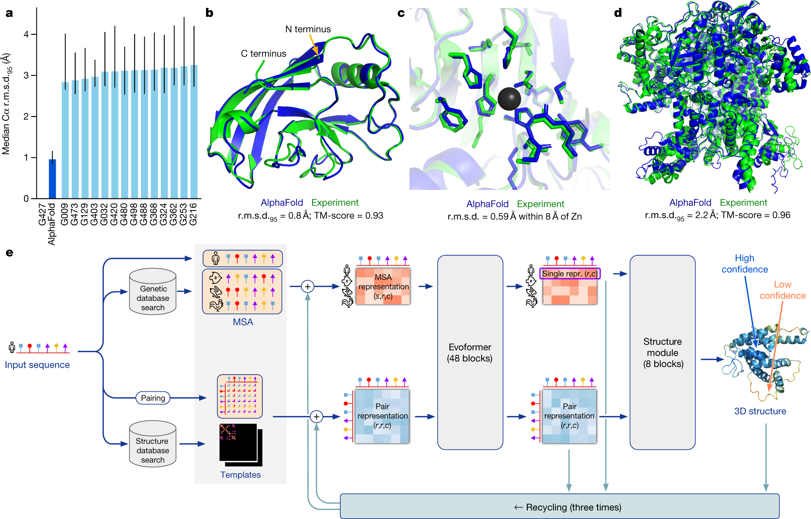
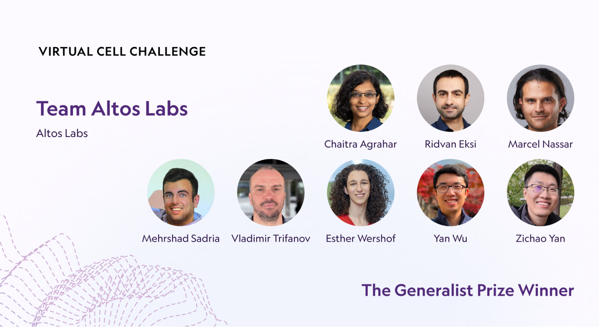
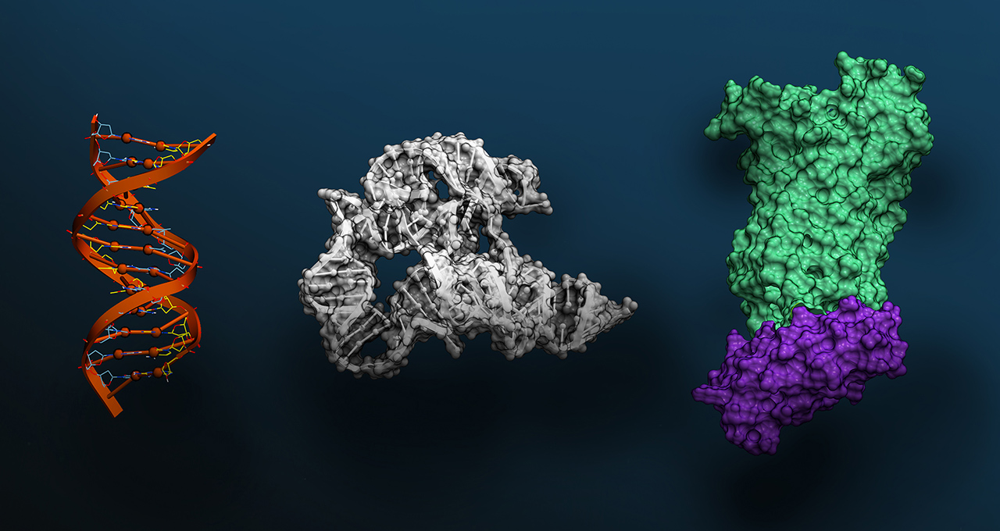

# GPU는 충분했다, 부족한 건 데이터였다

_NVIDIA 가상 세포 챌린지에서 1,200팀이 풀고 나서야 보인 — 바이오 AI의 진짜 변곡점_

## Executive Summary

> [!callout]
> 가장 큰 GPU와 가장 큰 모델을 가진 팀이 일관되게 이기지 못한 챌린지가 있다. 2025년 12월 NeurIPS에서 결과가 공개된 Arc Institute × NVIDIA × 10x Genomics × Ultima Genomics 공동 주최 **Virtual Cell Challenge** — 114개국 5,000명 이상이 등록하고 1,200팀 이상이 제출한 사상 최대 규모의 세포 시뮬레이션 경쟁이다. 단일 셀라인(H1 인간 배아 줄기세포) **30만 single-cell transcriptome × 300 CRISPRi perturbation** 데이터 위에서, 새로운 cell context에 적용했을 때 유전자 발현 변화를 얼마나 잘 예측하느냐를 PDS·DES·MAE 세 축으로 평가했다. 1위는 중국계 바이오 AI 기업 **BioMap Research(BM_xTVC 팀)**, 별도 Generalist Prize는 미국 회춘 연구 기업 **Altos Labs**의 "go-with-the-flow" flow-matching 모델에게 돌아갔다.

> 그러나 챌린지의 가장 중요한 결과는 누가 1등을 했느냐가 아니라 "어떻게" 그 순위가 만들어졌느냐다. Arc Institute의 핵심 연구자 Hani Goodarzi는 결과 발표에서 _"순수 end-to-end 신경망은 아직 하이브리드 모델을 능가하지 못했다"_고 명시했다. 가장 회자된 솔루션 **TransPert**(시카고대·다트머스·홍콩대 합동팀 "Outlier")는 거대 모델이 아닌 pseudo-bulk 요약 통계와 Wilcoxon test 같은 고전 통계 framework로 PDS 최상위권에 들었다. 1위 BioMap 팀조차 공식 코멘트로 "순수 AI 접근은 통계 베이스라인을 일관되게 넘지 못했다"는 사실을 공유했다. 동시기 _Nature Methods_에 게재된 Ahlmann-Eltze et al.(2025)은 scGPT·scFoundation·GEARS 등 거대 single-cell foundation model 다섯 개가 단순 선형 베이스라인을 일관되게 이기지 못함을 보였다. Arc Institute가 wet lab에서 직접 큐레이션한 30만 셀 데이터셋, Vevo Therapeutics가 공개한 Tahoe-100M(기존 공개 약물 perturbation 데이터의 50배), CZI Billion Cells Project, 2026-01 Arc–Tahoe–Biohub의 120M cell 신규 약속은 모두 "모델 위가 아니라 그 아래 데이터 레이어"로 자본·관심이 이동하고 있음을 보여준다.

> 페블러스 관점의 발견은 단 한 줄로 요약된다. **"GPU도 모델도 충분하다. 부족한 것은 신뢰할 수 있는 학습 데이터와 도메인 inductive bias다."** 페블러스가 산업 AI에서 일관되게 주장해온 "모델보다 데이터 품질이 결과를 결정한다"는 명제가, 바이오라는 전혀 다른 도메인의 객관적 챌린지에서 재입증된 사건이다. 본 보고서는 이 사건을 한국 독자에게 풀어 설명하고, K-바이오 AI·정부 빅데이터 사업·국내 제약 R&D에 시사하는 바를 짚는다. 이 글은 [피지컬 AI](/project/PhysicalAI/ko/) 시리즈의 바이오 AI 편으로, NVIDIA 생태계와 합성데이터·도메인 inductive bias의 인접 지점을 본다.

<!-- stat-card -->
**30만 × 300** — single-cell × CRISPRi perturbation — Arc Institute · 챌린지 전용 큐레이션

<!-- stat-card -->
**114개국 1,200팀+** — 5,000명 이상이 등록한 챌린지 규모 — Arc Institute 공식 wrap-up

<!-- stat-card -->
**~$2.6B** — 신약 1개 평균 개발 비용 (10–15년) — Tufts CSDD · 가상 세포가 줄이려는 자릿수

## 가상 세포가 뭔지부터 — AlphaFold가 끝낸 것과 시작한 것

2024년 노벨 화학상이 AlphaFold 2 개발자 Demis Hassabis·John Jumper에게 돌아간 사건은 하나의 시대를 마감했다. 단백질의 **정적 구조**를 풀어내는 일은, AlphaFold 3(_Nature_ 2024)와 RoseTTAFold All-Atom의 등장 이후 사실상 "해결된 문제"의 영역으로 옮겨갔다. 그러나 같은 시기 학계가 시선을 돌린 곳은 정반대 방향이었다 — 단백질 한 개의 모양이 아니라, 세포 전체가 외부 자극에 어떻게 **동적으로 반응**하는지를 예측하는 일.

Virtual Cell(가상 세포)은 이 동역학을 컴퓨터 안에서 시뮬레이션하려는 시도다. 핵심 질문은 단순하다 — _"이 세포에서 유전자 A를 끄면, 다른 모든 유전자의 발현은 어떻게 변하는가?"_ Roohani et al.(_Cell_ 2025-06)의 commentary는 이 작업을 *"단백질 구조 예측의 Turing test에 해당하는 세포의 Turing test"*로 위치시켰다. AlphaFold가 한 일(서열 → 구조)이 차원 N의 문제였다면, Virtual Cell이 하는 일(perturbation → cell-state 변화)은 차원 N+1의 문제다.

### 1.1. 왜 지금 가상 세포인가

Tufts Center for the Study of Drug Development 기준 평균 신약 1개 개발 비용은 약 **26억 달러(약 $2.6B), 10–15년**이다. 이 비용 구조의 가장 큰 항목은 wet lab에서 실패한 후보 물질을 발견하는 시간 — 즉 hypothesis pruning 단계다. Virtual Cell의 잠재 가치는 명확하다. _"이 화합물이 세포에 어떤 변화를 일으킬지"_를 컴퓨터로 미리 예측해 임상 전 후보 우선순위를 결정하면, 거대한 wet lab CRISPRi screen의 상당 부분을 in-silico로 대체할 수 있다. 이는 신약 개발의 자릿수를 바꾸는 잠재력이다.

### 1.2. 이름은 비슷하지만 본질이 다른 두 영역

헷갈리기 쉬운 분류부터 정리한다. 단백질 구조 예측(AlphaFold 계열)은 _"이 서열은 어떤 3D 형태인가"_를 묻는 정적 문제다. Virtual Cell은 _"이 세포에 자극을 가했을 때 유전자 발현이 어떻게 변하는가"_를 묻는 동적 문제이며, 입력 자체가 분자가 아닌 **세포의 상태(state)**다. 이 차이가 챌린지 결과의 모든 해석을 좌우한다.

*▲ AlphaFold 2의 네트워크 구조와 실험값 대비 예측 정확도. 단백질의 _정적_ 3D 구조 영역이 사실상 풀린 다음, 학계가 시선을 돌린 곳이 세포의 _동적_ 상태 — Virtual Cell이다. | Source: [Wikimedia Commons (Jumper et al., Nature 2021)](https://commons.wikimedia.org/wiki/File:AlphaFold_2.png)*

## 1위는 BioMap, 가장 회자된 솔루션은 따로 있었다

2025년 6월 Arc Institute는 _Cell_에 챌린지 출범을 알리는 commentary(Roohani et al.)를 게재하고, 같은 시기 자체 baseline 모델 **STATE**를 공개했다. 후원은 Arc Institute가 주관하고 NVIDIA(컴퓨트·DGX Cloud credits), 10x Genomics(GEM-X Flex 시퀀싱), Ultima Genomics(UG 100 wafer sequencer)가 공동으로 맡았다. 상금은 1위 $100K + Generalist Prize $100K + 2등 $50K + 3등 $25K. 평가는 세 지표 — Perturbation Discrimination Score(PDS), Differential Expression Score(DES), Mean Absolute Error(MAE) — 의 종합으로 이루어졌다.

### 2.1. 1위 BM_xTVC ≠ 가장 회자된 TransPert

먼저 한국 보도에서 자주 헷갈리는 두 가지 사실을 정리한다. **1위는 BioMap Research**의 BM_xTVC 팀이다. BioMap은 자사 발표 기준 100B+ 파라미터의 **xTrimo foundation model**을 운영하는 중국계(홍콩 본사) 바이오 AI 회사다. 그러나 챌린지 후 가장 회자된 솔루션은 1위 BioMap의 것이 아니라, 시카고대·다트머스·홍콩대 합동팀 **"Outlier"**가 PDS 최상위권에 올린 **TransPert** framework다. Liu et al.(_arXiv_ 2511.16954, ICLR 2026 Workshop)이 공개한 평가 메트릭 commentary는 TransPert가 _Wilcoxon test + pseudo-bulk profiles + 거리 metric 보정_이라는 고전 통계 framework 중심으로 구성되었음을 명시한다. 본격 방법론 논문은 forthcoming이다. 두 팀, 두 솔루션을 분리해서 보지 않으면 챌린지 해석이 어긋난다.

*▲ Arc Institute가 공개한 2025 챌린지 공식 시상 그래픽. TransPert는 3위 Team Outlier의 솔루션이며, 1위 BM_xTVC와는 별개 팀이다. 후원사는 NVIDIA·10x Genomics·Ultima Genomics. | Source: [Arc Institute · Virtual Cell Challenge 2025 Wrap-Up](https://arcinstitute.org/news/virtual-cell-challenge-2025-wrap-up)*

| 팀 / 솔루션 | 소속 | 핵심 접근 | 결과 |
| --- | --- | --- | --- |
| BM_xTVC | BioMap Research (홍콩) | xTrimo foundation model(100B+ 자사 발표) + 통계 features · 도메인 priors 결합 | 종합 1위 |
| go-with-the-flow | Altos Labs (미국) | Flow-matching generative model + 약 7M 자체 고품질 cells 큐레이션 | Generalist Prize |
| TransPert | Team Outlier (시카고대·다트머스·홍콩대) | Wilcoxon test · pseudo-bulk · 거리 metric 보정 — 고전 통계 framework 중심 | PDS 최상위권 (공동 상위권) |

출처: Arc Institute Virtual Cell Challenge 2025 Wrap-Up · Liu et al. arXiv 2511.16954 · GEN Engineering News 2025-12

### 2.2. MAE 우회 발견과 Generalist Prize의 탄생

평가 중반 Arc Institute는 MAE 지표가 의도와 다르게 작동한다는 사실을 발견했다. 일부 팀이 평균 발현 예측에 최적화해 MAE를 낮추면서 PDS·DES를 손해 보는 패턴이 나타난 것이다. Goodarzi의 표현으로는 _"MAE was no longer influencing optimization"_. Arc는 결과 발표 전 별도 **Generalist Prize**(generalization 능력 평가 별도 라운드)를 신설했고, Altos Labs의 flow-matching 모델이 이를 가져갔다. 이 사건은 챌린지 운영 권력 자체가 새로운 표준화 주체로서의 Arc Institute를 부각시켰다 — 데이터·평가 메트릭·STATE 베이스라인 모델까지 단일 사립 비영리 기관이 일관되게 정의한 것이다.

*▲ Generalist Prize 수상팀 Altos Labs — flow-matching 생성 모델 "go-with-the-flow"로 일반화 능력 평가 라운드를 가져갔다. 약 7M 자체 큐레이션 cells가 핵심 자산이었다. | Source: [Arc Institute · Virtual Cell Challenge 2025 Wrap-Up](https://arcinstitute.org/news/virtual-cell-challenge-2025-wrap-up)*

### 2.3. 핵심 인용 — Goodarzi의 결론

Arc Institute · Hani Goodarzi (NeurIPS 2025 wrap-up)
                            "Pure end-to-end neural networks are yet to outperform hybrid models. We have not yet reached the stage where simple scaling improves results. We need more thoughtful integration of biological priors."

(의역: 순수 end-to-end 신경망은 아직 하이브리드 모델을 능가하지 못한다. 단순한 규모 확장만으로 결과가 좋아지는 단계에는 도달하지 못했다. 생물학적 prior를 더 사려깊게 통합해야 한다.)

BioMap 팀의 공식 코멘트도 같은 결을 가졌다 — _"Purely AI-based approaches did not consistently outperform statistical baselines."_ 1위 팀이 직접 "순수 AI만으로는 통계 베이스라인을 일관되게 이기지 못한다"고 인정한 셈이다. 이것이 챌린지 결과의 진짜 thesis다.

## 왜 하이브리드가 이겼나 — 데이터의 본질을 이해해야 모델이 작동한다

하이브리드 AI가 거대 foundation model을 능가한 사실은 챌린지 단발의 이벤트가 아니다. 2025년 같은 해 Ahlmann-Eltze, Huber, Anders가 _Nature Methods_에 게재한 외부 검증(DOI 10.1038/s41592-025-02772-6)은 scGPT·scFoundation·GEARS 등 다섯 개 거대 single-cell foundation model이 단일 및 이중 perturbation 예측에서 **단순 선형 베이스라인("no-change" baseline)을 일관되게 넘지 못함**을 보였다. 챌린지 결과는 이 학술적 발견과 정확히 같은 방향을 가리킨다.

### 3.1. scRNA-seq 데이터의 본질적 노이즈

Single-cell RNA-seq 데이터에는 네 가지 본질적 노이즈가 있다. 첫째, **dropout** — 실제로 발현되는 유전자가 기술적 한계로 0으로 측정되는 현상. 둘째, **batch effect** — 실험 배치·플레이트·시퀀서별로 데이터에 박혀버리는 시스템 노이즈. 셋째, **cell type imbalance** — 어떤 세포 유형은 수천 개, 어떤 유형은 수십 개로 데이터가 극도로 불균등. 넷째, **약한 perturbation 신호** — Replogle et al.(_Cell_ 2022)는 게놈 스케일 Perturb-seq에서 **오직 41%의 유전자 perturbation만이 측정 가능한 transcriptome-wide 신호를 만들어낸다**고 보고했다. 나머지 59%는 신호 자체가 데이터에 잡히지 않는다.

이런 데이터에서는 모델 규모를 키워도 결과가 좋아지지 않는다. Wei et al.(_Nature Methods_ 2025, DOI 10.1038/s41592-025-02980-0)의 scPerturBench(27개 방법 × 29개 데이터셋 × 6개 메트릭)도 같은 결론에 도달한다 — _"cellular context embedding을 통한 prior knowledge 활용"_이 일반화의 핵심이다. 도메인 inductive bias가 모델 파라미터 수를 일관되게 이긴다.

### 3.2. 순수 딥러닝 vs 하이브리드의 구조 차이

두 접근이 같은 데이터를 두고 어떻게 다르게 작동하는지를 한 화면으로 비교하면 챌린지 결과의 이유가 분명해진다. 핵심 분기점은 모델이 dropout·batch effect 같은 기술적 노이즈를 "신호"로 학습하지 않도록 막아주는 안전장치 — 즉 도메인 prior — 가 파이프라인 안에 박혀 있는가다. 우승팀 세 곳이 모두 후자를 택했고, foundation model 단독 접근은 일관되게 미끄러졌다.

#### 순수 end-to-end 딥러닝

- 입력 → 거대 transformer → 출력
- 학습 데이터의 노이즈를 그대로 흡수
- dropout·batch effect를 모델이 "신호"로 학습할 위험
- scaling으로 해결될 것이라는 기대 — 챌린지에서 부정됨

#### 하이브리드 AI

- 통계 피처(Wilcoxon, gene-gene correlation, pseudo-bulk) → 도메인 prior
- 딥러닝이 잔차(residual)·일반화 영역 담당
- 적은 데이터에서도 안정적 일반화
- BioMap·Altos Labs·Team Outlier 세 우승팀의 공통 구조

Wu et al.(Altos Labs, _arXiv_ 2408.10609)의 PerturBench와 Cell-Eval(Arc Institute)의 사실상 동시 표준화 경쟁도 이 맥락에서 이해할 수 있다. 두 평가 framework 모두 "데이터의 본질을 모르고는 모델이 작동하지 않는다"는 가정에서 출발한다. 메트릭 자체가 도메인 inductive bias를 평가에 강제하는 방향으로 설계되는 중이다.

> [!callout]
> 이 패턴은 바이오 고유의 현상이 아니다. 의료 영상(작은 도메인 데이터로 ImageNet 사전학습 모델을 이긴 사례), 재료 과학(DFT 시뮬레이션 prior가 ML 모델 위에 결합되는 패턴), 기후 모델링(물리 법칙을 학습 손실에 결합하는 PINN 계열)도 같은 구조를 보인다. **데이터가 정제되지 않은 환경에서는 도메인 inductive bias가 모델 규모를 일관되게 이긴다.**

## 결과를 만든 진짜 자산은 GPU도 모델도 아니었다

챌린지에서 가장 자주 간과되는 사실은, 결과를 결정한 진짜 인프라 자산이 GPU도 모델도 아닌 **30만 single-cell × 300 CRISPRi perturbations**의 데이터셋이었다는 점이다. Arc Institute는 챌린지 전용으로 wet lab에서 직접 이 데이터를 생산했다. 단일 셀라인 **H1 human embryonic stem cell(H1 hESC)**을 의도적으로 선택한 것도 단순한 우연이 아니다 — scGPT·scFoundation 등 기존 foundation model의 사전학습 분포 **밖**에 있도록 설계되어, memorization으로는 이기지 못하도록 인위적으로 cross-cell-line 일반화 능력을 강제했다.

### 4.1. Arc Institute의 데이터 OS

Arc Institute가 챌린지를 위해 운영한 것은 단순한 데이터셋이 아니라 **wet lab → single-cell 측정 → QC → 분할 공개**까지의 일관된 데이터 OS다. 10x Genomics GEM-X Flex와 Ultima Genomics UG 100 wafer sequencer로 측정 표준을 통일하고, 300개 CRISPRi perturbation을 의도적으로 선별해 perturbation 신호의 강·약을 균형 있게 분포시켰다. 평가 지표 PDS·DES·MAE 정의부터 STATE 베이스라인 모델 공개까지를 모두 단일 기관이 통제했다. _이것이 NIH가 아닌 사립 비영리가 single-cell perturbation 평가 룰을 정한 첫 사례다._

*▲ Arc Institute STATE 모델 구조 — 비섭동(unperturbed) 세포군에 perturbation 신호를 주입하고 State Embedding·State Transition·Decoder를 거쳐 섭동 후 세포군 분포를 예측한다. 챌린지 베이스라인이자 평가 표준화의 출발점. | Source: [Arc Institute · STATE: First Virtual Cell Model](https://arcinstitute.org/news/virtual-cell-model-state)*

### 4.2. 데이터 천장이 빠르게 올라가는 중

챌린지 데이터 자체는 시작일 뿐이다. 자본·관심의 무게중심이 모델 위쪽이 아닌 **데이터 레이어 아래**로 빠르게 이동하고 있다는 정량 증거가 누적되는 중이다.

> [!callout]
> **데이터 = 새 권력 — 정량 증거**

- **Tahoe-100M** (Vevo Therapeutics, 2025-02 bioRxiv): 100M cells × 50 cancer cell lines × 1,100 small molecules — _"50× larger than all public drug-perturbed data combined"_
- **CZI CELLxGENE**: 93M+ unique cells 공개. **Billion Cells Project** 진행 중
- **Arc × Tahoe × Biohub 신 파트너십**(2026-01-12): **120M cell × 225,000 drug–patient interactions** 다년 약속
- 한 회사·한 기관이 아니라 **비영리·스타트업·재단**이 동시에 데이터 큐레이션 인프라에 자본을 집중

하드웨어 측면에서도 표준화 경쟁이 진행 중이다. NVIDIA가 Arc Institute와 공동 발표한 **Evo 2**(7B + 40B 파라미터, 9.3T nucleotide, 2,000+ H100 GPU 학습, 1M token context — _Nature_ DOI 10.1038/s41586-026-10176-5)는 NVIDIA가 컴퓨트 vendor가 아니라 _도메인 파트너십·플랫폼·H100 인프라를 묶음으로 제공하는 vertical-integrated 회사_로 재포지셔닝되었음을 보여준다. **2026-01 JPM 컨퍼런스에서 Eli Lilly와 $1B 규모 AI Co-Innovation Lab**을 발표한 것도 같은 흐름이다.

*▲ NVIDIA × Arc Institute의 Evo 2 — DNA·RNA·단백질을 단일 모델 위에서 통합 처리한다. 9.3T nucleotide·2,000+ H100 GPU 학습은 NVIDIA가 컴퓨트 vendor가 아닌 도메인 vertical로 재포지셔닝됐음을 보여준다. | Source: [NVIDIA Blog · Evo 2 Biomolecular AI](https://blogs.nvidia.com/blog/evo-2-biomolecular-ai/)*

페블러스가 산업 AI에서 일관되게 주장해온 명제 — *"모델이 아니라 그 아래 데이터·시뮬레이션 통합 레이어가 진짜 경쟁력"* — 가 바이오에서도 같은 형태로 작동한다. 산업 AI에서 페블러스가 wet 측정(공장 센서·로봇 텔레메트리)과 합성 시뮬레이션을 통합한 것처럼, Arc Institute는 wet lab 측정과 컴퓨테이션을 통합한다. 구조는 동형이다.

## 바이오 AI 춘추전국시대 — 누가 어디에 베팅하는가

Virtual Cell Challenge 결과는 진공 상태에서 일어난 사건이 아니다. 2024–2026년 바이오 AI 시장은 **모델 한 방이 아니라 "데이터+임상" 풀스택**으로 자본이 집중되는 산업 재편을 겪는 중이다. 동시에 시장은 여전히 fragmented다 — Isomorphic Labs가 3.2%로 단독 1위, 상위 5개사 합계가 11.8%에 불과하다. 신규 진입 여지가 큰 시장이라는 뜻이다.

### 5.1. 주요 플레이어 지형도

Virtual Cell Challenge 결과 발표(2025-12)와 JPM Healthcare Conference 2026(2026-01) 두 무대에서 동시에 거론된 핵심 8개 회사를 한 표로 정리한다. 본사 위치는 미국·영국·홍콩 세 권역으로 분포하고, 핵심 베팅은 foundation model, 자체 wet lab 데이터, 표현형 스크리닝, 임상 진입, 데이터 인프라 다섯 유형으로 나뉜다. **한 회사가 모두를 갖춘 곳은 아직 없다**는 점이 신규 진입 가능성의 본질적 근거다.

| 기업 | 본사 | 핵심 베팅 | 2025–2026 동향 |
| --- | --- | --- | --- |
| BioMap Research | 홍콩 (HKIC 정부 투자) | xTrimo foundation model · single-cell · 단백질 | Virtual Cell Challenge 종합 1위 |
| Altos Labs | 미국 (Yuri Milner·Jeff Bezos) | 회춘(rejuvenation) · 7M 고품질 자체 cells · PerturBench | $3B 초기 자금, 챌린지 Generalist Prize |
| Recursion | 미국 | 표현형 스크리닝 · 자체 phenotypic 데이터셋 · Bayer 파트너십 | Bayer × Recursion $1.5B 협업 |
| Isomorphic Labs | 영국 (DeepMind 스핀오프) | AlphaFold 후속 · Eli Lilly 협업 · 임상 진입 | Lilly × Isomorphic 누적 ~$1.75B, 첫 인간 시험 |
| Xaira Therapeutics | 미국 | 풀스택 AI 신약개발 · ARCH Venture 사상 최대 라운드 | 2024 런칭, $1B |
| Vevo Therapeutics · Tahoe Bio | 미국 | Tahoe-100M 공개 · Arc·Biohub 신 파트너십 · 데이터 인프라 | 120M cell × 225K drug-patient 약속(2026-01) |
| Insilico Medicine | 홍콩 | End-to-end AI 신약개발 · TNIK 저해제 | 2025-12 홍콩 IPO $337M, 임상 효능 검증 첫 사례 |
| Modella AI | 미국 | 병리·임상 다중 모달 AI | 2026-01 AstraZeneca 인수 |

****

출처: FierceBiotech JPM26 Tracker · PitchBook · GEN Engineering News · 각 사 보도자료

### 5.2. 자본은 모델이 아닌 풀스택으로

2024년부터 2026년 초까지 발표된 굵직한 라운드·협업·인수만 모아 보면 자본이 향하는 방향은 한쪽으로 일관된다. _"모델 한 방"_이 아니라 **자체 wet lab + 데이터 인프라 + 임상 파이프라인**을 동시에 가진 풀스택 회사에 베팅이 집중된다. 단일 라운드 평균 자릿수가 1조 원을 넘어선 시점부터, 빅파마는 AI를 보조 도구가 아닌 R&D 모델 자체로 통합하기 시작했다.

$3B

Altos Labs 초기 자금

$2.76B

Novo Nordisk × Valo Health

$1.75B

Eli Lilly × Isomorphic Labs

$1.5B

Bayer × Recursion

$1B

Xaira 사상 최대 라운드

$1B

Eli Lilly × NVIDIA AI Lab

~$6.33B

Altos Labs valuation

M&A

AstraZeneca → Modella AI

이 지형의 거시 동력은 **2025–2030 $236B의 patent cliff**(특허 만료 절벽)다. 빅파마는 더 이상 AI를 "보조 도구"로 도입하지 않는다 — R&D 모델 자체를 AI native로 재설계하는 전략적 피벗 단계에 진입했다. AstraZeneca가 Modella AI를 인수한 것처럼 _"AI 회사를 사들이는 단계"_가 시작됐다. NVIDIA BioNeMo의 역할은 단순한 모델 제공자가 아니라 _플랫폼·컴퓨트·도메인 파트너십을 묶은 vertical-integrated vendor_다. GTC 2025·2026 키노트에서 바이오는 핵심 vertical로 자리 잡았다.

## 페블러스가 이 사건에 주목하는 이유 — 같은 데이터 OS, 다른 도메인

Virtual Cell Challenge는 "모델보다 데이터가 결과를 결정한다"는 페블러스의 핵심 명제를, 바이오라는 전혀 다른 도메인의 객관적 경쟁에서 그대로 재입증한 사건이다. Arc Institute가 GPU·모델 아키텍처가 아닌 **30만 single-cell × 300 CRISPRi 데이터셋을 wet lab에서 직접 큐레이션**하는 데 투자한 결정이 챌린지 결과의 핵심 변수였다. 산업 AI / Physical AI에서 페블러스가 일관되게 주장해온 명제와 정확히 동형이다.

### 비즈니스와 기술의 교차점

페블러스의 세 가지 핵심 모듈은 챌린지가 노출한 바이오 데이터 과제에 구조적으로 대응한다. **DataClinic**(데이터 품질 진단)은 scRNA-seq의 batch effect·dropout·cell type imbalance를 시계열 센서 노이즈 진단과 같은 방법론으로 다룬다. **DataGreenhouse**(데이터 OS)는 Arc·Tahoe·CZI가 single-cell atlas에서 운영하는 큐레이션 인프라와 같은 구조로 산업 데이터의 AI-Ready 변환을 자동화한다. **PebbloSim**(시뮬레이션-실측 통합)은 in-silico cell ↔ wet lab CRISPRi screen 사이의 loop와 같이, 합성 데이터와 실측 데이터를 양방향으로 연결한다.

### 데이터 품질 관점

챌린지의 핵심 발견 — "딥러닝이 단순 베이스라인을 일관되게 이기지 못한다" — 은 모델 한계가 아닌 **데이터 한계의 신호**다. Single-cell RNA-seq 데이터의 dropout, batch effect, cell type imbalance, perturbation의 약한 신호(Replogle 2022 — 41%만 측정 가능)는 페블러스가 산업 데이터에서 반복적으로 진단해온 결측·이상치·라벨 노이즈·도메인 시프트와 구조적으로 같다. 우승팀들이 "딥러닝 + 클래식 통계 피처"를 결합한 이유는 단순하다 — 데이터가 정제되지 않은 환경에서는 도메인 inductive bias가 모델 규모를 이긴다. *"데이터 품질이 모델 내부 표현의 일관성을 결정한다"*는 명제가 바이오에서도 객관적으로 작동한다는 강력한 증거.

### 고객·파트너 실무 함의

세 가지 직접적 시그널이 도출된다. 첫째, **국내 제약·바이오 R&D 결정자**에게 — 평균 신약 개발 비용 $2.6B / 10–15년에서, 사내 single-cell·multi-omics 데이터의 품질 진단·정제가 모델 선택보다 우선이다. DataClinic이 직접 적용 가능한 영역. 둘째, **대학·공공 의생명 데이터 센터**에 — 국가통합바이오빅데이터구축사업, K-바이오뱅크, KOBIC 등 정부 사업의 데이터 표준화·큐레이션 수요가 빠르게 정렬되는 중. KOBIC 전종범 박사가 2025-07 인터뷰에서 _"생성이든 예측이든 AI 경쟁력은 고품질 빅데이터"_라 천명한 것이 이미 정책적 신호다. 셋째, **바이오 AI 스타트업**에 — 자체 wet lab을 가질 수 없는 한국 스타트업이 글로벌 경쟁력을 가지려면 데이터 인프라 파트너십이 필수다.

### 포지셔닝과 앞으로의 질문

페블러스는 본 보고서를 통해 **"바이오 도메인 데이터 OS의 잠재적 파트너"**라는 포지셔닝을 자연스럽게 확장한다. 직접 영업 메시지가 아닌, 객관적 사건 분석을 통해 _"산업 AI에서 검증된 데이터 품질 철학이 바이오에도 그대로 적용된다"_는 사실을 보인다. 한국에서 NVIDIA × Arc × BioMap × Altos 같은 글로벌 플레이어의 기술적 동향을 깊이 분석할 수 있는 기업이 많지 않은 상황에서, 페블러스가 바이오 AI 담론에 객관적·기술적으로 참여할 수 있는 회사임을 알리는 신호이기도 하다.

> [!callout]
> 한 줄로 요약하면 — **"GPU도 모델도 충분하다. 부족한 것은 신뢰할 수 있는 학습 데이터다. 그 자리를 페블러스가 채운다 — 제조에서, 로봇에서, 그리고 이제 세포에서."**

## 시사점 — GPU와 모델 다음에 와야 할 것

Virtual Cell Challenge가 단발 사건이 아니라 패러다임 변화임을 가장 잘 보여주는 것은 **2026 차기 챌린지 예고**다. Roohani et al.(_Cell_ 2025-06) commentary는 combinatorial perturbations(여러 유전자를 동시에 끄는 경우)와 cross-cell-type generalization으로 평가 축이 확장될 것임을 명시했다. 데이터 기반은 Arc–Tahoe–Biohub 2026-01 파트너십이 약속한 120M cell × 225,000 drug–patient interactions가 후보로 거론된다. Cell-Eval(Arc) ↔ PerturBench(Altos)의 평가 표준화 경쟁도 본격화될 것이다.

### 7.1. 2025–2026 타임라인

Arc Institute의 챌린지 commentary 공개부터 2026년 1월 JPM Healthcare Conference, 그리고 2회차 챌린지 예고까지 — 9개월에 압축된 일련의 사건은 학계·산업·자본이 모두 같은 데이터 레이어로 정렬되고 있음을 보여준다. 다음 네 단계로 사건의 흐름을 정리한다.

2025-06

Cell誌 챌린지 commentary + STATE 베이스라인 공개

2025-12

NeurIPS 챌린지 결과 — BioMap 1위 · Altos Generalist Prize

2026-01 JPM

Arc–Tahoe–Biohub 120M cell + Lilly–NVIDIA $1B AI Lab · AstraZeneca → Modella AI

2026 (예고)

2회차 챌린지 — combinatorial perturbations + cross-cell-type

### 7.2. 한국 시사점 — 산업적 공백이 곧 진입 기회

한국은 단일 세포·virtual cell 영역에서 산업적 공백이 가장 큰 권역이다. 한국제약바이오협회 기준 국내 바이오 AI 신약개발 누적 투자는 약 **6,000억 원**(52개사, 88건 협업) 수준이며, 정부 2025 하반기 투자 합산은 약 550억 원(과기정통부 + 보건복지부)이다. 그러나 _상업적 single-cell foundation model을 가진 한국 회사는 아직 없다._ 대부분이 small-molecule 도메인에 집중되어 있다. 동시에 KOBIC 전종범 박사가 2025-07 인터뷰에서 _"생성이든 예측이든 AI 경쟁력은 고품질 빅데이터"_를 천명한 것은 정책 차원에서 데이터 품질 우선론이 명시된 신호다. 2025-11 CJK Bioinformatics Symposium에서 한국 측이 단일세포 omics·AI 기반 GRN(유전자 조절 네트워크) 모델링을 발표한 것도 같은 방향성을 가리킨다.

### 7.3. 역할별 행동 가이드

**정책 담당자에게.** 국가통합바이오빅데이터구축사업과 KOBIC 데이터 큐레이션 표준화의 다음 단계는 "데이터 양"이 아닌 "AI-Ready 여부"에 대한 정량적 평가 메트릭 도입이다. Arc Institute의 Cell-Eval 표준이 어떻게 작동하는지 학습할 가치가 있다.

**바이오 R&D 결정자에게.** 자체 보유 single-cell·multi-omics 데이터의 품질 진단·정제가 모델 선택보다 우선이다. NVIDIA BioNeMo·BioMap xTrimo·DeepMind Isomorphic 어느 쪽을 도입하든, 데이터가 도메인 노이즈를 통제하지 못하면 결과는 같다 — 단순 베이스라인을 일관되게 이기지 못한다.

**AI 실무자에게.** 도메인 inductive bias / 클래식 통계 피처 / 하이브리드 구조의 가치를 재발견해야 한다. 거대 foundation model이 비로소 작동하기 시작하는 시점은, 데이터 품질이 일정 수준 이상으로 정제된 다음이다. 그 전까지는 Wilcoxon test가 transformer를 이긴다.

> [!callout]
> 바이오 AI의 다음 5년은 **"누가 더 큰 모델을 가졌는가"**의 경쟁이 아니라 **"누가 더 신뢰할 수 있는 데이터를 가졌는가"**의 경쟁이 될 것이다. Virtual Cell Challenge는 그 전환점의 객관적 첫 측정이었다.

## 참고문헌

### 1차 출처 (Arc Institute / NVIDIA / 공식 발표)

- 1.Arc Institute. "[Virtual Cell Challenge 2025 Wrap-Up: Winners and Reflections](https://arcinstitute.org/news/virtual-cell-challenge-2025-wrap-up)." 2025-12.
- 2.Roohani, Y. H. et al. "[Virtual Cell Challenge: Toward a Turing test for the virtual cell](https://doi.org/10.1016/j.cell.2025.06.008)." _Cell_ 188(13): 3370–3374, 2025.
- 3.Arc Institute. "[STATE: First Virtual Cell Model](https://arcinstitute.org/news/virtual-cell-model-state)." 2025-06.
- 4.NVIDIA Blog. "[Evo 2 Biomolecular AI](https://blogs.nvidia.com/blog/evo-2-biomolecular-ai/)." 2025-02.
- 5.Tahoe Bio. "Tahoe-100M release." 2025-02.
- 6.Tahoe Bio. "[Tahoe × Arc × Biohub Partnership](https://www.tahoebio.ai/news/tahoe-arc-and-biohub-partnership)." 2026-01-12.

### 학술 논문 (Tier 1·2)

- 7.Ahlmann-Eltze, C., Huber, W., Anders, S. "Deep-learning-based gene perturbation effect prediction does not yet outperform simple linear baselines." _Nature Methods_ 22: 1657–1661, 2025. DOI 10.1038/s41592-025-02772-6.
- 8.Liu, Q. et al. "[Effects of Distance Metrics and Scaling on the Perturbation Discrimination Score](https://arxiv.org/abs/2511.16954)." _arXiv_ 2511.16954, 2025. (ICLR 2026 Workshop)
- 9.Brixi, G. et al. "Genome modeling and design across all domains of life with Evo 2." _Nature_, 2025/2026. DOI 10.1038/s41586-026-10176-5.
- 10.Cui, H. et al. "scGPT: foundation model for single-cell multi-omics." _Nature Methods_ 21: 1470–1480, 2024. DOI 10.1038/s41592-024-02201-0.
- 11.Theodoris, C. V. et al. "Transfer learning enables predictions in network biology (Geneformer)." _Nature_ 618: 616–624, 2023. DOI 10.1038/s41586-023-06139-9.
- 12.Abramson, J. et al. "Accurate structure prediction of biomolecular interactions with AlphaFold 3." _Nature_ 630: 493–500, 2024. DOI 10.1038/s41586-024-07487-w.
- 13.Replogle, J. M. et al. "Mapping information-rich genotype-phenotype landscapes with genome-scale Perturb-seq." _Cell_ 185(14): 2559–2575, 2022. DOI 10.1016/j.cell.2022.05.013.
- 14.Wei et al. "Benchmarking algorithms for generalizable single-cell perturbation response prediction (scPerturBench)." _Nature Methods_, 2025. DOI 10.1038/s41592-025-02980-0.
- 15.Hao, M. et al. "scFoundation: Large-scale foundation model on single-cell transcriptomics." _Nature Methods_ 21: 1481–1491, 2024. DOI 10.1038/s41592-024-02305-7.
- 16.Wu, Y. et al. (Altos Labs). "[PerturBench: Benchmarking ML Models for Cellular Perturbation Analysis](https://arxiv.org/abs/2408.10609)." _arXiv_ 2408.10609, 2024.

### 산업 매체 / 시장 데이터

- 17.GEN Engineering News. "[NeurIPS 2025: Altos Labs Wins Generalist Prize at Arc's Virtual Cell Challenge](https://www.genengnews.com/topics/artificial-intelligence/neurips-2025-altos-labs-wins-generalist-prize-at-arcs-virtual-cell-challenge/)." 2025-12.
- 18.GEN Engineering News. "[NeurIPS 2025: Biology's Transformer Moment](https://www.genengnews.com/topics/artificial-intelligence/neurips-2025-biologys-transformer-moment/)." 2025-12.
- 19.FierceBiotech. "[Fierce Biotech's JPM26 Tracker](https://www.fiercebiotech.com/biotech/fierce-biotechs-jpm26-tracker-day-1)." 2026-01.
- 20.PitchBook. "[Q1 2026 Takeaways from the J.P. Morgan Healthcare Conference](https://pitchbook.com/news/reports/q1-2026-pitchbook-analyst-note-takeaways-from-the-j-p-morgan-healthcare-conference)." 2026-01.
- 21.Fortune. "DeepMind / Isomorphic Labs: AI Drug Discovery to First Human Trials." 2025-07-06.
- 22.BioPharmaTrend. "[Arc Institute Launches Virtual Cell Challenge](https://www.biopharmatrend.com/post/1307-arc-institute-launches-virtual-cell-challenge/)." 2025.
- 23.GeneOnline. "[NVIDIA GTC 2025: BioMap's xTrimo](https://www.geneonline.com/nvidia-gtc-2025-biomaps-xtrimo-the-ai-model-thats-changing-biotech-and-drug-discovery/)." 2025.

### 한국 출처

- 24.KOBIC. "[국가 바이오 빅데이터 사업](https://www.kobic.re.kr/kobic/res/ngp)." 2025.
- 25.KOBIC 뉴스. "[CJK Bioinformatics Symposium 한국 측 발표 (단일세포 omics)](https://www.kobic.re.kr/kobic/notiact/kobicians/go_detail?id=138)." 2025-11.
- 26.한국제약바이오협회. "[AI 신약개발 산업 현황 (누적 6,000억 원, 52개사 88건)](https://www.biotimes.co.kr/news/articleView.html?idxno=11877)." 2025.
- 27.보건복지부 / 과기정통부. "AI 진단·예측·신약 인재 5년 1,000+ 명 양성." 2025-08.

<!-- stat-card -->
**📚 피지컬 AI 시리즈** — 이 글은 [피지컬 AI](/project/PhysicalAI/ko/)에서 큐레이션하는 시리즈의 일부입니다. 로봇이 환경을 보고, 이해하고, 행동하기까지 — 데이터·시뮬레이션·모델·산업 지형을 한자리에서 묶어 읽는 자리.
