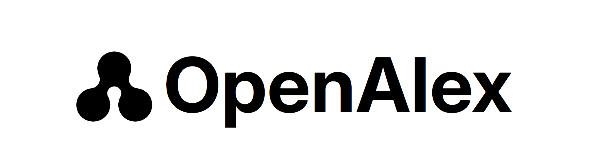

# 300 Million Papers, Now Free. Should You Swallow Them Unchecked?

_OpenAlex — auditing the coverage, author disambiguation, and integrity of a free, open scholarly knowledge graph through the lens of data quality_

## Executive Summary

> [!callout]
> When Microsoft Academic Graph (MAG) shut down in 2021, the gap it left was filled not by a commercial database but by OpenAlex, released under a CC0 license by the nonprofit OurResearch. It opened more than 300 million works through a free API, and today it is the default knowledge source behind AI research agents such as Elicit, SciSpace, and Consensus, and behind countless RAG pipelines. Yet the tagline that prompted this report — "free, no key required" — is already half in the past tense. In February 2026, OpenAlex announced mandatory API keys and usage-based pricing.

> The point is not scale but the price of breadth. Much of what makes OpenAlex look large comes from a definition of "Work" that counts preprints and grey literature too, and that openness comes back as diluted completeness and a looser contamination filter. Author-identity precision has improved dramatically thanks to an algorithm overhaul, but 92% means "one in eight is still wrong," and retraction flags differ so sharply across databases that only 3% of retracted papers are flagged consistently by all four. The broader the source, the blurrier the definitions; the freer it is, the more the burden of verifying quality shifts to whoever uses the data.

> So this report does not say "don't use OpenAlex." On the contrary — much as the Leiden Ranking narrowed its scope from all 300 million records to a reproducible 9.3 million to build an open ranking, we lay out how to audit before ingesting and how to narrow to fit your purpose. What this piece covers is how openness swallowed without verification becomes a risk in the AI pipeline, and how to cut that risk off.

<!-- stat-card -->
**321M** — Indexed works — Measured at 320.97M on 2026-07-23 — already past the "250M" users remembered

<!-- stat-card -->
**92%** — Author-ID precision — The overhaul lifted it from 0.60 to 0.92 — yet one in eight is still wrong

<!-- stat-card -->
**3%** — 4-DB retraction match — Share of papers all four databases flag as "retracted" — sources disagree wildly

<!-- stat-card -->
**3.0x** — Dataset-abusing papers — 2025-vs-2022 rise in paper-mill works that exploit public datasets

## Open Source Replaces a Dead Utility

The story begins with a death. From 2016, Microsoft offered the scholarly knowledge graph Microsoft Academic Graph (MAG) for free, serving as shared infrastructure for bibliometric research. Then, in 2021, Microsoft shut the service down without warning. The ground on which countless studies and tools stood had disappeared.

A nonprofit, not a commercial database, filled the gap. OurResearch, the team behind Unpaywall, released [OpenAlex](https://arxiv.org/abs/2205.01833) in 2022 as an open successor to MAG. The name comes from the ancient Library of Alexandria. It weaves papers, authors, journals, institutions, and topics into a single graph, releases the whole thing under CC0 (public domain), and offered an API that was free and key-free. The introduction that prompted this report — "about 250 million records, no key required" — describes OpenAlex from exactly that era.

*▲ The name comes from the ancient Library of Alexandria. Logo of OpenAlex (2025 redesign), a free scholarly knowledge graph released under CC0. | Source: [Wikimedia Commons — OurResearch](https://commons.wikimedia.org/wiki/File:OpenAlex_logo_2025.png)*

This replacement was more than a declaration. Sorbonne University canceled its Clarivate commercial-tool subscription in 2023 and moved to open alternatives including OpenAlex; universities such as Lorraine, Utrecht, and Zürich pulled out of the THE World University Rankings, explicitly citing a shift to open data. The French Ministry of Higher Education and Research signed a multi-year partnership with OpenAlex in 2024. The backdrop was the roughly one-billion-dollar annual subscription cost that commercial databases imposed on libraries, together with practices that structurally excluded certain regions and fields. The banner of "free and open" thus turned into concrete institutional choices.

OpenAlex's data model is a graph in which five kinds of entities point at one another. Works sit at the center, and to each paper attach who wrote it (Authors), where it appeared (Sources), where the authors are affiliated (Institutions), and what it is about (Topics). The scale, as measured live via the API on July 23, 2026, is shown below.
