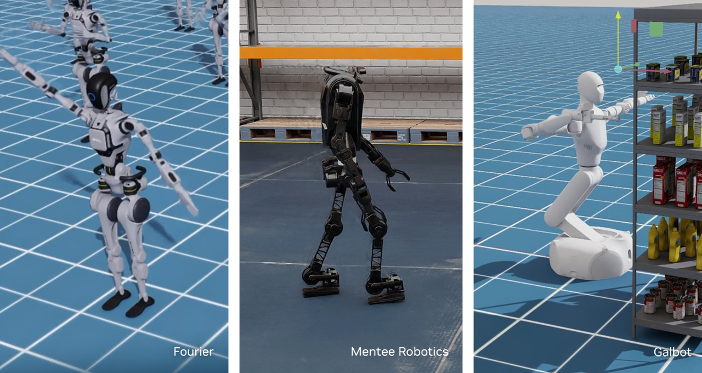

# 완벽한 데이터를 섞었는데 로봇이 더 나빠졌다

_로봇 학습 데이터 큐레이션 연구 지형과, 아직 아무도 닫지 못한 폐루프_

## Executive Summary

> [!callout]
> 물리적으로 완벽하게 일관된 합성데이터끼리 섞어도, 용법과 용량이 틀리면 로봇은 더 나빠진다. 페블러스는 PebbloSim GR00T 실험에서 기존 시연에 겨냥 생산한 처방 데이터를 무가중으로 부었다가 폐루프 도달률이 한 번에 떨어지는 것을 실측했다. 그런데 같은 두 조건에서 오프라인(열린 루프) 지표는 양쪽 모두 만점급으로 붙어 이 하락을 전혀 보지 못했다. 데이터 품질 관리가 "깨끗한가"를 넘어 "어떻게 섞는가"와 "실기로 검증했는가"까지 확장되어야 한다는 것을, 이 실패가 실증했다.

> 이 실패에서 출발해 "데이터를 고르고 섞는 법"의 최신 연구를 모아 보면, 2024~2025년의 흐름은 세 축으로 정리된다. 소스별로 얼마나 섞을지 정하는 혼합비 최적화, 좋은 시연만 남기는 시연 선별, 부족한 상황을 비슷한 궤적으로 채우는 검색 증강이다. 각 축은 인상적인 성능 개선을 보고하지만 하나의 공통점을 공유한다. 전부 학습이 시작되기 전, 데이터를 손질하는 단계에서 멈춘다. 산업 도구인 NVIDIA NeMo Curator조차 영상 단위의 규모 전처리이지, 실기 결과를 데이터로 되먹이는 폐루프는 아니다.

> 여기에 아직 아무도 채우지 못한 빈자리가 있다. 폐루프 실기의 실패를 지도로 그리고, 그 실패를 임베딩으로 진단해, 부족한 데이터를 겨냥해 생산하고, 혼합 가중을 조정해 다시 학습한 뒤, 같은 실기로 재검증하는 회로 전체를 도는 일이다. 연구가 재료 손질까지 왔다면, 손님상 반응을 보고 다음 장을 보는 주방은 아직 열리지 않았다. 페블러스는 그 회로를 1차전에서 실패를 포함해 실제로 한 바퀴 돌았고, 그 실패가 다음 진단의 필요성을 스스로 증명했다.

<!-- stat-card -->
**73% → 43%** — 폐루프 도달률 하락 — 처방 93편(24%) 무가중 혼입 후

<!-- stat-card -->
**2배** — 정지 시연 과밀 — 처방 에피소드가 기존 데이터 대비

<!-- stat-card -->
**98·43·3%** — 폐루프 3눈금 — 오라클·학습판·초기판 (같은 60문제)

<!-- stat-card -->
**0.001** — 열린 루프의 맹점 — 두 조건 모두 만점급 — 하락을 못 봄

## 깨끗한 데이터를 섞었는데 로봇이 나빠졌다

이 글은 우리가 실제로 겪은 실패에서 시작한다. 페블러스의 PebbloSim GR00T 실험에서, 우리는 로봇 정책을 학습시키는 데이터를 늘리기로 했다. 기존 시연 299편에, 정책이 약한 상황을 겨냥해 새로 생산한 처방 데이터 93편을 더했다. 전체의 24%에 해당하는 분량이었다. 이 처방 데이터는 물리 시뮬레이션으로 만들어 물리적 일관성이 확보돼 있었다. 상식대로라면 데이터가 늘고 약점을 겨냥했으니 좋아져야 했다.

*▲ 물리 시뮬레이션 환경에서 학습 중인 휴머노이드 로봇들 — 페블러스의 PebbloSim GR00T 실험도 이런 시뮬레이션 기반 정책 학습 환경에서 진행됐다 | Source: [NVIDIA Blog](https://blogs.nvidia.com/blog/robot-learning-humanoid-development/)*

결과는 반대였다. 처방 데이터를 아무 가중 없이 그대로 섞자, 폐루프에서 로봇이 목표에 닿는 도달률이 73%에서 43%로 떨어졌다. 목표까지의 최소거리 중앙값도 1.8cm에서 11.2cm로 벌어졌다. 로봇이 이전보다 확연히 서툴러진 것이다. 물리적으로 완벽하게 일관된 데이터를 더 넣었는데도, 섞는 방식이 틀리자 정책이 나빠졌다.

더 곤란한 것은, 우리가 흔히 믿는 지표가 이 하락을 전혀 보지 못했다는 점이다. 학습된 정책이 정답 행동을 얼마나 잘 맞히는지 재는 오프라인(열린 루프) 예측 오차는, 처방을 섞은 조건과 안 섞은 조건 양쪽 모두 0.001 수준으로 만점급이었다. 답안지 채점만 보면 두 정책은 똑같이 우등생이었다. 그러나 실제로 로봇을 굴려 보는 폐루프에서는 30%p의 격차가 났다. 답안지는 만점인데 실기는 낙제인 상황이었다.

원인을 되짚어 보니, 처방 데이터에는 로봇이 거의 움직이지 않는 "정지 시연"의 비율이 기존 데이터의 2배로 편중돼 있었다. 정책은 이 편향을 성실히 학습해, 결정적인 순간에 "가만히 있기"를 택하는 경향을 얻었다. 데이터 하나하나는 깨끗하고 물리적으로 옳았지만, 그 데이터들이 모여 만든 분포가 정책을 잘못된 방향으로 끌어당긴 것이다.

> [!callout]
> 이 실패가 우리에게 남긴 교훈은 분명하다. 데이터 품질은 "각 샘플이 깨끗한가"에서 끝나지 않는다. "무엇을 얼마나 섞는가"와 "그 결과를 실기로 검증했는가"까지가 품질이다. 그리고 이 두 질문에 답하려면, 답안지(열린 루프)가 아니라 실기(폐루프)를 봐야 한다. 이 실패에서 출발해, 그렇다면 학계와 산업은 "데이터를 고르고 섞는 법"을 어디까지 풀어 놓았는지 지형을 훑어봤다.

한 가지 미리 밝혀 둔다. 이 글은 하루 전 발행한 [로봇 데이터셋 지형도 리포트](/report/robot-physical-ai-datasets-landscape/ko/)의 후속편이다. 앞 글이 "여섯 데이터셋을 어떻게 표준화하고 배포하는가"를 다뤘다면, 이 글은 그 데이터를 "어떻게 고르고 섞고, 그 답을 실기로 어떻게 검증하는가"를 다룬다. 데이터를 갖추는 문제 다음에 오는, 데이터를 요리하는 문제다.

## 데이터를 고르고 섞는 법: 연구 지형 3축

로봇 모방학습에서 "데이터를 고르고 섞는 법"을 다룬 최신 연구는 크게 세 축으로 정리된다. 파이프라인 순서대로 놓으면 이렇다. 먼저 여러 데이터 소스를 **얼마나 섞을지** 정하는 혼합비 최적화가 있고, 다음으로 섞을 데이터 중 **어떤 시연을 남길지** 고르는 시연 선별이 있으며, 마지막으로 정책이 약한 상황을 **비슷한 궤적으로 채우는** 검색 증강이 있다. 각 축은 서로 다른 신호를 쓰지만, 모두 "학습을 시작하기 전에 데이터를 더 좋게 만든다"는 같은 목적지를 향한다.

### 2.1. 혼합비 최적화 — 무엇을 얼마나 섞을까

가장 앞단의 질문은 "여러 데이터 소스를 어떤 비율로 섞을까"다. **Re-Mix**(Hejna 외, 2024년 8월 공개)는 이 비율을 사람이 손으로 정하는 대신, 분포적 강건 최적화(DRO)로 자동 학습한다. 가장 학습이 안 되는 최악의 소스를 기준으로 가중치를 조정하는 방식이다. Open X-Embodiment 데이터에서 균일하게 섞었을 때보다 평균 38%, 사람이 수작업으로 가중치를 준 정책보다 32% 더 나은 성능을 보고했다. 우리가 1차전에서 겪은 실패, 처방 데이터를 아무 가중 없이 무턱대고 부어 성능이 떨어진 바로 그 상황을 겨냥한 반례 처방이다. 다만 이 최적화는 학습이 시작되기 전 한 번 데이터 비율을 정하는 것이지, 실기 결과를 보고 비율을 다시 손보는 과정은 아니다.

### 2.2. 시연 선별 — 어떤 시연을 남길까

섞을 데이터가 정해지면, 그 안에서 좋은 시연만 골라내는 문제가 남는다. 이 축이 가장 붐빈다. **DemInf**(스탠퍼드·Google DeepMind Robotics, RSS 2025)는 상태와 행동 사이의 상호정보량을 재서 시연 품질을 무감독으로 선별한다. VAE 표현과 k-최근접 추정기로 정보량을 측정하는데, 이 자동 채점이 사람 전문가의 채점과 일관됐고 RoboMimic에서 하류 성공률을 5~10% 끌어올렸다. 우리 실패의 원인이던 "정지 시연"은 로봇이 움직이지 않아 상태-행동 정보량이 빈약하므로, 바로 이 방식으로 검출할 수 있는 대상이다.

같은 축에서 신호만 달리한 연구가 이어진다. **SCIZOR**(UT Austin, 2025)는 자기지도 신호로 저품질·중복 시연을 제거해 다중 벤치마크 평균 15.4%를 개선했다. **CUPID**(스탠퍼드, CoRL 2025)는 영향 함수로 각 시연이 정책의 기대 성능에 미치는 영향을 추정해, 큐레이션된 데이터의 33% 미만만으로 최고 수준 성능에 도달했다. 그리고 이 축에서 결이 다른 하나가 **Demo-SCORE**(Chen 외, 2025)인데, 이건 뒤에서 따로 다룬다. 폐루프 신호를 쓰는 유일한 연구이기 때문이다.

### 2.3. 검색 증강 — 부족한 상황을 채우기

마지막 축은 데이터를 고르거나 섞는 대신, 필요한 순간에 비슷한 궤적을 찾아 붙이는 접근이다. **STRAP**(워싱턴대 WEIRD Lab 외, ICLR 2025)은 궤적을 시각 파운데이션 모델로 임베딩하고, 이를 전체가 아니라 부분 궤적(sub-trajectory) 단위로 잘라 동적 시간 정합(DTW)으로 검색한다. 소표본만 있는 새 과제를, 대규모 데이터에서 닮은 행동 조각을 끌어와 증강하는 것이다. LIBERO-10 벤치마크에서 기존 검색 방식 대비 24.7~25.0% 우위를 보고했다. 여기서 눈여겨볼 것은 "부분 궤적 단위 임베딩"이라는 발상이다. 프레임 하나가 아니라 행동이 이어지는 시퀀스를 단위로 데이터를 다룬다는 점에서, 뒤에 나올 "행동 시퀀스 단위 진단"의 실물에 가깝다.

여섯 연구를 한 표에 올리면 각각이 어떤 신호를 쓰고 어디까지 검증되는지, 그리고 공통으로 어디서 멈추는지가 드러난다. 맨 오른쪽 열이 이 리포트의 축이다.

| 연구 | 속한 축 | 입력 신호 | 보고된 개선폭 | 검증 범위 | 학습 전에서 멈추나 |
| --- | --- | --- | --- | --- | --- |
| Re-Mix | 혼합비 | 소스별 데이터 통계 (DRO) | 균일 대비 +38% / 수작업 대비 +32% | 오프라인 최적화 | 예 |
| DemInf | 시연 선별 | 상태-행동 상호정보량 | RoboMimic +5~10% | 오프라인 선별 | 예 |
| SCIZOR | 시연 선별 | 자기지도 저품질·중복 신호 | 다중 벤치 평균 +15.4% | 오프라인 선별 | 예 |
| CUPID | 시연 선별 | 영향 함수 (폐루프 성능 영향 추정) | <33% 데이터로 SOTA급 | 선별 (폐루프 성능을 목표로 추정) | 대체로 |
| STRAP | 검색 증강 | 시각 임베딩 + 부분궤적 DTW | LIBERO-10 +24.7~25.0% | 오프라인 증강 | 예 |
| Demo-SCORE | 시연 선별 | 폐루프 롤아웃 성패 | 절대 +15~35%p | 폐루프 신호를 선별에 사용 | 선별까지 |

여섯 연구의 축·신호·검증 범위 비교. 수치 출처는 각 논문 초록·본문 대조(참고문헌 참조). 맨 오른쪽 열: 대부분 학습 전 손질에서 멈추고, Demo-SCORE만 폐루프 신호를 되먹이되 선별 단계에 한정된다.

세 축을 하나의 파이프라인으로 겹쳐 보면 공통의 지형이 보인다. 혼합비·시연 선별·검색 증강은 모두 데이터에서 학습으로 가는 길목에 놓여 있고, 학습이 끝난 뒤 실기 결과가 다시 데이터로 돌아오는 화살표는 어느 축에도 없다.

연구 3축 파이프라인. 혼합비·시연 선별·검색 증강은 모두 학습 전 단계에 놓이고, 학습 이후 실기 결과가 데이터로 돌아오는 되먹임(빨간 점선)은 지형 전체에서 비어 있다.

## 오프라인은 왜 실패를 못 보는가

1차전에서 우리를 가장 당황시킨 것은 성능 하락 자체가 아니라, 그 하락을 오프라인 지표가 전혀 못 봤다는 사실이었다. 학습된 정책이 정답 행동을 얼마나 잘 예측하는지 재는 열린 루프 지표는 두 조건 모두 만점급이었다. 이건 우리만의 우연이 아니라, 모방학습이 구조적으로 안고 있는 한계에서 비롯한다.

### 3.1. 미세한 오차가 쌓이는 곳, 폐루프

오프라인 예측 오차가 낮다는 것은 좋은 실기 성능의 필요조건이지 충분조건이 아니다. 이유는 공변량 이동(covariate shift)에 있다. 모방학습 정책은 매 순간 아주 작은 오차를 낸다. 답안지 채점에서는 무시할 만한 크기다. 그러나 로봇은 자기 행동의 결과 위에서 다음 행동을 이어 간다. 작은 오차가 로봇을 학습 데이터에 없던 상태로 조금씩 밀어내고, 그 낯선 상태에서 정책은 더 큰 오차를 내며, 이 되먹임이 장기 제어에서 눈덩이처럼 불어난다. 답안지에서는 안 보이던 오차가 실기에서 폭발하는 것이다.

이 현상은 여러 문헌에 독립적으로 확인된다. 대표적으로 robomimic 연구는 검증 손실이 가장 낮은 정책이 실제로는 최선 정책보다 성능이 50~100% 나쁠 수 있다고 보고했다. 자율주행에서도 단일 스텝 예측 오차가 매우 낮은 강력한 모방학습 에이전트가 장기 폐루프 시나리오에서는 일관되게 무너지는 사례가 보고됐다. 확산 정책 연구에서는 훈련 손실은 줄어드는데 검증 손실이 잡음을 섞어 오르고, 그 손실값과 실제 롤아웃 성능의 상관관계가 약하다는 점이 명시됐다. TOTO 벤치마크는 아예 "오프라인 지표만으로 알고리즘 개발을 전적으로 이끌어서는 안 된다"고 못 박는다.

### 3.2. 같은 데이터로 훈련해도 결과가 흔들린다

폐루프를 보기로 했다고 문제가 끝나는 것도 아니다. 어떤 폐루프 지표를 보느냐, 그리고 훈련의 우연성을 어떻게 다루느냐가 결론을 바꾼다. 우리 실측에서 같은 데이터와 같은 레시피로 훈련을 반복하자, 완주율은 43%에서 30%까지 흔들렸지만 도달률은 44%/41%/41%로 강건했다. 변동성이 큰 지표 하나만 봤다면 잘못된 결론에 이르렀을 것이다. 문헌에서도 동일한 20개 시연으로 학습한 정책의 런별 성공률이 최저 18.8%에서 최고 49.2%까지, 곧 30.4%p나 벌어진 사례가 보고됐다. 폐루프 지표는 강력하지만 잡음도 크다. 여러 지표를 함께, 반복 훈련의 분산까지 보고 판단해야 한다.

### 3.3. 폐루프 신호를 큐레이션에 되먹인 유일한 연구, Demo-SCORE

앞 절에서 미뤄 둔 **Demo-SCORE**가 여기서 등장한다. 이 연구는 시연 선별 축에 속하지만, 다른 연구들과 결정적으로 다른 신호를 쓴다. 정책을 실제로 한 번 굴려 본 폐루프 롤아웃의 성패로 분류기를 학습해, "정책이 실패할 때의 궤적을 닮은 시연"을 데이터에서 걸러내는 것이다. 열린 루프로는 우등생처럼 보이지만 실기에서 정책을 망치는 시연, 곧 우리의 정지 시연 같은 데이터를 실기 결과를 근거로 솎아낸다. 그 효과는 극적이어서, 원본 시연 전체로 학습한 기준 대비 절대 성공률을 15~35%p 끌어올렸고, 어떤 장기 과제에서는 0%였던 성공률을 20%까지 살려냈다.

> [!callout]
> Demo-SCORE는 우리가 돌려는 회로와 가장 가까이 온 연구다. 답안지가 아니라 실기 결과로 교재를 고른다는 발상을 공유한다. 그러나 여기서 한 걸음이 남는다. Demo-SCORE는 이미 있는 시연 중에서 나쁜 것을 **고르기**까지다. 부족한 스킬을 겨냥해 새 데이터를 **만들고**, 그것을 다시 실기로 **재검증**해 회로를 닫는 데까지는 가지 않는다. 그리고 저자들 스스로 이 방법을 사전학습이 아니라 사후학습 선별 단계에 한정해 권장한다. 폐루프 신호가 큐레이션에 처음 들어온 자리이자, 그 신호가 아직 회로를 닫지 못한 자리이기도 하다.

## 규모의 전처리: NVIDIA 도구 축

연구 논문 말고 산업 도구는 어디까지 왔을까. 데이터 큐레이션의 산업 표준을 이야기할 때 빠지지 않는 것이 NVIDIA의 **NeMo Curator**다. 코스모스와 GR00T 같은 파운데이션 모델의 학습 영상을 다루는 공식 큐레이션 도구로, 임베딩 기반 중복 제거·군집·선별을 압도적인 규모로 수행한다. NVIDIA는 이 도구로 2천만 시간 분량의 영상을 Blackwell GPU에서 단 2주에 처리할 수 있다고 밝혔다. 미최적화 CPU 파이프라인으로는 3.4년이 걸릴 분량이다. 로봇 데이터 큐레이션이 개별 연구실의 실험을 넘어 산업 인프라의 규모로 올라섰음을, 이 수치가 그대로 보여준다.

이 규모를 떠받치는 데이터셋도 함께 공개돼 있다. Open Physical AI Dataset은 로보틱스 부문만 15TB, 32만여 궤적에 이르고, GR00T X-Embodiment Sim 데이터셋은 약 34.6만 궤적, 1.91TB 규모로 상업 사용이 가능한 CC-BY 4.0 라이선스를 단다. 양팔 조작부터 휴머노이드 상반신 조작, 로코-조작까지 다양한 임베디먼트를 담는다. 데이터를 대량으로 확보하고 대량으로 손질하는 능력에서, NVIDIA는 명백히 앞서 있다.

*▲ Open Physical AI Dataset이 다루는 세 도메인 — 로보틱스(병원 주행), 자율주행(인지), 제조(창고 매니퓰레이션) | Source: [NVIDIA Blog](https://blogs.nvidia.com/blog/open-physical-ai-dataset/)*

> [!callout]
> 그러나 결을 정확히 봐야 한다. NeMo Curator가 하는 일은 영상 단위의 규모 전처리다. 학습을 시작하기 전에, 방대한 영상 더미에서 중복을 지우고 비슷한 것을 묶고 쓸 만한 것을 고른다. 이것은 강력하지만, 로봇이 실제로 굴러 본 폐루프 결과를 데이터 선별과 생산에 되먹이는 단계는 아니다. 앞 섹션의 연구 3축이 학습 전에서 멈춘 것과 같은 지점에서, 이 산업 도구도 멈춘다. 다만 그 멈춘 자리를 산업 규모로 넓혀 놓았을 뿐이다. 규모의 전처리와 실기 검증은 서로 다른 층위의 문제이고, 전자를 아무리 키워도 후자가 저절로 채워지지는 않는다.

## 지형의 빈자리: 아직 아무도 닫지 못한 회로

지금까지 훑은 지형을 한 문장으로 요약하면 이렇다. 혼합비 최적화도, 시연 선별도, 검색 증강도, 산업 규모 전처리도, 모두 학습이 시작되기 전 데이터를 손질하는 데서 멈춘다. 폐루프 신호를 처음 끌어들인 Demo-SCORE조차 그 신호로 시연을 고르는 데까지만 왔다. 그렇다면 아직 아무도 채우지 않은 자리는 개별 기술 하나가 아니다. 조각들을 이어 하나의 순환으로 만드는 **회로** 자체다.

그 회로는 다섯 단계로 이루어진다. 먼저 (1) 폐루프 실기로 정책이 어디서 실패하는지 지도를 그린다. 그다음 (2) 실패 구간을 임베딩으로 진단하되, 장면 단위와 행동 시퀀스 단위를 함께 본다. 진단으로 부족한 스킬이 드러나면 (3) 그것을 겨냥해 처방 데이터를 생산하고, (4) 혼합 가중을 조정해 다시 학습한 뒤, (5) 같은 실기로 재검증한다. 결정적인 것은 5번이 다시 1번으로 돌아가 회로를 닫는다는 데 있다. 한 번의 손질이 아니라, 실기 결과가 계속 데이터로 되먹여지는 반복되는 주방이다.

폐루프 데이터 큐레이션 회로. 다섯 단계가 순환하며 재검증(⑤)이 다시 실패 지도(①)로 돌아가 회로를 닫는다. 기존 연구는 대부분 진단·선별(②) 조각에서 끊기고, Demo-SCORE가 폐루프 신호로 그 조각을 여는 데까지 왔다.

요리에 빗대면 이해가 쉽다. 지금까지의 연구는 재료를 다듬는 기술에서 정점에 이르렀다. 어떤 재료를 얼마나 넣을지(혼합비), 상한 재료를 어떻게 골라낼지(시연 선별), 부족한 재료를 어디서 구할지(검색 증강)까지 정교해졌다. 그러나 이 모든 손질은 요리를 내기 전, 주방 안에서 끝난다. 손님상에 음식이 나간 뒤 손님의 반응을 보고 다음 코스의 재료를 다시 고르는 주방은, 아직 문을 열지 않았다. 폐루프는 바로 그 손님상의 반응이다.

> [!callout]
> 빈자리는 개별 기술의 부재가 아니라, 닫히지 않은 회로다. 조각들은 이미 훌륭하게 갖춰져 있다. 문제는 실기 결과가 데이터로 돌아오는 마지막 화살표가 지형 어디에도 그려져 있지 않다. 그리고 이 화살표를 실제로 그어 본 경험, 심지어 실패까지 포함해 그어 본 경험은, 그 자체로 드문 1차 자료다.

## 실패가 실증한 것: 수치로 빈자리 메우기

1차전으로 돌아가자. 우리의 실패는 앞서 그린 회로를 실제로 한 바퀴 돌다가 넘어진 기록이다. 그런데 그 넘어짐이 회로의 어느 부분이 아직 부족한지를 정확히 짚어 준다. 세 묶음의 수치가 그 지점을 가리킨다.

첫째, **답안지와 실기의 괴리**다. 처방을 섞은 조건과 안 섞은 조건에서 열린 루프 예측 오차는 양쪽 다 0.001로 만점급이었지만, 폐루프 도달률은 73%에서 43%로, 목표까지의 최소거리 중앙값은 1.8cm에서 11.2cm로 벌어졌다. 폐루프 세 눈금으로 재면 정책의 실력 스펙트럼이 또렷하다. 완벽한 기준인 오라클 정책이 98%, 이번에 학습한 정책이 43%, 아무것도 배우지 않은 초기판이 3%다. 오프라인 지표는 이 스펙트럼의 상단 두 정책을 구별하지 못한다. 폐루프만이 그 차이를 본다.

| 측정 | 처방 혼입 전 | 처방 무가중 혼입 후 | 무엇을 보나 |
| --- | --- | --- | --- |
| 열린 루프 예측 오차 | ~0.001 (만점급) | ~0.001 (만점급) | 차이 못 봄 |
| 폐루프 도달률 | 73% | 43% | 30%p 하락 포착 |
| 최소거리 중앙값 | 1.8cm | 11.2cm | 악화 포착 |

같은 두 조건을 열린 루프와 폐루프로 각각 잰 결과. 답안지(열린 루프)는 두 정책을 똑같은 우등생으로 보지만, 실기(폐루프)는 30%p의 격차를 드러낸다.

둘째, **진단의 이중 축**이다. 성능이 왜 떨어졌는지 원인을 추적하니, 처방 데이터에서 로봇이 거의 움직이지 않는 정지 시연의 비율이 기존의 2배였다. 여기서 중요한 것은, 이 편중을 프레임 하나하나를 보는 장면 단위 통계로는 잡아내지 못했다는 점이다. 정지한 프레임 자체는 이상해 보이지 않는다. 문제는 그 프레임들이 시간에 걸쳐 어떻게 이어지는가, 곧 행동이 담은 정보량에 있었다. 앞서 본 DemInf가 상태-행동 상호정보량으로 시연을 걸러내는 원리, STRAP이 부분 궤적 단위로 데이터를 다루는 발상이 여기서 만난다. 장면 단위 진단이 놓친 것을 행동 시퀀스 단위 진단이 봤어야 했다. 우리의 실패가 곧 시퀀스 단위 진단의 필요성을 실증한 것이다.

셋째, **지표 선택의 교훈**이다. 같은 데이터와 레시피로 훈련을 반복하니 완주율은 43%에서 30%로 흔들렸지만 도달률은 44%/41%/41%로 강건했다. 폐루프로 옮겼다고 해서 아무 지표나 믿으면 안 된다는 뜻이다. 회로를 닫으려면 되먹일 신호부터 신중히 골라야 하고, 그 신호는 반복 훈련의 분산까지 견뎌야 한다.

> [!callout]
> 세 묶음의 수치가 가리키는 곳은 하나다. Demo-SCORE가 폐루프 신호로 시연을 고르는 데까지 왔다면, 우리의 실패는 그다음 두 걸음, 곧 진단으로 부족분을 짚어 **겨냥 생산**하고 같은 실기로 **재검증**하는 단계가 왜 필요한지를 실물로 보여줬다. 심지어 그 겨냥 생산이 서투르면(정지 시연 과밀) 어떻게 역효과가 나는지, 그리고 그것을 장면 단위 진단이 왜 못 잡는지까지 드러났다. 실패가 회로의 나머지 절반을 스스로 설계 문서로 남긴 셈이다.

## 페블러스가 이 빈자리에 주목하는 이유

이 리포트가 짚은 빈자리, 폐루프 실기 결과를 데이터로 되먹이는 회로의 부재는 페블러스의 사업 좌표와 곧바로 맞닿는다. 그 연결을 네 각도에서 살펴본다.

### 비즈니스와 기술의 교차점

페블러스의 DataClinic과 AI-Ready Data는 "학습 전 데이터 품질 검증"을 표방해 왔다. 이 리포트는 그 문제의식을 Physical AI, 곧 로봇 모방학습의 폐루프 실기까지 확장한다. PebbloSim GR00T 실험은 데이터 품질을 정적인 정제로 보지 않고 실기로 검증되는 동적 회로로 다룬다는 관점의 구체적 근거다. 데이터 품질은 파일 안에서 판정되는 것이 아니라, 그 데이터로 학습한 로봇의 실제 행동으로 판정된다.

### 데이터 품질 관점

물리적으로 완벽하게 일관된 합성데이터도 혼합과 용량이 틀리면 로봇이 나빠진다는 실측은, 데이터 품질이 개별 샘플의 청결도가 아니라 분포·구성·모델 내부 표현과의 상호작용에서 결정됨을 보여준다. 정지 시연이 정책을 오염시키는 방식은 DemInf의 상호정보량 관점과 그대로 맞물리고, 장면 단위와 행동 시퀀스 단위를 함께 보는 이중 축 진단이 왜 필요한지를 실패가 직접 증명했다. 스케일보다 검증 가능성이 먼저라는 명제가, 물리 데이터에서도 그대로 성립한다.

### 고객·파트너 실무 함의

로봇이나 VLA를 학습시키는 고객과 파트너에게 이 글은 즉시 실무적이다. "데이터를 더 부으면 좋아진다"는 직관이 왜 위험한지(무가중 혼입의 반례), 오프라인 지표만 믿으면 왜 실패를 놓치는지(답안지가 못 본 도달률 하락), 그리고 폐루프 검증·혼합 가중·시퀀스 진단을 어떻게 도입할지에 대한 구체적 반례와 지침을 준다. 데이터를 늘리기 전에 던져야 할 질문의 목록이기도 하다.

### 페블러스의 포지셔닝

연구 다섯 편이 공통으로 학습 전 손질에서 멈추고 NeMo Curator조차 규모의 전처리인 지형에서, 회로 전체를 실패까지 포함해 한 바퀴 돌아 본 1차 자료는 흔치 않다. 이것은 자랑이 아니라 관찰이다. 남들이 복제하기 어려운 것은 결론이 아니라 실기를 돌린 경험 자체이기 때문이다. 손님상의 반응을 실제로 본 주방만이 다음 코스의 재료를 되짚을 수 있다.

> [!callout]
> 로봇 데이터 큐레이션의 다음 경쟁은 무엇으로 벌어질까. 재료를 다듬는 기술은 이미 정교해졌다. 남은 질문은 "얼마나 잘 손질했는가"가 아니라 "손님상의 반응을 보고 다시 손질하는 회로를 닫았는가"다. 형식과 손질은 지형에 갖춰졌고, 그 위에서 실기 결과를 데이터로 되먹이는 화살표를 긋는 일이 다음 좌표다. 우리의 1차전은 그 화살표를 처음 그어 본, 넘어짐을 포함한 기록이다.

**(주)페블러스 데이터 커뮤니케이션팀**  
2026년 7월 17일

## 참고문헌

### 학술 논문

- 1.Hejna, J. et al. "[Re-Mix: Optimizing Data Mixtures for Large-Scale Imitation Learning](https://arxiv.org/abs/2408.14037)." 2024년 8월 공개. arXiv:2408.14037.
- 2.Memmel, M. et al. "[STRAP: Robot Sub-Trajectory Retrieval for Augmented Policy Learning](https://arxiv.org/abs/2412.15182)." ICLR 2025. arXiv:2412.15182. 공식: [weirdlabuw.github.io/strap](https://weirdlabuw.github.io/strap/).
- 3.Hejna, J. et al. "[Robot Data Curation with Mutual Information Estimators (DemInf)](https://arxiv.org/abs/2502.08623)." RSS 2025 (Stanford · Google DeepMind Robotics). arXiv:2502.08623.
- 4.Chen, A. et al. "[Demo-SCORE: Learning to Filter Demonstrations with Closed-Loop Rollouts](https://arxiv.org/abs/2503.03707)." 2025. arXiv:2503.03707.
- 5.Zhang, Y. et al. "[SCIZOR: Self-Supervised Data Curation for Large-Scale Imitation Learning](https://arxiv.org/abs/2505.22626)." 2025 (UT Austin). arXiv:2505.22626.
- 6.Agia, C. et al. "[CUPID: Curating Data your Robot Loves with Influence Functions](https://arxiv.org/abs/2506.19121)." CoRL 2025 (Stanford). arXiv:2506.19121.
- 7.Mandlekar, A. et al. "[What Matters in Learning from Offline Human Demonstrations for Robot Manipulation (robomimic study)](https://robomimic.github.io/study/)." 검증 손실 최선 정책이 실제 최선 대비 50~100% 나쁠 수 있음의 정량 근거.

### 산업 블로그 · 데이터셋 카드

- 8.NVIDIA. "[Open Physical AI Dataset](https://blogs.nvidia.com/blog/open-physical-ai-dataset/)." NeMo Curator "2천만 시간 / 2주 / Blackwell vs CPU 3.4년" 수치의 출처, 로보틱스 부문 15TB · 32만+ 궤적.
- 9.NVIDIA. "[Advancing Robot Learning, Perception and Manipulation](https://blogs.nvidia.com/blog/robot-learning-humanoid-development/)." NeMo Curator "7x faster" · "100+ 페타바이트" 수치 출처(위 8번의 20M시간/2주 수치와는 별개 지표).
- 10.[nvidia/PhysicalAI-Robotics-GR00T-X-Embodiment-Sim](https://huggingface.co/datasets/nvidia/PhysicalAI-Robotics-GR00T-X-Embodiment-Sim) (CC-BY 4.0, 약 34.6만 궤적 / 1.91TB).

### 비교 맥락

- 11.Open X-Embodiment Collaboration. "[Open X-Embodiment: Robotic Learning Datasets and RT-X Models](https://arxiv.org/abs/2310.08864)." arXiv:2310.08864. 100만+ 궤적, 22개+ 임베디먼트(집계 방식별 편차, 보수 표기).
- 12.Khazatsky, A. et al. "[DROID: A Large-Scale In-The-Wild Robot Manipulation Dataset](https://arxiv.org/abs/2403.12945)." RSS 2024. arXiv:2403.12945. 7.6만 궤적 / 약 350시간. 공식: [droid-dataset.github.io](https://droid-dataset.github.io/).
