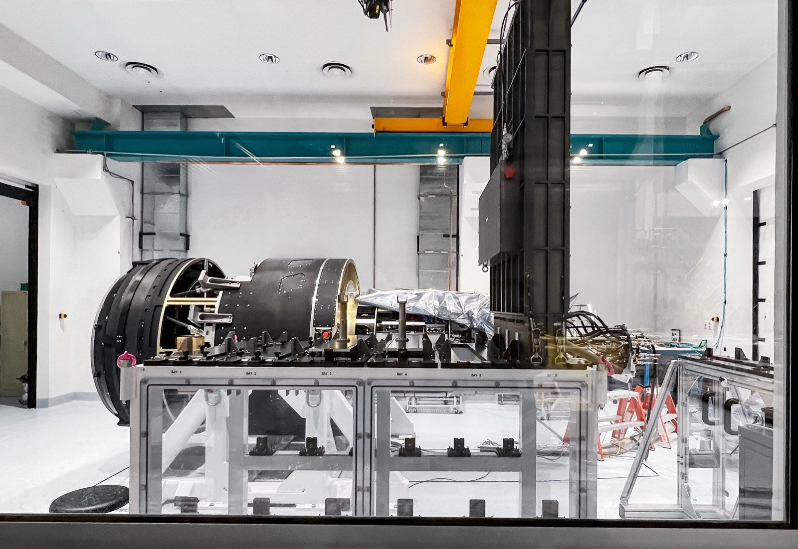
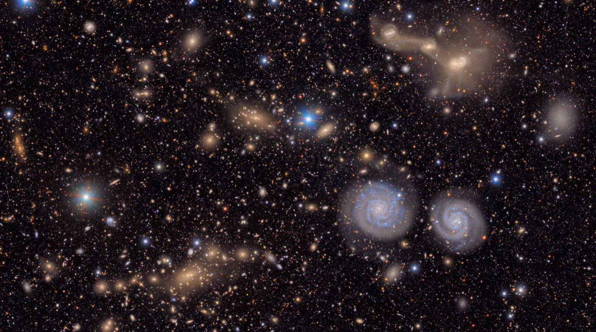

# Rubin Observatory

_The Rubin Observatory_

## Executive Summary

> [!callout]
> In the summer of 2026, as the Vera C. Rubin Observatory ramped up its Legacy Survey of Space and Time (LSST), one of astronomy's oldest bottlenecks quietly changed address. For the past 400 years, the limit on discovery was a question of optics: how large a mirror could gather how faint a light. Now that an 8.4-meter primary mirror and a 3,200-megapixel camera photograph a patch of sky 40 times the area of the full moon every 40 seconds, the limit is no longer optical. It has moved to a different question entirely. Of the millions to ten million change alerts that pour out every night, which ones can a human trust enough to actually look at? This piece follows how that bottleneck traveled from the telescope to the real-time classification pipeline.

> The numbers make the shift concrete. An LSST-class survey emits on the order of a billion alerts a year. The final gate at which a human confirms what any of them are, spectroscopic follow-up capacity across the entire planet, runs to just 10,000 to 100,000 a year. That is a gap of four to five orders of magnitude. In practice, fewer than 1% of LSST supernovae ever get spectroscopically confirmed. The overwhelming remainder are never seen by a single human eye; they are ranked by a classifier's probability score alone. The classifier has become the gatekeeper of discovery.

> And the trustworthiness of every verdict that classifier delivers comes, in the end, from the quality of the labels it learned from. When data structurally exceeds a human's capacity to review it, "AI-Ready" stops meaning merely "data you can train on." It comes to mean "data you can trust, prioritize, and select from." Rubin is a reference case that demonstrates this proposition at the extreme scale of astronomy.

*▲ The Vera C. Rubin Observatory atop Cerro Pachón in the Chilean Andes. Its 8.4-meter primary mirror and 3,200-megapixel camera sweep the sky from inside this dome every night. | Source: [RubinObs/NSF/AURA, Wikimedia Commons (CC BY 4.0)](https://commons.wikimedia.org/wiki/File:A_View_from_Rubin_(rubin-P1034013Dome-CC).jpg)*

**Editor's note.** Wherever data outgrows a human's capacity to review it, and the question becomes what to trust and select, Pebblous tends to pay attention. This piece does not simply list how impressive Rubin is. It separates, step by step, the automated gates a single change in light passes through: becoming an alert, clearing a filter, getting classified, and finally being triaged into a candidate for human review. Because this is a young facility, the numbers shift depending on when you ask. Where even official sources disagree, as they do on the nightly alert volume, we cite both and label the nature of each figure (announced target, technical spec, early-operations measurement).

### Key Figures

Four numbers frame this piece. The first two capture the gap between "how much pours out" and "how much a human can confirm"; the last two show how far the machines have closed that gap.

<!-- stat-card -->
**~1 billion / yr** — alerts emitted — annual change alerts from an LSST-class survey

<!-- stat-card -->
**10K–100K / yr** — spectroscopic ceiling — global follow-up capacity = the limit of human confirmation

<!-- stat-card -->
**under 1%** — of supernovae confirmed — the rest rely on the classifier's probability score alone

<!-- stat-card -->
**1/80 → 45%** — broker throughput scale-up — how close ALeRCE has come to LSST's required rate

## The Bottleneck Moved — From Telescope to Classifier

For a long time, "progress in astronomy" meant a bigger mirror. From Galileo's palm-sized lens to Palomar's 5-meter glass, the competition ran in one direction: gather more of the faintest light. Rubin's 8.4-meter primary mirror sits squarely in that lineage. But what Rubin changed is not the size of the mirror; it is the rhythm of observation. The largest digital camera ever built, at 3,200 megapixels, photographs a fresh patch of sky every 40 seconds. A single field of view spans 9.6 square degrees, more than 40 times the area of the full moon. Repeat that all night, and roughly 1,000 images and about 10 TB of data pile up.

*▲ The largest digital camera ever built, the 3,200-megapixel LSST Camera, photographed in a cleanroom during assembly. It captures a patch of sky 40 times the area of the full moon every 40 seconds. | Source: [NOIRLab/NSF/AURA, Wikimedia Commons (CC BY 4.0)](https://commons.wikimedia.org/wiki/File:LSST_Camera_(IMG_0827-CC).jpg)*

The hard part comes next. Taking the image is one thing; picking out "what changed" inside it is another. Whenever Rubin detects an object whose brightness or position has shifted relative to earlier observations, it generates an alert: a small data packet holding the object's coordinates, its change in brightness, and its past history. As for how many of these come out in a single night, even the official sources disagree. Rubin's press release states "up to seven million per night," while the same observatory's technical reference page lists "about ten million." And on the night the first alerts actually went out (February 24, 2026), roughly 800,000 were generated.

The three numbers are not a contradiction but a difference in tense. 800,000 is an early-operations measurement; seven million is the announced target for steady-state operation; and ten million is closer to the ceiling the design and technical specifications assume. Rubin is still ramping up, so it is hard to pin down any figure as "established statistics." But the order of magnitude is clear. Compared with its predecessor ZTF (the Zwicky Transient Facility), which handled a few hundred thousand a night, a stream roughly an order of magnitude (about ten times) larger has opened up.

Scale on its own is just a big number. What lets us say the bottleneck has moved becomes visible only when you set that alert volume next to the capacity of the final gate at which a human confirms it. The most reliable way to pin down a new object's identity is spectroscopy (splitting its light by wavelength), and that resource, across the entire globe, runs to just 10,000 to 100,000 a year. An LSST-class survey emits up to a billion alerts a year. Line the two numbers up on the same axis and the gap becomes hard to miss.

<!-- stat-card -->
**Annual alert volume vs. spectroscopic review capacity (log scale)** — Alerts emitted~1 billion / yr — Confirmable by spectroscopy10K–100K / yr — ▲ The bars are on a log scale. Drawn linearly, the lower bar would be too short to see. Alert volume and review capacity are separated by four to five orders of magnitude, and even so, fewer than 1% of LSST supernovae reach spectroscopic confirmation. | Sources: arXiv:2512.15555, LSST SNe estimate paper

> [!callout]
> The telescope is already big enough. Today's decisive ground is not a larger mirror but a classification problem: in a flood of alerts no human could ever fully review, which ones do you trust enough to look at? The real-time classification pipeline is what renders that verdict automatically, millions of times a night.

## From a Single Photon to a Human's Eye

Before a single change in light becomes science, it has to clear several automated gates. What matters is that these gates open and close automatically, in seconds, before any human reviews them. Human intervention is always after the fact. Let's trace that path stage by stage, from exposure to the moment a signal is triaged into a candidate for human review.

### 2.1. Difference imaging — keeping only the "changed pixels"

Most of the night sky looks identical to last night. So the pipeline's first job is to keep only what changed. Difference imaging subtracts a reference image of the same sky from the one just taken, leaving only the pixels that brightened, dimmed, or moved. A newly lit point of light like a supernova, or a moving speck like an asteroid, survives that subtraction. For each surviving signal, a small cutout of the sky at that spot (a stamp) is produced.

### 2.2. The alert packet — broadcast to the world in a standard format

Each surviving signal is wrapped into an alert packet. Rubin uses Avro, a standard serialization format. A single packet carries the object's coordinates, its brightness in this measurement, and its history of past observations. That last part matters: bundling the past history in lets a downstream classifier immediately use the object's change in brightness over time, its light curve. Packets are generated within tens of seconds to two minutes of the exposure and broadcast to a stream that anyone can subscribe to.

### 2.3. real-bogus — the first gatekeeper between real and fake

Not every signal that survives difference imaging is a real object. The trail a cosmic-ray particle leaves on a sensor, a defect in the optics, a tiny registration error when two images are aligned. All of these look like "change." What separates the bogus from the real is the real-bogus classifier, a CNN (convolutional neural network) that takes the image stamp as input. braai, the representative model of the ZTF era, reported state-of-the-art low false-positive and false-negative rates on this task. But this filter is not a set-it-and-forget-it device. Its successor, BTSbot, raised the decision threshold from 0.3 to 0.7 to cut down false positives that mistook bright galactic nuclei for supernovae. Where you place that threshold is exactly what decides which signals survive as discovery candidates.

> [!callout]
> From exposure to broker redistribution, the entire chain turns in seconds, untouched by human hands. Night after night, the overwhelming majority of alerts are ranked by a machine's probability score alone, never reaching a single human eye. That makes the pipeline's decision boundary not a mere technical parameter but a scientific choice: one that decides what gets the chance to be observed.

## Seven Eyes — What the Community Brokers Pick Out

Rubin does not classify its alerts. It only emits the stream and leaves the verdict to external community brokers. A broker is an independent system that takes Rubin's entire alert stream, filters and classifies it in its own way, and redistributes the result. Why doesn't the observatory just do this itself? The answer is scale and diversity. Processing millions to ten million alerts a night in real time takes formidable computing infrastructure, and the standard for "what counts as an interesting signal" differs between a team chasing supernovae and one chasing asteroids. No single central classifier can carry that diversity.

So Rubin selected seven official community brokers and granted them full-stream access. Each is run by a research group in a different country, with its own classification and filtering strategy and its own user base. Here's that landscape laid out in a single table. That said, ALeRCE, the representative case, is about the only one whose detailed architecture and performance figures are stably confirmed by primary sources; for the rest, we summarize the operator and orientation at a high level.

| Broker | Operator · Region | Orientation |
| --- | --- | --- |
| ALeRCE | Chilean research consortium | Two-stage classification (stamp CNN + light-curve classifier), probabilities across 15 classes |
| ANTARES | NOIRLab (USA) | Filter-based real-time selection, streams of events of interest |
| Fink | France (IN2P3/CNRS) | Classification and science modules on large-scale distributed processing |
| Lasair | UK (Edinburgh · QUB) | Query- and filter-centric community exploration interface |
| AMPEL | Germany (DESY et al.) | Emphasis on reproducible analysis workflows and provenance |
| Babamul | US-led | Newer broker, oriented toward high-volume stream handling |
| Pitt-Google | USA (Univ. of Pittsburgh · Google Cloud) | Stream processing and redistribution on commercial cloud infrastructure |

▲ Overview of Rubin's seven official community brokers. Operators and regions are per public information; the detailed architecture differs by broker and keeps evolving. | Sources: each broker's official documentation, ALeRCE paper (arXiv:2008.03311)

### 3.1. The representative case, ALeRCE — split into two stages

ALeRCE splits classification into two stages. First, a CNN scans the image stamp carried in the alert and makes a fast first call, sorting a freshly arrived signal into supernova candidate, asteroid, or variable star from the image alone. Then, as time accumulates and the light curve grows longer, statistical features of the brightness variation are extracted and a GBDT (gradient-boosted decision tree) or random-forest classifier assigns probability scores across 15 classes. The image handles immediacy; the light curve handles precision. A division of labor.

What matters is the reality of scale. Back when ALeRCE processed the ZTF stream, its throughput was about 5 alerts per second, roughly 140,000 a night. But the rate LSST demands reaches about 116 per second (assuming 10 million a night). The ZTF-era throughput was, in other words, only about one-eightieth of that requirement. In the latest pipeline tests, it has been pushed to about 150 per second, around 45% of the requirement. That number is an honest admission that broker infrastructure has not yet fully caught up to LSST scale, and is still scaling as we speak.

> [!callout]
> The seven brokers receive the same stream and look at it through different eyes. That diversity is a strength. But the fact that even the flagship broker sits at just over half the required throughput reveals a plain reality: production-scale scale-up is still catching up. Anyone who has actually run a large-scale data pipeline will find this scene familiar.

## What Did the Classifier Learn — Labels and Trust

A classifier does not know the right answer; it imitates what it was taught. So the trustworthiness of every verdict it delivers each night comes, in the end, from the quality of the labels it learned from. And in astronomy, labels are unusually hard to come by. To confirm that an object really is a Type Ia supernova, you need spectroscopy, and as we saw, that resource is extremely scarce. So LSST classifiers lean on labels from three sources: records from past surveys, simulations built from physical models, and spectroscopic confirmation limited to the bright few.

All three sources carry bias. The bias in spectroscopically confirmed labels is especially concrete. ZTF's Bright Transient Survey spectroscopically confirmed more than 8,800 supernovae over six years, but only for candidates brighter than about magnitude r = 18.5. The faint majority get no spectroscopic label and rely on the probability score of a light-curve classifier alone. In the end, the model learns the objects that were "bright and easy to confirm" as ground truth, and fills in the faint world by inference.

### 4.1. PLAsTiCC — a benchmark that put label imbalance front and center

The project that demonstrated this problem in miniature was PLAsTiCC (the Photometric LSST Astronomical Time-Series Classification Challenge). Held on Kaggle in 2018, the competition simulated the data LSST would face in advance and drew more than 1,000 teams. Its training set comprised 7,848 light curves across 14 classes, and those class shares were extremely skewed. The most common, Type Ia supernovae, made up about 29.5% of the whole, while the rarest, M-dwarf flares, came to 0.4% (just 30 objects). Set the largest class beside the smallest and the imbalance is unmistakable.

<!-- stat-card -->
**PLAsTiCC training-set class share (most vs. least common)** — Type Ia supernovae (most common class)29.5% — M-dwarf flares (rarest class · 30 objects)0.4% — ▲ There is roughly a 70× difference in share between the most common and rarest classes. Rare classes have far too few examples to learn from, so the classifier's internal representation tilts toward the majority classes. | Source: PLAsTiCC results paper (arXiv:2012.12392)

This imbalance was not a mistake but a design choice. PLAsTiCC deliberately built in a non-representative training set and extreme class imbalance: exactly what would recur in LSST's real stream. The competition used a loss function that weighted each class equally (a weighted multi-class log-loss) so that rare classes could not be ignored, and participants fought back with techniques like data augmentation and pseudo-labeling. But the root problem remains: rare classes, faint objects, and never-before-seen phenomena simply lack examples to learn from.

### 4.2. How much can you trust the probability score?

A classifier's output is not the assertion "this is a supernova" but a score: "probability of supernova, 0.87." How that confidence score is passed downstream turns out to matter in practice. The team deciding on follow-up looks at the score to choose where to spend limited telescope time. Overtrust the score and you waste resources on the wrong candidate; undervalue it and you miss a genuine discovery. A model trained on biased-label data inherits that bias wholesale in its probability scores: answering confidently for "bright supernovae" and waveringly for "faint, rare phenomena."

Push one step further and the problem becomes less about how high the score is than about how much you can trust it. A well-calibrated classifier should mean that of 100 candidates it labeled "probability 0.87," roughly 87 really are supernovae. But when rare classes and faint objects are underrepresented in training, the model tends to show inflated confidence for the bright supernovae it saw often, and either shallow confidence or excessive hesitation for the phenomena it rarely saw. So what a follow-up team needs is not a single probability score but information about where that score is trustworthy and where it wavers. A label that fails to track how far its confidence holds, however polished the score looks, makes you allocate precious telescope time without knowing where it will be wrong.

> [!callout]
> Label quality is discovery quality. When spectroscopic confirmation skews toward the bright few and the classes are extremely imbalanced, what a classifier confidently selects and what it misses is decided in advance by the data's bias. Not a bigger model but better labels is closer to the answer here.

## When Humans Can't See It All — What "AI-Ready" Means

Everything so far converges on a single condition: data structurally exceeds a human's capacity to review it. Alerts pour out at a billion a year, while spectroscopic confirmation runs to 10,000–100,000, under 1% for supernovae. Under that condition, triage, choosing what to look at first, is not a choice but a structural necessity. The plan of "a human will review every alert" was never possible to begin with.

*▲ A portion of the Virgo Cluster from Rubin Observatory's first-look release. The full composite, built from roughly 1,100 exposures, contains about 10 million galaxies — this is the scale of data pouring out every night that no human could ever review one by one. | Source: [NSF–DOE Vera C. Rubin Observatory, Wikimedia Commons (CC BY 4.0)](https://commons.wikimedia.org/wiki/File:Virgo_Cluster_Rubin.png)*

### 5.1. "Choosing what to look at" becomes the science

So the very nature of discovery changes. Where discovery once meant staring at the sky for a long time, now the first step of discovery is choosing which of the candidates a machine spat out will get precious observing resources. The attempt to optimize that choice is active learning: computing which object, if spectroscopically confirmed, would most improve the classifier's overall performance, and steering limited follow-up there. Projects like RESSPECT have explored this direction. The point is clear: when review capacity is fixed, your edge comes from the quality of "what you choose to review."

Korea, too, is plugged into this data. The Korea Astronomy and Space Science Institute (KASI) signed an in-kind contribution agreement with the NSF and DOE in the second half of 2025, securing the country's only access to LSST data, and it runs the "Korean Rubin Science Collaboration." In other words, a channel is open for the domestic research community to engage directly with this alert stream and its classification problem.

### 5.2. This is not just astronomy's story

The condition of "data exceeding human review capacity" does not only arise where people count stars. Quality inspection on a manufacturing line can't have a human look at every unit, so it relies on a defect-detection model's verdict; autonomous driving has to choose which corner cases, out of an endless torrent of driving logs, to label and feed into training; medical imaging is bounded by how many reads a radiologist can do. In every setting the question is the same: when you can't see it all, what do you trust and review first? Rubin's chain, from the real-bogus filter through broker classification to spectroscopic triage, is a reference architecture that pushes this question to the limit. Including the reality that broker infrastructure sits at just over half the required rate, it offers practitioners a lens they can map onto their own work immediately.

### 5.3. So what does "AI-Ready" mean?

Return to the question this piece opened with. In an era where data exceeds review capacity, what does "AI-Ready" mean? Rubin's case shows the answer does not stop at "data you can train on." What the real-bogus filter screens out, what probability the broker classifies with, and what spectroscopic triage confirms first all depend on the labels' provenance and bias, and on how their trustworthiness is tracked. That is, AI-Ready means data made so that, even at scales beyond review capacity, you can trust it, prioritize it, and select from it: a state where you know where the labels came from, what they are failing to see, and how far you can trust their probability scores. That the trust in discovery comes not from a bigger telescope but from better data: Rubin demonstrates this proposition every night.

**Editor's note.** This is exactly the layer Pebblous works on: diagnosing the label quality and trustworthiness of a dataset, and identifying, at the data level, what to look at first at scales that exceed review capacity. Rubin's real-bogus–broker–triage chain is a reference case that shows that problem at the extreme of astronomy, and, following GeoVision (satellite imagery) and Artemis (space operations), it adds one more axis: "observational data → real-time ML classification → human-review bottleneck." This piece introduces that axis but leaves the conclusion to the reader's own field.

## References

The Rubin/LSST official primary sources cited here, the academic papers on real-time classification, brokers, and label quality, and the relevant statistics, grouped by source. Because this is a young facility, figures on which sources disagree (alert volume, latency, and so on) are cited in the body with the nature of each value distinguished.

### Official · Primary Sources

- 1.Vera C. Rubin Observatory (2026). [**Rubin Observatory Issues First Alerts**](https://rubinobservatory.org/news/first-alerts) (press release, "up to 7 million per night").
- 2.Vera C. Rubin Observatory. [_Key Numbers_](https://rubinobservatory.org/for-scientists/rubin-101/key-numbers) (technical reference, "~10 million alerts/night," "10 TB/night," "60 s").
- 3.U.S. National Science Foundation (2026). [_NSF–DOE Vera C. Rubin Observatory begins capturing the cosmos_](https://www.nsf.gov/news/action-nsf-doe-vera-c-rubin-observatory-begins-capturing).

### Academic — Pipeline · Classification · Brokers

- 4.Jurić, M., Kantor, J., et al. (2015). [_The LSST Data Management System_](https://arxiv.org/abs/1512.07914). arXiv:1512.07914 (alert- and data-volume design specs).
- 5.Patterson, M. T., et al. (2019). [_The Zwicky Transient Facility Alert Distribution System_](https://arxiv.org/abs/1902.02227). arXiv:1902.02227.
- 6.Duev, D. A., et al. (2019). [_Real-bogus classification for the Zwicky Transient Facility using deep learning_ (braai)](https://arxiv.org/abs/1907.11259). arXiv:1907.11259 · _MNRAS_ 489, 3582.
- 7.Sánchez-Sáez, P., et al. (2021). [_Alert Classification for the ALeRCE Broker System: The Light Curve Classifier_](https://arxiv.org/abs/2008.03311). arXiv:2008.03311 · _AJ_ 161, 141 (15 classes).

### Academic — Label Quality · Review Capacity

- 8.The PLAsTiCC team; Hložek, R., et al. (2020). [_Results of the Photometric LSST Astronomical Time-Series Classification Challenge (PLAsTiCC)_](https://arxiv.org/abs/2012.12392). arXiv:2012.12392 (14 classes, 0.3–30% imbalance).
- 9.Melo, A., Sanchez-Saez, P., Ivanov, V. D., et al. (2025). [_Spectroscopic Alerts for the Time-Domain Era_](https://arxiv.org/abs/2512.15555). arXiv:2512.15555 (~1 billion alerts/yr vs. 10K–100K spectra/yr, over-subscription).

### Korea · Ecosystem

- 10.Korea Astronomy and Space Science Institute (KASI) (2025). _In-kind contribution agreement with the NSF and DOE — securing Korea's access to LSST data_ (press release, Korean Rubin Science Collaboration).

※ All arXiv identifiers, authors, and years have been verified against the original sources (SSOT: `references.json`).
