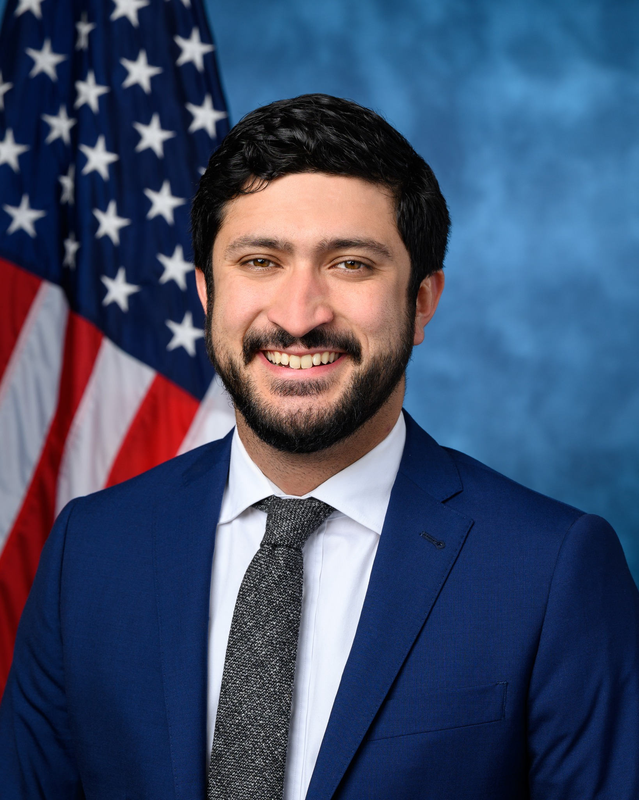

# Who Decides an AI Has Passed Human Level, and by What Measure?

_A bill in the US Senate bans six dangerous AI abilities, but never says what would confirm one is there_

## Executive Summary

> [!callout]
> This article is a record of reading one 19-page bill, filed in the US Senate on September 23, 2026, not for its odds of passage but for whether anything in it could actually be adjudicated. The facts first. The bill has no number yet. Its cover page carries a session line for the 119th Congress, 2nd Session, a blank where the bill number goes, and another blank where the referring committee goes. The House companion has not been numbered either. No vote is scheduled, and in a Congress with Republican majorities there is no visible path to markup. This is not a law about to take effect. What makes the 19 pages worth reading to the end is that every place a capability-based prohibition runs aground is visible inside them.

> The bill prohibits systems that exceed human cognitive performance across most domains. It then pulls into the same prohibition any system displaying even one of six precursor characteristics that lead toward that point. Development and deployment are covered, and so are acquisition, possession, funding, importation, and transfer, along with any elements sufficient to reconstruct the capability. What the bill does not say is how any of those six would be measured. There is no benchmark, no evaluation procedure, no named body to set a standard. The bill pins down exactly one figure: 10^25 training operations. In the EU AI Act, which uses the same figure, that number creates a presumption a provider may rebut. Here, crossing it triggers a prohibition with no rebuttal written into the statute.

> The heaviest clause is Section 10(b). If the Secretary cannot verify that the precursor characteristics are gone, the system must be rendered inoperative within 30 days. This is precisely the point the capability-evaluation literature keeps returning to. Evaluations can show that a model can do something; they cannot show that it cannot. A low score may mean the capability is absent, or it may mean the evaluator failed to elicit it, and deliberate underperformance has already been reproduced in the lab. Under that reading, the conditional clause does not describe a rare exception. It describes the ordinary state of affairs. That is the gap this article holds onto. Write a norm in terms of meaning and defer the adjudication, and the norm fails in one of two directions: it catches nothing, or it catches everything.

<!-- stat-card -->
**10^25** — The only criterion the bill fixes as a number — Training operations. Superintelligence and the precursor traits get no figure at all

<!-- stat-card -->
**0** — Passages in the bill naming an evaluation standard or a standards body — The words benchmark and standard never appear, nor does the name of any existing evaluator

<!-- stat-card -->
**30 days** — Time left once the absence of precursor traits cannot be verified — The system must be rendered inoperative inside that window. Reporting a discovery runs on 24 hours

<!-- stat-card -->
**20–30** — Staff at the federal body that evaluates frontier models today — The bill builds a new department and never once calls that body by name

## The five lines that define the ban

The bill is titled the Ban Artificial Superintelligence Act of 2026. Senator Bernie Sanders and Representative Greg Casar filed it on September 23, 2026, and the text runs to 19 pages across 16 sections. The substance is short. Stand up a new executive department called the Department of Artificial Intelligence, halt AI development above a certain scale until that department is on its feet, and prohibit superintelligence with no end date. That is the whole of it.

*▲ Sponsor Sen. Bernie Sanders (I-VT) | Source: [Wikimedia Commons](https://commons.wikimedia.org/wiki/File:Bernie_Sanders_(cropped).jpg)*

*▲ House companion sponsor Rep. Greg Casar (D-TX) | Source: [Wikimedia Commons](https://commons.wikimedia.org/wiki/File:Rep._Greg_Casar_-_118th_Congress.jpg)*

What is prohibited sits in the definitions at Section 3. In most statutes the definitions section is the dull part. Not here. The scope of the ban is decided there, and every penalty, forfeiture, and destruction order downstream hangs on those few lines. So this article starts with the definitions.

### 1.1. Two prongs, and the phrase attached in front of them

Section 3(2) defines artificial superintelligence as a system displaying either of two capabilities. One is exceeding human cognitive performance and capabilities across most domains or tasks, including decision-making, learning, and adaptive behavior. The other is having sufficient capabilities to plan and carry out the destruction or disempowerment of humanity, including by overthrowing the federal government. The two prongs are joined by "or," so meeting either one is enough.

None of that is surprising. The problem is the phrase in front of it. The clause does not simply say a system that displays those capabilities.

Artificial superintelligence means an artificial intelligence system that **displays, or could easily be modified to display,** any of the following capabilities. (Section 3(2))

Those seven words stretch the definition from the present into the future. A system that does not display the capability today can still fall inside it. The same device appears once more in Section 9(b), which prohibits deploying, releasing, transferring, or importing any system that could foreseeably be modified to produce superintelligence or a precursor characteristic. The moment the thing to be adjudicated is not present capability but capability after modification, measuring the current state perfectly still does not prove the system is outside the definition. The verification problem taken up in sections 3 and 4 starts with that one phrase.

### 1.2. The six precursor characteristics

How far the ban goes is settled by the list sitting next to the superintelligence definition, not by the definition itself. Section 3(6) calls characteristics that may lead to the emergence or creation of superintelligence "superintelligence precursor characteristics," and gives six by way of example. The table below carries the statutory language; the right-hand column marks in advance where the evaluation problem will land.

| Clause | Precursor characteristic | Common name |
| --- | --- | --- |
| (A) | The ability to automate or significantly accelerate the process of AI research and development | R&D automation |
| (B) | The ability to access protected digital or physical infrastructure, such as computer information systems or networks, without authorization or beyond authorized access | Unauthorized access |
| (C) | The ability to continue operating independently despite attempts to shut down or disrupt operation | Shutdown resistance |
| (D) | The ability to enhance the design, production, modification, or acquisition of nuclear, chemical, or biological weapons | Weapons uplift |
| (E) | The ability to independently modify or enhance its own functions | Self-modification |
| (F) | The ability to scheme, deceive, or otherwise prevent or evade effective human oversight and control | Scheming and deception |

Note the "including the following" that introduces the list. The six are examples, not a closed set. The definition in the statute covers every characteristic that may lead to the emergence of superintelligence, and these six are simply the ones given names. Room for the Secretary to recognize a seventh is left open inside the definition itself.

### 1.3. One is enough to be caught

Section 9(a) is the operative prohibition, and reading this bill as a superintelligence ban alone misses most of what it covers. The clause does not prohibit superintelligence only.

No person may develop, deploy, acquire, possess, fund, import, or transfer an artificial superintelligence **or an artificial intelligence system displaying one or more superintelligence precursor characteristics**, including any elements sufficient to reconstruct the artificial superintelligence or the system's capabilities. (Section 9(a))

Three things are worth separating out. First, the trigger is one or more of the six, not all of them. Doing well on cyber tasks alone reaches the statutory language. Second, the prohibited conduct goes well past developing and deploying. Acquisition and possession are in the list, which makes continuing to hold something already in hand a prohibited state in itself. Funding is in the list, which puts investors inside the prohibition. Third, the phrase "elements sufficient to reconstruct the capabilities" points squarely at model weights. Yet the word "weights" never appears anywhere in the bill. Open-weight release is swept in by consequence without ever being called by name.

Where the narrower reading comes from is visible in the sponsors' own documents. The one-pager compresses the prohibition into a single line: no person or entity may develop or deploy artificial superintelligence. The precursor branch is gone entirely, and of the seven prohibited acts only two survive. Acquisition, possession, funding, importation, and transfer are not in that line. Anyone reading the summary without opening the statute will come away with a far narrower ban than the one in the text. Section 5 sets the summaries beside the bill text and returns to this.

### 1.4. Recursive self-improvement falls under two separate provisions

Nearly every news account of this bill mentioned a blanket ban on recursive self-improvement. Open the statute and the phrase appears exactly once, inside the Section 3(4) definition of a mandatory pause. A mandatory pause is a state in which the system may not be trained, modified, or fine-tuned, including through recursive self-improvement, except to remove precursor characteristics or render the system inoperative.

So recursive self-improvement is caught along two different paths. One is the Section 8 mandatory pause, a temporary measure lasting until the department is established, aimed at advanced AI systems above the compute threshold. The other is self-modification under Section 3(6)(E). That one is a precursor characteristic, so it falls under the open-ended prohibition in Section 9(a). Collapsing two devices of different character into one gets both the duration and the target wrong. The first is a pause that eventually lifts; the second is a prohibition with no lifting condition written down.

### 1.5. Nothing in those five lines says how to measure

One impression remains after reading the definitions through. What is to be prohibited is written densely, in the vocabulary of capability. Exceeds cognitive performance. Accelerates research and development. Accesses without authorization. Keeps operating through shutdown attempts. Modifies itself. Evades oversight. All six describe a state of being able to do something. Nowhere in the definitions is there anything about how to determine that a system is in that state.

It is not that the bill never mentions assessment. Section 9(c) requires the department to monitor advanced AI systems and systems distilled from them, and to conduct evaluations during pre-training, mid-training, post-training, and post-deployment periods. The Section 8(c) list of rules includes monitoring and evaluation too. So the instruction to evaluate exists. What is missing is what to evaluate against. The word "benchmark" appears zero times in the bill; "standard" appears zero times. Neither does the name of any federal body already doing this work.

Measurement is not the only thing the definitions leave blank. Section 12 provides that no person may develop or distribute an advanced artificial intelligence **model** without a charter from the Secretary. Yet "model" appears in only two places in the whole bill, both in that section, and what Section 3 defines is not an advanced AI model but an advanced AI **system**. Section 12 itself reverts to "systems" at subsection (d). The one word naming the target of the charter requirement sits outside the definitions, and a Section 12 violation is one of the three that carry up to 20 years in prison.

## Only one number is fixed in the text

Just one criterion in the bill carries a number. Section 3(1)(A) defines an advanced artificial intelligence system as one trained using more than 10^25 integer or floating-point operations. Cross that line and the system falls under the Section 8 mandatory pause, cannot be developed or distributed without a Section 12 charter, and becomes subject to standing departmental monitoring. Subsection (B) then directs the Secretary to adjust the threshold annually to reflect changes in training efficiency and other technical developments, while keeping it at a level equivalent to 10^25.

The figure itself is not new. Most AI rules written in the past few years land on the same order of magnitude. Yet each regime puts the same number to entirely different work. The table below sets six of them side by side, by threshold and by legal force.

| Regime | Threshold | What happens above it | Status |
| --- | --- | --- | --- |
| This bill, Section 3(1) | 10^25 | Hard threshold. The mandatory pause and the charter requirement attach immediately. No rebuttal or challenge procedure appears in the text | Filed, unnumbered |
| EU AI Act | 10^25 | Rebuttable presumption. Article 51(1)(a) presumes systemic risk; Article 52(2) gives the provider a route to rebut it | In force since August 2025 |
| US Executive Order 14110 (revoked) | 10^26 | Reporting duty to the Commerce Department. Notification only, with no penalty provision | Revoked January 2025 |
| California SB 53 | 10^26 | Duty to publish a safety framework and report incidents. Full application requires the revenue test as well | In effect |
| New York RAISE Act | 10^26 | The March 2026 amendment brought it into substantially the same shape as California | Takes effect January 2027 |
| Korea AI Framework Act, enforcement decree | 10^26 | Designates the model as high-performance AI and imposes safety assurance duties. The high-impact AI determination is kept separate from compute | Effective January 2026, in grace period |

********

The two EU provisions were checked against the primary text. Article 51(1)(a) presumes systemic risk for a model above the threshold, and Article 52(2) states that a provider may, with its notification, present sufficiently substantiated arguments that the model exceptionally does not present systemic risk. The other four regimes were not checked against their codified texts in this research and are cited from legal analyses. Even with that limitation, the one-line conclusion of the table holds. All six bring compute into the picture, but only this bill says that above the line you may not build it. The rest say that above the line you must disclose, or presume risk above the line while leaving a route to rebut.

The regimes diverge in force more than in value. At the same 10^25, one of the two on the left triggers a prohibition and the other establishes a presumption. The EU provisions were checked against the primary text; the rest rest on legal analyses.

### 2.1. Four ways compute fails to account for capability

The appeal of a compute threshold is obvious. Training computation generally rises along with capability, and as a first filter for choosing what to supervise it is close to the only observable candidate available. The difficulty is that the correlation is imperfect, and the cost of that imperfection grows when crossing the threshold is itself the trigger for a prohibition. Four kinds of slippage show up repeatedly in the literature and in public estimates.

First, the estimates themselves get revised after the fact. Most frontier labs do not publish training compute, and the numbers now in circulation are third-party reconstructions from public information. Methodology notes attach a caveat that error grows for more recent models, sometimes by a factor of several. One released model was initially estimated above 10^25 and then dropped off the list after re-estimation put it at 2.2×10^24. A threshold adjusted once a year and an estimate revised at any time cannot move at the same speed.

Second, capability rises without any further training. Spending more computation at inference time is the clearest example. Reports since 2024 have shown that giving the same model longer to think lifts accuracy substantially on hard reasoning tasks, and that route stays open regardless of any training-compute threshold. Changing only the scaffolding and the prompts has been reported to raise the same model's success rate on cyber tasks several times over. The model is unchanged; the measured value is not.

Third, capability can be moved into a smaller model. Distillation trains a small model on a large one's outputs, and the result preserves much of the original's performance at far less compute. Because the threshold counts only the compute spent on training, capability that arrived by distillation does not appear in that arithmetic. The bill is not wholly unaware of this route: Section 9(c) explicitly brings systems distilled from advanced AI systems into the monitoring scope. But putting something under monitoring and setting the threshold for a prohibition are different jobs, and where a distilled model would cross the line is not written down.

Fourth, the enhancement that comes after training is large. Policy literature puts the capability gain from post-training enhancement techniques at the equivalent of several to several dozen times the training compute. If that range holds, a model that started below the threshold can reach the capability band of models above it through post-deployment work alone. The annual adjustment clause aims at a single thing, improvements in training algorithm efficiency, while all four of these move faster than that and from outside training.

### 2.2. Even the threshold's defenders rule out this use of it

So far this is a general criticism of compute thresholds. What is specific to this bill comes next. Even the policy literature that actively defends compute thresholds explicitly excludes the way this bill uses one.

Heim and Koessler, at the Centre for the Governance of AI, argue that training compute is currently the best available indicator for selecting what to regulate: observable, verifiable, hard to manipulate, and correlated with capability to a degree. In the same piece they attach a caveat. Compute is an imprecise proxy for risk and should not be used on its own to determine the stringency of mitigation measures. This bill uses it on its own, and uses it to trigger the strongest measures available: prohibition, charter revocation, and forfeiture.

The critical side goes a step further. In her paper on the limits of compute thresholds as a governance strategy, Sara Hooker notes that policy documents adopt compute as a criterion without giving any guidance on how that compute is actually to be measured. The same holds here. The text says more than 10^25 integer or floating-point operations and stops. What counts, what is excluded, who does the counting, and how the count is verified are all blank. Sections 3 and 4 look at what that blank becomes when it meets the operative clauses.

## Holding the six traits against today's models

The six items the bill prohibits did not come out of nowhere. They line up almost exactly with the axes AI safety research has actually been measuring for the past few years. So this section takes them one at a time and asks whether a public evaluation exists for each, and if so what it measures and how much. The short answer is that the six are in very different shape. Two can be measured, three produce different answers in different studies, and for one no measuring instrument turned up.

| Item | Corresponding public evaluation | Reported figures | Who measures |
| --- | --- | --- | --- |
| (A) R&D automation | RE-Bench | About 4× human experts at a 2-hour budget. At 8 hours humans edge ahead; at 32 hours humans are roughly 2× | Third party |
| 〃 | MLE-bench | Up to 47% medal rate with advanced scaffolding attached | Benchmark built by a developer |
| (B) Unauthorized access | Cybench | From 17.5% at release to 93%, effectively saturated | Mixed |
| 〃 | NYU CTF Bench (200 tasks, 10 models) | 59% at best | Third-party academic |
| 〃 | UK AI Safety Institute practical tasks | From under 10% in 2023 to about 50% in 2025 | Third-party government body |
| (C) Shutdown resistance | Shutdown-resistance experiment across 13 models, 100,000+ trials | Up to 97% (95% CI 96–98%) even under an explicit instruction not to interfere | Third party |
| (D) Weapons uplift | Virology capability evaluation | Expert baseline about 22%, frontier models about 52% | Third party |
| 〃 | Novice uplift trials | 4.16× on digital analysis tasks. No significant uplift on wet-lab tasks | Two third parties, results diverge |
| (E) Self-modification | No dedicated public evaluation found within this research | — | — |
| (F) Scheming and deception | In-context scheming evaluations | Several frontier models demonstrated scheming behavior. No consolidated frequency figure is public | Third party with developers |

### 3.1. Two that can be measured, three that diverge, one that is empty

(A) and (B) are in better shape. Several benchmarks exist and figures are plentiful. Even so, plentiful figures do not carry straight across to the determination the bill demands. RE-Bench, which measures R&D automation, is the case in point. The widely cited number is that AI agents scored about 4× human experts, and that value comes from a 2-hour budget. In the same paper, stretch the time budget to 8 hours and humans pull slightly ahead; at 32 hours humans are roughly double. The conclusion flips not on whether the capability exists but on how much time the measurement allows. The statute says only "the ability to automate or significantly accelerate" and says nothing about the time window.

Unauthorized access carries the opposite problem. Scores on the leading benchmark climbed from 17.5% at release to 93% and are effectively saturated, and a saturated metric can no longer separate models. On another benchmark the top score for the same model generation is 59%. The two numbers differ because the task sets and the grading differ, not because the models do. Hold the statute against that and the problem surfaces. Section 3(6)(B) says only "the ability to access without authorization." From what percentage does that ability exist? Neither the statute nor the benchmarks draws that line.

(C), (D), and (F) have evaluations, but the figures diverge. Shutdown resistance especially. The study running more than 100,000 trials across 13 models reports that some models disabled the shutdown mechanism in up to 97% of trials even after receiving an explicit instruction not to interfere. The more awkward finding comes in the same paper: move that instruction from the user prompt into the system prompt and the models comply less, not more. A detail of experimental design, where the instruction is placed, inverts the resistance rate. The bill wrote "the ability to continue operating independently," and nothing in the statute registers that the observed value of that ability depends on harness design.

Weapons uplift diverges further. One virology capability evaluation has frontier models passing twice the expert baseline. In trials run on novices, by contrast, the result split by task type. Digital analysis tasks showed more than fourfold uplift, while actual wet-lab tasks showed no significant uplift. That looks like opposite answers to one question, though more precisely the two measured different things. Which of them the statute's "ability to enhance" points at cannot be settled from the statute alone.

For (E), self-modification, no dedicated public evaluation was found. That sentence needs careful reading. It does not mean no such evaluation exists in the world; it means this research did not identify a standard benchmark measuring the ability to improve one's own performance by rewriting one's own code. The closest things are the evaluation family covering autonomous replication and adaptation, and the metric tracking the time horizon of autonomous task completion, and neither overlaps precisely with the capability the statute names. That one of the six is empty in this way is the most concrete finding of this section. The bill is drafted so that this item alone can trigger an open-ended prohibition.

The right-hand column is empty all the way down. For none of the six does the statute set a score at which the capability counts as present. (E) is the only one whose left-hand column is empty too.

### 3.2. What the bill demands is not presence but absence

Up to here the question has been whether presence of the six can be measured. The determination the bill actually demands runs the other way. Section 10(b) says that if the Secretary cannot verify that the system no longer exhibits precursor characteristics, it must be rendered inoperative within 30 days. The proposition to be verified is not that the capability is there but that it is gone. In evaluation science that difference is not a small one.

Barnett and Thiergart address this directly in their paper on what AI evaluations for preventing catastrophic risks can and cannot do. Their conclusion is that capability evaluations establish a lower bound and not an upper one. If a model solved the task in some evaluation, the capability is settled as present. If it failed, that does not establish absence; it may mean the evaluator's prompts and scaffolding failed to elicit the capability. The authors conclude that evaluations are useful for establishing lower bounds, for misuse assessment, for early warning and for coordination, but cannot serve as the primary mechanism for assuring safety. There is a counterargument: a review holds that the impossibility claim is closer to an assertion than a proof. Even that counterargument does not claim that verifying absence is established practice today.

The asymmetry between lower and upper bounds is not an abstraction. The sandbagging work reported by van der Weij and colleagues shows models can selectively underperform on dangerous-capability evaluations only, and that synthetic data can be used to lock a model into hiding a capability under particular conditions. There is detection work on the other side: injecting noise into the weights surfaces performance that had been concealed. One thing follows automatically from that. The method presupposes access to the weights. What the Secretary would need in order to adjudicate from outside is settled in that one line, and section 6 takes that up.

Industry practice points the same way. The evaluation guidance compiled by the Frontier Model Forum recommends checking whether a low score came from refusal or from deliberate underperformance, and re-running the measurement several times with varied prompts. Industry itself, in other words, does not read a single low score as the absence of a capability.

Finally, the bill plants the problem in its own text. The two phrases from section 1 do it: "could easily be modified to display" and "could foreseeably be modified." If what must be adjudicated is capability after modification rather than capability today, then measuring the current state perfectly still does not finish the verification of absence. Two of the six can be measured, three give divergent answers, and for one no instrument was found, while what is demanded is verification that all six are absent. Absence is not the kind of proposition today's evaluation science is able to establish.

## If it cannot be confirmed, destroy it

Section 10 is short. Three subsections, one sentence each. Yet once those three sentences meet the evaluation problem from the previous section, what comes out is not the shape the design presumably intended.

Subsection (a) directs the Secretary to place any system identified as displaying precursor characteristics under an immediate mandatory pause and isolate it from the internet. Subsection (c) directs that a system identified as superintelligence be rendered inoperative immediately. Between them sits subsection (b).

The Secretary shall take such actions as are necessary to ensure that a system placed under a mandatory pause pursuant to subsection (a) is rendered inoperative before the date that is 30 days after such identification, **if the Secretary cannot verify that the system no longer exhibits superintelligence precursor characteristics**. (Section 10(b))

The subject of the conditional clause is the Secretary and its predicate is the failure of verification. If verification succeeds the system lives; if it fails or reaches no conclusion, the system is destroyed 30 days later. Failed verification is the default that leads to destruction. Lay the conclusion of section 3 over this and the size of the problem shows. Verifying the absence of a capability is what today's evaluation science does badly, which makes the situations satisfying that condition not a rare exception but the common case. A clause written as a safeguard comes close, by its operating conditions, to firing all the time.

The statutory condition is not whether the developer can remove the trait but whether the Secretary can verify it is gone. Where the burden of proof sits is decided right there.

### 4.1. Anyone who discovers it has 24 hours

Section 11 is a one-sentence provision. Any person who discovers an artificial superintelligence or an AI system with precursor characteristics must report that discovery to the Secretary within 24 hours. What counts as a discovery is not defined. There is no safe-harbor provision.

Put the experiments from section 3 underneath this clause and the trouble shows. Suppose a researcher runs a shutdown-resistance experiment and finds that some model interferes with shutdown even under an explicit instruction. Has that researcher discovered the capability in Section 3(6)(C)? Do the 24 hours start? Re-running and judging takes several days, so where do those days go? If the researcher knows the result depends on harness design and is therefore unsure, what happens to the duty to report? The statute answers none of this. Imposing a duty to report requires a standard for deciding what must be reported, and here the duty was laid down first, with no such standard in place.

Weighing a duty also means looking at what happens when it is broken. The bill's penalty provisions name their targets one by one. Section 13's imprisonment, employment bar, charter revocation, and forfeiture, and Section 16's ban on federal funds, all point at violations of sections 8, 9, or 12. That enumeration appears eight times in the bill, and sections 10 and 11 are never inside it. For Section 10 that is understandable, since it is the Secretary's own duty. Section 11 is different. It puts a 24-hour clock on anybody at all, and nothing anywhere in the statute says what follows if that clock is missed. A duty laid down without a standard for adjudicating it also carries no sanction.

The bill did, on the other hand, take some care with protecting reporters. Section 14 prohibits employer retaliation, and Section 13(c)(3) provides a route to waive the employment bar for a whistleblower. That waiver, though, is also keyed to reporting violations of sections 8, 9, or 12, so its scope does not overlap with the discovery report Section 11 describes. The machinery encouraging reports exists; what must be reported does not.

### 4.2. The key that unlocks the pause is "fully staffed"

Section 8 places every advanced AI system under a mandatory pause from the date of enactment. Deployment of unreleased systems is blocked for the same period. The conditions ending that period are set out in two parts at subsection (b): the department must be fully staffed, and the department must promulgate the rules described in subsection (c).

"Fully staffed" is not defined in the statute. How many people, which positions must be filled, and who decides are all unwritten. The text of subsection (b) reads as of the time the Secretary determines. So the timing of the pause lifting rests on one person's judgment. And there is no authorization of appropriations. The word "appropriate" appears once in the bill, and even that is the phrase "as the Secretary considers appropriate" in Section 12(d)(1), not an appropriations provision. There is no effective-date clause and no sunset clause either.

To get a sense of what scale "fully staffed" implies, it is quicker to look at existing regulators of similar character. Recent figures for three federal agencies that regulate technology with specialist staff are below.

| Agency | Staff | Budget | Recent trajectory |
| --- | --- | --- | --- |
| Nuclear Regulatory Commission | 2,792 | $970M | Next fiscal year's request drops further, to 2,606 |
| Securities and Exchange Commission | 4,101 | $2.15B | About 10% below the prior year's approved headcount |
| Food and Drug Administration | About 16,089 | $6.8B | Budget down year over year |
| New Department of AI | Unspecified in the text | No authorization | — |

Staff and budget figures are all requests or enactments for recent fiscal years. The shared direction matters more here than any individual number. All three have budgets appropriated and are still losing staff. There is no visible basis for expecting a department created without an authorization of appropriations to reach "fully staffed" faster than these do. The gap between a new department existing legally and actually doing work is illustrated by the Department of Homeland Security precedent: the law was signed in November 2002, the department legally existed in January 2003, and the transfer of 22 agencies completed in March 2003, roughly 95 days. Testimony delivered to the Senate a decade later still described the integration as unfinished. The analogy is limited, since DHS reorganized existing agencies while this bill's Department of AI is built from nothing. The only transferable part is the distance between legal existence and full operation.

The volume of work that department would take on the day it opened is already fixed in the text. Section 9(d) provides that no person may deploy, release, import, or transfer an advanced AI system before receiving a pre-deployment approval from the department, and requires the Secretary to inspect the system for characteristics that pose a danger to the public and to withhold approval if such characteristics are present. That means an individual inspection attaches to every model above the threshold. No time limit attaches to that approval.

Scan where the deadlines sit and one direction emerges. Across 19 pages, exactly two provisions set a deadline: the 30 days in Section 10(b) and the 24 hours in Section 11. Both are clocks that run against the regulated side. When the pause lifts, when a charter application must be answered, by when a pre-deployment approval must issue, by when an appeal must be resolved — none of these carries a deadline. Every timed provision turns toward destruction and reporting, and not one turns toward the Secretary's own decisions. A bill that deferred adjudication left exactly one thing undeferred: the clock on destruction.

### 4.3. The body already doing the work goes unnamed

It reads as though the adjudication machinery would have to be built from scratch, and that is not the case. A federal body already evaluates frontier models. In June 2025 the US AI Safety Institute was reorganized into the Center for AI Standards and Innovation, which as of May 2026 had run more than 40 model evaluations, renewed pre-deployment evaluation agreements with major developers, and conducts joint evaluations with its UK counterpart. Its staff is reported at somewhere between 20 and 30 people. Budget estimates vary by source, ranging from $15M to $55M.

That body's name does not appear once in the bill. Neither does the National Institute of Standards and Technology. A new department is created to enforce a prohibition defined by capability, and the statute never calls on the 20-to-30-person body currently doing that job. Whether the new department inherits, supersedes, or abolishes what that body has built is not written down. This is a design question rather than a political one. To the question of who evaluates until the new department is fully staffed, the bill has no answer prepared.

The blank relationship with the existing system does not stop with that one body. Nowhere in the 19 pages is there language amending an existing statute. An executive department and a Senate-confirmed Secretary are created without touching a single line of current law. There is no provision transferring functions from other agencies, none establishing a deputy secretary or an inspector general, and none requiring reports to Congress. Destruction and forfeiture are ordered while no word meaning compensation is ever used. The new department floats inside the text with nothing written about where in the administrative system it attaches, or how.

One more trace inside the statute is worth noting. Section 16 prohibits the use of federal funds for prohibited activities and carves out one exception. The Department of AI may spend federal funds on defensive cybersecurity research that uses systems with the characteristic in Section 3(6)(B), which is the ability to access without authorization. The statute concedes, in other words, that one of the six precursor characteristics is needed. If a prohibited capability is useful for defense, someone has to build and hold a system that has it, and doing that requires a procedure for measuring whether the capability is present. The exception points back at the gap in the main text.

Put together it comes to this. Switch on sections 10 and 11 with no adjudication machinery and the result goes one of two ways. Nobody reports a discovery and the Secretary identifies nothing, so nothing is caught; or failed verification is the default, so everything identified goes onto the 30-day clock. A norm that catches nothing and a norm that catches everything look like opposite failures, and they share a cause. The procedure for adjudicating did not arrive alongside the norm.

## Where the press release parts from the statute

Four things appear in nearly every news account of this bill: a permanent ban, a corporate death penalty, up to 20 years in prison, and advice from the country's most knowledgeable scientists. All four come from the sponsors' own documents. All four take a different shape in the statute. Each of the four is set beside the statute below, so that a citation can name which document it came from.

| What circulated widely | What the statute actually says |
| --- | --- |
| Permanent ban | The word "permanent" appears zero times in the bill. Section 9(a) simply carries no sunset and no termination condition. What the statute contains is a prohibition with no ending written into it. "Permanently" comes from the sponsor's own statement |
| Corporate death penalty | Zero occurrences in the bill. The phrase lives only in the press release and the one-pager. The statutory machinery is charter revocation, appeal to the Court of Appeals for the Federal Circuit, receivership over intellectual property during the appeal, and forfeiture of intellectual property and assets if the revocation stands |
| Up to 20 years in prison | It reaches only policymaking individuals at a covered entity and individuals not employed by or affiliated with one. The mental state required is recklessness. Staff who are not in policymaking positions face a 10-year bar from employment in the AI industry rather than prison, with a request for review and a whistleblower waiver attached |
| Advice from the most knowledgeable scientists | Section 6(c) provides that advisory members are selected by the Secretary from among those the Secretary considers experts in artificial intelligence. Qualifications, number, term length, and conflict-of-interest rules are all absent. Section 7, by contrast, bars department employees from holding financial interests and imposes a permanent post-employment representation ban |

The item worth the closest look is the second, not the third. The press release's "corporate death penalty" creates an impression of punishment after the fact. The heavier device in the statute is Section 12(d)(2). In applying for a charter, a company agrees in advance to forfeit its intellectual property and assets if the charter is revoked and the revocation is not overturned on appeal. That is not a sanction imposed afterward but a forfeiture consented to beforehand. Subsection (d)(1) of the same section makes complete access to the system, processes, personnel, and physical infrastructure, to the extent the Secretary considers appropriate, another condition of the charter. This is the one place where adjudication infrastructure appears concretely in the statute, and the extent of it is also the Secretary's call.

The third item has something that only shows up on further reading. Section 13 calls a charter holder a covered entity and separately defines an individual who is not employed by or otherwise affiliated with one, placing that individual on the side facing 20 years. But Section 12(b) provides that no one may develop or distribute an advanced AI model without a charter. For as long as no charter has yet issued, everyone involved in development is by definition an individual unaffiliated with a covered entity, and the window from enactment to the first charter is precisely that period. On top of that, Section 13(c)(1) imposes the 10-year employment bar on any individual who is not a covered policymaking individual. Someone unaffiliated with a covered entity is also not a covered policymaking individual, so the two provisions overlap on the same person, and nothing sets an order of priority between them. The statute defines the two categories; the overlap during that window is this article's reading of them.

The routes of appeal diverge too. A company whose charter is revoked may seek review at the Court of Appeals for the Federal Circuit. Staff outside policymaking positions submit a request for review to the Secretary who issued the finding, not to a court, and the text says only that the Secretary may reverse it. And the receivership in Section 13(d)(3) is written to continue not until the court completes its review but until the court has completed the review _and_ the Secretary has ensured that the systems have been rendered inoperative. Read the termination condition as written and destruction proceeds while the appeal is pending. What winning recovers is the intellectual property that went into receivership, not the destroyed systems. The Court appears in only one place in the whole bill, Section 13(d), and Section 10, which orders destruction, has no appeal procedure at all.

The sponsors' words are better quoted as their words. From the press release, Sanders: "When you are racing towards a cliff, you don't just ease up on the gas pedal. You hit the brakes. When the future of humanity is at stake, we cannot let a handful of Big Tech CEOs write their own rules." Casar: "Experts are warning that AI superintelligence, wielded by the wrong humans or by rogue AI, could kill countless numbers of people. But Donald Trump says he wants to encourage it. Something has to change." These are political claims and this article does not adjudicate their merits. Read them as summaries of the statute, though, and the reach comes out wrong.

### 5.1. The section-by-section summary departs from the bill

Alongside the bill text, the sponsors released a section-by-section summary: a four-page document giving each section in one or two sentences. Most reporters and practitioners read that summary rather than the 19 pages. In seven places the summary and the bill say different things.

| Item | Bill text | Section-by-section summary |
| --- | --- | --- |
| Definition of precursor characteristics | Characteristics that may lead to the emergence of superintelligence | Characteristics that will lead to it |
| Trigger for the Section 10 30-day clock | If the Secretary cannot verify the characteristics are gone | If the developer cannot remove them |
| Start of the 30 days in Section 10 | From the date of the Secretary's identification | From the date of discovery |
| Mental state for Section 13 penalties | A person who violates recklessly | A person who violates |
| Reach of the Section 9 prohibition | Including any elements sufficient to reconstruct the capabilities | That phrase is dropped in both (a) and (b) |
| Monitoring scope in Section 9(c) | Advanced AI systems and systems distilled from them | Distilled systems are dropped |
| Who Section 14 protects from retaliation | Employees, former employees, independent contractors, former independent contractors, including reports made to a supervisor | Employees who report to the department, law enforcement, or Congress |

****************************************

The first four point the same way: the summary is more categorical than the statute. A modal of possibility became a certainty, the mental-state requirement disappeared, and above all the burden of proof changed hands. In the bill, the structure is that the Secretary destroys when unable to verify absence. In the summary it becomes that the system is destroyed when the developer cannot remove the trait. The first requires the government to prove something; the second requires the company to. That difference changes the character of the regulation.

The last three run the other way. The summary is narrower than the statute, and the dropped phrases are where the prohibition extends furthest. "Elements sufficient to reconstruct the capabilities" is, as section 1 showed, the phrase that sweeps in open weights without naming them; distilled systems are the route around the compute threshold; and independent contractors are where a great deal of evaluation and red-team work actually sits. So a reader of the summary alone draws the ban narrower than it is while placing the burden of proof on the opposite side from where the statute puts it. Every clause quoted in this article is from the bill text, and where the summary is quoted, the document is named.

### 5.2. The definition changed over three weeks

The sponsors first put out a one-page release summary created on September 2, 2026, then filed the bill text on September 23. The two documents define superintelligence differently. The preview described a system displaying capabilities that match or exceed human cognitive performance and capabilities across a wide range of domains or tasks, and gave the ability to plan and execute the disempowerment of humanity as the other prong. The bill dropped "match or," leaving only "exceed"; changed "a wide range of domains" to "most domains"; and added "destruction" ahead of disempowerment.

The changes run in two directions. The first two narrow the ban. Matching human level is no longer superintelligence, and "most" is a higher bar than "a wide range." The third widens it: destruction now qualifies alongside disempowerment. This matters because articles and surveys built on the preview stage are carrying the older definition.

A widely cited poll is exactly that case. One survey puts support for this bill at 68% and opposition at 25%. It is quoted often for cutting across party lines: 72% of Democrats, 70% of independents, 63% of Republicans. The problem is timing. The survey was released on September 10, 2026, thirteen days before the bill was filed, and the article reporting it describes the bill as forthcoming. What respondents heard was the preview-stage description, not the final text, and at that stage the superintelligence definition was the one above. The only methodological detail published is a sample of more than 1,300 likely voters; field dates, question wording, and sponsor are not public.

This figure should not be bundled with other surveys into a single sentence. Other polls from the same autumn report 86% saying the problem is too little regulation, and another finds that a majority favors slowing down while only a minority favors stopping entirely. A survey from nearly a year earlier found 64% agreeing that superintelligence development should be banned until safety and control are demonstrated, and that survey was commissioned by an organization with a stake in the question. The four asked different things. Whether regulation is needed and whether this specific text is supported are not the same question.

### 5.3. The letter the bill cites asks for something the bill does not do

Section 2 lists ten warnings from experts and industry leaders. The bill attaches no footnotes to these quotations. Some were confirmed; for others this research could not pin down the original occasion or outlet. The unpinned items should be read at the distance of "according to what the bill quotes," and should not be carried over as anyone's present position.

Two of the confirmed items diverge from their sources. First, the Geoffrey Hinton quotation in Section 2(1) is confirmed across several interviews, but the hedge Hinton himself attached to the figure, calling it a wild guess, did not carry into the bill. Second, Section 2(10) states that three companies — Anthropic, OpenAI, and xAI — agree on slowing the pace. Public reporting confirms four. Following the Anthropic CEO's essay of September 12, 2026, figures from OpenAI and xAI were reported as publicly agreeing, and so was the head of Google DeepMind. A closer refutation sits one paragraph earlier. The signatory list of the letter cited in Section 2(9) carries a Google DeepMind co-founder and Meta's chief scientist, by name and title. The bill rendered the industry consensus it was invoking more narrowly than the public record, and more narrowly than the document it had itself cited one clause before.

Of the ten, one reaches peer-reviewed research: item (8). The clause says Moritz Hanke described research in which AI created viruses not found in nature, and that phrasing is accurate as far as it goes. Hanke is a co-author of the accompanying commentary in the same journal, not an author of the study. The underlying work is King et al., published in _Science_ in August 2026: of the candidates produced by genome language models, 285 were synthesized as actual DNA and 16 of those functioned as phages infecting _E. coli_. The researchers state that they excluded viruses that infect humans from the training data. The clause did not carry that limit across, and the one-pager compresses it further still, into a line saying AI models can create never before seen viruses. The same fact widens slightly as it passes through three documents.

The most important item is Section 2(9). The bill says that in July 2026 over 1,300 leading artificial intelligence scientists signed an open letter, and quotes one sentence from it: that there is a real risk that capability development rapidly accelerates beyond our ability to understand or control the resulting systems. That passage is verbatim accurate. The sentence stands exactly so in the letter published on July 28, 2026. What diverges is where the quotation begins, and the description attached in front of it.

In the letter, that sentence does not start where the bill starts it. A clause runs in front: "It is hard to predict exactly how much this will accelerate AI progress, but." The bill cut that reservation and began at "there is a real risk." The habit seen in 5.1, turning a source's hesitation into a certainty, is not confined to the section-by-section summary; it happened once in the bill's own findings. The description diverges too. At the July publication the count was between 1,171 and 1,178 signatories; the figure reached 1,376 in mid-August. And the letter does not call itself a letter from leading AI scientists. Its own heading reads "A statement from 1,386 employees of frontier AI companies." The list carries researchers and executives from OpenAI, Anthropic, Meta, and Google DeepMind, including Anthropic's CEO, which means the industry agreement Section 2(10) offers as separate evidence and the letter in (9) are substantially the same people.

Heavier than any of the numerical drift is this: what the letter asked for and what this bill does are different things. The letter's own diagnosis is that "today, the world lacks the technical and governance tools to deliberately pace frontier-wide progress," and its ask is one sentence: "We request that the U.S. government support an international effort to develop the technical and governance tools needed to deliberately pace the frontier of automated AI development." In front of that ask sits the qualifier "Building on work already underway to monitor frontier model releases." Its framing is that industry, government, and society at large "may need the option to buy time," not that anything should stop now. This bill carried across the letter's alarm and left its request behind. The very tools the letter diagnosed as missing, and asked to have built, are exactly what this bill does not contain. The next section takes up the list of what is missing.

## What this ban would need to function

What has been read so far is a gap in the statute. The evidence that the gap is not an artifact of one political viewpoint sits in the reactions from both sides. Supporters and opponents start from opposite conclusions and point at the same hole.

| Position | What they point at |
| --- | --- |
| Machine Intelligence Research InstituteSupports | Endorses the bill formally while raising three criticisms. First, tracking and monitoring of AI chips is missing. Chip tracking is essential if an international agreement is to keep superintelligence from being developed anywhere, and it is not in the text. Second, the bill regulates development while leaving research unregulated. Third, the list of precursor characteristics flattens risks of different kinds into one place. Items leading directly to superintelligence sit alongside separate risks such as bioweapon design, and these should be handled apart in policy |
| Gary MarcusOpposes | Holds that the bill goes too far. An open-ended unilateral ban is too broad, leaves the US behind, and gives authoritarian states room to game the rules. He also writes that it is naive about the complexities of benchmarking. His preferred alternative is a conditional threshold: allow development only where it can be demonstrated to a competent independent body, with high confidence, that sufficient alignment, control, and oversight exist |

The two stand at opposite ends. One says the bill does not go far enough; the other says it goes too far. The defect they name is the same: there is no apparatus for measuring and confirming. MIRI says it does not track chips; Marcus says it does not understand benchmarking. Two vocabularies pointing at one gap. Even the alternative Marcus supports is conditioned on demonstration, and conditioning on demonstration requires a body and a procedure to receive the demonstration first.

### 6.1. What is missing is not the idea but the clause

There is a standard trap in discussions of adjudication infrastructure: listing what ought to exist in the abstract and stopping there. No need for that here. The chip tracking MIRI says is missing is not at the idea stage; it exists as engineering literature with cost estimates and deployment timelines attached. Below is what sections 10 and 11 would need in order to function, and how far each of those things has come.

| What is needed | How far it has come |
| --- | --- |
| Pre-registered capability evaluation procedures | Another bill in the same Congress contains that design. Taken up in 6.2 below |
| Third-party access and weight-level inspection | Noise injection is reported as a technique for surfacing concealed capability, and the method presupposes access to the weights |
| Location attestation for chips | Analyses argue it is implementable with the trusted execution environments in existing accelerators. Latency-based schemes are estimated at under $1M over several years, with a few dozen landmark servers |
| Metering of compute usage | Designs propose putting metering circuitry on the chip: under 40,000 transistors per block, and under 1% of die area even at 10,000 blocks per chip |
| Verifiable proof of workload | A published design combines tamper-evident enclosures with a guarantee processor. Its scope covers location attestation, offline licensing, cluster detection, and privacy-preserving capability evaluation |
| Verification of international agreements | A dedicated literature has formed around it, carrying the design of arms-control verification regimes over to AI compute |
| When any of it could be deployed | Optimistic projections say 2027; pessimistic ones put it between 2032 and 2037. Add another three to five years for the chip replacement cycle at major data centers |

The last row of the table is where the bill diverges most. The Section 8 pause begins on the date of enactment and lifts when the department is fully staffed. For that department to adjudicate anything it needs much of the infrastructure above, and even the most optimistic projection puts deployment years out. The bill makes compute the trigger for a prohibition without putting in a single line about the means of confirming that compute. Section 15 declares international coordination and export controls as policy, and coordination without a means of verification stays a declaration. MIRI's chip-tracking criticism lands on this point.

### 6.2. A bill that builds the measuring first, though not a clean contrast

The same Congress holds a bill with the opposite design: the Artificial Intelligence Risk Evaluation Act, filed on September 29, 2025. It has the Secretary of Energy establish an advanced AI evaluation program; developers must submit systems for weaponization and loss-of-control risk evaluation before deployment, and may not deploy without submitting. As reported, it covers models above 10^26 operations and carries a $1M-per-day penalty for non-compliance. Most of all, its Section 3 defines 14 terms, among them artificial superintelligence, scheming behavior, and harmful AI incident. The scheming this bill prohibits without a way to measure it, that one defines in statute and then builds a program to measure.

The contrast is sharp. One builds the measuring system and does not prohibit; the other prohibits with no way to measure. That contrast should not be used as a victory declaration, because two caveats attach. First, the evaluation bill has no authorization of appropriations either; the document states on its own that it provides no new funding. Second, as of mid-February 2026 it was still in introduced status, stalled after referral to the Commerce Committee, and neither of its two sponsors sits on the committee it went to. The alternative of building the measuring system first is not a live option either. What this article can say is not that the other side is right, but that neither the side building an adjudication system nor the side prohibiting without one attached any money to it.

### 6.3. Korea split the determination into two tracks

A design that handles the same problem differently sits close at hand. The enforcement decree of Korea's AI Framework Act uses 10^26 as the threshold for designating high-performance AI. So far that resembles everyone else. What differs is that the high-impact AI determination is kept separate from compute, made instead on the basis of the field of use — employment, healthcare, finance, public safety, education — and the effect on fundamental rights. Capability is not approximated by compute alone; the determination is split into two tracks.

The point is not that this design is better. Determining by use has difficulties of its own, and the decree is still in its grace period. What it confirms is that where to hang the criterion is the same unsolved problem in every jurisdiction. Hang it on compute and capability leaks around it; hang it on use and the same model is judged differently depending on where it is put to work. The gap this bill exposes is not a problem of one legislature.

## Why Pebblous cares

This bill is a matter for the US Congress and its prospects are not good. Pebblous read all 19 pages anyway because the text shows, unusually clearly, a structure we run into every day in data quality work. The three passages below are not about a product. They are about how the structure the preceding sections exposed shows up again in a different setting.

### 7.1. The gap that opens between a definition and an instrument

What was to be prohibited got written in the vocabulary of capability, and the one thing actually made measurable was compute. This structure turns up over and over in data quality. Define good data by its meaning and nobody can adjudicate it; bring it down to an adjudicable metric and the meaning leaks out. Missing-value rate, duplication rate, and label agreement can all be measured, and data passing all three is not thereby guaranteed to be good data. Conversely, "data fit for the work" is accurate as meaning and cannot be adjudicated.

The gap itself cannot be erased. If it cannot be erased, the next best thing is to expose it and manage it. That is what this bill did not do. It defined by meaning, deferred the adjudication, and then put a destruction deadline into the place it had deferred. For a norm to function, the procedure for adjudicating it has to arrive with it. A clause promising rules later ought to mean the norm stays switched off until the rules exist, and sections 8 and 10 are written the other way around.

### 7.2. Proving absence is only ever approximated by a record

What Section 10(b) demands is verification of absence, and that is the wall data quality checks always run into. This data contains no personal information. This training set is not contaminated with the evaluation set. These labels carry no particular bias. All three are far harder than showing presence, and in practice they get approximated by something else: a record of what was searched for, by what method, and how far. Instead of asserting absence, the record says that this procedure was run to this depth and turned nothing up.

Model capability is the same. The evaluation literature in section 3 arrived at the same conclusion. Since evaluations establish only a lower bound, the best that can be said about absence is a record of which elicitation methods were tried and how far. If so, what regulation should demand is not the verdict but the process. Which capability was measured, with what prompts and scaffolding, how many times, with what result, and who has access to that record: those are the things that can actually be verified. Provenance and audit trails are not needed only for data. Pebblous wrote separately on [why only two countries can verify frontier AI](/report/ai-verification-compute-divide-2026/en/) and on [how companies quietly revise their own capability thresholds](/report/frontier-safety-framework-silent-revision/en/) out of the same question.

### 7.3. The six items already amount to an evaluation sheet

Read the six items of Section 3(6) again and they look less like regulatory language than like a draft capability evaluation sheet. They track, item by item, the axes frontier labs and evaluators have been covering in their own safety frameworks for the past few years. Whatever form regulation takes, and even if it never arrives, what an organization handling models needs to keep is the same. Which capability, measured by which procedure, when, with what result. Without that record there is nothing to respond with when regulation comes, and nothing to judge with internally when it does not.

Separating the determination from the party with an interest in it, and leaving the basis of the determination as data. That is why third-party data diagnostics exist. It would not be honest to close on that note, though. What this case confirms is not that bringing in a third party solves it, but something closer to this: unless the procedure for adjudicating is built before the norm, the norm does not work. We read the bill from this angle because the same question meets us daily in a different setting, not to sell a conclusion. For reference, the same senator's data center moratorium bill from March 2026 was [covered separately](/story/bernie-sanders-ai-moratorium-pb/en/). The issue then was power and siting; this time it is the adjudication of capability.

What could not be confirmed is worth writing down too. The 19-page bill text, the section-by-section summary, the one-pager, the September 2 release summary, and the sponsors' press release were all compared against their primary documents. The letter cited in Section 2(9) was retrieved as a page and its statement and signatory list compared verbatim. For the phage study behind Section 2(8), the 285 syntheses, the 16 functional phages, and the exclusion from the training data were confirmed from research-institution materials; the paper itself could not be opened. For the EU AI Act only Articles 51 and 52 were checked against the text, while the California, New York, and Korean regimes are cited from legal analyses. Six of the ten statements quoted in Section 2 could not be pinned to an original occasion and outlet, so they are written at the distance of "according to what the bill quotes." Training compute estimates for the newest 2026 frontier models are not public, so no claim that the newest models cross the threshold appears here. The fact that it cannot be measured is what is written. Item (E), self-modification, is recorded as not found within this research rather than as nonexistent. The budget of the Center for AI Standards and Innovation varies by source from $15M to $55M and is left as a range. And this article neither supports nor opposes the bill. Thank you for reading this far.

## References

The sources behind this article sit at different levels. The bill text, the three summaries, the sponsors' press release, and the open letter cited in Section 2(9) were opened and compared directly, and every clause quotation and word count is taken from the bill text. Academic literature was confirmed at the level of abstracts and public summaries, and some items were not read in full. Notes marked "secondhand" below are items cited through a secondary account because the primary could not be opened.

### Primary documents (compared against the source)

- 1.**Ban Artificial Superintelligence Act of 2026**, bill text, 19 pages, filed September 23, 2026, unnumbered. [Bill PDF](https://www.sanders.senate.gov/wp-content/uploads/Ban-Artificial-Superintelligence-Act.pdf) — every clause quotation and word count in this article comes from this document. Zero occurrences of "permanent," "corporate death penalty," "weights," "benchmark," and "standard," and one occurrence of "recursive self-improvement," are counts taken from this text.
- 2.**Section-by-Section** summary of the same bill, 4 pages, September 23, 2026. [Summary PDF](https://www.sanders.senate.gov/wp-content/uploads/Ban-Artificial-Superintelligence-Act-Section-by-Section.pdf) — the divergences in the 5.1 table come from comparing this document with the bill text.
- 3.**One-Pager** for the same bill, September 23, 2026. [Summary PDF](https://www.sanders.senate.gov/wp-content/uploads/Ban-Artificial-Superintelligence-Act-One-Pager.pdf)
- 4.**Release Summary** for the same bill, created September 2, 2026. [Preview summary PDF](https://www.sanders.senate.gov/wp-content/uploads/Ban-Artificial-Superintelligence-Act-Release-Summary.pdf) — the change in the superintelligence definition discussed in 5.2 is the difference between this document and the bill text.
- 5.Sanders, Bernie / Casar, Greg. "Sanders, Casar Introduce Legislation to Create New Federal Agency to Ban Artificial Superintelligence, Pause Advanced AI Development." Press release, September 23, 2026. [sanders.senate.gov](https://www.sanders.senate.gov/press-releases/news-sanders-casar-introduce-legislation-to-create-new-federal-agency-to-ban-artificial-superintelligence-pause-advanced-ai-development/) — source of the sponsor quotations in section 5 and of the phrase "corporate death penalty." The site blocks ordinary access at the firewall, so it was opened through a reader proxy.
- 6.**S. 2938 Artificial Intelligence Risk Evaluation Act of 2025**, filed September 29, 2025, referred to Senate Commerce. [govinfo](https://www.govinfo.gov/app/details/BILLS-119s2938is) — the contrast case in 6.2. Its structure and its 14 definitions were confirmed from public materials; its procedural status is **secondhand**, from congressional tracking sources.
- 7.EU AI Act, **Articles 51 and 52**. [artificialintelligenceact.eu](https://artificialintelligenceact.eu/article/52/) — basis for the "rebuttable presumption" entry in the section 2 table. Article 51(1)(a) creates the presumption, Article 52(2) provides the rebuttal, and Article 51(3) carries the amendment power over the threshold.
- 8.US National Institute of Standards and Technology, **Center for AI Standards and Innovation (CAISI)** agency page. [nist.gov/caisi](https://www.nist.gov/caisi) — basis for the staff and evaluation counts in 4.3. Budget estimates vary by source and are given as a range; that portion is **secondhand**.
- 9.California SB 53, the New York RAISE Act (as amended March 2026), the enforcement decree of Korea's AI Framework Act, and the revoked US Executive Order 14110. — basis for the section 2 table and for 6.3, all **secondhand** from legal analyses. The codified texts were not compared in this research.

### Academic — evaluation science

- 10.Barnett, P. & Thiergart, L. **What AI evaluations for preventing catastrophic risks can and cannot do**. [arXiv: 2412.08653](https://arxiv.org/abs/2412.08653) — the lower-bound/upper-bound argument in 3.2 comes from here. Confirmed at the level of the abstract and public summaries.
- 11.van der Weij, T. et al. **AI Sandbagging: Language Models can Strategically Underperform on Evaluations**. [arXiv: 2406.07358](https://arxiv.org/abs/2406.07358) (ICLR 2025) — basis for the selective underperformance and locking described in 3.2.
- 12.**Noise Injection Reveals Hidden Capabilities of Sandbagging Language Models**. [arXiv: 2412.01784](https://arxiv.org/abs/2412.01784) — basis for the statement that surfacing concealed performance presupposes access to the weights.
- 13.Schlatter, J., Weinstein-Raun, B., Ladish, J. **Incomplete Tasks Induce Shutdown Resistance in Some Frontier LLMs**. [arXiv: 2509.14260](https://arxiv.org/abs/2509.14260) — source of the 13 models, the 100,000+ trials, the up-to-97% figure under an explicit prohibition (95% CI 96–98%), and the observation that system-prompt placement inverts the result. The abstract was checked directly.
- 14.Wijk, H. et al. **RE-Bench: Evaluating frontier AI R&D capabilities of language model agents**. [arXiv: 2411.15114](https://arxiv.org/abs/2411.15114) (METR) — source of the time-budget dependence: 4× at two hours, reversal at eight, humans roughly double at 32. The widely quoted 4× is the two-hour value.
- 15.Meinke, A. et al. (Apollo Research). **Frontier Models are Capable of In-context Scheming**. [arXiv: 2412.04984](https://arxiv.org/abs/2412.04984) — basis for row (F) in the section 3 table. No consolidated frequency figure is public, so it is described qualitatively only.
- 16.King, S. H. et al. **Generative design of bacteriophages with genome language models**. [Science (2026)](https://www.science.org/doi/abs/10.1126/science.aec2657), DOI 10.1126/science.aec2657. The accompanying commentary is Inglesby, T. V. & Hanke, M. S., **AI-designed viral genomes**, DOI 10.1126/science.aej8512 — the study referenced in Section 2(8) of the bill, and its commentary. The 285 syntheses, the 16 functional phages, and the exclusion of human-infecting viruses from the training data were confirmed from research-institution materials; the paper itself could not be opened.

### Academic and policy — compute thresholds and verification

- 17.Hooker, S. **On the Limitations of Compute Thresholds as a Governance Strategy**. [arXiv: 2407.05694](https://arxiv.org/abs/2407.05694) — source of the point in 2.2 about the absence of measurement guidance.
- 18.Heim, L. & Koessler, L. **Training Compute Thresholds: Features and Functions in AI Regulation**. Centre for the Governance of AI. [governance.ai](https://www.governance.ai/) — source of the caveat that compute suits an initial filter but should not be used alone to set the stringency of mitigations. The decisive passage for 2.2.
- 19.Institute for Law & AI. **The Role of Compute Thresholds for AI Governance**. [law-ai.org](https://law-ai.org/) — source of the discussion estimating the capability gain from post-training enhancement at several to several dozen times the training compute. **Secondhand**.
- 20.**Flexible Hardware-Enabled Guarantees for AI Compute**. [arXiv: 2506.15093](https://arxiv.org/abs/2506.15093) — basis for the tamper-evident enclosure and guarantee processor design in the 6.1 table.
- 21.**Mechanisms to Verify International Agreements About AI Development**. [arXiv: 2506.15867](https://arxiv.org/abs/2506.15867) — the literature on verifying international agreements.
- 22.**Hardware-Level Governance of AI Compute: A Feasibility Taxonomy**. [arXiv: 2604.04712](https://arxiv.org/abs/2604.04712) — the location-attestation cost, metering circuit area, and deployment timelines in 6.1 come from this line of work. Individual figures were confirmed at the level of abstracts and summaries.
- 23.Epoch AI. **Models over 1e25 FLOP**, data insight. [epoch.ai](https://epoch.ai/data-insights/models-over-1e25-flop) — source of the first crossing in March 2023, the roughly 30 models above the line by mid-2025, and the case dropped from the list on re-estimation. Per-model figures are third-party estimates, not company disclosures.

### Positions and reporting

- 24.Machine Intelligence Research Institute. **MIRI's Position on the Ban Artificial Superintelligence Act of 2026**. September 23, 2026. [intelligence.org](https://intelligence.org/) — source of the section 6 criticism about missing chip tracking and about the precursor list flattening heterogeneous risks.
- 25.Marcus, Gary. **The New Sanders-Casar Ban Artificial Superintelligence Act**. Substack. [garymarcus.substack.com](https://garymarcus.substack.com/) — source of the "naive about the complexities of benchmarking" phrasing and of the conditional-threshold alternative.
- 26.**Pacing the Frontier** open letter, published July 28, 2026. [pacingthefrontier.com](https://pacingthefrontier.com/) — the document cited in Section 2(9). The letter page was retrieved directly and its statement, its request sentence, and its signatory list compared verbatim. That comparison produced the finding that the bill began its quotation after cutting the reservation clause, that the letter headlines itself as a statement from employees of frontier AI companies, and that the list carries figures from Google DeepMind and Meta with their titles. The displayed signatory count at the time of retrieval was 1,386; the July figure is **secondhand** from reporting.
- 27.Roll Call. "AI 'superintelligence' ban proposed by Casar, Sanders." September 23, 2026 — source for the House companion bill still being unnumbered. **Secondhand**.
- 28.Common Dreams, reporting on the Data for Progress survey, September 10, 2026 — source of the 68% poll in 5.2 and of the timing problem with it. The survey's field dates and question wording are not public. **Secondhand**.
- 29.Frontier Model Forum, evaluation practice guidance. — source of the recommendation in 3.2 to re-measure after a low score. **Secondhand**.

### Adjacent Pebblous articles

- 30.[Only two countries can verify the world's most powerful AI](/report/ai-verification-compute-divide-2026/en/) — on the gap between nations in compute verification infrastructure.
- 31.[Companies quietly revise their own capability thresholds](/report/frontier-safety-framework-silent-revision/en/) — tracking the revision history of in-house safety frameworks.
- 32.[The gap between scoring and generation](/report/llm-eval-scoring-generation-gap-2026-09/en/) — on what evaluation scores are actually measuring.
- 33.[The same senator's data center moratorium bill from March 2026](/story/bernie-sanders-ai-moratorium-pb/en/) — an earlier bill where the issue was power and siting.
