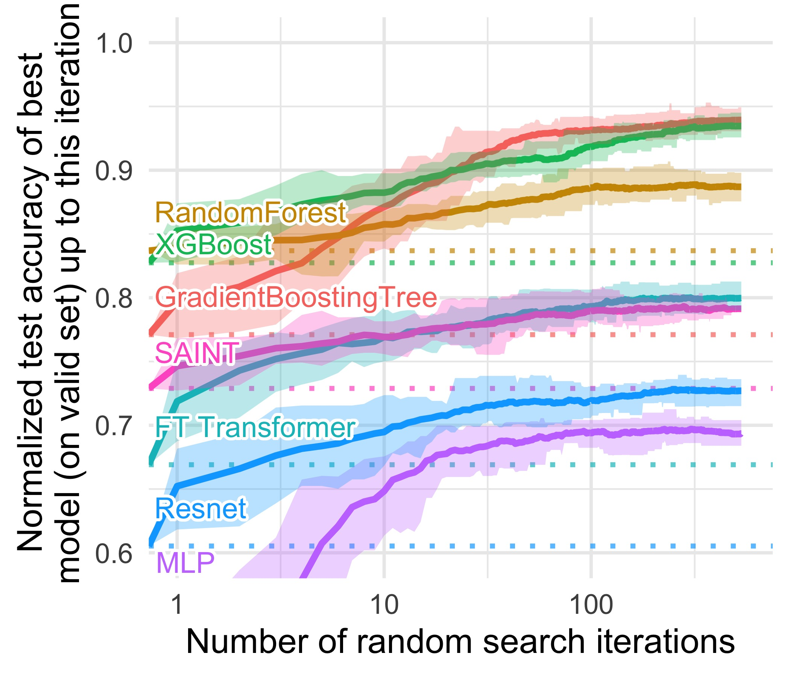
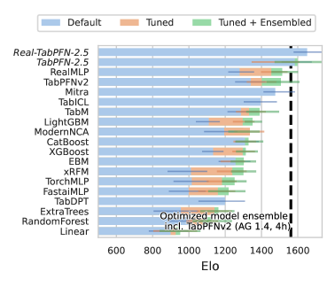
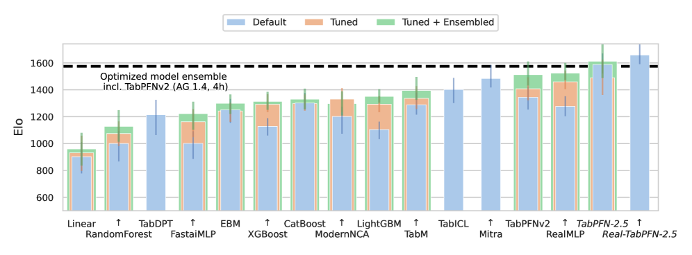

# The Model Is Ready — But Are Your Tables?

_SAP_

## Executive Summary

> [!callout]
> For the past four years, the center of gravity in generative AI has leaned toward text and images. Yet the ERP, CRM, and financial tables where most enterprise value actually sits stayed the domain of XGBoost and hand-built feature engineering. The thing that finally moved into that gap is the tabular foundation model (TFM). TabPFN, built by Prior Labs in Freiburg, Germany, is pretrained once on synthetic data and then, at inference time, reads a real table whole and predicts immediately, with no retraining. The shift is as real as the gap it leaves behind.

> On May 4, 2026, SAP — the world's largest ERP vendor — announced it would acquire the 18-month-old Prior Labs and invest more than €1B (about $1.16B) over four years to grow it into an independent frontier lab. On the same day it also bought the data lakehouse company Dremio. The message: a foundation model specialized for "the structured data that runs the world's business" is the next battleground of enterprise AI. But a model being ready does not mean the data is.

> A TFM ingests the input table as-is, with no retraining. That means missing values, schema drift, non-standard code values, and label noise flow straight through to degraded performance. Data scientists still spend roughly 60% of their time cleaning and organizing, and bad data costs the average company an estimated $12.9M a year. The stronger the model gets, the higher the marginal value of clean input climbs. That paradox is the real question this acquisition leaves behind.

<!-- stat-card -->
**2.8s vs 4h** — A single inference beats a 4-hour tuned ensemble — Nature 2025, small-to-mid datasets

<!-- stat-card -->
**100% win rate** — Against default-setting XGBoost — TabPFN-2.5 report, small-to-mid only

<!-- stat-card -->
**60%** — Of a data scientist's time spent cleaning — A bottleneck faster models don't remove

<!-- stat-card -->
**1,000×** — Growth in rows handled (2022→2026) — v1 1K rows → TabPFN-3 1M rows

## The Four Years Unstructured Data Won — and Where Structured Data Stayed

From late 2022 on, every conversation about AI flowed toward text and images. While chatbots wrote documents and diffusion models painted pictures, the phrase "foundation model" quietly became a synonym for "language model." Yet the data enterprises actually use to make decisions every day is neither sentences nor photographs. It is tables — sales ledgers, customer tiers, equipment sensor logs, financial records, all arranged in rows and columns. And for the past decade, the most powerful tool on this structured data never changed: gradient-boosted decision trees (GBDT), above all XGBoost and its relatives.

Even as deep learning conquered images and language, tree-based models held their ground on tabular data. A 2022 NeurIPS paper summed up the situation in its very title: "Why do tree-based models still outperform deep learning on typical tabular data?" Tabular data carries features whose meaning and scale differ column to column, laced with irregular patterns and missing values that neural networks handle poorly. So the standard hardened: train a fresh model for every dataset and tune its hyperparameters for days.

The trouble is that this approach devours human time endlessly. Training a new model means first reshaping the data into something the model can digest — filling missing values, standardizing categories, reconciling code values that each department defines differently. Several surveys converge on the same number: data scientists spend about 60% of their working hours cleaning and organizing data, and if you widen the lens to all of data preparation, that share reaches 80%. Modeling is the tip of the iceberg; most of the mass below the surface is data work.

*▲ Normalized classification accuracy vs. hyperparameter search iterations — XGBoost and GradientBoostingTree consistently outperform FT Transformer, Resnet, and MLP on 15 numerical tabular datasets. | Source: [Grinsztajn et al., NeurIPS 2022 (arXiv:2207.08815)](https://arxiv.org/abs/2207.08815)*

> [!callout]
> Structured-data AI fell behind not for lack of technology, but because the structure demanded a freshly molded model for every dataset. While text and images crossed into the foundation-model era — "train one giant model once, then reuse it as-is" — tabular data never made that leap. The TFM aims squarely at that last frontier.

## A Model That 'Reads' Tables — How TabPFN Works

TabPFN's formal name is prior-data fitted network, i.e., a network fitted on prior data. The mechanism in one sentence: a transformer, pretrained on millions of synthetic table problems, takes the entire training set as input at inference time and produces predictions in a single forward pass. Rather than learning anew from the table, it reads the table like a prompt; that is the closest intuition.

Ordinary machine learning, handed a dataset, readjusts the model's weights to fit that data. TabPFN skips that step. During pretraining it has already learned the very skill of "solving table problems." Its developers generated an enormous number of hypothetical tabular datasets and showed them to the model, which learned to generalize the statistical regularities within them. So when a real, unseen table arrives, feeding in the labeled examples alongside the prediction targets lets the model reason out the answer in-context. It is the same trick by which a language model picks up a pattern from a handful of examples, now applied to tabular data.

The heart of this architecture is that attention operates across both rows (samples) and columns (features). The model weighs, at the same time, how each data row resembles the others and how each feature contributes to the outcome. It is fundamentally different from GBDT's cycle of retraining and tuning for every new dataset. A model built once and laid directly over the table — a foundation model in the true sense — has entered the structured-data domain for the first time.

*▲ TabPFN v2 mechanism — the input table (Feature Tokenizer) is converted to a Tabular Context; Self-Attention operates across both rows (samples) and columns (features), delivering predictions in a single forward pass. | Source: ["A Closer Look at TabPFN v2" (arXiv:2502.17361)](https://arxiv.org/abs/2502.17361)*

This model did not handle large data from the start. Over four years it rapidly scaled up the table sizes it could process. The table below traces that evolution from v1 to TabPFN-3.

| Version | When | Rows handled | Significance |
| --- | --- | --- | --- |
| TabPFN v1 | 2022 (ICLR 2023) | ~1,000 rows | Proof of concept: "solve a small table in one second" |
| TabPFN v2 | 2025 (Nature) | ~10,000 rows | Nature publication; beats a 4-hour tuned ensemble |
| TabPFN-2.5 | 2025-11 | ~50,000 rows | Reports 100% win rate vs. default XGBoost |
| TabPFN-3 | 2026-05 | ~1,000,000 rows | 1M rows on a single H100; mixes time-series, relational, and text |

In four years the number of rows it can handle grew 1,000-fold. It started as a proof of concept on tiny tables and reached the scale of real enterprise work. That expansion, however, does not mean "it works everywhere." The next section examines the limits.

## The Performance Nature Certified — and Its Limits

The decisive moment for TabPFN came with its publication in Nature in January 2025. Across 29 classification datasets and 28 regression datasets, the authors reported that a single TabPFN v2 inference (2.8 seconds) surpassed, by a wide margin, the accuracy of a baseline ensemble tuned for four hours. The comparison set included CatBoost, often regarded as a top contender on structured data. What was striking was less the result than the method: a single inference replacing work that used to mean days of repeated training and tuning.

That performance comes with clear conditions. Per Nature, the range v2 handles well is roughly up to 10,000 rows, 500 features, and 10 classes. TabPFN is "the champion of small data," and that is both its strength and its boundary. The follow-up TabPFN-2.5 technical report claimed a 100% win rate against default-setting XGBoost on small-to-mid datasets, a number that, again, must be read within the "small-to-mid" qualifier.

Move to large data and the story changes. One comparative study noted that on large datasets a TFM might have to accept up to a 40,000× inference-latency penalty to gain 0.8% in accuracy (based on T4 GPU experiments). The honest framing is not "it replaces GBDT everywhere" but "it is fast and strong on small-to-mid structured data." The table below sets the strengths and limits side by side.

| Situation | Where TabPFN stands |
| --- | --- |
| Small-to-mid tables (≤10K rows) | A 2.8s single inference beats a 4-hour tuned ensemble; high win rate vs. default XGBoost |
| Large tables | Up to 40,000× latency for a 0.8% gain — diminishing returns on cost |
| Academic evaluation | SOTA across hundreds of independent studies; 1,000+ citations, 3M+ downloads |

*▲ TabArena-Lite classification benchmark Elo scores — TabPFN-2.5 ranks highest among 18 models including XGBoost, CatBoost, and TabPFNv2 (dashed line: 4-hour tuned AutoGluon ensemble baseline). | Source: [Prior Labs TabPFN-2.5 Technical Report (arXiv:2511.08667)](https://arxiv.org/abs/2511.08667)*

One phrasing needs correcting. Coverage of the acquisition often rendered it as "ranked first across hundreds of benchmarks," but SAP's official press release actually said TabPFN was "evaluated as state-of-the-art in hundreds of independent academic studies." That evaluation is not vague rhetoric; it is backed by adoption metrics. The TabPFN family has logged over 1,000 academic citations and more than 3 million cumulative downloads, taking hold quickly in research. The "first place" on a standard leaderboard, though, is specific to one benchmark — TabArena, with 51 datasets. And because TabArena's creators include people from the same lab, a possible self-evaluation bias is also flagged. The performance is genuinely impressive, but the citation should be precise.

## What SAP Bet On — Anatomy of the Prior Labs Deal

The first thing to set straight is the number that gets garbled most often. What SAP disclosed was not a "$1 billion acquisition price." The core of the May 4, 2026 announcement is a commitment to invest more than €1B (about $1.16B) over four years, after acquiring Prior Labs, to grow it into an independent frontier lab. The actual purchase price is undisclosed. It reads accurately as an investment commitment to an 18-month-old startup.

Several intentions stand out in SAP's design. First, Prior Labs will keep operating independently after the acquisition — a choice to preserve the talent and pace of frontier research rather than absorb it into an internal org. Its advisory board includes deep-learning luminaries Yann LeCun and Bernhard Schölkopf. Second, on the same day SAP also acquired the data lakehouse company Dremio. Securing the model layer (Prior Labs) and the data layer (Dremio) at once is a comprehensive data-platform strategy.

*▲ TabPFN-2.5 TabArena benchmark — surpassing the 4-hour tuned AutoGluon ensemble baseline (dashed line) on most datasets, providing the performance foundation behind SAP's €1B+ commitment. | Source: [Prior Labs TabPFN-2.5 Technical Report (arXiv:2511.08667)](https://arxiv.org/abs/2511.08667)*

### Why would an ERP vendor buy a foundation model?

SAP's home turf is the ERP of enterprises worldwide — accounting, procurement, HR, and supply-chain data. Definitions vary, but SAP serves hundreds of thousands of customers across its full product range, and its reach is often described with the phrase "90% of the Fortune 500." A foundation model that runs directly on top of this vast trove of structured data becomes an asset rivals can't easily match once it is combined with SAP's business-AI assistant Joule or the data-driven HANA. The logic of the bet is that the data type TabPFN specializes in overlaps exactly with the data type SAP holds.

The geographic context matters too. Prior Labs is based in Freiburg, Germany. Amid the EU's push for sovereign AI and technological self-reliance through the AI Act, the positioning as "Europe's first frontier lab specialized in structured data" works in SAP's favor on both the regulatory and policy fronts. That stands in contrast to the rivals eyeing the same battleground — Databricks, Snowflake, Google, AWS, Salesforce — most of which are U.S. companies.

> [!callout]
> The message of this acquisition is clear. The world's largest ERP vendor has officially declared that "a foundation model specialized for structured data is the next battleground of enterprise AI." It bought the model layer and the data layer at once, and folded its European location into the strategy as well. The remaining question shifts to the enterprise side: if the model is ready, is the data you would feed it ready?

## The Model Is Ready — But Are Your Tables?

The greatest appeal of a TFM is that it needs no retraining. Yet that very fact raises the stakes for data quality. Because the model takes the input table as-is and reasons in-context, any flaw in the table is not diluted during training but reflected directly in the prediction. Missing values, schemas that differ by department, non-standardized code values, duplicate definitions, and label noise all disturb the attention. When you retrain a model from scratch, the cleaning step still filtered some of this out; in a "read the table as-is" architecture, the quality of the input is the performance.

The problem is that most enterprise tables are not clean. The numbers below show the "the model is ready, but the data?" gap.

#### 78–87%

AI adoption rate

Enterprise AI adoption is already mainstream (McKinsey 2025).

#### 44%

Manufacturing ERP that is AI-ready

Yet fewer than half of datasets are actually ready to feed a model.

#### 5.5%

High performers with meaningful EBIT gains

Adoption is widespread, but few have turned it into actual profit.

Almost everyone has adopted, but fewer than half have data that is ready, and only a handful have turned it into profit. The gap between those points is, in essence, a data-quality problem. Gartner's estimate — that data scientists still spend 60% of their time cleaning, and that bad data costs the average company $12.9M a year — shows the price of that gap. The more a TFM removes the modeling bottleneck, the more the bottleneck shifts toward data quality.

### A TFM-ready data checklist

So what should a practitioner wondering "how do we feed our ERP and CRM data to a TFM?" check first? Here are five things to verify on the data side before adopting the model.

- •**Schema consistency** — Are columns with the same meaning scattered under different names and formats across systems? Has the schema drifted over time?
- •**Missing-value handling** — Is it defined what an empty value means (zero? not entered? not applicable?)?
- •**Code-value standardization** — Are category codes that each department or region uses differently consolidated to a single standard?
- •**Deduplication** — Is the same entity defined redundantly across multiple rows, distorting the patterns?
- •**Label noise** — Is the prediction target label itself consistent and accurate? Mislabeled data directly ruins the inference.

These five are not new demands. They are the basics that data governance has preached for years. What changed is the value of those basics. The era in which a model absorbed some flaws through retraining is fading, and as models that read input as-is arrive, the marginal value of clean data has only grown. The paradox at the heart of this shift is that as models grow more powerful, data quality does not matter less — it matters more.

> [!callout]
> **Editor's Note.** This report read SAP's acquisition of Prior Labs through the lens of "the model is ready, but the data?" The AI-Ready Data and DataClinic work that Pebblous pursues sits exactly where data is diagnosed and repaired before it enters a model, and it overlaps with the "TFM-ready data" gap this piece identified. That judgment, though, is for each reader to test against their own data environment; there is no need to read this article's conclusion as a claim of any particular product's superiority.

## References

### Academic · Papers

- 1.Hollmann, N., Müller, S., Purucker, L., Krishnakumar, A., Körfer, M., Hoo, S. B., Schirrmeister, R. T., Hutter, F. "[Accurate predictions on small data with a tabular foundation model](https://doi.org/10.1038/s41586-024-08328-6)." Nature 637(8045):319–326, 2025.
- 2.Hollmann, N., Müller, S., Eggensperger, K., Hutter, F. "[TabPFN: A Transformer That Solves Small Tabular Classification Problems in a Second](https://arxiv.org/abs/2207.01848)." ICLR 2023 (arXiv:2207.01848).
- 3.Prior Labs. "[TabPFN-2.5: Advancing the State of the Art in Tabular Foundation Models](https://arxiv.org/abs/2511.08667)." Technical Report, 2025 (arXiv:2511.08667).
- 4.Prior Labs. "TabPFN-3 Technical Report." 2026-05-12 (arXiv:2605.13986).
- 5."On the Limits of Tabular Foundation Models at Scale." 2025 (arXiv:2512.00888) — balanced evidence on the speed-accuracy tradeoff.
- 6.Grinsztajn, L., Oyallon, E., Varoquaux, G. "[Why do tree-based models still outperform deep learning on typical tabular data?](https://arxiv.org/abs/2207.08815)" NeurIPS 2022 (arXiv:2207.08815).

### Industry · Events

- 7.SAP. "SAP to acquire Prior Labs and invest in tabular foundation model research." news.sap.com official press release, 2026-05-04.
- 8.The Next Web. "SAP acquires Prior Labs to build Europe's first structured-data frontier lab." thenextweb.com, 2026-05-04.
- 9.TabArena. "A Living Benchmark for Tabular Machine Learning." tabarena.ai — includes a self-evaluation bias caveat.

### Policy · Statistics · Data Quality

- 10.CrowdFlower (Figure Eight). "Data Science Report 2016" — the 60%/80% data-preparation statistics.
- 11.Gartner. "How to Improve Your Data Quality" — estimate of $12.9M average annual cost of bad data, 2020–2021.
- 12.McKinsey. "The State of AI in 2025" — 78% AI adoption rate; 5.5% high performers with EBIT gains (n=1,993, 105 countries).
