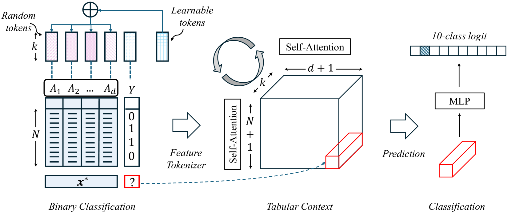

# 모델은 준비됐다, 그런데 당신의 테이블은?

_SAP의 Prior Labs 인수가 알리는 구조화 데이터 AI의 전환점 — TabPFN과 테이블형 파운데이션 모델이 바꾸는 ERP·CRM·재무 데이터의 미래_

## Executive Summary

> [!callout]
> 지난 4년간 생성형 AI의 무게중심은 텍스트와 이미지에 쏠려 있었다. 정작 기업 가치의 대부분이 잠겨 있는 ERP·CRM·재무 테이블은 여전히 XGBoost와 수작업 피처 엔지니어링의 영역으로 남았다. 그 공백을 메운 것이 테이블형 파운데이션 모델(Tabular Foundation Model, TFM)이다. 독일 프라이부르크의 Prior Labs가 만든 TabPFN은 합성 데이터로 한 번 사전학습한 뒤, 추론 시점에 실제 표를 통째로 읽어 재학습 없이 곧바로 예측한다. 전환의 크기만큼, 그 전환이 남기는 빈자리도 분명하다.

> 2026년 5월 4일, 세계 최대 ERP 사업자 SAP는 창업 18개월 된 Prior Labs를 인수하고 4년간 €10억(약 $1.16B) 이상을 투자해 독립 프론티어 랩으로 키우겠다고 발표했다. 같은 날 데이터 레이크하우스 Dremio도 함께 사들였다. "세상의 비즈니스를 굴리는 구조화 데이터"에 특화한 파운데이션 모델이 엔터프라이즈 AI의 다음 전장이라는 선언이다. 그러나 모델이 준비됐다고 데이터가 준비된 것은 아니다.

> TFM은 재학습 없이 입력 표를 그대로 받아들인다. 그래서 결측·스키마 드리프트·비표준 코드값·라벨 노이즈가 곧장 성능 저하로 직결된다. 데이터 과학자는 여전히 시간의 60%를 정제와 정리에 쓰고, 불량 데이터는 기업당 연평균 $12.9M의 손실을 부른다. 모델이 강력해질수록 깨끗한 입력의 한계 효용은 오히려 커진다. 이 역설이 이번 인수가 남기는 진짜 질문이다.

<!-- stat-card -->
**2.8초 vs 4시간** — 단일 추론이 4시간 튜닝 앙상블 능가 — Nature 2025, 소~중형 데이터셋

<!-- stat-card -->
**100% 승률** — 기본 설정 XGBoost 대비 — TabPFN-2.5 기술보고서, 소~중형 한정

<!-- stat-card -->
**60%** — 데이터 과학자 시간 중 정제 비중 — 모델이 빨라져도 줄지 않는 병목

<!-- stat-card -->
**1,000배** — 처리 가능 행 수 확장 (2022→2026) — v1 1천 행 → TabPFN-3 100만 행

## 비정형이 독식한 4년, 정형 데이터가 머문 자리

2022년 말부터 AI의 모든 화제는 텍스트와 이미지로 흘러갔다. 챗봇이 문서를 쓰고, 확산 모델이 그림을 그리는 동안, 파운데이션 모델이라는 단어는 곧 언어 모델과 동의어가 됐다. 그런데 정작 기업이 매일 의사결정을 내리는 데이터는 문장도 사진도 아니다. 매출 전표, 고객 등급, 설비 센서 로그, 재무 원장처럼 행과 열로 정리된 표(테이블)다. 이런 정형 데이터에서 가장 강력한 도구는 지난 10년 내내 변하지 않았다. 그래디언트 부스팅 결정 트리(GBDT), 그중에서도 XGBoost와 그 친척들이었다.

딥러닝이 이미지와 언어를 평정하는 동안에도 표 데이터만큼은 트리 기반 모델이 자리를 지켰다. 2022년 NeurIPS에 발표된 한 연구는 제목부터 그 사정을 요약한다. "왜 트리 기반 모델은 전형적인 정형 데이터에서 여전히 딥러닝을 능가하는가." 표 데이터는 특성마다 의미와 척도가 제각각이고, 불규칙한 패턴과 결측이 섞여 있어 신경망이 잘 다루지 못했다. 그래서 데이터 한 벌마다 모델을 새로 학습시키고, 하이퍼파라미터를 며칠씩 튜닝하는 방식이 표준으로 굳었다.

문제는 이 방식이 사람의 시간을 끝없이 잡아먹는다는 데 있다. 모델을 새로 학습시키려면 먼저 데이터를 모델이 먹을 수 있는 형태로 다듬어야 한다. 결측값을 채우고, 범주를 표준화하고, 부서마다 다르게 정의된 코드값을 맞추는 일이다. 여러 조사가 일관되게 말하는 숫자가 있다. 데이터 과학자는 업무 시간의 약 60%를 데이터 정제와 정리에 쓰고, 데이터 준비 전체로 넓히면 그 비중은 80%에 이른다. 모델링은 빙산의 일각이고, 그 아래 잠긴 대부분이 데이터 작업이다.

*▲ 하이퍼파라미터 탐색 횟수 대비 정규화 분류 정확도 — XGBoost·GradientBoostingTree가 FT Transformer·Resnet·MLP를 일관되게 앞선다. | Source: [Grinsztajn et al., NeurIPS 2022 (arXiv:2207.08815)](https://arxiv.org/abs/2207.08815)*

> [!callout]
> 정형 데이터 AI가 뒤처진 것은 기술이 없어서가 아니라, 데이터마다 모델을 새로 빚어야 하는 구조 때문이었다. 텍스트와 이미지가 "한 번 학습한 거대 모델을 그대로 가져다 쓰는" 파운데이션 모델 시대로 넘어가는 동안, 표 데이터는 그 도약을 하지 못한 채 남아 있었다. TFM은 바로 그 마지막 영역을 겨냥한다.

## 표를 '읽는' 모델 — TabPFN은 어떻게 작동하는가

TabPFN의 정식 이름은 prior-data fitted network, 즉 사전 데이터로 적합시킨 신경망이다. 작동 원리를 한 문장으로 옮기면 이렇다. 수백만 개의 합성 표 문제로 미리 학습해 둔 트랜스포머가, 추론 시점에 실제 학습 데이터 전체를 한꺼번에 입력으로 받아 단 한 번의 forward pass로 예측을 내놓는다. 표를 보고 새로 학습하는 것이 아니라, 표를 프롬프트처럼 읽는다고 이해하면 가깝다.

일반적인 머신러닝은 데이터를 받으면 그 데이터에 맞춰 모델 가중치를 새로 조정한다. TabPFN은 그 과정을 건너뛴다. 사전학습 단계에서 이미 "표 데이터의 문제를 푸는 법" 자체를 배워 두었기 때문이다. 개발자들은 무수히 많은 가상의 표 데이터셋을 만들어 모델에게 보여 주었고, 모델은 그 안에서 통계적 규칙을 일반화하는 능력을 익혔다. 그래서 처음 보는 실제 표가 들어와도, 학습된 데이터와 예측 대상을 함께 입력으로 넣어 주면 in-context로 답을 추론한다. 언어 모델이 예시 몇 개만 보고 패턴을 따라잡는 것과 같은 방식이 표 데이터에 적용된 셈이다.

이 구조의 핵심은 어텐션이 행(샘플)과 열(특성) 양쪽에 걸쳐 작동한다는 데 있다. 모델은 각 데이터 행이 서로 어떻게 닮았는지, 그리고 각 특성이 결과에 어떻게 기여하는지를 동시에 따져 본다. 새 데이터마다 학습과 튜닝을 반복하던 GBDT의 방식과 근본적으로 다르다. 한 번 만들어 둔 모델을 표 위에 그대로 올려놓는, 진정한 의미의 파운데이션 모델이 정형 데이터 영역에 처음 들어선 것이다.

*▲ TabPFN v2 작동 메커니즘 — 입력 표(Feature Tokenizer)를 Tabular Context로 변환한 뒤, 행(샘플)·열(특성) 양쪽에 걸쳐 Self-Attention을 적용해 단 한 번의 순전파로 예측을 내놓는다. | Source: ["A Closer Look at TabPFN v2" (arXiv:2502.17361)](https://arxiv.org/abs/2502.17361)*

이 모델은 처음부터 큰 데이터를 다룬 것이 아니다. 4년 동안 처리할 수 있는 표의 크기를 빠르게 키워 왔다. 아래 표는 v1부터 TabPFN-3까지의 진화를 정리한 것이다.

| 버전 | 시점 | 처리 가능 행 수 | 의미 |
| --- | --- | --- | --- |
| TabPFN v1 | 2022 (ICLR 2023) | 약 1,000행 | "1초 만에 작은 표를 푼다"는 개념 증명 |
| TabPFN v2 | 2025 (Nature) | 약 10,000행 | Nature 게재, 4시간 튜닝 앙상블 능가 |
| TabPFN-2.5 | 2025-11 | 약 50,000행 | 기본 XGBoost 대비 100% 승률 보고 |
| TabPFN-3 | 2026-05 | 약 1,000,000행 | 단일 H100에서 100만 행, 시계열·관계형·텍스트 혼합 |

4년 만에 처리 가능한 행 수가 1,000배 늘었다. 작은 표의 개념 증명에서 출발해 기업 실무 규모에 닿은 셈이다. 다만 이 확장이 곧 "어디서나 통한다"는 뜻은 아니다. 다음 절에서 그 경계를 따져 본다.

## Nature가 인증한 성능과 그 경계

TabPFN이 주목받은 결정적 계기는 2025년 1월 Nature 게재다. 연구진은 29개 분류 데이터셋과 28개 회귀 데이터셋에서, TabPFN v2의 단일 추론(2.8초)이 4시간 동안 튜닝한 베이스라인 앙상블의 정확도를 큰 격차로 능가한다고 보고했다. 비교 대상에는 정형 데이터의 최강자로 꼽히는 CatBoost가 포함됐다. 학습과 튜닝을 며칠씩 반복하던 작업을 추론 한 번이 대체했다는 점에서, 결과 자체보다 그 방식이 충격이었다.

다만 이 성능에는 분명한 조건이 붙는다. Nature 기준 v2가 잘 다루는 범위는 대략 1만 행, 500개 특성, 10개 클래스 이하다. TabPFN은 "작은 데이터의 강자"이고, 바로 그 점이 강점이자 경계다. 후속 TabPFN-2.5 기술보고서는 소~중형 데이터셋에서 기본 설정 XGBoost를 상대로 100% 승률을 기록했다고 밝혔는데, 이 수치 역시 소~중형이라는 단서 안에서 읽어야 한다.

대규모 데이터로 넘어가면 이야기가 달라진다. 한 비교 연구는 대형 데이터셋에서 TFM이 0.8%의 정확도 향상을 얻기 위해 최대 4만 배의 추론 지연을 감수해야 할 수 있다고 지적했다(T4 GPU 실험 기준). 정직한 서술은 "모든 곳에서 GBDT를 대체한다"가 아니라 "소~중형 정형 데이터에서 빠르고 강하다"이다. 아래 표는 강점과 경계를 나란히 정리한 것이다.

| 상황 | TabPFN의 위치 |
| --- | --- |
| 소~중형 표 (≤1만 행) | 2.8초 단일 추론으로 4시간 튜닝 앙상블 능가, 기본 XGBoost 대비 높은 승률 |
| 대규모 표 | 0.8% 향상에 최대 4만 배 지연 가능 — 비용 대비 이득이 줄어듦 |
| 학술 평가 | 수백 건의 독립 연구에서 SOTA, 인용 1,000회+·다운로드 300만회+ |

*▲ TabArena-Lite 분류 벤치마크 Elo 점수 — TabPFN-2.5가 XGBoost·CatBoost·TabPFNv2를 포함한 18개 모델 중 최상위(점선: 4시간 튜닝 앙상블 기준선)에 위치한다. | Source: [Prior Labs TabPFN-2.5 Technical Report (arXiv:2511.08667)](https://arxiv.org/abs/2511.08667)*

한 가지 표현은 바로잡을 필요가 있다. 이번 인수를 다룬 기사들은 종종 "수백 개 벤치마크에서 1위"라고 옮겼지만, SAP 공식 보도자료의 원문은 "수백 건의 독립 학술 연구(hundreds of independent academic studies)에서 최신 성능으로 평가됐다"이다. 그 평가는 막연한 수사가 아니라 채택 지표로 뒷받침된다. TabPFN 계열은 학술 인용 1,000회 이상, 누적 다운로드 300만 회 이상을 기록하며 연구 현장에 빠르게 자리 잡았다. 다만 표준 리더보드에서의 1위는 TabArena라는 특정 벤치마크(51개 데이터셋)에 한정된 이야기다. 게다가 TabArena 제작진에 동일 연구실 인력이 포함돼 있어 자가평가 편향 가능성이 함께 지적된다. 성능은 분명 인상적이지만, 인용은 정확하게 해야 한다.

## SAP는 무엇에 베팅했나 — Prior Labs 인수의 해부

가장 먼저 정리할 것은 흔히 잘못 옮겨지는 숫자다. SAP가 공개한 것은 "10억 달러 인수가"가 아니다. 2026년 5월 4일 발표의 핵심은 Prior Labs를 인수한 뒤 4년간 €10억(약 $1.16B) 이상을 투자해 독립 프론티어 랩으로 키우겠다는 약정이다. 실제 인수 대금은 비공개다. 창업 18개월 된 스타트업에 대한 투자 약정으로 읽어야 정확하다.

SAP의 설계에는 몇 가지 의도가 또렷하게 드러난다. 첫째, Prior Labs는 인수 후에도 독립적으로 운영된다. 프론티어 연구의 인재와 속도를 사내 조직에 흡수하지 않고 보존하려는 선택이다. 자문위원회에는 딥러닝의 대가 얀 르쿤(Yann LeCun)과 베른하르트 쇨코프(Bernhard Schölkopf)가 이름을 올렸다. 둘째, SAP는 같은 날 데이터 레이크하우스 기업 Dremio도 인수했다. 모델 레이어(Prior Labs)와 데이터 레이어(Dremio)를 동시에 확보하는, 포괄적 데이터 플랫폼 전략이다.

*▲ TabPFN-2.5 TabArena 벤치마크 성능 — 점선(4시간 튜닝 AutoGluon 앙상블)을 넘어서며 SAP의 €10억 베팅 근거를 뒷받침한다. | Source: [Prior Labs TabPFN-2.5 Technical Report (arXiv:2511.08667)](https://arxiv.org/abs/2511.08667)*

### 왜 ERP 사업자가 파운데이션 모델을 사는가

SAP의 본진은 전 세계 기업의 ERP, 즉 회계·구매·인사·공급망 데이터다. 정의에 따라 다르지만 SAP는 전 제품군 기준 수십만 곳의 고객사를 두고 있고, 흔히 "Fortune 500의 90%"라는 표현으로 그 영향력을 설명한다. 이 거대한 정형 데이터 위에서 곧바로 작동하는 파운데이션 모델은, SAP의 비즈니스 AI 비서 Joule이나 데이터 기반 HANA와 결합했을 때 경쟁사가 쉽게 따라오기 어려운 자산이 된다. TabPFN이 특화한 데이터 유형이 SAP가 보유한 데이터 유형과 정확히 겹친다는 점이 이 베팅의 논리다.

지리적 맥락도 빠뜨릴 수 없다. Prior Labs는 독일 프라이부르크에 기반을 두고 있다. EU가 AI 주권(sovereign AI)과 AI Act를 통해 역내 기술 자립을 강조하는 흐름 속에서, "유럽 최초의 구조화 데이터 특화 프론티어 랩"이라는 포지셔닝은 규제와 정책 양쪽에서 SAP에 유리하게 작동한다. 같은 전장을 노리는 Databricks·Snowflake·Google·AWS·Salesforce가 대부분 미국 기업이라는 점과 대비된다.

> [!callout]
> 이번 인수의 메시지는 분명하다. 세계 최대 ERP 사업자가 "정형 데이터에 특화된 파운데이션 모델이 엔터프라이즈 AI의 다음 전장"이라고 공식 선언한 것이다. 모델 레이어와 데이터 레이어를 동시에 사들이고, 유럽이라는 위치까지 전략에 포함시켰다. 남은 질문은 기업 쪽으로 넘어온다. 모델이 준비됐다면, 그 모델에 태울 데이터는 준비됐는가.

## 모델은 준비됐다 — 그런데 당신의 테이블은?

TFM의 가장 큰 매력은 재학습이 필요 없다는 점이다. 그런데 바로 그 점이 데이터 품질의 중요성을 키운다. 모델이 입력 표를 그대로 받아들여 in-context로 추론하므로, 표에 담긴 결함이 학습 과정에서 희석되지 않고 예측에 직접 반영된다. 결측, 부서마다 다른 스키마, 표준화되지 않은 코드값, 중복 정의, 라벨 노이즈가 모두 어텐션을 교란한다. 모델을 새로 학습시킬 때는 그래도 정제 과정에서 일부가 걸러졌지만, "표를 그대로 읽는" 구조에서는 입력의 품질이 곧 성능이다.

문제는 대부분의 기업 표가 깨끗하지 않다는 데 있다. 아래 숫자들은 "모델은 준비됐는데 데이터는?"이라는 격차를 보여 준다.

#### 78~87%

AI 도입률

기업의 AI 도입은 이미 보편화됐다(McKinsey 2025).

#### 44%

제조 ERP의 AI-ready 비율

정작 데이터가 모델에 태울 준비가 된 경우는 절반에 못 미친다.

#### 5.5%

EBIT 의미 있는 개선 고성과자

도입은 많아도 실제 수익으로 연결한 곳은 드물다.

도입은 거의 다 했지만, 데이터가 준비된 곳은 절반에 못 미치고, 수익으로 연결한 곳은 한 줌이다. 그 사이의 간극이 곧 데이터 품질의 문제다. 데이터 과학자가 시간의 60%를 여전히 정제에 쓰고, 불량 데이터가 기업당 연평균 $12.9M의 손실로 이어진다는 Gartner 추산은 이 간극의 비용을 보여 준다. TFM이 모델링이라는 병목을 없앨수록, 병목은 데이터 품질 쪽으로 옮겨 간다.

### TFM-ready 데이터 준비 체크리스트

그렇다면 "우리 ERP·CRM 데이터를 TFM에 어떻게 태울까"를 고민하는 실무자는 무엇을 먼저 점검해야 할까. 모델 도입에 앞서 데이터 쪽에서 확인할 다섯 가지를 정리했다.

- •**스키마 정합성** — 같은 의미의 열이 시스템마다 다른 이름·형식으로 흩어져 있지 않은가. 시간에 따라 스키마가 드리프트하지 않았는가.
- •**결측 처리** — 빈 값이 무엇을 뜻하는지(0인지, 미입력인지, 해당 없음인지) 정의돼 있는가.
- •**코드값 표준화** — 부서·지역마다 다르게 쓰는 범주 코드가 하나의 기준으로 정리돼 있는가.
- •**중복 제거** — 같은 실체가 여러 행으로 중복 정의돼 패턴을 왜곡하지 않는가.
- •**라벨 노이즈** — 예측 대상이 되는 라벨 자체가 일관되고 정확한가. 잘못 붙은 라벨은 추론을 직접 망친다.

이 다섯 가지는 새로운 요구가 아니다. 데이터 거버넌스가 오래 말해 온 기본기다. 달라진 것은 그 기본기의 가치다. 모델이 재학습으로 결함을 일부 흡수해 주던 시대가 저물고, 입력을 그대로 읽는 모델이 들어오면서, 깨끗한 데이터의 한계 효용이 오히려 커졌다. 모델이 강력해질수록 데이터 품질이 덜 중요해지는 것이 아니라 더 중요해진다는 역설, 그것이 이번 전환의 핵심이다.

> [!callout]
> **Editor's Note.** 이 리포트는 SAP의 Prior Labs 인수를 "모델은 준비됐다, 그런데 데이터는?"이라는 렌즈로 읽었다. 페블러스가 추구하는 AI-Ready Data와 DataClinic은 데이터가 모델에 들어가기 전 그 품질을 진단·정비하는 자리에 있고, 이 글이 짚은 "TFM-ready 데이터" 준비의 빈자리와 겹친다. 다만 그 판단은 독자 각자의 데이터 환경에서 검증될 몫이며, 이 글의 결론을 특정 제품의 우월성 주장으로 읽을 필요는 없다.

## 참고문헌

### 학술 · 논문

- 1.Hollmann, N., Müller, S., Purucker, L., Krishnakumar, A., Körfer, M., Hoo, S. B., Schirrmeister, R. T., Hutter, F. "[Accurate predictions on small data with a tabular foundation model](https://doi.org/10.1038/s41586-024-08328-6)." Nature 637(8045):319–326, 2025.
- 2.Hollmann, N., Müller, S., Eggensperger, K., Hutter, F. "[TabPFN: A Transformer That Solves Small Tabular Classification Problems in a Second](https://arxiv.org/abs/2207.01848)." ICLR 2023 (arXiv:2207.01848).
- 3.Prior Labs. "[TabPFN-2.5: Advancing the State of the Art in Tabular Foundation Models](https://arxiv.org/abs/2511.08667)." Technical Report, 2025 (arXiv:2511.08667).
- 4.Prior Labs. "TabPFN-3 Technical Report." 2026-05-12 (arXiv:2605.13986).
- 5."On the Limits of Tabular Foundation Models at Scale." 2025 (arXiv:2512.00888) — 속도·정확도 절충에 관한 균형 근거.
- 6.Grinsztajn, L., Oyallon, E., Varoquaux, G. "[Why do tree-based models still outperform deep learning on typical tabular data?](https://arxiv.org/abs/2207.08815)" NeurIPS 2022 (arXiv:2207.08815).

### 산업 · 사건

- 7.SAP. "SAP to acquire Prior Labs and invest in tabular foundation model research." news.sap.com 공식 보도자료, 2026-05-04.
- 8.The Next Web. "SAP acquires Prior Labs to build Europe's first structured-data frontier lab." thenextweb.com, 2026-05-04.
- 9.TabArena. "A Living Benchmark for Tabular Machine Learning." tabarena.ai — 자가평가 편향 단서 포함.

### 정책 · 통계 · 데이터 품질

- 10.CrowdFlower (Figure Eight). "Data Science Report 2016" — 데이터 준비 60%/80% 통계.
- 11.Gartner. "How to Improve Your Data Quality" — 불량 데이터 연평균 $12.9M 손실 추산, 2020–2021.
- 12.McKinsey. "The State of AI in 2025" — AI 도입률 78%·EBIT 고성과자 5.5%(n=1,993, 105개국).
