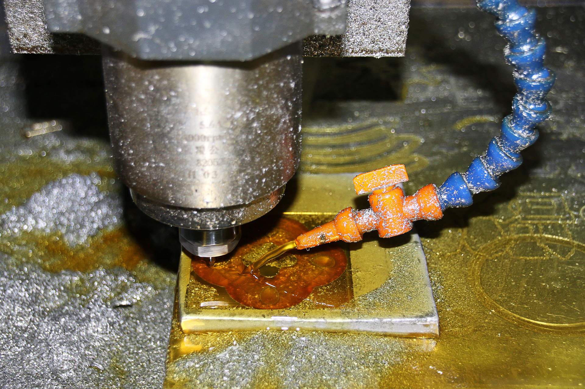
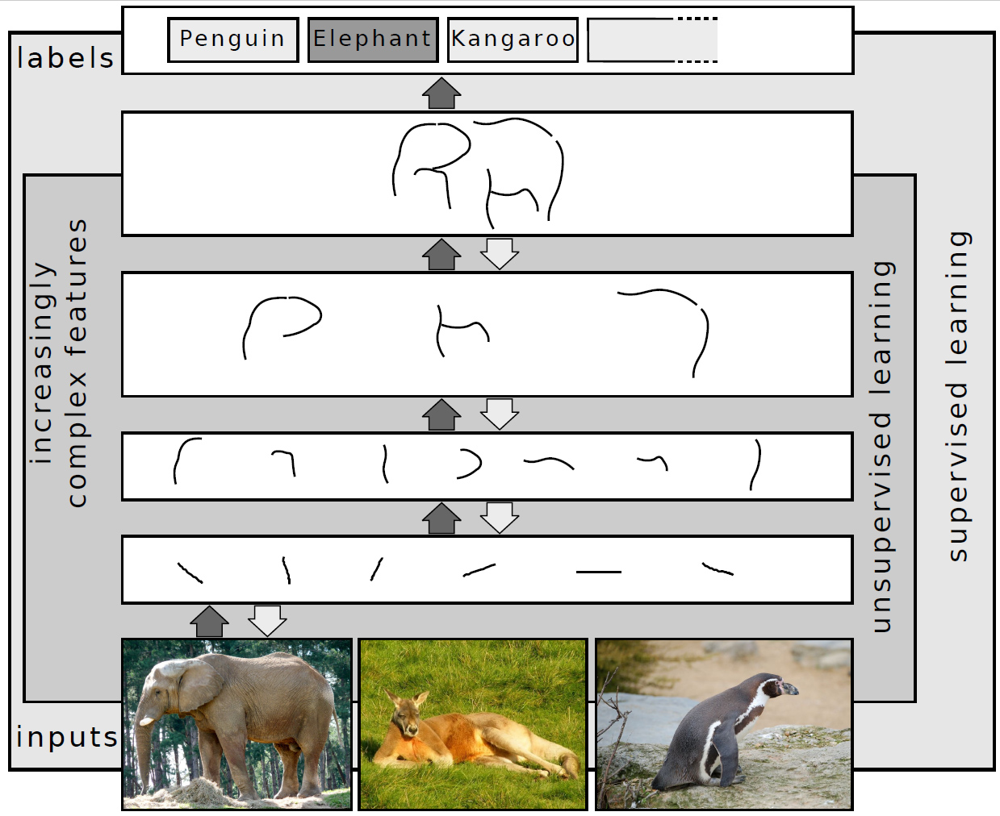

# Google

_What TimesFM Means for Industrial Forecasting — From Sensor Data to Predictive Maintenance_

## Executive Summary

> [!callout]
> TimesFM — Google Research's open-source time-series foundation model — is a 200M-parameter, decoder-only transformer pre-trained on 10 billion time points. After its academic debut at ICML 2024, TimesFM 2.5 (released September 2025) extended the context length eightfold from 512 to 16,000 time steps while cutting parameters in half — significantly lowering the barrier to edge deployment. The model claimed first place on GIFT-Eval, a comprehensive benchmark spanning 28 datasets from Salesforce AI Research (NeurIPS 2024), and is rapidly moving into production via BigQuery ML GA, Google Sheets integration, and Databricks MMF adoption.

> The significance of this transition comes down to three shifts. First, zero-shot forecasting has become a realistic option: the model can generate predictions on new domains immediately, without any training, slashing PoC costs in industrial settings. Second, in-context fine-tuning (TimesFM-ICF) is now possible, delivering a +6.8% performance gain for data-scarce manufacturing and energy environments without any weight updates. Third, the cycle from academic publication to production GA has been confirmed at just 12–18 months — a "wait-and-see" strategy no longer holds.

> Pebblous, as a platform company in industrial AI and Physical AI, has three concrete points of contact with TimesFM: (1) on-premises anomaly detection for sensor time-series data, (2) predictive maintenance that prevents downtime losses worth up to $532,000 per hour, and (3) a time-series forecasting pipeline built on top of DataClinic's industrial data quality diagnostics. The "BERT moment" for time-series AI has arrived — the time to lock in positioning is now.

## 1. Understanding TimesFM

Time-series forecasting has long been the domain of per-domain statistical models. ARIMA required hand-tuned parameters for every dataset; Prophet demanded explicit seasonality assumptions; LSTM was unstable without sufficient labeled data. TimesFM, presented at ICML 2024 by Google Research, changed that equation. A foundation model pre-trained on diverse time-series data can generate zero-shot forecasts on entirely new data — no training required.

### Patch-Based Decoder Architecture

*Transformer full architecture (Encoder-Decoder). TimesFM adopts a decoder-only variant, taking time-series patches as input and autoregressively generating the next time steps. | Source: Wikimedia Commons (CC BY-SA 4.0)*

The key architectural choice in TimesFM is patch processing. Rather than tokenizing each individual time step, the model groups fixed-length time windows into single patches. This offers two advantages. First, attention complexity is reduced when handling long sequences. Second, each patch captures a local pattern (vibration cycles, temperature trends) as a unified unit — ideal for industrial sensor data characteristics.

The decoder-only structure is analogous to GPT-family language models. It takes an input time series as context and autoregressively generates the next time steps. This approach flexibly handles arbitrary forecast horizons, allowing the same model to serve both short-horizon real-time predictions and long-horizon demand forecasts.

Pre-training data spans 10 billion time points drawn from diverse public datasets across finance, weather, retail, traffic, and energy domains. This broad training base is the source of the model's zero-shot generalization capability.

### Version History: 1.0 → 2.0 → 2.5

TimesFM has gone through three major updates in the 18 months since its release. Comparing each version reveals the direction Google is taking with this model.

| Version | Release | Parameters | Context Length | Highlights |
| --- | --- | --- | --- | --- |
| 1.0 | Early 2024 | 200M | 512 | ICML debut; first public zero-shot forecasting |
| 2.0 | Early 2025 | 500M | 2,048 | Scaled parameters, enhanced performance |
| 2.5 | September 2025 | 200M | 16,000 | Returned to lightweight, 8× context expansion, GIFT-Eval #1 |

********

The paradox of version 2.5 is the core story. After scaling to 500M parameters in 2.0, Google reduced parameters back to 200M in 2.5 — and yet achieved #1 on GIFT-Eval. This empirically demonstrates that expanding context length from 512 to 16,000 contributes more to performance than increasing parameter count. That design choice is especially meaningful for domains like industrial sensor data, where long historical patterns matter most.

### Comparing with Existing Models: When to Use TimesFM

TimesFM is not the best choice in every situation. A clear understanding of how it differs from existing approaches is required to use it in the right context.

| Model | Strengths | Limitations | Best For |
| --- | --- | --- | --- |
| ARIMA | Interpretability, small data | Per-domain fitting needed, weak on nonlinear patterns | Single time series, high interpretability requirements |
| Prophet | Excellent seasonal decomposition | Requires seasonality assumptions, weak on non-stationary series | Business KPIs with clear periodicity |
| XGBoost | Feature engineering, strong on tabular data | Requires labeled data, upfront domain knowledge investment | Rich covariate environments |
| LSTM | Sequence pattern learning | Large data requirement, unstable training | Ample labeled data, complex patterns |
| TimesFM 2.5 | Zero-shot immediate forecasting, lightweight deployment | Weak multivariate support, lower performance on Web/CloudOps | Fast PoC, label-scarce environments, univariate sensors |

TimesFM shines brightest when the environment has "scarce labeled data, a need for rapid validation, and primarily univariate time series." Early smart-factory PoCs at small and mid-size Korean manufacturers are a textbook use case. For environments where many sensors interact in complex ways, the model selection guide in the next section applies.

## 2. Benchmarks and Limitations

The most important evidence for validating TimesFM's performance claims is GIFT-Eval (General Information on Forecasting Tasks — Evaluation). Published by Salesforce AI Research at NeurIPS 2024, this benchmark spans 28 datasets with diverse forecast horizons and frequencies, designed to eliminate the bias inherent in single-dataset evaluation. TimesFM 2.5 ranked first on this comprehensive benchmark by MASE (Mean Absolute Scaled Error) (arXiv: 2410.10393).

### TimesFM-ICF: In-Context Fine-Tuning

TimesFM-ICF (In-Context Fine-Tuning) applies the in-context learning paradigm from LLMs to time-series forecasting (arXiv: 2410.24087). Traditional fine-tuning retrains model weights on new domain data; ICF instead provides representative time-series samples as a "prompt." Without any weight changes, it achieves a +6.8% performance improvement on out-of-distribution tests and ≥25% improvement on the ETT dataset. The ability to achieve domain adaptation without a GPU or labeling cost makes it a practical choice for industrial settings.

### Weaknesses: Multivariate and Specialized Domains

A balanced evaluation of performance requires acknowledging TimesFM's current limitations. First, multivariate time-series forecasting is a weakness. TimesFM 1.0 and 2.0 are fundamentally univariate-centric; Chronos-2 or MOIRAI-MoE have the edge in environments where multiple sensors — vibration, temperature, power consumption — interact. Second, performance degrades in event-driven, high-entropy domains like Web/CloudOps. The further a domain strays from the pre-training data distribution, the less reliable zero-shot performance becomes.

### Model Selection Decision Guide

Univariate sensor, fast PoC, scarce labels

TimesFM 2.5 — Start zero-shot immediately; GIFT-Eval #1 credibility

Multivariate sensors (vibration + temperature + power)

Chronos-2 (T5-based, covariate integration) or MOIRAI-MoE

Automated optimal model selection required

Databricks MMF — auto-ensemble of 40+ models, automatic selection

Domain-specific patterns with ample labels

XGBoost / LSTM fine-tuning — recommended to apply TimesFM-ICF first for comparison

In practice, an ensemble strategy is more robust than single-model selection. The Databricks MMF (Many Models Framework) automatically evaluates 40+ time-series models (including TimesFM) against the characteristics of the data and selects the optimal combination. Large-scale time-series forecasting pipelines are evolving toward automating human judgment in model selection.

## 3. Industry Applications

The industrial value of time-series forecasting is measured across three core areas: early anomaly detection in manufacturing processes, demand and generation forecasting in energy, and demand forecasting with inventory optimization in logistics. TimesFM delivers meaningful improvements over traditional methods in all three domains, though the path and caveats differ by context.

### Manufacturing: Predictive Maintenance and Process Anomaly Detection

*CNC milling machine in operation. Vibration, temperature, and power consumption sensor streams collected in real time form the time-series input for predictive maintenance anomaly detection. | Source: Wikimedia Commons (CC BY-SA 3.0)*

CNC machines, motors, and compressors on the factory floor always leave anomaly signatures in time-series data before failure — changes in vibration frequency, temperature outliers, and shifts in power consumption patterns. The challenge is that distinguishing these signals from normal variation is difficult using rule-based approaches. TimesFM can leverage its long context window (up to 16,000 time steps) to learn a normal-pattern baseline and classify deviations as anomalies when they reach statistically significant levels.

Siemens' Senseye platform announced an update in December 2025 integrating generative AI with predictive maintenance. This case demonstrates that large industrial equipment manufacturers are moving to embed time-series foundation models directly into commercial products. The same pattern is expected to play out in Korea's smart factory ecosystem.

### Predictive Maintenance ROI: Concrete Figures

According to McKinsey and the U.S. Department of Energy, the ROI from adopting predictive maintenance reaches **10:1–30:1 over 12–18 months**. Key figures are as follows.

70–75%

Reduction in equipment failures

45–72%

Reduction in unplanned downtime

$260K–$532K

Cost of 1 hour of heavy equipment failure

$1.3M–$2.6M

Savings from cutting 10 incidents/yr to 5

Sources: McKinsey & Company, U.S. Department of Energy, OxMaint. Figures vary by industry type and equipment scale.

### Energy: Demand Forecasting and Renewable Integration

*Mixed wind and solar power generation. As renewable energy output fluctuates with weather conditions, accurate demand and generation forecasting directly reduces energy waste and peak cost spikes. | Source: Wikimedia Commons (CC BY-SA 3.0)*

Energy demand forecasting is the domain where time-series AI generates the most direct economic impact. Key use cases include solar and wind generation forecasting, grid demand forecasting, and building energy optimization. A study published in Frontiers in Environmental Chemistry (February 2026) reported a 15–20% reduction in RMSE for energy demand forecasting using TimesFM. This improvement directly reduces energy waste from supply-demand mismatches and cost spikes at peak times.

As the share of renewable energy increases, so does the uncertainty in generation forecasting. Solar output fluctuates with cloud cover; wind output with wind speed and direction. TimesFM's long context window is well-suited to capturing long-term weather patterns, making it a strong baseline model in ensemble configurations that integrate data from multiple meteorological sensors.

### Logistics: Demand Forecasting and Inventory Optimization

Global logistics companies like DHL and Maersk know well that a 1% improvement in demand forecast accuracy can translate into millions of dollars in inventory cost savings. Logistics time series are characterized by coexisting sharp spikes driven by promotions, seasons, and local events alongside long-term trends. TimesFM's 16,000-step context captures multi-year seasonal patterns while remaining flexible enough to react to short-term spikes.

### Zero-Shot → In-Context → Fine-Tuning: A Three-Stage Adoption Path

A three-stage approach is realistic for adopting TimesFM in industrial settings.

Stage 1: Zero-Shot Validation (1–2 weeks)

Download the model from Hugging Face and apply it directly to existing sensor data. Measure baseline performance without any training. Minimal PoC cost.

Stage 2: In-Context Fine-Tuning (2–4 weeks)

Provide representative domain time-series samples as context prompts. Domain adaptation without weight changes. Expected improvement: +6.8%–25%.

Stage 3: Full Fine-Tuning (optional, 4–8 weeks)

If sufficient domain data is available, retrain model weights. Fully captures domain-specific patterns. Requires GPU infrastructure.

Most industrial settings will achieve sufficient performance at Stage 2. Stage 3 is cost-effective only for applications requiring very high forecast precision (aerospace, semiconductor processes) or with extremely high domain specificity.

## 4. The Pebblous Connection

As an industrial AI and Physical AI platform company, Pebblous has three concrete points of contact with TimesFM. These are not mere technology integrations — they form a differentiated service position that can be delivered to customers.

### Connection 1: On-Premises Deployment and Data Privacy

TimesFM 2.5's 200M parameters run on servers with less than 8GB of GPU memory at CPU inference latency of approximately 200–500ms. The Apache 2.0 license permits commercial use, and model weights can be downloaded directly from Hugging Face. This combination is a decisive advantage for manufacturing and energy customers who cannot send sensitive production data to the cloud.

Many Korean manufacturing customers are reluctant — for legal and competitive reasons — to upload production data to the cloud. Automotive parts suppliers, defense industry companies, and semiconductor back-end process firms in particular sometimes prohibit external data transfer entirely. If Pebblous combines its on-premises deployment expertise with TimesFM, it can secure the positioning of "time-series AI that starts without the cloud."

### Connection 2: DataClinic-Linked Data Quality Diagnostic Pipeline

The performance of time-series forecasting models is directly tied to data quality. Missing values, noise, sensor drift, and labeling errors cause even foundation models to degrade rapidly. This is not a limitation unique to TimesFM — it is a constraint shared by all time-series models.

Pebblous's DataClinic is a solution specialized in data diagnostics, cleansing, and quality certification. A pipeline in which DataClinic first diagnoses and cleans time-series data before feeding it to TimesFM is a concrete realization of Pebblous's philosophy that "data quality determines AI performance."

### DataClinic + TimesFM Pipeline

1

Sensor Data Collection

Collect time-series sensor data from industrial equipment such as CNC machines, motors, and compressors

2

DataClinic Quality Diagnostics

Detect missing values, outliers, and drift; generate a time-series reliability score

3

Data Cleansing and Correction

Automated interpolation, noise filtering, and sensor drift correction

4

TimesFM Forecasting

Apply TimesFM 2.5 to cleaned time series; generate future value predictions

5

Anomaly Detection Alert

Send maintenance alerts when the deviation between predicted and actual values exceeds a threshold

### Connection 3: Positioning in Korea's Smart Factory Market

Korea's AI-based manufacturing solutions market is projected to grow at a CAGR of 16.6% (2025–2030) (Statista). Follow-on policies supporting the government's target of 30% smart factory automation (2025) are expected to continue. Globally, TimesFM has already entered the commercialization stage through BigQuery ML GA (2025), but no publicly confirmed direct adoption cases exist yet among Korean companies.

That gap is the opportunity. If Pebblous is the first to deliver a DataClinic + TimesFM-based process anomaly detection service to Korean manufacturers, it can secure reference customers in a market where leading-firm adoption is expected within 2026–2027.

A key date to watch: Google Cloud Next 2026 (April 22–24) is likely to bring announcements on BigQuery ML TimesFM updates and expanded Vertex AI integration. Depending on what is announced after this report's publication date (2026-04-04), pipeline design adjustments may be warranted.

Looking further, Pebblous's DataGreenhouse can serve as the automated operations layer for this pipeline. By orchestrating the full flow — from sensor data collection through DataClinic quality diagnostics, TimesFM forecasting, and anomaly detection alerts — with Agentic AI, an autonomous manufacturing data operating system emerges that detects and responds to process anomalies in real time without operator intervention. The BERT moment for time-series AI has arrived — Pebblous is already preparing.

## 5. Competitive Landscape and Long-Term Outlook

The time-series foundation model market consolidated into a three-way competitive structure during 2024–2025. TimesFM (Google), Chronos-2 (Amazon), and MOIRAI-MoE (Salesforce AI) each occupy distinct technical positions.

### Three-Way Comparison: TimesFM vs Chronos-2 vs MOIRAI-MoE

The three models are clearly differentiated in architecture, strengths, and ecosystem integration approach. Model selection depends on use case and environment.

| Attribute | TimesFM 2.5 | Chronos-2 | MOIRAI-MoE |
| --- | --- | --- | --- |
| Developer | Google Research | Amazon Science | Salesforce AI |
| Architecture | Patch decoder transformer | T5 (Encoder-Decoder) | Sparse MoE |
| Parameters | 200M | 710M (Tiny–Large) | Various (MoE architecture) |
| Strengths | Lightweight, fast inference, GIFT-Eval #1 | Multivariate + covariate integration | Sparse MoE efficiency |
| Weaknesses | Weak multivariate support | Relatively heavier | Deployment complexity |
| Ecosystem | BigQuery ML, Vertex AI, Sheets | AutoGluon, AWS Forecast | Databricks MMF (partial) |
| License | Apache 2.0 | Apache 2.0 | Apache 2.0 (partial) |

### Databricks MMF and the Ensemble Ecosystem

The Databricks Many Models Framework (MMF) points to a direction that reframes single-model competition. This framework automatically evaluates 40+ time-series models (statistical, ML, deep learning, and foundation) against the characteristics of the data and selects the optimal combination — positioning TimesFM not as a promising standalone model but as "one member of an ensemble pool." Databricks has introduced TimesFM as a key contributing model to MMF on its technical blog.

### The BERT Moment for Time-Series AI

*Hierarchical representation learning in deep neural networks. Just as BERT triggered a pre-training revolution in NLP in 2018, time-series foundation models are approaching the same inflection point. | Source: Wikimedia Commons (CC BY-SA 3.0)*

NeurIPS 2025 hosted the BERT²S (Bidirectional Encoder Representations from Time Series) workshop, which debated whether time-series AI has reached the "democratization of pre-trained foundation models" moment that BERT created for NLP in 2018. As of now, time-series AI is very close to that threshold.

Three pieces of evidence support this. First, BigQuery ML GA now allows data engineers to call time-series forecasting with SQL. Second, Google Workspace Connected Sheets integration (February 2026) opened the door for business users to run forecasts directly from spreadsheets. Third, the cycle from ICML publication to production GA has been confirmed at just 12–18 months.

### Time-Series Forecasting Market: Size and Growth

Market size estimates for time-series forecasting software vary widely depending on how the scope is defined. By Verified Market Research, the time-series analytics software market is projected to grow from $1.8B in 2024 to $4.7B in 2032 at a CAGR of 10.5%. Under a broader definition that includes predictive analytics, estimates reach as high as $22.5B. Regardless of which scope applies, CAGR above 10% is the common projection.

More important than the market size itself is the structural decline in time-series AI adoption barriers. BigQuery ML integration lowers the barrier for data engineers; Connected Sheets lowers it for business users — accelerating the purchase cycle for time-series forecasting. Google Cloud Next 2026 (April 22–24) announcements are likely to accelerate this direction further.

## Frequently Asked Questions

### What is TimesFM and how does it differ from ARIMA or Prophet?

TimesFM is a 200M-parameter transformer model pre-trained by Google on 10 billion time points. ARIMA requires per-dataset fitting and Prophet requires explicit seasonality assumptions, whereas TimesFM generates zero-shot predictions on new data without any training. The absence of a training cost enables fast PoC, though statistical models may still have the edge for highly domain-specific patterns.

### Is zero-shot forecasting actually reliable? Will it work on our factory data?

TimesFM 2.5 ranked #1 by MASE across GIFT-Eval's 28 datasets. That said, performance degrades in high-entropy domains like Web/CloudOps, so it is well-suited for manufacturing sensor data (which has periodicity) but requires ensemble consideration for irregular, event-driven data.

### Can TimesFM 2.5 run on-premises without cloud access?

Yes. At 200M parameters, it runs on servers with less than 8GB of GPU memory at CPU inference latency of approximately 200–500ms. The Apache 2.0 license permits commercial use, and weights can be downloaded directly from Hugging Face. This is a key advantage for manufacturing and energy customers who cannot transfer sensitive production data to the cloud.

### How does TimesFM-ICF (In-Context Fine-Tuning) differ from traditional fine-tuning?

Traditional fine-tuning retrains model weights on new domain data; ICF instead provides representative time-series samples as a "prompt," analogous to in-context learning in LLMs. Without any weight changes, it achieves a +6.8% improvement on out-of-distribution tests and ≥25% improvement on the ETT dataset. Domain adaptation is possible without GPU or labeling costs.

### TimesFM vs Chronos-2: which should I use and when?

For a single univariate sensor prediction, use TimesFM 2.5 (lightweight, GIFT-Eval #1). In multivariate environments where vibration, temperature, and power consumption interact, Chronos-2 (T5-based, multivariate/covariate integration) or MOIRAI-MoE has the advantage. Using Databricks MMF automates optimal selection across 40+ model ensembles.

### What is the economic impact of adopting predictive maintenance?

Per McKinsey and the U.S. Department of Energy: ROI of 10:1–30:1 over 12–18 months. Equipment failures reduced 70–75%; unplanned downtime reduced 45–72%. Given that one hour of heavy equipment failure costs $260,000–$532,000, cutting 10 unplanned stoppages per year to 5 saves $1.3M–$2.6M annually.

### Does poor time-series data quality make TimesFM useless?

Yes — foundation models also degrade rapidly on data with missing values, noise, and drift. Prior data quality diagnostics (such as DataClinic) are a prerequisite for deploying TimesFM. Only after good data quality is ensured does zero-shot performance approach laboratory benchmark levels.

### How does Google's open-source release connect to its cloud strategy?

It is an "open-core" strategy: publish under Apache 2.0 while integrating into BigQuery ML, Vertex AI, and AlloyDB to drive frictionless cloud migration. The Google Workspace Connected Sheets integration (February 2026) extends the user base beyond data engineers to business users, deepening Google Cloud lock-in.

### When will TimesFM reach practical adoption in Korean manufacturing?

By global standards, it has already entered commercialization (BigQuery ML GA, 2025). No direct adoption cases in Korea have been publicly confirmed yet, but the AI-based manufacturing solutions CAGR of 16.6% (2025–2030) and smart factory automation targets suggest leading-firm adoption in Korea within 2026–2027. Now is the time to establish first-mover positioning.

## References

### Papers

1. Das, A. et al. (2024). A decoder-only foundation model for time-series forecasting. ICML 2024. arXiv: [2310.10688](https://arxiv.org/abs/2310.10688)
2. Das, A. et al. (2024). In-Context Fine-Tuning for Time-Series Foundation Models. NeurIPS 2024 Workshop. arXiv: [2410.24087](https://arxiv.org/abs/2410.24087)
3. (2025). Foundation Models for Time Series: A Survey. arXiv: [2504.04011](https://arxiv.org/abs/2504.04011)
4. (2024). Empowering Time Series Analysis with Foundation Models. arXiv: [2405.02358](https://arxiv.org/abs/2405.02358)
5. Salesforce AI Research (2024). GIFT-Eval: A Benchmark For General Time Series Forecasting Model Evaluation. NeurIPS 2024. arXiv: [2410.10393](https://arxiv.org/abs/2410.10393)
6. Rasul, K. et al. (2024). Lag-Llama: Towards Foundation Models for Probabilistic Time Series Forecasting. NeurIPS 2023. arXiv: [2310.08278](https://arxiv.org/abs/2310.08278)
7. Salesforce AI (2024). Moirai-MoE: Empowering Time Series Foundation Models with Sparse Mixture of Experts. arXiv: [2410.10469](https://arxiv.org/abs/2410.10469)

### Official Blogs and News

- Google Research Blog: [A Decoder-Only Foundation Model for Time-Series Forecasting](https://research.google/blog/a-decoder-only-foundation-model-for-time-series-forecasting/)
- Google Cloud Blog: [BigQuery ML TimesFM GA Release](https://cloud.google.com/blog/products/data-analytics/timesfm-models-in-bigquery-and-alloydb)
- Google Workspace Updates: [Connected Sheets TimesFM Integration (February 2026)](https://workspaceupdates.googleblog.com/2026/02/forecast-data-in-connected-sheets-BigQueryML-TimesFM.html)
- MarkTechPost: [TimesFM 2.5 Release (September 2025)](https://www.marktechpost.com/2025/09/16/google-ai-ships-timesfm-2-5)
- Amazon Science: [Introducing Chronos-2](https://www.amazon.science/blog/introducing-chronos-2-from-univariate-to-universal-forecasting)
- Databricks Community Blog: [TimesFM with Databricks MMF](https://community.databricks.com/t5/technical-blog/genai-for-time-series-analysis-with-timesfm/ba-p/95507)
- Siemens Blog: [Senseye + Generative AI for Predictive Maintenance (December 2025)](https://blog.siemens.com/en/2025/12/predictive-maintenance-with-generative-ai-senseye)
- Frontiers in Environmental Chemistry: [TimesFM for Energy Demand Forecasting](https://www.frontiersin.org/journals/environmental-chemistry/articles/10.3389/fenvc.2026.1759525/full)

### Market Data

- Verified Market Research — Time-Series Analytics Software Market ($1.8B → $4.7B, CAGR 10.5%, 2024–2032)
- Virtue Market Research — Time Series Intelligence Market (CAGR 18.36%)
- McKinsey & Company, U.S. Department of Energy — Predictive Maintenance ROI Analysis
- Manufacturing Leadership Council — Predictive Analytics Importance Survey
- Statista (2025) — Korea AI-based Manufacturing Solutions Market CAGR 16.6% (2025–2030)
