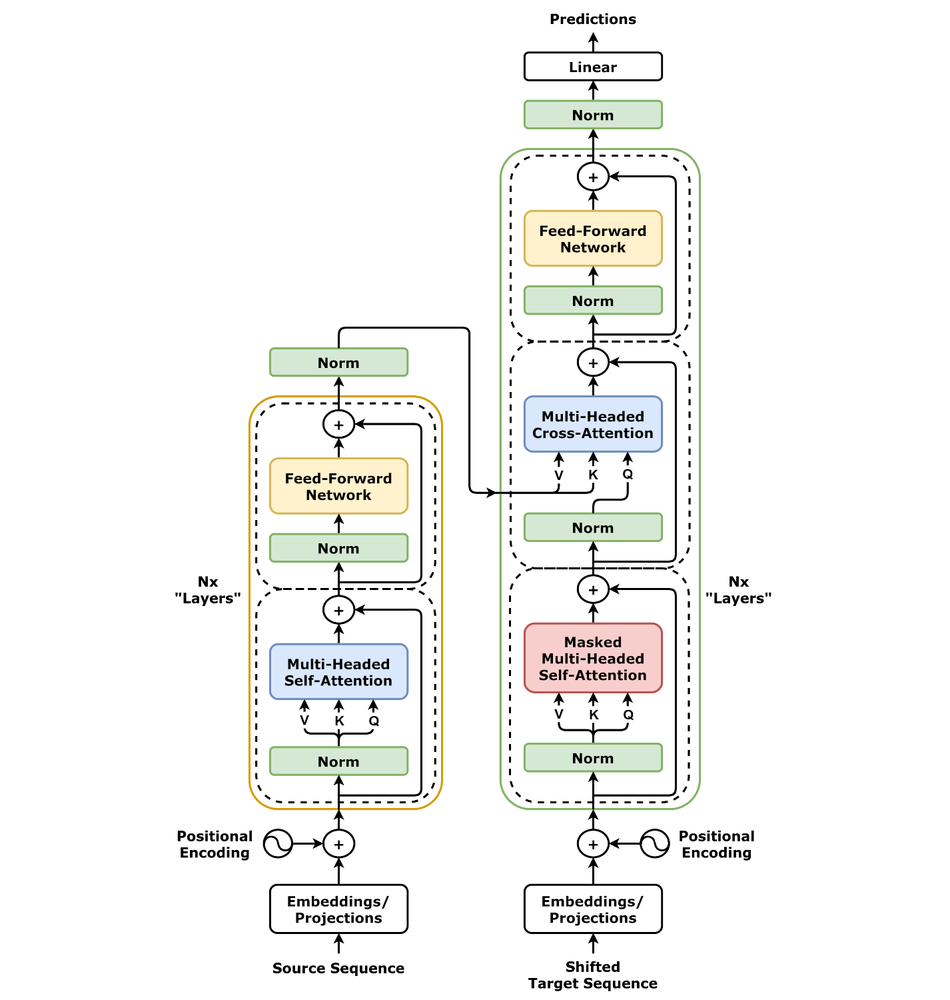

# 구글이 공개한 시계열 AI, 제조 현장을 바꾼다

_TimesFM으로 보는 산업 데이터 예측의 미래 — 센서 데이터부터 공정 이상탐지까지_

## Executive Summary

> [!callout]
> 구글 리서치가 오픈소스로 공개한 TimesFM(시계열 파운데이션 모델)은 100억 개 시간점으로 사전학습된 200M 파라미터 디코더 전용 트랜스포머다. 2024년 ICML에서 학술 데뷔한 이후, 2025년 9월 출시된 TimesFM 2.5는 컨텍스트 길이를 512에서 16,000으로 8배 확장하면서도 파라미터를 절반으로 줄여 엣지 배포 가능성을 대폭 높였다. GIFT-Eval 종합 벤치마크 28개 데이터셋 기준 1위를 기록하며 학술 신뢰도를 확보했고, BigQuery ML GA·Google Sheets 통합·Databricks MMF 채택을 통해 실무 진입 장벽도 빠르게 낮아지고 있다.

> 이 전환의 본질적 의미는 세 가지다. 첫째, "제로샷 예측"이 현실적 선택지가 됐다. 새 도메인에서 별도 훈련 없이 즉시 가동할 수 있어 산업 현장의 PoC 비용이 급감한다. 둘째, 인컨텍스트 미세조정(TimesFM-ICF)이 가능해져 데이터가 적은 제조·에너지 현장에서도 +6.8%의 성능 향상을 얻을 수 있다. 셋째, 학술 발표에서 실무 GA까지 12~18개월이면 충분하다는 사이클이 확인됐다—"기다리기" 전략이 더 이상 통하지 않는다.

> 페블러스는 산업인공지능 + Physical AI 플랫폼 관점에서 세 가지 접점을 갖는다. (1) 센서 시계열 데이터에 TimesFM을 적용한 온프레미스 이상탐지 서비스, (2) 공정 예측 유지보수로 시간당 최대 $532,000 규모의 다운타임 손실 예방, (3) DataClinic과 결합한 산업 데이터 품질 진단 후 시계열 예측 파이프라인 구성. 시계열 AI의 "BERT 모멘트"가 도래했다—지금이 포지셔닝을 확정할 시점이다.

## 1. TimesFM의 기술 이해

시계열 예측은 오랫동안 도메인별 통계 모델의 영역이었다. ARIMA는 데이터마다 파라미터를 손으로 맞춰야 했고, Prophet은 계절성 가정이 필요했으며, LSTM은 충분한 라벨 데이터가 없으면 훈련이 불안정했다. 구글 리서치가 2024년 ICML에서 발표한 TimesFM은 이 방정식을 바꿨다. 파운데이션 모델 방식으로 사전학습된 시계열 예측기는 새 데이터에 대해 훈련 없이 즉시 예측을 수행한다.

### 패치 기반 디코더 아키텍처

*트랜스포머 풀 아키텍처 (Encoder-Decoder). TimesFM은 디코더 전용 구조를 채택해 시계열 패치를 입력으로 받아 다음 시간점을 순차 생성한다. | 출처: Wikimedia Commons (CC BY-SA 4.0)*

TimesFM의 핵심 설계 선택은 "패치(patch)" 처리 방식이다. 시계열 데이터를 토큰 단위로 쪼개지 않고, 일정 길이의 시간 구간을 하나의 패치로 묶어 처리한다. 이 방식은 두 가지 장점을 제공한다. 첫째, 긴 시계열을 처리할 때 어텐션 연산의 복잡도가 줄어든다. 둘째, 각 패치가 국소적 패턴(진동 주기, 온도 추이)을 하나의 단위로 포착할 수 있어 산업 센서 데이터의 특성에 적합하다.

디코더 전용(decoder-only) 구조는 GPT 계열 언어 모델과 유사하다. 입력 시계열을 컨텍스트로 받아 다음 시간점을 순차적으로 생성한다. 이 자기회귀(autoregressive) 방식은 임의 길이의 예측 지평선(horizon)에 유연하게 대응할 수 있어, 짧은 실시간 예측과 장기 수요 예측 모두에 동일 모델을 활용할 수 있다.

사전학습 데이터는 100억 개 시간점 규모다. 금융, 날씨, 소매, 트래픽, 에너지 등 다양한 도메인의 공개 시계열 데이터셋이 포함됐으며, 이 광범위한 학습 기반이 제로샷 일반화 능력의 원천이다.

### 버전 진화 타임라인: 1.0 → 2.0 → 2.5

TimesFM은 출시 이후 18개월 만에 세 번의 주요 업데이트를 거쳤다. 각 버전의 변화를 비교하면 구글이 어떤 방향으로 이 모델을 발전시키고 있는지 명확하게 드러난다.

| 버전 | 출시 | 파라미터 | 컨텍스트 길이 | 주요 특징 |
| --- | --- | --- | --- | --- |
| 1.0 | 2024년 초 | 200M | 512 | ICML 발표, 제로샷 예측 첫 공개 |
| 2.0 | 2025년 초 | 500M | 2,048 | 파라미터 확장, 성능 강화 |
| 2.5 | 2025년 9월 | 200M | 16,000 | 경량화 복귀, 컨텍스트 8배 확장, GIFT-Eval 1위 |

********

2.5의 역설적 스토리가 핵심이다. 2.0에서 500M으로 파라미터를 늘렸다가, 2.5에서 다시 200M으로 줄이면서 오히려 GIFT-Eval 1위를 달성했다. 컨텍스트 길이를 512에서 16,000으로 8배 늘린 것이 파라미터 증가보다 성능에 더 크게 기여한다는 것이 실증됐다. 산업 센서 데이터처럼 긴 이력 패턴이 중요한 도메인에서 이 설계 선택은 특히 의미있다.

### 기존 모델과의 비교: 언제 TimesFM인가

TimesFM은 모든 상황에서 최선의 선택이 아니다. 기존 접근법과의 차이를 명확히 이해해야 적재적소에 활용할 수 있다.

| 모델 | 장점 | 한계 | 적합 상황 |
| --- | --- | --- | --- |
| ARIMA | 해석 가능성, 소량 데이터 | 도메인별 피팅 필요, 비선형 패턴 약함 | 단일 시계열, 고해석성 요구 |
| Prophet | 계절성 분해 우수 | 계절성 가정 필요, 비정상 시계열 약함 | 주기성 명확한 비즈니스 KPI |
| XGBoost | 특성 엔지니어링 활용, 표 형 데이터 강점 | 라벨 데이터 필요, 도메인 지식 선투자 | 예측 인자(covariates) 풍부한 경우 |
| LSTM | 시퀀스 패턴 학습 | 대량 데이터 필요, 훈련 불안정 | 충분한 라벨 데이터, 복잡 패턴 |
| TimesFM 2.5 | 제로샷 즉시 예측, 경량 배포 | 다변량 지원 미흡, Web/CloudOps 약함 | 빠른 PoC, 라벨 부족 환경, 단변량 센서 |

TimesFM이 가장 빛나는 상황은 "라벨 데이터가 적고, 빠른 검증이 필요하며, 단변량 시계열이 주를 이루는" 환경이다. 한국 중소 제조업체의 스마트팩토리 초기 PoC가 전형적인 사용 사례다. 반면 다수의 센서가 복잡하게 상호작용하는 환경에서는 다음 섹션에서 설명하는 모델 선택 가이드를 참고해야 한다.

## 2. 성능 벤치마크와 한계

TimesFM의 성능 주장을 검증하는 가장 중요한 근거는 GIFT-Eval(General Information on Forecasting Tasks — Evaluation)이다. Salesforce AI Research가 NeurIPS 2024에서 발표한 이 벤치마크는 28개 데이터셋, 다양한 예측 지평선과 주파수를 포함해 단일 데이터셋 기준 평가의 편향을 제거하는 데 설계됐다. TimesFM 2.5는 이 종합 벤치마크에서 MASE(Mean Absolute Scaled Error) 기준 1위를 기록했다(arXiv: 2410.10393).

### TimesFM-ICF: 인컨텍스트 미세조정

TimesFM-ICF(In-Context Fine-Tuning)는 LLM의 인컨텍스트 학습 방식을 시계열 예측에 적용한 확장이다(arXiv: 2410.24087). 전통적 파인튜닝은 새 도메인 데이터로 모델 가중치를 재학습하지만, ICF는 관련 시계열 샘플을 "프롬프트"로 제공한다. 가중치 변경 없이 out-of-distribution 테스트에서 +6.8% 성능 향상, ETT 데이터셋 기준 ≥25% 개선을 달성했다. GPU 없이, 라벨링 비용 없이 도메인 적응이 가능하다는 점에서 산업 현장의 실용적 선택지가 된다.

### 약점: 다변량과 특수 도메인

성능의 균형 잡힌 평가를 위해 TimesFM의 현재 한계를 명시해야 한다. 첫째, 다변량 시계열 예측이 취약하다. TimesFM 1.0과 2.0은 기본적으로 단변량 중심이며, 진동·온도·전력소비 등 여러 센서가 상호작용하는 환경에서는 Chronos-2나 MOIRAI-MoE가 우위에 있다. 둘째, Web/CloudOps처럼 이벤트 기반의 높은 엔트로피 도메인에서 성능이 하락한다. 사전학습 데이터 분포에서 벗어난 도메인일수록 제로샷 성능의 신뢰도가 떨어진다.

### 모델 선택 의사결정 가이드

단변량 센서, 빠른 PoC, 라벨 부족

TimesFM 2.5 — 제로샷으로 즉시 시작, GIFT-Eval 1위 신뢰도

다변량 센서 (진동·온도·전력 복합)

Chronos-2 (T5 기반, 공변량 통합) 또는 MOIRAI-MoE

최적 자동 선택이 필요한 경우

Databricks MMF — 40+ 모델 자동 앙상블, 최적 모델 자동 선택

도메인 특수 패턴, 충분한 라벨

XGBoost·LSTM 파인튜닝 — TimesFM ICF 사전 적용 후 비교 권장

실무에서는 단일 모델 선택보다 앙상블 전략이 더 안정적이다. Databricks MMF(Many Models Framework)는 40개 이상의 시계열 모델(TimesFM 포함)을 데이터 특성에 따라 자동으로 평가하고 최적 조합을 선택한다. 대규모 시계열 예측 파이프라인에서 인간의 모델 선택 판단을 자동화하는 방향으로 진화하고 있다.

## 3. 산업 적용 시나리오

시계열 예측의 산업적 가치는 세 가지 핵심 영역에서 측정된다. 제조업의 공정 이상 조기탐지, 에너지 산업의 수요·발전량 예측, 물류업의 수요 예측과 재고 최적화다. TimesFM은 이 세 영역 모두에서 기존 방법 대비 의미 있는 개선을 제공하지만, 그 경로와 주의사항이 다르다.

### 제조업: 예측 유지보수와 공정 이상탐지

*CNC 밀링 머신 가공 장면. 진동·온도·전력 소비 등 센서 데이터를 시계열로 수집해 이상 징후를 조기탐지하는 것이 예측 유지보수의 핵심이다. | 출처: Wikimedia Commons (CC BY-SA 3.0)*

제조 현장의 CNC 머신, 모터, 압축기는 고장 전에 반드시 이상 징후(진동 주파수 변화, 온도 이상, 전력 소비 패턴 변화)를 시계열 데이터로 남긴다. 문제는 이 이상 징후를 정상 변동과 구분하는 것이 기존 규칙 기반 방식으로는 어렵다는 점이다. TimesFM은 긴 컨텍스트(최대 16,000 시간점)를 활용해 정상 패턴의 기준선(baseline)을 학습하고, 편차가 통계적으로 유의미한 수준에 달하면 이상으로 분류할 수 있다.

Siemens의 Senseye 플랫폼은 2025년 12월 생성형 AI와 예측 유지보수를 통합한 업데이트를 발표했다. 이 사례는 대형 산업 장비 제조사가 시계열 파운데이션 모델을 실제 제품에 통합하는 방향으로 이동하고 있음을 보여준다. 한국 스마트팩토리 환경에서도 동일한 패턴이 전개될 것으로 예상된다.

### 예측 유지보수 ROI: 구체적 수치

McKinsey와 미국 에너지부(U.S. DoE) 분석에 따르면, 예측 유지보수 도입의 ROI는 **10:1~30:1(12~18개월 기준)**에 달한다. 주요 수치는 다음과 같다.

70~75%

장비 고장 감소율

45~72%

비계획 다운타임 감소

$260K~$532K

대형 장비 1시간 고장 손실

$1.3M~$2.6M

연 10회 → 5회 감소 시 절감액

출처: McKinsey & Company, U.S. Department of Energy, OxMaint. 산업 유형·설비 규모에 따라 편차 있음.

### 에너지: 수요 예측과 재생에너지 통합

*풍력·태양광 혼합 발전 현장. 기상 조건에 따라 출력이 급변하는 재생에너지 통합에서 정확한 수요·발전량 예측은 에너지 낭비와 피크 비용을 직접적으로 줄인다. | 출처: Wikimedia Commons (CC BY-SA 3.0)*

에너지 수요 예측은 시계열 AI가 가장 직접적인 경제 효과를 만들어내는 영역이다. 태양광·풍력 발전량 예측, 전력망 수요 예측, 건물 에너지 사용량 최적화 등이 주요 사용 사례다. Frontiers in Environmental Chemistry(2026년 2월)에 발표된 연구는 TimesFM 기반 에너지 수요 예측에서 RMSE 15~20% 감소를 보고했다. 이 개선은 수요·공급 미스매치로 인한 에너지 낭비와 피크 시 비용 급등을 직접적으로 줄인다.

재생에너지 비중이 높아질수록 발전량 예측의 불확실성이 커진다. 태양광은 구름량, 풍력은 풍속·방향에 따라 출력이 급변한다. TimesFM의 긴 컨텍스트 윈도우는 기상 패턴의 장기 추이를 포착하는 데 적합하며, 복수의 기상 센서 데이터를 통합하는 앙상블 구성에서 기준 모델로 활용하기 좋다.

### 물류: 수요 예측과 재고 최적화

DHL, Maersk 등 글로벌 물류 기업들은 수요 예측의 정확도 1% 개선이 재고 비용 수백만 달러 절감으로 이어진다는 점을 잘 안다. 물류 시계열의 특징은 판촉·계절·지역 이벤트에 의한 급격한 스파이크와 긴 장기 트렌드가 공존한다는 점이다. TimesFM의 16,000 시간점 컨텍스트는 수년치 계절 패턴을 포착하면서도 단기 스파이크에 반응하는 유연성을 제공한다.

### 제로샷 → 인컨텍스트 → 파인튜닝: 3단계 도메인 적응

산업 현장의 TimesFM 도입은 세 단계로 접근하는 것이 현실적이다.

1단계: 제로샷 검증 (1~2주)

Hugging Face에서 모델 다운로드 후 기존 센서 데이터에 즉시 적용. 훈련 없이 기준 성능 측정. PoC 비용 최소화.

2단계: 인컨텍스트 미세조정 (2~4주)

도메인의 대표 시계열 샘플을 컨텍스트 프롬프트로 제공. 가중치 변경 없이 도메인 적응. 기대 개선: +6.8%~25%.

3단계: 파인튜닝 (선택, 4~8주)

충분한 도메인 데이터가 확보된 경우, 모델 가중치 재학습. 도메인 특수 패턴 완전 포착. GPU 인프라 필요.

대부분의 산업 현장에서는 2단계에서 충분한 성능을 얻을 수 있다. 3단계는 고정밀 예측이 필수인 경우(항공우주, 반도체 공정)나 도메인 특수성이 매우 높은 경우에 한정해 검토하는 것이 비용 대비 효율적이다.

## 4. 페블러스와의 연결고리

페블러스는 산업인공지능 + Physical AI 플랫폼 기업으로서, TimesFM과 세 가지 구체적인 접점을 갖는다. 이 접점들은 단순한 기술 통합이 아니라, 고객사에게 전달할 수 있는 차별화된 서비스 포지션을 형성한다.

### 접점 1: 온프레미스 배포와 데이터 프라이버시

TimesFM 2.5의 200M 파라미터는 CPU 추론 레이턴시 약 200~500ms로 GPU 8GB 미만 서버에서도 동작한다. Apache 2.0 라이선스로 상업적 활용이 허용되며, Hugging Face에서 가중치를 직접 다운로드할 수 있다. 이 조합은 민감한 생산 데이터를 클라우드에 올리지 않아도 되는 제조·에너지 고객에게 결정적 장점을 제공한다.

한국 제조업 고객사 중 상당수는 생산 데이터의 클라우드 업로드에 법적·경쟁적 이유로 소극적이다. 특히 자동차 부품사, 방위산업, 반도체 후공정 기업들은 데이터 외부 반출 자체를 금지하는 경우가 있다. 페블러스가 온프레미스 배포 경험과 TimesFM을 결합한다면, "클라우드 없이 시작하는 시계열 AI" 포지션을 확보할 수 있다.

### 접점 2: DataClinic 연계 데이터 품질 진단 파이프라인

시계열 예측 모델의 성능은 데이터 품질에 직결된다. 결측값, 노이즈, 센서 드리프트, 라벨링 오류가 있는 데이터에서는 파운데이션 모델도 성능이 급격히 저하된다. 이 문제는 TimesFM만의 한계가 아니라 모든 시계열 모델에 공통된 제약이다.

페블러스의 DataClinic은 데이터 진단·정제·품질 인증에 특화된 솔루션이다. DataClinic이 먼저 시계열 데이터의 품질을 진단하고 정제한 뒤 TimesFM에 입력하는 파이프라인은 "데이터 품질이 AI 성능을 결정한다"는 페블러스 철학의 구체적 실현이다.

### DataClinic + TimesFM 파이프라인

1

센서 데이터 수집

CNC, 모터, 압축기 등 산업 장비의 시계열 센서 데이터 수집

2

DataClinic 품질 진단

결측값·이상값·드리프트 탐지, 시계열 신뢰도 점수 산출

3

데이터 정제 및 보정

자동 보간, 노이즈 필터링, 센서 드리프트 보정

4

TimesFM 예측

정제된 시계열에 TimesFM 2.5 적용, 미래값 예측

5

이상탐지 알림

예측값 대비 실제값 편차 임계치 초과 시 정비 알림 발송

### 접점 3: 한국 스마트팩토리 시장 포지셔닝

한국 AI 기반 제조 솔루션 시장은 CAGR 16.6%(2025~2030) 성장이 예측된다(Statista). 정부의 스마트팩토리 자동화율 30% 목표(2025) 달성을 위한 후속 정책이 지속될 것으로 보인다. 글로벌 기준으로 TimesFM은 이미 BigQuery ML GA(2025)를 통해 실용화 단계에 진입했으나, 한국 기업의 직접 도입 사례는 아직 공개적으로 확인된 바 없다.

이 공백이 기회다. 페블러스가 DataClinic + TimesFM 기반의 공정 이상탐지 서비스를 한국 제조업 고객에게 최초로 제공하는 포지션을 선점한다면, 2026~2027년 내 선도 기업 채택이 예상되는 시장에서 레퍼런스를 확보할 수 있다.

주목해야 할 일정이 있다. Google Cloud Next 2026(4월 22~24일)에서 BigQuery ML의 TimesFM 관련 업데이트와 Vertex AI 통합 확장이 발표될 가능성이 높다. 본 보고서 발행(2026-04-04) 이후 해당 발표 내용에 따라 파이프라인 설계를 조정할 필요가 있을 수 있다.

더 나아가 페블러스의 DataGreenhouse는 이 파이프라인의 자동화 운영 계층을 담당할 수 있다. 센서 데이터 수집부터 DataClinic 품질 진단, TimesFM 예측, 이상탐지 알림까지의 전 과정을 Agentic AI로 오케스트레이션하면, 운영자 개입 없이도 공정 이상을 실시간으로 탐지·대응하는 자율형 제조 데이터 운영체제가 완성된다. 시계열 AI의 BERT 모멘트가 도래했다—페블러스는 이미 준비 중이다.

## 5. 경쟁 지형과 장기 전망

시계열 파운데이션 모델 시장은 2024~2025년 사이 주요 플레이어 3파전 구도로 정리됐다. TimesFM(Google), Chronos-2(Amazon), MOIRAI-MoE(Salesforce AI)가 각기 다른 기술 포지션을 점하고 있다.

### 3파전 비교: TimesFM vs Chronos-2 vs MOIRAI-MoE

세 모델은 아키텍처, 강점, 에코시스템 통합 방식에서 명확히 차별화된다. 모델 선택은 사용 목적과 환경에 따라 달라진다.

| 항목 | TimesFM 2.5 | Chronos-2 | MOIRAI-MoE |
| --- | --- | --- | --- |
| 개발사 | Google Research | Amazon Science | Salesforce AI |
| 아키텍처 | 패치 디코더 트랜스포머 | T5 (Encoder-Decoder) | Sparse MoE |
| 파라미터 | 200M | 710M (Tiny~Large) | 다양 (MoE 방식) |
| 강점 | 경량·빠른 추론, GIFT-Eval 1위 | 다변량·공변량 통합 | 스파스 MoE 효율성 |
| 약점 | 다변량 미흡 | 상대적으로 무거움 | 배포 복잡도 |
| 에코시스템 | BigQuery ML, Vertex AI, Sheets | AutoGluon, AWS Forecast | Databricks MMF (일부) |
| 라이선스 | Apache 2.0 | Apache 2.0 | Apache 2.0 (일부) |

### Databricks MMF와 앙상블 생태계

Databricks Many Models Framework(MMF)는 단일 모델 경쟁의 틀을 바꾸는 방향을 제시한다. 40개 이상의 시계열 모델(통계·ML·딥러닝·파운데이션)을 데이터 특성에 맞게 자동으로 평가하고 최적 조합을 선택하는 이 프레임워크는 TimesFM을 유망한 단일 모델이 아니라 "앙상블 풀의 한 구성원"으로 포지셔닝한다. 실제로 Databricks는 자사 기술 블로그를 통해 TimesFM을 MMF의 핵심 기여 모델로 소개했다.

### 시계열 AI의 BERT 모멘트

*딥러닝 계층적 표현 학습. 2018년 BERT가 자연어 처리에서 일으킨 사전학습 혁명처럼, 시계열 파운데이션 모델이 같은 전환점에 근접하고 있다. | 출처: Wikimedia Commons (CC BY-SA 3.0)*

NeurIPS 2025에서 BERT²S(Bidirectional Encoder Representations from Time Series) 워크숍이 개최됐다. 이 워크숍은 시계열 AI가 NLP에서 BERT가 2018년에 만들어낸 "사전학습 파운데이션 모델 대중화" 모멘트에 도달했는지 논의했다. 현 시점에서 평가하면, 시계열 AI는 그 임계점에 매우 근접해 있다.

세 가지 근거가 있다. 첫째, BigQuery ML GA를 통해 데이터 엔지니어가 SQL 수준에서 시계열 예측을 호출할 수 있게 됐다. 둘째, Google Workspace Connected Sheets 통합(2026-02)은 현업 담당자가 스프레드시트에서 직접 예측을 실행하는 시나리오를 열었다. 셋째, ICML 발표에서 실무 GA까지 12~18개월이면 충분하다는 사이클이 확인됐다.

### 시계열 예측 시장: 규모와 성장

시계열 예측 소프트웨어 시장의 규모 추정치는 시장 범위 정의에 따라 크게 다르다. Verified Market Research 기준 시계열 분석 소프트웨어 시장은 2024년 $1.8B에서 2032년 $4.7B으로 CAGR 10.5% 성장이 예측된다. 예측 분석을 포함하는 더 넓은 정의에서는 $22.5B 수준까지 추정치가 올라간다. 어떤 범위를 적용하더라도 CAGR 10% 이상이 공통된 전망이다.

중요한 것은 시장 규모 자체보다, 시계열 AI의 진입 장벽이 구조적으로 낮아지고 있다는 사실이다. BigQuery ML 통합이 데이터 엔지니어 진입 장벽을 낮추고, Connected Sheets가 현업 담당자 진입 장벽을 낮추면서, 시계열 예측의 구매 사이클이 빨라질 것이다. Google Cloud Next 2026(4/22~24) 발표는 이 방향을 가속할 가능성이 높다.

## 자주 묻는 질문 (FAQ)

### TimesFM이란 무엇이고, 기존 ARIMA·Prophet과 어떻게 다른가요?

TimesFM은 구글이 100억 개 시간점으로 사전학습한 200M 파라미터 트랜스포머 모델입니다. ARIMA는 데이터마다 피팅이 필요하고 Prophet은 계절성 가정이 필요한 반면, TimesFM은 새 데이터에 대해 훈련 없이 즉시(제로샷) 예측합니다. 학습 비용이 없어 빠른 PoC가 가능하지만, 도메인 특수 패턴에서는 통계 모델이 더 유리할 수 있습니다.

### 제로샷 예측이 실제로 신뢰할 수 있나요? 우리 공장 데이터에도 잘 작동하나요?

GIFT-Eval 28개 데이터셋 기준으로 TimesFM 2.5가 MASE 1위를 기록했습니다. 단, Web/CloudOps처럼 엔트로피가 높은 도메인에서는 성능이 하락하므로 제조 센서 데이터(주기성 있음)에는 적합하나, 비정형 이벤트 기반 데이터에는 앙상블 검토가 필요합니다.

### TimesFM 2.5를 클라우드 없이 온프레미스에서 운영할 수 있나요?

가능합니다. 200M 파라미터, CPU 추론 레이턴시 약 200~500ms로 GPU 8GB 미만 서버에서도 동작합니다. Apache 2.0 라이선스로 상업적 활용이 허용되며, Hugging Face에서 가중치를 직접 다운로드할 수 있습니다. 민감한 생산 데이터를 클라우드에 올리지 않아도 되는 제조·에너지 고객에게 핵심 장점입니다.

### TimesFM-ICF(인컨텍스트 파인튜닝)는 기존 파인튜닝과 무엇이 다른가요?

전통적 파인튜닝은 새 도메인 데이터로 모델 가중치를 재학습하지만, ICF는 LLM의 인컨텍스트 학습처럼 관련 시계열 샘플을 "프롬프트"로 제공합니다. 가중치 변경 없이 +6.8% 성능 향상(out-of-distribution), ETT 데이터셋 기준 ≥25% 개선을 달성했습니다. GPU·라벨링 비용 없이 도메인 적응이 가능합니다.

### TimesFM vs Chronos-2, 어떤 상황에서 무엇을 써야 하나요?

단변량 센서 1개를 예측할 때는 TimesFM 2.5(경량, GIFT-Eval 1위). 진동·온도·전력소비 등 여러 센서가 상호작용하는 다변량 환경에서는 Chronos-2(T5 기반, 다변량/공변량 통합) 또는 MOIRAI-MoE가 유리합니다. Databricks MMF를 쓰면 40개 이상 모델을 자동 앙상블해 최적 선택을 자동화할 수 있습니다.

### 예측 유지보수 도입의 경제적 효과는 얼마나 되나요?

McKinsey와 미국 에너지부 기준 ROI 10:1~30:1(12~18개월). 장비 고장 70~75% 감소, 다운타임 45~72% 감소. 대형 산업장비 1시간 고장 비용이 $260,000~$532,000임을 감안하면, 연 10회 비계획 중단을 5회로 줄일 경우 $1.3M~$2.6M 절감이 가능합니다.

### 시계열 데이터 품질이 나쁘면 TimesFM도 소용없나요?

맞습니다. 결측값·노이즈·드리프트가 있는 데이터에서 파운데이션 모델도 성능이 저하됩니다. 사전 데이터 품질 진단(DataClinic 등)이 TimesFM 도입의 선결 조건입니다. 좋은 데이터 품질이 확보된 후 TimesFM을 적용해야 제로샷 성능이 실험실 벤치마크에 근접합니다.

### 오픈소스 공개가 구글의 클라우드 전략과 어떻게 연결되나요?

Apache 2.0으로 공개하면서도 BigQuery ML·Vertex AI·AlloyDB에 통합해 마찰 없이 클라우드 마이그레이션을 유도하는 "오픈코어" 전략입니다. Google Workspace Connected Sheets 통합(2026-02)은 데이터 엔지니어가 아닌 현업 담당자까지 사용층을 확대해 Google Cloud 락인을 강화합니다.

### 한국 제조업에서 TimesFM은 언제쯤 실용화 단계에 진입하나요?

글로벌 기준으로는 이미 진입 단계입니다(BigQuery ML GA, 2025). 한국은 직접 도입 사례가 아직 미확인이나, AI 기반 제조 솔루션 CAGR 16.6%(2025~2030) 시장 배경과 스마트팩토리 자동화 목표를 감안하면 2026~2027년 내 선도 기업 채택이 예상됩니다. 지금이 선점 포지셔닝 시기입니다.

## 참고문헌

### 논문

1. Das, A. et al. (2024). A decoder-only foundation model for time-series forecasting. ICML 2024. arXiv: [2310.10688](https://arxiv.org/abs/2310.10688)
2. Das, A. et al. (2024). In-Context Fine-Tuning for Time-Series Foundation Models. NeurIPS 2024 Workshop. arXiv: [2410.24087](https://arxiv.org/abs/2410.24087)
3. (2025). Foundation Models for Time Series: A Survey. arXiv: [2504.04011](https://arxiv.org/abs/2504.04011)
4. (2024). Empowering Time Series Analysis with Foundation Models. arXiv: [2405.02358](https://arxiv.org/abs/2405.02358)
5. Salesforce AI Research (2024). GIFT-Eval: A Benchmark For General Time Series Forecasting Model Evaluation. NeurIPS 2024. arXiv: [2410.10393](https://arxiv.org/abs/2410.10393)
6. Rasul, K. et al. (2024). Lag-Llama: Towards Foundation Models for Probabilistic Time Series Forecasting. NeurIPS 2023. arXiv: [2310.08278](https://arxiv.org/abs/2310.08278)
7. Salesforce AI (2024). Moirai-MoE: Empowering Time Series Foundation Models with Sparse Mixture of Experts. arXiv: [2410.10469](https://arxiv.org/abs/2410.10469)

### 공식 블로그 및 뉴스

- Google Research Blog: [A Decoder-Only Foundation Model for Time-Series Forecasting](https://research.google/blog/a-decoder-only-foundation-model-for-time-series-forecasting/)
- Google Cloud Blog: [BigQuery ML TimesFM GA 출시](https://cloud.google.com/blog/products/data-analytics/timesfm-models-in-bigquery-and-alloydb)
- Google Workspace Updates: [Connected Sheets TimesFM 통합 (2026-02)](https://workspaceupdates.googleblog.com/2026/02/forecast-data-in-connected-sheets-BigQueryML-TimesFM.html)
- MarkTechPost: [TimesFM 2.5 출시 (2025-09)](https://www.marktechpost.com/2025/09/16/google-ai-ships-timesfm-2-5)
- Amazon Science: [Chronos-2 소개](https://www.amazon.science/blog/introducing-chronos-2-from-univariate-to-universal-forecasting)
- Databricks Community Blog: [TimesFM with Databricks MMF](https://community.databricks.com/t5/technical-blog/genai-for-time-series-analysis-with-timesfm/ba-p/95507)
- Siemens Blog: [Senseye + 생성형 AI 예측 유지보수 (2025-12)](https://blog.siemens.com/en/2025/12/predictive-maintenance-with-generative-ai-senseye)
- Frontiers in Environmental Chemistry: [에너지 수요 예측에서의 TimesFM](https://www.frontiersin.org/journals/environmental-chemistry/articles/10.3389/fenvc.2026.1759525/full)

### 시장 데이터

- Verified Market Research — 시계열 분석 소프트웨어 시장 ($1.8B→$4.7B, CAGR 10.5%, 2024~2032)
- Virtue Market Research — 시계열 인텔리전스 시장 (CAGR 18.36%)
- McKinsey & Company, U.S. Department of Energy — 예측 유지보수 ROI 분석
- Manufacturing Leadership Council — 예측 분석 중요도 조사
- Statista (2025) — 한국 AI 기반 제조 솔루션 시장 CAGR 16.6% (2025~2030)
