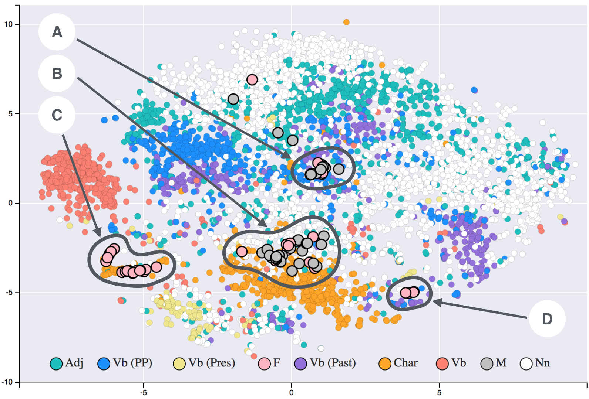
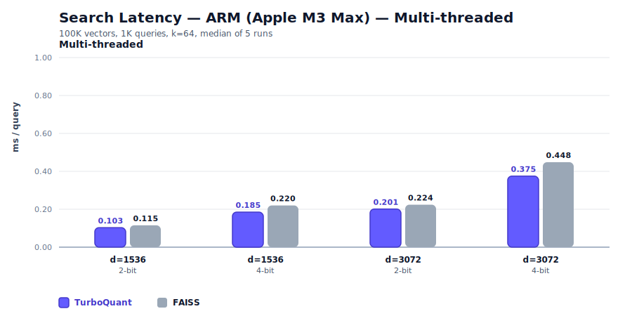
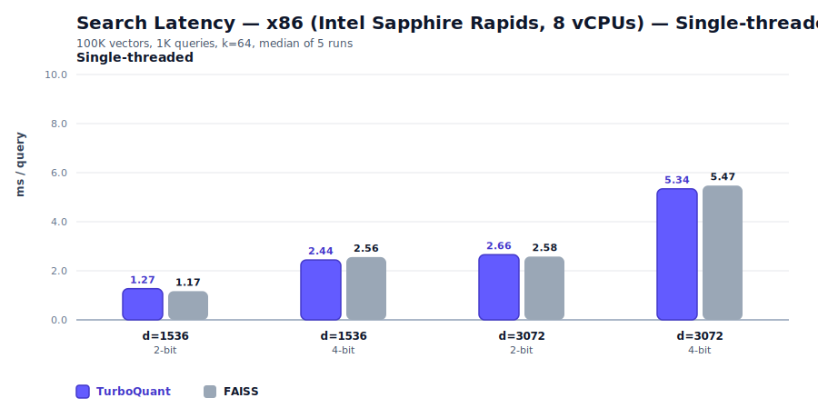
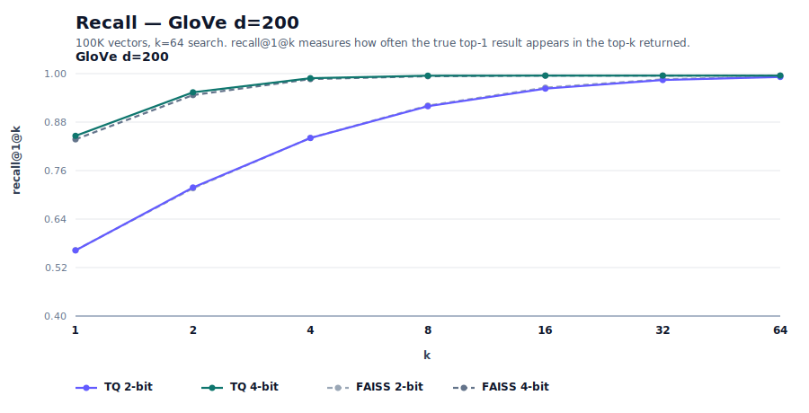
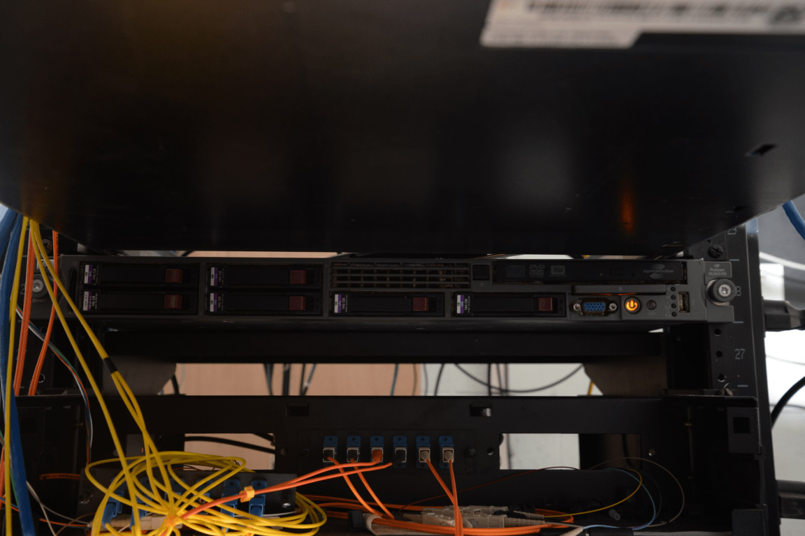

# 31GB to 4GB — The Training-Free Way to Compress Vectors

_turbovec & TurboQuant — reading training-free vector compression from the paper and the code_

## Executive Summary

> [!callout]
> turbovec is an open-source vector compression library that gathered roughly six thousand GitHub stars in a short window. Its README opens with a hook: "A corpus of 10 million documents takes 31GB of memory in float32. turbovec fits it in 4GB and searches faster than FAISS." This article follows the TurboQuant paper and the repository code to explain how it works and how far it's been shown — what is possible, and what has been confirmed so far.

> Here is the key point up front. turbovec's real differentiator is not its compression ratio but the fact that it needs **no training**. FAISS product quantization (PQ) has to learn a k-means codebook from data; TurboQuant randomly rotates each vector so its coordinates converge to a known distribution, then computes quantization boundaries from mathematics rather than from the data. The claim that it is "always faster than FAISS," by contrast, is false. The author's own README records that some 2-bit multithreaded configurations run 2–4% slower than FAISS.

> Every compression and speed figure here comes from one person's benchmark at 100K vectors. No third party has independently reproduced the headline 10M scale. New to the concept? Start with [the TurboQuant intro](/pebblopedia/turboquant/en/); if you already run FAISS, jump to Section 7 for a decision rule on when to switch.

### By the numbers

Compression and speed figures are the author's own benchmark at 100K scale. Source: turbovec README, TurboQuant (arXiv:2504.19874).

<!-- stat-card -->
**31GB → 4GB** — 10M embedding memory — 31GB is math-consistent for fp32; 4GB is the bit-arithmetic of 8× compression

<!-- stat-card -->
**0 training steps** — data-oblivious compression — Unlike FAISS PQ — no codebook training, no re-indexing. The real differentiator

<!-- stat-card -->
**−2 to 4%** — vs FAISS speed (some configs) — "Always faster" is false — the author logs 2-bit multithreaded as slower

<!-- stat-card -->
**100K** — verified benchmark scale — No third party has reproduced the headline 10M scale yet

**_Editor's note._** Why Pebblous returns to vector compression is simple: doing the same work with less data is, in the end, an AI-Ready Data question. We unpacked the concept earlier in [the TurboQuant intro](/pebblopedia/turboquant/en/); this article looks at how far the claim holds once that concept ships as a real library. The point where shrinking data turns into using data better is one we mean to keep watching.

## What appeared — turbovec and its claims

turbovec is a real repository. The address is [github.com/RyanCodrai/turbovec](https://github.com/RyanCodrai/turbovec), the license is MIT, and as of June 7, 2026 it carries roughly 5,974 stars (GitHub API, a moving number). A solo account named RyanCodrai created it on March 26, 2026, and published it under the name `turbovec` on both PyPI and crates.io. The README introduces the project as "Rust with Python bindings," but GitHub's language stats show Python at 385KB against Rust's 306KB — it is more accurate to read the core SIMD kernels as Rust and the bindings, benchmarks, and integration layer as Python.

Stated precisely, the README makes four claims. First, ten million documents stored in float32 take 31GB, and turbovec fits them in 4GB. Second, hand-written NEON (ARM) and AVX-512 kernels beat FAISS's IndexPQFastScan by 12–20% on ARM and match or beat it on x86. Third, a single 1536-dimensional vector shrinks from 6,144 bytes to 384 bytes, a 16× compression. Fourth, data-oblivious quantization with no codebook and no separate training step lands close to the Shannon lower bound on distortion. This article sorts each of the four into a different grade.

One source point deserves to be clear. The algorithm turbovec implements, TurboQuant, is not the author's own invention — it is a paper from Google researchers. **arXiv:2504.19874, "TurboQuant: Online Vector Quantization with Near-optimal Distortion Rate"**, by Amir Zandieh, Majid Daliri, Majid Hadian, and Vahab Mirrokni, was posted on April 28, 2025. The affiliations are reported as Google Research, Google DeepMind, and NYU, but the abstract itself carries no affiliation line, so this rests on secondary sources. An ICLR 2026 acceptance is likewise reported by multiple outlets, though the arXiv page does not state a venue. In short, turbovec is "an open-source implementation of a Google algorithm," and the paper's existence and mechanism are solid ground.

*▲ Embeddings turn documents into high-dimensional vectors. The closer two items are in meaning, the closer they sit in vector space — these are exactly the vectors turbovec compresses. | Source: [Wikimedia Commons (Siobhán Grayson, CC BY-SA 4.0)](https://commons.wikimedia.org/wiki/File:T-SNE_visualisation_of_word_embeddings_generated_using_19th_century_literature.png)*

> [!callout]
> To put it plainly, neither turbovec (the repository) nor TurboQuant (the paper) is fabricated. Both check out against primary sources. What differs is the weight of the README's performance figures versus the algorithm's theoretical guarantee. From the next section on, the analysis separates "what the paper guarantees," "what the author measured," "what is only math-consistent," and "what has not yet been confirmed."

## How TurboQuant works — compression without training

To understand turbovec, look at the method, not the ratio. The same 16× compression behaves very differently in production depending on whether you reach it by learning from data or by computing it in advance from math. TurboQuant's core property is that it is "data-oblivious" — it derives the coordinate-wise optimal quantization without ever looking at the input data. The method splits into four steps.

### 2.1. Four steps — from normalize to bit-packing

First, **normalize**. The vector's length (its norm) is peeled off and stored separately as a single float, leaving only the unit direction vector. Second, **random rotation**. Every vector is multiplied by the same random orthogonal matrix. After this, each rotated coordinate follows a Beta distribution, and as the dimension grows it converges to an N(0, 1/d) Gaussian. The paper puts it this way: rotating the input vectors at random induces a concentrated Beta distribution on the coordinates. This is the heart of being data-oblivious — whatever the input is, after rotation the distribution converges to a predictable shape.

*▲ This is where the magic of random rotation lives. Any input, once rotated, sees its coordinate distribution converge to a Gaussian like this one — and because the distribution is known in advance, the quantization boundaries can be computed from math instead of from data. | Source: [Wikimedia Commons (CC BY-SA 3.0)](https://commons.wikimedia.org/wiki/File:Multivariate_Gaussian.png)*

Third, **coordinate-wise scalar quantization (Lloyd–Max)**. Because the distribution is already known, the optimal quantization boundaries and centroids for each coordinate are precomputed from math rather than from the data. In the paper's phrasing, they are computed once, from mathematics rather than from data. Fourth, **bit-packing**. Coordinates are rounded to 2 bits (4 buckets) or 4 bits (16 buckets) and packed together. The README notes that it borrows RaBitQ's (arXiv:2405.12497) length re-normalization here — RaBitQ is prior work in the same lineage, a "rotation-plus-quantization with a theoretical error bound."

### 2.2. The decisive difference from FAISS PQ — whether a codebook is trained

The meaning of this mechanism becomes clear when you set it beside FAISS. FAISS product quantization (PQ) has to learn a codebook with k-means — running clustering on each subspace to build a set of representative vectors. Both the FAISS documentation and OpenSearch's docs state this explicitly. TurboQuant has no such training step at all. The difference is not one of compression quality; it is a difference in kind — learning versus no learning.

| Property | FAISS PQ / IVF | TurboQuant (turbovec) |
| --- | --- | --- |
| Codebook | Must be learned with k-means | Precomputed from math, no training |
| Training data | Required (IVF recommends a large set scaled to nlist) | Not needed (data-oblivious) |
| As data grows | Distribution drift risks retraining and re-indexing | Online ingestion, no retrain or rebuild |
| Adding new vectors | Encoded against the existing codebook (quality degrades under drift) | Added instantly, guarantee preserved |

One nuance, stated precisely. turbovec is not a perfect zero-fit either. The README's TQ+ mode fits two values per coordinate — a shift and a scale — once, on first load (step 3). But those values are fixed at the first add and then reused, and the README states there is "no retrain or rebuild." This is fundamentally unlike FAISS-style iterative k-means, but the honest framing avoids the exaggeration that "not a single parameter is read from the data." What the paper guarantees is that it achieves distortion within a small constant factor of the theoretical lower bound (the README cites 2.7×) across all bit-widths and dimensions.

> [!callout]
> turbovec's genuine novelty is not "16× compression." Cutting to 2 bits yields 16× by simple bit-arithmetic. The novelty is that it earns a **near-optimal distortion guarantee at that compression without any training or re-indexing**. That single sentence is the spine of this report. Any quantizer can boast a compression ratio; eliminating training is another matter.

## Verifying the numbers — how much is true

Now we check the headline figures with arithmetic. In short: the compression ratio itself is true by definition, but for it to hold as "31GB → 4GB" you have to assume a dimension and a bit-width, and the speed and recall figures are one person's measurements at 100K scale. The purpose of this section is to keep those grades from blending together.

### 3.1. The arithmetic of 31GB — it only holds once you name the dimension

Where does 31GB come from? Multiply ten million 768-dimensional fp32 embeddings.

10,000,000 × 768 × 4 bytes = 30.72 GB ≈ 31 GB  

                            10,000,000 × 1536 × 4 bytes = 61.44 GB

So "31GB" is accurate **only when you assume 768-dimensional fp32**. The README does not name the dimension, so this is an estimate reverse-derived by arithmetic. At an OpenAI ada-002-class 1536 dimensions, the same ten million vectors come to 61GB, and 31GB is wrong. The 4GB target splits the same way along dimension and bit-width. At 768 dimensions, 4GB is about 4.17 bits per coordinate (roughly 7.4×, i.e. 4-bit compression); at 1536 dimensions, 4GB is about 2.08 bits per coordinate (roughly 15×, i.e. 2-bit compression). The README's single-vector example ("6,144 bytes → 384 bytes = 16×", "→ 768 bytes = 8×") is pure bit-arithmetic, so it is true by definition, not a benchmark.

*▲ Compression — a 1536-dimensional fp32 vector of 6,144 bytes shrinks to 384 bytes at 2-bit, a 16× reduction. The ratio is the same bit-arithmetic for any quantizer; the real question is how much recall survives that compression. | Source: [turbovec README](https://github.com/RyanCodrai/turbovec) (100K vectors, k=64, author's own benchmark)*

### 3.2. Speed vs FAISS — "always faster" is false

The speed claim is the one to handle most carefully. The README's "12–20% faster on ARM, parity or better on x86" comes from the author's own measurement at 100K vectors, 1K queries, k=64, median of 5 runs, on an Apple M3 Max and an Intel Sapphire Rapids. That much is broadly true. But in the same README the author writes plainly that **the 2-bit multithreaded configurations (d=1536, d=3072) run 2–4% slower than FAISS**. So the social-media-style claim that "search speed always matches or beats FAISS" is **false in some configurations**. Stated precisely: "faster in most configurations, but FAISS wins in some 2-bit multithreaded ones."

*▲ ARM (M3 Max) multithreaded speed — TurboQuant beats FAISS FastScan by 12–20% across every configuration. | Source: [turbovec README](https://github.com/RyanCodrai/turbovec) (100K vectors, k=64, author's own benchmark)*

*▲ x86 (Sapphire Rapids) single-threaded speed — 4-bit wins every time by 1–6%, and 2-bit single-threaded is within about 1%. The only 2–4% slower cases are the 2-bit multithreaded configs, which are not shown here. | Source: [turbovec README](https://github.com/RyanCodrai/turbovec) (100K vectors, k=64, author's own benchmark)*

Recall is likewise an author measurement. The author reports beating FAISS by 0.4–3.4 points on R@1 at OpenAI d=1536 and d=3072, while also publishing the unfavorable result that at a low-dimensional GloVe d=200 in 2-bit it trails FAISS by 1.2 points. Leaving an unfavorable number in the README is an honest touch that adds credibility. The comparison baseline is FAISS IndexPQ (LUT256, nbits=8), which the author states is stronger than the paper's own custom baseline.

*▲ Recall at d=1536 — TurboQuant beats FAISS by 0.4–3.4 points at R@1, and both converge to 1.0 from k=4 (the win case). | Source: [turbovec README](https://github.com/RyanCodrai/turbovec) (100K vectors, k=64, author's own benchmark)*

*▲ Recall at GloVe d=200 — the harder low-dimensional regime. 4-bit wins by 0.3 points at R@1, but 2-bit trails by 1.2 points (the loss the author honestly published). The gap closes from k≈16. | Source: [turbovec README](https://github.com/RyanCodrai/turbovec) (100K vectors, k=64, author's own benchmark)*

### 3.3. Claim-by-claim grade table

Here is the verification so far in one table. Even among "facts," the things that are true by definition, guaranteed by the paper, measured by the author, only math-consistent, or not yet confirmed carry different weight.

| Claim | Verdict | Grade |
| --- | --- | --- |
| No training needed (data-oblivious) | Stated in the paper. The firmest differentiator | verified |
| 2-bit = 16× compression | True by definition of bit-arithmetic | math-consistent |
| 10M × 768 fp32 = 31GB | Accurate assuming 768 dim (30.72GB) | math-consistent |
| 12–20% faster on ARM | Author measurement at 100K scale | author-benchmark |
| Always matches or beats FAISS | 2–4% slower in 2-bit MT configs — false | false |
| Recall & speed at 10M scale | README benchmarks are 100K. No concurrent 10M measurement | unverified |

************************

> [!callout]
> The compression ratio is nothing to brag about — cut the bits and anyone gets the same multiple. The real question is "how much recall survives the cut to 4GB," and that recall figure is an author benchmark at 100K scale. A measurement of recall, speed, and memory taken together at the headline 10M scale is not directly confirmed in the README.

## Why it matters — the cost structure of RAG and the memory bottleneck

If the compression ratio is nothing to brag about, why did this library collect six thousand stars? The answer lies in the cost structure of RAG (retrieval-augmented generation). A RAG system turns documents into embedding vectors, holds them in memory, and finds the nearest vectors for every incoming query. As the corpus grows, this vector index becomes a bottleneck that swallows memory whole. Holding ten million documents as 768-dimensional fp32 is 31GB — a scale that starts to exceed a single server's RAM.

*▲ The number 31GB is not an abstraction but a bill. The larger the corpus, the more RAM and the pricier the instance a vector index demands. Compression means putting the same index on a smaller server. | Source: [Wikimedia Commons (Public domain)](https://commons.wikimedia.org/wiki/File:EFTA00002518_-_Server_rack_with_multiple_hard_drives_and_network_cables_connected_in_a_data_center_environment.jpg)*

Shrinking memory unlocks two things. First, the same index fits on a smaller, cheaper instance — at 8× compression, 31GB becomes 4GB, so the index can sit on a low-RAM server or alongside a single GPU. Second, quantized vectors scan faster under SIMD — reading fewer bytes eases the memory bandwidth bottleneck. Compression is not merely "saving capacity"; it is a lever that touches both search speed and infrastructure cost at once.

This is where the operational meaning of "no training" surfaces. A RAG corpus is not static. Documents are added daily, domains shift, distributions drift. With FAISS PQ, once the distribution has moved enough you must relearn the codebook and rebuild the index — which brings downtime and recomputation cost. Because TurboQuant's codebook is independent of the data, you just add new vectors — even if the distribution changes, the post-rotation coordinate distribution is still a known shape. This is the point at which the paper notes that "data-oblivious algorithms are well-suited to online applications."

One distinction to add. The TurboQuant paper itself covers not only vector search but also LLM KV-cache compression. Secondary sources report a 6× cut in KV memory and an 8× attention speedup on H100, but these are not confirmed directly in the abstract, so they stand at the level of press citation. turbovec implements **only the vector-search (nearest-neighbor) application** from that paper. It is more accurate not to lump the two applications together.

## Limits & unverified — the weaknesses, stated honestly

A good guide names the limits as clearly as the strengths. turbovec's weaknesses lie not in algorithmic flaws but in gaps in verification. If you are weighing adoption, it is worth flagging the following five as risks.

### 5.1. The gap between 100K and 10M

This is the largest gap. The headline "31GB → 4GB and faster than FAISS" is a ten-million-scale claim, but the README's recall and speed benchmarks are at 100K. A measurement of recall, speed, and memory taken together at a scale 100× larger is not directly confirmed in the sources. Do not read together the items that hold by arithmetic regardless of scale (like the compression ratio) and the items that can shift with scale (like recall).

### 5.2. The exception to "always faster"

As seen earlier, in 2-bit multithreaded d=1536/3072 the author records trailing FAISS by 2–4%. The speed advantage varies by configuration. A further limit is that the recall comparison rests on a single FAISS IndexPQ configuration — there is no comparison in the README against other FAISS setups like IVF-PQ or HNSW. The author's claim that the chosen baseline is strong is reasonable, but it does not mean "it beats every FAISS."

### 5.3. No third-party production validation

Every performance number is a single author's measurement. No independent third party has reproduced and validated the results at large scale yet. There is no operational data — production deployments, long-term stability, or recall-degradation curves under heavy load. The community response is at the level of Show HN with 89 points and 6 comments, and the small comment count makes it hard to call this deep peer review. The most notable reaction was from Redis creator antirez, who remarked on the mathematical elegance of using 4-bit centroids without min/max because the distribution is known.

### 5.4. Items that rest on secondary sources

The ICLR 2026 acceptance is reported by multiple outlets, but the arXiv page itself states no venue. The author affiliations (Google Research, DeepMind, NYU) are likewise absent from the abstract body and rest on press and summaries. The H100 KV-cache speedup figures are also secondary-source citations. These items are "probably correct" but worth reading as not yet confirmed by primary sources. On the other hand, the appearance of multiple independent implementations (Zig, PyTorch, WASM, Apple MLX, and others) is a positive sign that an ecosystem is forming — though this signals popularity, not performance validation.

> [!callout]
> In short, turbovec's weakness is not "it is wrong" but "it has not yet been verified enough." The algorithm's theoretical foundation is solid in the paper, and its honesty is high (it publishes unfavorable results). But two cells remain empty: independent reproduction at 10M scale and production case studies. Until those two cells fill, the headline is a "possibility," not a "guarantee."

## Pebblous perspective — same quality from less data

**Editor's note.** This section is not a sales pitch. It is closer to a memo on what caught our eye as a data-quality company reading through a vector-compression library. We do not build vector indexes. We work on the quality of the data that AI learns from and searches over. From that vantage point, the most interesting thing about turbovec is not the compression ratio — it is the phrase "without training."

The proposition "produce the same quality from less data" touches how Pebblous defines AI-Ready Data. TurboQuant solves that proposition in the domain of compression, by replacing prior knowledge of the data distribution with mathematics. It cuts the bits while keeping the distortion guarantee. Carry the same idea over to data quality and one question arises — to get the same model quality from less data, which data do you keep and which do you discard?

The reason turbovec can assume that "any data, once rotated, becomes distributionally predictable" is that the input is normalized to a unit vector and then obeys the geometric properties of high dimensions. Real training and retrieval data are not that clean. Duplicate embeddings, broken vectors, skewed distributions, and documents of unclear provenance are all mixed in. If the data is already distorted before compression, even a near-optimal quantizer will faithfully preserve that distortion. Compression does not clean data.

So we leave a question rather than an assertion. Can the duplicate and noise vectors that do not contribute to search quality be filtered out of an embedding corpus in advance? Would it be better to spend the memory freed by compression on holding more clean data? What picture emerges if you pursue "same quality from less" on both fronts at once — compression (turbovec) and refinement (data quality)? These questions remain open for us too. What is clear is only this: the idea of compression without training looks in the same direction as our own concern — keeping quality while using less data.

## What to watch now

For a practitioner, it is faster to ask whether turbovec fits your situation than to ask the binary "does it replace FAISS." The two tools are strong in different places.

**When to look at turbovec first.** When your corpus changes often and re-indexing cost is a burden; when you must keep ingesting new vectors online; when you need to put the index on a memory-tight single server or edge environment; and when you face a cold start with no training data to prepare. The "no training" property pays off directly in these scenarios.

**When to stay on FAISS.** When you need stability already proven in large-scale production; when your corpus is static enough to reuse one learned codebook for a long time; when you need the rich index options and GPU acceleration of IVF-PQ and HNSW; and when a recall curve verified at 10M+ scale is a premise of your decision. Here the empty 10M cell in turbovec carries weight.

Three signals are worth watching now. First, whether an independent benchmark emerges that measures recall, speed, and memory together at 10M scale from a third party. Second, whether production deployments and long-term operational data accumulate. Third, whether the multiple independent implementations (Zig, PyTorch, WASM, MLX) go beyond simple ports to cross-validate performance across different environments. When those three cells fill, the headline moves from "possibility" to "guarantee." Until then, remember that turbovec's firmest asset is not its compression ratio but the one line "it needs no training."

Thank you for reading to the end. This article was an attempt to cool the excitement by a notch and separate the claim from the verification. Whenever a new tool makes headlines, asking the same two questions first will keep you from losing your way — who measured this number, and at what scale, and has a third party reproduced it?

**Pebblous Data Communication Team**  
June 7, 2026

<!-- stat-card -->
**📚 PebbloPedia: TurboQuant** — This article pairs with [the TurboQuant intro](/pebblopedia/turboquant/en/). PebbloPedia reads one concept at five depths.

## Frequently Asked Questions (FAQ)

These are the questions readers ask most about turbovec and TurboQuant — whether 31GB → 4GB is true, whether it really beats FAISS, why no training is needed, and which tool to use when. The core is one idea: even among "facts," the things true by definition, measured by the author, and not yet verified carry different weight.

## References

### Papers

- 1.Zandieh, A., Daliri, M., Hadian, M., & Mirrokni, V. (2025). "TurboQuant: Online Vector Quantization with Near-optimal Distortion Rate." _arXiv preprint_. arXiv:2504.19874 (2025-04-28); ICLR 2026 acceptance per secondary sources. [arxiv.org/abs/2504.19874](https://arxiv.org/abs/2504.19874)
- 2.Douze, M., Guzhva, A., Deng, C., Johnson, J., Szilvasy, G., Mazaré, P.-E., Lomeli, M., Hosseini, L., & Jégou, H. (2024). "The Faiss library." _arXiv preprint_. arXiv:2401.08281. [arxiv.org/abs/2401.08281](https://arxiv.org/abs/2401.08281)
- 3.Gao, J., & Long, C. (2024). "RaBitQ: Quantizing High-Dimensional Vectors with a Theoretical Error Bound for Approximate Nearest Neighbor Search." _Proceedings of the ACM on Management of Data (SIGMOD)_. arXiv:2405.12497. [arxiv.org/abs/2405.12497](https://arxiv.org/abs/2405.12497)

### Open source & community

- 4.Codrai, R. (2026). "turbovec: A vector index built on TurboQuant, written in Rust with Python bindings." _GitHub_. MIT License; ~5,974 stars (as of 2026-06-07); PyPI/crates.io: turbovec. [github.com/RyanCodrai/turbovec](https://github.com/RyanCodrai/turbovec)
- 5."Show HN: TurboQuant for vector search – 2-4 bit compression." (2026). _Hacker News_. 89 points, 6 comments; participants include antirez. [news.ycombinator.com/item?id=47562135](https://news.ycombinator.com/item?id=47562135)
