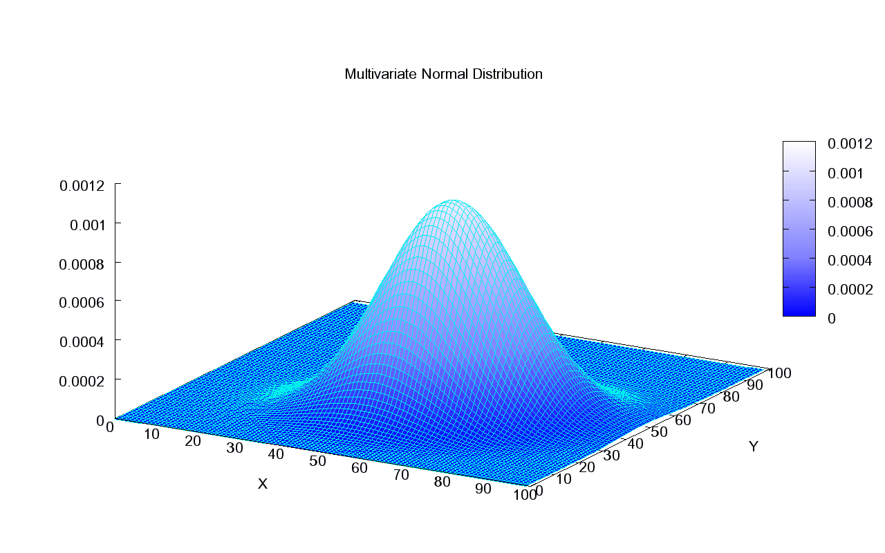
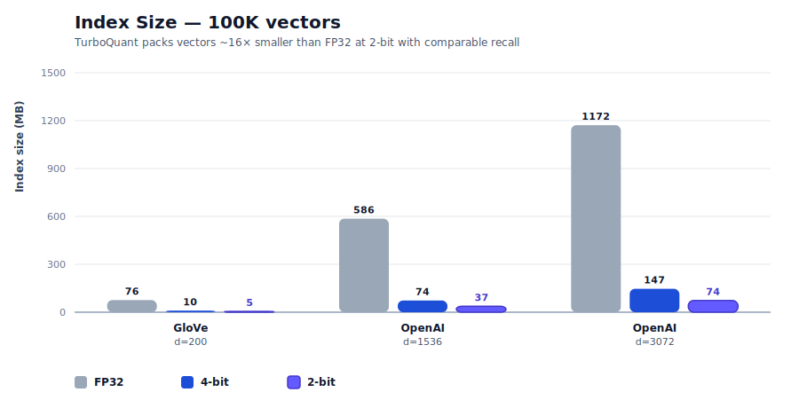
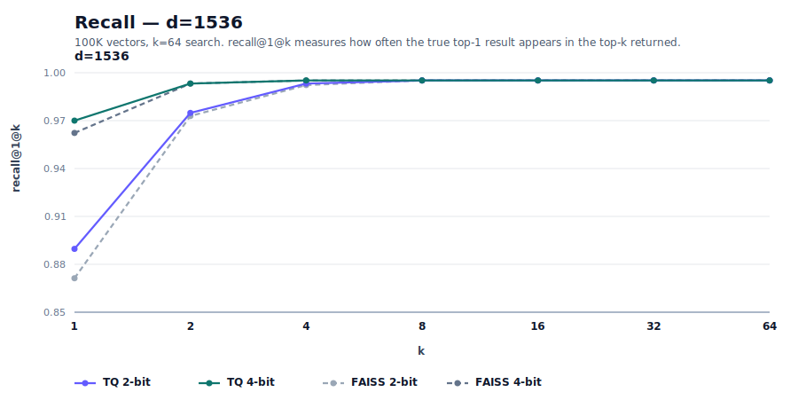

# 31GB를 4GB로 — 학습 없는 벡터 압축의 정체

_turbovec·TurboQuant — 논문과 코드로 읽는 학습 없는 벡터 압축_

## Executive Summary

> [!callout]
> turbovec은 GitHub에서 짧은 시간에 약 6천 개의 별을 모은 오픈소스 벡터 압축 라이브러리다. README 첫 줄은 이렇게 말한다. "1천만 문서 코퍼스는 float32로 31GB의 메모리를 먹는다. turbovec은 그것을 4GB에 담고, FAISS보다 빠르게 검색한다." 이 글은 그 주장을 TurboQuant 논문과 저장소 코드를 따라 차근히 풀어 본다. 무엇이 어떻게 가능한지, 어디까지 확인됐는지 함께 본다.

> 핵심을 먼저 적는다. turbovec의 진짜 차별점은 압축비가 아니라 **학습이 필요 없다**는 점이다. FAISS의 곱 양자화(PQ)는 데이터로 k-means 코드북을 학습해야 하지만, TurboQuant은 벡터를 무작위로 회전시켜 좌표 분포를 알려진 형태로 수렴시킨 뒤 양자화 경계를 데이터가 아닌 수학으로 계산한다. 반면 "항상 FAISS보다 빠르다"는 주장은 사실이 아니다. 저자 자신이 README에서 일부 2비트 멀티스레드 구성은 FAISS보다 2~4% 느리다고 적었다.

> 압축비와 속도 수치는 모두 저자 한 사람이 100K 벡터 규모에서 측정한 값이다. 헤드라인의 10M 규모를 제3자가 독립적으로 재현한 보고는 아직 없다. 개념이 처음이라면 [터보퀀츠 입문](/pebblopedia/turboquant/ko/)에서 시작하고, 이미 FAISS를 쓰고 있다면 이 글의 7절에서 언제 갈아탈지 판단 기준을 가져가면 된다.

### 숫자로 보면

압축비·속도는 저자 한 사람의 100K 규모 벤치마크 기준. 출처: turbovec README, TurboQuant (arXiv:2504.19874).

<!-- stat-card -->
**31GB → 4GB** — 1천만 임베딩 메모리 — float32 기준 31GB가 수학적으로 맞고, 4GB는 8배 압축의 비트 산술

<!-- stat-card -->
**학습 0단계** — data-oblivious 압축 — FAISS PQ와 달리 코드북 학습·재색인 없이 즉시 추가 — 진짜 차별점

<!-- stat-card -->
**−2~4%** — FAISS 대비 속도(일부) — "항상 더 빠르다"는 거짓 — 2비트 멀티스레드는 저자도 더 느리다고 기록

<!-- stat-card -->
**100K** — 검증된 측정 규모 — 헤드라인의 1천만 규모를 제3자가 재현한 보고는 아직 없다

**_편집자의 노트._** 페블러스가 벡터 압축을 다시 짚는 이유는 단순하다. AI가 더 적은 데이터로 같은 품질을 내는 길은 결국 AI-Ready Data의 문제이기 때문이다. 앞서 [터보퀀츠 입문](/pebblopedia/turboquant/ko/)에서 개념을 풀었고, 이번 글은 그 개념이 실제 라이브러리로 구현됐을 때 어디까지가 사실인지를 본다. 데이터를 줄이는 기술이 데이터를 더 잘 쓰는 기술로 이어지는 지점을 계속 지켜보려 한다.

## 무엇이 나왔나 — turbovec과 그 주장

turbovec은 실재하는 저장소다. 주소는 [github.com/RyanCodrai/turbovec](https://github.com/RyanCodrai/turbovec), 라이선스는 MIT, 2026년 6월 7일 기준 별은 약 5,974개다(GitHub API, 변동값). RyanCodrai라는 개인 계정이 2026년 3월 26일에 만들었고, PyPI와 crates.io 양쪽에 `turbovec`이라는 이름으로 배포돼 있다. README는 "Rust with Python bindings"라고 자기를 소개하지만, GitHub 언어 통계는 Python 385KB가 Rust 306KB보다 많다 — 핵심 SIMD 커널은 Rust, 바인딩·벤치마크·통합 레이어는 Python으로 보는 편이 정확하다.

README가 실제로 주장하는 것을 정확히 옮기면 네 가지다. 첫째, 1천만 문서를 float32로 담으면 31GB이고 turbovec은 4GB에 담는다. 둘째, 직접 작성한 NEON(ARM)·AVX-512 커널이 FAISS의 IndexPQFastScan을 ARM에서 12~20% 앞서고 x86에서는 대등하거나 앞선다. 셋째, 1536차원 벡터 하나가 6,144바이트에서 384바이트로 줄어 16배 압축이다. 넷째, 코드북 학습도 별도 학습 단계도 없는 data-oblivious 양자화로 왜곡의 섀넌 하한에 근접한다. 이 글은 이 네 주장을 각각 다른 등급으로 분류한다.

한 가지 출처를 분명히 해 둔다. turbovec이 구현하는 알고리즘 TurboQuant은 저자 본인의 발명이 아니라 구글 연구진의 논문이다. **arXiv:2504.19874, "TurboQuant: Online Vector Quantization with Near-optimal Distortion Rate"**, 저자는 Amir Zandieh·Majid Daliri·Majid Hadian·Vahab Mirrokni이며 2025년 4월 28일 게재됐다. 소속은 Google Research·Google DeepMind·뉴욕대로 보도되나 abstract 본문에는 표기가 없어 2차 출처에 의존한다. ICLR 2026 채택도 복수 매체가 전하지만 arXiv 페이지 자체에는 게재처 표기가 없다. 즉 turbovec은 "구글 알고리즘의 오픈소스 구현"이고, 논문의 실재와 메커니즘은 단단한 토대다.

*▲ 임베딩은 문서를 고차원 벡터로 바꾼다. 의미가 가까운 항목일수록 벡터 공간에서 가까이 모인다 — turbovec이 압축하는 대상이 바로 이런 벡터다. | Source: [Wikimedia Commons (Siobhán Grayson, CC BY-SA 4.0)](https://commons.wikimedia.org/wiki/File:T-SNE_visualisation_of_word_embeddings_generated_using_19th_century_literature.png)*

> [!callout]
> 정리하면, turbovec(저장소)도 TurboQuant(논문)도 날조가 아니다. 둘 다 1차 출처에서 확인된다. 다만 README의 성능 수치와 알고리즘의 이론적 보증은 서로 다른 무게를 갖는다. 다음 절부터는 "논문이 보증하는 것"과 "저자가 측정한 것", "수학적으로만 일관된 것", "아직 확인되지 않은 것"을 나누어 본다.

## TurboQuant 원리 — 학습 없는 압축

turbovec을 이해하려면 압축률이 아니라 압축 방식을 봐야 한다. 같은 16배 압축이라도, 데이터를 학습해서 얻는지 수학으로 미리 계산하는지는 운영에서 전혀 다른 결과를 낳기 때문이다. TurboQuant의 핵심은 "data-oblivious", 즉 입력 데이터를 보지 않고도 좌표별 최적 양자화를 계산한다는 데 있다. 그 방식은 네 단계로 나뉜다.

### 2.1. 네 단계 — 정규화에서 비트 패킹까지

첫째, **정규화(normalize)**다. 벡터에서 길이(norm)를 떼어 float 하나로 따로 저장하고, 단위 방향 벡터만 남긴다. 둘째, **무작위 회전(random rotation)**이다. 모든 벡터에 동일한 무작위 직교행렬을 곱한다. 이때 회전된 각 좌표는 Beta 분포를 따르고, 차원이 높아지면 N(0, 1/d) 가우시안으로 수렴한다. 논문은 이를 "입력 벡터를 무작위로 회전시켜 좌표에 집중된 Beta 분포를 유도한다"고 적는다. 이것이 data-oblivious의 핵심이다. 입력이 무엇이든 회전을 거치면 분포가 예측 가능한 형태로 수렴한다.

*▲ 무작위 회전의 마법은 여기에 있다. 어떤 입력이든 회전을 거치면 좌표 분포가 이 같은 정규분포로 수렴한다 — 분포를 미리 알기에 양자화 경계를 데이터가 아닌 수학으로 계산할 수 있다. | Source: [Wikimedia Commons (CC BY-SA 3.0)](https://commons.wikimedia.org/wiki/File:Multivariate_Gaussian.png)*

셋째, **좌표별 스칼라 양자화(Lloyd-Max)**다. 분포가 이미 알려져 있으므로, 각 좌표의 최적 양자화 경계와 중심을 데이터가 아니라 수학으로 사전 계산한다. 논문 표현으로는 "한 번, 데이터가 아니라 수학으로부터 계산된다." 넷째, **비트 패킹**이다. 좌표당 2비트(4버킷) 또는 4비트(16버킷)로 정수화해 묶는다. README는 여기서 RaBitQ(arXiv:2405.12497)의 길이 재정규화 기법을 차용했다고 밝히는데, RaBitQ는 "이론적 오차 한계를 가진 회전+양자화"라는 같은 계보의 선행 연구다.

### 2.2. FAISS PQ와의 결정적 차이 — 코드북 학습 유무

이 메커니즘의 의미는 FAISS와 나란히 놓을 때 분명해진다. FAISS의 곱 양자화(PQ)는 코드북을 k-means로 학습해야 한다. 부분 공간마다 군집을 돌려 대표 벡터 집합을 만드는 과정이다. 이 점은 FAISS 공식 문서와 OpenSearch 문서가 모두 명시한다. TurboQuant은 그 학습 단계 자체가 없다. 압축 품질의 차이가 아니라, "학습이 있느냐 없느냐"라는 종류의 차이다.

| 항목 | FAISS PQ / IVF | TurboQuant (turbovec) |
| --- | --- | --- |
| 코드북 | k-means로 학습 필요 | 수학으로 사전 계산, 학습 없음 |
| 학습 데이터 | 필요 (IVF는 nlist 비례 대량 권장) | 불필요 (data-oblivious) |
| 데이터 증가 시 | 분포가 변하면 재학습·재색인 위험 | 재학습·재빌드 없이 온라인 적재 |
| 신규 벡터 추가 | 기존 코드북 기준 인코딩 (드리프트 시 품질 저하) | 즉시 추가, 보증 유지 |

한 가지는 정확히 해 둔다. turbovec도 완전한 zero-fit은 아니다. README의 TQ+ 모드는 첫 적재 시 좌표별 shift·scale 두 값을 한 번 맞춘다(step 3). 다만 그 값은 첫 add에서 고정된 뒤 재사용되며 "재학습·재빌드 없음"이라고 명시한다. FAISS식 반복 k-means와는 근본이 다르지만, "단 하나의 파라미터도 데이터에서 안 본다"는 식의 과장은 피하는 게 정직하다. 논문이 보증하는 것은 "이론적 하한의 작은 상수 인자(README는 2.7배) 이내의 왜곡을 모든 비트폭·차원에서 달성한다"는 것이다.

> [!callout]
> turbovec의 진짜 새로움은 "16배 압축"이 아니다. 2비트로 줄이면 16배가 되는 것은 비트 산술상 당연하다. 새로운 것은 **학습도 재색인도 없이 그 압축에서 near-optimal 왜곡 보증을 얻는다**는 점이다. 이 한 문장이 이 보고서의 척추다. 압축비는 어느 양자화든 똑같이 자랑할 수 있지만, 학습을 없애는 것은 그렇지 않다.

## 수치 검증 — 어디까지 사실인가

이제 헤드라인 숫자를 산술로 검증한다. 결론부터 말하면, 압축비 자체는 정의상 참이지만 그것이 "31GB→4GB"로 성립하려면 차원과 비트폭 가정이 필요하고, 속도와 recall은 저자 한 사람의 100K 규모 측정이다. 등급을 섞지 않는 것이 이 절의 목적이다.

### 3.1. 31GB의 산술 — 차원을 명시해야 성립한다

31GB는 어디서 나온 숫자인가. 1천만 개의 768차원 fp32 임베딩을 곱하면 된다.

10,000,000 × 768 × 4 바이트 = 30.72 GB ≈ 31 GB  

                            10,000,000 × 1536 × 4 바이트 = 61.44 GB

따라서 "31GB"는 **768차원 fp32를 가정할 때만** 정확하다. README는 차원을 명시하지 않으므로, 이는 산술로 역산한 추정이다. OpenAI ada-002급 1536차원이라면 같은 1천만 개는 61GB가 맞고 31GB는 틀린다. 4GB라는 목표도 마찬가지로 차원·비트폭에 따라 갈린다. 768차원에서 4GB는 좌표당 약 4.17비트(약 7.4배, 즉 4비트 압축), 1536차원에서 4GB는 좌표당 약 2.08비트(약 15배, 즉 2비트 압축)다. README의 단일 벡터 예시("6,144바이트→384바이트=16배", "→768바이트=8배")는 순수 비트 산술이므로 벤치마크가 아니라 정의상 참이다.

*▲ 압축비 — 1536차원 fp32 벡터 6,144바이트가 2비트에서 384바이트로 16배 줄어든다. 압축비는 어느 양자화든 동일한 비트 산술이며, 진짜 쟁점은 그 압축에서 recall을 얼마나 지키느냐다. | 출처: [turbovec README](https://github.com/RyanCodrai/turbovec) (100K vectors, k=64, 저자 자체 벤치마크)*

### 3.2. FAISS 대비 속도 — "항상 빠르다"는 거짓이다

속도 주장은 가장 조심해서 다뤄야 한다. README의 "ARM 12~20% 빠름, x86 대등 이상"은 100K 벡터·1K 쿼리·k=64, 5회 중앙값, Apple M3 Max와 Intel Sapphire Rapids에서의 저자 측정이다. 여기까지는 대체로 사실이다. 그러나 저자는 같은 README에서 **2비트 멀티스레드 구성(d=1536, d=3072)에서는 FAISS보다 2~4% 느리다**고 직접 적었다. 따라서 "검색 속도가 항상 FAISS 동등 이상"이라는 SNS식 주장은 **일부 구성에서 거짓**이다. 정확히 쓰면 "대부분 구성에서 빠르나, 일부 2비트 멀티스레드 구성은 FAISS가 우세"다.

*▲ ARM(M3 Max) 멀티스레드 속도 — TurboQuant이 모든 구성에서 FAISS FastScan을 12~20% 앞선다. | 출처: [turbovec README](https://github.com/RyanCodrai/turbovec) (100K vectors, k=64, 저자 자체 벤치마크)*

*▲ x86(Sapphire Rapids) 단일스레드 속도 — 4비트는 매번 1~6% 앞서고, 2비트 단일스레드는 약 1% 이내로 대등하다. 2~4% 뒤지는 경우는 그래프에 없는 2비트 멀티스레드 구성뿐이다. | 출처: [turbovec README](https://github.com/RyanCodrai/turbovec) (100K vectors, k=64, 저자 자체 벤치마크)*

recall도 마찬가지로 저자 측정이다. 저자는 OpenAI d=1536·d=3072에서 R@1 기준 FAISS를 0.4~3.4점 앞섰다고 보고하는 한편, 저차원 GloVe d=200의 2비트에서는 FAISS에 1.2점 뒤진다고 불리한 결과까지 공개했다. 불리한 수치를 README에 남긴 점은 신뢰를 더하는 정직한 서술이다. 비교 베이스라인은 FAISS IndexPQ(LUT256, nbits=8)이며, 저자는 이것이 논문의 커스텀 베이스라인보다 강하다고 스스로 밝힌다.

*▲ d=1536 recall — TurboQuant이 R@1에서 FAISS를 0.4~3.4점 앞서고, k=4부터는 양쪽 모두 1.0으로 수렴한다(이긴 경우). | 출처: [turbovec README](https://github.com/RyanCodrai/turbovec) (100K vectors, k=64, 저자 자체 벤치마크)*

*▲ GloVe d=200 recall — 저차원의 까다로운 영역. 4비트는 R@1에서 0.3점 앞서지만 2비트는 1.2점 뒤진다(졌다고 솔직히 공개한 경우). k≈16부터 격차가 좁혀진다. | 출처: [turbovec README](https://github.com/RyanCodrai/turbovec) (100K vectors, k=64, 저자 자체 벤치마크)*

### 3.3. 주장별 등급표

지금까지의 검증을 한 표로 모은다. 같은 "사실"이라도 정의상 참인 것, 논문이 보증하는 것, 저자가 측정한 것, 산술로만 일관된 것, 아직 확인 못 한 것은 무게가 다르다.

| 주장 | 판정 | 등급 |
| --- | --- | --- |
| 학습 불필요 (data-oblivious) | 논문이 명시. 가장 단단한 차별점 | verified |
| 2비트=16배 압축 | 비트 산술상 정의로 참 | math-consistent |
| 10M×768 fp32 = 31GB | 768차원 가정 시 정확(30.72GB) | math-consistent |
| ARM 12~20% 빠름 | 100K 규모 저자 측정 | author-benchmark |
| 항상 FAISS 동등 이상 | 2비트 MT 구성서 2~4% 느림 — 거짓 | 거짓 |
| 10M 규모 recall·속도 | README 벤치는 100K. 10M 동시 측정 미확인 | unverified |

************************

> [!callout]
> 압축비는 자랑할 거리가 못 된다 — 비트를 줄이면 누구나 같은 배수를 얻는다. 진짜 쟁점은 "4GB로 줄이면서 recall을 얼마나 지키느냐"이고, 그 recall 수치는 100K 규모 저자 벤치마크다. 헤드라인이 말하는 10M 규모에서 recall·속도·메모리를 동시에 측정한 값은 README에서 직접 확인되지 않는다.

## 왜 중요한가 — RAG 비용 구조와 메모리 병목

압축비가 자랑거리가 아니라면, 왜 이 라이브러리가 6천 개의 별을 모았을까. 이유는 RAG(검색 증강 생성)의 비용 구조에 있다. RAG 시스템은 문서를 임베딩 벡터로 바꿔 메모리에 올려 두고, 질의가 들어올 때마다 가장 가까운 벡터를 찾는다. 코퍼스가 커지면 이 벡터 인덱스가 메모리를 통째로 먹는 병목이 된다. 1천만 문서를 768차원 fp32로 들고 있으면 31GB, 이는 단일 서버의 RAM을 넘기 시작하는 규모다.

*▲ 31GB라는 숫자는 추상이 아니라 청구서다. 코퍼스가 커질수록 벡터 인덱스는 더 큰 RAM, 더 비싼 인스턴스를 요구한다. 압축은 곧 같은 인덱스를 더 작은 서버에 올린다는 뜻이다. | Source: [Wikimedia Commons (Public domain)](https://commons.wikimedia.org/wiki/File:EFTA00002518_-_Server_rack_with_multiple_hard_drives_and_network_cables_connected_in_a_data_center_environment.jpg)*

메모리를 줄이면 두 가지가 풀린다. 첫째, 더 작은(저렴한) 인스턴스에 같은 인덱스가 올라간다 — 8배 압축이면 31GB가 4GB가 되어, RAM이 작은 서버나 단일 GPU 옆에도 인덱스를 둘 수 있다. 둘째, 양자화된 벡터는 SIMD로 더 빠르게 스캔된다 — 적은 바이트를 읽으니 메모리 대역폭 병목이 완화된다. 압축은 단순히 "용량 절약"이 아니라 "검색 속도와 인프라 비용 양쪽을 동시에 건드리는" 지렛대다.

여기서 학습 불필요가 운영에 주는 의미가 드러난다. RAG 코퍼스는 정적이지 않다. 문서가 매일 추가되고, 도메인이 바뀌고, 분포가 드리프트한다. FAISS PQ를 쓰면 분포가 충분히 변했을 때 코드북을 다시 학습하고 인덱스를 재빌드해야 하는데, 이는 운영 중단과 재계산 비용을 부른다. TurboQuant은 코드북이 데이터와 무관하므로, 새 벡터를 그냥 추가하면 된다 — 분포가 바뀌어도 회전 후 좌표 분포는 여전히 알려진 형태다. 논문이 "data-oblivious 알고리즘은 온라인 응용에 적합하다"고 적은 것이 이 지점이다.

한 가지 구분을 덧붙인다. TurboQuant 논문 본체는 벡터 검색뿐 아니라 LLM의 KV 캐시 압축도 다룬다. 2차 출처는 H100에서 KV 메모리 6배 절감, 어텐션 8배 가속을 전하지만 abstract에서 직접 확인되지 않아 보도 인용 수준이다. turbovec은 그 논문 중 **벡터 검색(최근접 이웃) 적용만** 구현한 것이다. 두 적용을 뭉뚱그리지 않는 것이 정확하다.

## 한계와 미검증 — 정직하게 적는 약점

좋은 가이드라면 강점만큼 한계도 분명히 적어야 한다. turbovec의 약점은 알고리즘 결함이 아니라 검증의 공백에 있다. 채택을 고려한다면 아래 다섯 가지를 리스크로 명시해 두는 편이 좋다.

### 5.1. 100K와 10M 사이의 간극

가장 큰 공백이다. 헤드라인 "31GB→4GB & FAISS보다 빠름"은 1천만 규모 주장이지만, README의 recall·속도 벤치마크는 100K 규모다. 100배 차이가 나는 규모에서 recall·속도·메모리를 동시에 측정한 값은 출처에서 직접 확인되지 않는다. 압축비처럼 규모와 무관하게 산술로 성립하는 항목과, recall처럼 규모에 따라 달라질 수 있는 항목을 섞어 읽으면 안 된다.

### 5.2. "항상 빠르다"의 예외

앞서 본 대로, 2비트 멀티스레드 d=1536/3072에서는 저자 스스로 FAISS에 2~4% 뒤진다고 기재했다. 속도 우위는 구성에 따라 달라진다. 또한 recall 비교가 FAISS IndexPQ 한 구성에 의존한다는 점도 한계다 — IVF-PQ나 HNSW 등 다른 FAISS 구성과의 비교는 README에 없다. 저자가 고른 베이스라인이 강하다는 주장은 합리적이지만, "모든 FAISS를 이긴다"는 뜻은 아니다.

### 5.3. 제3자 프로덕션 검증 부재

모든 성능 숫자가 저자 단독 측정이다. 독립적인 제3자가 대규모로 재현·검증한 보고는 아직 발견되지 않았다. 실서비스 도입 사례, 장기 운영 안정성, 대규모 부하 하에서의 recall 저하 곡선 같은 운영 데이터가 없다. 커뮤니티 반응은 Show HN 89점·댓글 6개 수준이고, 댓글 수가 적어 심층 동료 검토라고 보기는 어렵다. Redis 창시자 antirez가 분포가 알려져 있어 min/max 없이 4비트 중심점을 쓸 수 있다는 수학적 우아함을 언급한 정도가 눈에 띄는 반응이다.

### 5.4. 2차 출처에 의존하는 항목들

ICLR 2026 채택은 복수 매체가 전하나 arXiv 페이지 자체에는 게재처 표기가 없다. 저자 소속(Google Research·DeepMind·NYU)도 abstract 본문에는 없어 보도·요약 기준이다. KV 캐시의 H100 가속 수치도 2차 출처 인용이다. 이 항목들은 "아마 맞을 것"이지만 1차 확인은 안 된 상태로 읽어 두면 된다. 한편 다중 독립 구현(Zig·PyTorch·WASM·Apple MLX 등)이 등장한 것은 생태계가 형성 중이라는 긍정 신호다 — 다만 이는 인기의 신호이지 성능 검증은 아니다.

> [!callout]
> 요약하면, turbovec의 약점은 "틀렸다"가 아니라 "아직 충분히 검증되지 않았다"다. 알고리즘의 이론적 토대는 논문으로 단단하고, 정직성도 높다(불리한 결과 공개). 그러나 10M 규모 독립 재현과 프로덕션 사례라는 두 칸이 비어 있다. 그 두 칸을 채우기 전까지, 헤드라인은 "가능성"이지 "보증"이 아니다.

## 페블러스 관점 — 데이터를 더 적게 쓰면서 같은 품질

**편집자의 노트.** 이 절은 영업 제안이 아니다. 데이터 품질을 다루는 회사가 벡터 압축 라이브러리를 검증하며 무엇에 눈이 갔는지를 적은 메모에 가깝다. 우리는 벡터 인덱스를 만들지 않는다. 다만 AI가 학습하고 검색하는 데이터의 품질을 다룬다. 그 자리에서 보면, turbovec의 가장 흥미로운 지점은 압축비가 아니라 "학습 없이"라는 단어다.

"데이터를 더 적게 쓰면서 같은 품질을 낸다"는 명제는 페블러스가 AI-Ready Data를 정의하는 방식과 닿아 있다. TurboQuant은 그 명제를 압축의 영역에서, 데이터 분포에 대한 사전 지식을 수학으로 대체하는 방식으로 풀었다. 비트는 줄이되 왜곡 보증은 유지한다. 같은 발상을 데이터 품질 쪽으로 옮기면 질문이 하나 생긴다 — 더 적은 데이터로 같은 모델 품질을 내려면, 어떤 데이터를 남기고 어떤 데이터를 버려야 하는가.

turbovec이 "어떤 데이터든 회전시키면 분포가 예측 가능해진다"고 가정할 수 있는 이유는, 입력이 단위 벡터로 정규화된 뒤 고차원의 기하학적 성질을 따르기 때문이다. 현실의 학습·검색 데이터는 그렇게 깨끗하지 않다. 중복 임베딩, 깨진 벡터, 한쪽으로 쏠린 분포, 출처가 불분명한 문서가 섞여 있다. 압축 이전에 데이터 자체가 이미 왜곡돼 있다면, 아무리 near-optimal한 양자화라도 그 왜곡을 충실히 보존할 뿐이다. 압축은 데이터를 정제하지 않는다.

그래서 우리는 단언 대신 질문을 남긴다. 임베딩 코퍼스 안에서 검색 품질에 기여하지 않는 중복·노이즈 벡터를 미리 걸러낼 수 있을까. 압축으로 줄인 메모리를, 더 깨끗한 데이터를 더 많이 담는 데 쓰는 편이 나을까. "더 적게 쓰면서 같은 품질"이라는 목표를 압축(turbovec)과 정제(데이터 품질) 양쪽에서 동시에 추구하면 어떤 그림이 될까. 이 질문들은 아직 우리에게도 열려 있다. 다만 학습 없는 압축이라는 발상이, 데이터를 적게 쓰면서 품질을 지키려는 우리의 관심사와 같은 방향을 본다는 것만은 분명하다.

## 그래서 지금 무엇을 봐야 하나

실무자라면 turbovec을 "FAISS를 대체하는가"라는 이분법으로 묻기보다, 자신의 상황에 맞는 도구인지를 묻는 편이 빠르다. 두 도구가 강한 지점이 다르기 때문이다.

**turbovec을 먼저 검토할 때.** 코퍼스가 자주 바뀌어 재색인 비용이 부담될 때, 신규 벡터를 온라인으로 계속 적재해야 할 때, 메모리가 빠듯한 단일 서버나 엣지 환경에 인덱스를 올려야 할 때, 그리고 학습 데이터를 따로 준비하기 어려운 콜드 스타트 상황일 때다. 학습이 없다는 성질이 이 시나리오들에서 직접 값을 한다.

**FAISS를 유지할 때.** 이미 대규모 프로덕션에서 검증된 안정성이 필요할 때, 코퍼스가 정적이라 한 번 학습한 코드북을 오래 재사용할 수 있을 때, IVF-PQ·HNSW 같은 풍부한 인덱스 옵션과 GPU 가속이 필요할 때, 그리고 10M+ 규모에서 검증된 recall 곡선이 의사결정의 전제일 때다. turbovec의 10M 재현이 아직 비어 있다는 점이 여기서 무게를 갖는다.

지금 지켜볼 신호는 셋이다. 첫째, 제3자가 10M 규모에서 recall·속도·메모리를 동시에 측정한 독립 벤치마크가 나오는가. 둘째, 실서비스 도입 사례와 장기 운영 데이터가 쌓이는가. 셋째, 다중 독립 구현(Zig·PyTorch·WASM·MLX)이 단순 포팅을 넘어 서로 다른 환경의 성능을 교차 검증하는가. 이 세 칸이 채워지면 헤드라인은 "가능성"에서 "보증"으로 옮겨간다. 그 전까지는, turbovec의 가장 단단한 자산은 압축비가 아니라 "학습이 필요 없다"는 한 줄임을 기억하면 된다.

끝까지 읽어 주셔서 감사하다. 이 글은 흥분을 한 단계 식히고 주장과 검증을 분리하려는 시도였다. 새 도구가 화제가 될 때마다 같은 질문 두 가지를 먼저 던지면 길을 잃지 않는다 — 이 숫자는 누가 어떤 규모에서 측정했나, 그리고 그것을 제3자가 재현했나.

**페블러스 데이터 커뮤니케이션팀**  
2026년 6월 7일

<!-- stat-card -->
**📚 페블로피디아: 터보퀀츠** — 이 글은 [터보퀀츠 입문](/pebblopedia/turboquant/ko/)과 함께 읽기를 권장합니다. PebbloPedia는 하나의 개념을 다섯 깊이로 읽는 시리즈입니다.

## 자주 묻는 질문 (FAQ)

독자들이 turbovec과 TurboQuant을 두고 자주 던지는 질문을 모았다. 31GB→4GB가 사실인지, FAISS보다 정말 빠른지, 학습이 왜 필요 없는지, 언제 어느 도구를 써야 하는지까지. 핵심은 하나다 — 같은 "사실"이라도 정의상 참인 것, 저자가 측정한 것, 아직 검증 안 된 것은 무게가 다르다.

## 참고문헌

### 논문

- 1.Zandieh, A., Daliri, M., Hadian, M., & Mirrokni, V. (2025). "TurboQuant: Online Vector Quantization with Near-optimal Distortion Rate." _arXiv preprint_. arXiv:2504.19874 (2025-04-28); ICLR 2026 채택은 2차 출처 기준. [arxiv.org/abs/2504.19874](https://arxiv.org/abs/2504.19874)
- 2.Douze, M., Guzhva, A., Deng, C., Johnson, J., Szilvasy, G., Mazaré, P.-E., Lomeli, M., Hosseini, L., & Jégou, H. (2024). "The Faiss library." _arXiv preprint_. arXiv:2401.08281. [arxiv.org/abs/2401.08281](https://arxiv.org/abs/2401.08281)
- 3.Gao, J., & Long, C. (2024). "RaBitQ: Quantizing High-Dimensional Vectors with a Theoretical Error Bound for Approximate Nearest Neighbor Search." _Proceedings of the ACM on Management of Data (SIGMOD)_. arXiv:2405.12497. [arxiv.org/abs/2405.12497](https://arxiv.org/abs/2405.12497)

### 오픈소스 · 커뮤니티

- 4.Codrai, R. (2026). "turbovec: A vector index built on TurboQuant, written in Rust with Python bindings." _GitHub_. MIT License; 약 5,974 stars (2026-06-07 기준); PyPI/crates.io: turbovec. [github.com/RyanCodrai/turbovec](https://github.com/RyanCodrai/turbovec)
- 5."Show HN: TurboQuant for vector search – 2-4 bit compression." (2026). _Hacker News_. 89 points, 6 comments; antirez 등 참여. [news.ycombinator.com/item?id=47562135](https://news.ycombinator.com/item?id=47562135)
