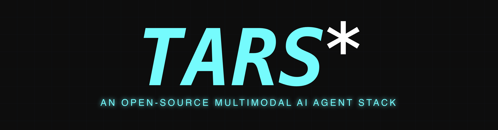
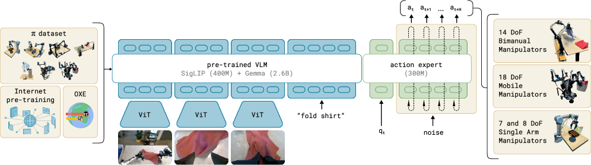

# Agents Are Data

_How ByteDance_

## Executive Summary

> [!callout]
> ByteDance opened **UI-TARS-desktop** in January 2025. As of 2026-05-13, the repo carries **33,573 stars** — the largest open-source GUI agent project on GitHub. While Anthropic Computer Use, OpenAI Operator, and Google Project Mariner all sit behind closed APIs, only two camps released full GUI agent stacks under permissive licenses: ByteDance (Apache-2.0) and Microsoft Magentic-UI (MIT). What sets UI-TARS apart is that it ships the whole pipeline — **model, framework, desktop/browser runtime, MCP, and behavior-log store** — bundled together. None of the closed players have done that.

> The UI-TARS-2 technical report ([arXiv:2509.02544](https://arxiv.org/abs/2509.02544), September 2025) reports 47.5% on OSWorld, 73.3% on AndroidWorld, and 88.2% on Online-Mind2Web — roughly double the initial UI-TARS score (24.6% at 50 steps) within twelve months. The accelerant is not the model itself but a **"data flywheel"**: hundreds of virtual machines harvest behavior traces around the clock, then push them through reflective filtering and DPO back into the training loop. The day ByteDance adopted "data flywheel" as official vocabulary is also the day Pebblous's long-running thesis — **"agents are data"** — stopped being a hypothesis and started being industry vocabulary.

> The global AI agent market is forecast to grow from $7.84B (2025) to $52.62B (2030) at a 46.3% CAGR. Korea grows even faster at 59.1% — roughly 1.3x the global pace. Yet Gartner's 2026 Hype Cycle warns that more than 40% of agentic AI projects will be cancelled by the end of 2027, citing cost, unclear value, and the absence of risk controls. The market is exploding, but **the quality and governance layer underneath is hollow**. Pebblous's three-tier proposition — DataClinic, AI-Ready Data, and the Physical AI Platform — fits exactly into that empty space.

<!-- stat-card -->
**33,573** — GitHub stars — Direct check, 2026-05-13

<!-- stat-card -->
**+956/day** — Early daily stars — Q1 2025 momentum reports

<!-- stat-card -->
**47.5%** — OSWorld (UI-TARS-2) — vs Claude 28.0% / Operator 36.4%

<!-- stat-card -->
**$52.6B** — AI agent market 2030 — CAGR 46.3%, M&M

## Agents Are Data — What the UI-TARS Release Really Means

In the previous era, the model was the means of production. Training data was a static corpus — the web, images, text — and once a model shipped, the data stopped moving. The new era is different. Every moment an agent watches your screen, moves the cursor, and presses a key becomes **raw material for the next generation of agents**. The age of static data has ended; the age of dynamic behavioral data has begun.

The phrase ByteDance chose in the UI-TARS-2 technical report leaves no ambiguity — **"data flywheel for scalable data generation."** Not a metaphor from observers, but the company's own terminology. Hundreds of VMs run GUI environments around the clock; the agent's successes and failures are filtered reflectively, scored through DPO (Direct Preference Optimization), and fed back into the model. The model produces data; the data produces the model. That closed loop is what Pebblous has been calling "agents are data" for years — and it has now arrived verbatim in a Big Tech publication.

The raw material isn't a single modality. It's a synchronized four-modal sequence — **screenshot** (current state), **command** (user intent), **mouse/keyboard action** (agent decision), and **UI state change** (outcome feedback). The four streams travel together along a time axis to form one trace, and each trace passes through a refinement pipeline to become a training example. In the static era, the label was "this image is a cat." In the dynamic era, the label is a four-axis sequence: "given this screen, with this intent, this action was taken, and this is what happened."

> [!callout]
> UI-TARS's 33,573 stars are not just a popularity signal. They mark the moment the claim **"an agent's behavior is data"** hardened from hypothesis into Big Tech's official strategic vocabulary. The next twelve months will hinge on a single question — what data governance must enterprises (especially outside the United States and China) build on top of that vocabulary?

This paradigm shift connects directly to Pebblous's adjacent work. [Our hermes-agent report](/report/hermes-agent-data-quality-risk/en/) dissected the mechanics of self-reinforcing contamination in agent self-training loops. [Meta's "AI is eating software" declaration](/blog/neural-computers-meta/en/) framed the broader paradigm — the screen becomes the interface. UI-TARS sits at their intersection: the largest open experiment in treating screens as training data.

*▲ The slogan ByteDance placed at the top of the UI-TARS-desktop repository — "An Open-Source Multimodal AI Agent Stack." | Source: [bytedance/UI-TARS-desktop](https://github.com/bytedance/UI-TARS-desktop)*

## UI-TARS Architecture — The Five Layers of the Multimodal Stack

What structurally distinguishes UI-TARS from every other GUI agent is simple: it's not just a model. ByteDance released the **model, framework, runtime, MCP, and log store** as one bundle. No other Big Tech player has open-sourced all five layers at once. A fully Apache-2.0 stack lets enterprises draw a clean line between "our asset" and "vendor surface."

### 2.1. TARS Vision-Language Model — the Visual Brain

At the base sits the TARS VLM: a dual-resolution vision encoder (high/low), a text tokenizer, and a multimodal head that fuses the two streams. The lineage is well-documented. The 1120×1120 dual-encoder pattern first proposed in [CogAgent](https://arxiv.org/abs/2312.08914) (THUDM, December 2023) flowed through [SeeClick](https://arxiv.org/abs/2401.10935) (January 2024), [Ferret-UI](https://arxiv.org/abs/2404.05719) (Apple, April 2024), [OS-Atlas](https://arxiv.org/abs/2410.23218) (October 2024), and [ShowUI](https://arxiv.org/abs/2411.17465) (November 2024) before landing in [UI-TARS](https://arxiv.org/abs/2501.12326) (January 2025). Each step layered on grounding accuracy, resolution adaptation, and action-token expressiveness.

### 2.2. Agent TARS Framework — Slow Reasoning

The second layer handles System-2 reasoning. It decomposes a task into smaller steps, reflects at each milestone, and reroutes when an attempt fails. This is the third of the four innovation axes outlined in the original UI-TARS paper. Kahneman's dual-system framework has effectively been crowned the canonical scaffolding for multimodal action models.

*▲ The Agent TARS CLI on startup. Spinning up a full multimodal AI agent server in a single command captures what an open-source, full-stack release feels like in practice. | Source: [bytedance/UI-TARS-desktop](https://github.com/bytedance/UI-TARS-desktop)*

### 2.3. Desktop/Browser UI Layer — Hands and Eyes

The third layer is the runtime that actually drives the OS and browser. Built on Electron and Chromium, v0.2.0 (June 2025) added Remote Computer/Browser Operator, extending coverage to remote desktops and headless environments. It can run on the user's local machine or inside an isolated container. With [Apple Silicon MLX quantization](/blog/mlx-vlm-physical-ai-edge/en/), on-device inference is feasible too — making this the only Big Tech GUI agent that can run a closed loop inside an enterprise perimeter without ever sending data to the cloud.

### 2.4. MCP (Model Context Protocol) — External Limbs

The fourth layer adopts Anthropic's MCP standard, giving the agent access to external tools, APIs, file systems, and databases. Placing a separation layer between model and operating system makes the permission boundary explicit. Which tools are allowed, which directories are writable — those decisions live outside the model code, where they can be audited.

### 2.5. Behavior Log Store — the Data Mine

At the top sits the **Event Stream Viewer** introduced in Agent TARS CLI v0.3.0 (November 2025). It exposes — to the developer directly — every screen the agent looks at, every chain of reasoning it runs, and every action it fires. No other Big Tech GUI agent makes those traces inspectable at this depth. This layer is the actual mining floor where the "data flywheel" turns; it is also the physical interface where governance tooling can apply diagnostics, normalization, and anonymization.

> [!callout]
> The decisive fact is that all five layers ship under **Apache-2.0**. An enterprise can take the model alone, the framework alone, or simply pull the behavior-log store and bolt it onto an internal model. [Where Meta's screen-learning AI ended as a closed demo](/blog/neural-computers-meta/en/), UI-TARS released the same paradigm as actual code and weights.

## Re-reading the Field — Five Camps, Two Open

The GUI agent space has split into five camps: ByteDance (UI-TARS), Anthropic (Computer Use), OpenAI (Operator), Google (Project Mariner), and Microsoft (Magentic-UI). Of those, **only two are open source** — ByteDance and Microsoft. The rest are closed APIs or experimental cloud services. For any enterprise that wants to embed a GUI agent into its own infrastructure, the option set is already narrow.

| Dimension | UI-TARSByteDance | Computer UseAnthropic | OperatorOpenAI | MarinerGoogle | Magentic-UIMicrosoft |
| --- | --- | --- | --- | --- | --- |
| License | Apache-2.0 | Closed API | Closed ($200/mo) | Closed (experimental) | MIT |
| Model | TARS VLM (dedicated) | Claude 3.5+/Opus | GPT-4o + CUA | Gemini 2.0+ | Magentic-One + AutoGen |
| Platforms | Desktop + browser + game | Desktop API | Browser only | Chrome only | Browser only |
| OSWorld | 47.5 (TARS-2, 2025-09) | 28.0 (3.5) / 78 (Opus 4.7) | 36.4 (CUA) | — | — |
| Local deployment | Supported | Not supported | Not supported | Not supported | Supported |
| Data policy | User-retained(but ByteDance backflow possible) | Anthropic servers | OpenAI servers | Google servers | User-retained |

************************************

### 3.1. The Benchmark Sprint — Eighteen Months to Human Level

The OSWorld curve is steep. The best score in April 2024 was 12.24%. UI-TARS reached 24.6% in January 2025 (50 steps), UI-TARS-1.5 hit 42.5% in April 2025 (100 steps), UI-TARS-2 landed at 47.5% in September 2025, and Holo3-35B reported 82.6% in April 2026 — past the 72.36% human baseline in roughly eighteen months. But these numbers come from **different models, different step counts, different points in time**. Direct comparison is hazardous. Any citation should carry "version + step count + timestamp." As [our benchmark trust report](/report/ai-agent-benchmark-trust/en/) argued, scores deserve more skepticism, not less, as the field heats up.

*▲ A single multimodal trace from UI-TARS-2 — when told to "play the Hex game and try to score more," the agent searches the web, parses pages, executes game actions, and writes HTML to summarize its experience, all inside one loop. The All-in-One GUI Sandbox unifies desktop, mobile, browser, and game environments. | Source: [arXiv:2509.02544 (UI-TARS-2 Technical Report)](https://arxiv.org/abs/2509.02544)*

### 3.2. What "Open vs Closed" Actually Means

On the surface, UI-TARS's edge is the triple of open source, multi-platform, and local deployment. From a data perspective, there's a twist. Apache-2.0 lets anyone use the code and weights freely — but the same release that ByteDance calls a "data flywheel" also implies an internal mechanism that benefits from external behavior data flowing back in. Compared with closed offerings like [Anthropic's managed agents](/blog/claude-managed-agents/en/), where cloud transmission is explicitly written into the terms of service, the open-source option arguably demands _more_ careful governance design, not less. As [the agentic framework explosion](/blog/agentic-framework-explosion/en/) illustrates, the category is multiplying faster than the governance scaffolding underneath it.

## The Agent Data Lifecycle — Five Stages, Four Modality-Specific Failures

An agent's behavior log moves through five stages: **collection → refinement → validation → storage → retraining**. Each stage breeds modality-specific quality defects, and a defect in one modality cascades into another. A low-resolution screenshot blurs UI element recognition; blurred recognition misplaces click coordinates; misplaced clicks drive the next screen state somewhere the agent never intended. Break that chain and traces become training data; fail to break it, and traces become poison.

*▲ The standard multimodal LLM inference pipeline. Vision and text inputs each pass through their own encoder/tokenizer before fusing inside the LLM — a defect in any one modality cascades at the fusion step. UI-TARS behavior logs follow exactly this structure. | Source: [arXiv:2404.18930 (Bai et al., 2024)](https://arxiv.org/abs/2404.18930)*

This is exactly the surface DataClinic was designed to diagnose. Each modality has its own characteristic defect, its own failure mechanism, and a corresponding diagnostic axis:

| Modality | Quality defect | Failure mechanism | DataClinic diagnostic axis |
| --- | --- | --- | --- |
| Vision(screenshot) | Low resolution, DPI bias, focus errors | UI element recognition fails → wrong click coordinate | Image metadata, pixel distribution analysis |
| Text(command) | Ambiguous instructions, domain jargon, mixed languages | Intent misread → wrong task executed | NLP quality scoring, intent confidence |
| Action(mouse + keyboard) | Imprecise coordinates, timing errors, double clicks | Missed click / dropped input → state desync | Sequential data validation, idle/active distribution |
| Trajectory(behavior log) | Incomplete records, state contamination, self-reinforcement | Retraining loop pollution → cascading errors | Time-series drift, label leakage detection |

****  
****  
****  
****

### 4.1. The Mechanics of Self-Reinforcing Contamination

The most dangerous defect lives at the trajectory level. [A 2025 survey of agent hallucination](https://arxiv.org/abs/2509.18970) (arXiv:2509.18970, September 2025) names the mechanism precisely — **"recursive memory-conditioning... self-reinforcing feedback loops, where an agent's hallucinations or faulty conclusions are re-ingested and cemented as factual priors."** If an agent's misclick is logged as a "success," that flawed trace enters the retraining set, and the next-generation model learns the error as canon.

The MLLM hallucination survey ([arXiv:2404.18930](https://arxiv.org/abs/2404.18930)) sharpens this further. A "wrong click" in a UI agent is directly tied to object hallucination in visual input. If the model hallucinates a button that isn't on the screen, it fires a click toward that ghost — and the subsequent screen drifts away from the intended path. That's exactly why UI-TARS's "Reflective Online Traces" are simultaneously the source of its SOTA performance and its biggest risk: if the reflective filter itself has a defect, that defect is inherited cleanly into the next generation.

> [!callout]
> This chain mirrors the self-contamination patterns Pebblous documented in the [hermes-agent report](/report/hermes-agent-data-quality-risk/en/) and the [LLM self-seizure report](/report/llm-self-seizure/en/). The only difference is that modalities multiplied — what used to corrupt only text now corrupts screenshots, mouse traces, and UI states in lockstep. That is precisely why per-modality diagnostics matter.

## Digital ↔ Physical Isomorphism — the Screen Is the Robot's Other Body

Place UI-TARS next to a robot VLA (Vision-Language-Action) model and the two structures look uncannily alike. The path from screen pixels to mouse coordinates and the path from camera pixels to motor torques follow the **same blueprint**. Remove the input differences (screenshots vs camera frames) and the output differences (keyboard/mouse vs 7-DoF joint commands), and every intermediate stage maps one-to-one. The screen is the robot's other body.

| Stage | UI-TARS (digital) | VLA model (physical) |
| --- | --- | --- |
| Observation | Screenshot 1120×1120 | Camera / depth sensor |
| Understanding | TARS VLM (vision + text fusion) | RT-2 / OpenVLA / π0 VLM backbone |
| Intent | System-2 reasoning (decomposition + reflection) | GR00T System-2 / Gemini Robotics ER |
| Action | Mouse/keyboard action tokens | 7-DoF motor torque / gripper |
| Feedback | UI state change (DOM / pixel diff) | Environment state (force / proprioception) |
| Retraining | Reflective Online Traces | Open X-Embodiment trajectories |

************************

The VLA lineup moved in lockstep over the same window. [RT-2](https://arxiv.org/abs/2307.15818) (Google DeepMind, July 2023, the original VLA) → [OpenVLA](https://arxiv.org/abs/2406.09246) (Stanford + Berkeley, June 2024, 7B open weights) → [π0](https://arxiv.org/abs/2410.24164) (Physical Intelligence, October 2024, flow matching) → [GR00T N1](https://arxiv.org/abs/2503.14734) (NVIDIA, March 2025, dual-system humanoid) → [Gemini Robotics](https://arxiv.org/abs/2503.20020) (Google + Apptronik, March 2025). The digital line (UI-TARS) and the physical line (VLA) converged on the same dual-system scaffolding, the same multimodal fusion, the same action-token pattern.

*▲ π0's VLA data flow (Physical Intelligence). Camera input and natural language enter a vision-language backbone; an action expert generates continuous motor torques via flow matching. The pattern is structurally identical to how UI-TARS generates mouse and keyboard tokens on a screen. | Source: [arXiv:2410.24164 (π0, Physical Intelligence)](https://arxiv.org/abs/2410.24164)*

### 5.1. The Mirror Image: Open vs Closed

More striking is that the camp structure mirrors too. On the digital side, ByteDance (UI-TARS) and Microsoft (Magentic-UI) chose open while Anthropic, OpenAI, and Google chose closed. On the physical side, NVIDIA (GR00T N1), Stanford (OpenVLA), and Physical Intelligence (π0) chose open while Google Gemini Robotics, Figure AI, and others chose closed. As [our VLA architecture comparison](/report/vla-architecture-comparison/en/) argued, the logic that "whoever owns the data owns the model" plays out identically across both domains.

For Pebblous, this isomorphism isn't analogy. As the [Physical AI industry landscape report](/report/physical-ai-industry-landscape/en/) noted, unifying the data interface makes it possible to diagnose GUI agent training pipelines and robot training pipelines with the same tools. The synthetic interface shown in our [3DGS synthetic data for VLA training piece](/report/isaac-sim-3dgs-vla-synthetic-data-2026-04/en/) can transplant directly into GUI simulation data.

> [!callout]
> UI-TARS's behavior logs and GR00T / π0's trajectory data share the same diagnostic axes — temporal consistency, label leakage, self-reinforcing contamination, distribution drift. That's the reason Pebblous designs the Physical AI Platform as a **common data layer** spanning both GUI agents and robot agents.

## Redefining the AI-Ready Data Platform

The definition of AI-Ready Data is shifting. In the era of static corpora — web, image, text — "AI-ready" meant a well-labeled, cleanly curated dataset. In the era of dynamic agents, the definition expands to **"a behavior log whose modality consistency and temporal integrity have been verified well enough to safely re-enter a retraining loop."** Because UI-TARS itself manufactures millions of screenshot-command pairs per user per month, the pipeline that refines that ore and feeds it back into the model becomes the core of the data business itself.

### 6.1. The Numbers — Korea Grows 1.3× Faster Than Global

MarketsandMarkets puts the global AI agent market at **$7.84B (2025) → $52.62B (2030)**, a 46.3% CAGR. Grand View Research's separate Korea estimate runs from **$193.8M to $7,649.3M** at a 59.1% CAGR — about 1.3× the global pace. For data companies that previously served static corpora and are now pivoting to dynamic behavior logs, Korea is sitting at an unusually favorable inflection.

### 6.2. RPA Changes Seats

The RPA (Robotic Process Automation) market reached $3.8B in 2024 and is still growing (+18% YoY), but Gartner has flagged that "GenAI / agentic AI will dampen RPA growth." Rule-based automation is being absorbed into learning-based agents — a clear conversion TAM. UiPath's launch of an "Agentic Automation Platform" in September 2025 reflects the same arc. In Korea, Inventis's December 2025 RPA MOU with Upstage (a leading Korean LLM company) signaled the same transition.

### 6.3. Pebblous's Three-Tier Proposition

AI-Ready infrastructure in the dynamic-data era splits into three tiers. **Diagnosis** (DataClinic) catches per-modality quality defects in behavior logs. **Normalization** (AI-Ready Data) refines and anonymizes them into a retrainable standard format. **Connection** (Physical AI Platform) binds the training pipelines of digital agents and robot agents into a single interface. As [our piece on the agent economy and data asset-ization](/blog/stablecoin-data-ai-agent-economy-2026/en/) argued, once behavior data starts trading as an asset, these three tiers stop being tools and become market infrastructure.

## The Pebblous View — Data Sovereignty in the Agent Economy

The choice facing enterprises outside the US-China duopoly is starker than it looks. Either pay $200 a month for closed Computer Use / Operator and ship every behavior trace to a US cloud, or pick up the UI-TARS open camp for free and design — yourself — the governance that handles local deployment and blocks ByteDance backflow. There is no middle path. Pebblous's role is to make the second option **trustworthy enough to actually pick**.

### 7.1. Reading Gartner's 40% Cancellation Warning in Reverse

Gartner's 2026 Hype Cycle warns that more than 40% of agentic AI projects will be cancelled by the end of 2027 — citing cost, unclear value, and the lack of risk controls. If the market is exploding and roughly half of it fails, the empty space those failures leave behind is precisely where infrastructure providers need to land. Four conditions matter for safe enterprise adoption: (1) data governance (sovereignty and license analysis), (2) explicit local/cloud deployment decisions, (3) monitoring, audit, and rollback workflows, and (4) a retraining cadence with quality verification.

### 7.2. The Open Seat — the Interface Layer

In Korea, while major incumbents focus on the model layer, the GUI agent interface layer sits empty. Naver's "Agent N" (announced for Q1 2026), Kakao's "Kanana 2," and Upstage's "Solar Pro 3" (March 2026) are all model-layer launches; Saltlux's "AI Business Innovation Center" (July 2025) is a consulting layer. The combination of UI-TARS, a Korean LLM, and Pebblous data quality infrastructure is a natural fit. With [Korea's Digital Asset Framework Act (2026)](/report/korea-digital-asset-basic-law-2026/en/) in force, the possibility that behavior logs and screenshots get folded into the definition of personal data grows real — and the governance layer becomes a compliance asset, not just a quality asset.

### 7.3. Four Axes of Data Quality Diagnostics

DataClinic diagnoses UI-TARS behavior logs along four axes — **per-modality consistency** (synchronized timing across screenshot, command, action), **time-series drift** (quantified distribution shift), **label leakage** (evaluation set bleeding into training set), and **self-reinforcing contamination** (errors accumulating across retraining cycles). The same four axes apply cleanly to the [hermes-agent self-training loop diagnosis](/report/hermes-agent-data-quality-risk/en/) and to [on-device VLM deployment](/blog/mlx-vlm-physical-ai-edge/en/) scenarios. Digital or physical agents, cloud or on-device — the same diagnostic toolkit fits every combination.

## Pebblous Take — the Empty Seat Beside the Model

> [!callout]
> **The moment ByteDance adopted "data flywheel" as official vocabulary is the moment "agents are data" stopped being a Pebblous hypothesis and became industry language.**

> Pebblous doesn't build models. We diagnose, normalize, and connect the closed loop in which the data a model consumes becomes the data a model creates, which becomes the food for the next model. UI-TARS's 33,573 stars prove one thing — agent infrastructure is now open, but the quality, sovereignty, and governance of the data flowing through it remain empty.

> Competitors sell agents. Pebblous makes those agents trustworthy. DataClinic catches per-modality defects; AI-Ready Data refines the retraining set; the Physical AI Platform binds digital and physical behavior data into a single interface. The empty seat beside the model — that is Pebblous's seat.

## References

29 sources cited across academic papers, industry announcements, and market reports. All entries are managed as CSL-JSON (`references.json`) and can be exported as BibTeX or RIS via the buttons below.

[View CSL-JSON](../references.json)

### UI-TARS and GUI Agent Papers

- 1.Qin, Y., et al. (ByteDance Seed). (2025). "UI-TARS: Pioneering Automated GUI Interaction with Native Agents." [arXiv:2501.12326](https://arxiv.org/abs/2501.12326).
- 2.ByteDance Seed. (2025). "UI-TARS-2 Technical Report: Advancing GUI Agent with Multi-Turn Reinforcement Learning." [arXiv:2509.02544](https://arxiv.org/abs/2509.02544).
- 3.Hong, W., et al. (THUDM). (2023). "CogAgent: A Visual Language Model for GUI Agents." CVPR 2024. [arXiv:2312.08914](https://arxiv.org/abs/2312.08914).
- 4.Cheng, K., et al. (2024). "SeeClick: Harnessing GUI Grounding for Advanced Visual GUI Agents." ACL 2024. [arXiv:2401.10935](https://arxiv.org/abs/2401.10935).
- 5.You, K., et al. (Apple). (2024). "Ferret-UI: Grounded Mobile UI Understanding with Multimodal LLMs." ECCV 2024. [arXiv:2404.05719](https://arxiv.org/abs/2404.05719).
- 6.Wu, Z., et al. (2024). "OS-ATLAS: A Foundation Action Model for Generalist GUI Agents." [arXiv:2410.23218](https://arxiv.org/abs/2410.23218).
- 7.Lin, K. Q., et al. (2024). "ShowUI: One Vision-Language-Action Model for GUI Visual Agent." CVPR 2025. [arXiv:2411.17465](https://arxiv.org/abs/2411.17465).
- 8."Large Language Model-Brained GUI Agents: A Survey." (2024). [arXiv:2411.18279](https://arxiv.org/abs/2411.18279).

### Benchmark Papers

- 9.Xie, T., et al. (2024). "OSWorld: Benchmarking Multimodal Agents for Open-Ended Tasks in Real Computer Environments." NeurIPS 2024. [arXiv:2404.07972](https://arxiv.org/abs/2404.07972).
- 10.Zhou, S., et al. (2023). "WebArena: A Realistic Web Environment for Building Autonomous Agents." [arXiv:2307.13854](https://arxiv.org/abs/2307.13854).
- 11.Li, K., et al. (2025). "ScreenSpot-Pro: GUI Grounding for Professional High-Resolution Computer Use." [arXiv:2504.07981](https://arxiv.org/abs/2504.07981).
- 12.Google Research. (2024). "AndroidWorld: A Dynamic Benchmarking Environment for Autonomous Agents." [arXiv:2405.14573](https://arxiv.org/abs/2405.14573).

### Vision-Language-Action (VLA) Models

- 13.Brohan, A., et al. (Google DeepMind). (2023). "RT-2: Vision-Language-Action Models Transfer Web Knowledge to Robotic Control." CoRL 2023. [arXiv:2307.15818](https://arxiv.org/abs/2307.15818).
- 14.Kim, M. J., Pertsch, K., et al. (2024). "OpenVLA: An Open-Source Vision-Language-Action Model." [arXiv:2406.09246](https://arxiv.org/abs/2406.09246).
- 15.Physical Intelligence. (2024). "π0: A Vision-Language-Action Flow Model for General Robot Control." [arXiv:2410.24164](https://arxiv.org/abs/2410.24164).
- 16.NVIDIA. (2025). "GR00T N1: An Open Foundation Model for Generalist Humanoid Robots." [arXiv:2503.14734](https://arxiv.org/abs/2503.14734).
- 17.Google DeepMind. (2025). "Gemini Robotics: Bringing AI into the Physical World." [arXiv:2503.20020](https://arxiv.org/abs/2503.20020).

### Hallucination and Self-Training Risk Surveys

- 18.Bai, Z., et al. (2024). "Hallucination of Multimodal Large Language Models: A Survey." [arXiv:2404.18930](https://arxiv.org/abs/2404.18930).
- 19."LLM-based Agents Suffer from Hallucinations: A Survey of Taxonomy, Methods, and Directions." (2025). [arXiv:2509.18970](https://arxiv.org/abs/2509.18970).

### Industry Announcements and Market Reports

- 20.Anthropic. (2024-10-22). "Introducing computer use, a new Claude 3.5 Sonnet, and Claude 3.5 Haiku." [anthropic.com/news](https://www.anthropic.com/news/3-5-models-and-computer-use).
- 21.OpenAI. (2025-01-23). "Introducing Operator." [openai.com](https://openai.com/index/introducing-operator/).
- 22.Google DeepMind. (2024-12-11). "Project Mariner." [deepmind.google](https://deepmind.google/models/project-mariner/).
- 23.Microsoft Research. (2025-05-19). "Magentic-UI, an experimental human-centered web agent." [microsoft.com/research](https://www.microsoft.com/en-us/research/blog/magentic-ui-an-experimental-human-centered-web-agent/).
- 24.UiPath. (2025-09). "UiPath Launches the First Enterprise-Grade Platform for Agentic Automation." [uipath.com](https://www.uipath.com/newsroom/uipath-launches-first-enterprise-grade-platform-for-agentic-automation).
- 25.Gartner. (2026). "Hype Cycle for Agentic AI 2026." [gartner.com](https://www.gartner.com/en/articles/hype-cycle-for-agentic-ai).
- 26.Gartner Press Release. (2025-08-26). "Gartner Predicts 40% of Enterprise Apps Will Feature Task-Specific AI Agents by 2026." [gartner.com](https://www.gartner.com/en/newsroom/press-releases/2025-08-26-gartner-predicts-40-percent-of-enterprise-apps-will-feature-task-specific-ai-agents-by-2026).
- 27.MarketsandMarkets. (2025). "AI Agents Market by Application, Geography, Technology — Global Forecast to 2030." [marketsandmarkets.com](https://www.marketsandmarkets.com/Market-Reports/ai-agents-market-15761548.html).
- 28.Grand View Research. (2025). "South Korea AI Agents Market Size & Outlook, 2024-2033." [grandviewresearch.com](https://www.grandviewresearch.com/horizon/outlook/ai-agents-market/south-korea).
- 29.ByteDance. (Direct GitHub API query, 2026-05-13). "bytedance/UI-TARS-desktop: The Open-Source Multimodal AI Agent Stack." [github.com/bytedance/UI-TARS-desktop](https://github.com/bytedance/UI-TARS-desktop).
