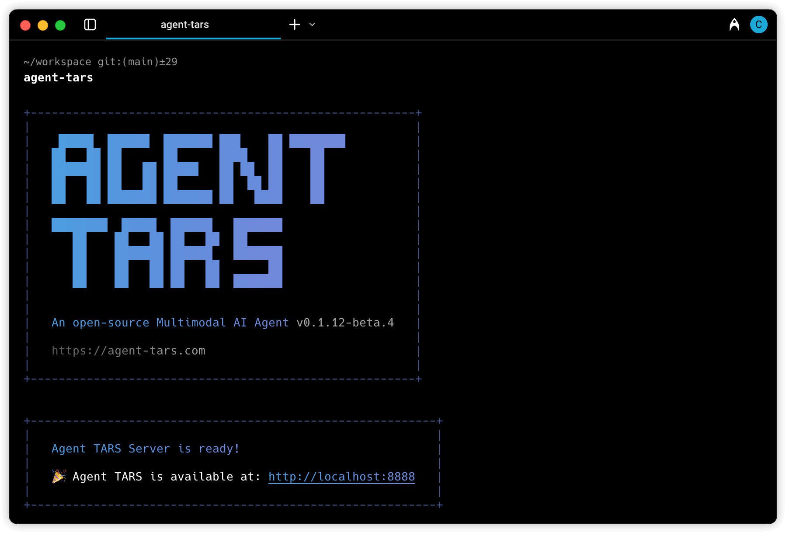
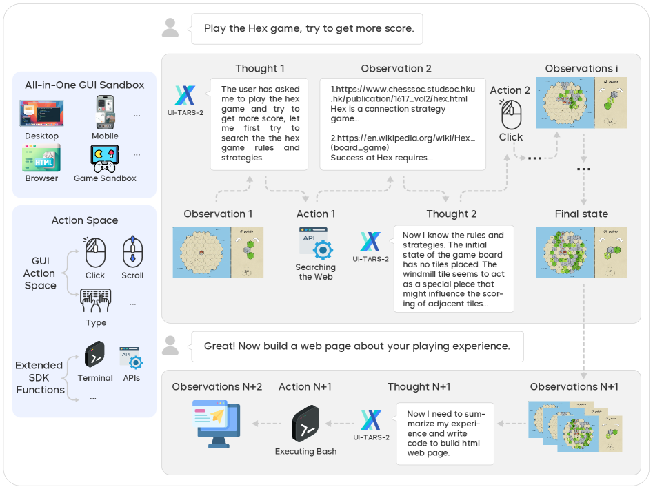
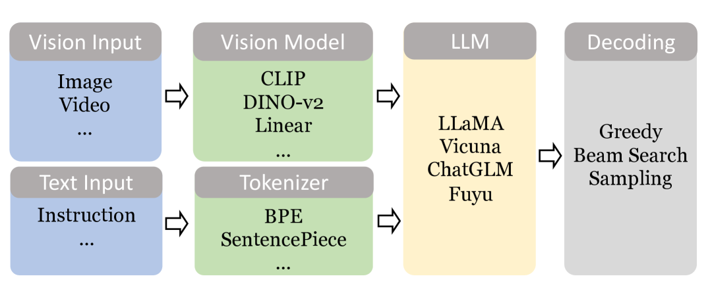

# 에이전트도 데이터다

_ByteDance UI-TARS가 연 멀티모달 에이전트 데이터의 순환 구조_

## Executive Summary

> [!callout]
> ByteDance가 2025-01 공개한 **UI-TARS-desktop**은 2026-05-13 기준 GitHub **33,573 stars**로 GUI 에이전트 카테고리 최대 오픈소스 생태계를 형성했다. Anthropic Computer Use·OpenAI Operator·Google Project Mariner가 모두 폐쇄형 API인 가운데, ByteDance(Apache-2.0)와 Microsoft Magentic-UI(MIT) 단 두 진영만 오픈소스로 GUI 에이전트 스택을 공개했다. 핵심 차별점은 모델·프레임워크·데스크톱/브라우저 런타임·MCP·행동 로그 저장소까지 **5계층을 한 묶음으로 풀었다**는 점이다.

> UI-TARS-2 기술보고서([arXiv:2509.02544](https://arxiv.org/abs/2509.02544), 2025-09)는 OSWorld 47.5%, AndroidWorld 73.3%, Online-Mind2Web 88.2%로 1년 미만 사이에 초기 UI-TARS(24.6%, 50steps)의 두 배 가까이 성능을 끌어올렸다. 그 비결은 모델 자체보다 **"data flywheel"** — 수백 대의 가상머신에서 자동 수집된 행동 트레이스를 반성적 정제(reflective filtering)·DPO로 환류시키는 폐쇄 루프다. ByteDance가 이를 공식 어휘로 채택한 순간, 페블러스가 일관되게 주장해 온 **"에이전트도 데이터다"**는 가설이 아니라 산업 표준 어휘가 되었다.

> 글로벌 AI Agent 시장은 78.4억 달러(2025) → 526억 달러(2030)로 CAGR 46.3%, 한국은 59.1%로 1.3배 빠르게 성장한다. 그러나 Gartner 2026 Hype Cycle은 40%+ agentic AI 프로젝트가 2027년 말까지 취소될 것이라 경고한다 — 비용·불명확한 가치·리스크 통제 부재가 원인이다. 시장은 폭증하되 **품질·거버넌스 인프라는 비어 있다**. 페블러스의 DataClinic·AI-Ready Data·Physical AI Platform 3층 가치 제안이 정확히 이 빈자리에 들어선다.

<!-- stat-card -->
**33,573** — GitHub stars — 2026-05-13 직접 조회

<!-- stat-card -->
**+956/day** — 초기 일일 stars — 2025 Q1 모멘텀 보도

<!-- stat-card -->
**47.5%** — OSWorld (UI-TARS-2) — vs Claude 28.0%·Operator 36.4%

<!-- stat-card -->
**$52.6B** — AI Agent 시장 2030 — CAGR 46.3%, M&M

## 에이전트도 데이터다 — UI-TARS 공개의 산업적 의미

기존 AI는 모델이 생산수단이었다. 학습 데이터는 정적인 코퍼스(웹·이미지·텍스트)였고, 모델이 출시되면 데이터는 잠시 멈춰 있었다. 새 AI는 다르다. 에이전트가 사용자의 화면을 보고, 마우스를 움직이고, 키보드를 누르는 매 순간이 **다음 세대 에이전트를 학습시키는 원자재**가 된다. 정적 데이터의 시대가 끝나고, 동적 행동 데이터의 시대가 열렸다.

ByteDance가 UI-TARS-2 기술보고서에서 사용한 표현은 명확하다 — **"data flywheel for scalable data generation"**. 추측이 아니라 공식 어휘다. 수백 대의 가상머신이 자동으로 GUI 환경을 돌리고, 에이전트가 실패하고 성공한 행동 트레이스가 반성적 정제(reflective filtering)와 DPO(Direct Preference Optimization)를 거쳐 다시 모델로 환류된다. 모델이 데이터를 만들고, 데이터가 모델을 만드는 폐쇄 루프 — 이것이 페블러스가 일관되게 주장해 온 "에이전트도 데이터다"라는 명제가 빅테크 발표문에 그대로 등장한 순간이다.

행동 데이터의 원자재는 단일 모달리티가 아니라 4중 모달리티의 동기화된 시퀀스다 — **스크린샷**(현재 상태), **명령어**(사용자 의도), **마우스/키보드 액션**(에이전트 결정), **UI 상태 변화**(결과 피드백). 이 네 가지가 시간 축으로 묶여 하나의 트레이스를 이루고, 각 트레이스가 정제 파이프라인을 통과해 학습셋이 된다. 정적 데이터 시대의 라벨링이 "이 사진은 고양이"였다면, 동적 데이터 시대의 라벨링은 "이 화면에서, 이 의도로, 이 액션을 했더니, 이런 결과가 나왔다"는 4축 시퀀스다.

> [!callout]
> UI-TARS의 33,573 stars가 증명한 것은 단순한 인기가 아니다. **"에이전트의 행동이 데이터다"**라는 명제가 가설이 아니라 빅테크의 공식 전략어로 굳어졌다는 것 — 그 위에서 한국 기업이 어떤 데이터 거버넌스를 짜야 할지가 다음 1년의 의제가 된다.

이 패러다임 전환은 페블러스의 인접 자산과 한 줄기로 이어진다. [hermes-agent의 자가학습 루프 데이터 품질 위험](/report/hermes-agent-data-quality-risk/ko/)이 자기강화 오염의 메커니즘을 다뤘다면, [메타의 'AI가 소프트웨어를 삼킨다' 선언](/blog/neural-computers-meta/ko/)은 "화면이 곧 인터페이스"라는 패러다임을 짚었다. UI-TARS는 그 둘이 만나는 교차점에 놓인다 — 화면을 학습 데이터로 다루는 가장 큰 오픈소스 실험.

*▲ ByteDance가 UI-TARS-desktop 저장소 첫 화면에 내건 슬로건 — "An Open-Source Multimodal AI Agent Stack". | Source: [bytedance/UI-TARS-desktop](https://github.com/bytedance/UI-TARS-desktop)*

## UI-TARS 아키텍처 — 멀티모달 스택의 5계층

UI-TARS가 다른 GUI 에이전트와 구조적으로 다른 점은 한 가지다 — 단일 모델이 아니라 **모델·프레임워크·런타임·MCP·로그 저장소**를 한 묶음으로 풀었다는 사실이다. 빅테크 중 어느 한 곳도 이 다섯 계층을 한꺼번에 오픈소스로 공개하지 않았다. Apache-2.0 라이선스 위에 통째로 올라간 풀스택은, 한국 기업이 "어디부터 어디까지가 우리 자산인가"를 명확하게 그릴 수 있게 해준다.

### 2.1. TARS Vision-Language Model — 시각의 뇌

최하단은 TARS VLM이다. 비전 인코더(고해상도/저해상도 듀얼)와 텍스트 토크나이저, 그리고 두 모달리티를 융합하는 멀티모달 헤드로 구성된다. 계보는 분명하다 — [CogAgent](https://arxiv.org/abs/2312.08914)(THUDM, 2023-12)가 처음 제안한 1120×1120 듀얼 인코더 패턴이 [SeeClick](https://arxiv.org/abs/2401.10935)(2024-01) → [Ferret-UI](https://arxiv.org/abs/2404.05719)(Apple, 2024-04) → [OS-Atlas](https://arxiv.org/abs/2410.23218)(2024-10) → [ShowUI](https://arxiv.org/abs/2411.17465)(2024-11)를 거쳐 [UI-TARS](https://arxiv.org/abs/2501.12326)(2025-01)에 도달했다. 각 단계마다 그라운딩 정확도·해상도 적응·액션 토큰 표현력이 한 단계씩 누적됐다.

### 2.2. Agent TARS Framework — 느린 추론

두 번째 계층은 System-2 추론을 담당하는 프레임워크다. 과제를 작은 단계로 분해하고, 마일스톤마다 자기 반성(reflection)을 수행하며, 실패 시 대안 경로를 선택한다. UI-TARS 원논문이 제시한 4축 혁신 중 세 번째에 해당한다. 카네만 인지심리의 dual-system 도식이 멀티모달 액션 모델의 정답으로 굳어진 셈이다.

*▲ Agent TARS CLI 실행 화면. 한 줄로 멀티모달 AI Agent 서버를 띄우는 단순함이 오픈소스 풀스택의 특징을 압축해 보여준다. | Source: [bytedance/UI-TARS-desktop](https://github.com/bytedance/UI-TARS-desktop)*

### 2.3. Desktop/Browser UI Layer — 손과 눈

세 번째는 실제 운영체제와 브라우저를 조작하는 런타임이다. Electron + Chromium 기반으로 구성되며, v0.2.0(2025-06)에서 Remote Computer/Browser Operator가 추가되어 원격 데스크톱·헤드리스 환경까지 커버한다. 사용자의 로컬 머신에서 직접 동작할 수도, 격리된 컨테이너에서 실행될 수도 있다. [Apple Silicon MLX 양자화](/blog/mlx-vlm-physical-ai-edge/ko/)를 통해 온디바이스 추론도 가능하다 — 클라우드 송신 없이 기업 내부에서 닫힌 루프를 돌릴 수 있는 유일한 빅테크 GUI 에이전트.

### 2.4. MCP (Model Context Protocol) — 외부 손발

네 번째 계층은 Anthropic이 제안한 MCP 표준을 채택해 외부 도구·API·파일시스템·데이터베이스에 접근한다. 모델과 운영체제 사이에 분리 계층을 두는 설계는, 사용자 시스템의 권한 경계를 명확히 만든다. 어떤 도구를 허용할지, 어떤 디렉토리에 쓰기 권한을 줄지가 모델 코드 바깥에서 통제된다.

### 2.5. 행동 로그 저장소 — 데이터 채굴장

최상단은 Agent TARS CLI v0.3.0(2025-11)의 **Event Stream Viewer**다. 에이전트가 매 단계 어떤 화면을 보고, 어떤 추론을 하고, 어떤 액션을 발사했는지를 개발자에게 직접 노출하는 첫 빅테크 GUI 에이전트다. 이 계층이 곧 학습 데이터의 채굴장이며, "data flywheel"이 실제로 돌아가는 물리적 인터페이스다. 개발자가 트레이스를 들여다볼 수 있다는 것은 곧, 거버넌스 도구가 그 트레이스에 진단·정규화·익명화를 적용할 수 있다는 뜻이다.

> [!callout]
> 5계층 전부가 **Apache-2.0**로 공개됐다는 점이 결정적이다. 한국 기업은 모델만 받을 수도, 프레임워크만 받을 수도, 행동 로그 저장소만 떼어 자체 모델에 붙일 수도 있다. [메타의 화면 학습 AI](/blog/neural-computers-meta/ko/)가 폐쇄 데모로 끝났다면, UI-TARS는 그 동일한 패러다임을 실제 코드와 가중치로 풀어버린 셈이다.

## 경쟁군 재평가 — 5진영 매트릭스

GUI 에이전트 시장은 다섯 진영으로 갈렸다. ByteDance(UI-TARS), Anthropic(Computer Use), OpenAI(Operator), Google(Project Mariner), Microsoft(Magentic-UI). 그중 **오픈소스는 단 두 곳** — ByteDance와 Microsoft뿐이다. 나머지는 모두 폐쇄형 API 또는 실험 단계 클라우드 서비스다. 한국 기업이 GUI 에이전트를 자체 인프라에 통합하려면, 사실상 선택지가 이미 좁아져 있다.

| 항목 | UI-TARSByteDance | Computer UseAnthropic | OperatorOpenAI | MarinerGoogle | Magentic-UIMicrosoft |
| --- | --- | --- | --- | --- | --- |
| 라이선스 | Apache-2.0 | 폐쇄 API | 폐쇄 ($200/월) | 폐쇄(실험) | MIT |
| 모델 | TARS VLM 전용 | Claude 3.5+/Opus | GPT-4o + CUA | Gemini 2.0+ | Magentic-One + AutoGen |
| 플랫폼 | Desktop+Browser+Game | Desktop API | Browser only | Chrome only | Browser only |
| OSWorld | 47.5 (TARS-2, 2025-09) | 28.0 (3.5)·78 (Opus 4.7) | 36.4 (CUA) | — | — |
| 로컬 배포 | 가능 | 불가 | 불가 | 불가 | 가능 |
| 데이터 정책 | 사용자 보관(단 ByteDance 환류 가능성) | Anthropic 서버 | OpenAI 서버 | Google 서버 | 사용자 보관 |

************************************

### 3.1. 벤치마크 도약 — 인간 수준을 추격하는 18개월

OSWorld 벤치마크가 보여주는 곡선은 가파르다. 2024-04 최고 모델 12.24% → 2025-01 UI-TARS 24.6%(50 steps) → 2025-04 UI-TARS-1.5 42.5%(100 steps) → 2025-09 UI-TARS-2 47.5% → 2026-04 Holo3-35B 82.6%. 인간 기준선 72.36%를 18개월 만에 넘었다. 단 이 수치들은 **각각 다른 모델·다른 step 수·다른 시점**이라 단일 비교가 어렵다. 인용 시 반드시 "버전 + step 수 + 시점"을 병기해야 한다. [벤치마크 신뢰성 위기](/report/ai-agent-benchmark-trust/ko/)가 짚었듯, 점수는 점점 더 조심스럽게 읽어야 한다.

*▲ UI-TARS-2의 멀티모달 행동 trace 한 장면 — 사용자가 "Hex 게임을 해보라"고 지시하자 웹 검색·웹페이지 분석·게임 액션·코드 생성까지 한 루프 안에서 수행한다. All-in-One GUI Sandbox는 데스크톱·모바일·브라우저·게임 환경을 한 묶음으로 통합한다. | Source: [arXiv:2509.02544 (UI-TARS-2 Technical Report)](https://arxiv.org/abs/2509.02544)*

### 3.2. 오픈 vs 폐쇄의 진짜 의미

표면적으로 보면 오픈소스 + 멀티플랫폼 + 로컬 배포의 3중 차별이 UI-TARS의 우위다. 그러나 데이터 측면에서는 양면이 있다 — Apache-2.0 라이선스는 코드와 가중치를 자유롭게 쓰게 해주지만, ByteDance가 "data flywheel"이라 명명한 그 환류 메커니즘이 사용자 행동 데이터를 외부로 보낼 가능성도 함께 인식해야 한다. [Anthropic의 매니지드 에이전트](/blog/claude-managed-agents/ko/)처럼 명확히 클라우드 송신이 약관에 박혀 있는 경우보다, 오히려 오픈소스 쪽에서 데이터 거버넌스 설계가 더 신중해야 하는 역설이 생긴다. [에이전트 프레임워크 빅뱅](/blog/agentic-framework-explosion/ko/)이 보여주듯, 카테고리는 폭발하고 있지만 거버넌스 토대는 빈약하다.

## 에이전트 데이터 생애주기 — 5단계와 모달리티별 결함

에이전트의 행동 로그는 **수집 → 정제 → 검증 → 저장 → 재훈련**의 5단계를 거친다. 각 단계마다 모달리티별 품질 결함이 발생하고, 한 모달리티의 결함이 다른 모달리티 해석을 cascading으로 왜곡한다. 스크린샷 해상도가 낮으면 UI 요소 인식이 흐려지고, UI 요소 인식이 흐려지면 클릭 좌표가 어긋나고, 클릭 좌표가 어긋나면 후속 화면 상태가 의도와 다르게 흘러간다. 이 사슬을 끊지 못하면, 행동 트레이스는 모델을 학습시키는 게 아니라 모델을 오염시킨다.

*▲ 멀티모달 LLM의 추론 파이프라인. 비전·텍스트가 각각 인코더·토크나이저를 거쳐 LLM에 결합되는데, 단일 모달리티의 결함이 결합 단계에서 cascading 오류를 만든다 — UI-TARS 행동 로그가 정확히 이 구조를 따른다. | Source: [arXiv:2404.18930 (Bai et al., 2024)](https://arxiv.org/abs/2404.18930)*

DataClinic이 진단하는 지점은 정확히 이 모달리티별 품질 결함이다. 네 가지 모달리티 각각에 대해 어떤 결함이 어떤 메커니즘으로 실패를 만드는지, 그리고 어떤 진단 축으로 잡아내는지를 정리하면 다음과 같다.

| 모달리티 | 품질 결함 | 실패 메커니즘 | DataClinic 진단 축 |
| --- | --- | --- | --- |
| 비전(스크린샷) | 해상도 저하·DPI 편향·포커스 오류 | UI 요소 인식 실패 → 잘못된 클릭 좌표 | 이미지 메타데이터·픽셀 분포 분석 |
| 텍스트(명령어) | 모호한 지시·도메인 용어·다국어 혼용 | 의도 오해석 → 엉뚱한 작업 실행 | NLP 품질 점수·intent confidence |
| 액션(마우스+키보드) | 부정확 좌표·타이밍 오류·중복 클릭 | 클릭 미스·입력 누락 → 상태 불일치 | 시퀀셜 데이터 검증·idle/active 분포 |
| 궤적(행동 로그) | 불완전 기록·상태 오염·자가강화 | 재훈련 루프 오염 → cascading 오류 | 시계열 drift·label leakage 탐지 |

****  
****  
****  
****

### 4.1. 자기강화 오염의 메커니즘

가장 위험한 결함은 궤적 수준에서 발생한다. [에이전트 할루시네이션 서베이](https://arxiv.org/abs/2509.18970)(arXiv:2509.18970, 2025-09)는 이 메커니즘을 정확히 명명한다 — **"recursive memory-conditioning... self-reinforcing feedback loops, where an agent's hallucinations or faulty conclusions are re-ingested and cemented as factual priors."** 에이전트가 한 번 잘못 클릭한 결과를 "성공"으로 기록하면, 그 잘못된 트레이스가 재훈련 셋에 들어가고, 다음 세대 모델은 그 오류를 "정답"으로 학습한다.

MLLM 할루시네이션 서베이([arXiv:2404.18930](https://arxiv.org/abs/2404.18930))는 한 단계 더 들어간다. UI 에이전트의 "잘못 클릭"은 시각 입력의 객체 환각(object hallucination)과 직접 연결된다. 모델이 화면에서 보지 못한 버튼을 "있다"고 환각하면, 그 버튼을 향한 클릭이 발사되고, 후속 화면이 의도와 다르게 흘러간다. UI-TARS의 "Reflective Online Traces"가 SOTA의 비결이면서 동시에 위험인 이유다 — 반성적 정제 자체에 결함이 있으면, 그 결함이 다음 세대로 그대로 전수된다.

> [!callout]
> 이 사슬은 페블러스가 [hermes-agent 보고서](/report/hermes-agent-data-quality-risk/ko/)와 [LLM 자가발작 보고서](/report/llm-self-seizure/ko/)에서 다룬 자가오염 패턴과 동일하다. 차이는 모달리티가 늘어났을 뿐이다 — 텍스트만 오염되던 자기루프가, 이제 스크린샷·마우스·UI 상태까지 묶여 오염된다. 그래서 모달리티별 진단이 필요하다.

## 디지털↔물리 에이전트 동형성 — 화면은 로봇의 또 다른 몸

UI-TARS의 구조를 옆에 두고 로봇 VLA(Vision-Language-Action) 모델을 펼쳐놓으면, 놀라울 만큼 닮아 있다. 화면 픽셀에서 마우스 좌표로 가는 길과, 카메라 픽셀에서 모터 토크로 가는 길은 **같은 구조**다. 입력 모달리티의 차이(스크린샷 vs 카메라 영상)와 출력 행동 공간의 차이(키보드/마우스 vs 7-DoF 모터)를 제외하면, 그 사이에 있는 모든 단계가 일대일로 대응한다. 화면은 로봇의 또 다른 몸이다.

| 단계 | UI-TARS (디지털) | VLA 모델 (물리) |
| --- | --- | --- |
| 관측 | 스크린샷 1120×1120 | 카메라/뎁스 센서 |
| 이해 | TARS VLM (비전+텍스트 융합) | RT-2/OpenVLA/π0 VLM 백본 |
| 의도 | System-2 추론 (과제 분해·reflection) | GR00T System-2 / Gemini Robotics ER |
| 행동 | 마우스/키보드 액션 토큰 | 7-DoF 모터 토크 / gripper |
| 피드백 | UI 상태 변화 (DOM·픽셀 diff) | 환경 상태 (force·proprioception) |
| 재훈련 | Reflective Online Traces | Open X-Embodiment 궤적 |

************************

VLA 라인업도 같은 시기에 같은 방향으로 움직였다. [RT-2](https://arxiv.org/abs/2307.15818)(Google DeepMind, 2023-07, VLA의 시조) → [OpenVLA](https://arxiv.org/abs/2406.09246)(Stanford+Berkeley, 2024-06, 7B 오픈) → [π0](https://arxiv.org/abs/2410.24164)(Physical Intelligence, 2024-10, flow matching) → [GR00T N1](https://arxiv.org/abs/2503.14734)(NVIDIA, 2025-03, dual-system 휴머노이드) → [Gemini Robotics](https://arxiv.org/abs/2503.20020)(Google + Apptronik, 2025-03). 디지털 라인(UI-TARS)과 물리 라인(VLA)이 같은 dual-system 도식, 같은 멀티모달 융합, 같은 행동 토큰 패턴으로 수렴했다.

*▲ π0(Physical Intelligence)의 VLA 데이터 흐름. 카메라 입력 + 자연어 명령이 vision-language backbone에 들어가고, action expert가 flow matching으로 연속 모터 토크를 생성한다. UI-TARS가 화면 위에서 마우스·키보드 토큰을 생성하는 구조와 정확히 같은 패턴이다. | Source: [arXiv:2410.24164 (π0, Physical Intelligence)](https://arxiv.org/abs/2410.24164)*

### 5.1. 오픈 vs 폐쇄의 거울 구도

더 흥미로운 점은 진영 구도까지 닮았다는 사실이다. 디지털 쪽에서 ByteDance(UI-TARS)·Microsoft(Magentic-UI)가 오픈을 잡고 Anthropic·OpenAI·Google이 폐쇄를 잡은 구도가, 물리 쪽에서도 NVIDIA(GR00T N1)·Stanford(OpenVLA)·Physical Intelligence(π0)가 오픈을 잡고 Google Gemini Robotics·Figure AI 등이 폐쇄를 잡는 형태로 반복된다. [VLA 아키텍처 비교](/report/vla-architecture-comparison/ko/)가 짚었듯, "데이터를 가진 자가 모델을 가진다"는 논리는 디지털과 물리에서 동일하게 작동한다.

페블러스 입장에서 이 동형성은 단순한 비유가 아니다. [Physical AI 산업 지형](/report/physical-ai-industry-landscape/ko/)이 짚었듯, 데이터 인터페이스를 통일할 수 있다면 GUI 에이전트와 로봇 에이전트의 학습 파이프라인을 같은 도구로 진단할 수 있다. [3DGS 합성 데이터로 VLA 학습](/report/isaac-sim-3dgs-vla-synthetic-data-2026-04/ko/)이 보여준 합성 인터페이스가, GUI 시뮬레이션 데이터에도 그대로 이식 가능한 구조라는 뜻이다.

> [!callout]
> UI-TARS의 행동 로그와 GR00T·π0의 궤적 데이터는 모달리티가 다를 뿐 데이터 품질 진단 축은 동일하다 — 시계열 정합성, label leakage, 자기강화 오염, 분포 drift. 페블러스가 Physical AI Platform을 GUI 에이전트와 로봇 에이전트의 **공통 데이터 레이어**로 설계해야 하는 이유다.

## AI-Ready Data 플랫폼의 재정의

AI-Ready Data의 정의가 흔들리고 있다. 정적 학습 코퍼스(웹·이미지·텍스트)의 시대에는 "라벨링이 잘된 정제된 데이터셋"이 AI-Ready의 의미였다. 동적 에이전트 시대에는 그 정의가 확장된다 — **"재훈련 루프에 안전하게 들어갈 수 있는, 모달리티 정합성과 시계열 무결성이 검증된 행동 로그"**가 새로운 AI-Ready Data다. UI-TARS 자체가 매 사용자마다 월 수백만 스크린샷·명령어 쌍을 생성하는 채굴장이므로, 채굴된 원광을 정제해 다시 모델로 흘려보내는 파이프라인이 곧 데이터 비즈니스의 핵심이 된다.

### 6.1. 시장 수치 — 한국이 글로벌보다 1.3배 빠르다

MarketsandMarkets 데이터로 보면, 글로벌 AI Agent 시장은 **$7.84B(2025) → $52.62B(2030)**로 CAGR 46.3%를 기록한다. Grand View Research가 별도로 추정한 한국 시장은 **$193.8M → $7,649.3M**로 CAGR 59.1%다 — 글로벌의 1.3배 속도다. 정적 코퍼스를 다루던 기존 데이터 기업이 동적 행동 로그로 전환하기에 한국 시장은 절호의 시점에 와 있다.

### 6.2. RPA의 자리바꿈

RPA(Robotic Process Automation) 시장은 2024년 $3.8B 규모로 여전히 성장 중이지만(+18% YoY), Gartner는 "GenAI/agentic AI가 RPA 성장률 둔화를 야기"할 것이라 경고한다. 룰 기반 자동화가 학습형 에이전트로 흡수되는 전환 시장(Conversion TAM)이 명확히 그려진다. UiPath가 2025-09 "Agentic Automation Platform"을 발표한 것도 같은 맥락이다. 한국에서는 인벤티스+업스테이지의 RPA MOU(2025-12)가 같은 신호를 보냈다.

### 6.3. 페블러스 3층 가치 제안

동적 데이터 시대의 AI-Ready 인프라는 세 층으로 갈라진다. **진단**(DataClinic)이 행동 로그의 모달리티별 품질 결함을 잡아낸다. **정규화**(AI-Ready Data)가 재훈련 가능한 표준 포맷으로 정제·익명화한다. **연결**(Physical AI Platform)이 디지털 에이전트와 로봇 에이전트의 학습 파이프라인을 한 인터페이스로 묶는다. [에이전트 경제와 데이터 자산화](/blog/stablecoin-data-ai-agent-economy-2026/ko/)가 짚었듯, 행동 데이터가 자산으로 거래되는 시점이 다가오면, 이 3층은 단순한 도구가 아니라 시장 인프라가 된다.

## 페블러스 관점 — 에이전트 경제 시대의 데이터 주권

한국 AI 스타트업과 엔터프라이즈에 놓인 선택의 구도는 단순하다. 폐쇄형 Computer Use·Operator를 월 $200씩 결제하며 모든 행동 데이터를 미국 클라우드로 보낼 것인가, UI-TARS 오픈 진영에서 무료로 받되 로컬 배포와 ByteDance 환류 차단 거버넌스를 직접 설계할 것인가. 가운데 길은 없다. 페블러스의 역할은 두 번째 선택을 **신뢰할 수 있게 만드는** 데에 있다.

### 7.1. Gartner 40% 취소 경고를 뒤집어 읽기

Gartner 2026 Hype Cycle은 agentic AI 프로젝트의 40% 이상이 2027년 말까지 취소될 것이라 경고한다. 원인은 비용·불명확한 가치·리스크 통제 부재. 시장이 폭증하는데 절반 가까이가 실패한다는 뜻은, 그 실패의 빈자리에 진입할 인프라가 절실하다는 뜻이기도 하다. 한국 도입의 필수 조건은 네 가지로 정리된다 — (1) 데이터 거버넌스(주권·라이선스 분석), (2) 로컬/클라우드 배포 결정, (3) 모니터링·감사·롤백, (4) 재훈련 주기 + 품질 검증.

### 7.2. 한국 시장의 빈자리 — 인터페이스 레이어

국내 주요 사업자가 모델 레이어에 집중하는 동안, GUI 에이전트 인터페이스 레이어는 공백이다. 네이버 '에이전트 N'(2026 Q1 예고), 카카오 '카나나2', 업스테이지 '솔라 프로 3'(2026-03)는 모두 모델 레이어 발표였고, 솔트룩스 'AI 업무혁신센터'(2025-07)는 컨설팅 레이어다. UI-TARS + 한국어 LLM + 페블러스 데이터 품질 인프라의 조합이 자연스러운 자리잡기다. [디지털자산기본법(2026)](/report/korea-digital-asset-basic-law-2026/ko/) 시행과 맞물려, 행동 로그·스크린샷이 개인정보 정의에 포함될 가능성도 점차 현실로 다가온다.

### 7.3. 데이터 품질 진단의 4축

DataClinic이 UI-TARS 행동 로그를 진단하는 축은 네 가지다 — **모달리티별 정합성**(스크린샷-명령어-액션 시간 동기화), **시계열 drift**(분포 이동 정량화), **label leakage**(재훈련 셋에 평가 셋 누출), **자기강화 오염**(반복 학습에서 누적되는 오류). 이 4축은 그대로 [hermes-agent 자가학습 루프 진단](/report/hermes-agent-data-quality-risk/ko/)과 호환되며, 더 나아가 [온디바이스 VLM 배포](/blog/mlx-vlm-physical-ai-edge/ko/) 시나리오에서도 동일하게 작동한다. 디지털·물리 에이전트, 클라우드·온디바이스 배포, 모든 조합에 같은 진단 도구가 적용된다.

## Pebblous Take — 모델 옆자리의 빈 공간

> [!callout]
> **ByteDance가 "data flywheel"이라 명명한 그 순간, "에이전트도 데이터다"는 페블러스의 가설에서 산업 표준 어휘가 되었다.**

> 페블러스는 모델을 만들지 않는다. 그 모델이 먹는 데이터, 그리고 그 모델이 만들어내는 행동 로그가 다음 모델의 식량이 되는 폐쇄 루프를 **진단·정규화·연결**한다. UI-TARS의 33,573 stars가 증명하는 것은 한 가지다 — 에이전트 인프라는 오픈되었지만, 그 위에서 흐르는 데이터의 품질·주권·거버넌스는 여전히 비어 있다.

> 경쟁사는 에이전트를 판다. 페블러스는 그 에이전트를 신뢰할 수 있게 만든다. DataClinic이 모달리티별 결함을 잡고, AI-Ready Data가 재훈련 셋을 정제하며, Physical AI Platform이 디지털과 물리의 행동 데이터를 한 인터페이스로 묶는다. 모델 옆자리의 빈 공간 — 그 자리가 페블러스의 자리다.

## 참고문헌

본 보고서가 인용한 학술 논문·업계 발표·시장 보고서 29건의 정본 목록이다. 모든 항목은 CSL-JSON으로 관리되며(`references.json`), 아래 버튼으로 BibTeX·RIS 포맷의 인용 파일을 즉시 내려받을 수 있다.

[CSL-JSON 보기](../references.json)

### UI-TARS 및 GUI 에이전트 논문

- 1.Qin, Y., et al. (ByteDance Seed). (2025). "UI-TARS: Pioneering Automated GUI Interaction with Native Agents." [arXiv:2501.12326](https://arxiv.org/abs/2501.12326).
- 2.ByteDance Seed. (2025). "UI-TARS-2 Technical Report: Advancing GUI Agent with Multi-Turn Reinforcement Learning." [arXiv:2509.02544](https://arxiv.org/abs/2509.02544).
- 3.Hong, W., et al. (THUDM). (2023). "CogAgent: A Visual Language Model for GUI Agents." CVPR 2024. [arXiv:2312.08914](https://arxiv.org/abs/2312.08914).
- 4.Cheng, K., et al. (2024). "SeeClick: Harnessing GUI Grounding for Advanced Visual GUI Agents." ACL 2024. [arXiv:2401.10935](https://arxiv.org/abs/2401.10935).
- 5.You, K., et al. (Apple). (2024). "Ferret-UI: Grounded Mobile UI Understanding with Multimodal LLMs." ECCV 2024. [arXiv:2404.05719](https://arxiv.org/abs/2404.05719).
- 6.Wu, Z., et al. (2024). "OS-ATLAS: A Foundation Action Model for Generalist GUI Agents." [arXiv:2410.23218](https://arxiv.org/abs/2410.23218).
- 7.Lin, K. Q., et al. (2024). "ShowUI: One Vision-Language-Action Model for GUI Visual Agent." CVPR 2025. [arXiv:2411.17465](https://arxiv.org/abs/2411.17465).
- 8."Large Language Model-Brained GUI Agents: A Survey." (2024). [arXiv:2411.18279](https://arxiv.org/abs/2411.18279).

### 벤치마크 논문

- 9.Xie, T., et al. (2024). "OSWorld: Benchmarking Multimodal Agents for Open-Ended Tasks in Real Computer Environments." NeurIPS 2024. [arXiv:2404.07972](https://arxiv.org/abs/2404.07972).
- 10.Zhou, S., et al. (2023). "WebArena: A Realistic Web Environment for Building Autonomous Agents." [arXiv:2307.13854](https://arxiv.org/abs/2307.13854).
- 11.Li, K., et al. (2025). "ScreenSpot-Pro: GUI Grounding for Professional High-Resolution Computer Use." [arXiv:2504.07981](https://arxiv.org/abs/2504.07981).
- 12.Google Research. (2024). "AndroidWorld: A Dynamic Benchmarking Environment for Autonomous Agents." [arXiv:2405.14573](https://arxiv.org/abs/2405.14573).

### VLA(Vision-Language-Action) 모델

- 13.Brohan, A., et al. (Google DeepMind). (2023). "RT-2: Vision-Language-Action Models Transfer Web Knowledge to Robotic Control." CoRL 2023. [arXiv:2307.15818](https://arxiv.org/abs/2307.15818).
- 14.Kim, M. J., Pertsch, K., et al. (2024). "OpenVLA: An Open-Source Vision-Language-Action Model." [arXiv:2406.09246](https://arxiv.org/abs/2406.09246).
- 15.Physical Intelligence. (2024). "π0: A Vision-Language-Action Flow Model for General Robot Control." [arXiv:2410.24164](https://arxiv.org/abs/2410.24164).
- 16.NVIDIA. (2025). "GR00T N1: An Open Foundation Model for Generalist Humanoid Robots." [arXiv:2503.14734](https://arxiv.org/abs/2503.14734).
- 17.Google DeepMind. (2025). "Gemini Robotics: Bringing AI into the Physical World." [arXiv:2503.20020](https://arxiv.org/abs/2503.20020).

### 할루시네이션 및 자가학습 위험 서베이

- 18.Bai, Z., et al. (2024). "Hallucination of Multimodal Large Language Models: A Survey." [arXiv:2404.18930](https://arxiv.org/abs/2404.18930).
- 19."LLM-based Agents Suffer from Hallucinations: A Survey of Taxonomy, Methods, and Directions." (2025). [arXiv:2509.18970](https://arxiv.org/abs/2509.18970).

### 업계 발표 및 시장 보고서

- 20.Anthropic. (2024-10-22). "Introducing computer use, a new Claude 3.5 Sonnet, and Claude 3.5 Haiku." [anthropic.com/news](https://www.anthropic.com/news/3-5-models-and-computer-use).
- 21.OpenAI. (2025-01-23). "Introducing Operator." [openai.com](https://openai.com/index/introducing-operator/).
- 22.Google DeepMind. (2024-12-11). "Project Mariner." [deepmind.google](https://deepmind.google/models/project-mariner/).
- 23.Microsoft Research. (2025-05-19). "Magentic-UI, an experimental human-centered web agent." [microsoft.com/research](https://www.microsoft.com/en-us/research/blog/magentic-ui-an-experimental-human-centered-web-agent/).
- 24.UiPath. (2025-09). "UiPath Launches the First Enterprise-Grade Platform for Agentic Automation." [uipath.com](https://www.uipath.com/newsroom/uipath-launches-first-enterprise-grade-platform-for-agentic-automation).
- 25.Gartner. (2026). "Hype Cycle for Agentic AI 2026." [gartner.com](https://www.gartner.com/en/articles/hype-cycle-for-agentic-ai).
- 26.Gartner Press Release. (2025-08-26). "Gartner Predicts 40% of Enterprise Apps Will Feature Task-Specific AI Agents by 2026." [gartner.com](https://www.gartner.com/en/newsroom/press-releases/2025-08-26-gartner-predicts-40-percent-of-enterprise-apps-will-feature-task-specific-ai-agents-by-2026).
- 27.MarketsandMarkets. (2025). "AI Agents Market by Application, Geography, Technology — Global Forecast to 2030." [marketsandmarkets.com](https://www.marketsandmarkets.com/Market-Reports/ai-agents-market-15761548.html).
- 28.Grand View Research. (2025). "South Korea AI Agents Market Size & Outlook, 2024-2033." [grandviewresearch.com](https://www.grandviewresearch.com/horizon/outlook/ai-agents-market/south-korea).
- 29.ByteDance. (2026-05-13 GitHub API 직접 조회). "bytedance/UI-TARS-desktop: The Open-Source Multimodal AI Agent Stack." [github.com/bytedance/UI-TARS-desktop](https://github.com/bytedance/UI-TARS-desktop).
