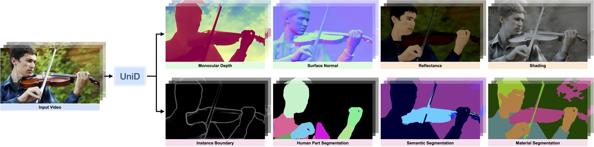

# A Model That Reads the Whole Scene Was Blocked by Scattered Labels

_Unified scene understanding from disjoint, incomplete labels, as shown by UniD (Adobe·Cornell, ECCV 2026)_

## Executive Summary

> [!callout]
> Robotics, AR, and content editing all demand reading a single scene at once across geometry (depth, surface normals), appearance (albedo, shading, materials), and semantics (segmentation, boundaries, human parts). Yet a dataset that carries all eight of these labels together essentially does not exist. Depth and normals come cheap and in bulk but stay trapped indoors; semantic segmentation is an expensive hand-drawn label that keeps datasets small; intrinsic decomposition like albedo and shading is nearly impossible to measure from real footage, so it leans on synthetic rendering. Labels scattered across different domains, scales, and cost structures — what the paper calls **disjoint annotation** — are the real bottleneck of unified scene understanding. This report reads UniD from the view that the bottleneck lies in the data, not the architecture.

> The contribution of UniD (Adobe Research·Cornell, ECCV 2026) is that it fills this fragmentation through representation learning rather than new data collection. It never forces labels to overlap, nor fakes one task's labels from another. Instead it first learns a latent representation per task, lets a web-scale generative (diffusion) prior bridge the domain gap, and then unifies eight tasks into one backbone through lightweight distillation. The results support this view. Depth and normals, which drift out of geometric agreement when predicted separately, come out of a single backbone consistent with each other, and intrinsic representations learned only from synthetic data transfer to real-world benchmarks.

> At the same time, the limits show honestly. Unification helps geometry tasks, but tasks that need higher-order semantics — like semantic segmentation and materials — drop right after unification, recover much of the gap with a lightweight correction, yet still fall short of a specialist. From Pebblous's vantage, what makes this research valuable is not its conclusion but its premise. **A deficit in data completeness and consistency is a real ceiling on model capability, and a well-organized representation becomes the detour around that deficit** — precisely the terrain that AI-Ready Data and DataClinic aim at.

<!-- stat-card -->
**39.0 vs 14.1** — Depth↔normal geometric consistency — Two geometries that drift apart when predicted separately are ~2.8× more consistent in the unified model (Table 7)

<!-- stat-card -->
**28% lower** — Real-world OOD albedo error (IIW WHDR) — 0.207 vs 0.289 — evidence that a synthetic-learned representation transfers to real footage (Table 4)

<!-- stat-card -->
**~8×** — Training GPU memory saved — Latent distillation cuts ~650GB → 78GB — the efficiency of folding eight specialists into one backbone

<!-- stat-card -->
**37.8 → 58.4** — Semantic segmentation mIoU (specialist 64.1) — Drops right after unification, recovers with a lightweight correction but stays below the specialist — an honest asymmetry (Table 5)

*▲ What the eight geometry, appearance, and semantics labels above actually look like — UniD's own output from a single input video. That these eight frames never naturally coexist in one dataset is the fragmentation problem this report is about. Source: [UniD project page](https://unid-video.github.io/) (Sun et al., arXiv:2607.21592)*

## What No Single Dataset Can Hold

Let's start with the conclusion: reading a whole scene with one model was hard not because the architecture fell short, but because the data is scattered. Fully understanding a scene means reading **geometry** (depth, surface normals), **appearance (intrinsics)** (albedo, shading, materials), and **semantics** (segmentation, boundaries, human parts) all at once. The problem is that essentially no dataset carries these eight labels side by side on a single image. Each label grew up separately, on a different domain, at a different scale, under a different cost structure.

The three branches diverge because the way each label is obtained is fundamentally different. Depth and normals are captured automatically by RGB-D sensors, so they accumulate cheaply and in bulk — but those sensors work well only indoors, so the data stays trapped indoors. Semantic segmentation requires a human to paint pixels one by one, roughly 90 minutes per image, so it stays confined to small road or internet-image sets. Intrinsic decomposition like albedo and shading — "the object's own color separated from lighting effects" — is nearly impossible to measure accurately from real footage, so its ground truth comes only from synthetic rendering (like Hypersim).

### 1.1. Eight Fragments, Each at Its Own Scale and Cost

The size of the fragmentation shows up in numbers. Per-task training scale spans from 22.0k to 121.3k frames — up to a 5.5× gap — and the cost of producing a single label ranges from 7 seconds for synthetic rendering to 90 minutes for manual semantic segmentation, a 771× difference. In video the gap widens further. Of the eight types, only three — depth, boundaries, and semantic segmentation — have per-frame video labels; the rest exist only on still images. The table below lays out how far apart these three axes (domain, scale, cost) really are.

| Label family | Representative tasks | How the label is obtained | Domain limit | Video |
| --- | --- | --- | --- | --- |
| Geometry | Depth · surface normals | Auto-captured by RGB-D sensors (cheap) | Mostly indoor | Depth ✓ |
| Semantics | Semantic segmentation · boundaries · human parts | Manual human labeling (~90 min/image) | Small scale · specific domains | Some ✓ |
| Appearance (intrinsics) | Albedo · shading · materials | Synthetic rendering (~7 sec/image) | Trapped in the synthetic domain | ✗ |

************Different labeling methods split the domain and scale a dataset gets trapped in. Labeling costs cite figures from a follow-up comparison study (arXiv:2212.07911) and Hypersim (ICCV 2021) for direction. Per-task training scale ranges 22.0k–121.3k frames.

Visually, these eight pieces are scattered like islands that never meet. Some images carry only depth labels, others only segmentation labels, and images with intrinsics come from an entirely synthetic world. The fact that no bridge connects these three islands is the whole problem.
