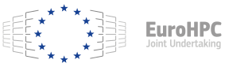
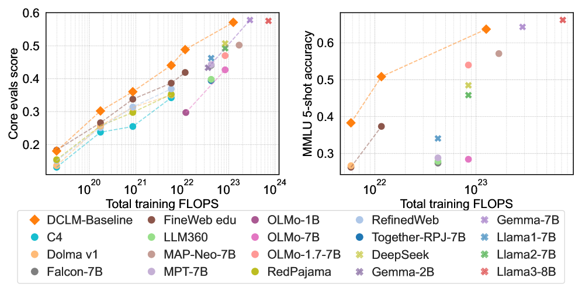

# Capital Crosses Borders. Data Doesn

_What Korea_

## Executive Summary

> [!callout]
> On May 3, 2026, Korea's National Growth Fund (a 150-trillion-won, five-year sovereign vehicle, roughly $108B) and the Strategic Industries Fund jointly approved a **$400M (KRW 560B) direct equity investment** in Upstage — $93M public ($72M from the Strategic Industries Fund, $21M from KDB) plus $307M private. This is the second direct equity check from the National Growth Fund, after Rebellions ($460M, AI chips, March 2026), and the **first ever for a software company**. Of the three vendors that cleared the government's first-round Sovereign AI Foundation Model evaluation — LG, SK Telecom, and Upstage — Upstage was the only **venture-stage** firm. Its flagship Solar Pro 2 (31B parameters) scored 58 on the Artificial Analysis Intelligence Index, beating GPT-4.1, DeepSeek V3, and Moonshot Kimi K2, and is positioned as Korea's first globally competitive frontier LLM.

> But the question this report asks is different. **Model capital has arrived in Korea. Data sovereignty has not.** Upstage's own _Solar Open Technical Report_ (arXiv:2601.07022, January 2026) names the gap explicitly: _"Korean represents only about 0.8% of indexed web content and ranks 17th by bytes in FineWeb 2 — a reasonably severe data scarcity."_ Common Crawl's CC-MAIN-2026-17 confirms it: Korean at 0.823%, English at 41.02% — a **50× gap**. The 2024–2025 academic consensus from DataComp-LM, FineWeb, Phi-3, and NVIDIA's Nemotron-4 converges on a single point: **data quality matters more than model size**. DCLM-7B saved 40% of compute at the same accuracy. Nemotron-4 340B's alignment data is 98% synthetic. Korean-language quality filtering can't be substituted by English filters — Naver's HyperCLOVA X THINK had to train a Korean-specific quality regression model from scratch.

> Seven sections answer seven questions. (1) What's the policy mechanism behind the $400M? (2) Why did the government pick Upstage? (3) Where does Korea sit on the global sovereign-AI map? (4) Is $400M enough? (5) What's the actual state of the Korean corpus? (6) What does the next funding round look like? (7) What does this mean for policymakers, executives, and ML practitioners? The conclusion is one line — **the binding variable in sovereign AI is data quality**. This piece is the sovereign-AI chapter of the [Data Economy](/project/DataEconomy/en/) series — where model capital arrived but data autonomy did not.

$400M

National Growth Fund + Strategic Industries Fund  
(first direct check into AI software)

$940M

Upstage valuation  
(Korea's first GenAI unicorn)

0.823%

Korean share of Common Crawl  
(≈ 1/50 of English)

## Anatomy of $400M — Where Two Funds Meet

The headline number is not a single fund. It is a public–private split designed to share risk and price-discover the deal. Public capital is $93M, sourced from the Strategic Industries Fund ($72M) and the Korea Development Bank ($21M). The private side is $307M, syndicated across SK Networks, Saje Partners, Woori Venture Partners, and Mirae Asset. The intent is twofold: cap the government's standalone exposure, and have the private syndicate validate market pricing ([Hankyung, May 3, 2026, in Korean](https://www.hankyung.com/article/2026050330811)).

### 1.1. The 150-Trillion-Won Architecture

The National Growth Fund is the current administration's flagship industrial policy vehicle: 150 trillion won (~$108B) committed over five years, with roughly $36B earmarked for AI and semiconductors and $11B reserved for direct equity deals inside that envelope. By the end of April 2026, the fund had executed eleven direct deals worth a combined $6.1B; Upstage is deal number eleven. The ownership instrument is presumed to be RCPS (Redeemable Convertible Preferred Stock), which converts to common at IPO or is redeemed at maturity — meaning the government's stake is not a permanent overhang. Rebellions, the previous direct deal, was reported under the same structure.

### 1.2. Direct Investments So Far

Within a single month, the government completed a hardware-plus-software twin track — what Korean coverage has called "K-NVIDIA + K-OpenAI." Rebellions received $460M for NPUs in late March; Upstage received $400M for LLMs in early May. Both deals run on the same template: presumed RCPS plus private-syndicate matching.

| Company | Date | Round Size | Public Share | Domain |
| --- | --- | --- | --- | --- |
| FADU | Feb 2026 | SSD-controller track (separate) | Strategic Industries Fund only | Semiconductor IP |
| Rebellions | Mar 26, 2026 | $460M (≈ KRW 640B) | $180M public + $250M private | AI silicon (NPU) |
| Upstage | May 3, 2026 | $400M (≈ KRW 560B) | $72M (Strategic Industries) + $21M (KDB) + $307M private | AI software (LLM) |

************

### 1.3. Why Two Funds, Not One

The two funds carry different mandates. The Strategic Industries Fund (Ministry of Trade, Industry and Energy) is policy capital — it goes only to industries on the strategic-technologies list (semiconductors, AI, batteries) and exists to send a market signal. The National Growth Fund's direct-equity sleeve (KDB plus private syndicate) is structured as market capital: matched with private money, priced for return, exit-disciplined. Splitting them lets the government separate justification from recoverability while still moving in lockstep — the same template was used for Rebellions ([Digital Times, May 3, 2026, in Korean](https://www.dt.co.kr/article/12060634)).

## Why Upstage — Four Reasons Solar LLM Won

The first round of Korea's Sovereign AI Foundation Model evaluation cleared three vendors — LG, SK Telecom, and Upstage. Naver was eliminated over questions about a vision-encoder weight import from Qwen 2.5 ([Platum, January 15, 2026, in Korean](https://platum.kr/archives/279684)). Strip out the conglomerates that can self-fund, and only one venture-stage company is left. But "venture-stage" is not enough to justify $400M of public capital. Four overlapping reasons explain the pick.

### 2.1. Technology — Depth Up-Scaling and a 58 on the AAII

Upstage's signature technique is Depth Up-Scaling (DUS), introduced in the SOLAR 10.7B paper (arXiv:2312.15166) in December 2023. DUS scales two pretrained models along the depth axis to produce a model that runs efficiently on a single GPU — a non-trivial deployment advantage in a market where most frontier inference requires multi-GPU clusters. Solar Pro 2 (31B parameters, released July 2025) scored 58 on the Artificial Analysis Intelligence Index, ahead of GPT-4.1 (53), DeepSeek V3 (53), and Moonshot Kimi K2 (57.6). It was the first Korean LLM to clear the global frontier bar — the credential the government needed to justify the check.

The chart below puts the Intelligence Index scores side by side. Solar Pro 2 reaches the top of the public-evaluation set while preserving its single-GPU efficiency profile.

Solar Pro 2 (31B)

58

Kimi K2

57.6

GPT-4.1

53

DeepSeek V3

53

### 2.2. Data — Korean Instruction Tuning and the Daum Acquisition

Upstage holds Korean-language SOTA on KMMLU, Hae-Rae, and Ko-IFEval, with strong instruction-tuning know-how. The more consequential event happened in late January 2026: a stock-swap MOU with Kakao that gave Upstage access to Daum's three decades of Korean text — news, community boards (Cafe), personal blogs (Tistory). The government's announcement explicitly listed "domestic portal partnerships for Korean-language data acquisition" as one of the four uses of the $400M. That is the first time data acquisition has appeared as a named line item in Korean AI funding policy — a quiet but significant admission that model capital alone does not close the gap ([ZDNet Korea, January 29, 2026](https://zdnet.co.kr/view/?no=20260129184125)).

### 2.3. Business — B2B Revenue and an IPO Pipeline

Upstage runs a B2B-first model: Intel, U.S. insurance carriers, and an AWS Bedrock listing form the revenue base. Single-GPU efficiency is the differentiator against API-first OpenAI/Anthropic deployments — material for enterprises that want on-prem or sovereign-cloud inference. Valuation sits at roughly $940M (KRW 1.3T), making Upstage Korea's first generative-AI unicorn, with an IPO process publicly underway ([thebell IPO interview, in Korean](https://www.thebell.co.kr/free/content/ArticleView.asp?key=202511130847254200108072)). For a public-fund deal, recoverability matters: a working B2B revenue line and a credible exit path are what brought KDB and the private syndicate into the round.

*▲ Upstage — Korea's first generative-AI unicorn and the single recipient of the $400M direct investment | Source: [Wikimedia Commons](https://commons.wikimedia.org/wiki/File:Upstage_Logo_Purple.svg)*

### 2.4. Policy — Provenance Becomes a Formal Variable

The decisive criterion in the first-round evaluation was independence — specifically, whether weights and training data could be traced to in-house origin. Naver's HyperCLOVA X SEED was eliminated when its vision encoder showed a 99.51% cosine similarity to Qwen 2.5's. Upstage demonstrated training from initialized weights. The signal is not subtle: **data and weight provenance has entered Korean AI policy as a formal evaluation variable**, not merely a technical preference.

Mapping the Korean LLM landscape against two axes — **capital self-sufficiency** and **passing the first-round evaluation** — explains where the policy-capital legitimacy concentrates.

Conglomerates with their own balance sheets — LG, SK Telecom, Kakao, KT, NC AI — make weak candidates for policy capital because the public-funds rationale is thin when private capital is available. Naver was eliminated at the gate over the provenance question. The intersection of "venture-stage" and "passed the first round" contains exactly one company. The legitimacy of the $400M check lives in the empty cells of this table. At the same time, the explicit appearance of provenance as an evaluation criterion signals that the next round of Korean policy variables will move toward training-data tracks — the cells the table doesn't yet have a column for.

| Company | Flagship Model | Capital | Round-1 Result | Policy-Capital Fit |
| --- | --- | --- | --- | --- |
| Upstage | Solar Pro 2 (31B) | Venture-stage | Passed | $400M direct equity (closed) |
| LG AI Research | EXAONE / K-EXAONE | Conglomerate | Passed | Weak rationale |
| SK Telecom | A.X K1 | Conglomerate | Passed | Weak rationale |
| Naver | HyperCLOVA X / SEED | Conglomerate | Eliminated (provenance) | Closed off |
| Kakao | Kanana | Conglomerate | Not disclosed | Weak rationale |
| KT | Mi:dm 2.0 | Conglomerate | Not disclosed | Weak rationale |
| NCSoft (NC AI) | VARCO | Conglomerate | Not disclosed | Weak rationale |

********

## Where Korea Sits on the Global Sovereign-AI Map

Sovereign AI became a shared agenda among G7-plus countries beginning in 2024. The strategies, however, diverge. Three primary tracks — model-first, data-first, infrastructure-first — operate in parallel, alongside a "model-plus-infrastructure" hybrid (Korea's path) and a pivot/exit case (Germany). What stands out about Korea is what is not on its policy agenda: **data is the only major track without a named line item**.

### 3.1. Country-by-Country Comparison

The table summarizes how the major sovereign-AI programs allocate capital. Korea concentrates on two axes — model (Solar) and infrastructure (the Haenam Solaseado AI computing center) — while leaving the data axis to private actors and to a research-grade public corpus that has known limits.

| Country | Strategic Priority | Flagship Fund / Program | Anchor Companies |
| --- | --- | --- | --- |
| France | Model-first | Mostly private capital + selective public support | Mistral ($2.9B + $830M debt) |
| Japan | Model-first + free GPUs | GENIAC | Sakana AI ($2.65B) |
| India | Data-first | IndiaAI Mission (~$1.2B) | BharatGen, Sarvam ($350M) |
| Singapore | Data-first (multilingual) | NMLP (S$70M) | AI Singapore (SEA-LION) |
| UAE | Infrastructure-first | Microsoft partnership ($1.5B+) | G42 (Falcon) |
| EU | Infrastructure-first | EuroHPC (~$2B), AI Factories | Mistral, OpenEuroLLM |
| Korea | Model + Infrastructure | National Growth Fund + Strategic Industries Fund | Upstage + Haenam Solaseado (15K GPUs) |
| Germany | Pivot / exit | Aleph Alpha → absorbed by Cohere ($20B, April 2026) | Frontier model program shut down |

********************

*▲ EuroHPC JU — the EU's infrastructure-first sovereign-AI track (~$2B). One of the reference frames against which Korea's model-plus-infrastructure double bet should be read | Source: [Wikimedia Commons](https://commons.wikimedia.org/wiki/File:HPC_JU_logo_RGB.svg)*

### 3.2. Korea's Two Axes — Model and Infrastructure

Korea has placed capital on both the model axis (Solar) and the infrastructure axis (the Haenam Solaseado AI computing center, a 15,000-GPU NVIDIA partnership announced in early April 2026, framed publicly as Korea's AI Factory). Among G7-plus economies, Korea is the only one moving public capital into both axes within the same six-month window ([Hankyung, April 6, 2026, in Korean](https://www.hankyung.com/article/2026040623051)).

### 3.3. What the Missing Track Means

Korea's AI Basic Act, which took effect on January 22, 2026, is governance-and-safety-oriented. The pretraining-data policy stops at the National Institute of Korean Language's "Modu Corpus" and the AI Hub repository — both of which have known quantity and licensing limits. Compare that with India, which made data the lead priority across 22 official languages, and Singapore, which funded thirteen Southeast Asian languages of continual pretraining. Korea's missing track is the last open cell on the policy chessboard.

## Is $400M Enough? The Capital Math

Place $400M on the global LLM capital map, and two things become visible at once. The number is enough for **one frontier-grade training run**. It is not enough for **continuous global pursuit**.

### 4.1. Global LLM Capital — Side by Side

Per Dealroom (March 2026), OpenAI has cumulative funding of $180B; Anthropic, $59B. Microsoft, Amazon, Google, and Meta together spent more than $100B on AI infrastructure in the first half of 2024 alone — Korea's $400M comes in at **0.4%** of that six-month figure ([Lawfare, 2024](https://www.lawfaremedia.org/article/sovereign-ai-in-a-hybrid-world)). The chart below shows the gap on a single scale.

OpenAI (cumulative)

$180B

Anthropic (cumulative)

$59B

Mistral (cumulative)

$2.9B+

Sakana AI

$2.65B

EuroHPC

$2B

IndiaAI Mission

$1.2B

Korea (Upstage)

$0.4B

### 4.2. How $400M Will Be Spent

The government's announcement names four uses for the round: (1) the next Solar Pro training run, (2) Haenam Solaseado compute, (3) Korean-language data acquisition (including the Daum corpus), and (4) hiring. For a single frontier training run, the math works — at OpenAI's commonly cited $100M+ training budget for GPT-4, $400M is roughly four runs deep. But spread that envelope across compute, talent, opex, and data acquisition simultaneously, and the runway compresses fast. Without a follow-on round and a parallel data investment, capital efficiency falls quickly.

### 4.3. The Cautionary Tale of Aleph Alpha

Germany's Aleph Alpha was once positioned as Europe's OpenAI, with cumulative funding above $500M. In 2024 the company stepped back from frontier model development and pivoted to industrial AI. In April 2026, Cohere absorbed Aleph Alpha at a $20B Cohere valuation, effectively closing Europe's standalone-frontier-LLM track in Germany ([CNBC, April 24, 2026](https://www.cnbc.com/2026/04/24/cohere-aleph-alpha-germany-ai-europe-expansion.html)). $500M was not enough — and that is a useful baseline for thinking about Korea's $400M. The answer isn't more capital alone; it is doing more with the same capital. The variable that determines that ratio is data quality.

*▲ Aleph Alpha — the German case where $500M+ of accumulated capital still proved insufficient. A reference point that has to sit alongside Korea's $400M before the capital math is judged | Source: [Wikimedia Commons](https://commons.wikimedia.org/wiki/File:Logo_Aleph_Alpha.svg)*

## The Unsolved Variable — Inside the Korean Corpus

This is where the report's core argument lives. The constraint on Korean training data is not a single issue but a stack of three: **absolute volume, licensing, and quality-detection infrastructure**. Notably, the most direct admission of the gap comes not from outside analysts but from Upstage itself.

Solar Open Technical Report (arXiv:2601.07022, January 2026)"Korean represents only about 0.8% of indexed web content and ranks 17th by bytes in FineWeb 2 — a reasonably severe data scarcity for a language ecosystem this active."

### 5.1. Volume — 0.823% Korean vs 41.02% English

Common Crawl's most recent snapshot (CC-MAIN-2026-17) measures Korean at 0.823% and English at 41.02% — a 50× gap. FineWeb 2 ranks Korean 17th by bytes, placing it below several languages with smaller speaker bases but larger digital footprints. The chart compresses that distribution.

English

41.02%

Russian

5.31%

German

4.62%

Japanese

4.55%

Korean

0.82%

*▲ Common Crawl — the global web index where the CC-MAIN-2026-17 snapshot measured Korean at 0.823% (English at 41.02%). Together with FineWeb 2's 17th-by-bytes ranking, it is the starting line for any data-sovereignty argument | Source: [Wikimedia Commons](https://commons.wikimedia.org/wiki/File:Common_Crawl_logo.svg)*

### 5.2. Licensing — Modu Corpus, AI Hub, No BookCorpus Equivalent

The National Institute of Korean Language's "Modu Corpus" prohibits text-level redistribution. The AI Hub book and web corpora are quantity-limited. There is no Korean equivalent of BookCorpus, the long-form text dataset that anchored a generation of English LLMs. Korpora, the canonical Korean NLP dataset collection, has shifted from direct download to load-only access for licensing reasons. Licensing ambiguity threatens both legal compliance and reproducibility — which becomes a serious variable when Korean models are exposed to global enterprise customers with strict provenance requirements.

### 5.3. Data Quality Beats Model Size — The Academic Consensus

The 2024–2025 literature converges on a single conclusion: **at fixed compute, data quality drives more performance than parameter count**. The signal papers:

- **DataComp-LM** (arXiv:2406.11794, 2024): DCLM-7B matches the accuracy of comparable models at 40% less compute through better data curation.
- **FineWeb** (arXiv:2406.17557, 2024): A 15-trillion-token cleaned English corpus delivers consistent gains at the same training budget.
- **Phi-3** (arXiv:2404.14219, Microsoft): Reaches GPT-3.5-class performance with only 3.8B parameters by integrating synthetic data into pretraining.
- **Nemotron-4 340B** (arXiv:2406.11704, NVIDIA): More than 98% of alignment data is synthetic — synthetic data has moved from supplement to load-bearing infrastructure.
- **Chinchilla** (arXiv:2203.15556, 2022): The foundational result that training tokens per parameter dominates model performance.

*▲ DCLM-Baseline beats comparable LLaMA-2, MAP-Neo, Falcon, and DeepSeek runs at the same total training FLOPs. The single-axis difference in data curation translates into ~40% compute saved and ~6.6 MMLU points — the canonical chart for the data-quality-beats-model-size consensus | Source: [DataComp-LM (arXiv:2406.11794, 2024)](https://arxiv.org/abs/2406.11794)*

One sentence from the Phi-3 paper compresses the era: _"Scaling laws assume a fixed data source. This assumption is now significantly disrupted by the existence of frontier-level LLMs themselves."_ The training distribution is no longer fixed — frontier models now generate the data that trains the next generation. For a quantity-constrained language like Korean, this is opportunity, not threat: synthetic data is the lever that breaks the volume ceiling.

Translate the academic consensus into capital arithmetic and the picture sharpens. DCLM-7B's 40% compute savings is not just an efficiency story — it means **the same $400M of model capital can produce performance equivalent to roughly $560M when paired with curated data**. The reverse also holds: a training run indifferent to data quality can deliver only ~$240M of effective performance with the same dollars. The variable that decides where Korea's $400M lands on that spectrum is not additional compute — it is the infrastructure that filters defects out of training data and uses synthetic generation to fill the Korean-language distribution. This is not an academic claim; it is a conclusion that has been verified on actual compute receipts, not just in dozens of papers.

### 5.4. Korean Quality Detection Requires Korean-Specific Infrastructure

English-trained "educational quality" filters do not transfer to Korean. Naver's HyperCLOVA X THINK technical report (arXiv:2506.22403) describes training a dedicated Korean 0–5 quality regression model and applying a two-stage LLM PII pipeline that reduced PII-containing data from 89.28% to 0.13%. Korean data cleaning is not a localization layer on top of an English model — it is a separate system that has to be built from scratch. **Korean-language data needs Korean-language infrastructure**; that proposition is now confirmed both technically and by policy actors.

### 5.5. Synthetic Data — The Practical Path Past Scarcity

Upstage itself trained Solar Open 100B on 4.5 trillion synthetic tokens generated by Solar Pro 2. NVIDIA's Nemotron-4 340B alignment data is more than 98% synthetic. Naver's HyperCLOVA X THINK paired six trillion Korean and English tokens with targeted Korean synthetic data. Synthetic data is no longer the experimental track — it is the default path for any language without enough native pretraining text. This is the territory Pebblous addresses through DataGreenhouse. Volume constraints are solved with curation and synthesis, not with more crawling.

## The Next Round — What Should Come After Model Capital

The global pattern is clear. **After model funds come data and evaluation funds.** Japan's GENIAC (free GPUs) is moving toward industrial-capital aggregation and data partnerships. India's IndiaAI Mission led with twenty-two-language data infrastructure. Singapore's SEA-LION funded thirteen Southeast Asian languages of continual pretraining. The path Korea has not yet announced is the path other countries have already paved.

### 6.1. The Six-Month Timeline

Korea's policy moves between November 2025 and May 2026 are tightly clustered. From Sakana AI's emergence as Japan's sovereign-AI poster child, the policy weight shifted through the first-round evaluation, the AI Basic Act, the Daum acquisition, the Rebellions check, and the Upstage check — six anchors in six months.

2025-11-17

Sakana AI closes Series B at $135M, $2.65B valuation — Japan's sovereign-AI flagship.

2025-12-30

Korea's first-round Sovereign AI Foundation Model presentation (LG, SK Telecom, Upstage, Naver).

2026-01-15

First-round results — LG, SK Telecom, Upstage clear; Naver SEED eliminated over vision-encoder provenance.

2026-01-22

AI Basic Act takes effect (governance and safety; pretraining-data policy unaddressed).

2026-01-29

Kakao ↔ Upstage stock-swap MOU — three decades of Daum Korean text become accessible.

2026-03-26

Rebellions direct equity round of $460M (NPU; $180M public + $250M private).

2026-04-06

Haenam Solaseado AI computing center announced (NVIDIA partnership, 15K GPUs).

2026-05-03

Upstage direct equity round of $400M (LLM; $93M public + $307M private).

### 6.2. Three Plausible Follow-On Rounds

The fact that the $400M announcement names "Korean-language data acquisition" as a use of proceeds is the first sign that the policy machinery is starting to internalize what the academic consensus has been saying for two years. The natural follow-on rounds are: (1) **evaluation infrastructure funding** — KMMLU and KoMT-Bench elevated to a national-standard evaluation set; (2) **data curation and synthesis funds** — capital flowing directly to the data track, as in India and Singapore; (3) **Korean-language licensing reform** — revising Modu Corpus redistribution policy and standardizing licensing for books, news, and archives. The global pattern points to all three; Korean policy has the empty cells to put them in.

### 6.3. Why Data-Infrastructure Startups Win Either Way

The flow from model capital to data infrastructure creates direct demand on two sides. Upstage itself becomes a buyer of training-data diagnostics and synthetic-data generation. The downstream enterprises that deploy Upstage models — public agencies, conglomerate AI teams, financial services, healthcare — face their own domain-data cleaning problems at scale. The patterns observed in India (BharatGen receiving Rs. 1,000 crore as the largest of 12 funded AI projects) and Singapore (NMLP capital flowing to the SEA-LION program) are likely templates for Korea's next round.

## Implications — Capital Crosses Borders, Data Doesn't

The conclusion is one line. **Sovereign AI = data sovereignty.** Model weights can be borrowed — Llama, Mistral, Solar Open are all freely accessible. The Korean corpus, its licensing regime, and its quality-detection infrastructure cannot be sourced from outside the country. The variable that decides whether $400M produces $560M-equivalent performance or $240M-equivalent performance is data. Three reader segments take different lessons from the same conclusion.

### 7.1. For Policymakers — Stand Up the Data Track

After the model fund and the infrastructure fund, the data track is what comes next. Japan's GENIAC, India's IndiaAI Mission, and Singapore's NMLP all separate data and evaluation as named line items. The right components for Korea's follow-on round are: (a) capital for training-data curation and synthesis; (b) standardization of Korean-language domain licensing; and (c) elevating evaluation suites (KMMLU, KoMT-Bench) to national-standard status.

### 7.2. For Executives — Audit Your Domain Data

Enterprises deploying Upstage's models — public agencies, manufacturing conglomerates, financial services, healthcare — should treat domain-data quality, licensing, and synthesis options as a precondition for LLM adoption, not as an afterthought. Solar Pro 2 holding Korean SOTA does not guarantee that domain adaptation will outperform a U.S. model fine-tuned on better internal data. The quality of your own data sets the ceiling.

### 7.3. For ML Practitioners — DCLM, FineWeb, Synthetic Pipelines

For ML engineers and data scientists, the operational priorities are: (a) training-data quality measurement tooling along the lines of DCLM and FineWeb; (b) Korean-specific quality regression models in the HyperCLOVA X THINK style; (c) synthetic-data pipelines along the Nemotron pattern. The data pipeline determines the model — and the academic consensus that supports that statement is now stable enough to plan against.

> [!callout]
> **"Capital crosses borders. Data doesn't."** is not a slogan. Common Crawl at 0.823%, FineWeb 2 rank 17, Upstage's own technical report describing "severe data scarcity," and the empirical fact that English quality filters fail on Korean — every number points the same way. The variable that bends the capital math is not the model. It's the data underneath it.

## Why Pebblous Is Watching This Round Closely

Pebblous is a data-infrastructure company. That's why $400M reads to us not as a single funding event but as an inflection in policy framing — a signal that model capital has arrived and the next stop has to be data capital. Four angles below.

### +.1. Business and Technology Alignment

This funding lands directly on the same axis as Pebblous's core lines — AI-Ready Data, DataClinic, Physical AI. Public capital flows naturally to GPUs, talent, and operations; it does not flow automatically to "training-data quality." The variable that decides fund efficiency is the data-quality infrastructure underneath, and that's the slot Pebblous occupies. On the Physical AI side, as Korean LLMs strengthen, the value of PebbloSim and DataGreenhouse — the layer that connects models to industrial reality — strengthens with them.

### +.2. Data Quality as the Binding Variable

The 2024–2026 literature is consistent: LLM performance is decided by training-data quality, diversity, and licensing safety, not by model architecture. The Korean corpus carries a triple constraint — roughly 1/50 of the English volume, ambiguous licensing, and absent quality-detection infrastructure. For Solar LLM to remain globally competitive, three things have to be in place: (a) Korean data curation (DataClinic), (b) synthetic data augmentation (DataGreenhouse), and (c) domain-specific evaluation sets. Model capital alone cannot fill those gaps.

### +.3. Customer and Partner Implications

Three direct demand signals open at once. (a) Upstage itself becomes a likely customer for training-data diagnostics and synthetic data — a meaningful slice of the $400M is presumably allocated to this work. (b) Downstream enterprises deploying Upstage's models — public agencies, conglomerate AI groups — face an immediate domain-data cleaning problem; that is DataClinic's direct market. (c) Government follow-on funding is likely to shift from "models" to "data infrastructure" — opening a public-capital path for data-infrastructure startups like Pebblous.

### +.4. Pebblous Positioning

This report reinforces a positioning that Pebblous already holds — "the data-infrastructure partner for sovereign AI." Model capital is funded by the government. Capital efficiency is decided by data quality. That's the slot Pebblous fills — through analysis rather than promotion. Building thought leadership for policymakers and public-sector decision-makers is itself an asset for the next round of public-sector engagement.

## References

### Academic (arXiv)

1. J. Hoffmann et al., "Training Compute-Optimal Large Language Models," arXiv:2203.15556, 2022.
2. J. Li et al., "DataComp-LM: In Search of the Next Generation of Training Sets for Language Models," arXiv:2406.11794, 2024.
3. G. Penedo et al., "The FineWeb Datasets," arXiv:2406.17557, 2024.
4. N. Muennighoff et al., "Scaling Data-Constrained Language Models," arXiv:2305.16264, 2023.
5. D. Kim et al., "SOLAR 10.7B: Depth Up-Scaling," arXiv:2312.15166, 2023.
6. Upstage Solar Team, "Solar Open Technical Report," arXiv:2601.07022, 2026.
7. G. Son et al., "KMMLU," arXiv:2402.11548, 2024.
8. NAVER HyperCLOVA X Team, "HyperCLOVA X Technical Report," arXiv:2404.01954, 2024.
9. NAVER HyperCLOVA X Team, "HyperCLOVA X THINK Technical Report," arXiv:2506.22403, 2025.
10. M. Abdin et al., "Phi-3 Technical Report," arXiv:2404.14219, 2024.
11. B. Adler et al. (NVIDIA), "Nemotron-4 340B Technical Report," arXiv:2406.11704, 2024.
12. "Sovereign AI in 2025," _Natural Language Processing_ (Cambridge Core), 2025.
13. "Sovereign AI in a Hybrid World," Lawfare, 2024.

### Government / Official

1. Korea Financial Services Commission press release — [fsc.go.kr](https://fsc.go.kr/eng/pr010101/85267)
2. Korea National Law Information Center — AI Basic Act — [law.go.kr](https://www.law.go.kr/lsInfoP.do?lsiSeq=268543)
3. AI Basic Act of the Republic of Korea — [aibasicact.kr](https://aibasicact.kr/)
4. Korea.kr policy briefing on the AI Basic Act — [korea.kr](https://www.korea.kr/news/policyNewsView.do?newsId=148954629)

### Media Coverage (2026-05-03 announcement)

1. Kyunghyang Shinmun (original article, in Korean), May 3, 2026 — [khan.co.kr](https://www.khan.co.kr/article/202605032108005)
2. The Korea Times, May 3, 2026 — [koreatimes.co.kr](https://www.koreatimes.co.kr/economy/20260503/govt-to-inject-3806-mil-into-korean-ai-startup-upstage)
3. Hankyung, May 3, 2026 (in Korean) — [hankyung.com](https://www.hankyung.com/article/2026050330811)
4. Digital Times, May 3, 2026 (in Korean) — [dt.co.kr](https://www.dt.co.kr/article/12060634)
5. AI Times, May 3, 2026 (in Korean) — [aitimes.com](https://www.aitimes.com/news/articleView.html?idxno=210071)
6. ZDNet Korea, May 3, 2026 (in Korean) — [zdnet.co.kr](https://zdnet.co.kr/view/?no=20260503135345)

### Upstage / Daum Acquisition / Korean LLMs

1. Upstage Solar Pro 2 launch (English) — [upstage.ai](https://www.upstage.ai/blog/en/solar-pro-2-launch)
2. thebell IPO interview (in Korean) — [thebell.co.kr](https://www.thebell.co.kr/free/content/ArticleView.asp?key=202511130847254200108072)
3. ZDNet Korea, January 29, 2026 — Daum / Upstage MOU — [zdnet.co.kr](https://zdnet.co.kr/view/?no=20260129184125)
4. Platum, January 15, 2026 — first-round evaluation results (in Korean) — [platum.kr](https://platum.kr/archives/279684)
5. LG K-EXAONE on Hugging Face — [huggingface.co](https://huggingface.co/LGAI-EXAONE/K-EXAONE-236B-A23B)
6. SK Telecom A.X K1 — [news.sktelecom.com](https://news.sktelecom.com/en/2533)

### Global Sovereign AI

1. Mistral debt financing — CNBC, March 30, 2026 — [cnbc.com](https://www.cnbc.com/2026/03/30/mistral-ai-paris-data-center-cluster-debt-financing.html)
2. Sakana AI Series B — TechCrunch — [techcrunch.com](https://techcrunch.com/2025/11/17/sakana-ai-raises-135m-series-b-at-a-2-65b-valuation-to-continue-building-ai-models-for-japan/)
3. Sarvam $350M — Outlook Business — [outlookbusiness.com](https://www.outlookbusiness.com/corporate/sarvam-ai-350m-funding-round-2026-bessemer-nvidia-amazon)
4. BharatGen — Medianama — [medianama.com](https://www.medianama.com/2026/04/223-centre-funds-12-ai-projects-sovereign-models-bharatgen-4x-next-highest-allocation-rs-1000-crore/)
5. G42 / Microsoft Middle East AI cluster — [middleeastainews.com](https://www.middleeastainews.com/p/uae-us-plan-5gw-ai-cluster-arabic)
6. Cohere acquires Aleph Alpha — CNBC, April 24, 2026 — [cnbc.com](https://www.cnbc.com/2026/04/24/cohere-aleph-alpha-germany-ai-europe-expansion.html)
7. Singapore IMDA NMLP — [imda.gov.sg](https://www.imda.gov.sg/about-imda/emerging-technologies-and-research/national-multimodal-llm-programme)

### Data Infrastructure / Haenam / HAI

1. Common Crawl statistics — [commoncrawl.github.io](https://commoncrawl.github.io/cc-crawl-statistics/plots/languages)
2. Hugging Face FineWeb — [huggingface.co](https://huggingface.co/datasets/HuggingFaceFW/fineweb)
3. Korpora on GitHub — [github.com](https://github.com/ko-nlp/Korpora)
4. AI Hub Korean book / web corpora — [aihub.or.kr](https://www.aihub.or.kr)
5. Hankyung, April 2026 — Haenam Solaseado AI center (in Korean) — [hankyung.com](https://www.hankyung.com/article/2026040623051)
6. Stanford HAI AI Index 2026 — [hai.stanford.edu](https://hai.stanford.edu/ai-index/2026-ai-index-report)
7. Pebblous internal report (HAI 2026 Part 2) — [blog.pebblous.ai](https://blog.pebblous.ai/report/hai-ai-index-2026-part2/en/)

<!-- stat-card -->
**📚 Data Economy Series** — This article is part of the [Data Economy](/project/DataEconomy/en/) series curated by Pebblous — reading the market structure that turns data into assets, across the four axes of sovereignty, quality, synthesis, and value proof.
