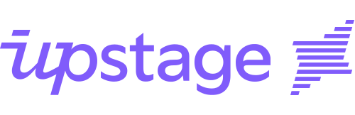

# 모델은 빌릴 수 있어도, 데이터는 빌릴 수 없다

_국민성장펀드 5,600억의 업스테이지 투자가 던진, 한국 소버린 AI의 진짜 질문_

## Executive Summary

> [!callout]
> 2026년 5월 3일, 국민성장펀드(5년 150조 원 규모)와 첨단전략산업기금이 업스테이지에 **총 5,600억 원**(공적 1,300억 + 민간 4,300억)을 투입하기로 의결했습니다. 리벨리온(NPU·6,400억)에 이은 직접투자 2호이자, **소프트웨어 영역에서는 첫 번째 직접투자**입니다. 정부 독자 AI 파운데이션 모델 1차 평가에서 LG·SKT·업스테이지가 통과한 가운데, 자체 자본 동원이 가능한 LG·SKT를 빼면 업스테이지가 **벤처·중소기업 중 유일하게** 정책 자본을 받는 사업자가 되었습니다. 모델은 Solar Pro 2(31B 파라미터, Artificial Analysis Intelligence Index 58점, GPT-4.1 능가)로 한국 최초의 글로벌 프론티어 LLM입니다.

> 그러나 이 보고서가 던지는 질문은 다릅니다. **모델 자본은 도착했지만, 데이터 자립은 도착하지 않았습니다.** 업스테이지 자신이 2026년 1월 발표한 _Solar Open Technical Report_(arXiv:2601.07022)는 "한국어는 인덱싱된 웹 콘텐츠의 0.8%, FineWeb 2 바이트 기준 17위, 상당히 심각한 데이터 부족"이라고 명시했습니다. Common Crawl 공식 통계(CC-MAIN-2026-17)도 한국어 0.823% 대 영어 41.02% — **약 50배 격차**입니다. DataComp-LM·FineWeb·Phi-3·Nemotron-4 등 2024~2025년 학계 합의는 하나로 모입니다. **데이터 품질이 모델 크기보다 중요하다**는 것입니다. DCLM-7B는 컴퓨트의 40%를 절감했고, Nemotron-4 340B 정렬 데이터의 98%는 합성이며, 한국어용 품질 회귀 모델은 영어 필터로 대체할 수 없다는 사실이 HyperCLOVA X THINK에서 다시 확인됩니다.

> 그래서 우리는 일곱 개의 질문을 차례로 따라갑니다. 5,600억의 정책 메커니즘은 어떻게 설계되었는지, 왜 다른 후보가 아닌 업스테이지였는지, 글로벌 소버린 AI 지도 위에서 한국은 어디에 서 있는지, 4억 달러는 정말로 충분한 자본인지, 한국어 corpus의 진실은 무엇이며 다음 라운드는 어디로 향하는지, 그리고 이 흐름이 정책·기업·엔지니어에게 무엇을 요구하는지. 일곱 갈래의 답은 결국 한 줄로 모입니다 — **소버린 AI의 진짜 변수는 데이터 품질입니다.** 이 글은 [데이터 이코노미](/project/DataEconomy/ko/) 시리즈의 소버린 AI 편으로, 모델 자본이 도착했지만 데이터 자립이 도착하지 않은 자리를 본다.

5,600억 원

국민성장펀드 + 첨단전략산업기금  
(소프트웨어 첫 직접투자)

1조 3,000억 원

업스테이지 기업가치  
(생성형 AI 첫 유니콘)

0.823%

Common Crawl 한국어 비중  
(영어의 약 1/50)

## 5,600억의 해부 — 두 기금이 만나는 자리

대중 매체 헤드라인에 등장한 "5,600억"은 단일 펀드가 아닙니다. 이 금액은 정책 자금과 시장 자금이 분담된 이중 구조입니다. 공적 자본은 1,300억 원이며, 첨단전략산업기금이 1,000억 원, KDB산업은행이 300억 원을 부담합니다. 민간은 4,300억 원으로, SK네트웍스·사제파트너스·우리벤처파트너스·미래에셋이 컨소시엄을 구성했습니다. 정부 단독 베팅의 리스크를 줄이고, 민간 매칭으로 시장성을 검증하는 설계입니다([한국경제, 2026.05.03](https://www.hankyung.com/article/2026050330811)).

### 1.1. 국민성장펀드 5년 150조의 구조

국민성장펀드는 현 정부의 핵심 경제 공약으로, 5년간 150조 원 규모의 종합 정책 펀드입니다. AI·반도체 부문에 50조 원, 그 안에서 직접투자에 15조 원이 배정됩니다. 2026년 4월 말 기준 누적 펀드 집행 11건, 8조 4,000억 원이 진행되었으며, 이번 업스테이지 건은 11번째 누적 집행에 해당합니다. 거버넌스 구조는 RCPS(상환전환우선주)로 추정되는데, 이는 일정 기간 후 보통주 전환 또는 상환 청구가 가능한 형태입니다. 정부 지분이 영구 고정되지 않고 IPO나 회수 시점에 정리되는 구조로, 직전 직접투자 사례인 리벨리온도 동일 방식으로 보도된 바 있습니다.

### 1.2. 직접투자 사례 비교

2026년 들어 정부의 AI 직접투자는 K-엔비디아(하드웨어)와 K-OpenAI(소프트웨어) 이중 트랙을 1개월 간격으로 완성했습니다. 리벨리온이 NPU 영역에서 6,400억 원을 받은 데 이어, 업스테이지가 LLM 영역에서 5,600억 원을 받는 흐름입니다. 두 사례 모두 RCPS 추정 + 민간 매칭 구조를 따릅니다.

| 기업 | 시점 | 총 라운드 | 공적 분담 | 영역 |
| --- | --- | --- | --- | --- |
| 파두 | 2026-02 | SSD 컨트롤러 트랙(별도) | 첨단전략산업기금 단독 | 반도체 IP |
| 리벨리온 | 2026-03-26 | 6,400억 원 | 2,500억(공적) + 3,400억(민간) | AI 반도체 (NPU) |
| 업스테이지 | 2026-05-03 | 5,600억 원 | 1,000억(첨단기금) + 300억(산은) + 4,300억(민간) | AI 소프트웨어 (LLM) |

************

### 1.3. 분리 구조의 정책 논리

두 기금이 분리된 이유는 정책 자금의 성격이 다르기 때문입니다. 첨단전략산업기금(산업통상자원부 운용)은 첨단전략산업 정의에 부합하는 기술 영역에 집중 투입되어, 정책 명분을 만들고 시장 신호를 보냅니다. 국민성장펀드 직접투자(KDB산업은행 + 민간 컨소시엄)는 시장 자금과 매칭되어 회수성을 검증합니다. 이중 구조는 정부 단독 리스크 축소 + 회수 조건 차별화의 결과이며, 같은 설계가 리벨리온에도 적용된 바 있습니다([디지털타임스, 2026.05.03](https://www.dt.co.kr/article/12060634)).

## 왜 업스테이지였나 — Solar LLM 선택의 4가지 근거

정부 독자 AI 파운데이션 모델 1차 평가에서 LG·SKT·업스테이지 세 곳이 통과했고, 네이버는 비전 인코더 가중치 차용 의혹으로 탈락했습니다([플래텀, 2026.01.15](https://platum.kr/archives/279684)). 자체 자본 동원이 가능한 LG·SKT를 제외하면, 정책 자금의 정당성이 강하게 작동하는 후보는 업스테이지뿐이었습니다. 그러나 "벤처라서 받았다"로는 부족합니다. 업스테이지 선정의 네 가지 논리를 차례로 봅니다.

### 2.1. 기술 — Depth Up-Scaling과 Solar Pro 2의 IAI 58점

업스테이지의 기술적 차별점은 Depth Up-Scaling(DUS) 기법입니다. 2023년 12월 발표된 SOLAR 10.7B 논문(arXiv:2312.15166)에서 제안된 이 기법은 두 개의 사전학습 모델 레이어를 깊이 방향으로 스케일링하여 단일 GPU 운용 가능성을 확보합니다. 이후 Solar Pro 2(31B 파라미터, 2025-07 공개)는 Artificial Analysis Intelligence Index에서 58점을 기록하며 GPT-4.1(53점), DeepSeek V3(53점), Moonshot Kimi K2(57.59점)를 능가했습니다. 한국 최초의 글로벌 프론티어 LLM이라는 평가가 정책 명분을 만들었습니다.

아래 차트는 주요 LLM의 Artificial Analysis Intelligence Index 점수를 비교한 것입니다. Solar Pro 2가 단일 GPU 효율성을 유지하면서도 글로벌 상위권에 진입한 결과입니다.

Solar Pro 2 (31B)

58

Kimi K2

57.6

GPT-4.1

53

DeepSeek V3

53

### 2.2. 데이터 — 한국어 instruction tuning과 다음 인수

업스테이지는 한국어 instruction tuning 노하우와 KMMLU·Hae-Rae·Ko-IFEval에서의 SOTA 기록을 보유하고 있습니다. 더 결정적인 사건은 2026년 1월 29일 카카오와 체결한 주식 교환 MOU입니다. 이 거래로 업스테이지는 다음(Daum)의 30년 누적 한국어 데이터(뉴스·카페·티스토리)에 대한 접근권을 확보했습니다. 정부 발표문은 "국내 포털 기업과의 협력을 통한 한국어 데이터 확보"를 5,600억 사용처로 명시했는데, 이는 정부도 "모델 자본만으로는 부족하다"는 인식을 공식 문서에 처음 반영한 것입니다([ZDNet Korea, 2026.01.29](https://zdnet.co.kr/view/?no=20260129184125)).

### 2.3. 사업 — B2B 매출과 IPO 추진

업스테이지의 사업 모델은 B2B 중심입니다. Intel·미국 보험사 등 글로벌 고객과 AWS Bedrock 등재가 매출 베이스를 구성합니다. 단일 GPU 운용 효율성은 OpenAI·Anthropic 등 클라우드 의존 모델 대비 차별화 포인트입니다. 기업가치는 1조 3,000억 원으로 평가되어 한국 생성형 AI 첫 유니콘이 되었으며, IPO도 추진 중입니다([thebell IPO 인터뷰](https://www.thebell.co.kr/free/content/ArticleView.asp?key=202511130847254200108072)). 정부 자본이 들어가도 회수 가능한 시장형 사업이라는 점이 KDB산업은행과 민간 컨소시엄을 끌어들이는 조건이 되었습니다.

*▲ 업스테이지 — 한국 생성형 AI 첫 유니콘이자 5,600억 직접투자의 단일 수신자 | Source: [Wikimedia Commons](https://commons.wikimedia.org/wiki/File:Upstage_Logo_Purple.svg)*

### 2.4. 정책 — 독자성 평가와 한국 LLM 지도

1차 평가의 핵심 기준은 "독자성"이었습니다. 네이버 HyperCLOVA X SEED는 비전 인코더 가중치를 Qwen 2.5에서 차용했다는 의혹(코사인 유사도 99.51%)으로 탈락했고, 업스테이지는 가중치 초기화부터 자체 학습을 입증했습니다. 이는 모델 학습 단계의 데이터·가중치 출처가 정책 변수가 됐다는 의미이며, **데이터 출처의 검증 가능성(provenance)이 정책 평가 항목으로 진입했다**는 신호입니다.

한국 주요 LLM 사업자의 포지션을 정리하면 다음과 같습니다. 표는 두 가지 축 — **자본 동원 능력**과 **정부 1차 평가 통과 여부** — 위에서 정책 자금 정당성이 어떻게 분포하는지를 보여줍니다.

대기업 자체 자본이 가능한 LG·SKT·카카오·KT·NC AI는 정책 펀드의 명분이 약합니다. 네이버는 1차 평가에서 독자성 미흡으로 진입로 자체가 봉쇄됐습니다. 결과적으로 "벤처 + 독자성 통과" 두 조건을 동시에 충족한 사업자는 업스테이지 한 곳뿐이며, 5,600억의 정책적 정당성은 이 표의 빈자리에서 발생합니다. 동시에, 데이터·가중치 출처의 검증 가능성(provenance)이 1차 평가의 명시적 항목으로 등장했다는 사실은, 다음 라운드의 정책 변수가 학습 데이터 트랙으로 자연스럽게 이동할 것이라는 신호이기도 합니다.

| 기업 | 대표 모델 | 자본 동원 | 정부 1차 평가 | 정책 자금 후보 |
| --- | --- | --- | --- | --- |
| 업스테이지 | Solar Pro 2 (31B) | 벤처 | 통과 | 5,600억 직접투자 (확정) |
| LG AI Research | EXAONE / K-EXAONE | 대기업 자체 | 통과 | 정당성 약함 |
| SK텔레콤 | A.X K1 | 대기업 자체 | 통과 | 정당성 약함 |
| 네이버 | HyperCLOVA X / SEED | 대기업 자체 | 탈락(독자성 미흡) | 진입 봉쇄 |
| 카카오 | Kanana | 대기업 자체 | 미공개 | 정당성 약함 |
| KT | Mi:dm 2.0 | 대기업 자체 | 미공개 | 정당성 약함 |
| 엔씨소프트 NC AI | VARCO | 대기업 자체 | 미공개 | 정당성 약함 |

********

## 글로벌 소버린 AI 지도 — 한국은 어디에 서 있나

2024년 이후 G7+ 국가들은 같은 어젠다 — 소버린 AI — 위에 자본을 쌓아왔지만, 무엇을 먼저 풀었는가는 나라마다 갈립니다. 모델 우선, 데이터 우선, 인프라 우선의 세 갈래에 더해 한국형 '모델+인프라' 결합, 독일처럼 포기·피벗으로 돌아선 사례까지 다섯 경로가 동시에 진행 중입니다. 그 지도 위에 한국을 올려놓으면 위치가 독특해집니다 — **데이터 트랙이 정책 어젠다에 명시되지 않은 거의 유일한 사례**이기 때문입니다.

### 3.1. 국가별 우선순위 비교

아래 표는 주요 국가의 소버린 AI 전략 우선순위를 정리한 것입니다. 한국은 모델(Solar)과 인프라(해남 솔라시도) 두 축에 자본을 집중했고, 데이터는 정책 어젠다에 명시되지 않았습니다.

| 국가 | 전략 우선순위 | 대표 펀드/프로그램 | 핵심 기업 |
| --- | --- | --- | --- |
| 프랑스 | 모델 우선 | 민간 투자 + 부분 공적 지원 | Mistral ($2.9B + $830M debt) |
| 일본 | 모델 우선 + GPU 무상 | GENIAC | Sakana AI ($2.65B) |
| 인도 | 데이터 우선 | IndiaAI Mission (~$1.2B) | BharatGen, Sarvam ($350M) |
| 싱가포르 | 데이터 우선 (다국어) | NMLP (S$70M) | AI Singapore (SEA-LION) |
| UAE | 인프라 우선 | Microsoft 협력 ($1.5B+) | G42 (Falcon) |
| EU | 인프라 우선 | EuroHPC (~$2B), AI Factories | Mistral, OpenEuroLLM |
| 한국 | 모델 + 인프라 | 국민성장펀드 + 첨단전략산업기금 | 업스테이지 + 해남 솔라시도(1만 5천 GPU) |
| 독일 | 포기/피벗 | Aleph Alpha → Cohere 흡수($20B, 2026-04) | 프론티어 모델 자체 개발 중단 |

********************

*▲ EuroHPC JU — EU 인프라 우선 소버린 AI 트랙(~$2B). 모델·인프라·데이터 세 갈래 중 한국이 채택한 두 축이 글로벌에서 어디에 위치하는지를 비교하는 좌표 | Source: [Wikimedia Commons](https://commons.wikimedia.org/wiki/File:HPC_JU_logo_RGB.svg)*

### 3.2. 한국의 위치 — 모델과 인프라의 두 축

한국은 모델(Solar)과 인프라(해남 솔라시도 1만 5천 GPU)에 자본을 집중했습니다. 해남 솔라시도 AI 컴퓨팅센터는 2026년 4월 발표된 NVIDIA·해남군·중앙정부의 합작 프로젝트로, 한국형 AI Factory 모델로 평가받습니다([한국경제, 2026.04.06](https://www.hankyung.com/article/2026040623051)). 모델과 인프라 양 축이 같은 시기에 공적 자본을 받는 사례는 글로벌 G7+ 국가 중 한국이 유일합니다.

### 3.3. 데이터 트랙 공백의 의미

한국 AI 기본법(2026-01-22 시행)은 거버넌스·안전 중심이며, 학습 데이터 정책은 모두의 말뭉치(국립국어원)와 AI Hub의 양적 한계에 머물고 있습니다. 인도 IndiaAI Mission이 22개 언어 데이터를 우선 어젠다로 두고, 싱가포르 SEA-LION이 13개 동남아 언어 continual pre-training에 자본을 투입한 것과 대조적입니다. 한국이 채워야 할 트랙은 곧 정책 변수의 마지막 한 칸입니다.

## 5,600억은 충분한가 — 자본의 산수

5,600억 원은 환율 기준 약 4억 달러입니다. 글로벌 LLM 자본 지도 위에 이 숫자를 올려놓으면 두 가지가 동시에 보입니다. **"한 번의 프론티어 모델 학습"엔 충분한 수준이지만, "지속적 글로벌 추격"엔 부족하다**는 점입니다.

### 4.1. 글로벌 LLM 자본 비교

Dealroom 2026-03 기준 OpenAI 누적 투자는 1,800억 달러($180B), Anthropic 590억 달러($59B)에 이릅니다. 같은 기간 Microsoft·Amazon·Google·Meta 4사의 6개월 AI 인프라 지출만 1,000억 달러를 넘습니다([Lawfare, 2024](https://www.lawfaremedia.org/article/sovereign-ai-in-a-hybrid-world)). 한국 5,600억은 이 6개월 지출의 **0.4%**입니다. 아래 차트가 그 격차를 압축합니다.

OpenAI 누적

$180B

Anthropic 누적

$59B

Mistral 누적

$2.9B+

Sakana AI

$2.65B

EuroHPC

$2B

IndiaAI Mission

$1.2B

한국 (업스테이지)

$0.4B

### 4.2. 5,600억의 사용처 시나리오

정부 발표문은 5,600억의 사용처로 (1) Solar Pro 차세대 학습, (2) 해남 AI 컴퓨팅센터 활용, (3) 한국어 데이터 확보(다음 데이터 활용 포함), (4) 인재 채용을 거론합니다. 단일 프론티어 학습엔 충분합니다 — OpenAI GPT-4 단일 학습비 추정 1억 달러 이상을 기준으로 하면, 4억 달러는 4배 수준입니다. 그러나 GPU + 인재 + 운영비 + 데이터를 동시에 커버해야 하기 때문에 빠르게 소진될 가능성이 높습니다. 후속 라운드 시나리오가 따라붙지 않으면 자본의 효율은 압축됩니다.

### 4.3. 독일 Aleph Alpha 사례의 경고

독일은 한때 유럽의 OpenAI를 자처한 Aleph Alpha에 누적 5억 달러 이상을 투입했지만, 2024년 프론티어 모델 자체 개발을 포기하고 산업용 AI로 피벗했습니다. 2026년 4월에는 Cohere가 200억 달러 가치로 Aleph Alpha를 흡수하며 유럽 자체 LLM 트랙이 사실상 폐쇄되었습니다([CNBC, 2026.04.24](https://www.cnbc.com/2026/04/24/cohere-aleph-alpha-germany-ai-europe-expansion.html)). 5억 달러도 부족했다는 사실은 한국 5,600억의 자본 효율 문제를 미리 보여줍니다. 답은 단순한 자본 증액이 아니라, 같은 자본으로 더 많은 가치를 만드는 변수에 있습니다 — 그것이 데이터 품질입니다.

*▲ Aleph Alpha — 누적 5억 달러+ 자본을 받고도 프론티어 모델 트랙에서 후퇴한 독일 케이스. 5,600억(≈$400M)의 자본 산수 위에 미리 놓아야 할 비교 좌표 | Source: [Wikimedia Commons](https://commons.wikimedia.org/wiki/File:Logo_Aleph_Alpha.svg)*

## 데이터 자립이라는 미해결 변수 — 한국어 corpus의 진실

여기서부터가 이 자본 산수를 뒤집는 자리입니다. 한국어 학습 데이터의 한계는 단일 변수가 아니라 **절대량 + 라이선스 + 품질 검출 인프라**의 세 층으로 쌓여 있습니다. 그리고 이 사실을 가장 먼저 문서화한 곳은 외부 비평가가 아니라 업스테이지 자신이었습니다.

Solar Open Technical Report (arXiv:2601.07022, 2026-01)"Korean represents only about 0.8% of indexed web content and ranks 17th by bytes in FineWeb 2 — a reasonably severe data scarcity for a language ecosystem this active."

— 한국어는 인덱싱된 웹 콘텐츠의 약 0.8%, FineWeb 2 바이트 기준 17위에 불과해 상당히 심각한 데이터 부족 상황이다.

### 5.1. 절대량 — 한국어 0.823% vs 영어 41.02%

Common Crawl의 가장 최근 스냅샷(CC-MAIN-2026-17)에서 한국어는 0.823%, 영어는 41.02%를 차지합니다. 약 50배 격차입니다. FineWeb 2에서 한국어는 바이트 기준 17위로, 학습 데이터 기준 글로벌 17번째 언어 환경입니다. 아래 차트가 그 격차를 시각화합니다.

영어

41.02%

러시아어

5.31%

독일어

4.62%

일본어

4.55%

한국어

0.82%

*▲ Common Crawl — CC-MAIN-2026-17 스냅샷에서 한국어 비중 0.823%(영어 41.02%)가 측정된 글로벌 인덱스. FineWeb 2 17위 순위와 함께 데이터 자립의 출발선이 된다 | Source: [Wikimedia Commons](https://commons.wikimedia.org/wiki/File:Common_Crawl_logo.svg)*

### 5.2. 라이선스 — 모두의 말뭉치, AI Hub, BookCorpus 부재

모두의 말뭉치(국립국어원)는 텍스트 자체 재배포가 금지되며, AI Hub의 도서·웹 말뭉치는 양적 한계가 명확합니다. 영미권의 BookCorpus 한국어 등가물은 사실상 부재합니다. Korpora(한국어 자연어 처리 데이터셋 모음)는 라이선스 사유로 다운로드가 불가능하고, 로드만 제공하는 상태입니다. 라이선스 모호성은 학습 데이터의 합법성·재현 가능성을 동시에 위협하며, 이는 모델의 글로벌 배포에서 심각한 변수로 작동합니다.

### 5.3. 데이터 품질이 모델 크기를 넘어선다 — 학계 합의

2024년부터 학계는 한 방향으로 수렴해 왔습니다. **같은 컴퓨트라면 데이터 품질이 모델 크기보다 더 큰 차이를 만든다**는 것입니다. 대표 연구는 다음과 같습니다.

- **DataComp-LM**(arXiv:2406.11794, 2024): DCLM-7B는 같은 컴퓨트로 다른 동급 모델보다 컴퓨트의 40%를 절감하면서 MMLU 6.6%p 향상.
- **FineWeb**(arXiv:2406.17557, 2024): 15조 토큰의 정제된 영어 코퍼스가 동일 학습 비용에서 일관된 성능 향상을 제공.
- **Phi-3**(arXiv:2404.14219, Microsoft): 3.8B 파라미터로 GPT-3.5 수준 도달. 사전학습부터 합성 데이터 통합.
- **Nemotron-4 340B**(arXiv:2406.11704, NVIDIA): 정렬 데이터의 98% 이상이 합성 — 합성 데이터가 보조수단이 아니라 핵심 인프라가 됐음을 입증.
- **Chinchilla**(arXiv:2203.15556, 2022): 파라미터당 토큰 수가 모델 성능을 결정한다는 토대 명제.

*▲ DCLM-Baseline은 동일 컴퓨트에서 LLaMA-2·MAP-Neo·Falcon·DeepSeek 동급 모델을 일관되게 상회한다. 데이터 큐레이션 한 축의 차이가 컴퓨트 40%p와 MMLU 6.6%p로 환산되는 학계 합의의 대표 그래프 | Source: [DataComp-LM (arXiv:2406.11794, 2024)](https://arxiv.org/abs/2406.11794)*

Phi-3 논문의 한 문장은 시대 변화를 압축합니다. _"Scaling laws assume a fixed data source. This assumption is now significantly disrupted by the existence of frontier-level LLMs themselves."_ 즉 학습 데이터의 분포 자체를 모델이 다시 만들어내는 시대입니다. 한국어처럼 절대량이 부족한 언어에서, 이 변화는 위협이 아니라 기회입니다 — 합성 데이터가 양적 한계를 넘어설 수 있는 도구이기 때문입니다.

이 학계 합의를 5,600억 자본의 산수로 옮겨 적으면 결과는 더 분명해집니다. DCLM-7B의 컴퓨트 40% 절감은 단순 효율이 아니라 **"같은 4억 달러로 5억 6천만 달러 상당의 모델 성능을 만들어낸다"**는 의미입니다. 반대로, 데이터 품질에 무관심한 학습은 같은 자본으로 2억 4천만 달러 수준의 성능에 머무를 수 있다는 뜻이기도 합니다. 모델 크기를 키우는 추가 자본이 아니라, 학습 데이터의 결함을 솎아내고 합성 토큰으로 한국어 분포를 메우는 인프라가 정책 자본의 효율을 결정합니다. 이 명제는 학술 논문 수십 편이 아니라 컴퓨트 영수증 위에서 검증된 결론입니다.

### 5.4. 한국어 품질 검출은 한국어 인프라가 필요하다

영어용 educational filter는 한국어에서 작동하지 않습니다. 네이버 HyperCLOVA X THINK(arXiv:2506.22403)는 한국어 0~5점 품질 회귀 모델을 별도로 학습하고, LLM 두 단계 PII 파이프라인을 적용해 89.28%의 PII 검출 데이터를 0.13%로 정제했습니다. 한국어 데이터 정제 인프라는 영어 모델의 부수적 기능이 아니라, 별도의 한국어 전용 시스템이 필요한 영역입니다. **"한국어 데이터를 위한 한국어 인프라"**는 정책적·기술적으로 동시에 검증된 명제입니다.

### 5.5. 합성 데이터 — 양적 한계의 현실 경로

업스테이지 자신도 Solar Open 100B 학습에 Solar Pro 2 기반 4.5조 합성 토큰을 사용했습니다. NVIDIA Nemotron-4 340B는 정렬 데이터의 98% 이상이 합성, 네이버 HyperCLOVA X THINK는 6조 한·영 토큰에 타깃 합성 한국어 데이터를 결합했습니다. 합성 데이터는 글로벌 검증된 명제이며, 한국어 환경에서 더욱 결정적입니다. 페블러스가 DataGreenhouse를 통해 다루는 영역이기도 합니다. 양적 한계는 정제와 합성으로만 해결됩니다.

## 다음 라운드 — 모델 자본 다음에 와야 할 것

글로벌 패턴을 보면 답이 보입니다. **모델 펀드 다음에는 데이터/평가 펀드가 옵니다.** 일본 GENIAC(GPU 무상 제공) → 산업 자본 결집 → 데이터 협력 단계로, 인도 IndiaAI Mission(22개 언어 데이터 우선) → 22개 한국어 등 하위 언어 인프라로, 싱가포르 SEA-LION(13개 SEA 언어 continual pre-training)이 그 사례입니다.

### 6.1. 주요 사건의 6개월 타임라인

한국 정책의 시그널을 시간순으로 정리하면 다음과 같습니다. 2025년 11월 Sakana AI가 일본형 소버린 AI의 대표 사례로 부상한 시점을 기점으로, 한국은 1차 평가 → AI 기본법 → 다음 인수 → 리벨리온 → 업스테이지로 이어지는 6개월 동안 정책의 무게중심을 빠르게 이동시켰습니다.

2025-11-17

Sakana AI Series B $135M 유치, 가치 $2.65B (일본 소버린 AI 대표 모델 부상)

2025-12-30

정부 독자 AI 파운데이션 모델 1차 발표회 (LG·SKT·업스테이지·네이버 4사 발표)

2026-01-15

1차 평가 결과 — LG·SKT·업스테이지 통과, 네이버 SEED 비전 인코더 차용 의혹으로 탈락

2026-01-22

AI 기본법 시행 (거버넌스·안전 중심, 학습 데이터 정책은 미명시)

2026-01-29

카카오 ↔ 업스테이지 주식 교환 MOU — 다음(Daum) 30년 한국어 데이터 접근권 확보

2026-03-26

리벨리온 직접투자 6,400억 원 (NPU, 공적 2,500 + 민간 3,400)

2026-04-06

해남 솔라시도 AI 컴퓨팅센터 발표 (NVIDIA 협력 1만 5천 GPU)

2026-05-03

업스테이지 직접투자 5,600억 원 (LLM, 공적 1,300 + 민간 4,300)

### 6.2. 한국 후속 라운드 시나리오

업스테이지 5,600억 사용처에 "데이터 확보"가 명시된 것은 정부도 인식하기 시작했다는 사실을 보여줍니다. 다음 단계로 자연스럽게 따라올 수 있는 정책 라운드는 다음과 같습니다. (1) 평가 인프라 펀딩 — KMMLU·KoMT-Bench가 정책 수준의 표준 평가셋으로 격상되는 시나리오. (2) 데이터 정제·합성 펀드 — 인도/싱가포르처럼 데이터 트랙 자체에 자본이 들어가는 시나리오. (3) 한국어 도메인 라이선스 정비 — 모두의 말뭉치 재배포 정책 개정과 도서·뉴스·아카이브 라이선스 표준화. 글로벌 패턴이 시사하는 다음 자리이며, 동시에 한국 정책이 채워야 할 빈자리입니다.

### 6.3. 데이터 인프라 스타트업의 기회

모델 펀딩이 데이터 인프라로 이동하는 흐름은 데이터 인프라 스타트업에게 직접적 기회입니다. 업스테이지 자체가 학습 데이터 진단·합성 데이터 수요자가 될 가능성이 높고, 업스테이지를 활용하는 다운스트림 기업(공공기관, 대기업 AI 부서)은 자체 도메인 데이터 정제 수요가 폭발할 것입니다. 인도 BharatGen이 12개 AI 프로젝트에 1,000크로 루피를 우선 배분받은 패턴, 싱가포르 NMLP가 Sea-Lion 시리즈에 자본을 투입한 패턴이 한국에서 재현될 가능성이 큽니다.

## 시사점 — 모델은 빌릴 수 있어도 데이터는 빌릴 수 없다

여기까지의 분석을 한 줄로 줄이면 이렇습니다. **소버린 AI = 데이터 자립**입니다. 모델 가중치는 글로벌 오픈웨이트(Llama·Mistral·Solar Open)로 빌릴 수 있지만, 한국어 코퍼스의 양·라이선스·품질 검출 인프라는 국경 밖에서 조달할 수 없습니다. 5,600억 자본의 효율을 결정짓는 변수는 모델 크기가 아니라 데이터 품질입니다. 정책 담당자, 기업 결정자, AI 실무자 — 세 자리에서 각자 어떻게 움직여야 하는지 차례로 정리합니다.

### 7.1. 정책 담당자에게 — 데이터 트랙 펀딩 신설

모델 펀드와 인프라 펀드 다음에 와야 할 것은 데이터 트랙 펀딩입니다. 일본 GENIAC, 인도 IndiaAI Mission, 싱가포르 NMLP가 모두 데이터 또는 평가 트랙을 명시적으로 분리했습니다. 한국 후속 라운드의 핵심은 (a) 학습 데이터 정제·합성 자본, (b) 한국어 도메인 라이선스 표준화, (c) 평가 인프라(KMMLU·KoMT-Bench)의 정책 수준 표준화입니다.

### 7.2. 기업 결정자에게 — 자체 도메인 데이터 정제

업스테이지 LLM을 활용하는 다운스트림 기업(공공기관, 제조 대기업, 금융, 의료)은 자체 도메인 데이터의 품질·라이선스·합성 가능성을 점검해야 합니다. Solar Pro 2가 한국어 SOTA를 차지해도, 도메인 어댑테이션의 품질은 결국 자사 데이터의 품질에서 결정됩니다. 데이터 정제 인프라 도입은 LLM 도입의 결과물이 아니라 전제 조건입니다.

### 7.3. AI 실무자에게 — DCLM·FineWeb·합성 파이프라인

ML 엔지니어와 데이터 사이언티스트의 실무 우선순위는 (a) 학습 데이터 품질 측정 도구(DCLM·FineWeb 스타일), (b) 한국어 품질 회귀 모델(HyperCLOVA X THINK 스타일), (c) 합성 데이터 파이프라인(Nemotron 스타일)의 도입입니다. 모델 자체보다 데이터 파이프라인이 성능을 결정하며, 그 효과는 학계 합의로 검증되어 있습니다.

> [!callout]
> **"모델은 빌릴 수 있어도 데이터는 빌릴 수 없다"**는 단순한 슬로건이 아닙니다. Common Crawl 0.823%, FineWeb 2 17위, Solar Open Technical Report의 "severe data scarcity"라는 자체 인용, 영어 필터가 작동하지 않는 한국어 품질 검출 한계 — 이 모든 수치가 같은 결론을 가리킵니다. 자본의 산수를 바꾸는 것은 모델이 아니라 데이터입니다.

## 페블러스가 이 흐름에 주목하는 이유

페블러스는 데이터 인프라 회사입니다. 그래서 5,600억의 의미가 단순한 투자 뉴스가 아니라 정책 어젠다의 변곡점으로 보입니다. 모델 자본이 도착했다는 것은, 다음 정류장이 데이터 자본이라는 신호이기 때문입니다. 네 가지 각도로 이 흐름을 정리합니다.

### +.1. 비즈니스/기술 연결

이번 투자는 페블러스의 핵심 사업 영역(AI-Ready Data, DataClinic, Physical AI)과 정확히 같은 축 위에서 일어납니다. 정부가 5,600억을 투입해도 GPU·인재·운영비로 흐를 뿐, "학습 데이터 품질"로 자동 흐르지 않습니다. 펀드 효율의 결정 변수가 데이터 품질 인프라이며, 페블러스가 정확히 그 자리를 메웁니다. Physical AI 측면에서 한국어 LLM이 강해질수록, 산업 현장 연결을 담당하는 PebbloSim과 DataGreenhouse의 가치도 동반 상승합니다.

### +.2. 데이터 품질 관점

LLM 성능은 모델 구조가 아닌 학습 데이터의 품질·다양성·라이선스 안전성에서 결정된다는 것이 2024–2026년 학계 일관된 결론입니다. 한국어 corpus는 영어 대비 1/50, 라이선스 모호성, 품질 검출 인프라 부재의 삼중고를 안고 있습니다. Solar LLM이 글로벌 벤치마크 경쟁력을 유지하려면 (a) 한국어 데이터 정제 기술(DataClinic), (b) 합성 데이터 보강(DataGreenhouse), (c) 도메인별 평가셋이 모두 필요합니다. 모델 자본만으로는 메울 수 없는 빈자리입니다.

### +.3. 고객/파트너 실무 함의

세 가지 직접 시장 신호가 동시에 발생합니다. (a) 업스테이지 자체가 학습 데이터 진단·합성 데이터 수요자가 될 가능성이 높습니다 — 5,600억 중 데이터 관련 예산 상당 부분이 추정됩니다. (b) 업스테이지를 활용하는 다운스트림 기업(공공기관, 대기업 AI 부서)은 자체 도메인 데이터 정제 수요가 폭발합니다 — DataClinic의 직접 시장입니다. (c) 정부 후속 펀딩이 "모델 → 데이터 인프라"로 이동할 가능성이 높습니다 — 페블러스 같은 데이터 인프라 스타트업의 정책 자금 진입로가 열립니다.

### +.4. 페블러스의 포지셔닝

본 보고서는 "소버린 AI의 데이터 인프라 파트너"라는 자리를 자연스럽게 강화합니다. 모델 자본은 정부가 댑니다. 자본의 효율을 결정하는 것은 데이터 품질입니다. 그 자리를 페블러스가 채웁니다 — 직접 광고가 아니라 객관적 정책·기술 분석을 통한 자연스러운 노출입니다. 정부·공공기관 대상 thought leadership을 축적하는 일은 다음 라운드의 정부·공공 프로젝트 진입 자산이 됩니다.

## 참고문헌

### 학술 (arXiv)

1. J. Hoffmann et al., "Training Compute-Optimal Large Language Models," arXiv:2203.15556, 2022.
2. J. Li et al., "DataComp-LM: In Search of the Next Generation of Training Sets for Language Models," arXiv:2406.11794, 2024.
3. G. Penedo et al., "The FineWeb Datasets," arXiv:2406.17557, 2024.
4. N. Muennighoff et al., "Scaling Data-Constrained Language Models," arXiv:2305.16264, 2023.
5. D. Kim et al., "SOLAR 10.7B: Depth Up-Scaling," arXiv:2312.15166, 2023.
6. Upstage Solar Team, "Solar Open Technical Report," arXiv:2601.07022, 2026.
7. G. Son et al., "KMMLU," arXiv:2402.11548, 2024.
8. NAVER HyperCLOVA X Team, "HyperCLOVA X Technical Report," arXiv:2404.01954, 2024.
9. NAVER HyperCLOVA X Team, "HyperCLOVA X THINK Technical Report," arXiv:2506.22403, 2025.
10. M. Abdin et al., "Phi-3 Technical Report," arXiv:2404.14219, 2024.
11. B. Adler et al. (NVIDIA), "Nemotron-4 340B Technical Report," arXiv:2406.11704, 2024.
12. "Sovereign AI in 2025," _Natural Language Processing_ (Cambridge Core), 2025.
13. "Sovereign AI in a Hybrid World," Lawfare, 2024.

### 정부/공식 자료

1. 금융위원회 보도자료 — [fsc.go.kr](https://fsc.go.kr/eng/pr010101/85267)
2. 국가법령정보센터 AI 기본법 — [law.go.kr](https://www.law.go.kr/lsInfoP.do?lsiSeq=268543)
3. AI Basic Act of the Republic of Korea — [aibasicact.kr](https://aibasicact.kr/)
4. 정책브리핑 AI 기본법 — [korea.kr](https://www.korea.kr/news/policyNewsView.do?newsId=148954629)

### 매체 보도 (2026-05-03 발표 관련)

1. 경향신문 (원문) 2026-05-03 — [khan.co.kr](https://www.khan.co.kr/article/202605032108005)
2. The Korea Times 2026-05-03 — [koreatimes.co.kr](https://www.koreatimes.co.kr/economy/20260503/govt-to-inject-3806-mil-into-korean-ai-startup-upstage)
3. 한국경제 2026-05-03 — [hankyung.com](https://www.hankyung.com/article/2026050330811)
4. 디지털타임스 2026-05-03 — [dt.co.kr](https://www.dt.co.kr/article/12060634)
5. AI타임스 2026-05-03 — [aitimes.com](https://www.aitimes.com/news/articleView.html?idxno=210071)
6. ZDNet Korea 2026-05-03 — [zdnet.co.kr](https://zdnet.co.kr/view/?no=20260503135345)

### 업스테이지·다음 인수·한국 LLM

1. Upstage Solar Pro 2 (KO) — [upstage.ai](https://www.upstage.ai/blog/ko/solar-pro-2-launch)
2. thebell IPO 인터뷰 — [thebell.co.kr](https://www.thebell.co.kr/free/content/ArticleView.asp?key=202511130847254200108072)
3. ZDNet Korea 2026-01-29 (다음 MOU) — [zdnet.co.kr](https://zdnet.co.kr/view/?no=20260129184125)
4. 플래텀 1차 평가 결과 — [platum.kr](https://platum.kr/archives/279684)
5. LG K-EXAONE Hugging Face — [huggingface.co](https://huggingface.co/LGAI-EXAONE/K-EXAONE-236B-A23B)
6. SKT A.X K1 — [news.sktelecom.com](https://news.sktelecom.com/en/2533)

### 글로벌 소버린 AI

1. Mistral debt CNBC 2026-03-30 — [cnbc.com](https://www.cnbc.com/2026/03/30/mistral-ai-paris-data-center-cluster-debt-financing.html)
2. Sakana AI Series B TechCrunch — [techcrunch.com](https://techcrunch.com/2025/11/17/sakana-ai-raises-135m-series-b-at-a-2-65b-valuation-to-continue-building-ai-models-for-japan/)
3. Sarvam $350M Outlook — [outlookbusiness.com](https://www.outlookbusiness.com/corporate/sarvam-ai-350m-funding-round-2026-bessemer-nvidia-amazon)
4. BharatGen medianama — [medianama.com](https://www.medianama.com/2026/04/223-centre-funds-12-ai-projects-sovereign-models-bharatgen-4x-next-highest-allocation-rs-1000-crore/)
5. G42 Microsoft Middle East AI — [middleeastainews.com](https://www.middleeastainews.com/p/uae-us-plan-5gw-ai-cluster-arabic)
6. Cohere–Aleph Alpha CNBC — [cnbc.com](https://www.cnbc.com/2026/04/24/cohere-aleph-alpha-germany-ai-europe-expansion.html)
7. IMDA NMLP — [imda.gov.sg](https://www.imda.gov.sg/about-imda/emerging-technologies-and-research/national-multimodal-llm-programme)

### 데이터 인프라·해남·HAI

1. Common Crawl 통계 — [commoncrawl.github.io](https://commoncrawl.github.io/cc-crawl-statistics/plots/languages)
2. HuggingFace FineWeb — [huggingface.co](https://huggingface.co/datasets/HuggingFaceFW/fineweb)
3. Korpora GitHub — [github.com](https://github.com/ko-nlp/Korpora)
4. AI Hub 도서/웹 말뭉치 — [aihub.or.kr](https://www.aihub.or.kr)
5. 한국경제 해남 2026-04 — [hankyung.com](https://www.hankyung.com/article/2026040623051)
6. Stanford HAI AI Index 2026 — [hai.stanford.edu](https://hai.stanford.edu/ai-index/2026-ai-index-report)
7. 페블러스 자체 보고서 (HAI 2026 Part 2) — [blog.pebblous.ai](https://blog.pebblous.ai/report/hai-ai-index-2026-part2/en/)

<!-- stat-card -->
**📚 데이터 이코노미 시리즈** — 이 글은 [데이터 이코노미](/project/DataEconomy/ko/)에서 큐레이션하는 시리즈의 일부입니다. 데이터가 자산이 되는 시장의 구조를 — 주권, 품질, 합성, 가치 증명의 네 축으로 — 읽는 자리.
