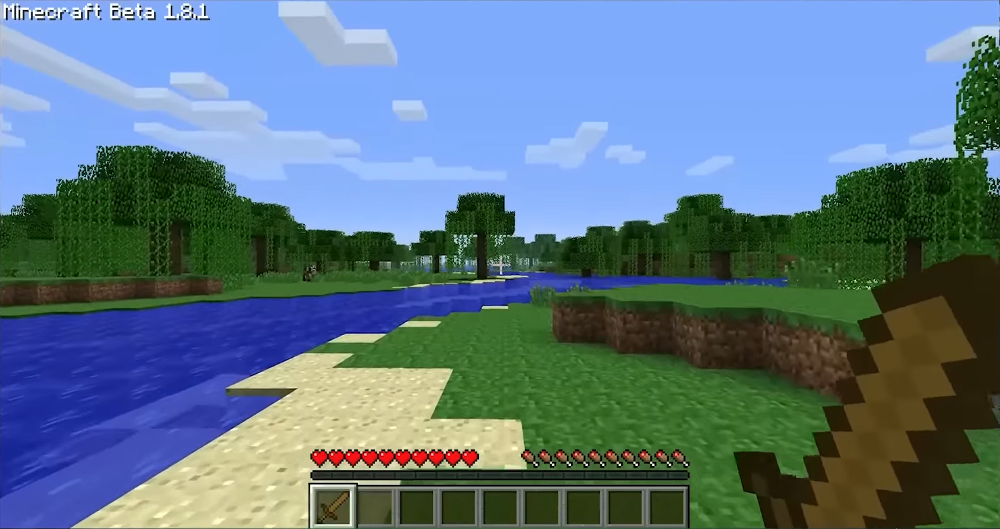
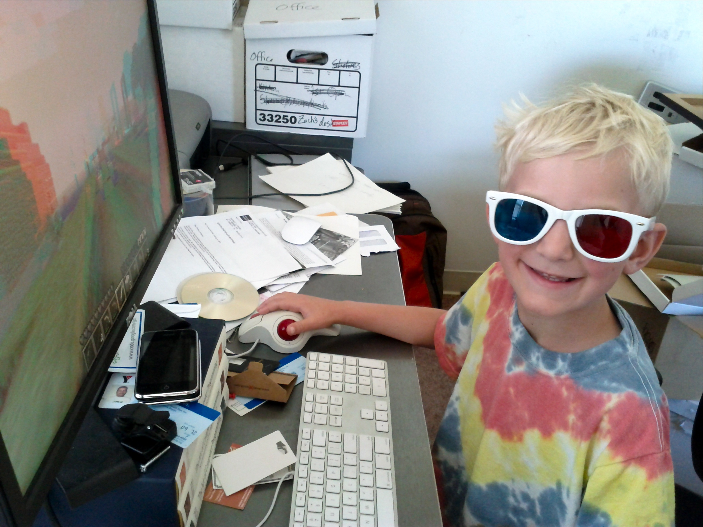
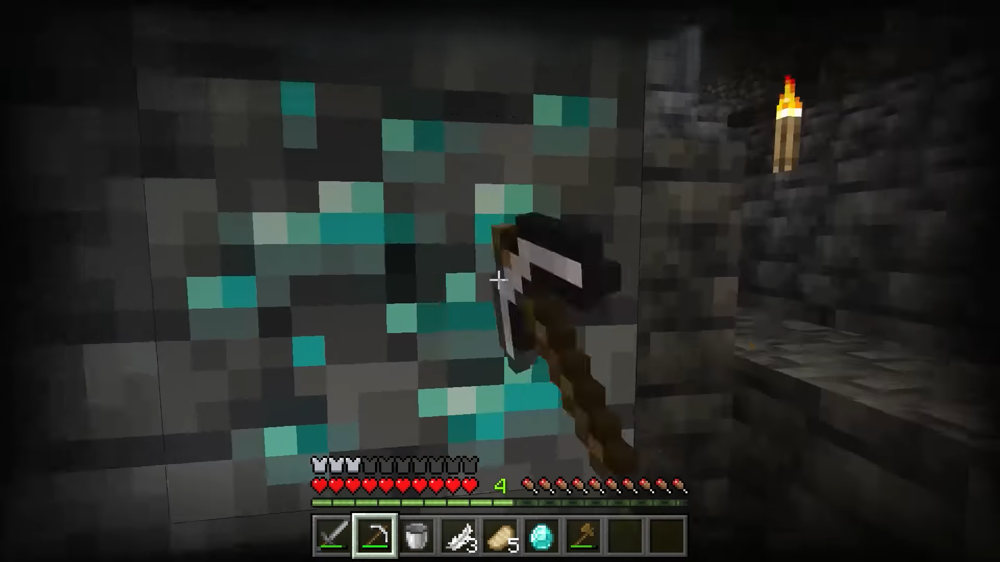
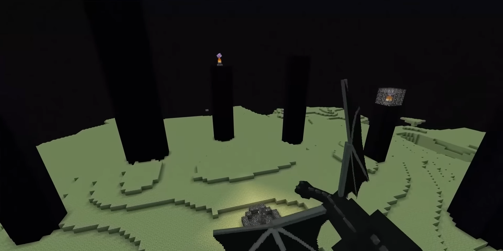
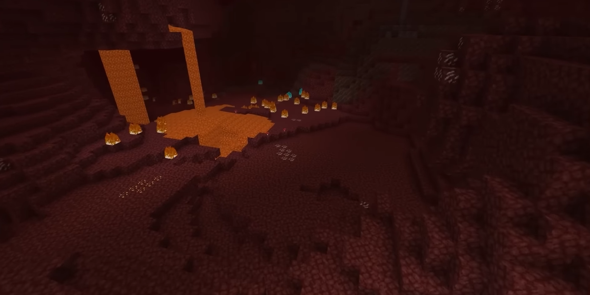
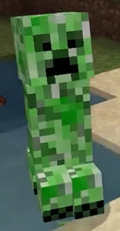

# Voyager: The Origin of Self-Learning AI

_How a GPT-4-Powered Minecraft Agent Wrote the Blueprint for the Autonomous Agent Era_

2026.05 · Pebblous Data Communication Team

Reading time: ~15 min · [한국어](../ko/)

## Executive Summary

> [!callout]
> Presented at NeurIPS 2023, Voyager is the first open-ended lifelong learning agent powered by GPT-4 that autonomously accumulates skills in the Minecraft world without any human intervention. Through its three-component architecture of Automatic Curriculum, Skill Library, and Self-Verification, the system implements the universal learning loop of "observe - plan - execute - verify" in code, becoming the design template for every autonomous agent that followed.

> Compared to existing baselines (ReAct, Reflexion, AutoGPT), Voyager achieved **3.3x** more unique items discovered, **15.3x** faster tech tree progression, and **2.3x** greater exploration distance, while being the only system to successfully mine diamonds. In zero-shot transfer to new worlds, Voyager recorded a **100% success rate** while all baselines remained at 0%.

> However, the self-verification structure where "GPT-4 judges its own success" left a fundamental question unanswered: as agents learn more autonomously, who verifies their training data? For this question that originates with Voyager and extends through AI Scientist and Hermes, DataClinic offers an answer in the form of an independent external verification baseline.

Voyager's achievements can be distilled into four numbers: 3.3x more unique items discovered than existing baselines, fully autonomous learning (zero human interventions), the only system to mine diamonds (the highest tier of the tech tree), and broad academic recognition (1,641 citations). These figures quantitatively demonstrate that Voyager represents not just incremental improvement, but a paradigm shift.

<!-- stat-card -->
**3.3x** — Unique Items Found — vs ReAct baseline

<!-- stat-card -->
**15.3x** — Tech Tree Speed — Only system to reach Diamond

<!-- stat-card -->
**0** — Human Interventions — Fully autonomous learning

<!-- stat-card -->
**1,641** — Academic Citations — Per Semantic Scholar

## The Door Voyager Opened — An LLM Agent Teaches Itself for the First Time

In 2023, an experiment took place in the open-ended 3D world of Minecraft. A team from NVIDIA and Caltech placed a GPT-4-powered agent into this environment and simply observed. No goals were pre-assigned. No reward functions were designed. No human stepped in. The agent started by learning how to chop trees, progressed to crafting stone tools, smelted iron, and ultimately reached diamond mining entirely on its own.

This is Voyager. The paper by Wang et al., presented at NeurIPS 2023, has been cited **1,641 times** on Semantic Scholar (as of May 2026) and earned roughly **6,900 stars** on GitHub. What makes Voyager significant is not that it "mined diamonds in Minecraft." What matters is the **way the agent learned**.

Traditional reinforcement learning agents solve specific tasks through tens of millions of trial-and-error episodes. Once a task is solved, they start from scratch on the next one. Voyager, by contrast, saves every learned skill as JavaScript code, then retrieves and reuses that code when facing new situations. Much like a programmer building up a personal code library, the agent converts its own experience into executable code and accumulates it over time.

*▲ Minecraft Beta 1.8.1 — an open world of rivers, beaches, and forests. Voyager was dropped into this landscape with no predefined goals | Source: Xbox México, [Wikimedia Commons](https://commons.wikimedia.org/wiki/File:Minecraft_Beta_1.8.1_Gameplay_Screenshot.png) (CC BY 3.0)*

> [!callout]
> Voyager's core contribution is not the results of a single paper, but the fact that it became the architectural blueprint for the entire lineage of autonomous agents that followed. The pattern of "open-ended exploration + skill accumulation" has expanded beyond games into science (AI Scientist), general-purpose agents (Hermes), and robotics (GR00T).

## Inside the Four-Stage Loop — Automatic Curriculum, Skill Library, Self-Verification

Voyager's three-component architecture implements the universal learning loop of "observe - plan - execute - verify" in code. Each component uses GPT-4 as a black box and operates purely through prompts, requiring no fine-tuning, which is central to the system's practicality.

### 2.1 Automatic Curriculum

GPT-4 observes the agent's current state (inventory, skill level, surroundings) and automatically proposes the next task. After "mine wood," it suggests "craft wooden planks," then "build a crafting table." Task difficulty is calibrated to be slightly above the agent's current ability, mirroring the educational principle of the Zone of Proximal Development.

### 2.2 Skill Library

Successful behaviors are converted into JavaScript code and stored in the skill library. Each skill is indexed as an embedding vector alongside a natural language description; when a new task arrives, similar existing skills are retrieved and reused or composed. After 160 iterations, the agent had accumulated dozens of reusable skills, and this library became the key asset enabling zero-shot transfer.

### 2.3 Iterative Prompting + Self-Verification

After generated code is executed in the environment, the results (error messages, inventory changes, environment feedback) are fed back to GPT-4. GPT-4 then revises the code and repeats until success. Success is verified through two channels: GPT-4's own judgment and objective environmental feedback (whether an item was obtained).

When these three components connect, Voyager forms a closed feedback loop. Each stage takes the output of the previous stage as input and drives the next, and as the loop repeats, the skill library grows and the agent's capabilities expand. The fact that this entire loop operates through prompt design alone, with no GPT-4 fine-tuning, is the core practicality of Voyager's architecture.

*▲ "Break wood → craft a pickaxe → break stone → craft a better pickaxe." The basic mining loop Voyager learns first through its four-stage cycle | Source: Zach Copley, [Wikimedia Commons](https://commons.wikimedia.org/wiki/File:Mining_in_Minecraft.jpg) (CC BY-SA 2.0)*

The four-stage loop produced by the combination of these three components works as follows:

| Stage | Component | Role |
| --- | --- | --- |
| 1. Observe | Automatic Curriculum | Analyze current state, generate next task |
| 2. Plan | Skill Library Retrieval | Search similar skills, compose code |
| 3. Execute | Iterative Prompting | Generate code, run in environment, fix errors |
| 4. Verify | Self-Verification | Judge success, store skill or retry |

The most notable aspect of this design is that GPT-4 is used as a black box without any fine-tuning. Voyager combines all of GPT-4's capabilities (code generation, situational judgment, natural language understanding) through prompt engineering alone. This means that whenever a new LLM emerges, it can be swapped in immediately without any additional training — which is precisely why subsequent research has adopted this approach wholesale.

## Proof by Numbers — Quantifying "How Much Better"

Voyager's superiority is backed not by abstract claims but by quantitative data. The research team compared it against ReAct, Reflexion, and AutoGPT under identical conditions, and the results were decisive.

The table below shows the key metric comparisons from the 160-iteration experiment.

| Metric | Voyager | ReAct | Reflexion | AutoGPT |
| --- | --- | --- | --- | --- |
| Unique Items Found | 63 | 19 | 18 | 24 |
| Tech Tree Reached | Diamond | Wood | Wood | Stone |
| Exploration Distance | 2.3x | 1.0x | 0.8x | 1.2x |
| Zero-shot Transfer | 100% | 0% | 0% | 0% |

The implication of these numbers is clear: **code-based skill accumulation overwhelmingly outperforms natural language reasoning traces (ReAct) and verbal self-reflection (Reflexion).** ReAct logs its reasoning process as text, and Reflexion summarizes failure experiences in language for use in subsequent attempts. Voyager, by contrast, converts successful behaviors into executable code and stores them. Code carries the inherent advantage of being both executable and verifiable.

The zero-shot transfer results are especially decisive. In a new Minecraft world, Voyager solved all objectives within 50 iterations, while every baseline failed to achieve even a single one. This proves that the skill library is not merely an experience log, but a collection of reusable code assets that are robust to environmental changes.

### 3.1 Ablation Study: Each Component's Contribution

The research team also performed an ablation study, removing each of Voyager's three core components one at a time. Removing Automatic Curriculum caused item discovery to plummet; removing the Skill Library made zero-shot transfer impossible; and removing Self-Verification led to buggy code accumulating in the library. All three components are essential, and removing any one of them causes the entire system's performance to collapse.

*▲ Diamond mining. The peak of the technology tree Voyager reached 15.3× faster than any baseline. With a pickaxe in hand at the deepest veins, the agent built up every required skill — without any guidance from a teacher | Source: Xbox México, [Wikimedia Commons](https://commons.wikimedia.org/wiki/File:Screenshot_of_a_player_mining_for_diamonds_in_Minecraft.png) (CC BY 3.0)*

## Origin of a Lineage — From Code-as-Policies to Hermes

Voyager is not an isolated paper. It is the first large-scale demonstration of a paradigm in which LLMs interact with environments and autonomously accumulate skills, and that paradigm has since expanded across domains, modalities, and scale to form a coherent lineage.

Below are the key nodes of this lineage and each study's contribution in chronological order.

| Year | Research | Key Contribution | Extension from Voyager |
| --- | --- | --- | --- |
| 2023 | Code-as-Policies | LLM output as executable code | Theoretical foundation for Voyager's code-based skills |
| 2023 | ReAct | Combining Reasoning and Acting | Baseline that Voyager was compared against |
| 2023 | Voyager | Autonomous skill accumulation + lifelong learning | Origin point |
| 2024 | Eureka | Automated robot reward function design via LLM | Games → Robotics domain expansion |
| 2024 | AI Scientist v2 | Automation of scientific research — related report | Games → Knowledge domain expansion |
| 2025 | GR00T | Humanoid general-purpose agent | Simulation → Real-world transfer |
| 2025 | Hermes | Multi-agent self-evolution — data quality risk · growth with users | Single → Multi-agent expansion |

[../../../project/AgenticAI/ai-scientist-v2/en/](../../../project/AgenticAI/ai-scientist-v2/en/)[../../ai-science-new-era/en/](../../ai-science-new-era/en/)[../../../project/AgenticAI/isaac-groot/en/](../../../project/AgenticAI/isaac-groot/en/)[../../hermes-agent-data-quality-risk/en/](../../hermes-agent-data-quality-risk/en/)[../../hermes-agent-growth-with-user/en/](../../hermes-agent-growth-with-user/en/)

What particularly stands out in this lineage is Jim Fan's team trajectory. As a co-author of Voyager, Jim Fan leads the GEAR Lab at NVIDIA and directly charted the research path from Voyager (2023) through Eureka (2024) to GR00T (2025-2026). This is a concrete example of academic research transitioning into industrial products, demonstrating that Voyager's architectural principles can extend beyond games to real-world robotics.

Each follow-up study expands into new domains while carrying forward Voyager's core principles of "curriculum - skill accumulation - self-verification." AI Scientist accumulates scientific experiments as skills ([related report](../../ai-science-new-era/en/)), Hermes shares skills across multiple agents ([related report](../../hermes-agent-data-quality-risk/en/)), and GR00T learns physical movements as skills. The pattern remains the same; only the scale and complexity grow exponentially.

*▲ The Minecraft End. The endpoint of the game itself — but where the autonomous-agent lineage begins: into science (AI Scientist), robotics (Eureka, GR00T), and multi-agent systems (Hermes) | Source: Xbox México, [Wikimedia Commons](https://commons.wikimedia.org/wiki/File:Screenshot_from_the_Minecraft_End.png) (CC BY 3.0)*

## From Minecraft to Reality — Physical AI and the Sim-to-Real Gap

"If it works well in Minecraft, does it work in the real world?" This has been the most frequently raised question since Voyager's release. The answer is still "partially," but the gap is closing fast.

Jim Fan's team trajectory proves the point. After Voyager demonstrated autonomous skill accumulation in Minecraft, Eureka (2024) automatically designed robot reward functions in a simulation environment (Isaac Gym), outperforming human-written rewards on **over 80% of tasks**. Then GR00T N1 (2025) generated **11 hours of synthetic data** to obtain the equivalent of 6,500 hours of real training data — an efficiency ratio of **591x**.

The economic implications of this efficiency gap are enormous. Collecting 6,500 hours of robot training data via real-world teleoperation costs approximately $884K, while 11 hours in Isaac Sim runs about $10K. Voyager's proof that "efficient learning in controlled environments works" is being realized at industrial scale.

> [!callout]
> The Physical AI market is projected to grow at a CAGR of **47.2%** to reach **$15.24B** by 2032 (MarketsandMarkets). Humanoid robotics companies raised **$3.2B** in 2025 alone, exceeding the combined total of the previous six years. Foxconn has deployed AI robots on actual Blackwell production lines, signaling the transition from pilot to mass deployment. At the core infrastructure layer of this market sit simulation-based learning and synthetic data — and their academic prototype is Voyager's Minecraft experiment.

However, the sim-to-real gap remains a core challenge. Minecraft has simplified physics, no sensor noise, and a discrete action space. Real-world robots face continuous action spaces, imprecise sensors, and unpredictable environmental variations. The fact that GR00T N2's World Action Model (WAM) doubled the success rate for new environment adaptation reflects engineering effort to narrow this gap — not that the gap has vanished.

An interesting pattern is that follow-up research extends Voyager's text-only limitations into multimodal territory while preserving the core architectural pattern. Optimus-2 (CVPR 2025) integrated visual information, and V-JEPA 2 achieved zero-shot control with 62 hours of unlabeled robot data. Regardless of how domains and modalities change, the "curriculum - skill accumulation - self-verification" pattern applies universally.

*▲ The Minecraft Nether — red lava, dark stone, a closed-ceiling subterranean dimension. Voyager learns safely even in extreme virtual settings like this, but the sensor noise and unpredictable variation a real robot must face still belong to a different order of difficulty | Source: Xbox México, [Wikimedia Commons](https://commons.wikimedia.org/wiki/File:Screenshot_from_the_Minecraft_Nether.png) (CC BY 3.0)*

## The Achilles' Heel of Self-Learning — Data Quality in Automated Evaluation

Voyager's greatest strength is simultaneously its most vulnerable point: self-verification, the structure in which "GPT-4 judges its own success." In Minecraft, success criteria are relatively clear — binary feedback exists, such as whether a diamond was mined or whether an item was added to the inventory. But we must not overlook the fact that this clarity is a necessary condition for Voyager's self-verification to work at all.

Huang et al. (ICLR 2024) demonstrated that LLM intrinsic self-correction without external feedback actually degrades performance. When LLMs judge whether their own output is correct, they frequently change correct answers to incorrect ones. In medical reference generation, GPT-4's hallucination rate was **28.6%**, with precision at just **13.4%**.

Consider how this problem plays out in Voyager's skill library. The agent executes code, and if GPT-4 declares "success," that code is permanently stored in the library. If that judgment was wrong — if the code only partially succeeded or only works under specific conditions — a contaminated skill accumulates in the library. When that skill is later retrieved and reused for new tasks, the error propagates and amplifies.

This is the prototype of **Error Fossilization**. Once an erroneous piece of code is recorded as "successful," it is never removed from the library, causing compound errors over time. This phenomenon corresponds to the academic prototype of Feedback Loop Contamination, which Pebblous analyzed in detail in the [Hermes agent data quality risk analysis report](../../hermes-agent-data-quality-risk/en/).

*▲ The Creeper is Minecraft's most iconic explosive threat. An agent that learned only by self-verification carries the same risk in its skill library — one unverified piece of code can detonate years of accumulated learning. The visual metaphor for Error Fossilization | Source: Xbox México, [Wikimedia Commons](https://commons.wikimedia.org/wiki/File:Minecraft_Creeper_(Crop).png) (CC BY 3.0)*

### 6.1 The Spectrum of Self-Verification Reliability

The reliability of self-verification is proportional to how clearly success criteria are defined in the environment. The spectrum is summarized below.

| Environment | Success Criteria | Self-Verification Reliability | Error Fossilization Risk |
| --- | --- | --- | --- |
| Minecraft | Binary (item obtained or not) | High | Low |
| Simulated Robot | Continuous (reward function) | Medium | Medium |
| Scientific Research | Complex (reproducibility, novelty) | Low | High |
| Real-World Robot | Ambiguous (safety, efficiency, adaptation) | Very Low | Very High |

Voyager's self-verification was effective in Minecraft precisely because it sits at the safest end of the spectrum. As we move toward the real world, success criteria become increasingly ambiguous, and self-verification alone can no longer guarantee data quality. The more autonomous the agent, the more critical independent verification becomes — this is the core lesson Voyager leaves us.

## Why Pebblous Is Paying Attention to This Research

One question runs through the entire lineage of autonomous agents from Voyager to AI Scientist to Hermes: **"Can we trust the training data generated by a self-learning agent?"** Pebblous is positioned to provide a structural answer to this question.

### Structural Isomorphism in Architecture

Voyager's four-stage loop (Observe - Plan - Execute - Verify) is structurally isomorphic to DataGreenhouse's OOGA loop (Observe - Orchestrate - Action - Govern). Just as Voyager accumulates skills in Minecraft, AADS (Autonomous Agent Data System) autonomously accumulates quality improvement actions in data pipelines. The same principle operates in a different domain.

### Data Quality: The Critical Bottleneck of the Agent Era

The fact that automated evaluation is Voyager's most vulnerable point demonstrates that DataClinic's core assumption — "training data quality determines the upper bound of model performance" — applies equally to agent-generated data. GPT-4's 28.6% hallucination rate, LLM verifiers' false positive bias, and the demonstrated performance degradation from intrinsic self-correction all point to the same conclusion: there are fundamental limits to agents verifying their own generated data.

### A Practical Framework for Manufacturing and Robotics Adoption

Voyager's experimental results provide clear criteria for companies adopting agent-based automation.

- •**When self-learning is safe**: Controlled environments (simulation), clear success criteria (binary outcomes), short feedback loops
- •**When external verification is essential**: Ambiguous feedback, long-term drift, complex success criteria, real-world deployment

At a time when Foxconn is deploying AI robots on Blackwell production lines, "How do you guarantee the quality of manipulation skills a robot taught itself?" is no longer an academic question but a practical challenge. DataClinic serves as the external verifier, diagnosing the quality of agent-generated data (skill code, experimental results, learning logs) through an independent system rather than the agent itself.

### One Message Through the Lineage

At each stage of the Voyager - AI Scientist - Hermes lineage, the "quality problem of self-generated data" recurs. In Voyager, it manifests as the risk of contaminated code accumulating in the skill library; in AI Scientist, as the verification problem of auto-generated experimental results; in Hermes, as the risk of contaminated data propagating across multiple agents.

> [!callout]
> The message Pebblous draws from this lineage is clear: **The more autonomously agents learn, the more critical independent data quality verification becomes.** This report provides the academic origin point for that message, functioning alongside previously published reports ([Hermes Data Quality Risk](../../hermes-agent-data-quality-risk/en/), [Hermes Agent Growth](../../hermes-agent-growth-with-user/en/), [AI Scientist v2](../../../project/AgenticAI/ai-scientist-v2/en/), [When AI Writes Scientific Papers](../../ai-science-new-era/en/), [When AI Is Wrong but No One Speaks Up](../../ai-psychosis-agentic-governance-2026-05/en/)) as the starting point of the "Data Quality in the Age of Autonomous Agents" series.

## References

### Core Papers

- 1.Wang, G., Xie, Y., Jiang, Y., et al. (2023). "Voyager: An Open-Ended Embodied Agent with Large Language Models." _NeurIPS 2023_. [arXiv:2305.16291](https://arxiv.org/abs/2305.16291)
- 2.Shinn, N., et al. (2023). "Reflexion: Language Agents with Verbal Reinforcement Learning." _NeurIPS 2023_. [arXiv:2303.11366](https://arxiv.org/abs/2303.11366)
- 3.Madaan, A., et al. (2023). "Self-Refine: Iterative Refinement with Self-Feedback." _NeurIPS 2023_. [arXiv:2303.17651](https://arxiv.org/abs/2303.17651)
- 4.Huang, J., et al. (2024). "Large Language Models Cannot Self-Correct Reasoning Yet." _ICLR 2024_. [arXiv:2310.01798](https://arxiv.org/abs/2310.01798)
- 5.Lu, C., et al. (2024). "The AI Scientist: Towards Fully Automated Open-Ended Scientific Discovery." _Nature 651_. [arXiv:2408.06292](https://arxiv.org/abs/2408.06292)
- 6.Li, Z., et al. (2025). "Optimus-2: Multimodal Minecraft Agent with GOAP." _CVPR 2025_. [arXiv:2502.19902](https://arxiv.org/abs/2502.19902)
- 7.Fan, L., et al. (2022). "MineDojo: Building Open-Ended Embodied Agents with Internet-Scale Knowledge." _NeurIPS 2022 Outstanding Paper_. [arXiv:2206.08853](https://arxiv.org/abs/2206.08853)
- 8.Ma, Y., et al. (2024). "Eureka: Human-Level Reward Design via Coding Large Language Models." _ICLR 2024_. [arXiv:2310.12931](https://arxiv.org/abs/2310.12931)
- 9.Liang, J., et al. (2023). "Code as Policies: Language Model Programs for Embodied Control." _ICRA 2023_. [arXiv:2209.07753](https://arxiv.org/abs/2209.07753)
- 10.Yao, S., et al. (2023). "ReAct: Synergizing Reasoning and Acting in Language Models." _ICLR 2023_. [arXiv:2210.03629](https://arxiv.org/abs/2210.03629)

### Follow-up Research

- 11.Wang, Z., et al. (2023). "DEPS: Describe, Explain, Plan and Select." [arXiv:2302.01560](https://arxiv.org/abs/2302.01560)
- 12.Zhu, X., et al. (2023). "Ghost in the Minecraft (GITM)." [arXiv:2305.17144](https://arxiv.org/abs/2305.17144)
- 13.Wang, Z., et al. (2023). "JARVIS-1: Open-world Multi-task Agents with Memory-Augmented Multimodal Language Models." [arXiv:2311.05997](https://arxiv.org/abs/2311.05997)
- 14."RL-GPT: Integrating Reinforcement Learning and Code-as-Policy." _NeurIPS 2024_. [arXiv:2402.19299](https://arxiv.org/abs/2402.19299)
- 15."Odyssey: Empowering Minecraft Agents with Open-World Skills." _IJCAI 2025_. [IJCAI Proceedings](https://www.ijcai.org/proceedings/2025/)
- 16."AutoSkill: Experience-Driven Lifelong Learning via Skill Self-Evolution" (2025). [arXiv:2603.01145](https://arxiv.org/abs/2603.01145)
- 17."LifelongAgentBench: Evaluating LLM Agents as Lifelong Learners" (2025). [arXiv:2505.11942](https://arxiv.org/abs/2505.11942)

### Industry and Market Sources

- 18.NVIDIA Newsroom — GR00T N1/N2, Cosmos announcement (GTC 2025-2026). [nvidianews.nvidia.com](https://nvidianews.nvidia.com/)
- 19.MarketsandMarkets — Physical AI Market $15.24B by 2032 (CAGR 47.2%). [marketsandmarkets.com](https://www.marketsandmarkets.com/Market-Reports/physical-ai-market.asp)
- 20.Goldman Sachs — Humanoid robot market outlook ($38B-$154B by 2035). [goldmansachs.com](https://www.goldmansachs.com/insights/articles/the-global-market-for-robots-could-reach-38-billion-by-2035)
- 21.Stanford Vision and Robotics Center — Robot Data Collection Cost Breakdown (2026). [svrc.stanford.edu](https://svrc.stanford.edu/)

### Related Pebblous Reports

- 22.[Hermes Agent Data Quality Risk Analysis](../../hermes-agent-data-quality-risk/en/)
- 23.[Agents Grow Too: Hermes Agent and the Autonomous Data Operating System](../../hermes-agent-growth-with-user/en/)
- 24.[When AI Writes Scientific Papers](../../ai-science-new-era/en/)

## FAQ
