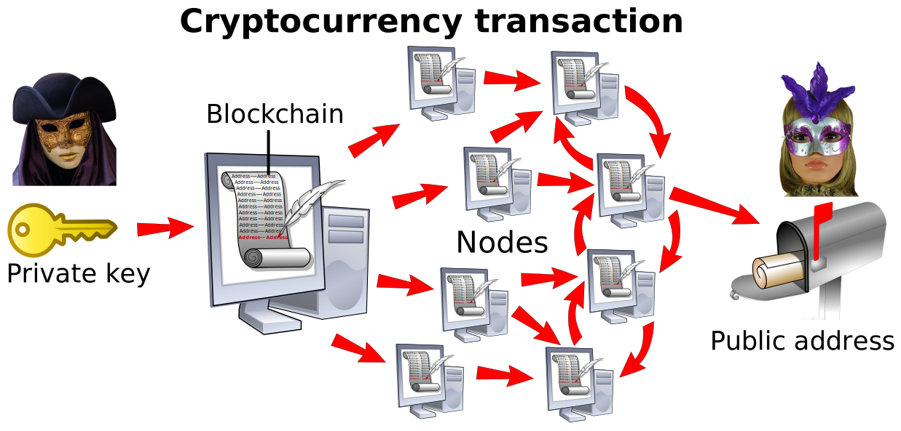

# 내 데이터는 내 것이다

_Web3가 여는 데이터 주권의 경제학_

## Executive Summary

> [!callout]
> AI 학습 데이터 시장이 $2.8B에서 2030년 $7-8B으로 성장하는 가운데, Web3 기술(DataDAO, DePIN, Proof-of-Contribution)이 데이터 소유권을 플랫폼에서 개인과 커뮤니티로 이전하는 구조적 전환이 진행 중이다. 데이터 브로커 시장 **$291-313B**과 데이터 마켓플레이스 **$1.8B**의 170배 격차는 중개자가 가치를 포획하는 구조를 적나라하게 드러낸다. Web3는 이 구조를 소유권-거래-보상의 3중 메커니즘으로 재편하려 한다.

> DePIN이 이론에서 실물 경제로 진입했다. 4,180만 활성 디바이스, FY25 온체인 수익 $72M, DIMO(42.5만 차량)와 Helium(DAU 200만)이 VW, AT&T와 실제 파트너십을 확보했다. 반면 DataDAO는 소유권 모델은 증명했으나 수익 모델은 미검증이다. Vana의 300+ DataDAO, 130만 사용자에도 토큰 가치는 하락을 지속하며, 데이터 품질 검증 부재가 구조적 병목으로 부상했다.

> 결제 인프라(x402, AP2)는 정비되었으나, 에이전트가 신뢰할 수 있는 데이터를 식별하는 "품질 오라클" 계층이 비어 있다. Chainlink이 가격 피드 오라클이라면, 데이터 품질 피드 오라클이 에이전트 경제의 누락된 레이어다. 이것이 페블러스의 기회다.

4,180만

DePIN 활성 디바이스 (DePINscan)

300+

Vana DataDAO 배포 수, 사용자 130만

$47.1B

2030년 AI 에이전트 시장 전망 (CAGR 44.8%)

170x

데이터 브로커($313B) vs 마켓플레이스($1.8B) 격차

## 데이터는 누구의 것인가 — 소유권의 구조적 공백

*중앙집중형(A) vs 탈중앙형(B) 네트워크 구조. 데이터 소유권의 전환 방향을 보여준다. (CC BY-SA 4.0)*

데이터 경제의 가장 근본적인 질문부터 시작하자. 내가 매일 생산하는 데이터는 누구의 것인가? 법적으로 "데이터 소유"는 정의되지 않았다. EU Data Act는 접근, 사용, 이전 권리를 부여하되 "소유"라는 표현을 의도적으로 회피한다. Hohfeldian 재산권 이론 분석에 따르면, 이 회피는 의도적이다. 데이터의 비경합성(non-rivalrous) 때문에 전통적 소유권 개념을 그대로 적용할 수 없기 때문이다.

이 법적 공백이 시장에서 어떤 왜곡을 만드는지는 숫자로 확인된다. 글로벌 데이터 브로커 시장은 **$291-313B**(2025)에 달하지만, 순수 데이터 마켓플레이스 플랫폼 시장은 **$1.81-1.86B**에 불과하다. 170배 격차다. 브로커를 통한 불투명한 중개 거래는 활발하지만, 데이터 생산자가 직접 참여하는 투명한 시장은 형성되지 못한 것이다.

### 1.1 플랫폼이 수확하는 데이터 노동

Reddit은 Google에 연 $60M, OpenAI에 약 $70M(추정), 누적 $203M의 AI 라이선스 계약을 체결했다. Stack Overflow의 $115M 매출(+17%) 중 AI 라이선스 비중이 빠르게 증가하고 있다. 두 플랫폼 모두 사용자가 생산한 콘텐츠로 수익을 올리지만, 그 사용자에게 돌아가는 보상은 없다. Arrieta-Ibarra(2018)가 제안한 "데이터를 노동으로 취급" 프레임워크가 다시 주목받는 이유다.

### 1.2 AI 학습 데이터 수요 폭발

AI 학습 데이터셋 시장은 **$2.82-3.2B**(2024)에서 **$7.23-8.6B**(2030)으로 성장할 전망이다. 합성 데이터 시장은 CAGR 35-42%로 더 빠르게 팽창하고 있다. 데이터 라벨링 시장만 $2.23-3.77B 규모다. 데이터 수요가 폭발하는 시점에 "누가 이 데이터를 소유하는가"에 대한 합의가 없다는 것은 구조적 시한폭탄이다.

### 1.3 데이터 주권 프레임워크의 등장

Teichmann의 데이터 주권 3차원 모델은 현재 시장의 핵심 문제를 짚는다. "보호"(GDPR), "참여"(경제적 보상), "제공"(공공 이익) 중 시장은 "보호"만 논의하고 경제적 "참여"를 배제해왔다. EU Data Act, DGA(Data Governance Act), GAIA-X 등이 이 균형을 바로잡으려 하지만, 데이터 거버넌스 트릴레마(DGT)가 근본적 긴장으로 남아 있다. 권리 보호, 경제적 가치, 공공 이익을 동시에 만족시키기 어렵다는 것이다.

EU 소비자 대상 CNIL 조사에서 개인 데이터의 판매 의사가격은 **120-360유로/년**으로 나타났다. 35%는 어떤 가격에도 거부 의사를 밝혔다. 한국 데이터 산업은 **27.15조 원**(2023 확정)에서 **30.75조 원**(2024 추정)으로 성장 중이다.

> [!callout]
> **핵심 시사점:** 데이터 소유권의 법적 공백이 170배의 시장 비대칭을 만들었다. 플랫폼은 사용자 데이터로 수억 달러를 벌지만, 생산자에게는 한 푼도 돌아가지 않는다. Web3가 이 구조를 바꾸려 한다.

## Web3의 해법 — DataDAO, DePIN, Proof-of-Contribution

*블록체인 기반 거래 흐름: 발신자 → 블록체인 검증 → 수신자. 데이터 거래에도 동일한 투명성이 적용된다. (CC0)*

Web3는 데이터 소유권 공백을 세 가지 메커니즘으로 메우려 한다. 집합 소유(DataDAO), 분산 수집(DePIN), 기여 검증(Proof-of-Contribution)이다. 그러나 품질 검증과 거버넌스 중앙화가 구조적 한계로 남아 있다.

### 2.1 DataDAO: 커뮤니티가 데이터를 소유한다

DataDAO는 "블록체인 네이티브 데이터 협동조합"이다. Buehler의 분류 체계에서 데이터 협동조합, 트러스트, 커먼즈, 유니온 중 가장 프로그래머블한 모델에 해당한다. 데이터 기여자가 커뮤니티 금고에 데이터를 제출하고, 기여도에 비례한 토큰 보상을 받는다. 거버넌스는 토큰 투표로 운영된다.

MIT Pentland 연구팀은 플랫폼과 데이터 협동조합의 디지털 커먼즈 가치 창출을 비교 분석했고, Li는 공공 데이터 트러스트 모델에서 AI 훈련 데이터에 라이선스를 부여하고 수익을 공유하는 구조를 제안했다. 이론적 기반은 탄탄하다.

그러나 Kioupkiolis의 분석은 DAO 거버넌스의 구조적 문제를 경고한다. 참여 감소, 의사결정의 재중앙화, 환경 변화에 대한 적응 실패가 반복적으로 관찰된다. DataDAO 수가 증가한다고 거버넌스 품질이 따라가는 것은 아니다.

### 2.2 DePIN: 물리적 데이터 인프라의 분산화

DePIN(Decentralized Physical Infrastructure Networks)은 개인이 물리적 장비(대시캠, 핫스팟, GPS 센서 등)를 운영하고 토큰 보상을 받는 모델이다. Zichichi의 3축 분류(분산원장, 크립토경제, 물리 인프라)에 따르면, DePIN은 AI 관련 프로젝트가 전체의 **59.3%**를 차지한다.

DePIN의 핵심 인센티브 구조는 "시장 수요 이전에도 투기적 가치로 인프라 구축이 가능하다"는 것이다. 토큰 보상이 초기 참여자를 유인하고, 네트워크 효과가 발생하면 실질 수요가 따라오는 모델이다. 다만 금전적 인센티브만으로는 지속 불가능하며, 비금전적 인센티브(커뮤니티 소속감, 데이터 접근권)를 병행해야 효과적이라는 연구 결과가 있다.

### 2.3 Proof-of-Contribution과 데이터 가치 평가

Proof-of-Contribution은 데이터 기여를 검증하고 토큰으로 보상하는 메커니즘이다. 핵심 과제는 "기여의 가치를 어떻게 측정하느냐"다. Shapley 값 기반 데이터 가치 평가가 LLM 파인튜닝에서도 실용적 스케일로 계산 가능해졌다. 그러나 대부분의 Web3 프로젝트에서 품질 검증은 스키마 체크 수준에 머물러 있으며, ML 기여도 평가를 실전 적용하는 곳은 없다.

### 2.4 Compute-to-Data: 프라이버시 보존 거래

프라이버시 보존형 데이터 거래는 Web3 데이터 경제의 또 다른 축이다. SMPC(Secure Multi-Party Computation) + 블록체인, Compute-to-Data(C2D) 패턴은 데이터를 이동시키지 않고 연산을 데이터에 가져오는 모델이다. D2M 연구는 온체인 옥션 + 오프체인 연합학습 + 인센티브 호환 수익 공유를 결합한 프레임워크를 제시했다. ZKP(영지식 증명) 기반 검증 가능한 ML도 훈련, 테스트, 추론 전 과정의 검증 가능성을 확보하는 방향으로 발전 중이다.

> [!callout]
> **핵심 시사점:** Web3는 DataDAO(집합 소유), DePIN(분산 수집), Proof-of-Contribution(기여 검증)으로 데이터 소유권을 재편하려 한다. 그러나 토큰 인센티브가 데이터 "양"을 폭발시키는 동시에 저품질/위조 데이터 제출 인센티브도 만든다. 품질 검증이 구조적 빈칸이다.

## 프로젝트 지형도 — 누가 무엇을 짓고 있는가

2026년 현재, 제품-시장 적합성(PMF)을 확보한 프로젝트와 모델 검증 단계에 머문 프로젝트 간 격차가 분명히 벌어지고 있다. DePIN 시가총액은 피크 $19.2B에서 ~$9-10B로 조정되었고, 밸류에이션 멀티플은 1,000배 이상에서 10-25배 수익 기준으로 정상화되었다. 이 지형도에서는 9개 프로젝트를 3개 Tier로 분류하고, 각각의 작동 방식, 핵심 지표, 파트너십, 그리고 약점을 상세히 분석한다.

Tier 분류의 기준은 다음과 같다. **Tier 1(PMF 확보)**은 실물 경제 파트너십과 실거래 수익이 검증된 프로젝트다. 토큰 가격이 아닌 기업 고객의 반복 매출이 성장 엔진이다. **Tier 2(유망)**는 기술과 사용자 기반은 확보했으나 수익 모델이 아직 검증되지 않은 프로젝트다. 토큰 인센티브가 성장을 주도하며, 실물 수요로의 전환이 과제다. **Tier 3(초기/고전)**은 개념의 유효성은 인정되지만 시장 견인력이 약한 프로젝트로, 자금 소진 또는 비활성 상태에 놓여 있다.

다음 표는 주요 프로젝트를 Tier별로 정리한 것이다.

| Tier | 프로젝트 | 핵심 지표 | 수익 신호 |
| --- | --- | --- | --- |
| Tier 1 (PMF) | DIMO | 42.5만+ 차량, 350% 성장 | Progressive/Liberty Mutual 보험, 50+ OEM |
| Tier 1 | Helium | DAU 200만, 구독 45만(300% YoY) | AT&T 파트너십, 텔레콤 수익 |
| Tier 1 | Hivemapper | 글로벌 도로 34%, 6.44억 km | VW 자율주행, Lyft |
| Tier 1 | Grass | 850만 사용자 | AI 훈련 데이터 판매 |
| Tier 1 | Numerai | 시리즈C $30M, 밸류 $500M | JP Morgan $500M 커밋 |
| Tier 2 (유망) | Vana | 300+ DataDAO, 130만 사용자 | 토큰 하락, 수익 모델 불명 |
| Tier 2 | io.net | GPU 32.7만, 수익 $20M+ | Agent Cloud 출시(2026.3) |
| Tier 2 | Ocean Protocol | Predictoor $2B 볼륨 | Enterprise v1 2026 Q3 성패 |
| Tier 3 (초기) | GenomesDAO | ATH -90.4% | 제약사 파트너십 제한적 |

### 3.1 DIMO — 내 차 데이터의 주인은 나다

DIMO는 차량 텔레매틱스 데이터의 소유권을 OEM(자동차 제조사)에서 운전자에게 돌려주는 프로젝트다. 작동 방식은 이렇다. 운전자가 하드웨어 디바이스(Macaron, AutoPi)를 차량에 장착하거나 Tesla를 직접 연동하면, 주행 데이터가 DIMO 네트워크로 수집된다. 보험사나 OEM이 이 데이터를 API로 구매하고, 운전자는 DIMO 토큰으로 보상받는다. 각 차량은 온체인 NFT로 표현되며, 소유자가 데이터 공유 권한을 직접 통제한다.

핵심 차별화는 전통 텔레매틱스 시장과의 비교에서 드러난다. Verisk, LexisNexis 같은 기존 데이터 브로커는 OEM에서 데이터를 가져와 운전자 동의 없이 보험사에 판매한다. GM의 집단소송 사례가 이 구조의 문제를 적나라하게 보여주었다. DIMO는 운전자가 직접 동의하고 보상받는 모델로 이를 뒤집는다.

지표는 인상적이다. **18만 이상** 연결 차량(42.5만 이상 궤적), Tesla **2만 대 이상**, **50개 이상** OEM 통합을 달성했다. Progressive와 Liberty Mutual(보험), Ownli(보험 절감), Grupo Kaufmann(중남미 딜러), Toyota Blockchain Lab(일본)과 파트너십을 확보했다. 그러나 전통 텔레매틱스 시장의 수억 대 규모와 비교하면 아직 소규모이며, 하드웨어 비용과 설치 마찰이 대중화의 병목으로 남아 있다.

### 3.2 Helium — 탈중앙 통신망이 AT&T를 만났다

Helium은 개인이 핫스팟을 설치하여 Wi-Fi와 모바일 커버리지를 제공하고 HNT 토큰 보상을 받는 탈중앙 통신 네트워크다. 2023년 4월 Solana 마이그레이션을 완료하면서 확장성 문제를 해결했고, 그 이후 성장세가 가팔라졌다.

결정적 전환점은 AT&T 파트너십이다. **1.18억** AT&T 가입자가 Helium 핫스팟에 Passpoint 기술로 자동 접속할 수 있게 되면서, 토큰 투기가 아닌 실물 텔레콤 수익이 발생하기 시작했다. Helium Mobile은 원래 월 $20 무제한 요금제로 출발했으나, 2026년 1월 월 $15 Air Plan으로 재편했다.

지표를 보면, **38.5만** 핫스팟이 배치되었고, DAU(일일 활성 사용자)는 2025년 11월 **200만**을 처음 돌파했다. 구독자는 **45만**(전년 대비 300% 성장)에 달한다. 2025년 4월 SEC가 HNT, MOBILE, IoT 토큰을 증권이 아닌 것으로 판단하면서 규제 불확실성도 상당 부분 해소되었다. 다만 요금제 재편은 유닛이코노믹스 문제를 시사하며, 도시 밖 커버리지 불균형이 약점이다.

### 3.3 Hivemapper — 구글 스트리트뷰를 5배 속도로 추월하다

Hivemapper는 대시캠으로 크라우드소싱 지도를 만드는 프로젝트다. 운전자가 Bee 대시캠(월 $19 구독)을 장착하면, 주행 중 도로 영상이 자동으로 촬영되고 AI가 이를 구조화된 지도 데이터로 가공한다. 기업 고객이 이 데이터를 구매하고, 기여자는 HONEY 토큰으로 보상받는다.

결과는 놀랍다. 글로벌 도로의 **34%**를 매핑하여 **6.44억 km**를 커버했고, **10만 대 이상**의 대시캠이 활동 중이다. Google Street View 대비 **5배 빠른 갱신 속도**가 핵심 경쟁력이다. VW의 자율주행 디비전 ADMT가 2026년 자율주행 플릿에 Hivemapper 데이터를 활용하기로 했고, Lyft는 라우팅에, Pantera Capital은 $32M을 투자했다. 2026년 1월 출시한 Bee Maps MCP는 AI 에이전트가 자연어로 도로 정보를 쿼리할 수 있게 하여, 에이전트 경제와의 접점도 열었다.

약점은 월 $19의 지속 비용이 참여 마찰로 작용한다는 것, 개발도상국 커버리지가 부족하다는 것, 그리고 카메라 품질 편차로 인한 데이터 균일성 문제가 있다는 것이다.

### 3.4 Grass — 8백만 사용자의 유휴 대역폭이 AI를 훈련시킨다

Grass는 가장 단순한 참여 모델로 가장 큰 사용자 기반을 확보한 프로젝트다. 사용자가 브라우저 확장 프로그램을 설치하면, 유휴 인터넷 대역폭이 네트워크 노드로 제공된다. 기관 고객(주로 AI 연구소)이 이 네트워크를 웹 스크래핑과 AI 학습 데이터 수집에 활용하고, 기여자는 GRASS 토큰으로 보상받는다. 중요한 점은 개인 브라우징 데이터는 수집하지 않으며, ZK(영지식) 기술로 데이터 수집의 진본 여부를 검증한다는 것이다.

규모가 압도적이다. **850만** 사용자, **250만 이상** 활성 노드, **190개 이상** 국가에서 일일 약 **100TB**의 데이터를 스크래핑한다. $10M 펀딩(Polychain Capital, Tribe Capital)을 유치했고, 시즌2 에어드롭이 2026년 4월 29일로 예정되어 있다. 유사 프로젝트 Swash와의 차이점은 명확하다. Swash는 개인 브라우징 행동 데이터를 수집하지만, Grass는 대역폭만 공유한다.

약점은 사용자가 출구 노드(exit node) 역할을 하게 되어 IP 주소 노출에 따른 법적 리스크가 존재한다는 것, 그리고 에어드롭 이후의 사용자 리텐션이 아직 미지수라는 것이다. 대역폭 공유 모델의 지속 가능성은 에어드롭 보상이 끝난 후에 판가름 날 것이다.

### 3.5 Numerai — 3만 명의 데이터 과학자가 운영하는 헤지펀드

Numerai는 Web3 데이터 프로젝트 중 가장 독특한 모델을 가지고 있다. 난독화된 금융 데이터셋을 무료로 제공하고, 전 세계 데이터 과학자들이 ML 모델을 제출한다. 참가자는 NMR 토큰을 스테이킹하며, 모델 성과가 좋으면 주당 최대 25%의 보상을 받고, 나쁘면 스테이크가 소각된다. 수천 개의 개별 모델이 메타모델로 결합되어 글로벌 주식 펀드를 운용한다.

실적이 이 모델의 유효성을 증명한다. **1,000라운드**를 완료했고, **3만 이상**의 참가자가 매주 **1,200개 이상**의 스테이킹 모델을 제출한다. 2024년 플래그십 펀드 수익률은 **25.45%**(역대 최고)를 기록했다. 운용 자산(AUM)은 $60M에서 **$550M**으로 급증했고, 시리즈C $30M(밸류 $500M), JP Morgan의 **$500M** 용량 커밋을 확보했다.

데이터 소유권 관점에서 Numerai의 모델은 특이하다. 과학자는 자신이 만든 모델을 소유하지만, 기초 데이터는 소유하지 않는다. 지적재산(모델) 소유권과 데이터 소유권이 분리된 구조다. 약점으로는 난독화된 데이터라 참가자가 예측 대상을 독립적으로 검증할 수 없다는 것, 그리고 주당 25%의 스테이크 소각이 상당한 진입장벽이 된다는 것이다.

### 3.6 Vana — DataDAO라는 원형을 만든 프로젝트

MIT Media Lab 출신 팀이 설립한 Vana는 2024년 12월 메인넷을 런칭한 L1 블록체인이다. DataDAO 개념의 실질적 원형을 만들었다는 점에서 이 지형도에서 중요한 위치를 차지한다. 작동 방식은 이렇다. 커뮤니티가 특정 유형의 데이터(Reddit 게시물, Spotify 이력, 유전체 데이터 등)를 풀링하고, Proof-of-Contribution 기반으로 기여도를 검증한 뒤 토큰을 보상으로 지급한다. 이렇게 모인 데이터를 AI 학습용으로 판매하는 것이 수익 모델이다.

지표상으로는 **300개 이상**의 DataDAO가 배포되었고, **130만** 사용자, **1,270만** 데이터 포인트가 수집되었다. Reddit DataDAO(r/datadao)만 **14만 커밋**에 달한다. 그러나 토큰 $VANA는 ~$1.38-1.41 수준으로, 사상 최고가(ATH) 대비 크게 하락했다. 시가총액은 약 $42M이다.

Vana의 딜레마는 Web3 데이터 경제의 구조적 과제를 요약한다. DataDAO 모델의 소유권 증명은 성공했으나, 수익 모델이 검증되지 않았다. 토큰 가치 하락은 참여 인센티브를 약화시키고, 이는 다시 데이터 기여 감소로 이어지는 악순환의 가능성을 안고 있다.

### 3.7 io.net — 분산 GPU가 에이전트를 위한 클라우드가 되다

io.net은 유휴 GPU(데이터센터, 크립토 마이너, 개인 보유)를 집계하여 AI 컴퓨트 마켓플레이스를 운영하는 프로젝트다. 데이터 그 자체가 아닌 데이터 처리 인프라를 분산화한다는 점에서, 데이터 소유권 프로젝트의 보완재 역할을 한다.

검증된 GPU가 **32.7만**(2025년 3월 기준)이며, 총 집계 GPU는 **100만 이상**에 달한다. 연환산 수익은 **$20M 이상**이다. 2026년 3월 출시한 Agent Cloud는 AI 에이전트 전용 컴퓨트 인프라로, MCP 라이브러리를 통합하여 에이전트가 직접 GPU 자원을 소싱하는 시나리오를 열었다. IDE(Incentive Dynamic Engine)는 실시간 GPU 사용량에 따라 토큰 공급을 동적으로 조정하는 메커니즘이다.

약점은 두 가지다. GPU 공급량 검증에 대한 논란이 분석가들에 의해 제기되었고, 엔터프라이즈 수준의 안정성과 SLA(서비스 수준 협약)가 아직 검증되지 않았다.

### 3.8 Ocean Protocol — 데이터 마켓의 원조가 위기를 넘는다

2017년에 설립된 Ocean Protocol은 최초의 탈중앙 데이터 마켓 프로토콜이라는 선발 이점을 가진다. 핵심 기술인 Compute-to-Data(C2D)는 데이터를 이동시키지 않고 연산을 데이터에 보내는 프라이버시 보존형 거래 모델로, 2절에서 다룬 Web3 데이터 거래의 기술적 기반을 실제로 구현한 프로젝트다.

Predictoor 제품은 **$2B** 볼륨을 기록했고, **70개 이상** 국가에서 **140만 이상**의 노드가 활동 중이다. 그러나 2025년 10월 ASI Alliance(Fetch.ai, SingularityNET)에서 탈퇴하면서 $120M 정산과 함께 유동성 타격을 받았다. 이 결정은 Ocean이 Alliance 방향과 독립적인 엔터프라이즈 전략을 추구하겠다는 의지를 보여주지만, 단기적으로는 시장 신뢰를 약화시켰다.

2026년 Q3로 예정된 **Ocean Enterprise v1**이 이 프로젝트의 성패를 가를 분기점이다. 8년간의 기술 축적이 기업용 데이터 거래 플랫폼으로 결실을 맺느냐, 아니면 선발 이점을 후발 프로젝트에 내주느냐가 결정된다.

### 3.9 GenomesDAO와 실패의 교훈

GenomesDAO는 개인 유전체 데이터를 암호화 보관하고, 연구 동의를 기반으로 보상을 제공하는 프로젝트였다. 개념의 유효성은 부정할 수 없다. 23andMe의 파산과 유전체 데이터 유출 사태는 개인이 자신의 유전 정보를 통제해야 할 필요성을 극적으로 보여주었다. 그러나 토큰은 ATH 대비 **-90.4%** 하락했고, 24시간 거래량은 약 $99에 불과하다. 사실상 비활성 상태다.

GenomesDAO만의 문제가 아니다. 2026년 Q1에 Polynomial, ZeroLend, Parsec 등이 폐쇄되었다. 게이밍 dApp **300개 이상**이 2025년 Q2에 비활성화되었고, X(구 Twitter) API 정책 변경으로 InfoFi 프로젝트들이 데이터 소스 자체를 잃었다.

이 사례들이 남긴 교훈은 세 가지로 정리된다. 첫째, **토큰 인센티브만으로는 지속 불가능하다.** 실물 수요 없이 토큰 가격에 의존하면 하락장에서 생존하지 못한다. 둘째, 니치 시장(유전체 데이터 같은)은 PMF까지 도달하는 시간이 길어 자금 소진 위험이 크다. 셋째, 외부 플랫폼(X API 등)에 데이터 소스를 의존하는 모델은 정책 변경 하나로 무너질 수 있다.

> [!callout]
> **핵심 시사점:** DePIN 생태계가 투기에서 실물 경제로 이행하고 있다. 밸류에이션은 1,000배에서 10-25배 수익 멀티플로 정상화되었고, 기업 파트너십이 생존의 분기점이다. DIMO, Helium, Hivemapper는 각각 보험, 텔레콤, 자율주행이라는 실물 수요를 확보했고, Numerai는 $550M AUM으로 금융 데이터의 크라우드소싱 모델을 검증했다. 반면 Vana와 Ocean은 기술과 사용자 기반에도 불구하고 수익 모델 전환이 과제이며, GenomesDAO의 사실상 비활성은 토큰 의존 모델의 한계를 보여준다. 이 모든 프로젝트에 공통적으로 부재한 것은 데이터 품질 인증 레이어다.

## 규제가 그리는 경계선 — 데이터 주권과 Web3의 긴장

각국 규제는 Web3 데이터 소유권 모델의 촉진제이면서 동시에 제약 조건이다. EU Data Act(2025.9 시행)이 데이터 접근권을 법제화하면서 분산 소유 모델에 힘을 실어주지만, 토큰의 증권 분류 가능성은 규제 장벽이 된다.

### 4.1 EU: 데이터 주권의 법제화

디지털 주권 4모델 분류에서 EU는 "권리 기반" 모델의 대표다. EU Data Act의 핵심 의무는 2025년 9월 12일 시행되었고, 제품 설계 의무는 2026년 9월 12일, 클라우드 전환 의무는 2027년 1월 12일에 순차 발효한다. 위반 시 글로벌 매출의 **4-5%**가 벌금으로 부과된다.

GAIA-X는 회원 **350+**(공식 확인)로 유럽 데이터 공간 표준화를 추진 중이다. DGA(Data Governance Act)는 "데이터 이타주의(data altruism)" 개념을 도입하여 개인이 공공 이익을 위해 자발적으로 데이터를 제공하는 법적 프레임워크를 만들었다. 이 규제 생태계는 Web3의 커뮤니티 기반 데이터 소유 모델과 구조적으로 양립 가능하다.

### 4.2 한국: MyData 2.0과 데이터 산업

한국은 데이터 3법(2020) 이후 MyData 2.0을 2025년 6월 시행했다. **1.65억 건**의 데이터가 연결되었고, KakaoPay 가입자만 **2,000만**에 달한다. KDX(한국거래소) 데이터 마켓플레이스 전환 추진, 데이터바우처 사업의 높은 경쟁률은 데이터 거래 인프라에 대한 수요를 보여준다.

### 4.3 미국과 싱가포르: 시장 지향 접근

미국은 연방 데이터 프라이버시법이 부재한 상태에서 **19개 주**가 개별 프라이버시법을 시행 중이다. 그러나 SEC 의장 Atkins는 ETHDenver 2026에서 토큰화와 DePIN에 대한 no-action letter 발행을 시사했다. 싱가포르는 PDPA와 데이터 혁신 샌드박스를 병행하며, DAO의 법적 인정은 Wyoming(2021), Marshall Islands(2022), UAE RAK 등에서 진행되고 있다.

Gartner는 **25%**의 기업이 2027년까지 Web3 서비스를 사용할 것으로 전망한다. 규제 불확실성은 남아 있지만, 추세는 명확하다. "데이터 접근권의 법제화"는 전 세계적으로 확산되고 있다.

> [!callout]
> **핵심 시사점:** EU Data Act가 데이터 접근을 의무화하면서 품질 인증의 법적 수요가 생겼다. ISO/IEC 5259 + Web3 출처 증명의 결합은 규제 준수와 시장 신뢰를 동시에 충족하는 포지션이다.

## 에이전트가 데이터를 사는 세상 — Agent Economy와 Web3 데이터 레이어

AI 에이전트 시장은 $5.1B(2024)에서 **$47.1B**(2030)으로 성장할 전망이다(CAGR 44.8%). M2M 서비스 시장은 **$164.2B**(2030, CAGR 25.5%)에 달한다. 에이전트가 자율적으로 데이터를 사고파는 경제가 현실로 다가오고 있다.

### 5.1 결제는 정비되었다. 부족한 것은 신뢰 구조다

에이전트 경제의 결제 인프라는 빠르게 갖춰지고 있다. Coinbase의 [x402 프로토콜](/blog/x402-protocol-ai-payment-2026/ko/)은 HTTP 402 상태 코드를 활용한 M2M 결제를 표준화했고, Google의 [AP2(Agent Payment Protocol)](/blog/google-ap2-agent-payment-protocol-2025/ko/)는 신뢰 기반 에이전트 결제를 구현했다. [스테이블코인 인프라](/blog/stablecoin-data-ai-agent-economy-2026/ko/)도 정비 중이다. 결제 프로토콜의 상세는 각각의 분석 글에서 다루고 있으므로 여기서는 반복하지 않는다.

핵심은 이것이다. "어떻게 결제하느냐"는 해결되고 있지만, **"무엇을 신뢰하고 사느냐"**는 여전히 열려 있다. The Graph API 사용자 중 **37%**가 이미 AI 에이전트다. 에이전트가 자율적으로 데이터를 소싱하는 세상에서, 거래 대상의 품질과 출처를 검증하는 "신뢰 구조"가 없다.

### 5.2 DataDAO와 DePIN이 에이전트 데이터 공급망이 된다

에이전트 경제의 5계층 아키텍처에서 "데이터 자산 레이어"는 결제 인프라와 데이터 소싱 사이에 위치한다. DataDAO는 에이전트의 데이터 소싱 채널이 되고, DePIN은 실시간 데이터 공급망이 된다.

구체적으로, DIMO의 차량 데이터를 자율주행 에이전트가 직접 구매하거나, Hivemapper의 최신 지도 데이터를 배송 에이전트가 실시간으로 소싱하는 시나리오가 가능하다. AI Agent 크립토 프로젝트는 이미 **550+**에 달하며, 합산 시가총액은 **$4.34B**이다. io.net은 2026년 3월 Agent Cloud를 출시하여 AI 에이전트용 컴퓨트 인프라를 제공하기 시작했다.

### 5.3 누락된 레이어: 데이터 품질 증명

IBis 연구는 블록체인 기반 AI 훈련 데이터 출처 추적(데이터셋과 모델의 양방향 추적)을 제안했고, Longpre는 현재 데이터 출처 프레임워크의 근본적 부적절성을 지적했다. "인증, 동의, 크레딧, 보상" 모두 깨져 있다는 것이다.

데이터 품질 증명, 소유권 증명, 자동 결제를 잇는 풀스택이 완성되어야 에이전트 데이터 거래가 실질적으로 작동한다. 결제 계층은 x402와 AP2가 담당하고, 데이터 소싱은 DataDAO와 DePIN이 담당한다. 그러나 이 둘 사이의 "신뢰 브릿지" 역할을 하는 **품질 증명 계층**이 비어 있다. 기존 [데이터 가치 증명 보고서](/report/data-value-proof/ko/)에서 분석한 "진단-보완-증명" 파이프라인이 이 빈칸의 해법이다.

> [!callout]
> **핵심 시사점:** 에이전트 경제에서 데이터 거래의 속도는 밀리초 단위가 된다. 결제 인프라(x402, AP2)와 데이터 소싱(DataDAO, DePIN) 사이에 "품질 증명"이라는 신뢰 브릿지가 필요하다. 이것이 에이전트 경제의 누락된 레이어다.

## 페블러스 관심의 이유 — 데이터 품질 오라클

본 보고서에서 분석한 소유권 전환, 프로젝트 지형, 규제 환경, 에이전트 경제의 네 흐름이 하나의 교차점으로 수렴한다. 토큰 인센티브가 데이터 양을 폭발시키지만, 품질은 검증되지 않는다. 대부분 프로젝트의 검증은 스키마 체크 수준에 머물러 있다. 이 구조적 빈칸이 페블러스의 기회다.

### 비즈니스 연결: 4개 솔루션의 Web3 포지션

다음 표는 페블러스 솔루션이 Web3 데이터 생태계에서 어떤 역할을 수행하는지 정리한 것이다.

| 솔루션 | Web3 생태계 역할 | 해결하는 문제 |
| --- | --- | --- |
| DataClinic | 품질 인증서 | 토큰 인센티브로 인한 저품질 데이터 유입 |
| AI-Ready Data | AI 적합성 검증 | 크라우드소싱 데이터의 ML 적합성 미보장 |
| Data Greenhouse | 분산 데이터 정제소 | DataDAO 데이터의 통합과 정제 |
| PebbloSim | 합성 데이터 보완 | DataDAO 데이터의 결손과 편향 |

### 포지셔닝: Chainlink이 가격이라면, 페블러스는 품질이다

Chainlink은 온체인 가격 피드 오라클로 DeFi 생태계의 신뢰 기반이 되었다. 같은 논리로, DataDAO/DePIN 데이터의 AI-Ready 품질 점수를 온체인에 기록하는 **"데이터 품질 오라클"**이 Web3 데이터 생태계의 신뢰 기반이 될 수 있다. ISO/IEC 5259 + Web3 출처 증명의 결합은 규제 준수와 시장 신뢰를 동시에 충족한다.

### 시장 기회의 규모

합성 데이터 시장은 CAGR 35-42%로 성장 중이며, 기업 데이터 수익화 시장은 $4.78-5.22B(2025)에서 **$48.55B**(2035)로 확대될 전망이다. 기업의 데이터 수익화 채택률은 **68%**에 달한다. DePIN 스타트업만 2025년에 $1B 펀딩을 유치했다. 이 모든 시장에서 품질 검증 파트너에 대한 수요가 증가하고 있다.

DIMO(차량 데이터)와 Hivemapper(매핑 데이터)가 AI 학습 데이터로 전용될 때, 품질 검증은 선택이 아니라 필수다. KDX 데이터 마켓플레이스 전환과 데이터바우처 사업에서도 "데이터 가격 산정 기준"의 기술적 해법이 요구된다. 데이터 거버넌스 트릴레마에서 "경제적 가치"와 "권리 보호" 사이의 "품질 보증" 계층이 바로 페블러스의 위치다.

> [!callout]
> Web3 데이터 경제는 소유권(DataDAO), 수집(DePIN), 결제(x402/AP2)를 갖추었지만, 품질 검증이 빠져 있다. 토큰 인센티브가 만드는 양과 품질의 딜레마를 해결하는 "데이터 품질 오라클"이 생태계의 신뢰 기반이 될 것이다. 페블러스의 진단-보완-증명 파이프라인이 그 역할을 수행할 수 있다.

## 자주 묻는 질문

Web3 데이터 소유권, DataDAO, DePIN, 에이전트 경제에 관한 핵심 질문과 답변을 정리했다.

## 참고문헌

### 논문 및 학술 자료

1. Teichmann et al., ["Data Sovereignty in Information Systems"](https://link.springer.com/article/10.1007/s12525-024-00693-4), _Electronic Markets_, 2024
2. [Hohfeldian 재산권 이론 기반 EU Data Act IoT 데이터 권리 분석](https://link.springer.com/article/10.1007/s10657-023-09791-8), _European Journal of Law and Economics_, 2024
3. [디지털 주권 4모델 분류](https://link.springer.com/article/10.1007/s44206-024-00146-7), _Digital Society_, 2024
4. Buehler et al., ["Data Cooperatives: Democratic Models for Ethical Data Stewardship"](https://arxiv.org/abs/2504.10058), arXiv, 2025
5. Buehler, Calzada, Pentland et al., ["Data Cooperatives as Catalysts for Collaboration"](https://papers.ssrn.com/sol3/papers.cfm?abstract_id=4413371), SSRN, 2023
6. Stuermer et al., ["Data Governance Trilemma"](https://link.springer.com/article/10.1007/s44206-023-00058-y), _Digital Society_, 2023
7. Li et al., ["Reclaiming the Digital Commons: A Public Data Trust for Training Data"](https://dl.acm.org/doi/10.1145/3600211.3604658), AAAI/ACM AIES, 2023
8. Kioupkiolis et al., ["DAOs of Collective Intelligence?"](https://arxiv.org/abs/2409.01823), arXiv, 2024
9. Vipra & Mahari, ["The Economics of AI Training Data"](https://arxiv.org/abs/2510.24990), arXiv, 2025
10. Arrieta-Ibarra et al., ["Should We Treat Data as Labor?"](https://www.aeaweb.org/articles?id=10.1257/pandp.20181003), _AEA Papers and Proceedings_, 2018
11. Zichichi et al., ["DePIN: Challenges and Opportunities"](https://ieeexplore.ieee.org/document/10737386/), _IEEE Network_, 2024
12. [DePIN vs 중앙화 클라우드 성능 분석](https://arxiv.org/abs/2404.08306), arXiv, 2024
13. [일반화된 DePIN 프로토콜 프레임워크](https://arxiv.org/abs/2311.00551), arXiv, 2023
14. Bhatia et al., ["Decentralized Private Data Marketplace using SMPC"](https://dl.acm.org/doi/10.1145/3652162), _ACM TOPS_, 2024
15. ["BlockDaSh: Blockchain-Empowered Trustworthy Data Sharing"](https://dl.acm.org/doi/10.1145/3718082), _ACM Computing Surveys_, 2025
16. ["D2M: Decentralized, Privacy-Preserving Data Marketplace"](https://arxiv.org/pdf/2512.10372), arXiv, 2025
17. ["Data Sharing with Incentive and Optimization: A Survey"](https://link.springer.com/article/10.1007/s44248-024-00006-2), _Discover Data_, 2024
18. Baghcheband et al., ["Shapley Value-Based Data Valuation for ML Markets"](https://link.springer.com/article/10.1007/s42452-025-07328-z), _Discover Applied Sciences_, 2025
19. Akbar et al., ["IBis: Leveraging Blockchain for AI Copyrights and Provenance"](https://arxiv.org/abs/2404.06077), arXiv, 2024
20. ["Enhancing Data Provenance in AI with Blockchain: Quality Model"](https://link.springer.com/article/10.1007/s40012-025-00419-7), _CSI Transactions_, 2025
21. Longpre et al., ["Data Authenticity, Consent, & Provenance for AI are all Broken"](https://arxiv.org/pdf/2404.12691), arXiv, 2024
22. ["ZKP-based Verifiable Decentralized ML: Comprehensive Survey"](https://arxiv.org/abs/2310.14848), arXiv, 2025

### 업계 보고서 및 데이터

1. [Grand View Research](https://www.grandviewresearch.com/industry-analysis/data-broker-market-report) — 데이터 브로커 시장 $291-313B(2025), 마켓플레이스 $1.81-1.86B
2. [Grand View / Straits Research](https://www.grandviewresearch.com/press-release/global-ai-training-dataset-market) — AI 훈련 데이터셋 $2.82-3.2B(2024) → $7.23-8.6B(2030)
3. [MarketsandMarkets](https://www.prnewswire.com/news-releases/ai-agents-market-worth-47-1-billion-by-2030---exclusive-report-by-marketsandmarkets-302246356.html) — AI 에이전트 시장 $5.1B → $47.1B(2030), CAGR 44.8%
4. Research & Markets — M2M 서비스 시장 $164.2B(2030), CAGR 25.5%
5. [Messari State of DePIN 2025](https://messari.io/report/state-of-depin-2025) — FY25 온체인 수익 $72M, 스타트업 펀딩 ~$1B
6. [DePINscan](https://depinscan.io) — 활성 디바이스 4,180만
7. [CoinGecko DePIN](https://www.coingecko.com/en/categories/depin) — 시가총액 ~$9-10B(현재), 피크 $19.2B
8. Han et al., ["DAO Governance"](https://papers.ssrn.com/sol3/papers.cfm?abstract_id=4346581) — DAO 총 재무 $24.5B, 13,000+ DAO
9. [Vana 공식](https://www.vana.org/posts/datadao-deepdive) — 300+ DataDAO, 130만 사용자, 1,270만 데이터 포인트
10. [DappRadar](https://dappradar.com/blog/best-ai-coins-dapps-projects-web3-blockchain-industry) — AI Agent 크립토 550+, 합산 시가총액 $4.34B
11. [TechCrunch](https://techcrunch.com/2024/02/22/reddit-says-its-made-203m-so-far-licensing-its-data/) — Reddit AI 라이선스 누적 $203M
12. [CNIL France](https://www.cnil.fr/en/monetisation-personal-data-how-much-our-data-worth) — EU 소비자 개인 데이터 판매 의사가격 €120-360/년
13. [KDATA(한국데이터산업진흥원)](https://www.kdata.or.kr/) — 한국 데이터 산업 27.15조 원(2023) → 30.75조 원(2024 추정)
14. [금융위원회](https://www.fsc.go.kr/no010101/84780) — MyData 2.0 1.65억 건 연결, KakaoPay 가입자 2,000만
15. [IAPP](https://iapp.org/resources/article/us-state-privacy-legislation-tracker) — 미국 19개 주 프라이버시법 시행, 연방법 부재
16. Gartner — 25% 기업 2027까지 Web3 서비스 사용 예측
17. [Clifford Chance](https://www.cliffordchance.com/insights/resources/blogs/talking-tech/en/articles/2025/09/eu-data-act--a-new-era-for-data-sharing-has-begun.html) — EU Data Act 벌금 매출 4-5%
18. [House of Chimera / ETHNews](https://www.ethnews.com/the-depin-sector-now-has-over-650-active-projects-the-march-2026-landscape-shows-where-the-build-is-happening/) — DePIN 활성 프로젝트 650+
19. [Precedence Research](https://www.precedenceresearch.com/data-monetization-market) — 기업 데이터 수익화 $4.78-5.22B(2025) → $48.55B(2035)
20. [InsightAce](https://www.insightaceanalytic.com/report/web-30-blockchain-market/1635) — Web3 블록체인 시장 $2.7B → $114.9B(2034), CAGR 45.6%
